# Application Portfolio Master Reference

## Techbridge University College — Complete App Catalogue

**Total Applications:** 286  
**React/Vite Frontends:** 267  
**Node.js/Express Backends:** 17  
**Java/Spring Boot Services:** 2  
**Docker Coverage:** 283/286 (98%)  
**Last Updated:** March 29, 2026  

---

## Contents

- [AI & Machine Learning (45)](#ai-machine-learning)
- [Analytics & Monitoring (22)](#analytics-monitoring)
- [Digital Twin & Simulation (18)](#digital-twin-simulation)
- [Healthcare & Medical (6)](#healthcare-medical)
- [Education & Learning (18)](#education-learning)
- [Financial & Risk (10)](#financial-risk)
- [Security & Compliance (6)](#security-compliance)
- [Infrastructure & DevOps (6)](#infrastructure-devops)
- [Sentinel Systems (5)](#sentinel-systems)
- [Techbridge Projects (16)](#techbridge-projects)
- [Grooverx (1)](#grooverx)
- [Business & Operations (10)](#business-operations)
- [Other Applications (123)](#other-applications)

---

## A-Z Index

| # | Application | Category | Stack | Docker |
|---|-------------|----------|-------|--------|
| 1 | [6r Product Design Workshop Portal](#6r-product-design-workshop-portal) | Other Applications | React/Vite | ✅ |
| 2 | [Academic Integrity Detector](#academic-integrity-detector) | Education & Learning | React/Vite | ✅ |
| 3 | [Academic Performance App](#academic-performance-app) | Analytics & Monitoring | React/Vite | ✅ |
| 4 | [Accommodation Management](#accommodation-management) | Other Applications | Node.js/Express | ✅ |
| 5 | [Adaptive Curriculum Engine](#adaptive-curriculum-engine) | Education & Learning | React/Vite | ✅ |
| 6 | [Agent Collaboration Framework](#agent-collaboration-framework) | Other Applications | React/Vite | ✅ |
| 7 | [Agenticai Masterclass](#agenticai-masterclass) | AI & Machine Learning | React/Vite | ✅ |
| 8 | [AI Code Reviewer](#ai-code-reviewer) | AI & Machine Learning | React/Vite | ✅ |
| 9 | [AI Email Drafter](#ai-email-drafter) | AI & Machine Learning | React/Vite | ✅ |
| 10 | [AI Exam Generator](#ai-exam-generator) | AI & Machine Learning | React/Vite | ✅ |
| 11 | [AI Explainability Console](#ai-explainability-console) | AI & Machine Learning | React/Vite | ✅ |
| 12 | [AI Flyer Generator](#ai-flyer-generator) | AI & Machine Learning | React/Vite | ✅ |
| 13 | [AI Governance Analytics Hub](#ai-governance-analytics-hub) | AI & Machine Learning | React/Vite | ✅ |
| 14 | [AI Knowledge Compression Lab](#ai-knowledge-compression-lab) | AI & Machine Learning | React/Vite | ✅ |
| 15 | [AI Legal Clause Analyzer](#ai-legal-clause-analyzer) | AI & Machine Learning | React/Vite | ✅ |
| 16 | [AI Log Pattern Analyzer](#ai-log-pattern-analyzer) | AI & Machine Learning | React/Vite | ✅ |
| 17 | [AI Marketplace Engine](#ai-marketplace-engine) | AI & Machine Learning | React/Vite | ✅ |
| 18 | [AI Music Arrangement Assistant](#ai-music-arrangement-assistant) | AI & Machine Learning | React/Vite | ✅ |
| 19 | [AI Portfolio Demonstrator](#ai-portfolio-demonstrator) | AI & Machine Learning | React/Vite | ✅ |
| 20 | [AI Resource Arbitrage Engine](#ai-resource-arbitrage-engine) | AI & Machine Learning | React/Vite | ✅ |
| 21 | [AI Risk Rebalancing Engine](#ai-risk-rebalancing-engine) | AI & Machine Learning | React/Vite | ✅ |
| 22 | [AI Scene Visualizer](#ai-scene-visualizer) | AI & Machine Learning | React/Vite | ✅ |
| 23 | [AI Skill Transfer Engine](#ai-skill-transfer-engine) | AI & Machine Learning | React/Vite | ✅ |
| 24 | [AI Stand Up Workshop Prep Dashboard](#ai-stand-up-workshop-prep-dashboard) | AI & Machine Learning | React/Vite | ✅ |
| 25 | [AI Strategy Recommender](#ai-strategy-recommender) | AI & Machine Learning | React/Vite | ✅ |
| 26 | [AI Studio Directives](#ai-studio-directives) | AI & Machine Learning | React/Vite | ✅ |
| 27 | [AI Studio Project Refresh Dashboard](#ai-studio-project-refresh-dashboard) | AI & Machine Learning | React/Vite | ✅ |
| 28 | [AI Techbridge](#ai-techbridge) | AI & Machine Learning | React/Vite | ✅ |
| 29 | [AI Transformation Framework](#ai-transformation-framework) | AI & Machine Learning | React/Vite | ✅ |
| 30 | [Ajumapro Sms](#ajumapro-sms) | Other Applications | React/Vite | ✅ |
| 31 | [Alumni Network](#alumni-network) | Other Applications | Node.js/Express | ✅ |
| 32 | [Analytics Refactor](#analytics-refactor) | Analytics & Monitoring | React/Vite | ✅ |
| 33 | [Ananse Cartoon Generator](#ananse-cartoon-generator) | Other Applications | React/Vite | ✅ |
| 34 | [API Monetization Portal](#api-monetization-portal) | Other Applications | React/Vite | ✅ |
| 35 | [Asanska Fashion Design Brochure](#asanska-fashion-design-brochure) | Other Applications | React/Vite | ✅ |
| 36 | [Asanska University College](#asanska-university-college) | Education & Learning | React/Vite | ✅ |
| 37 | [Aucdt Iam System](#aucdt-iam-system) | Techbridge Projects | React/Vite | ✅ |
| 38 | [Aucdt Msee Aptitude Test](#aucdt-msee-aptitude-test) | Techbridge Projects | React/Vite | ✅ |
| 39 | [Aucdt Quarto Presentation Editor](#aucdt-quarto-presentation-editor) | Techbridge Projects | React/Vite | ✅ |
| 40 | [Aucdt Sendmail API Tester](#aucdt-sendmail-api-tester) | Techbridge Projects | React/Vite | ✅ |
| 41 | [Aurelia v4   Working With Aurelia](#aurelia-v4---working-with-aurelia) | Other Applications | React/Vite | ✅ |
| 42 | [Auto Scaling Policy Engine](#auto-scaling-policy-engine) | Other Applications | React/Vite | ✅ |
| 43 | [Automated Compliance Monitor](#automated-compliance-monitor) | Analytics & Monitoring | React/Vite | ✅ |
| 44 | [Automated Rollback AI](#automated-rollback-ai) | Other Applications | React/Vite | ✅ |
| 45 | [Autonomous Audit Engine](#autonomous-audit-engine) | AI & Machine Learning | React/Vite | ✅ |
| 46 | [Autonomous Budget Allocator](#autonomous-budget-allocator) | AI & Machine Learning | React/Vite | ✅ |
| 47 | [Autonomous Compliance Enforcer](#autonomous-compliance-enforcer) | AI & Machine Learning | React/Vite | ✅ |
| 48 | [Autonomous Decision Optimizer](#autonomous-decision-optimizer) | AI & Machine Learning | React/Vite | ✅ |
| 49 | [Autonomous Incident Resolver](#autonomous-incident-resolver) | AI & Machine Learning | React/Vite | ✅ |
| 50 | [Autonomous Refactoring AI](#autonomous-refactoring-ai) | AI & Machine Learning | React/Vite | ✅ |
| 51 | [Autonomous Robotics Coordination Engine](#autonomous-robotics-coordination-engine) | AI & Machine Learning | React/Vite | ✅ |
| 52 | [Autonomous System Governance Core](#autonomous-system-governance-core) | AI & Machine Learning | React/Vite | ✅ |
| 53 | [Bias Detection Engine](#bias-detection-engine) | Other Applications | React/Vite | ✅ |
| 54 | [Biochemai v151120252049](#biochemai-v151120252049) | AI & Machine Learning | React/Vite | ✅ |
| 55 | [Bp Bulletproof Directive v22012026 1326](#bp-bulletproof-directive-v22012026-1326) | Other Applications | React/Vite | ✅ |
| 56 | [Brainiac Challenge](#brainiac-challenge) | Other Applications | React/Vite | ✅ |
| 57 | [Brand Guideline Checker](#brand-guideline-checker) | Other Applications | React/Vite | ✅ |
| 58 | [Brand Narrative Synthesizer](#brand-narrative-synthesizer) | Other Applications | React/Vite | ✅ |
| 59 | [Canary Release Manager](#canary-release-manager) | Other Applications | React/Vite | ✅ |
| 60 | [Carbon Credit Tracker](#carbon-credit-tracker) | Other Applications | React/Vite | ✅ |
| 61 | [Career Services](#career-services) | Other Applications | Node.js/Express | ✅ |
| 62 | [Cinematic Triptych Generator](#cinematic-triptych-generator) | Other Applications | React/Vite | ✅ |
| 63 | [City Digital Twin](#city-digital-twin) | Digital Twin & Simulation | React/Vite | ✅ |
| 64 | [Ckt Utas Modern Website](#ckt-utas-modern-website) | Other Applications | React/Vite | ✅ |
| 65 | [Class4 Digital Learning](#class4-digital-learning) | Education & Learning | React/Vite | ✅ |
| 66 | [Climate Impact Modeler](#climate-impact-modeler) | Other Applications | React/Vite | ✅ |
| 67 | [Climate Impact Twin](#climate-impact-twin) | Digital Twin & Simulation | React/Vite | ✅ |
| 68 | [Clipai](#clipai) | AI & Machine Learning | React/Vite | ✅ |
| 69 | [Cognitive Load Monitor](#cognitive-load-monitor) | Analytics & Monitoring | React/Vite | ✅ |
| 70 | [Commodity Price Forecast Engine](#commodity-price-forecast-engine) | Other Applications | React/Vite | ✅ |
| 71 | [Community Plates.v1](#community-plates.v1) | Other Applications | React/Vite | ✅ |
| 72 | [Complaint Resolution System](#complaint-resolution-system) | Other Applications | Node.js/Express | ✅ |
| 73 | [Compliance Workflow Dashboard](#compliance-workflow-dashboard) | Analytics & Monitoring | React/Vite | ✅ |
| 74 | [Container Health Auditor 2](#container-health-auditor-2) | Analytics & Monitoring | React/Vite | ✅ |
| 75 | [Countdown Timer](#countdown-timer) | Other Applications | React/Vite | ✅ |
| 76 | [Creativity Amplifier](#creativity-amplifier) | Other Applications | React/Vite | ✅ |
| 77 | [Creoai](#creoai) | AI & Machine Learning | React/Vite | ✅ |
| 78 | [Crisis Simulation AI](#crisis-simulation-ai) | Digital Twin & Simulation | React/Vite | ✅ |
| 79 | [Crop Yield Predictor](#crop-yield-predictor) | Other Applications | React/Vite | ✅ |
| 80 | [Cross App API Gateway](#cross-app-api-gateway) | Infrastructure & DevOps | React/Vite | ✅ |
| 81 | [Cross App Data Fabric](#cross-app-data-fabric) | Other Applications | React/Vite | ✅ |
| 82 | [Cross App Performance Synthesizer](#cross-app-performance-synthesizer) | Analytics & Monitoring | React/Vite | ✅ |
| 83 | [Cross App Search](#cross-app-search) | Other Applications | React/Vite | ✅ |
| 84 | [Cross Border Trade Optimizer](#cross-border-trade-optimizer) | Other Applications | React/Vite | ✅ |
| 85 | [Cross Industry Pattern Miner](#cross-industry-pattern-miner) | Other Applications | React/Vite | ✅ |
| 86 | [Cross System Stability Controller](#cross-system-stability-controller) | Other Applications | React/Vite | ✅ |
| 87 | [Cyber Threat Landscape Analyzer](#cyber-threat-landscape-analyzer) | Security & Compliance | React/Vite | ✅ |
| 88 | [Dadaist Concert Visualizer](#dadaist-concert-visualizer) | Other Applications | React/Vite | ✅ |
| 89 | [Data Anonymization Engine](#data-anonymization-engine) | Other Applications | React/Vite | ✅ |
| 90 | [Data Lineage Tracker](#data-lineage-tracker) | Other Applications | React/Vite | ✅ |
| 91 | [Decision Confidence Estimator](#decision-confidence-estimator) | Other Applications | React/Vite | ✅ |
| 92 | [Dependency Graph Visualizer](#dependency-graph-visualizer) | Infrastructure & DevOps | React/Vite | ✅ |
| 93 | [Deployment Drift Detector](#deployment-drift-detector) | Infrastructure & DevOps | React/Vite | ✅ |
| 94 | [Dictation App](#dictation-app) | Other Applications | React/Vite | ✅ |
| 95 | [Digital Identity Verifier](#digital-identity-verifier) | Security & Compliance | React/Vite | ✅ |
| 96 | [Digital Twin Builder](#digital-twin-builder) | Digital Twin & Simulation | React/Vite | ✅ |
| 97 | [Directive Workflow](#directive-workflow) | Business & Operations | React/Vite | ✅ |
| 98 | [Disaster Preparedness Simulator](#disaster-preparedness-simulator) | Digital Twin & Simulation | React/Vite | ✅ |
| 99 | [Disaster Response Allocator](#disaster-response-allocator) | Other Applications | React/Vite | ✅ |
| 100 | [Dmcdai Digital Media Communication Design](#dmcdai-digital-media-communication-design) | AI & Machine Learning | React/Vite | ✅ |
| 101 | [Dns Copy Utility](#dns-copy-utility) | Other Applications | React/Vite | ✅ |
| 102 | [Docujudge 202624502 1111](#docujudge_202624502_1111) | Other Applications | React/Vite | ✅ |
| 103 | [Drone Fleet Intelligence Manager](#drone-fleet-intelligence-manager) | Other Applications | React/Vite | ✅ |
| 104 | [Drone Light Show Simulator](#drone-light-show-simulator) | Digital Twin & Simulation | React/Vite | ✅ |
| 105 | [Drone Showcase](#drone-showcase) | Other Applications | React/Vite | ✅ |
| 106 | [Dynamic Policy Adjustment Engine](#dynamic-policy-adjustment-engine) | Other Applications | React/Vite | ✅ |
| 107 | [Edge Deployment Manager](#edge-deployment-manager) | Infrastructure & DevOps | React/Vite | ✅ |
| 108 | [Election Sentiment Analyzer](#election-sentiment-analyzer) | Other Applications | React/Vite | ✅ |
| 109 | [Emergent Behavior Monitor](#emergent-behavior-monitor) | Analytics & Monitoring | React/Vite | ✅ |
| 110 | [Enactus Ckt Frontend App Main](#enactus-ckt-frontend-app-main) | Other Applications | React/Vite | ✅ |
| 111 | [Energy Grid Digital Twin](#energy-grid-digital-twin) | Digital Twin & Simulation | React/Vite | ✅ |
| 112 | [English Safari](#english-safari) | Other Applications | React/Vite | ✅ |
| 113 | [Enhanced Youtube Genie](#enhanced-youtube-genie) | Other Applications | React/Vite | ✅ |
| 114 | [Entrainer Landing Page](#entrainer-landing-page) | AI & Machine Learning | React/Vite | ✅ |
| 115 | [Ethical Governance AI](#ethical-governance-ai) | Security & Compliance | React/Vite | ✅ |
| 116 | [Executive Brief Generator](#executive-brief-generator) | Other Applications | React/Vite | ✅ |
| 117 | [Expensepro   Advanced Financial Tracker](#expensepro---advanced-financial-tracker) | Financial & Risk | React/Vite | ✅ |
| 118 | [Factory Energy Optimizer](#factory-energy-optimizer) | Other Applications | React/Vite | ✅ |
| 119 | [Farm Digital Twin](#farm-digital-twin) | Digital Twin & Simulation | React/Vite | ✅ |
| 120 | [Fashionprompt AI](#fashionprompt-ai) | Other Applications | React/Vite | ✅ |
| 121 | [Federated Learning Coordinator](#federated-learning-coordinator) | Education & Learning | React/Vite | ✅ |
| 122 | [Fees Comparison Dashboard](#fees-comparison-dashboard) | Analytics & Monitoring | React/Vite | ✅ |
| 123 | [Fraud Detection Engine](#fraud-detection-engine) | Security & Compliance | React/Vite | ✅ |
| 124 | [Gemini Slingshot 3](#gemini-slingshot-3) | AI & Machine Learning | React/Vite | ✅ |
| 125 | [Geopolitical Risk Monitor](#geopolitical-risk-monitor) | Analytics & Monitoring | React/Vite | ✅ |
| 126 | [Ghana News Aggregator](#ghana-news-aggregator) | Other Applications | React/Vite | ✅ |
| 127 | [Ghana University Fees Dashboard](#ghana-university-fees-dashboard) | Analytics & Monitoring | React/Vite | ✅ |
| 128 | [Ghanare](#ghanare) | Other Applications | React/Vite | ✅ |
| 129 | [Gif Animator AI Refactored](#gif-animator-ai-refactored) | AI & Machine Learning | React/Vite | ✅ |
| 130 | [Global Trade Simulation Engine](#global-trade-simulation-engine) | Digital Twin & Simulation | React/Vite | ✅ |
| 131 | [Glucosentinel](#glucosentinel) | Sentinel Systems | React/Vite | ✅ |
| 132 | [Grooverx](#grooverx) | Grooverx | React/Vite | ❌ |
| 133 | [Health Wellness Portal](#health-wellness-portal) | Healthcare & Medical | Node.js/Express | ✅ |
| 134 | [Hospital Digital Twin](#hospital-digital-twin) | Digital Twin & Simulation | React/Vite | ✅ |
| 135 | [Hospital Resource Allocator](#hospital-resource-allocator) | Healthcare & Medical | React/Vite | ✅ |
| 136 | [Human AI Collaboration Optimizer](#human-ai-collaboration-optimizer) | AI & Machine Learning | React/Vite | ✅ |
| 137 | [Incident Response Copilot](#incident-response-copilot) | Security & Compliance | React/Vite | ✅ |
| 138 | [Infrastructure Cost Optimizer](#infrastructure-cost-optimizer) | Infrastructure & DevOps | React/Vite | ✅ |
| 139 | [Innovation Opportunity Detector](#innovation-opportunity-detector) | Other Applications | React/Vite | ✅ |
| 140 | [Insurance Risk Intelligence Engine](#insurance-risk-intelligence-engine) | Financial & Risk | React/Vite | ✅ |
| 141 | [Internal Knowledge Embedding Engine](#internal-knowledge-embedding-engine) | Other Applications | React/Vite | ✅ |
| 142 | [Internship Program](#internship-program) | Other Applications | Node.js/Express | ✅ |
| 143 | [Inventory Demand Forecaster](#inventory-demand-forecaster) | Business & Operations | React/Vite | ✅ |
| 144 | [Kanban App](#kanban-app) | Business & Operations | React/Vite | ✅ |
| 145 | [Kente Fusion Fashion Workshop](#kente-fusion-fashion-workshop) | Other Applications | React/Vite | ✅ |
| 146 | [Knowledge Compression Engine](#knowledge-compression-engine) | AI & Machine Learning | React/Vite | ✅ |
| 147 | [Knowledge Graph Builder](#knowledge-graph-builder) | AI & Machine Learning | React/Vite | ✅ |
| 148 | [Krpots.Com](#krpots.com) | Other Applications | React/Vite | ✅ |
| 149 | [Lecturer Assessment Portal Db v2 27102025 1602](#lecturer-assessment-portal-db-v2-27102025-1602) | Education & Learning | React/Vite | ✅ |
| 150 | [Lecturer Assessment System](#lecturer-assessment-system) | Education & Learning | React/Vite | ✅ |
| 151 | [Lems](#lems) | Other Applications | React/Vite | ❌ |
| 152 | [Library Management](#library-management) | Other Applications | Node.js/Express | ✅ |
| 153 | [Logistics Fleet Autopilot](#logistics-fleet-autopilot) | Business & Operations | React/Vite | ✅ |
| 154 | [Lumina Concert Video Wall](#lumina-concert-video-wall) | Other Applications | React/Vite | ✅ |
| 155 | [Lumina Triptych Studio](#lumina-triptych-studio) | Other Applications | React/Vite | ✅ |
| 156 | [Mannequin AI](#mannequin-ai) | Other Applications | React/Vite | ✅ |
| 157 | [Manufacturing Ecosystem Twin](#manufacturing-ecosystem-twin) | Digital Twin & Simulation | React/Vite | ✅ |
| 158 | [Master Thumbnail Catalog](#master-thumbnail-catalog) | Other Applications | React/Vite | ✅ |
| 159 | [Mature Students Exam App](#mature-students-exam-app) | Education & Learning | React/Vite | ✅ |
| 160 | [Mature Students Exam App Waec Integrated](#mature-students-exam-app-waec-integrated) | Education & Learning | React/Vite | ✅ |
| 161 | [Medical Claims Validator](#medical-claims-validator) | Healthcare & Medical | React/Vite | ✅ |
| 162 | [Mentorship Program](#mentorship-program) | Other Applications | Node.js/Express | ✅ |
| 163 | [Microcredit Risk Scorer](#microcredit-risk-scorer) | Financial & Risk | React/Vite | ✅ |
| 164 | [Midjourney Prompt Helper](#midjourney-prompt-helper) | Other Applications | React/Vite | ✅ |
| 165 | [Mirror Truth   Thumbnail Designer](#mirror-truth---thumbnail-designer) | Other Applications | React/Vite | ✅ |
| 166 | [Misinformation Detector](#misinformation-detector) | Other Applications | React/Vite | ✅ |
| 167 | [Model Performance Drift AI](#model-performance-drift-ai) | Analytics & Monitoring | React/Vite | ✅ |
| 168 | [Model Version Registry](#model-version-registry) | Other Applications | React/Vite | ✅ |
| 169 | [Modern Product Development Lifecycle](#modern-product-development-lifecycle) | Other Applications | React/Vite | ✅ |
| 170 | [Multi Agent Negotiation Engine](#multi-agent-negotiation-engine) | Other Applications | React/Vite | ✅ |
| 171 | [Multi Tenant Role Engine](#multi-tenant-role-engine) | Other Applications | React/Vite | ✅ |
| 172 | [Myvbci Camper App](#myvbci-camper-app) | Other Applications | React/Vite | ✅ |
| 173 | [Narrative Intelligence Engine](#narrative-intelligence-engine) | Other Applications | React/Vite | ✅ |
| 174 | [Newsfeed](#newsfeed) | Other Applications | Node.js/Express | ✅ |
| 175 | [Omniextract](#omniextract) | Other Applications | React/Vite | ✅ |
| 176 | [Organizational Design Recommender](#organizational-design-recommender) | Other Applications | React/Vite | ✅ |
| 177 | [Pama Realtor](#pama-realtor) | Other Applications | React/Vite | ✅ |
| 178 | [Patois Old](#patois-old) | Other Applications | React/Vite | ✅ |
| 179 | [Pdf Extractor App](#pdf-extractor-app) | Other Applications | React/Vite | ✅ |
| 180 | [Pdf To Assessment Json Converter](#pdf-to-assessment-json-converter) | Education & Learning | React/Vite | ✅ |
| 181 | [Playgrow Smart Fun For Bright Minds](#playgrow-smart-fun-for-bright-minds) | AI & Machine Learning | React/Vite | ✅ |
| 182 | [Predictive Disease Risk Model](#predictive-disease-risk-model) | Financial & Risk | React/Vite | ✅ |
| 183 | [Predictive Maintenance AI](#predictive-maintenance-ai) | Other Applications | React/Vite | ✅ |
| 184 | [Predictive Policy Engine](#predictive-policy-engine) | Other Applications | React/Vite | ✅ |
| 185 | [Presentation App](#presentation-app) | Other Applications | React/Vite | ✅ |
| 186 | [Primevaluer Pro](#primevaluer-pro) | Other Applications | React/Vite | ✅ |
| 187 | [Privacy Risk Assessor](#privacy-risk-assessor) | Financial & Risk | React/Vite | ✅ |
| 188 | [Prompt Optimization Engine](#prompt-optimization-engine) | Other Applications | React/Vite | ✅ |
| 189 | [Public Health Surveillance AI](#public-health-surveillance-ai) | Healthcare & Medical | React/Vite | ✅ |
| 190 | [Playwright](#playwright) | Other Applications | React/Vite | ✅ |
| 191 | [Qmd To Google Slides Converter](#qmd-to-google-slides-converter) | Other Applications | React/Vite | ✅ |
| 192 | [Quality Defect Vision System](#quality-defect-vision-system) | Other Applications | React/Vite | ✅ |
| 193 | [Quantum Risk Modeling Engine](#quantum-risk-modeling-engine) | Financial & Risk | React/Vite | ✅ |
| 194 | [Real Time Economic Signal Analyzer](#real-time-economic-signal-analyzer) | Other Applications | React/Vite | ✅ |
| 195 | [Real Time Error Classifier](#real-time-error-classifier) | Other Applications | React/Vite | ✅ |
| 196 | [Real Time Persona Engine](#real-time-persona-engine) | Other Applications | React/Vite | ✅ |
| 197 | [Regulatory Update Scanner](#regulatory-update-scanner) | Other Applications | React/Vite | ✅ |
| 198 | [Remix Muniratu Portfolio](#remix-muniratu-portfolio) | Other Applications | React/Vite | ✅ |
| 199 | [Remote Patient Monitoring AI](#remote-patient-monitoring-ai) | Analytics & Monitoring | React/Vite | ✅ |
| 200 | [Renewable Grid Balancer](#renewable-grid-balancer) | Other Applications | React/Vite | ✅ |
| 201 | [Research Portal](#research-portal) | Other Applications | Node.js/Express | ✅ |
| 202 | [Retail Demand Intelligence](#retail-demand-intelligence) | Other Applications | React/Vite | ✅ |
| 203 | [Retail Ecosystem Twin](#retail-ecosystem-twin) | Digital Twin & Simulation | React/Vite | ✅ |
| 204 | [Risk Exposure Forecaster](#risk-exposure-forecaster) | Financial & Risk | React/Vite | ✅ |
| 205 | [Rophe Specialist Care Rpms](#rophe-specialist-care-rpms) | Other Applications | React/Vite | ✅ |
| 206 | [Salary Calculator Automation System](#salary-calculator-automation-system) | Other Applications | React/Vite | ✅ |
| 207 | [Sashmade Kente Academy Proposal](#sashmade-kente-academy-proposal) | Other Applications | React/Vite | ✅ |
| 208 | [Scenario Simulation Engine](#scenario-simulation-engine) | Digital Twin & Simulation | React/Vite | ✅ |
| 209 | [Scholarship Bond Portal v3](#scholarship-bond-portal-v3) | Other Applications | React/Vite | ✅ |
| 210 | [Scholarship Tracker](#scholarship-tracker) | Other Applications | Node.js/Express | ✅ |
| 211 | [Script Co Writer](#script-co-writer) | Other Applications | React/Vite | ✅ |
| 212 | [Secret Vault Manager](#secret-vault-manager) | Other Applications | React/Vite | ✅ |
| 213 | [Self Healing Infrastructure Engine](#self-healing-infrastructure-engine) | Infrastructure & DevOps | React/Vite | ✅ |
| 214 | [Self Improving Model Trainer](#self-improving-model-trainer) | Other Applications | React/Vite | ✅ |
| 215 | [Semantic Workflow Engine](#semantic-workflow-engine) | Business & Operations | React/Vite | ✅ |
| 216 | [Send Platform API](#send-platform-api) | Other Applications | Java/Spring Boot | ✅ |
| 217 | [Send Platform Dashboard](#send-platform-dashboard) | Analytics & Monitoring | React/Vite | ✅ |
| 218 | [Sentiment Aware Ux Adapter](#sentiment-aware-ux-adapter) | Other Applications | React/Vite | ✅ |
| 219 | [Sentinel Agent](#sentinel-agent) | Sentinel Systems | React/Vite | ✅ |
| 220 | [Sentinel Command Deck](#sentinel-command-deck) | Sentinel Systems | React/Vite | ✅ |
| 221 | [Sentinel Conscious State Dashboard](#sentinel-conscious-state-dashboard) | Analytics & Monitoring | React/Vite | ✅ |
| 222 | [Sentinel Self Diagnostics Console](#sentinel-self-diagnostics-console) | Sentinel Systems | React/Vite | ✅ |
| 223 | [Shortcut Master](#shortcut-master) | Other Applications | React/Vite | ✅ |
| 224 | [Sla Compliance Monitor](#sla-compliance-monitor) | Analytics & Monitoring | React/Vite | ✅ |
| 225 | [Smart Campus Operations Engine](#smart-campus-operations-engine) | Business & Operations | React/Vite | ✅ |
| 226 | [Smart Contract Executor](#smart-contract-executor) | Business & Operations | React/Vite | ✅ |
| 227 | [Smart Contract Risk Scanner](#smart-contract-risk-scanner) | Financial & Risk | React/Vite | ✅ |
| 228 | [Smart Energy Consumption Monitor](#smart-energy-consumption-monitor) | Analytics & Monitoring | React/Vite | ✅ |
| 229 | [Smart Logistics Optimizer](#smart-logistics-optimizer) | Business & Operations | React/Vite | ✅ |
| 230 | [Smartscale AI Presentation Platform](#smartscale-ai-presentation-platform) | AI & Machine Learning | React/Vite | ✅ |
| 231 | [Societal Impact Simulator](#societal-impact-simulator) | Digital Twin & Simulation | React/Vite | ✅ |
| 232 | [Soil Health Analyzer](#soil-health-analyzer) | Healthcare & Medical | React/Vite | ✅ |
| 233 | [Still Her Baby](#still_her_baby) | Other Applications | React/Vite | ✅ |
| 234 | [Strategic Resource Redistributor](#strategic-resource-redistributor) | Business & Operations | React/Vite | ✅ |
| 235 | [Strategic Risk Balancer](#strategic-risk-balancer) | Financial & Risk | React/Vite | ✅ |
| 236 | [Strategic Scenario Forecast Engine](#strategic-scenario-forecast-engine) | Other Applications | React/Vite | ✅ |
| 237 | [Student Payment System](#student-payment-system) | Education & Learning | Node.js/Express | ✅ |
| 238 | [Student Performance Predictor](#student-performance-predictor) | Analytics & Monitoring | React/Vite | ✅ |
| 239 | [Student Success Coach](#student-success-coach) | Education & Learning | Node.js/Express | ✅ |
| 240 | [Supply Chain Digital Twin](#supply-chain-digital-twin) | Digital Twin & Simulation | React/Vite | ✅ |
| 241 | [Supply Chain Route Optimizer](#supply-chain-route-optimizer) | Business & Operations | React/Vite | ✅ |
| 242 | [Synthetic Data Generator](#synthetic-data-generator) | Other Applications | React/Vite | ✅ |
| 243 | [Synthetic User Simulator](#synthetic-user-simulator) | Digital Twin & Simulation | React/Vite | ✅ |
| 244 | [Talentverify](#talentverify) | Other Applications | React/Vite | ✅ |
| 245 | [Techbridge AI Application Portal](#techbridge-ai-application-portal) | AI & Machine Learning | React/Vite | ✅ |
| 246 | [Techbridge AI Workshop Flyer](#techbridge-ai-workshop-flyer) | AI & Machine Learning | React/Vite | ✅ |
| 247 | [Techbridge Assessment Platform](#techbridge-assessment-platform) | Education & Learning | React/Vite | ✅ |
| 248 | [Techbridge Dashboard](#techbridge-dashboard) | Analytics & Monitoring | Node.js/Express | ✅ |
| 249 | [Techbridge Eligibility Checker](#techbridge-eligibility-checker) | Techbridge Projects | React/Vite | ✅ |
| 250 | [Techbridge Lead Generation Infographic](#techbridge-lead-generation-infographic) | Techbridge Projects | React/Vite | ✅ |
| 251 | [Techbridge Lead Generator](#techbridge-lead-generator) | Techbridge Projects | React/Vite | ✅ |
| 252 | [Techbridge Media Club Platform](#techbridge-media-club-platform) | Techbridge Projects | React/Vite | ✅ |
| 253 | [Techbridge Msee Aptitude Test](#techbridge-msee-aptitude-test) | Techbridge Projects | Node.js/Express | ✅ |
| 254 | [Techbridge Product Design 6r Design Portal](#techbridge-product-design-6r-design-portal) | Techbridge Projects | React/Vite | ✅ |
| 255 | [Techbridge Promo](#techbridge-promo) | Techbridge Projects | React/Vite | ✅ |
| 256 | [Techbridge Scholarship Portal v2](#techbridge-scholarship-portal-v2) | Techbridge Projects | React/Vite | ✅ |
| 257 | [Techbridge Sentinel Agent](#techbridge-sentinel-agent) | Sentinel Systems | Node.js/Express | ✅ |
| 258 | [Techbridge Skills Evaluation](#techbridge-skills-evaluation) | Techbridge Projects | React/Vite | ✅ |
| 259 | [Techbridge Strategy Dashboard](#techbridge-strategy-dashboard) | Analytics & Monitoring | React/Vite | ✅ |
| 260 | [Techbridge Student Population Register](#techbridge-student-population-register) | Education & Learning | React/Vite | ✅ |
| 261 | [TechBridge Takehome Master](#techBridge-takehome-master) | Techbridge Projects | Java/Spring Boot | ❌ |
| 262 | [Techbridge Technical Quiz Platform](#techbridge-technical-quiz-platform) | Education & Learning | React/Vite | ✅ |
| 263 | [Techbridge University College v3.0.0](#techbridge-university-college-v3.0.0) | Education & Learning | React/Vite | ✅ |
| 264 | [Techbridge Website React](#techbridge-website-react) | Techbridge Projects | React/Vite | ✅ |
| 265 | [Telemedicine Session Optimizer](#telemedicine-session-optimizer) | Healthcare & Medical | React/Vite | ✅ |
| 266 | [Thumbnail Generator](#thumbnail-generator) | Other Applications | React/Vite | ✅ |
| 267 | [Timetable Management System](#timetable-management-system) | Other Applications | React/Vite | ✅ |
| 268 | [Transportation Network Twin](#transportation-network-twin) | Digital Twin & Simulation | React/Vite | ✅ |
| 269 | [Treasury Forecasting AI](#treasury-forecasting-ai) | Financial & Risk | React/Vite | ✅ |
| 270 | [Trust And Governance Layer](#trust-and-governance-layer) | Security & Compliance | React/Vite | ✅ |
| 271 | [Tsapro](#tsapro) | Other Applications | React/Vite | ✅ |
| 272 | [Tsapro Mapping Review](#tsapro-mapping-review) | Other Applications | Node.js/Express | ✅ |
| 273 | [TUC Analytics Dashboard](#tuc-analytics-dashboard) | Analytics & Monitoring | React/Vite | ✅ |
| 274 | [TUC Portal Tests](#tuc-portal-tests) | Techbridge Projects | React/Vite | ✅ |
| 275 | [Tvet Assessment Progress Dashboard](#tvet-assessment-progress-dashboard) | Analytics & Monitoring | React/Vite | ✅ |
| 276 | [Umoja React App](#umoja-react-app) | Other Applications | React/Vite | ✅ |
| 277 | [University Digital Twin](#university-digital-twin) | Digital Twin & Simulation | React/Vite | ✅ |
| 278 | [Urban Traffic Optimizer](#urban-traffic-optimizer) | Other Applications | React/Vite | ✅ |
| 279 | [Urban Waste Optimization Engine](#urban-waste-optimization-engine) | Other Applications | React/Vite | ✅ |
| 280 | [Usage Billing Engine](#usage-billing-engine) | Other Applications | React/Vite | ✅ |
| 281 | [Veca Vermont Education Contact Aggregator](#veca-vermont-education-contact-aggregator) | Education & Learning | React/Vite | ✅ |
| 282 | [Video Scene Generator](#video-scene-generator) | Other Applications | React/Vite | ✅ |
| 283 | [Visual Quiz Master v1](#visual-quiz-master-v1) | Education & Learning | React/Vite | ✅ |
| 284 | [Whatsapp Parody](#whatsapp-parody) | Other Applications | React/Vite | ✅ |
| 285 | [Willpro](#willpro) | Other Applications | React/Vite | ✅ |
| 286 | [Youtube Description Genie](#youtube-description-genie) | Other Applications | React/Vite | ✅ |

---

## AI & Machine Learning

**45 applications**

### Agenticai Masterclass
<a name="agenticai-masterclass"></a>

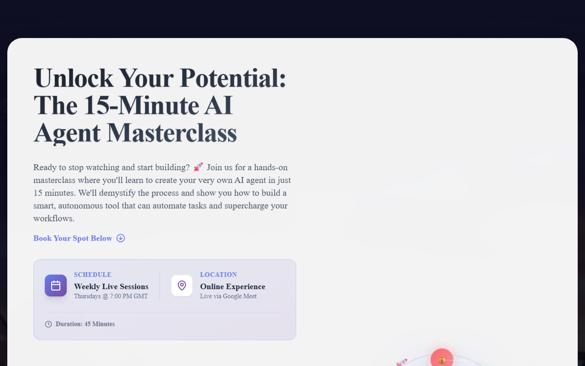

**Directory:** `agenticai-masterclass`  
**Stack:** React/Vite  
**Port:** 4173  
**Docker:** Yes  

```bash
cd agenticai-masterclass
pnpm install
pnpm run dev
```

### AI Code Reviewer
<a name="ai-code-reviewer"></a>


**Directory:** `ai-code-reviewer`  
**Stack:** React/Vite  
**Port:** 4173  
**Docker:** Yes  

```bash
cd ai-code-reviewer
pnpm install
pnpm run dev
```

### AI Email Drafter
<a name="ai-email-drafter"></a>

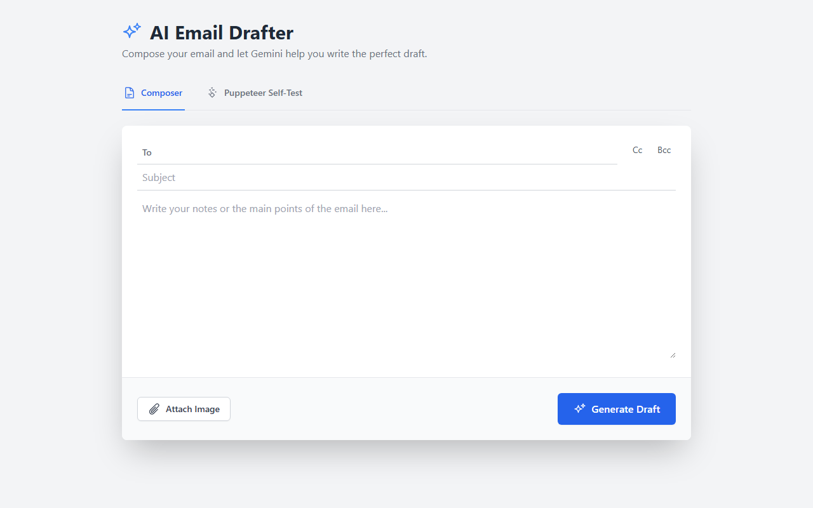

**Directory:** `ai-email-drafter`  
**Stack:** React/Vite  
**Port:** 80  
**Docker:** Yes  

```bash
cd ai-email-drafter
pnpm install
pnpm run dev
```

### AI Exam Generator
<a name="ai-exam-generator"></a>


**Directory:** `ai-exam-generator`  
**Stack:** React/Vite  
**Port:** 80  
**Docker:** Yes  
**Description:** Educational technology and learning systems -  

```bash
cd ai-exam-generator
pnpm install
pnpm run dev
```

### AI Explainability Console
<a name="ai-explainability-console"></a>


**Directory:** `ai-explainability-console`  
**Stack:** React/Vite  
**Port:** 80  
**Docker:** Yes  
**Description:** Platform infrastructure and capabilities -  

```bash
cd ai-explainability-console
pnpm install
pnpm run dev
```

### AI Flyer Generator
<a name="ai-flyer-generator"></a>

**Directory:** `ai-flyer-generator`  
**Stack:** React/Vite  
**Port:** 80  
**Docker:** Yes  

```bash
cd ai-flyer-generator
pnpm install
pnpm run dev
```

### AI Governance Analytics Hub
<a name="ai-governance-analytics-hub"></a>

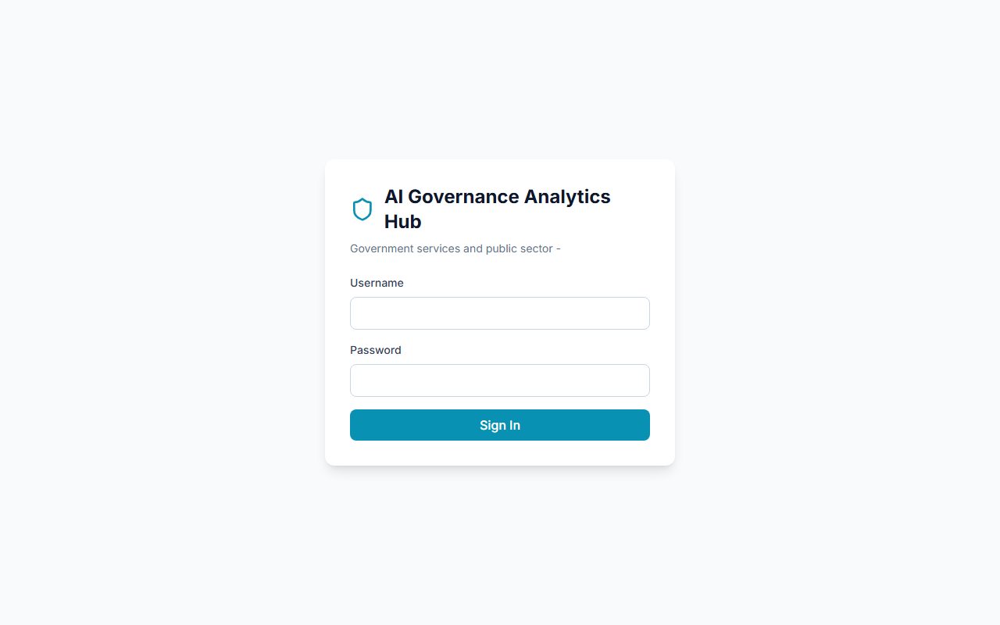

**Directory:** `ai-governance-analytics-hub`  
**Stack:** React/Vite  
**Port:** 80  
**Docker:** Yes  
**Description:** Government services and public sector -  

```bash
cd ai-governance-analytics-hub
pnpm install
pnpm run dev
```

### AI Knowledge Compression Lab
<a name="ai-knowledge-compression-lab"></a>


**Directory:** `ai-knowledge-compression-lab`  
**Stack:** React/Vite  
**Port:** 80  
**Docker:** Yes  
**Description:** Advanced research and development -  

```bash
cd ai-knowledge-compression-lab
pnpm install
pnpm run dev
```

### AI Legal Clause Analyzer
<a name="ai-legal-clause-analyzer"></a>

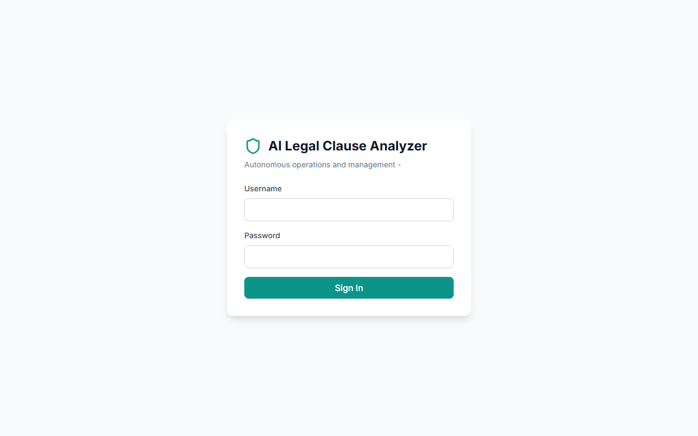

**Directory:** `ai-legal-clause-analyzer`  
**Stack:** React/Vite  
**Port:** 80  
**Docker:** Yes  
**Description:** Autonomous operations and management -  

```bash
cd ai-legal-clause-analyzer
pnpm install
pnpm run dev
```

### AI Log Pattern Analyzer
<a name="ai-log-pattern-analyzer"></a>

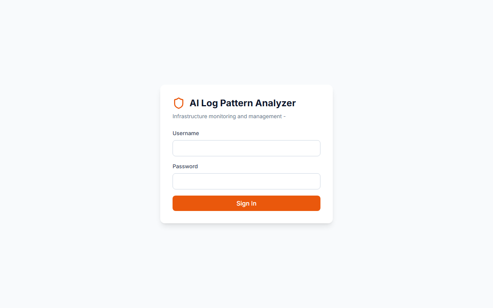

**Directory:** `ai-log-pattern-analyzer`  
**Stack:** React/Vite  
**Port:** 80  
**Docker:** Yes  
**Description:** Infrastructure monitoring and management -  

```bash
cd ai-log-pattern-analyzer
pnpm install
pnpm run dev
```

### AI Marketplace Engine
<a name="ai-marketplace-engine"></a>


**Directory:** `ai-marketplace-engine`  
**Stack:** React/Vite  
**Port:** 80  
**Docker:** Yes  
**Description:** Platform infrastructure and capabilities -  

```bash
cd ai-marketplace-engine
pnpm install
pnpm run dev
```

### AI Music Arrangement Assistant
<a name="ai-music-arrangement-assistant"></a>


**Directory:** `ai-music-arrangement-assistant`  
**Stack:** React/Vite  
**Port:** 80  
**Docker:** Yes  
**Description:** Creative content generation and design -  

```bash
cd ai-music-arrangement-assistant
pnpm install
pnpm run dev
```

### AI Portfolio Demonstrator
<a name="ai-portfolio-demonstrator"></a>

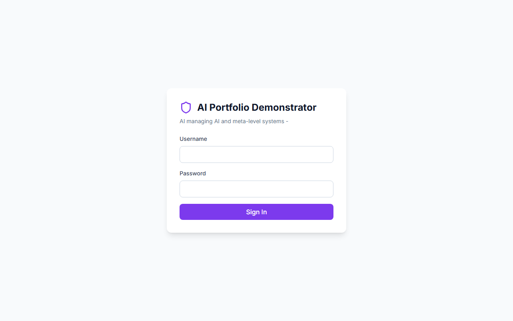

**Directory:** `ai-portfolio-demonstrator`  
**Stack:** React/Vite  
**Port:** 80  
**Docker:** Yes  
**Description:** AI managing AI and meta-level systems -  

```bash
cd ai-portfolio-demonstrator
pnpm install
pnpm run dev
```

### AI Resource Arbitrage Engine
<a name="ai-resource-arbitrage-engine"></a>

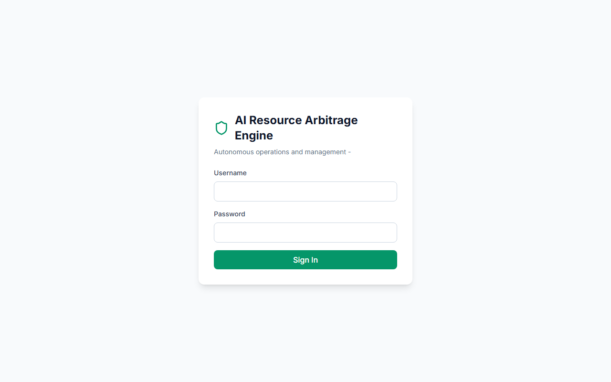

**Directory:** `ai-resource-arbitrage-engine`  
**Stack:** React/Vite  
**Port:** 80  
**Docker:** Yes  
**Description:** Autonomous operations and management -  

```bash
cd ai-resource-arbitrage-engine
pnpm install
pnpm run dev
```

### AI Risk Rebalancing Engine
<a name="ai-risk-rebalancing-engine"></a>

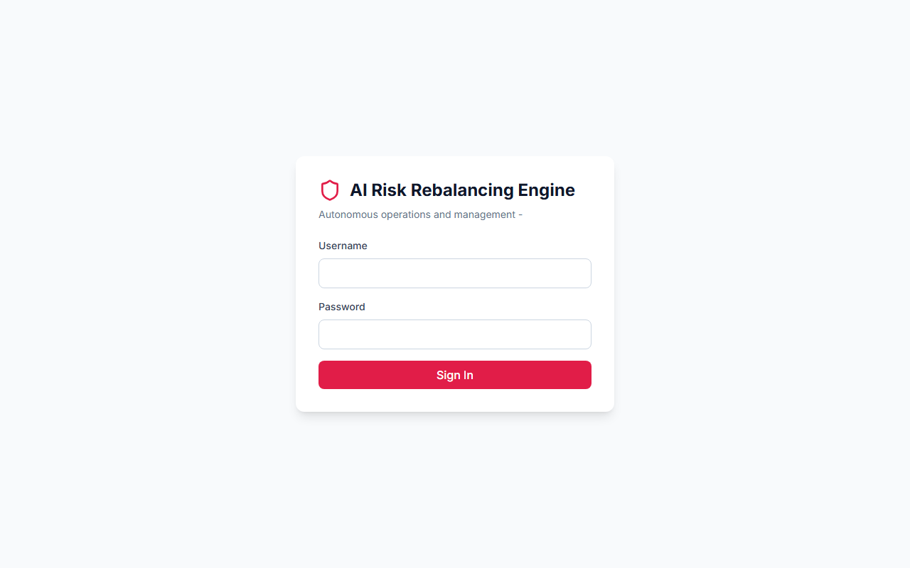

**Directory:** `ai-risk-rebalancing-engine`  
**Stack:** React/Vite  
**Port:** 80  
**Docker:** Yes  
**Description:** Autonomous operations and management -  

```bash
cd ai-risk-rebalancing-engine
pnpm install
pnpm run dev
```

### AI Scene Visualizer
<a name="ai-scene-visualizer"></a>

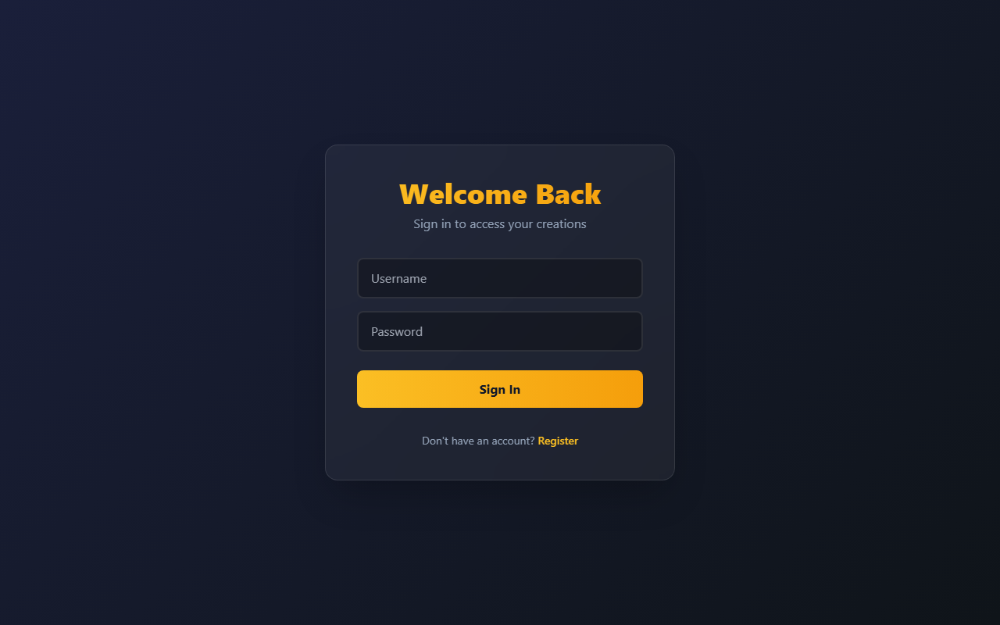

**Directory:** `ai-scene-visualizer`  
**Stack:** React/Vite  
**Port:** 80  
**Docker:** Yes  

```bash
cd ai-scene-visualizer
pnpm install
pnpm run dev
```

### AI Skill Transfer Engine
<a name="ai-skill-transfer-engine"></a>

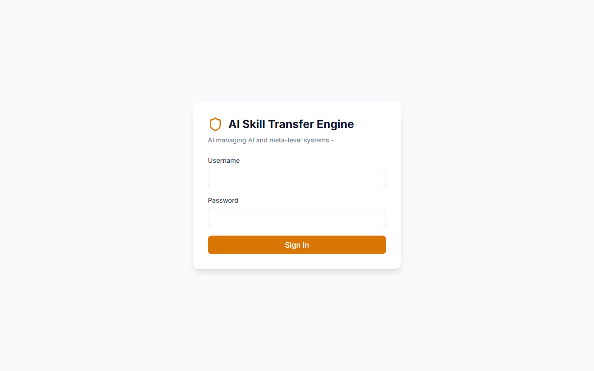

**Directory:** `ai-skill-transfer-engine`  
**Stack:** React/Vite  
**Port:** 80  
**Docker:** Yes  
**Description:** AI managing AI and meta-level systems -  

```bash
cd ai-skill-transfer-engine
pnpm install
pnpm run dev
```

### AI Stand Up Workshop Prep Dashboard
<a name="ai-stand-up-workshop-prep-dashboard"></a>

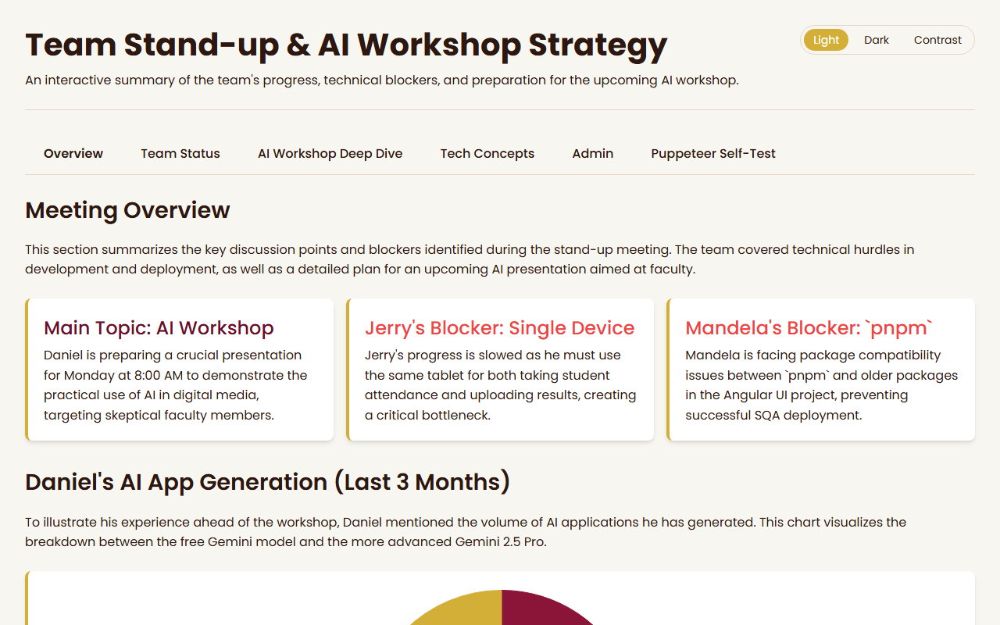

**Directory:** `ai-stand-up-workshop-prep-dashboard`  
**Stack:** React/Vite  
**Port:** 80  
**Docker:** Yes  

```bash
cd ai-stand-up-workshop-prep-dashboard
pnpm install
pnpm run dev
```

### AI Strategy Recommender
<a name="ai-strategy-recommender"></a>

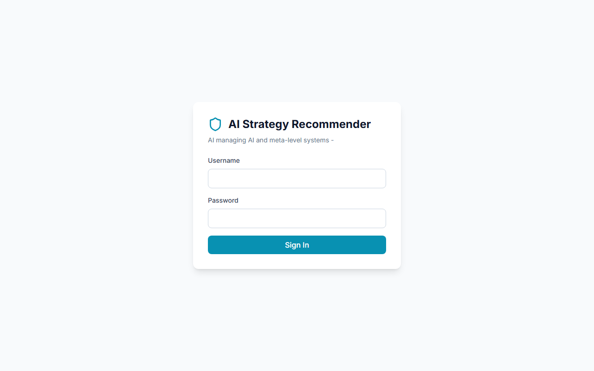

**Directory:** `ai-strategy-recommender`  
**Stack:** React/Vite  
**Port:** 80  
**Docker:** Yes  
**Description:** AI managing AI and meta-level systems -  

```bash
cd ai-strategy-recommender
pnpm install
pnpm run dev
```

### AI Studio Directives
<a name="ai-studio-directives"></a>


**Directory:** `ai-studio-directives`  
**Stack:** React/Vite  
**Port:** 4173  
**Docker:** Yes  

```bash
cd ai-studio-directives
pnpm install
pnpm run dev
```

### AI Studio Project Refresh Dashboard
<a name="ai-studio-project-refresh-dashboard"></a>

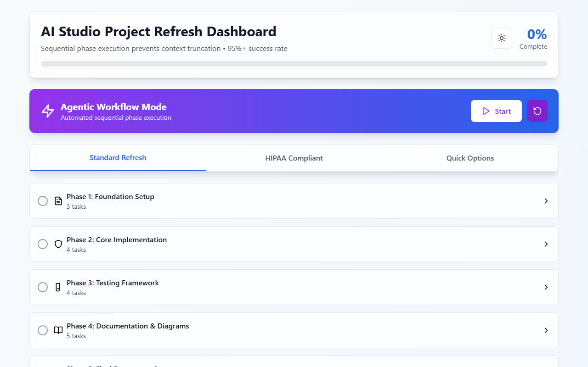

**Directory:** `ai-studio-project-refresh-dashboard`  
**Stack:** React/Vite  
**Port:** 80  
**Docker:** Yes  

```bash
cd ai-studio-project-refresh-dashboard
pnpm install
pnpm run dev
```

### AI Techbridge
<a name="ai-techbridge"></a>

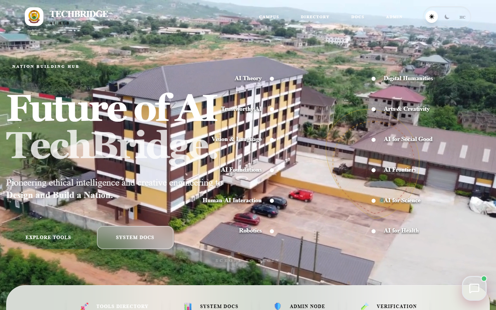

**Directory:** `ai-techbridge`  
**Stack:** React/Vite  
**Port:** 4173  
**Docker:** Yes  

```bash
cd ai-techbridge
pnpm install
pnpm run dev
```

### AI Transformation Framework
<a name="ai-transformation-framework"></a>


**Directory:** `ai-transformation-framework`  
**Stack:** React/Vite  
**Port:** 4173  
**Docker:** Yes  

```bash
cd ai-transformation-framework
pnpm install
pnpm run dev
```

### Autonomous Audit Engine
<a name="autonomous-audit-engine"></a>

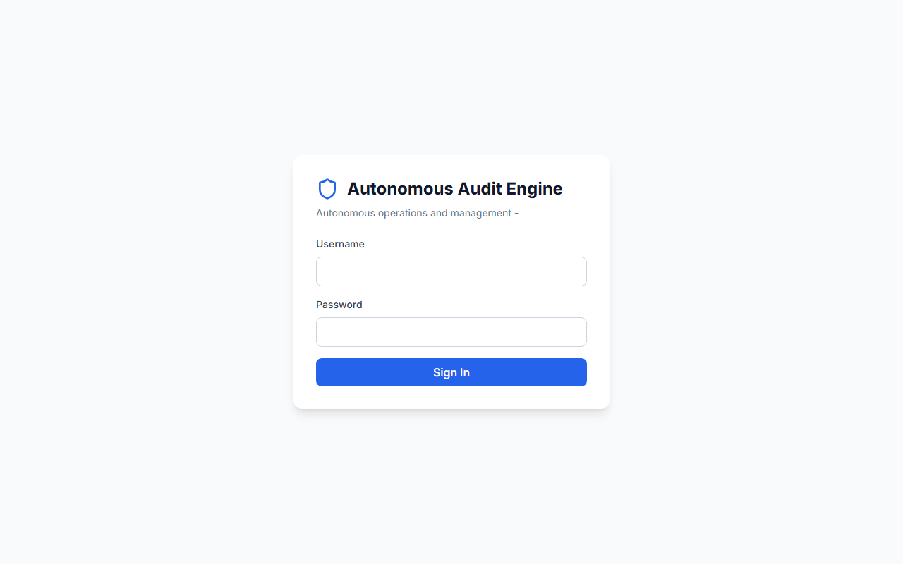

**Directory:** `autonomous-audit-engine`  
**Stack:** React/Vite  
**Port:** 80  
**Docker:** Yes  
**Description:** Autonomous operations and management -  

```bash
cd autonomous-audit-engine
pnpm install
pnpm run dev
```

### Autonomous Budget Allocator
<a name="autonomous-budget-allocator"></a>

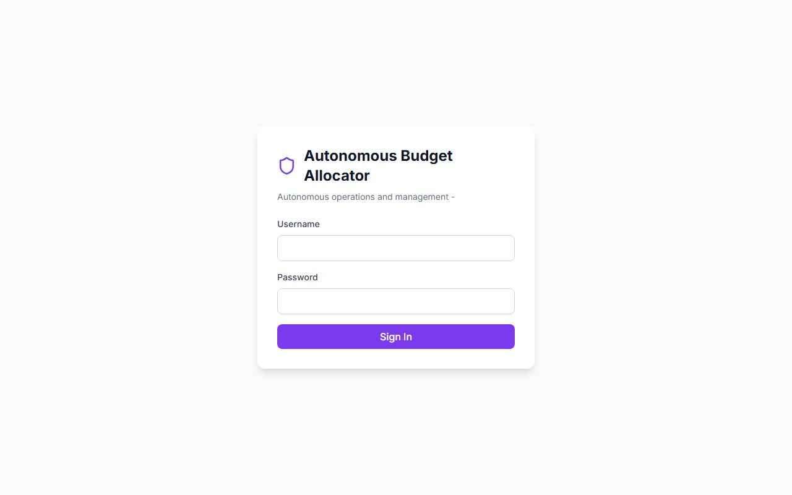

**Directory:** `autonomous-budget-allocator`  
**Stack:** React/Vite  
**Port:** 80  
**Docker:** Yes  
**Description:** Autonomous operations and management -  

```bash
cd autonomous-budget-allocator
pnpm install
pnpm run dev
```

### Autonomous Compliance Enforcer
<a name="autonomous-compliance-enforcer"></a>

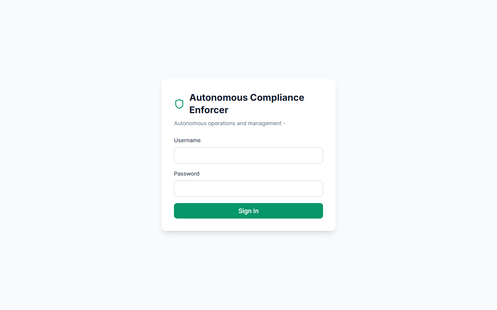

**Directory:** `autonomous-compliance-enforcer`  
**Stack:** React/Vite  
**Port:** 80  
**Docker:** Yes  
**Description:** Autonomous operations and management -  

```bash
cd autonomous-compliance-enforcer
pnpm install
pnpm run dev
```

### Autonomous Decision Optimizer
<a name="autonomous-decision-optimizer"></a>

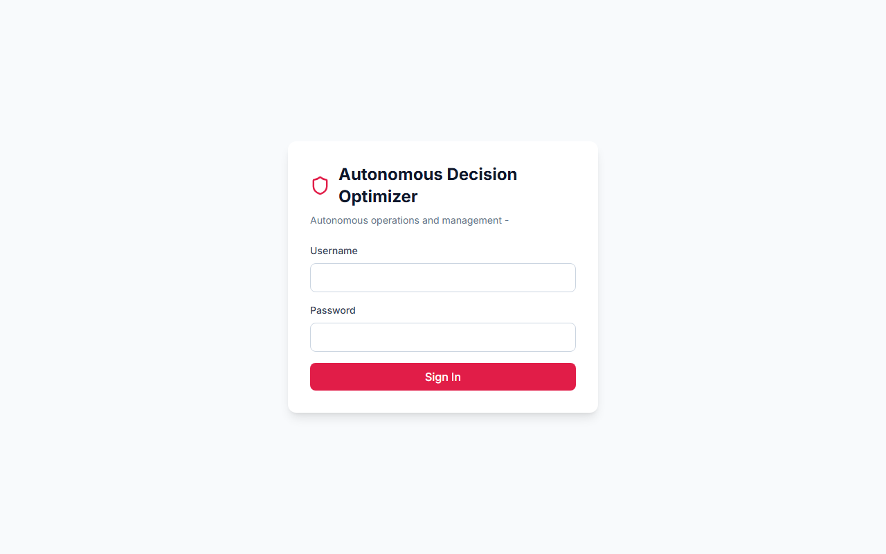

**Directory:** `autonomous-decision-optimizer`  
**Stack:** React/Vite  
**Port:** 80  
**Docker:** Yes  
**Description:** Autonomous operations and management -  

```bash
cd autonomous-decision-optimizer
pnpm install
pnpm run dev
```

### Autonomous Incident Resolver
<a name="autonomous-incident-resolver"></a>

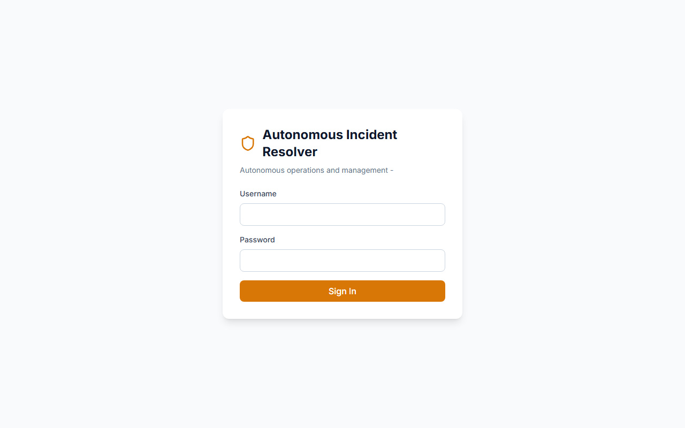

**Directory:** `autonomous-incident-resolver`  
**Stack:** React/Vite  
**Port:** 80  
**Docker:** Yes  
**Description:** Autonomous operations and management -  

```bash
cd autonomous-incident-resolver
pnpm install
pnpm run dev
```

### Autonomous Refactoring AI
<a name="autonomous-refactoring-ai"></a>


**Directory:** `autonomous-refactoring-ai`  
**Stack:** React/Vite  
**Port:** 80  
**Docker:** Yes  
**Description:** AI managing AI and meta-level systems -  

```bash
cd autonomous-refactoring-ai
pnpm install
pnpm run dev
```

### Autonomous Robotics Coordination Engine
<a name="autonomous-robotics-coordination-engine"></a>

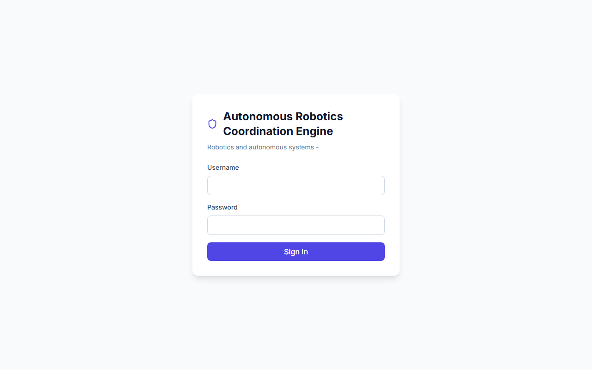

**Directory:** `autonomous-robotics-coordination-engine`  
**Stack:** React/Vite  
**Port:** 80  
**Docker:** Yes  
**Description:** Robotics and autonomous systems -  

```bash
cd autonomous-robotics-coordination-engine
pnpm install
pnpm run dev
```

### Autonomous System Governance Core
<a name="autonomous-system-governance-core"></a>

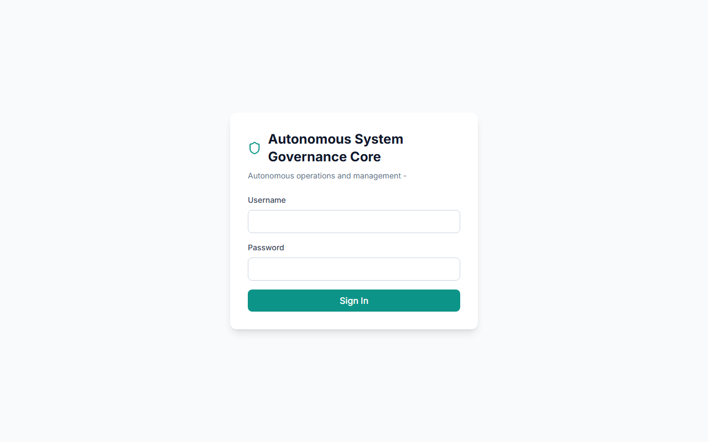

**Directory:** `autonomous-system-governance-core`  
**Stack:** React/Vite  
**Port:** 80  
**Docker:** Yes  
**Description:** Autonomous operations and management -  

```bash
cd autonomous-system-governance-core
pnpm install
pnpm run dev
```

### Biochemai v151120252049
<a name="biochemai-v151120252049"></a>

**Directory:** `biochemai-v151120252049`  
**Stack:** React/Vite  
**Port:** 80  
**Docker:** Yes  

```bash
cd biochemai-v151120252049
pnpm install
pnpm run dev
```

### Clipai
<a name="clipai"></a>

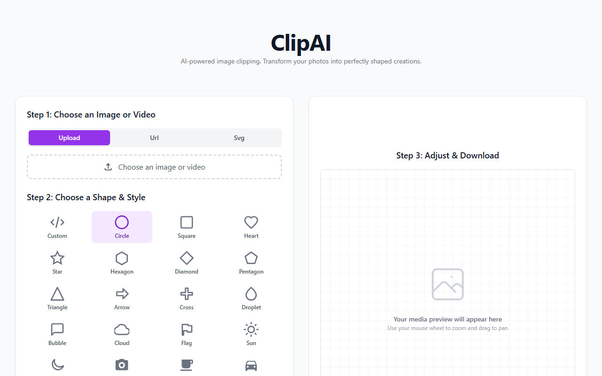

**Directory:** `clipai`  
**Stack:** React/Vite  
**Port:** 80  
**Docker:** Yes  

```bash
cd clipai
pnpm install
pnpm run dev
```

### Creoai
<a name="creoai"></a>

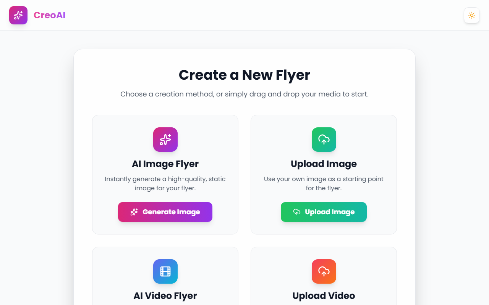

**Directory:** `creoai`  
**Stack:** React/Vite  
**Port:** 80  
**Docker:** Yes  

```bash
cd creoai
pnpm install
pnpm run dev
```

### Dmcdai Digital Media Communication Design
<a name="dmcdai-digital-media-communication-design"></a>

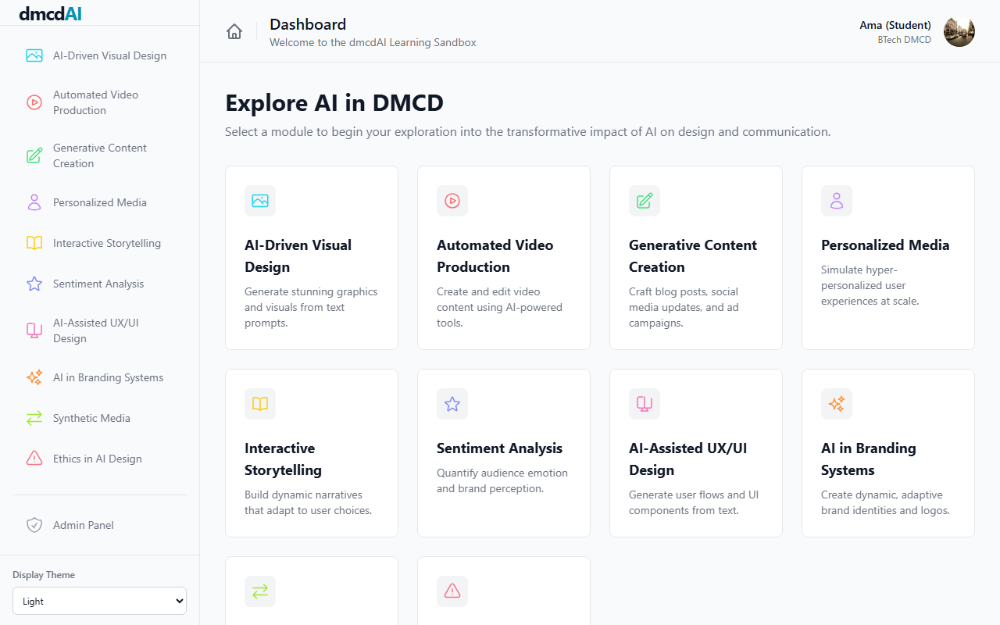

**Directory:** `dmcdai-digital-media-communication-design`  
**Stack:** React/Vite  
**Port:** 80  
**Docker:** Yes  

```bash
cd dmcdai-digital-media-communication-design
pnpm install
pnpm run dev
```

### Entrainer Landing Page
<a name="entrainer-landing-page"></a>

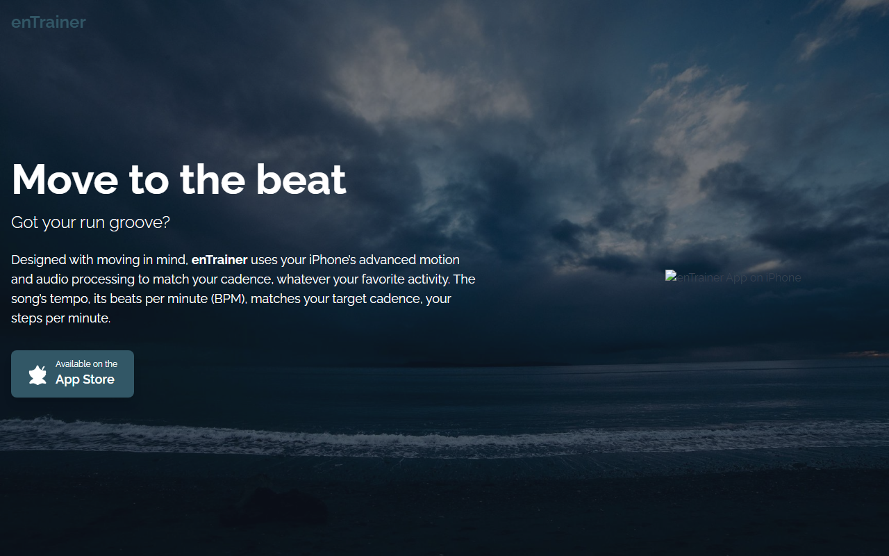

**Directory:** `entrainer-landing-page`  
**Stack:** React/Vite  
**Port:** 80  
**Docker:** Yes  

```bash
cd entrainer-landing-page
pnpm install
pnpm run dev
```

### Gemini Slingshot 3
<a name="gemini-slingshot-3"></a>


**Directory:** `gemini-slingshot-3`  
**Stack:** React/Vite  
**Port:** 4173  
**Docker:** Yes  

```bash
cd gemini-slingshot-3
pnpm install
pnpm run dev
```

### Gif Animator AI Refactored
<a name="gif-animator-ai-refactored"></a>

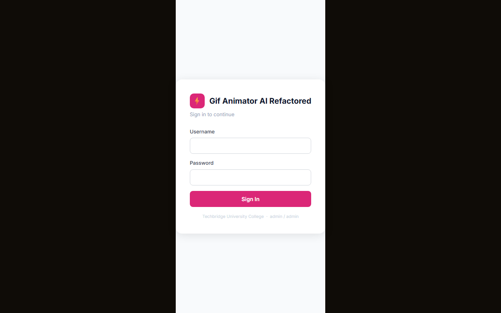

**Directory:** `gif-animator-ai-refactored`  
**Stack:** React/Vite  
**Port:** 4173  
**Docker:** Yes  

```bash
cd gif-animator-ai-refactored
pnpm install
pnpm run dev
```

### Human AI Collaboration Optimizer
<a name="human-ai-collaboration-optimizer"></a>

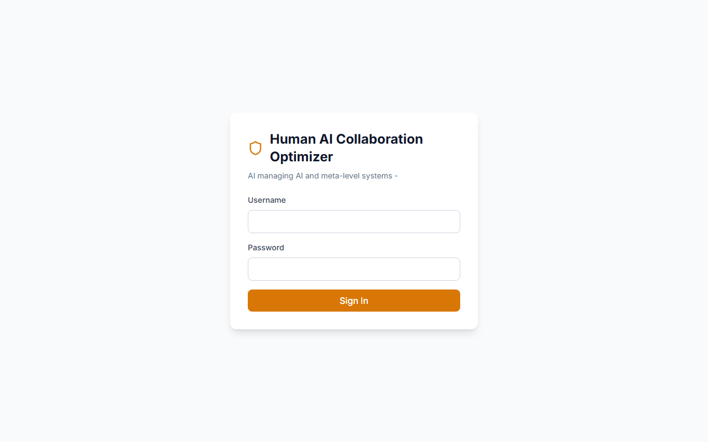

**Directory:** `human-ai-collaboration-optimizer`  
**Stack:** React/Vite  
**Port:** 80  
**Docker:** Yes  
**Description:** AI managing AI and meta-level systems -  

```bash
cd human-ai-collaboration-optimizer
pnpm install
pnpm run dev
```

### Knowledge Compression Engine
<a name="knowledge-compression-engine"></a>

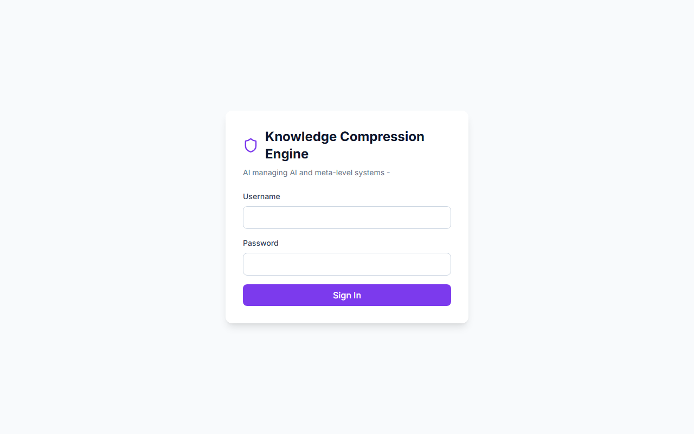

**Directory:** `knowledge-compression-engine`  
**Stack:** React/Vite  
**Port:** 80  
**Docker:** Yes  
**Description:** AI managing AI and meta-level systems -  

```bash
cd knowledge-compression-engine
pnpm install
pnpm run dev
```

### Knowledge Graph Builder
<a name="knowledge-graph-builder"></a>

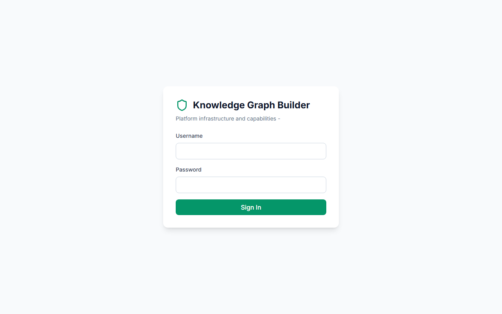

**Directory:** `knowledge-graph-builder`  
**Stack:** React/Vite  
**Port:** 80  
**Docker:** Yes  
**Description:** Platform infrastructure and capabilities -  

```bash
cd knowledge-graph-builder
pnpm install
pnpm run dev
```

### Playgrow Smart Fun For Bright Minds
<a name="playgrow-smart-fun-for-bright-minds"></a>

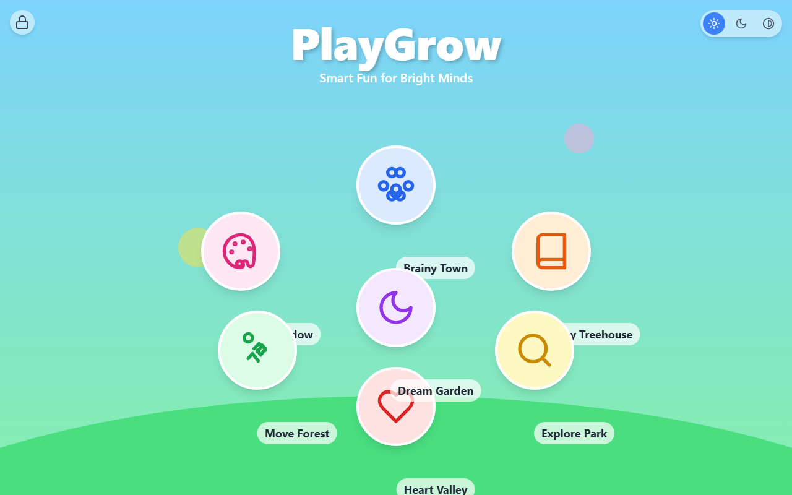

**Directory:** `playgrow-smart-fun-for-bright-minds`  
**Stack:** React/Vite  
**Port:** 80  
**Docker:** Yes  

```bash
cd playgrow-smart-fun-for-bright-minds
pnpm install
pnpm run dev
```

### Smartscale AI Presentation Platform
<a name="smartscale-ai-presentation-platform"></a>

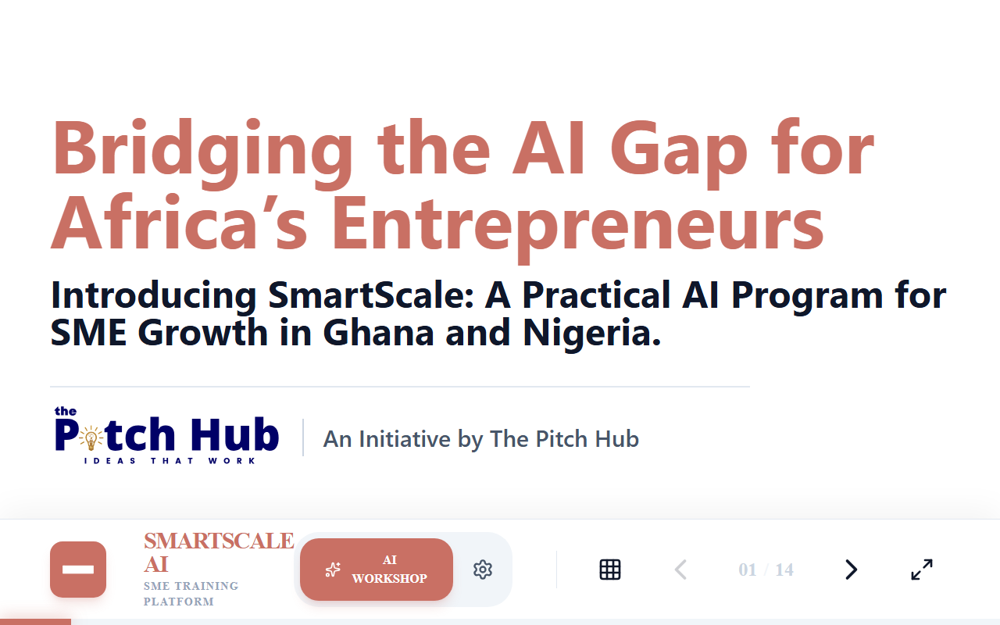

**Directory:** `smartscale-ai-presentation-platform`  
**Stack:** React/Vite  
**Port:** 4173  
**Docker:** Yes  

```bash
cd smartscale-ai-presentation-platform
pnpm install
pnpm run dev
```

### Techbridge AI Application Portal
<a name="techbridge-ai-application-portal"></a>

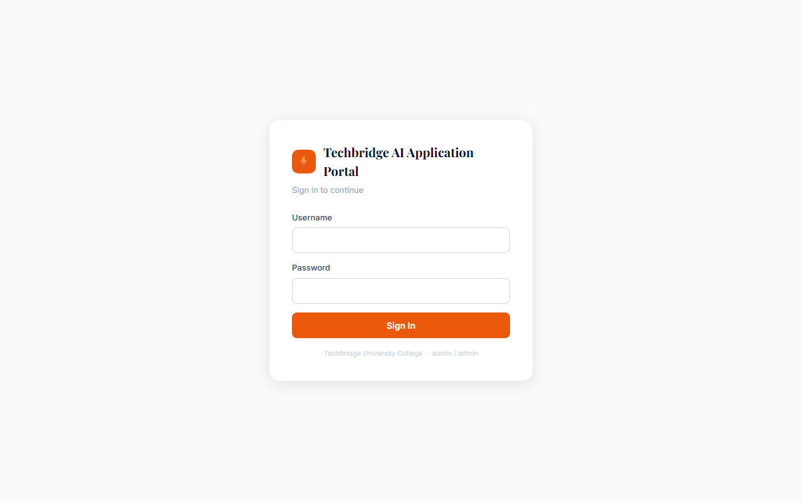

**Directory:** `techbridge-ai-application-portal`  
**Stack:** React/Vite  
**Port:** 80  
**Docker:** Yes  

```bash
cd techbridge-ai-application-portal
pnpm install
pnpm run dev
```

### Techbridge AI Workshop Flyer
<a name="techbridge-ai-workshop-flyer"></a>

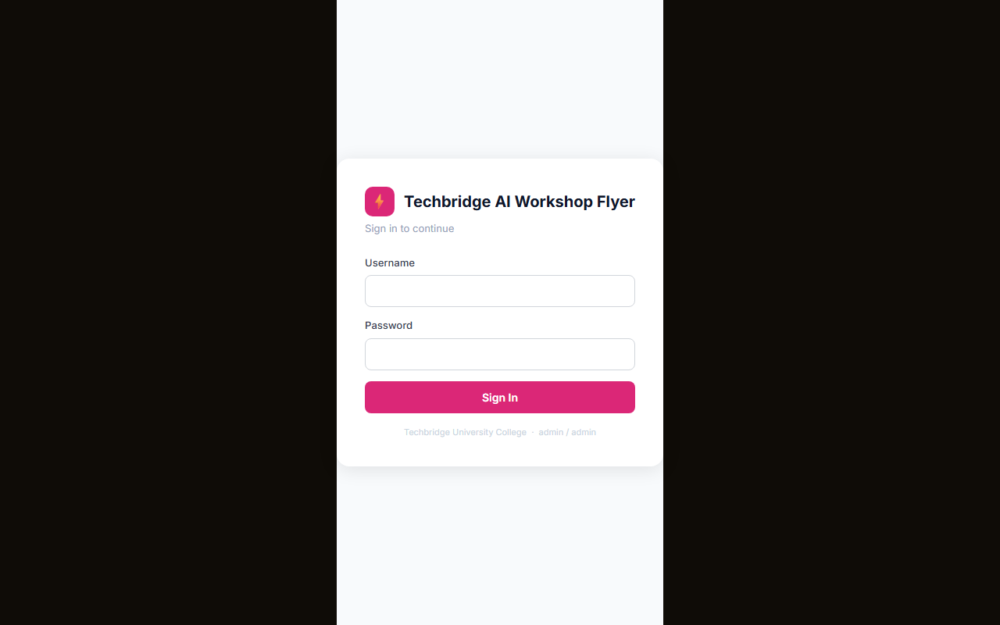

**Directory:** `techbridge-ai-workshop-flyer`  
**Stack:** React/Vite  
**Port:** 4173  
**Docker:** Yes  

```bash
cd techbridge-ai-workshop-flyer
pnpm install
pnpm run dev
```

---

## Analytics & Monitoring

**22 applications**

### Academic Performance App
<a name="academic-performance-app"></a>


**Directory:** `academic-performance-app`  
**Stack:** React/Vite  
**Port:** 4173  
**Docker:** Yes  

```bash
cd academic-performance-app
pnpm install
pnpm run dev
```

### Analytics Refactor
<a name="analytics-refactor"></a>


**Directory:** `analytics-refactor`  
**Stack:** React/Vite  
**Port:** 4173  
**Docker:** Yes  
**Description:** Advanced Analytics Dashboard for TECHBRIDGE University - Phase 1-2 Complete, Phase 3 70%, Phase 4 Testing Suite  

```bash
cd analytics-refactor
pnpm install
pnpm run dev
```

### Automated Compliance Monitor
<a name="automated-compliance-monitor"></a>

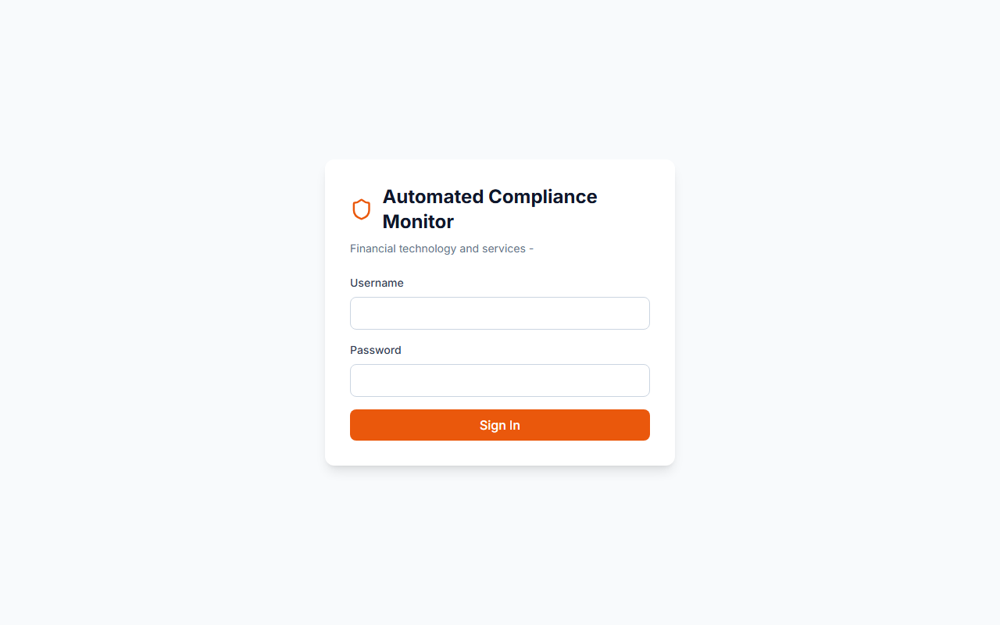

**Directory:** `automated-compliance-monitor`  
**Stack:** React/Vite  
**Port:** 80  
**Docker:** Yes  
**Description:** Financial technology and services -  

```bash
cd automated-compliance-monitor
pnpm install
pnpm run dev
```

### Cognitive Load Monitor
<a name="cognitive-load-monitor"></a>

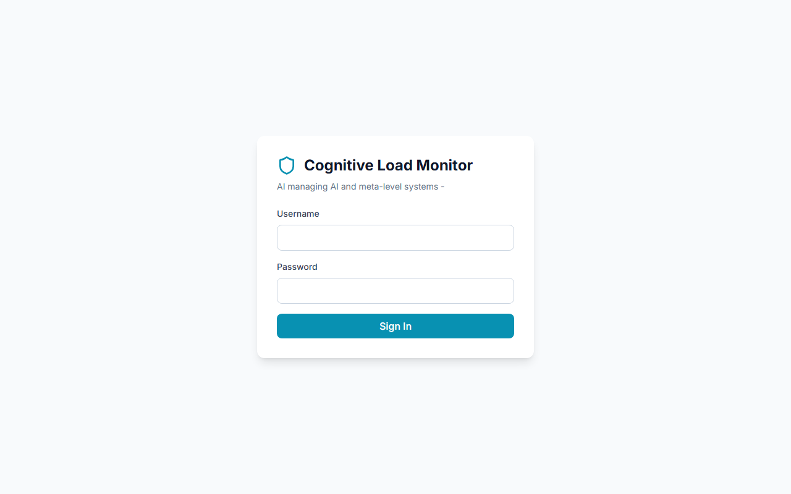

**Directory:** `cognitive-load-monitor`  
**Stack:** React/Vite  
**Port:** 80  
**Docker:** Yes  
**Description:** AI managing AI and meta-level systems -  

```bash
cd cognitive-load-monitor
pnpm install
pnpm run dev
```

### Compliance Workflow Dashboard
<a name="compliance-workflow-dashboard"></a>

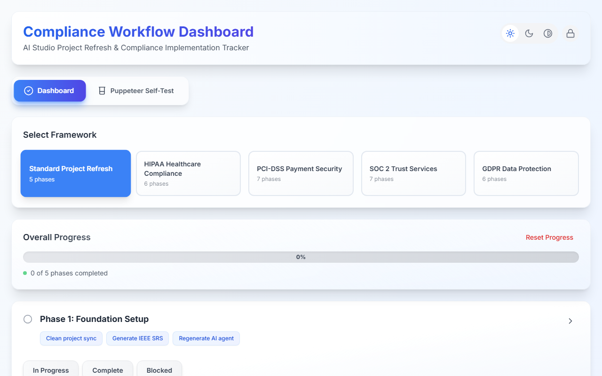

**Directory:** `compliance-workflow-dashboard`  
**Stack:** React/Vite  
**Port:** 80  
**Docker:** Yes  

```bash
cd compliance-workflow-dashboard
pnpm install
pnpm run dev
```

### Container Health Auditor 2
<a name="container-health-auditor-2"></a>

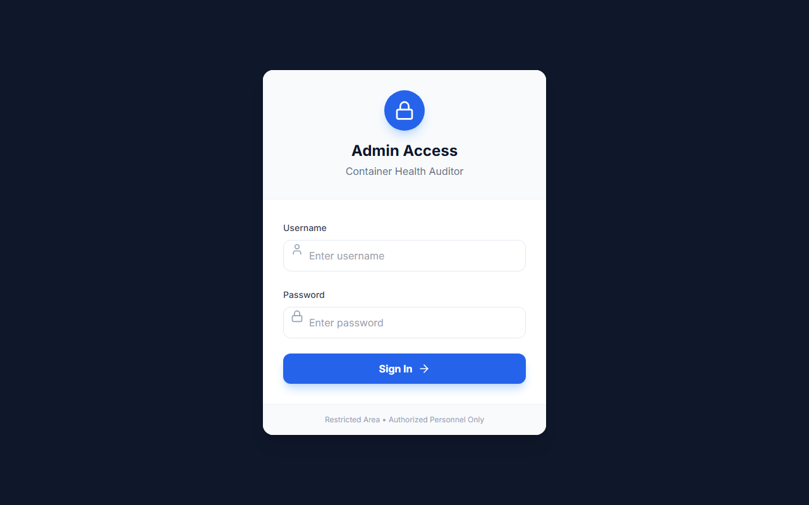

**Directory:** `container-health-auditor-2`  
**Stack:** React/Vite  
**Port:** 4173  
**Docker:** Yes  

```bash
cd container-health-auditor-2
pnpm install
pnpm run dev
```

### Cross App Performance Synthesizer
<a name="cross-app-performance-synthesizer"></a>

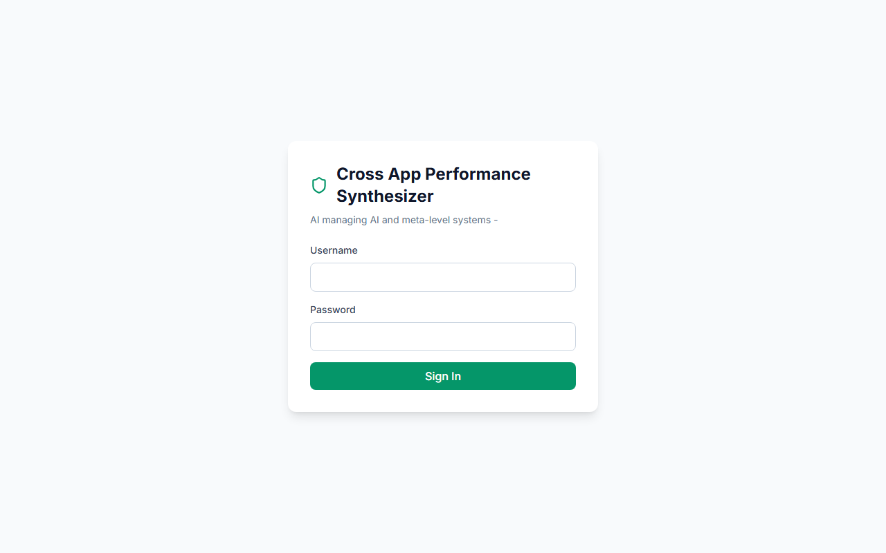

**Directory:** `cross-app-performance-synthesizer`  
**Stack:** React/Vite  
**Port:** 80  
**Docker:** Yes  
**Description:** AI managing AI and meta-level systems -  

```bash
cd cross-app-performance-synthesizer
pnpm install
pnpm run dev
```

### Emergent Behavior Monitor
<a name="emergent-behavior-monitor"></a>


**Directory:** `emergent-behavior-monitor`  
**Stack:** React/Vite  
**Port:** 80  
**Docker:** Yes  
**Description:** AI managing AI and meta-level systems -  

```bash
cd emergent-behavior-monitor
pnpm install
pnpm run dev
```

### Fees Comparison Dashboard
<a name="fees-comparison-dashboard"></a>

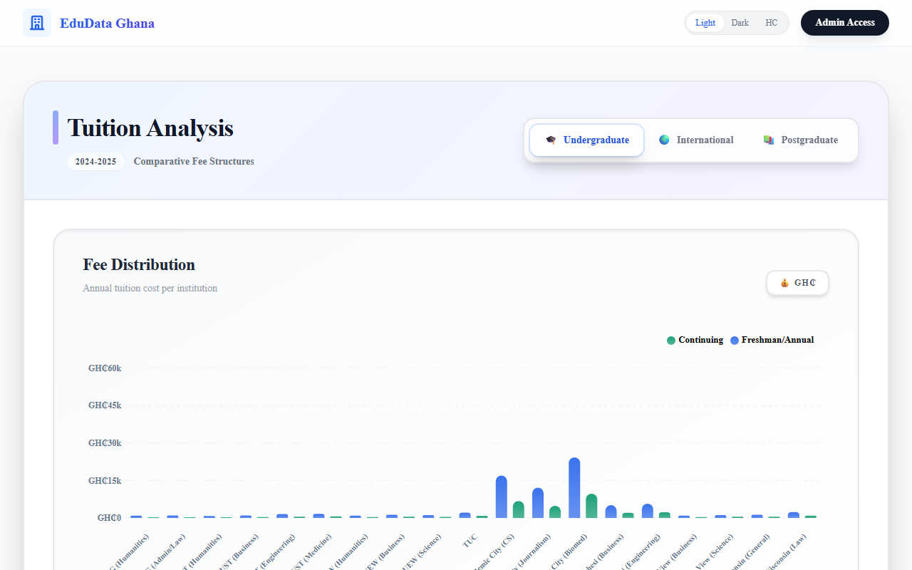

**Directory:** `fees-comparison-dashboard`  
**Stack:** React/Vite  
**Port:** 4173  
**Docker:** Yes  

```bash
cd fees-comparison-dashboard
pnpm install
pnpm run dev
```

### Geopolitical Risk Monitor
<a name="geopolitical-risk-monitor"></a>

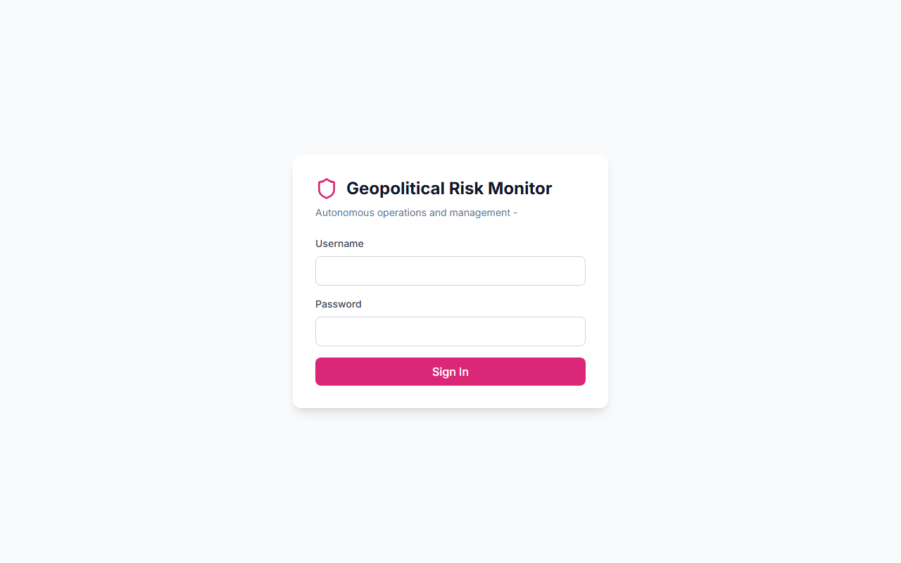

**Directory:** `geopolitical-risk-monitor`  
**Stack:** React/Vite  
**Port:** 80  
**Docker:** Yes  
**Description:** Autonomous operations and management -  

```bash
cd geopolitical-risk-monitor
pnpm install
pnpm run dev
```

### Ghana University Fees Dashboard
<a name="ghana-university-fees-dashboard"></a>


**Directory:** `ghana-university-fees-dashboard`  
**Stack:** React/Vite  
**Port:** 4173  
**Docker:** Yes  

```bash
cd ghana-university-fees-dashboard
pnpm install
pnpm run dev
```

### Model Performance Drift AI
<a name="model-performance-drift-ai"></a>

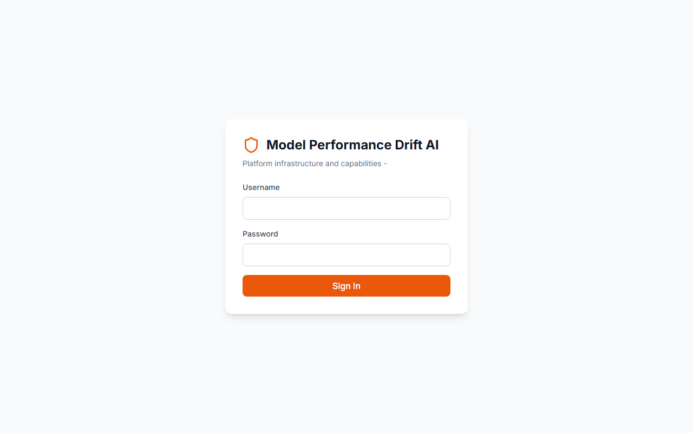

**Directory:** `model-performance-drift-ai`  
**Stack:** React/Vite  
**Port:** 80  
**Docker:** Yes  
**Description:** Platform infrastructure and capabilities -  

```bash
cd model-performance-drift-ai
pnpm install
pnpm run dev
```

### Remote Patient Monitoring AI
<a name="remote-patient-monitoring-ai"></a>


**Directory:** `remote-patient-monitoring-ai`  
**Stack:** React/Vite  
**Port:** 80  
**Docker:** Yes  
**Description:** Healthcare and medical technology -  

```bash
cd remote-patient-monitoring-ai
pnpm install
pnpm run dev
```

### Send Platform Dashboard
<a name="send-platform-dashboard"></a>

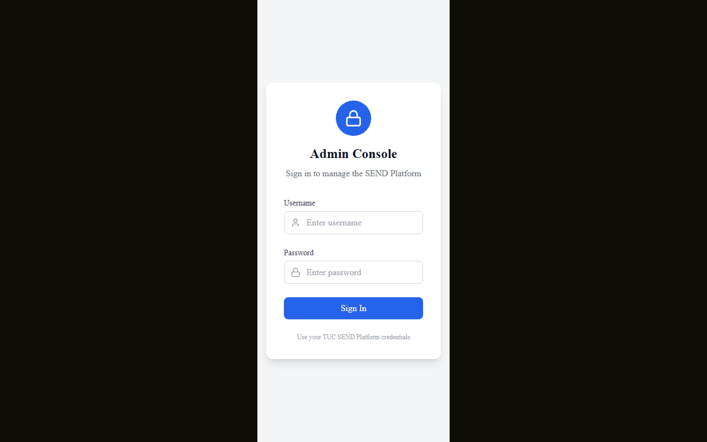

**Directory:** `send-platform-dashboard`  
**Stack:** React/Vite  
**Port:** 4173  
**Docker:** Yes  

```bash
cd send-platform-dashboard
pnpm install
pnpm run dev
```

### Sentinel Conscious State Dashboard
<a name="sentinel-conscious-state-dashboard"></a>

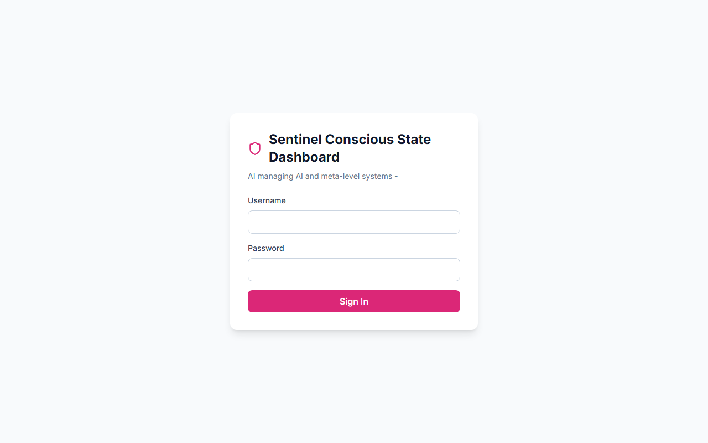

**Directory:** `sentinel-conscious-state-dashboard`  
**Stack:** React/Vite  
**Port:** 80  
**Docker:** Yes  
**Description:** AI managing AI and meta-level systems -  

```bash
cd sentinel-conscious-state-dashboard
pnpm install
pnpm run dev
```

### Sla Compliance Monitor
<a name="sla-compliance-monitor"></a>

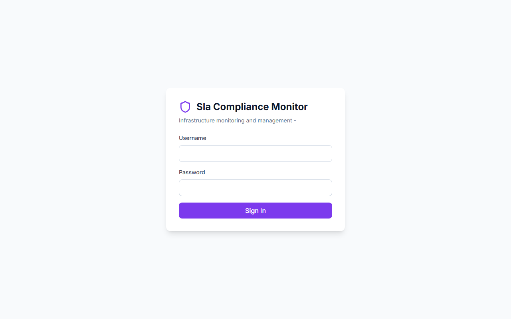

**Directory:** `sla-compliance-monitor`  
**Stack:** React/Vite  
**Port:** 80  
**Docker:** Yes  
**Description:** Infrastructure monitoring and management -  

```bash
cd sla-compliance-monitor
pnpm install
pnpm run dev
```

### Smart Energy Consumption Monitor
<a name="smart-energy-consumption-monitor"></a>


**Directory:** `smart-energy-consumption-monitor`  
**Stack:** React/Vite  
**Port:** 80  
**Docker:** Yes  
**Description:** Energy management and optimization -  

```bash
cd smart-energy-consumption-monitor
pnpm install
pnpm run dev
```

### Student Performance Predictor
<a name="student-performance-predictor"></a>

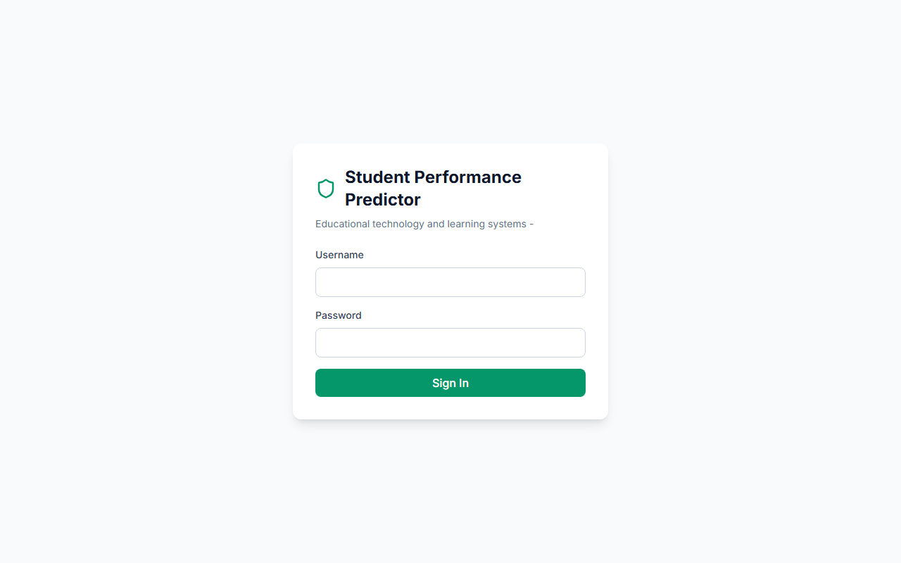

**Directory:** `student-performance-predictor`  
**Stack:** React/Vite  
**Port:** 80  
**Docker:** Yes  
**Description:** Educational technology and learning systems -  

```bash
cd student-performance-predictor
pnpm install
pnpm run dev
```

### Techbridge Dashboard
<a name="techbridge-dashboard"></a>

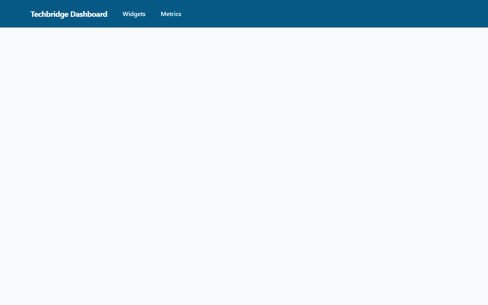

**Directory:** `techbridge-dashboard`  
**Stack:** Node.js/Express  
**Port:** 4173  
**Docker:** Yes  

```bash
cd techbridge-dashboard
pnpm install
pnpm run dev
```

### Techbridge Strategy Dashboard
<a name="techbridge-strategy-dashboard"></a>

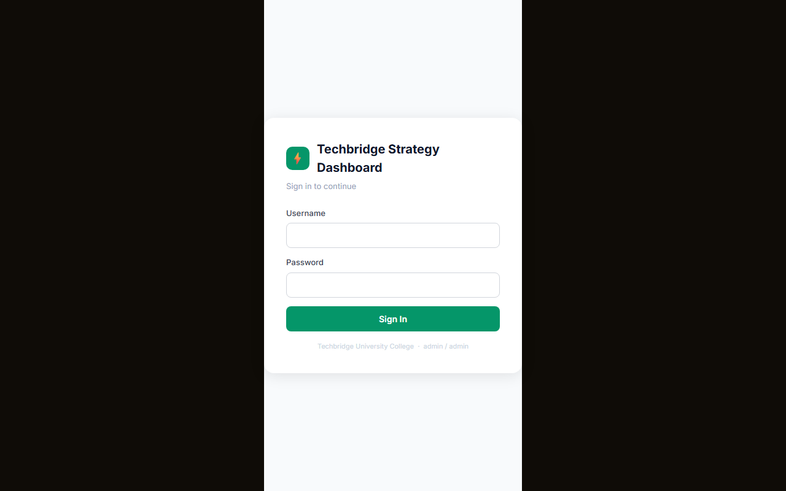

**Directory:** `techbridge-strategy-dashboard`  
**Stack:** React/Vite  
**Port:** 4173  
**Docker:** Yes  

```bash
cd techbridge-strategy-dashboard
pnpm install
pnpm run dev
```

### TUC Analytics Dashboard
<a name="tuc-analytics-dashboard"></a>

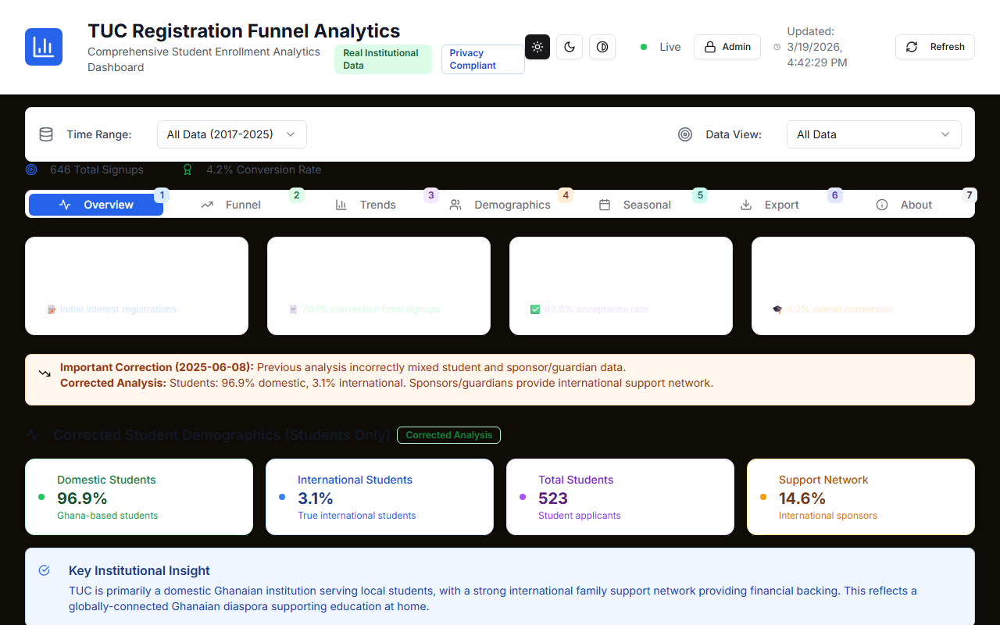

**Directory:** `tuc-analytics-dashboard`  
**Stack:** React/Vite  
**Port:** 4173  
**Docker:** Yes  

```bash
cd tuc-analytics-dashboard
pnpm install
pnpm run dev
```

### Tvet Assessment Progress Dashboard
<a name="tvet-assessment-progress-dashboard"></a>


**Directory:** `tvet-assessment-progress-dashboard`  
**Stack:** React/Vite  
**Port:** 4173  
**Docker:** Yes  

```bash
cd tvet-assessment-progress-dashboard
pnpm install
pnpm run dev
```

---

## Digital Twin & Simulation

**18 applications**

### City Digital Twin
<a name="city-digital-twin"></a>


**Directory:** `city-digital-twin`  
**Stack:** React/Vite  
**Port:** 80  
**Docker:** Yes  
**Description:** Digital twin and simulation systems -  

```bash
cd city-digital-twin
pnpm install
pnpm run dev
```

### Climate Impact Twin
<a name="climate-impact-twin"></a>


**Directory:** `climate-impact-twin`  
**Stack:** React/Vite  
**Port:** 80  
**Docker:** Yes  
**Description:** Digital twin and simulation systems -  

```bash
cd climate-impact-twin
pnpm install
pnpm run dev
```

### Crisis Simulation AI
<a name="crisis-simulation-ai"></a>

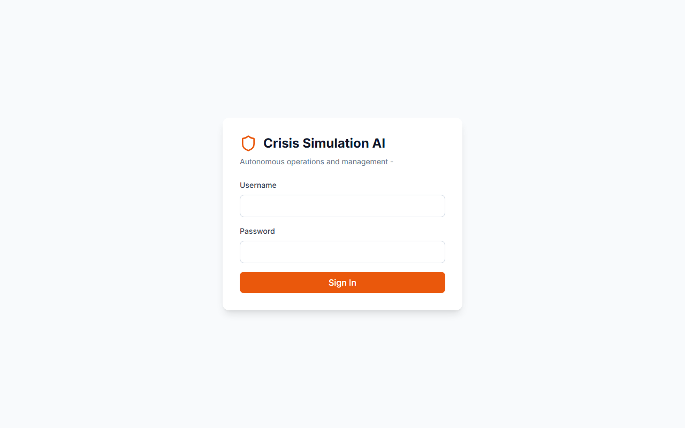

**Directory:** `crisis-simulation-ai`  
**Stack:** React/Vite  
**Port:** 80  
**Docker:** Yes  
**Description:** Autonomous operations and management -  

```bash
cd crisis-simulation-ai
pnpm install
pnpm run dev
```

### Digital Twin Builder
<a name="digital-twin-builder"></a>


**Directory:** `digital-twin-builder`  
**Stack:** React/Vite  
**Port:** 80  
**Docker:** Yes  
**Description:** Platform infrastructure and capabilities -  

```bash
cd digital-twin-builder
pnpm install
pnpm run dev
```

### Disaster Preparedness Simulator
<a name="disaster-preparedness-simulator"></a>

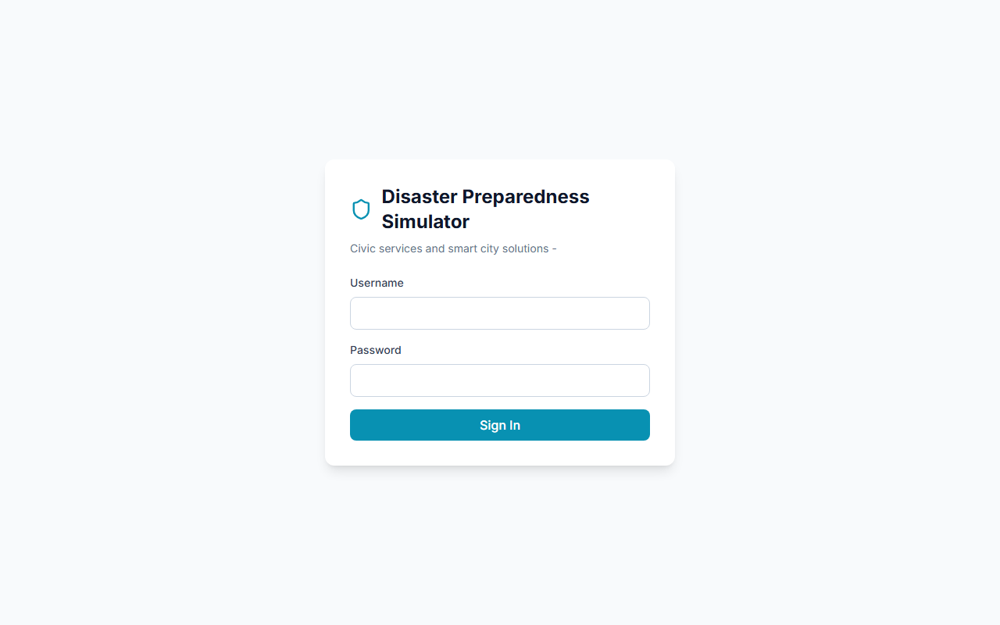

**Directory:** `disaster-preparedness-simulator`  
**Stack:** React/Vite  
**Port:** 80  
**Docker:** Yes  
**Description:** Civic services and smart city solutions -  

```bash
cd disaster-preparedness-simulator
pnpm install
pnpm run dev
```

### Drone Light Show Simulator
<a name="drone-light-show-simulator"></a>

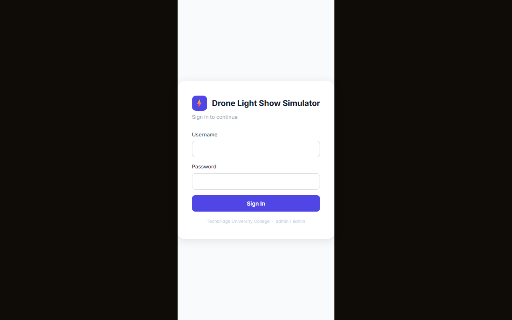

**Directory:** `drone-light-show-simulator`  
**Stack:** React/Vite  
**Port:** 4173  
**Docker:** Yes  

```bash
cd drone-light-show-simulator
pnpm install
pnpm run dev
```

### Energy Grid Digital Twin
<a name="energy-grid-digital-twin"></a>

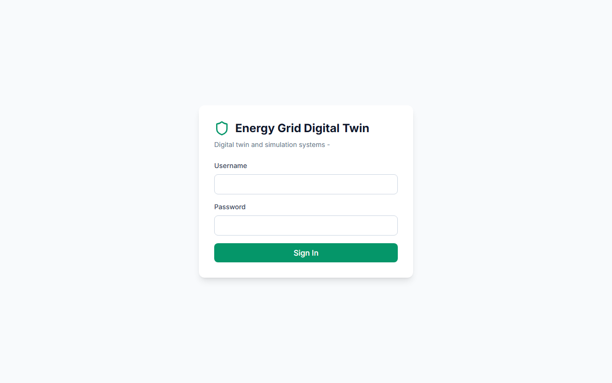

**Directory:** `energy-grid-digital-twin`  
**Stack:** React/Vite  
**Port:** 80  
**Docker:** Yes  
**Description:** Digital twin and simulation systems -  

```bash
cd energy-grid-digital-twin
pnpm install
pnpm run dev
```

### Farm Digital Twin
<a name="farm-digital-twin"></a>

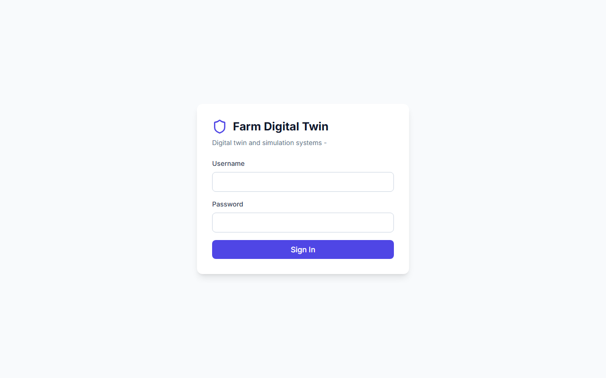

**Directory:** `farm-digital-twin`  
**Stack:** React/Vite  
**Port:** 80  
**Docker:** Yes  
**Description:** Digital twin and simulation systems -  

```bash
cd farm-digital-twin
pnpm install
pnpm run dev
```

### Global Trade Simulation Engine
<a name="global-trade-simulation-engine"></a>

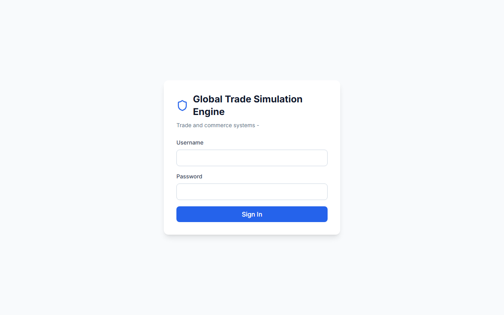

**Directory:** `global-trade-simulation-engine`  
**Stack:** React/Vite  
**Port:** 80  
**Docker:** Yes  
**Description:** Trade and commerce systems -  

```bash
cd global-trade-simulation-engine
pnpm install
pnpm run dev
```

### Hospital Digital Twin
<a name="hospital-digital-twin"></a>

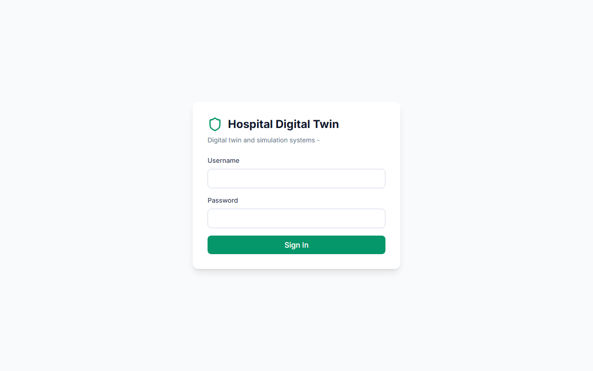

**Directory:** `hospital-digital-twin`  
**Stack:** React/Vite  
**Port:** 80  
**Docker:** Yes  
**Description:** Digital twin and simulation systems -  

```bash
cd hospital-digital-twin
pnpm install
pnpm run dev
```

### Manufacturing Ecosystem Twin
<a name="manufacturing-ecosystem-twin"></a>

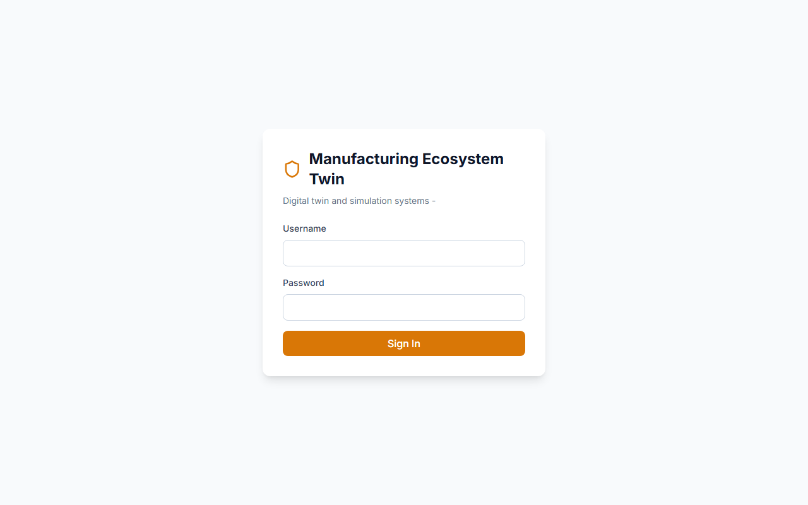

**Directory:** `manufacturing-ecosystem-twin`  
**Stack:** React/Vite  
**Port:** 80  
**Docker:** Yes  
**Description:** Digital twin and simulation systems -  

```bash
cd manufacturing-ecosystem-twin
pnpm install
pnpm run dev
```

### Retail Ecosystem Twin
<a name="retail-ecosystem-twin"></a>

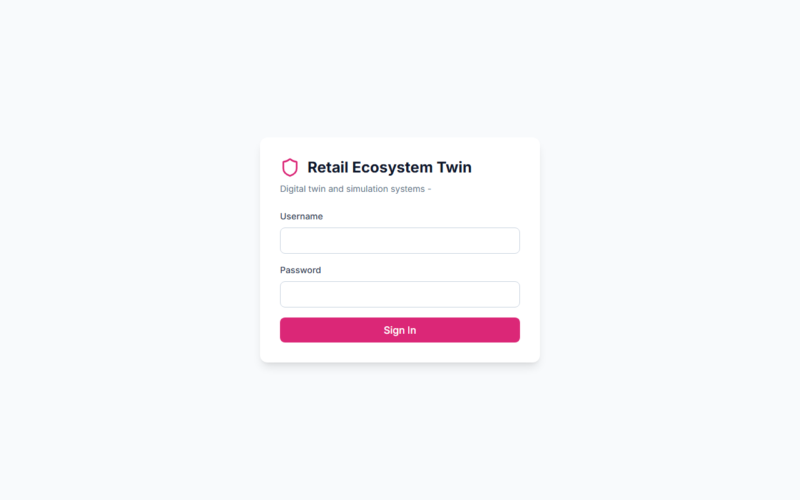

**Directory:** `retail-ecosystem-twin`  
**Stack:** React/Vite  
**Port:** 80  
**Docker:** Yes  
**Description:** Digital twin and simulation systems -  

```bash
cd retail-ecosystem-twin
pnpm install
pnpm run dev
```

### Scenario Simulation Engine
<a name="scenario-simulation-engine"></a>

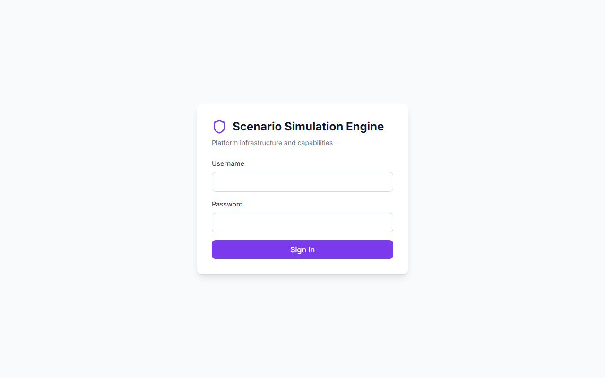

**Directory:** `scenario-simulation-engine`  
**Stack:** React/Vite  
**Port:** 80  
**Docker:** Yes  
**Description:** Platform infrastructure and capabilities -  

```bash
cd scenario-simulation-engine
pnpm install
pnpm run dev
```

### Societal Impact Simulator
<a name="societal-impact-simulator"></a>


**Directory:** `societal-impact-simulator`  
**Stack:** React/Vite  
**Port:** 80  
**Docker:** Yes  
**Description:** AI managing AI and meta-level systems -  

```bash
cd societal-impact-simulator
pnpm install
pnpm run dev
```

### Supply Chain Digital Twin
<a name="supply-chain-digital-twin"></a>

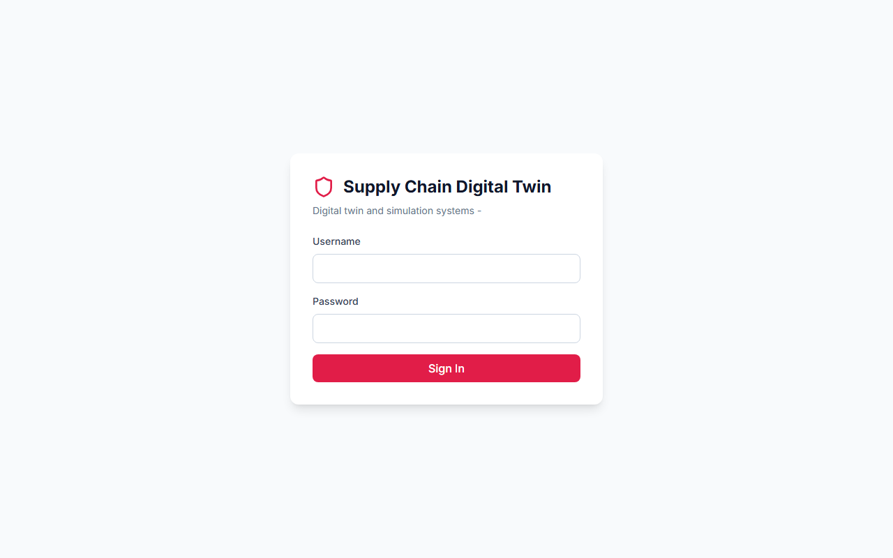

**Directory:** `supply-chain-digital-twin`  
**Stack:** React/Vite  
**Port:** 80  
**Docker:** Yes  
**Description:** Digital twin and simulation systems -  

```bash
cd supply-chain-digital-twin
pnpm install
pnpm run dev
```

### Synthetic User Simulator
<a name="synthetic-user-simulator"></a>

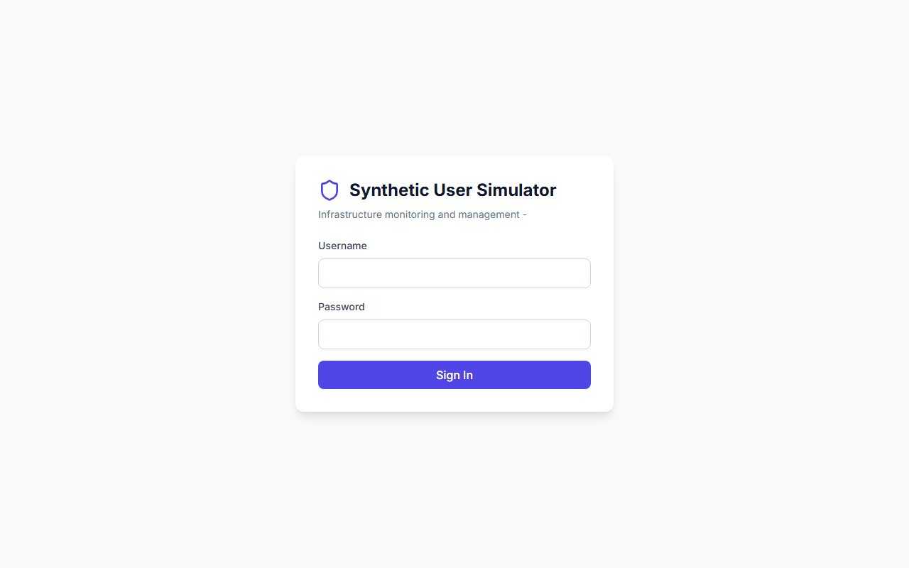

**Directory:** `synthetic-user-simulator`  
**Stack:** React/Vite  
**Port:** 80  
**Docker:** Yes  
**Description:** Infrastructure monitoring and management -  

```bash
cd synthetic-user-simulator
pnpm install
pnpm run dev
```

### Transportation Network Twin
<a name="transportation-network-twin"></a>

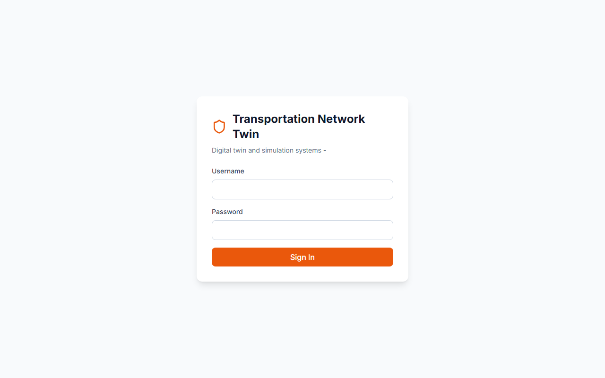

**Directory:** `transportation-network-twin`  
**Stack:** React/Vite  
**Port:** 80  
**Docker:** Yes  
**Description:** Digital twin and simulation systems -  

```bash
cd transportation-network-twin
pnpm install
pnpm run dev
```

### University Digital Twin
<a name="university-digital-twin"></a>

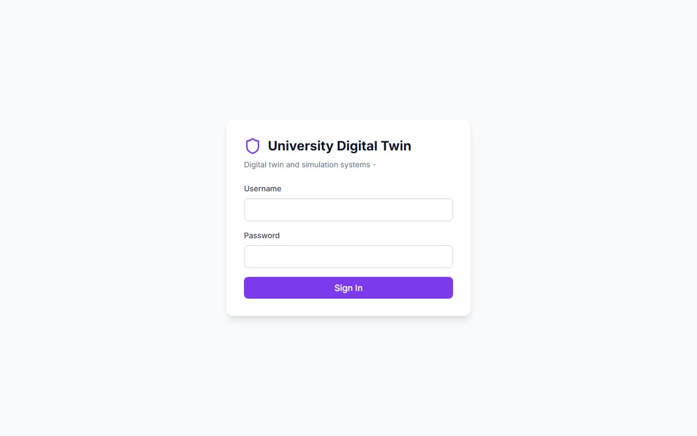

**Directory:** `university-digital-twin`  
**Stack:** React/Vite  
**Port:** 80  
**Docker:** Yes  
**Description:** Digital twin and simulation systems -  

```bash
cd university-digital-twin
pnpm install
pnpm run dev
```

---

## Healthcare & Medical

**6 applications**

### Health Wellness Portal
<a name="health-wellness-portal"></a>

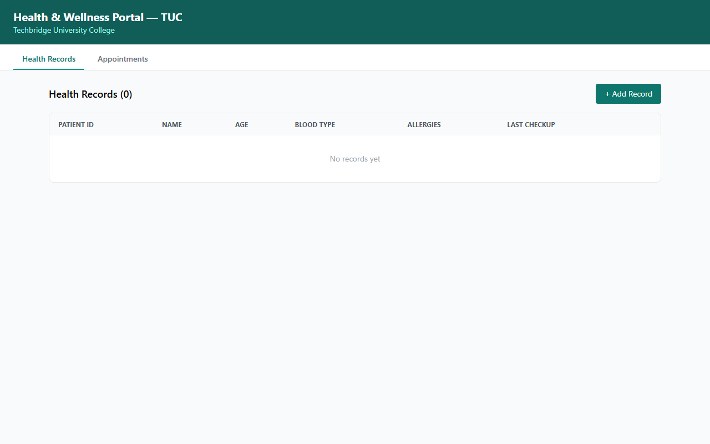

**Directory:** `health-wellness-portal`  
**Stack:** Node.js/Express  
**Port:** 4173  
**Docker:** Yes  

```bash
cd health-wellness-portal
pnpm install
pnpm run dev
```

### Hospital Resource Allocator
<a name="hospital-resource-allocator"></a>

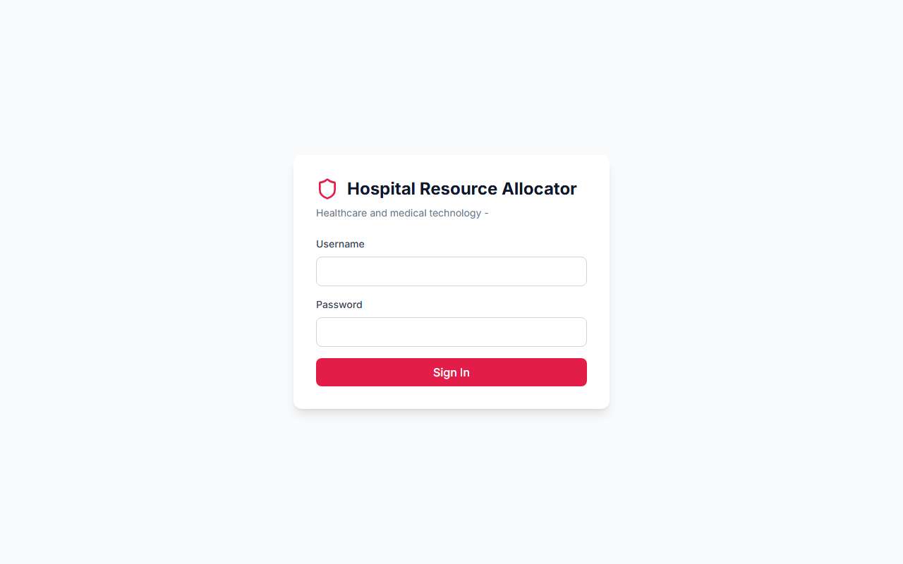

**Directory:** `hospital-resource-allocator`  
**Stack:** React/Vite  
**Port:** 80  
**Docker:** Yes  
**Description:** Healthcare and medical technology -  

```bash
cd hospital-resource-allocator
pnpm install
pnpm run dev
```

### Medical Claims Validator
<a name="medical-claims-validator"></a>


**Directory:** `medical-claims-validator`  
**Stack:** React/Vite  
**Port:** 80  
**Docker:** Yes  
**Description:** Healthcare and medical technology -  

```bash
cd medical-claims-validator
pnpm install
pnpm run dev
```

### Public Health Surveillance AI
<a name="public-health-surveillance-ai"></a>

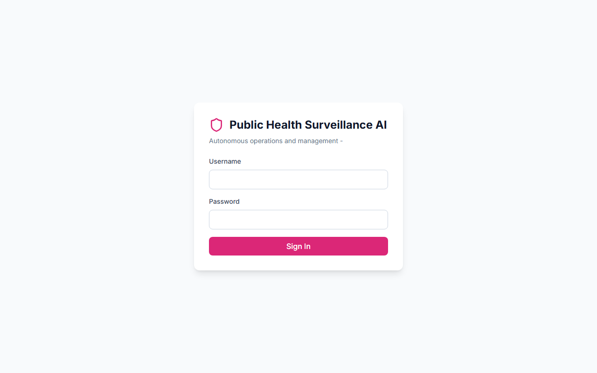

**Directory:** `public-health-surveillance-ai`  
**Stack:** React/Vite  
**Port:** 80  
**Docker:** Yes  
**Description:** Autonomous operations and management -  

```bash
cd public-health-surveillance-ai
pnpm install
pnpm run dev
```

### Soil Health Analyzer
<a name="soil-health-analyzer"></a>


**Directory:** `soil-health-analyzer`  
**Stack:** React/Vite  
**Port:** 80  
**Docker:** Yes  
**Description:** Agricultural technology and farming -  

```bash
cd soil-health-analyzer
pnpm install
pnpm run dev
```

### Telemedicine Session Optimizer
<a name="telemedicine-session-optimizer"></a>

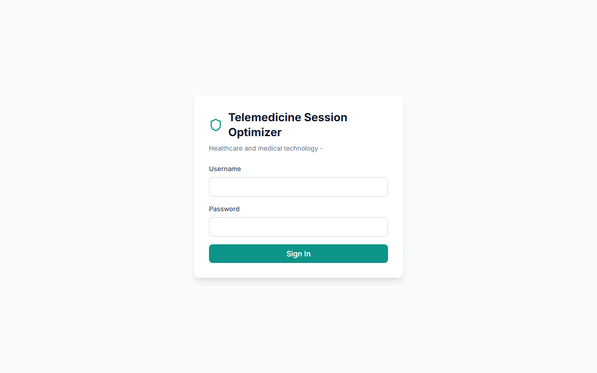

**Directory:** `telemedicine-session-optimizer`  
**Stack:** React/Vite  
**Port:** 80  
**Docker:** Yes  
**Description:** Healthcare and medical technology -  

```bash
cd telemedicine-session-optimizer
pnpm install
pnpm run dev
```

---

## Education & Learning

**18 applications**

### Academic Integrity Detector
<a name="academic-integrity-detector"></a>

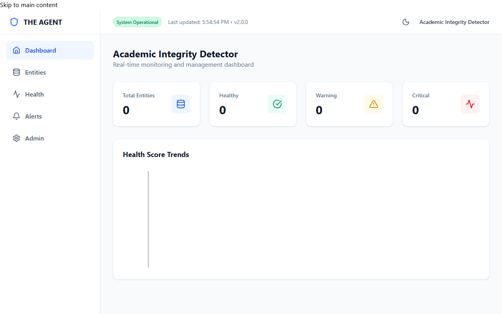

**Directory:** `academic-integrity-detector`  
**Stack:** React/Vite  
**Port:** 80  
**Docker:** Yes  
**Description:** Educational technology and learning systems -  

```bash
cd academic-integrity-detector
pnpm install
pnpm run dev
```

### Adaptive Curriculum Engine
<a name="adaptive-curriculum-engine"></a>

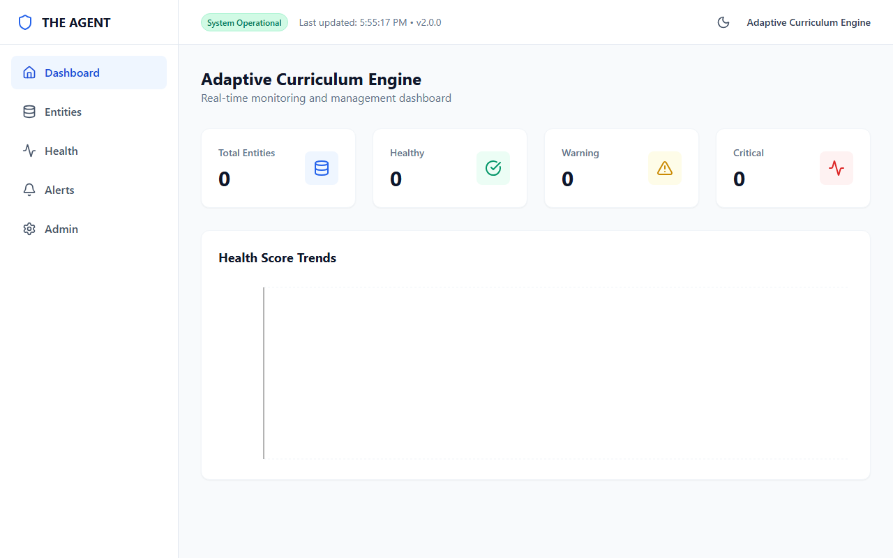

**Directory:** `adaptive-curriculum-engine`  
**Stack:** React/Vite  
**Port:** 80  
**Docker:** Yes  
**Description:** Educational technology and learning systems -  

```bash
cd adaptive-curriculum-engine
pnpm install
pnpm run dev
```

### Asanska University College
<a name="asanska-university-college"></a>


**Directory:** `asanska-university-college`  
**Stack:** React/Vite  
**Port:** 80  
**Docker:** Yes  

```bash
cd asanska-university-college
pnpm install
pnpm run dev
```

### Class4 Digital Learning
<a name="class4-digital-learning"></a>


**Directory:** `class4-digital-learning`  
**Stack:** React/Vite  
**Port:** 4173  
**Docker:** Yes  
**Description:** Class 4 Mathematics Digital Learning System - NaCCA Curriculum Aligned  

```bash
cd class4-digital-learning
pnpm install
pnpm run dev
```

### Federated Learning Coordinator
<a name="federated-learning-coordinator"></a>


**Directory:** `federated-learning-coordinator`  
**Stack:** React/Vite  
**Port:** 80  
**Docker:** Yes  
**Description:** Platform infrastructure and capabilities -  

```bash
cd federated-learning-coordinator
pnpm install
pnpm run dev
```

### Lecturer Assessment Portal Db v2 27102025 1602
<a name="lecturer-assessment-portal-db-v2-27102025-1602"></a>

**Directory:** `lecturer-assessment-portal-db-v2-27102025-1602`  
**Stack:** React/Vite  
**Port:** 80  
**Docker:** Yes  
**Description:** Lecturer Assessment & Evaluation Portal - React Frontend  

```bash
cd lecturer-assessment-portal-db-v2-27102025-1602
pnpm install
pnpm run dev
```

### Lecturer Assessment System
<a name="lecturer-assessment-system"></a>


**Directory:** `lecturer-assessment-system`  
**Stack:** React/Vite  
**Port:** 4173  
**Docker:** Yes  

```bash
cd lecturer-assessment-system
pnpm install
pnpm run dev
```

### Mature Students Exam App
<a name="mature-students-exam-app"></a>


**Directory:** `mature-students-exam-app`  
**Stack:** React/Vite  
**Port:** 4173  
**Docker:** Yes  

```bash
cd mature-students-exam-app
pnpm install
pnpm run dev
```

### Mature Students Exam App Waec Integrated
<a name="mature-students-exam-app-waec-integrated"></a>


**Directory:** `mature-students-exam-app-waec-integrated`  
**Stack:** React/Vite  
**Port:** 4173  
**Docker:** Yes  

```bash
cd mature-students-exam-app-waec-integrated
pnpm install
pnpm run dev
```

### Pdf To Assessment Json Converter
<a name="pdf-to-assessment-json-converter"></a>


**Directory:** `pdf-to-assessment-json-converter`  
**Stack:** React/Vite  
**Port:** 4173  
**Docker:** Yes  

```bash
cd pdf-to-assessment-json-converter
pnpm install
pnpm run dev
```

### Student Payment System
<a name="student-payment-system"></a>

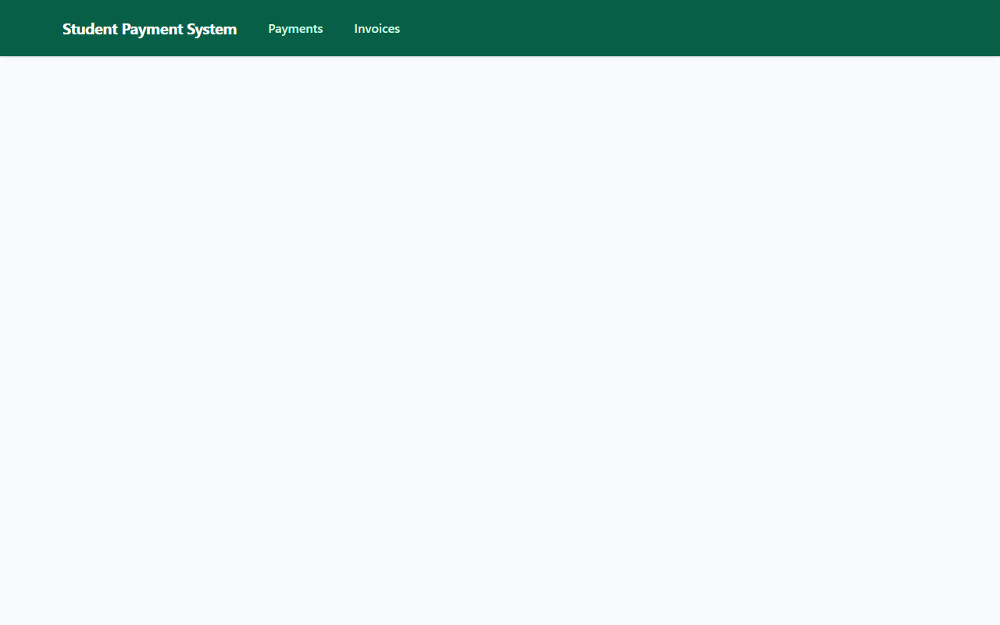

**Directory:** `student-payment-system`  
**Stack:** Node.js/Express  
**Port:** 4173  
**Docker:** Yes  

```bash
cd student-payment-system
pnpm install
pnpm run dev
```

### Student Success Coach
<a name="student-success-coach"></a>

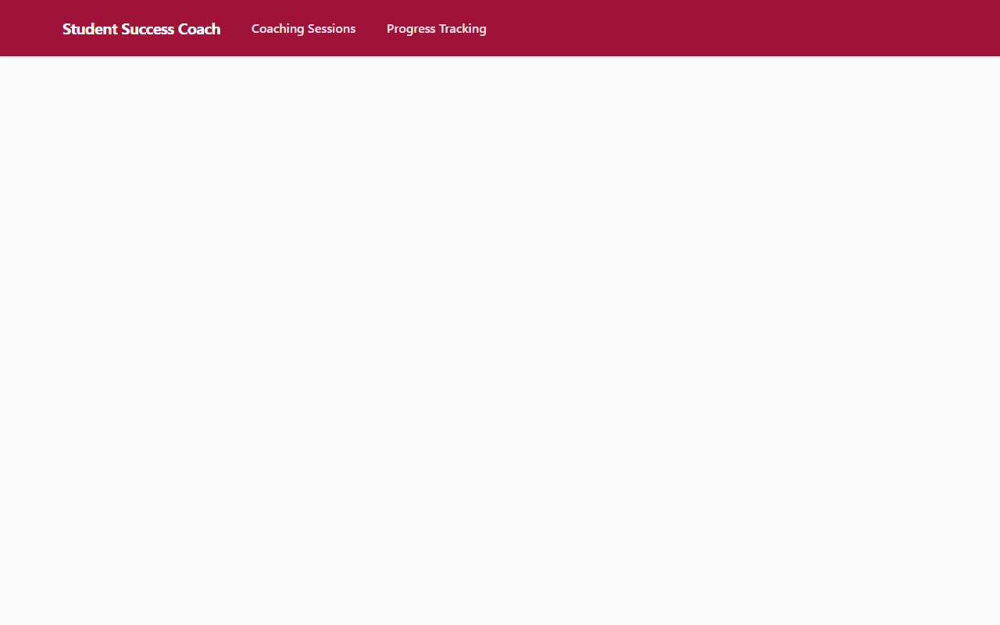

**Directory:** `student-success-coach`  
**Stack:** Node.js/Express  
**Port:** 4173  
**Docker:** Yes  

```bash
cd student-success-coach
pnpm install
pnpm run dev
```

### Techbridge Assessment Platform
<a name="techbridge-assessment-platform"></a>


**Directory:** `techbridge-assessment-platform`  
**Stack:** React/Vite  
**Port:** 4173  
**Docker:** Yes  

```bash
cd techbridge-assessment-platform
pnpm install
pnpm run dev
```

### Techbridge Student Population Register
<a name="techbridge-student-population-register"></a>

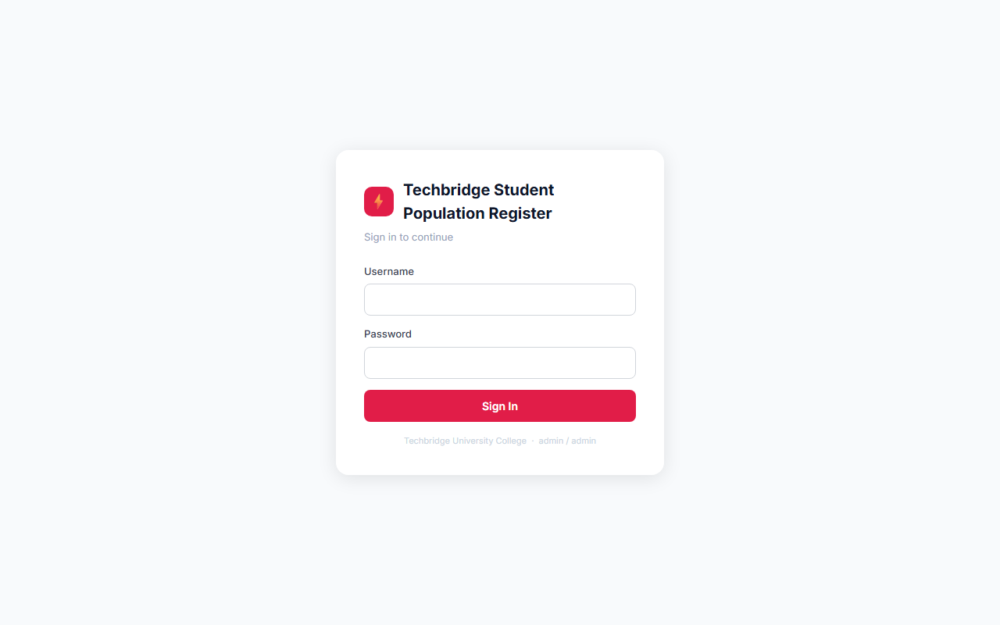

**Directory:** `techbridge-student-population-register`  
**Stack:** React/Vite  
**Port:** 80  
**Docker:** Yes  

```bash
cd techbridge-student-population-register
pnpm install
pnpm run dev
```

### Techbridge Technical Quiz Platform
<a name="techbridge-technical-quiz-platform"></a>


**Directory:** `techbridge-technical-quiz-platform`  
**Stack:** React/Vite  
**Port:** 4173  
**Docker:** Yes  

```bash
cd techbridge-technical-quiz-platform
pnpm install
pnpm run dev
```

### Techbridge University College v3.0.0
<a name="techbridge-university-college-v3.0.0"></a>

**Directory:** `techbridge-university-college-v3.0.0`  
**Stack:** React/Vite  
**Port:** 80  
**Docker:** Yes  

```bash
cd techbridge-university-college-v3.0.0
pnpm install
pnpm run dev
```

### Veca Vermont Education Contact Aggregator
<a name="veca-vermont-education-contact-aggregator"></a>


**Directory:** `veca-vermont-education-contact-aggregator`  
**Stack:** React/Vite  
**Port:** 4173  
**Docker:** Yes  

```bash
cd veca-vermont-education-contact-aggregator
pnpm install
pnpm run dev
```

### Visual Quiz Master v1
<a name="visual-quiz-master-v1"></a>

**Directory:** `visual-quiz-master-v1`  
**Stack:** React/Vite  
**Port:** 80  
**Docker:** Yes  

```bash
cd visual-quiz-master-v1
pnpm install
pnpm run dev
```

---

## Financial & Risk

**10 applications**

### Expensepro   Advanced Financial Tracker
<a name="expensepro---advanced-financial-tracker"></a>


**Directory:** `expensepro---advanced-financial-tracker`  
**Stack:** React/Vite  
**Port:** 4173  
**Docker:** Yes  

```bash
cd expensepro---advanced-financial-tracker
pnpm install
pnpm run dev
```

### Insurance Risk Intelligence Engine
<a name="insurance-risk-intelligence-engine"></a>

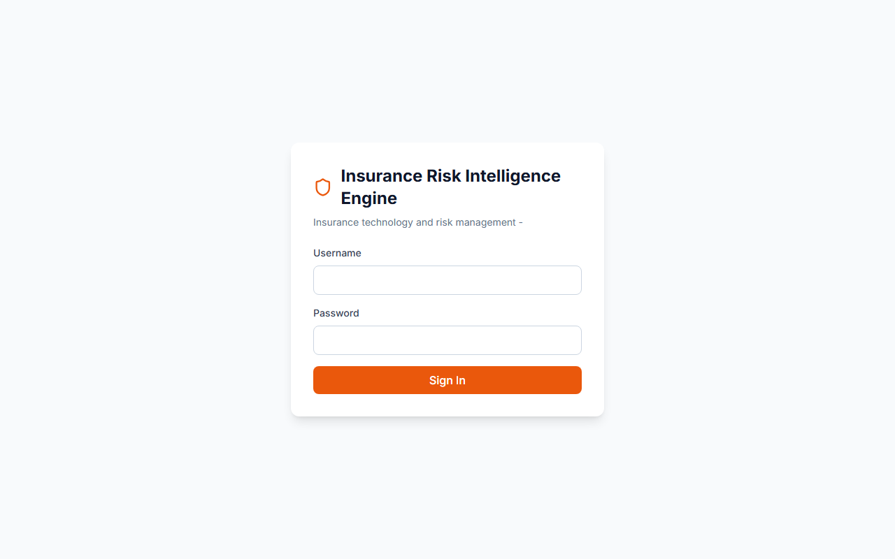

**Directory:** `insurance-risk-intelligence-engine`  
**Stack:** React/Vite  
**Port:** 80  
**Docker:** Yes  
**Description:** Insurance technology and risk management -  

```bash
cd insurance-risk-intelligence-engine
pnpm install
pnpm run dev
```

### Microcredit Risk Scorer
<a name="microcredit-risk-scorer"></a>

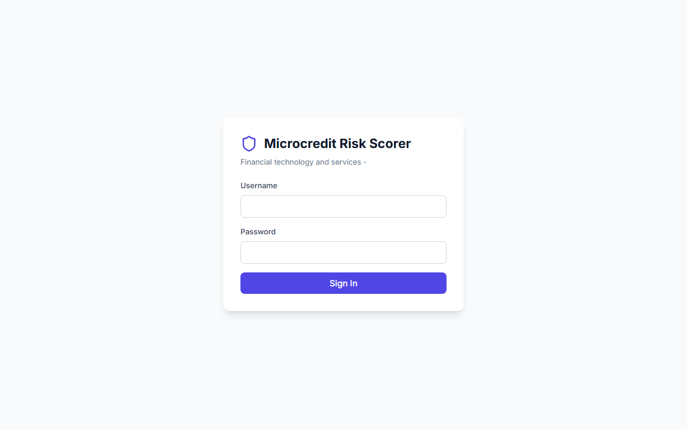

**Directory:** `microcredit-risk-scorer`  
**Stack:** React/Vite  
**Port:** 80  
**Docker:** Yes  
**Description:** Financial technology and services -  

```bash
cd microcredit-risk-scorer
pnpm install
pnpm run dev
```

### Predictive Disease Risk Model
<a name="predictive-disease-risk-model"></a>

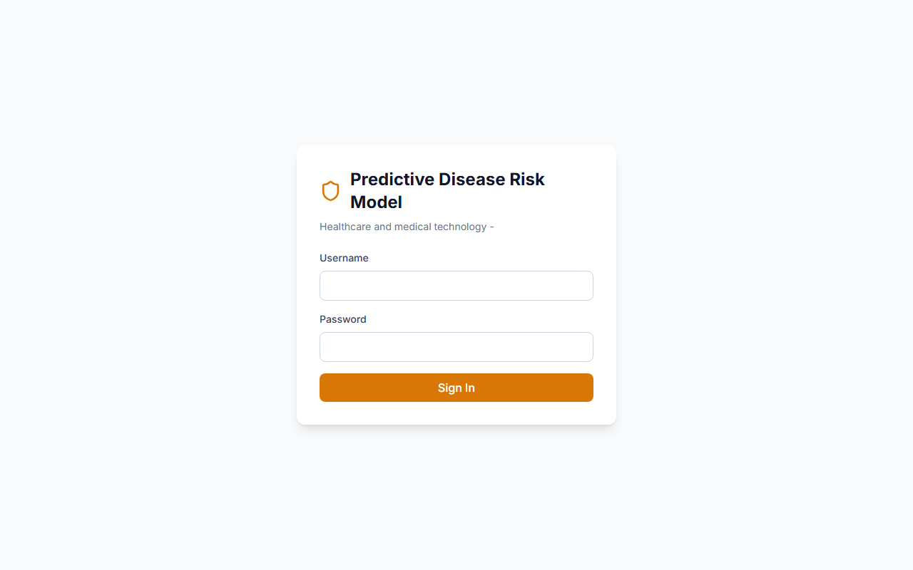

**Directory:** `predictive-disease-risk-model`  
**Stack:** React/Vite  
**Port:** 80  
**Docker:** Yes  
**Description:** Healthcare and medical technology -  

```bash
cd predictive-disease-risk-model
pnpm install
pnpm run dev
```

### Privacy Risk Assessor
<a name="privacy-risk-assessor"></a>

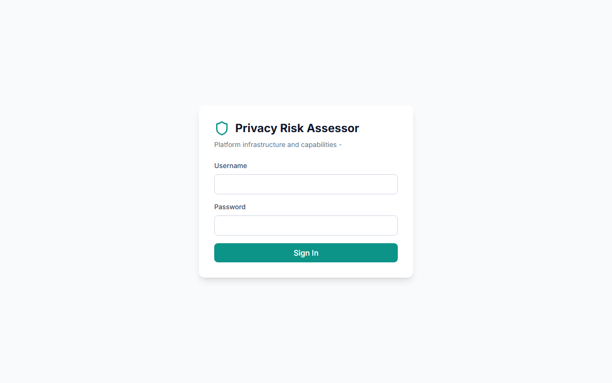

**Directory:** `privacy-risk-assessor`  
**Stack:** React/Vite  
**Port:** 80  
**Docker:** Yes  
**Description:** Platform infrastructure and capabilities -  

```bash
cd privacy-risk-assessor
pnpm install
pnpm run dev
```

### Quantum Risk Modeling Engine
<a name="quantum-risk-modeling-engine"></a>

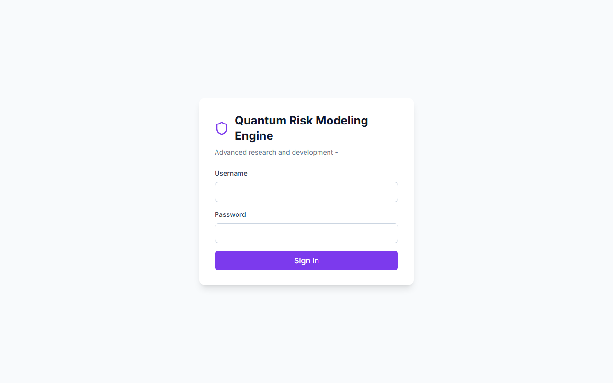

**Directory:** `quantum-risk-modeling-engine`  
**Stack:** React/Vite  
**Port:** 80  
**Docker:** Yes  
**Description:** Advanced research and development -  

```bash
cd quantum-risk-modeling-engine
pnpm install
pnpm run dev
```

### Risk Exposure Forecaster
<a name="risk-exposure-forecaster"></a>

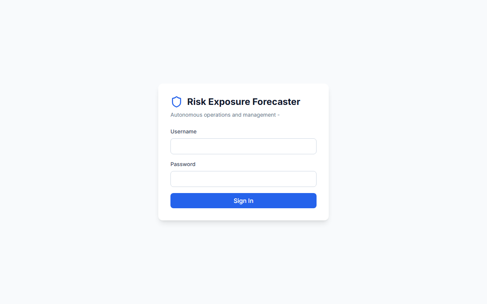

**Directory:** `risk-exposure-forecaster`  
**Stack:** React/Vite  
**Port:** 80  
**Docker:** Yes  
**Description:** Autonomous operations and management -  

```bash
cd risk-exposure-forecaster
pnpm install
pnpm run dev
```

### Smart Contract Risk Scanner
<a name="smart-contract-risk-scanner"></a>

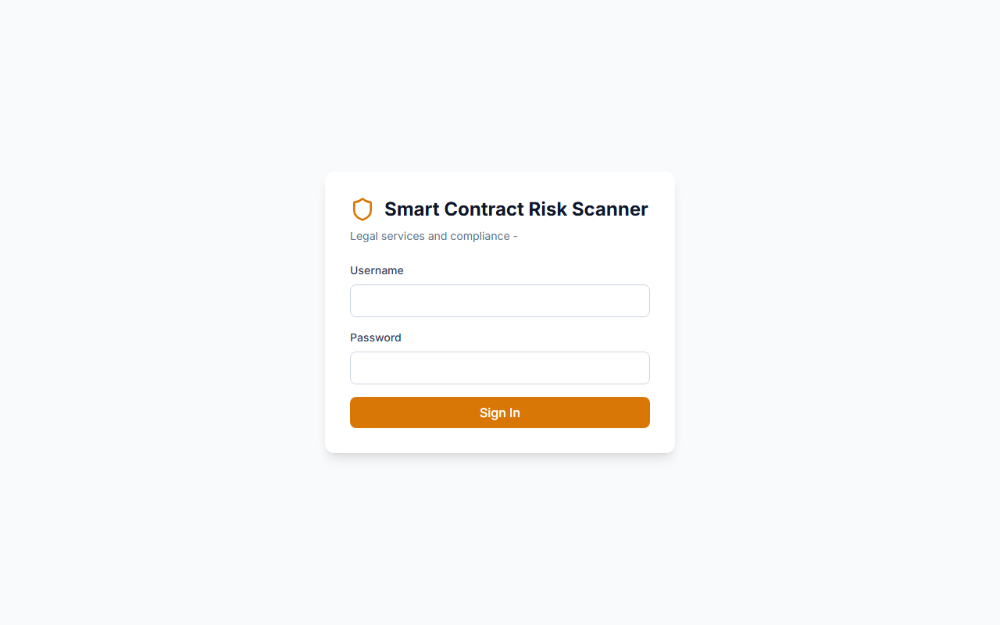

**Directory:** `smart-contract-risk-scanner`  
**Stack:** React/Vite  
**Port:** 80  
**Docker:** Yes  
**Description:** Legal services and compliance -  

```bash
cd smart-contract-risk-scanner
pnpm install
pnpm run dev
```

### Strategic Risk Balancer
<a name="strategic-risk-balancer"></a>

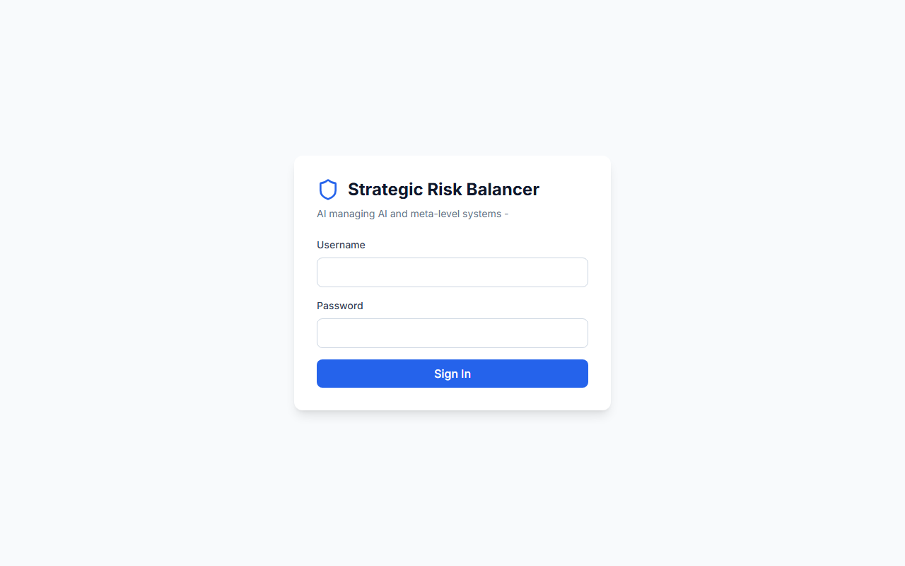

**Directory:** `strategic-risk-balancer`  
**Stack:** React/Vite  
**Port:** 80  
**Docker:** Yes  
**Description:** AI managing AI and meta-level systems -  

```bash
cd strategic-risk-balancer
pnpm install
pnpm run dev
```

### Treasury Forecasting AI
<a name="treasury-forecasting-ai"></a>

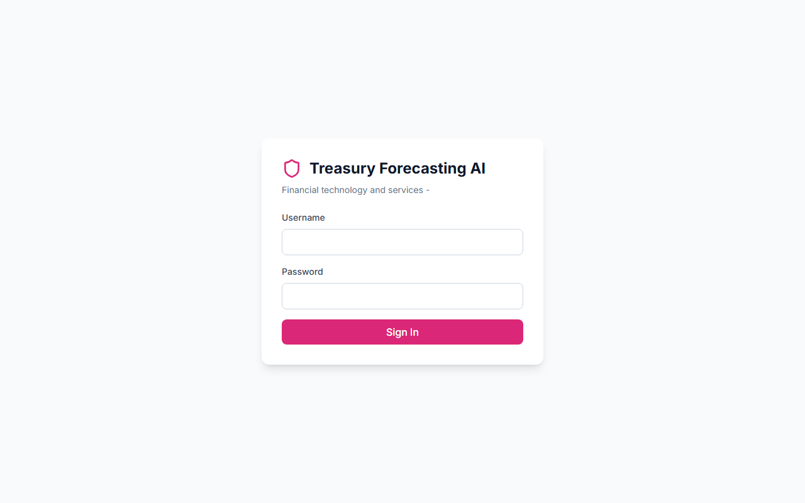

**Directory:** `treasury-forecasting-ai`  
**Stack:** React/Vite  
**Port:** 80  
**Docker:** Yes  
**Description:** Financial technology and services -  

```bash
cd treasury-forecasting-ai
pnpm install
pnpm run dev
```

---

## Security & Compliance

**6 applications**

### Cyber Threat Landscape Analyzer
<a name="cyber-threat-landscape-analyzer"></a>

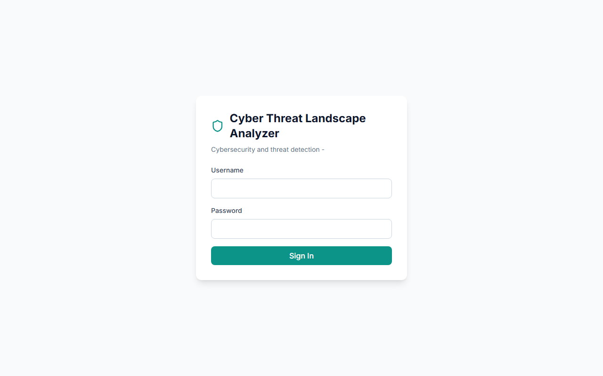

**Directory:** `cyber-threat-landscape-analyzer`  
**Stack:** React/Vite  
**Port:** 80  
**Docker:** Yes  
**Description:** Cybersecurity and threat detection -  

```bash
cd cyber-threat-landscape-analyzer
pnpm install
pnpm run dev
```

### Digital Identity Verifier
<a name="digital-identity-verifier"></a>

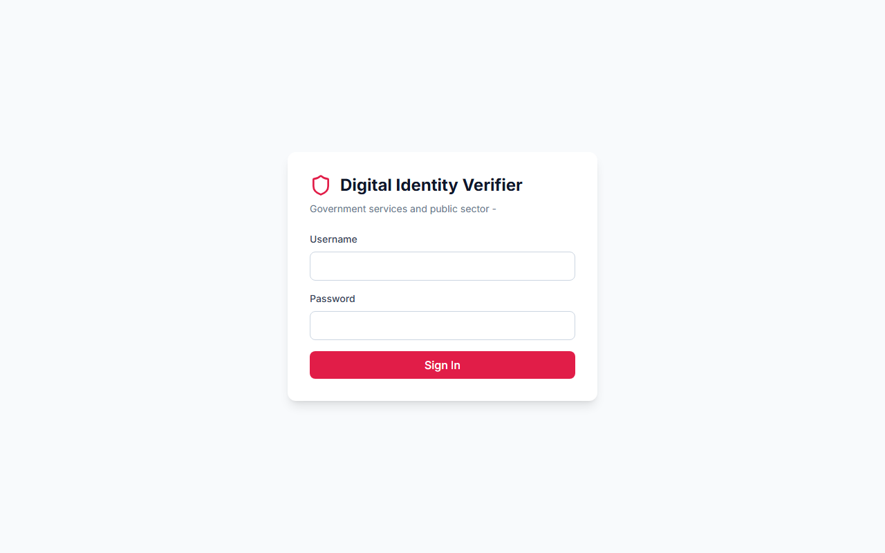

**Directory:** `digital-identity-verifier`  
**Stack:** React/Vite  
**Port:** 80  
**Docker:** Yes  
**Description:** Government services and public sector -  

```bash
cd digital-identity-verifier
pnpm install
pnpm run dev
```

### Ethical Governance AI
<a name="ethical-governance-ai"></a>


**Directory:** `ethical-governance-ai`  
**Stack:** React/Vite  
**Port:** 80  
**Docker:** Yes  
**Description:** AI managing AI and meta-level systems -  

```bash
cd ethical-governance-ai
pnpm install
pnpm run dev
```

### Fraud Detection Engine
<a name="fraud-detection-engine"></a>

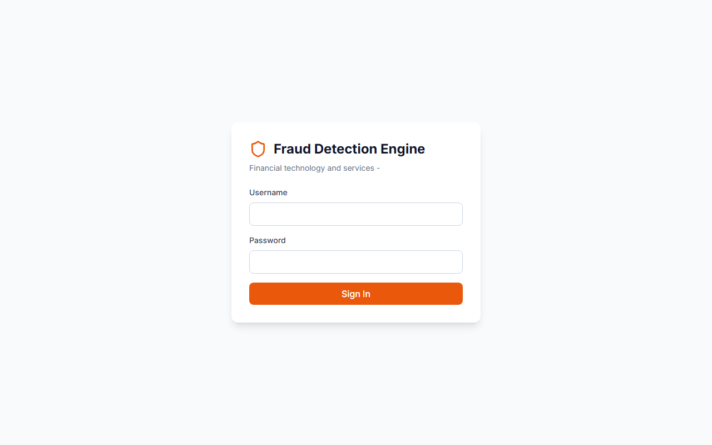

**Directory:** `fraud-detection-engine`  
**Stack:** React/Vite  
**Port:** 80  
**Docker:** Yes  
**Description:** Financial technology and services -  

```bash
cd fraud-detection-engine
pnpm install
pnpm run dev
```

### Incident Response Copilot
<a name="incident-response-copilot"></a>


**Directory:** `incident-response-copilot`  
**Stack:** React/Vite  
**Port:** 80  
**Docker:** Yes  
**Description:** Infrastructure monitoring and management -  

```bash
cd incident-response-copilot
pnpm install
pnpm run dev
```

### Trust And Governance Layer
<a name="trust-and-governance-layer"></a>

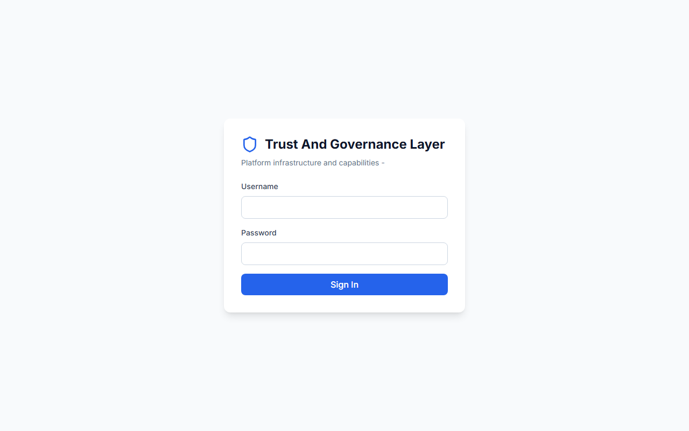

**Directory:** `trust-and-governance-layer`  
**Stack:** React/Vite  
**Port:** 80  
**Docker:** Yes  
**Description:** Platform infrastructure and capabilities -  

```bash
cd trust-and-governance-layer
pnpm install
pnpm run dev
```

---

## Infrastructure & DevOps

**6 applications**

### Cross App API Gateway
<a name="cross-app-api-gateway"></a>

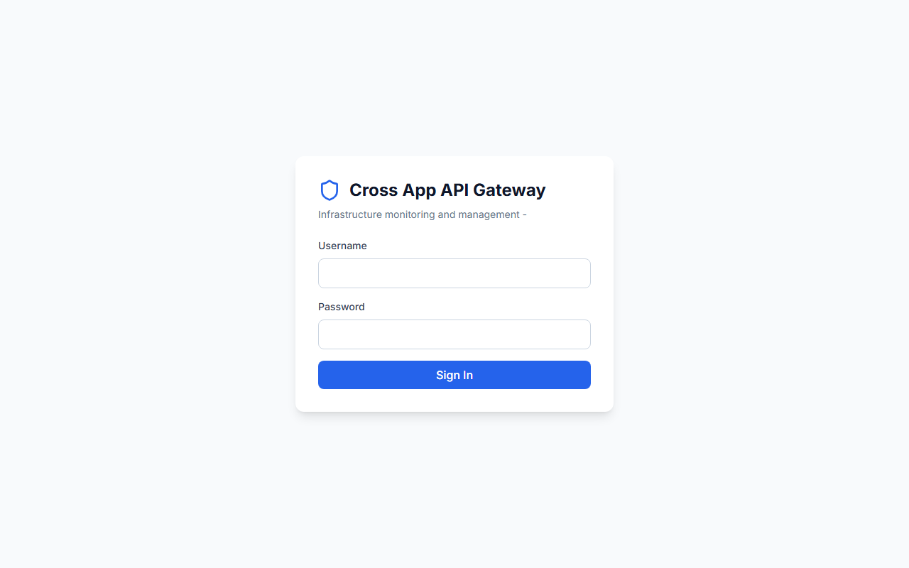

**Directory:** `cross-app-api-gateway`  
**Stack:** React/Vite  
**Port:** 80  
**Docker:** Yes  
**Description:** Infrastructure monitoring and management -  

```bash
cd cross-app-api-gateway
pnpm install
pnpm run dev
```

### Dependency Graph Visualizer
<a name="dependency-graph-visualizer"></a>

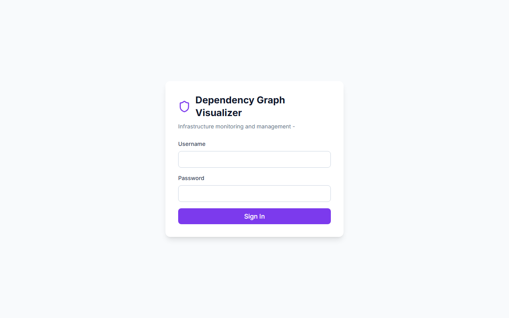

**Directory:** `dependency-graph-visualizer`  
**Stack:** React/Vite  
**Port:** 80  
**Docker:** Yes  
**Description:** Infrastructure monitoring and management -  

```bash
cd dependency-graph-visualizer
pnpm install
pnpm run dev
```

### Deployment Drift Detector
<a name="deployment-drift-detector"></a>

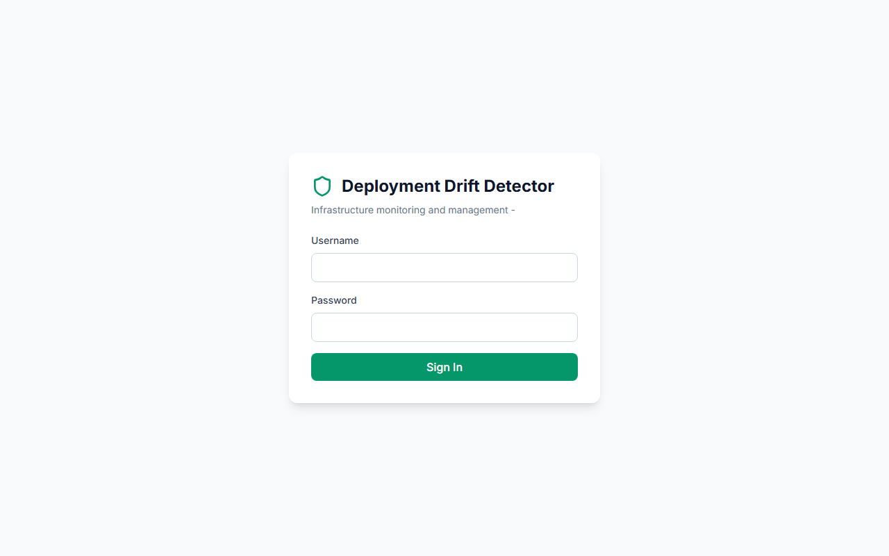

**Directory:** `deployment-drift-detector`  
**Stack:** React/Vite  
**Port:** 80  
**Docker:** Yes  
**Description:** Infrastructure monitoring and management -  

```bash
cd deployment-drift-detector
pnpm install
pnpm run dev
```

### Edge Deployment Manager
<a name="edge-deployment-manager"></a>

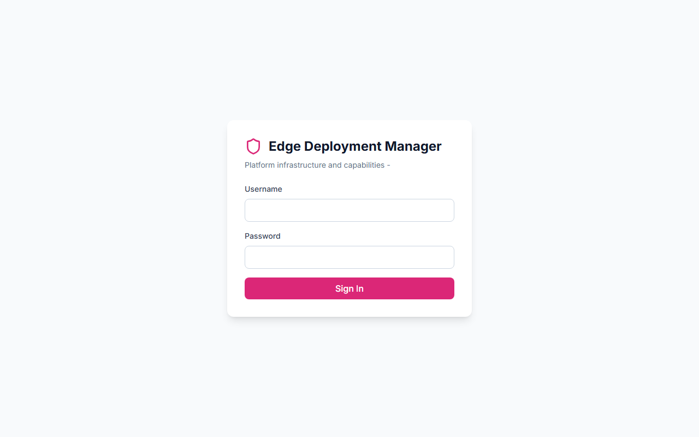

**Directory:** `edge-deployment-manager`  
**Stack:** React/Vite  
**Port:** 80  
**Docker:** Yes  
**Description:** Platform infrastructure and capabilities -  

```bash
cd edge-deployment-manager
pnpm install
pnpm run dev
```

### Infrastructure Cost Optimizer
<a name="infrastructure-cost-optimizer"></a>

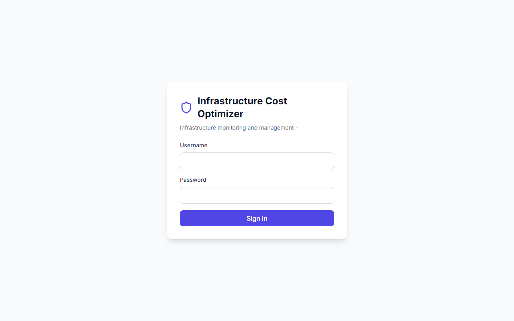

**Directory:** `infrastructure-cost-optimizer`  
**Stack:** React/Vite  
**Port:** 80  
**Docker:** Yes  
**Description:** Infrastructure monitoring and management -  

```bash
cd infrastructure-cost-optimizer
pnpm install
pnpm run dev
```

### Self Healing Infrastructure Engine
<a name="self-healing-infrastructure-engine"></a>

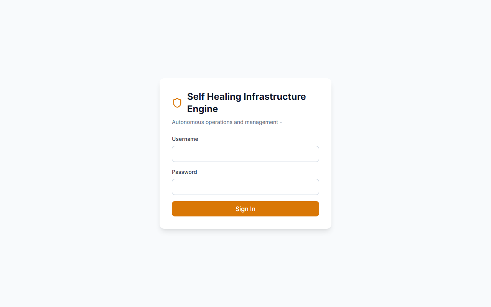

**Directory:** `self-healing-infrastructure-engine`  
**Stack:** React/Vite  
**Port:** 80  
**Docker:** Yes  
**Description:** Autonomous operations and management -  

```bash
cd self-healing-infrastructure-engine
pnpm install
pnpm run dev
```

---

## Sentinel Systems

**5 applications**

### Glucosentinel
<a name="glucosentinel"></a>

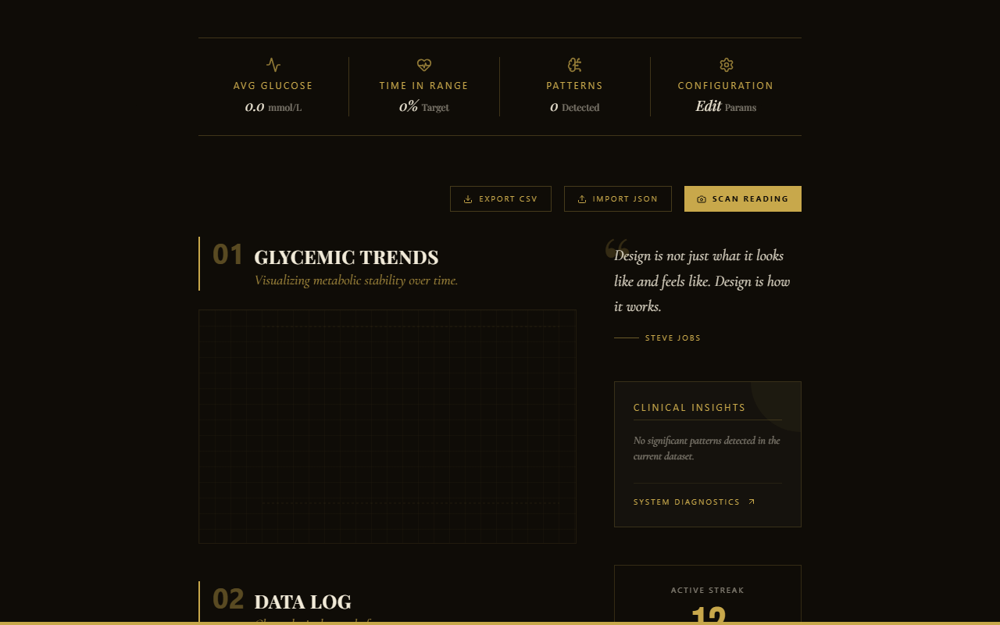

**Directory:** `glucosentinel`  
**Stack:** React/Vite  
**Port:** 4173  
**Docker:** Yes  

```bash
cd glucosentinel
pnpm install
pnpm run dev
```

### Sentinel Agent
<a name="sentinel-agent"></a>

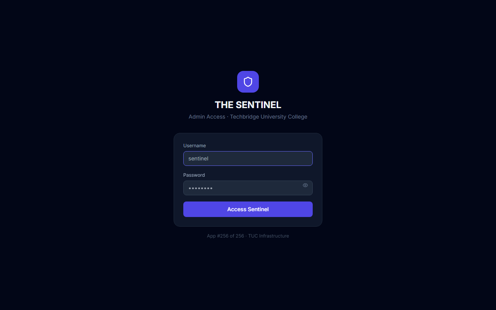

**Directory:** `sentinel-agent`  
**Stack:** React/Vite  
**Port:** 4173  
**Docker:** Yes  
**Description:** THE SENTINEL — Master Orchestrator for 255 TUC Applications  

```bash
cd sentinel-agent
pnpm install
pnpm run dev
```

### Sentinel Command Deck
<a name="sentinel-command-deck"></a>

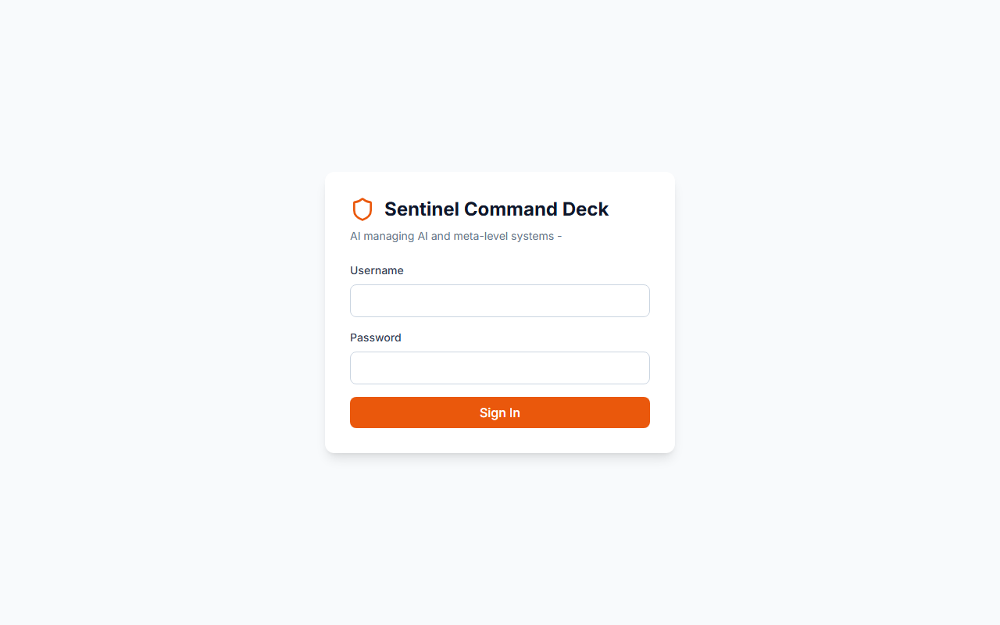

**Directory:** `sentinel-command-deck`  
**Stack:** React/Vite  
**Port:** 80  
**Docker:** Yes  
**Description:** AI managing AI and meta-level systems -  

```bash
cd sentinel-command-deck
pnpm install
pnpm run dev
```

### Sentinel Self Diagnostics Console
<a name="sentinel-self-diagnostics-console"></a>


**Directory:** `sentinel-self-diagnostics-console`  
**Stack:** React/Vite  
**Port:** 80  
**Docker:** Yes  
**Description:** Infrastructure monitoring and management -  

```bash
cd sentinel-self-diagnostics-console
pnpm install
pnpm run dev
```

### Techbridge Sentinel Agent
<a name="techbridge-sentinel-agent"></a>

**Directory:** `techbridge-sentinel-agent`  
**Stack:** Node.js/Express  
**Port:** 4173  
**Docker:** Yes  
**Description:** AI monitoring and alert management  

```bash
cd techbridge-sentinel-agent
pnpm install
pnpm run dev
```

---

## Techbridge Projects

**16 applications**

### Aucdt Iam System
<a name="aucdt-iam-system"></a>

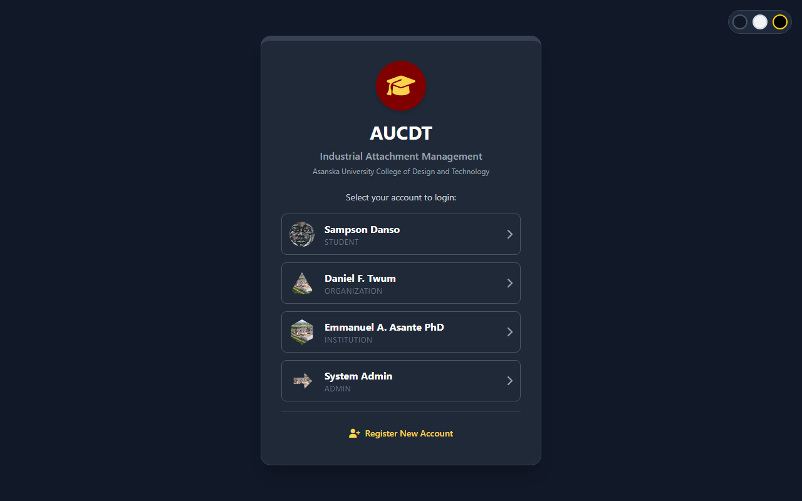

**Directory:** `aucdt-iam-system`  
**Stack:** React/Vite  
**Port:** 80  
**Docker:** Yes  

```bash
cd aucdt-iam-system
pnpm install
pnpm run dev
```

### Aucdt Msee Aptitude Test
<a name="aucdt-msee-aptitude-test"></a>


**Directory:** `aucdt-msee-aptitude-test`  
**Stack:** React/Vite  
**Port:** 80  
**Docker:** Yes  

```bash
cd aucdt-msee-aptitude-test
pnpm install
pnpm run dev
```

### Aucdt Quarto Presentation Editor
<a name="aucdt-quarto-presentation-editor"></a>

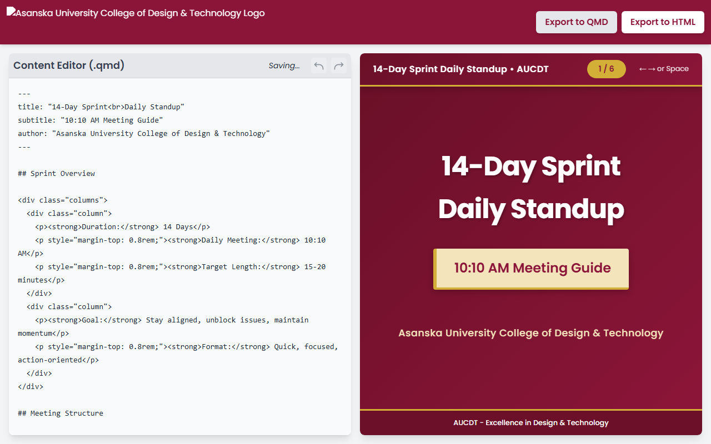

**Directory:** `aucdt-quarto-presentation-editor`  
**Stack:** React/Vite  
**Port:** 80  
**Docker:** Yes  

```bash
cd aucdt-quarto-presentation-editor
pnpm install
pnpm run dev
```

### Aucdt Sendmail API Tester
<a name="aucdt-sendmail-api-tester"></a>

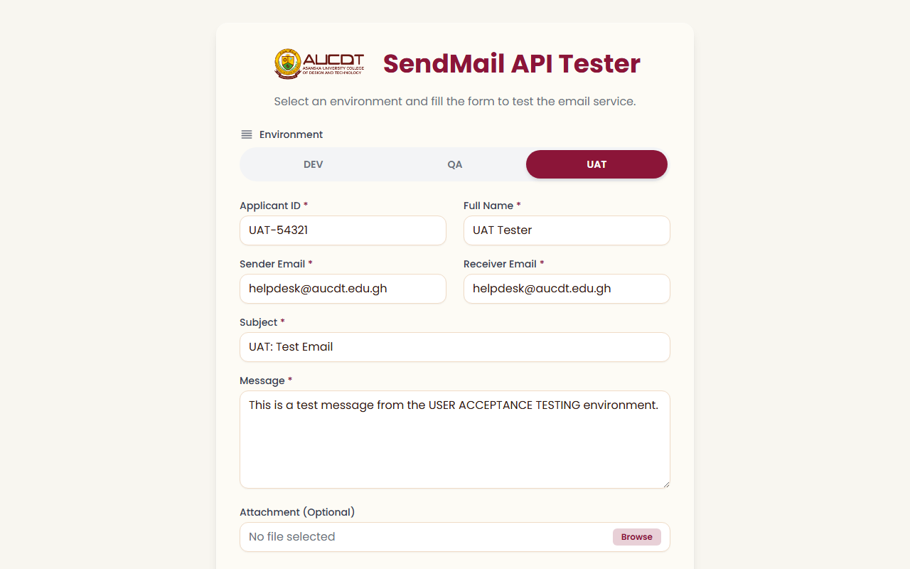

**Directory:** `aucdt-sendmail-api-tester`  
**Stack:** React/Vite  
**Port:** 80  
**Docker:** Yes  

```bash
cd aucdt-sendmail-api-tester
pnpm install
pnpm run dev
```

### Techbridge Eligibility Checker
<a name="techbridge-eligibility-checker"></a>

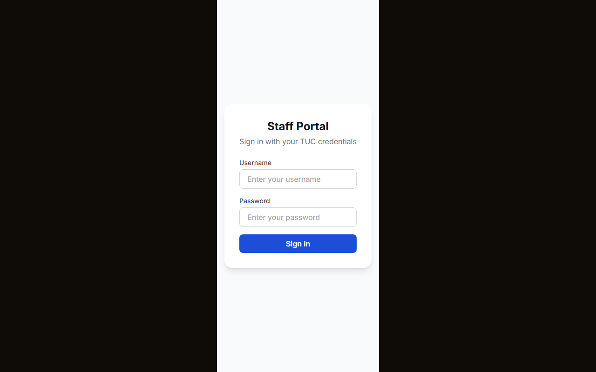

**Directory:** `techbridge-eligibility-checker`  
**Stack:** React/Vite  
**Port:** 4173  
**Docker:** Yes  

```bash
cd techbridge-eligibility-checker
pnpm install
pnpm run dev
```

### Techbridge Lead Generation Infographic
<a name="techbridge-lead-generation-infographic"></a>


**Directory:** `techbridge-lead-generation-infographic`  
**Stack:** React/Vite  
**Port:** 4173  
**Docker:** Yes  

```bash
cd techbridge-lead-generation-infographic
pnpm install
pnpm run dev
```

### Techbridge Lead Generator
<a name="techbridge-lead-generator"></a>

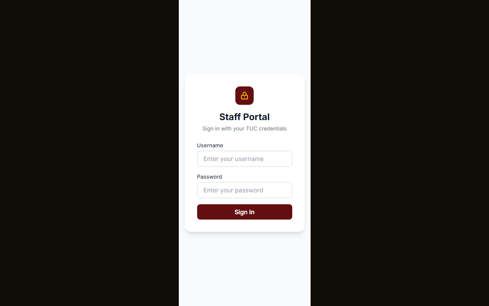

**Directory:** `techbridge-lead-generator`  
**Stack:** React/Vite  
**Port:** 4173  
**Docker:** Yes  

```bash
cd techbridge-lead-generator
pnpm install
pnpm run dev
```

### Techbridge Media Club Platform
<a name="techbridge-media-club-platform"></a>


**Directory:** `techbridge-media-club-platform`  
**Stack:** React/Vite  
**Port:** 4173  
**Docker:** Yes  

```bash
cd techbridge-media-club-platform
pnpm install
pnpm run dev
```

### Techbridge Msee Aptitude Test
<a name="techbridge-msee-aptitude-test"></a>

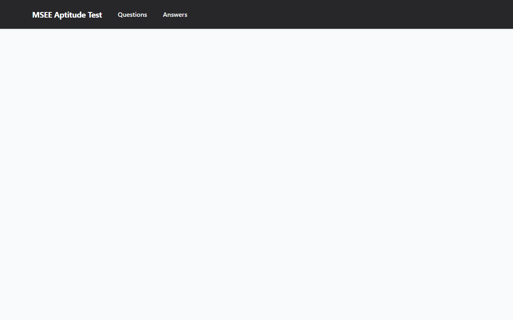

**Directory:** `techbridge-msee-aptitude-test`  
**Stack:** Node.js/Express  
**Port:** 4173  
**Docker:** Yes  

```bash
cd techbridge-msee-aptitude-test
pnpm install
pnpm run dev
```

### Techbridge Product Design 6r Design Portal
<a name="techbridge-product-design-6r-design-portal"></a>


**Directory:** `techbridge-product-design-6r-design-portal`  
**Stack:** React/Vite  
**Port:** 4173  
**Docker:** Yes  

```bash
cd techbridge-product-design-6r-design-portal
pnpm install
pnpm run dev
```

### Techbridge Promo
<a name="techbridge-promo"></a>

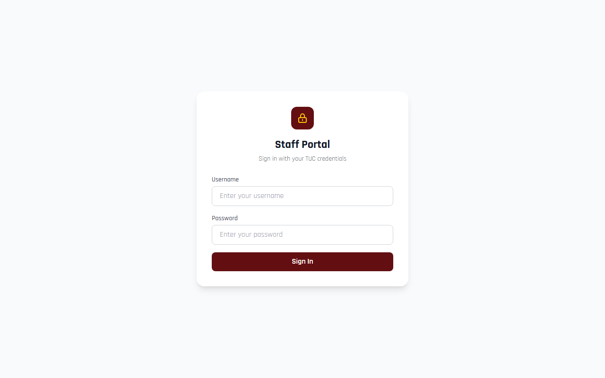

**Directory:** `techbridge-promo`  
**Stack:** React/Vite  
**Port:** 4173  
**Docker:** Yes  

```bash
cd techbridge-promo
pnpm install
pnpm run dev
```

### Techbridge Scholarship Portal v2
<a name="techbridge-scholarship-portal-v2"></a>


**Directory:** `techbridge-scholarship-portal-v2`  
**Stack:** React/Vite  
**Port:** 4173  
**Docker:** Yes  

```bash
cd techbridge-scholarship-portal-v2
pnpm install
pnpm run dev
```

### Techbridge Skills Evaluation
<a name="techbridge-skills-evaluation"></a>

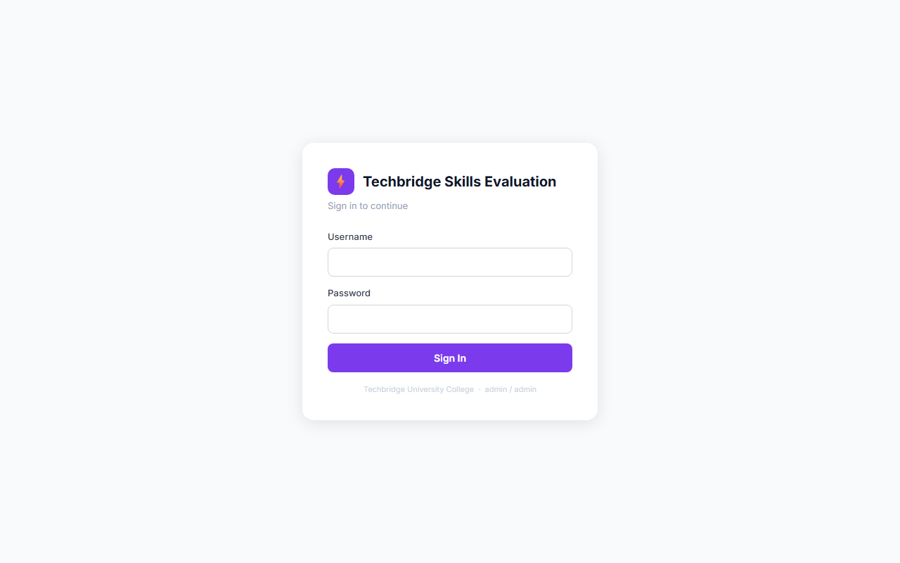

**Directory:** `techbridge-skills-evaluation`  
**Stack:** React/Vite  
**Port:** 4173  
**Docker:** Yes  

```bash
cd techbridge-skills-evaluation
pnpm install
pnpm run dev
```

### TechBridge Takehome Master
<a name="techBridge-takehome-master"></a>

**Directory:** `techBridge-takehome-master`  
**Stack:** Java/Spring Boot  
**Docker:** No  

```bash
cd techBridge-takehome-master
pnpm install
pnpm run dev
```

### Techbridge Website React
<a name="techbridge-website-react"></a>


**Directory:** `techbridge-website-react`  
**Stack:** React/Vite  
**Port:** 4173  
**Docker:** Yes  

```bash
cd techbridge-website-react
pnpm install
pnpm run dev
```

### TUC Portal Tests
<a name="tuc-portal-tests"></a>

**Directory:** `tuc-portal-tests`  
**Stack:** React/Vite  
**Docker:** Yes  
**Description:** Automated testing suite for AUCDT Admissions Portal  

```bash
cd tuc-portal-tests
pnpm install
pnpm run dev
```

---

## Grooverx

**1 application**

### Grooverx
<a name="grooverx"></a>

**Directory:** `grooverx`  
**Stack:** React/Vite  
**Docker:** No  

```bash
cd grooverx
pnpm install
pnpm run dev
```

---

## Business & Operations

**10 applications**

### Directive Workflow
<a name="directive-workflow"></a>

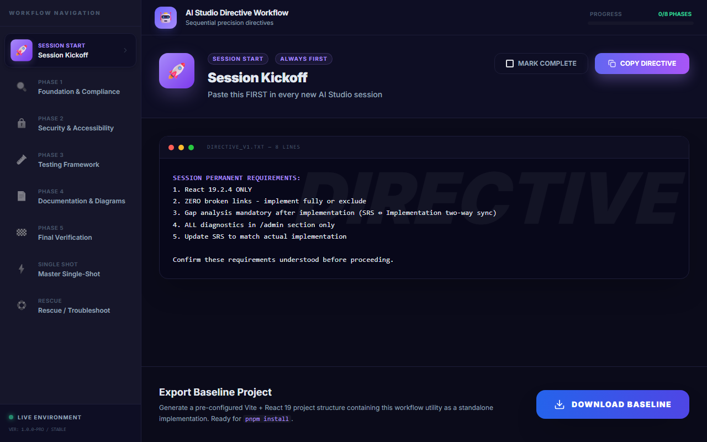

**Directory:** `directive-workflow`  
**Stack:** React/Vite  
**Port:** 4173  
**Docker:** Yes  

```bash
cd directive-workflow
pnpm install
pnpm run dev
```

### Inventory Demand Forecaster
<a name="inventory-demand-forecaster"></a>


**Directory:** `inventory-demand-forecaster`  
**Stack:** React/Vite  
**Port:** 80  
**Docker:** Yes  
**Description:** Industrial automation and manufacturing -  

```bash
cd inventory-demand-forecaster
pnpm install
pnpm run dev
```

### Kanban App
<a name="kanban-app"></a>


**Directory:** `kanban-app`  
**Stack:** React/Vite  
**Port:** 4173  
**Docker:** Yes  

```bash
cd kanban-app
pnpm install
pnpm run dev
```

### Logistics Fleet Autopilot
<a name="logistics-fleet-autopilot"></a>


**Directory:** `logistics-fleet-autopilot`  
**Stack:** React/Vite  
**Port:** 80  
**Docker:** Yes  
**Description:** Autonomous operations and management -  

```bash
cd logistics-fleet-autopilot
pnpm install
pnpm run dev
```

### Semantic Workflow Engine
<a name="semantic-workflow-engine"></a>

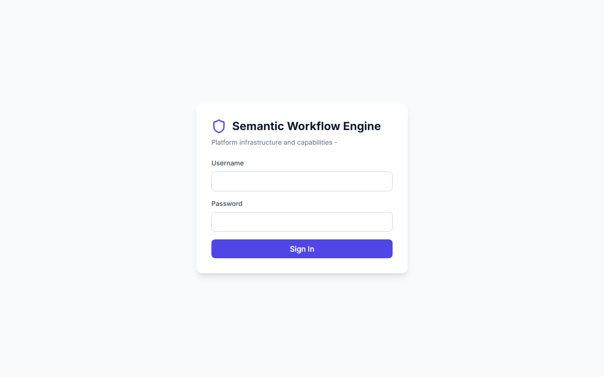

**Directory:** `semantic-workflow-engine`  
**Stack:** React/Vite  
**Port:** 80  
**Docker:** Yes  
**Description:** Platform infrastructure and capabilities -  

```bash
cd semantic-workflow-engine
pnpm install
pnpm run dev
```

### Smart Campus Operations Engine
<a name="smart-campus-operations-engine"></a>

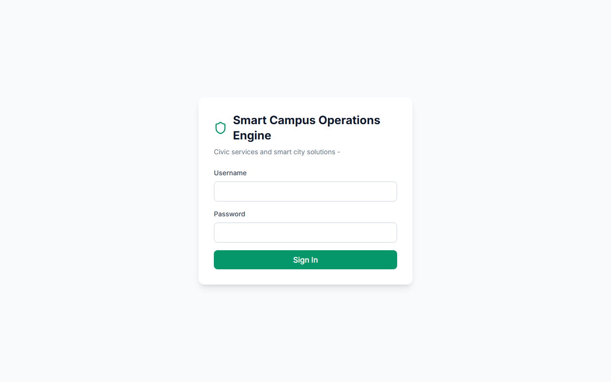

**Directory:** `smart-campus-operations-engine`  
**Stack:** React/Vite  
**Port:** 80  
**Docker:** Yes  
**Description:** Civic services and smart city solutions -  

```bash
cd smart-campus-operations-engine
pnpm install
pnpm run dev
```

### Smart Contract Executor
<a name="smart-contract-executor"></a>

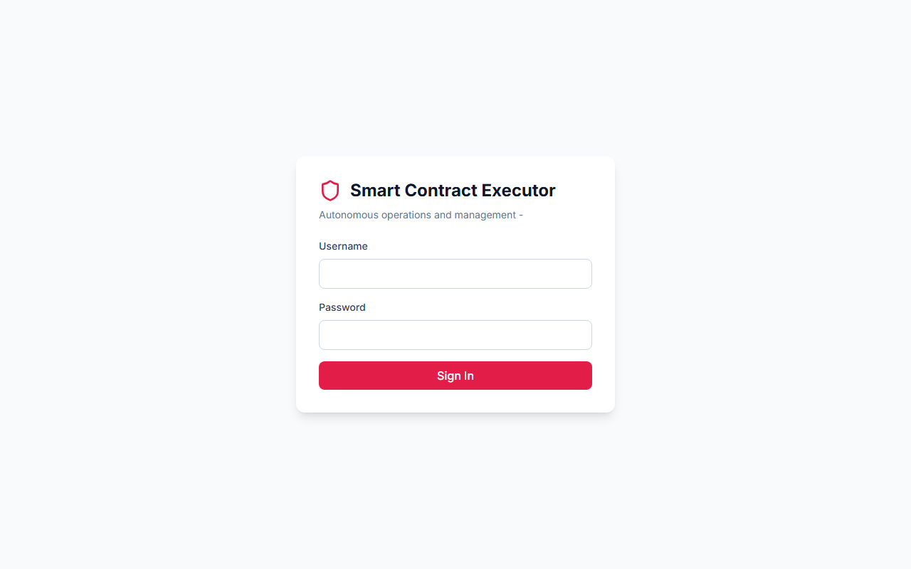

**Directory:** `smart-contract-executor`  
**Stack:** React/Vite  
**Port:** 80  
**Docker:** Yes  
**Description:** Autonomous operations and management -  

```bash
cd smart-contract-executor
pnpm install
pnpm run dev
```

### Smart Logistics Optimizer
<a name="smart-logistics-optimizer"></a>

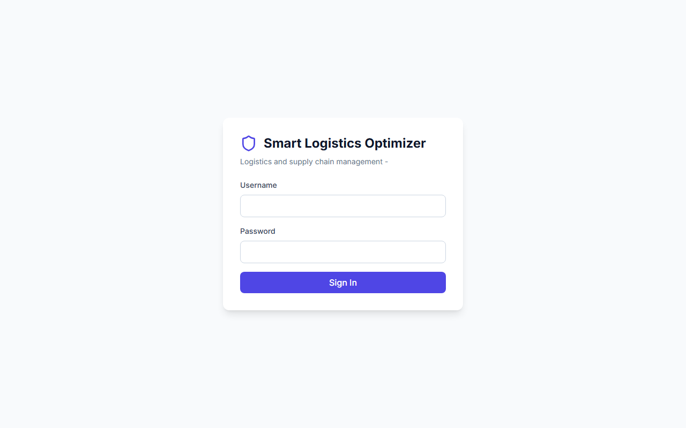

**Directory:** `smart-logistics-optimizer`  
**Stack:** React/Vite  
**Port:** 80  
**Docker:** Yes  
**Description:** Logistics and supply chain management -  

```bash
cd smart-logistics-optimizer
pnpm install
pnpm run dev
```

### Strategic Resource Redistributor
<a name="strategic-resource-redistributor"></a>

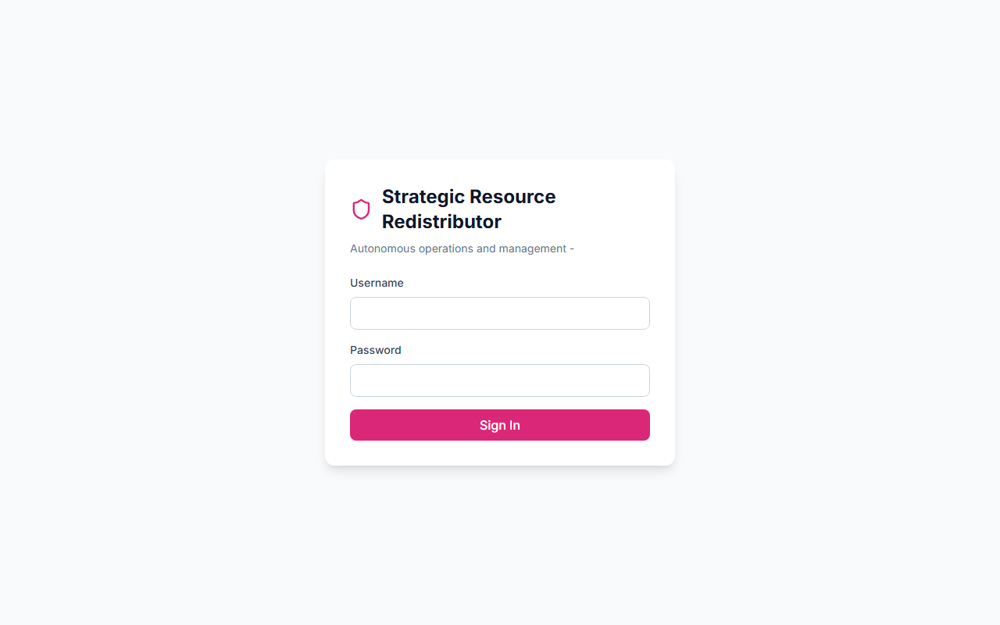

**Directory:** `strategic-resource-redistributor`  
**Stack:** React/Vite  
**Port:** 80  
**Docker:** Yes  
**Description:** Autonomous operations and management -  

```bash
cd strategic-resource-redistributor
pnpm install
pnpm run dev
```

### Supply Chain Route Optimizer
<a name="supply-chain-route-optimizer"></a>


**Directory:** `supply-chain-route-optimizer`  
**Stack:** React/Vite  
**Port:** 80  
**Docker:** Yes  
**Description:** Agricultural technology and farming -  

```bash
cd supply-chain-route-optimizer
pnpm install
pnpm run dev
```

---

## Other Applications

**123 applications**

### 6r Product Design Workshop Portal
<a name="6r-product-design-workshop-portal"></a>


**Directory:** `6r-product-design-workshop-portal`  
**Stack:** React/Vite  
**Port:** 4173  
**Docker:** Yes  

```bash
cd 6r-product-design-workshop-portal
pnpm install
pnpm run dev
```

### Accommodation Management
<a name="accommodation-management"></a>

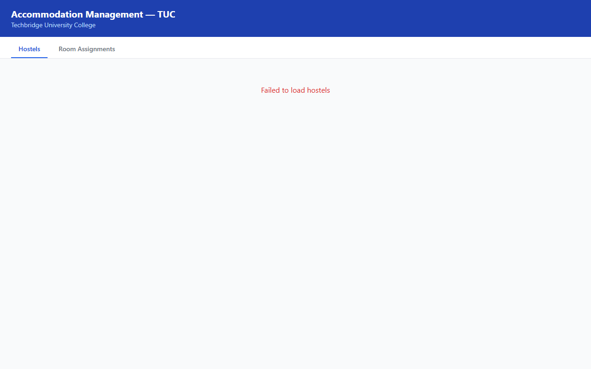

**Directory:** `accommodation-management`  
**Stack:** Node.js/Express  
**Port:** 4173  
**Docker:** Yes  

```bash
cd accommodation-management
pnpm install
pnpm run dev
```

### Agent Collaboration Framework
<a name="agent-collaboration-framework"></a>


**Directory:** `agent-collaboration-framework`  
**Stack:** React/Vite  
**Port:** 80  
**Docker:** Yes  
**Description:** Platform infrastructure and capabilities -  

```bash
cd agent-collaboration-framework
pnpm install
pnpm run dev
```

### Ajumapro Sms
<a name="ajumapro-sms"></a>

**Directory:** `ajumapro-sms`  
**Stack:** React/Vite  
**Port:** 3001  
**Docker:** Yes  

```bash
cd ajumapro-sms
pnpm install
pnpm run dev
```

### Alumni Network
<a name="alumni-network"></a>

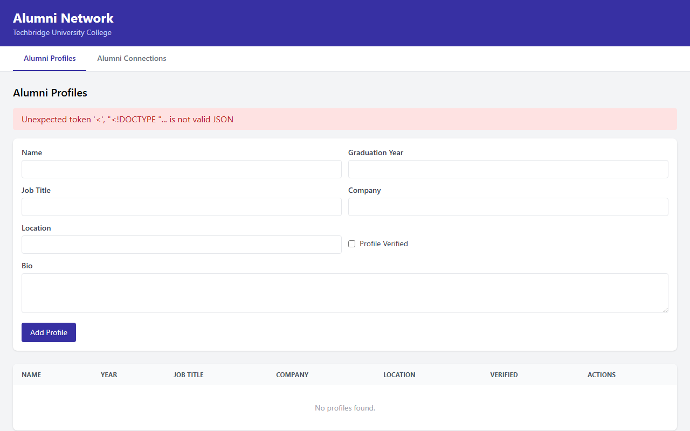

**Directory:** `alumni-network`  
**Stack:** Node.js/Express  
**Port:** 4173  
**Docker:** Yes  

```bash
cd alumni-network
pnpm install
pnpm run dev
```

### Ananse Cartoon Generator
<a name="ananse-cartoon-generator"></a>


**Directory:** `ananse-cartoon-generator`  
**Stack:** React/Vite  
**Port:** 4173  
**Docker:** Yes  

```bash
cd ananse-cartoon-generator
pnpm install
pnpm run dev
```

### API Monetization Portal
<a name="api-monetization-portal"></a>

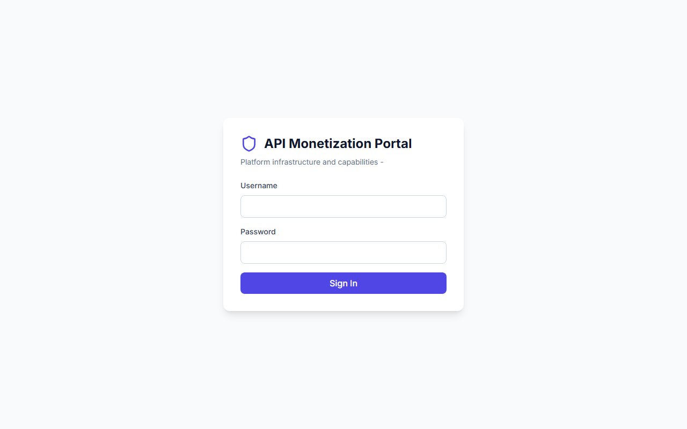

**Directory:** `api-monetization-portal`  
**Stack:** React/Vite  
**Port:** 80  
**Docker:** Yes  
**Description:** Platform infrastructure and capabilities -  

```bash
cd api-monetization-portal
pnpm install
pnpm run dev
```

### Asanska Fashion Design Brochure
<a name="asanska-fashion-design-brochure"></a>


**Directory:** `asanska-fashion-design-brochure`  
**Stack:** React/Vite  
**Port:** 80  
**Docker:** Yes  

```bash
cd asanska-fashion-design-brochure
pnpm install
pnpm run dev
```

### Aurelia v4   Working With Aurelia
<a name="aurelia-v4---working-with-aurelia"></a>


**Directory:** `aurelia-v4---working-with-aurelia`  
**Stack:** React/Vite  
**Port:** 4173  
**Docker:** Yes  

```bash
cd aurelia-v4---working-with-aurelia
pnpm install
pnpm run dev
```

### Auto Scaling Policy Engine
<a name="auto-scaling-policy-engine"></a>

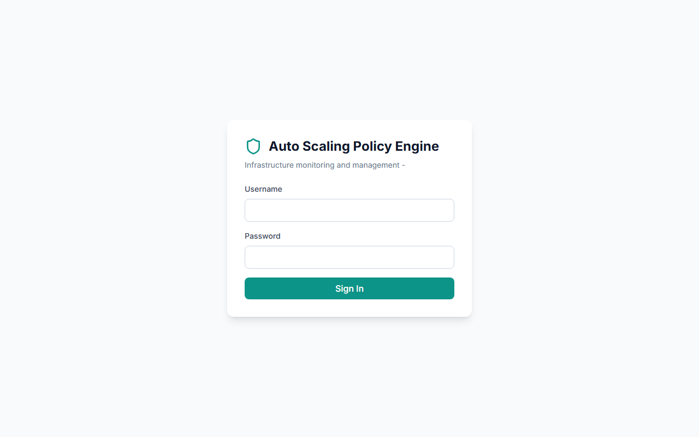

**Directory:** `auto-scaling-policy-engine`  
**Stack:** React/Vite  
**Port:** 80  
**Docker:** Yes  
**Description:** Infrastructure monitoring and management -  

```bash
cd auto-scaling-policy-engine
pnpm install
pnpm run dev
```

### Automated Rollback AI
<a name="automated-rollback-ai"></a>

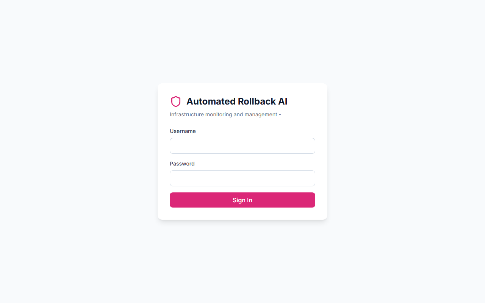

**Directory:** `automated-rollback-ai`  
**Stack:** React/Vite  
**Port:** 80  
**Docker:** Yes  
**Description:** Infrastructure monitoring and management -  

```bash
cd automated-rollback-ai
pnpm install
pnpm run dev
```

### Bias Detection Engine
<a name="bias-detection-engine"></a>

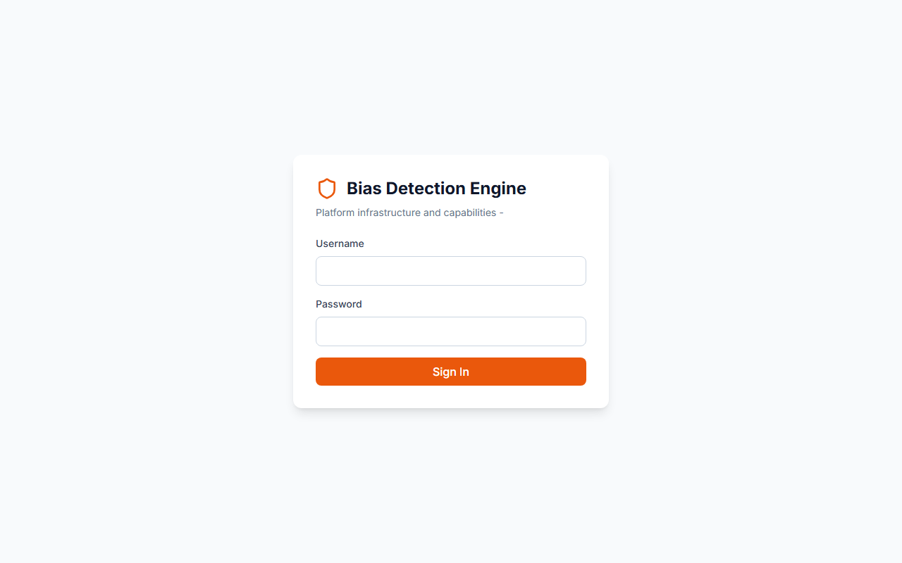

**Directory:** `bias-detection-engine`  
**Stack:** React/Vite  
**Port:** 80  
**Docker:** Yes  
**Description:** Platform infrastructure and capabilities -  

```bash
cd bias-detection-engine
pnpm install
pnpm run dev
```

### Bp Bulletproof Directive v22012026 1326
<a name="bp-bulletproof-directive-v22012026-1326"></a>


**Directory:** `bp-bulletproof-directive-v22012026-1326`  
**Stack:** React/Vite  
**Port:** 4173  
**Docker:** Yes  

```bash
cd bp-bulletproof-directive-v22012026-1326
pnpm install
pnpm run dev
```

### Brainiac Challenge
<a name="brainiac-challenge"></a>


**Directory:** `brainiac-challenge`  
**Stack:** React/Vite  
**Port:** 4173  
**Docker:** Yes  

```bash
cd brainiac-challenge
pnpm install
pnpm run dev
```

### Brand Guideline Checker
<a name="brand-guideline-checker"></a>


**Directory:** `brand-guideline-checker`  
**Stack:** React/Vite  
**Port:** 4173  
**Docker:** Yes  

```bash
cd brand-guideline-checker
pnpm install
pnpm run dev
```

### Brand Narrative Synthesizer
<a name="brand-narrative-synthesizer"></a>

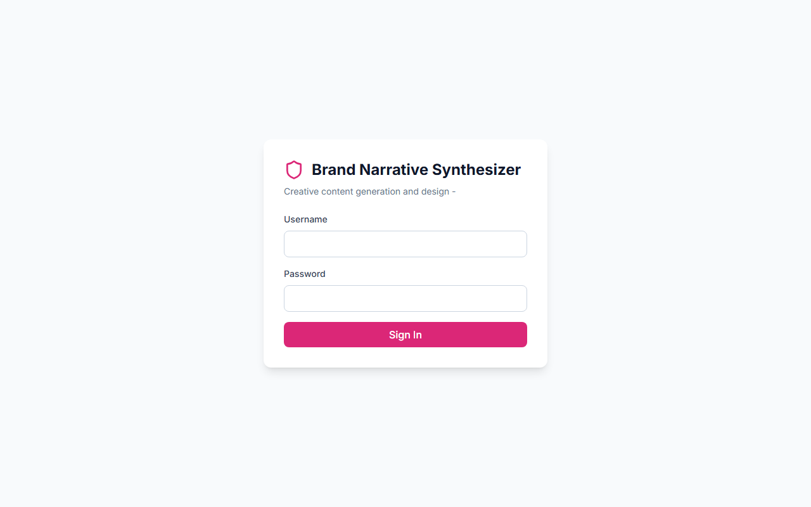

**Directory:** `brand-narrative-synthesizer`  
**Stack:** React/Vite  
**Port:** 80  
**Docker:** Yes  
**Description:** Creative content generation and design -  

```bash
cd brand-narrative-synthesizer
pnpm install
pnpm run dev
```

### Canary Release Manager
<a name="canary-release-manager"></a>

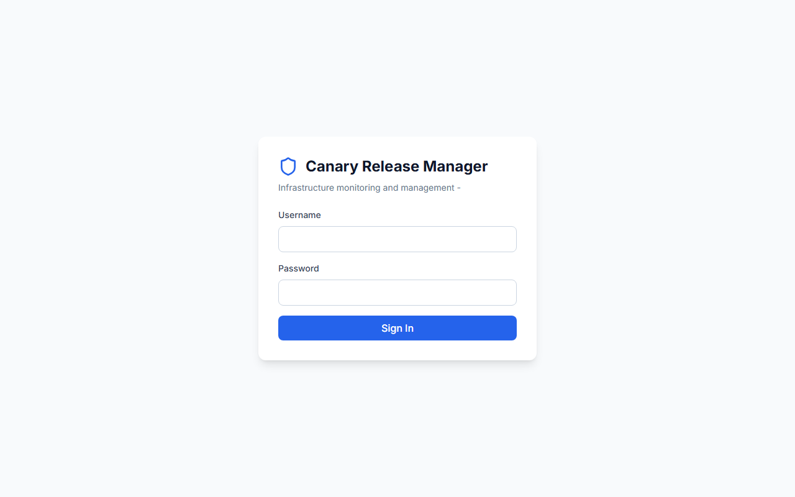

**Directory:** `canary-release-manager`  
**Stack:** React/Vite  
**Port:** 80  
**Docker:** Yes  
**Description:** Infrastructure monitoring and management -  

```bash
cd canary-release-manager
pnpm install
pnpm run dev
```

### Carbon Credit Tracker
<a name="carbon-credit-tracker"></a>

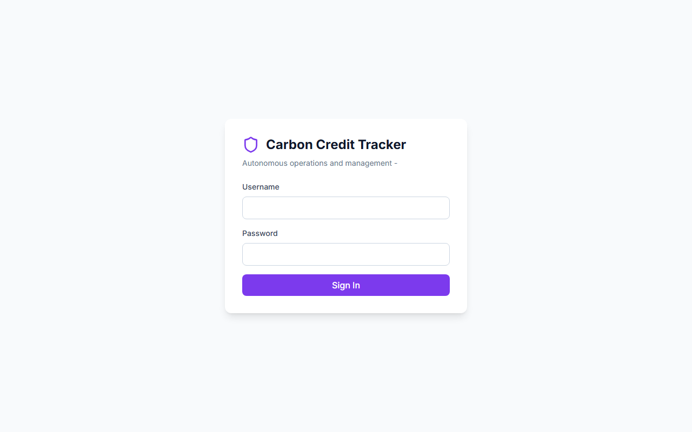

**Directory:** `carbon-credit-tracker`  
**Stack:** React/Vite  
**Port:** 80  
**Docker:** Yes  
**Description:** Autonomous operations and management -  

```bash
cd carbon-credit-tracker
pnpm install
pnpm run dev
```

### Career Services
<a name="career-services"></a>

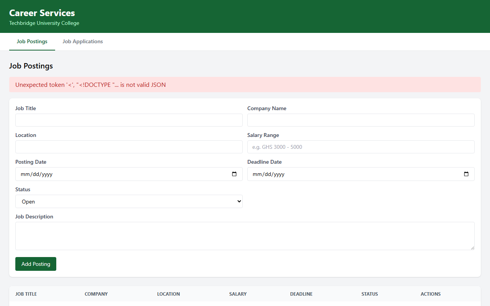

**Directory:** `career-services`  
**Stack:** Node.js/Express  
**Port:** 4173  
**Docker:** Yes  

```bash
cd career-services
pnpm install
pnpm run dev
```

### Cinematic Triptych Generator
<a name="cinematic-triptych-generator"></a>


**Directory:** `cinematic-triptych-generator`  
**Stack:** React/Vite  
**Port:** 4173  
**Docker:** Yes  

```bash
cd cinematic-triptych-generator
pnpm install
pnpm run dev
```

### Ckt Utas Modern Website
<a name="ckt-utas-modern-website"></a>


**Directory:** `ckt-utas-modern-website`  
**Stack:** React/Vite  
**Port:** 4173  
**Docker:** Yes  

```bash
cd ckt-utas-modern-website
pnpm install
pnpm run dev
```

### Climate Impact Modeler
<a name="climate-impact-modeler"></a>

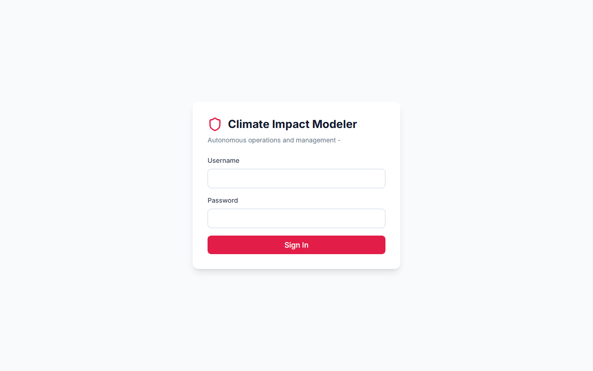

**Directory:** `climate-impact-modeler`  
**Stack:** React/Vite  
**Port:** 80  
**Docker:** Yes  
**Description:** Autonomous operations and management -  

```bash
cd climate-impact-modeler
pnpm install
pnpm run dev
```

### Commodity Price Forecast Engine
<a name="commodity-price-forecast-engine"></a>

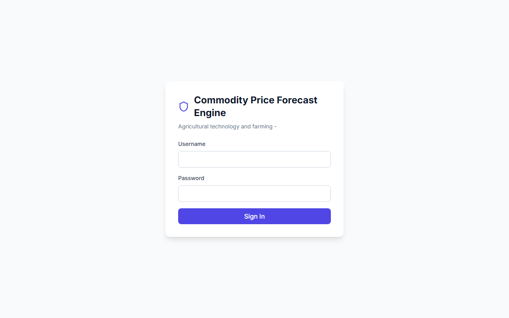

**Directory:** `commodity-price-forecast-engine`  
**Stack:** React/Vite  
**Port:** 80  
**Docker:** Yes  
**Description:** Agricultural technology and farming -  

```bash
cd commodity-price-forecast-engine
pnpm install
pnpm run dev
```

### Community Plates.v1
<a name="community-plates.v1"></a>


**Directory:** `community-plates.v1`  
**Stack:** React/Vite  
**Port:** 4173  
**Docker:** Yes  

```bash
cd community-plates.v1
pnpm install
pnpm run dev
```

### Complaint Resolution System
<a name="complaint-resolution-system"></a>

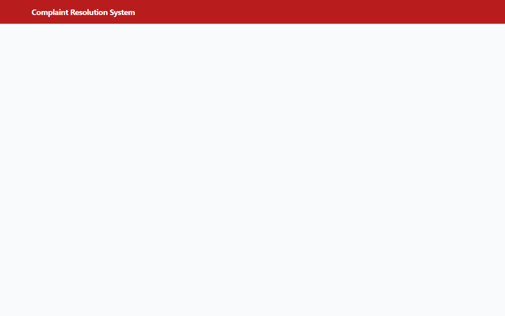

**Directory:** `complaint-resolution-system`  
**Stack:** Node.js/Express  
**Port:** 4173  
**Docker:** Yes  

```bash
cd complaint-resolution-system
pnpm install
pnpm run dev
```

### Countdown Timer
<a name="countdown-timer"></a>


**Directory:** `countdown-timer`  
**Stack:** React/Vite  
**Port:** 4173  
**Docker:** Yes  

```bash
cd countdown-timer
pnpm install
pnpm run dev
```

### Creativity Amplifier
<a name="creativity-amplifier"></a>


**Directory:** `creativity-amplifier`  
**Stack:** React/Vite  
**Port:** 80  
**Docker:** Yes  
**Description:** AI managing AI and meta-level systems -  

```bash
cd creativity-amplifier
pnpm install
pnpm run dev
```

### Crop Yield Predictor
<a name="crop-yield-predictor"></a>


**Directory:** `crop-yield-predictor`  
**Stack:** React/Vite  
**Port:** 80  
**Docker:** Yes  
**Description:** Agricultural technology and farming -  

```bash
cd crop-yield-predictor
pnpm install
pnpm run dev
```

### Cross App Data Fabric
<a name="cross-app-data-fabric"></a>

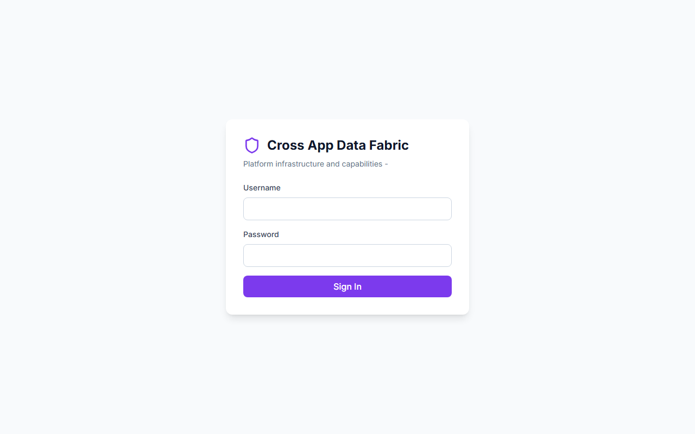

**Directory:** `cross-app-data-fabric`  
**Stack:** React/Vite  
**Port:** 80  
**Docker:** Yes  
**Description:** Platform infrastructure and capabilities -  

```bash
cd cross-app-data-fabric
pnpm install
pnpm run dev
```

### Cross App Search
<a name="cross-app-search"></a>

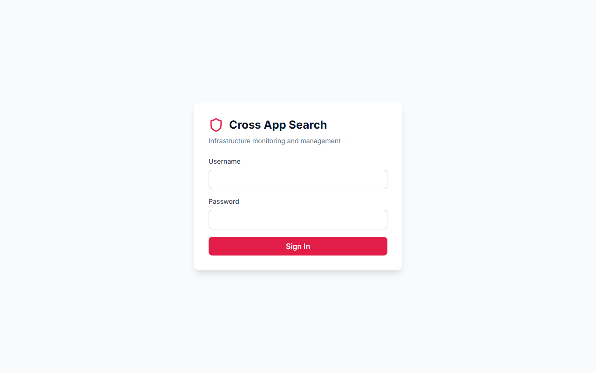

**Directory:** `cross-app-search`  
**Stack:** React/Vite  
**Port:** 80  
**Docker:** Yes  
**Description:** Infrastructure monitoring and management -  

```bash
cd cross-app-search
pnpm install
pnpm run dev
```

### Cross Border Trade Optimizer
<a name="cross-border-trade-optimizer"></a>

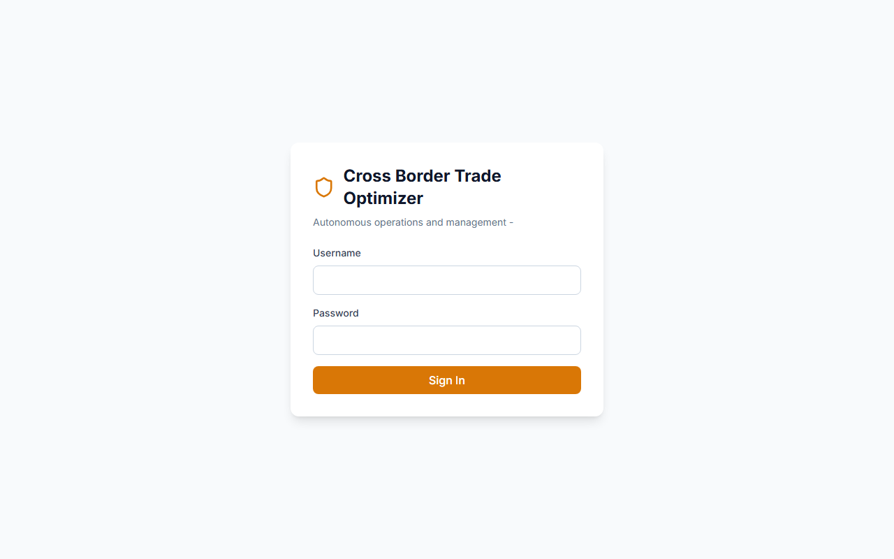

**Directory:** `cross-border-trade-optimizer`  
**Stack:** React/Vite  
**Port:** 80  
**Docker:** Yes  
**Description:** Autonomous operations and management -  

```bash
cd cross-border-trade-optimizer
pnpm install
pnpm run dev
```

### Cross Industry Pattern Miner
<a name="cross-industry-pattern-miner"></a>

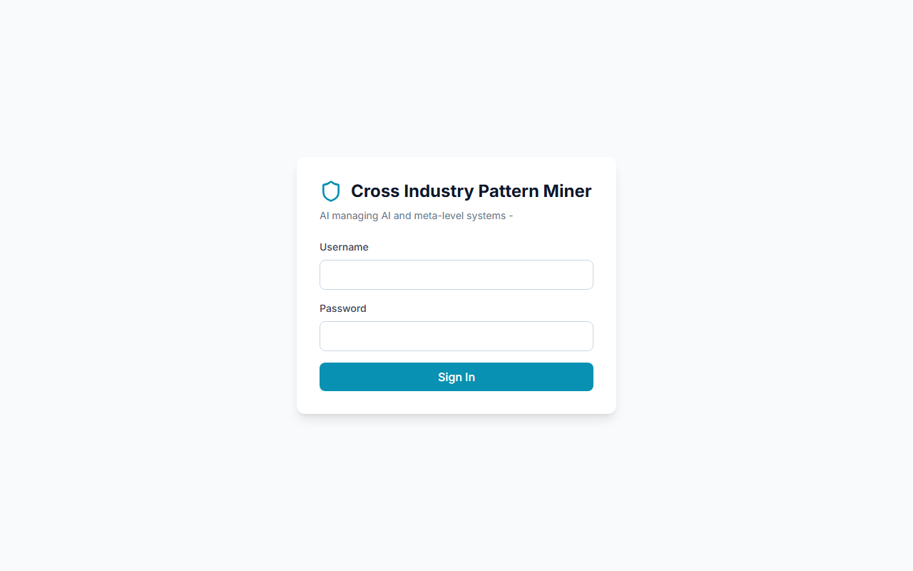

**Directory:** `cross-industry-pattern-miner`  
**Stack:** React/Vite  
**Port:** 80  
**Docker:** Yes  
**Description:** AI managing AI and meta-level systems -  

```bash
cd cross-industry-pattern-miner
pnpm install
pnpm run dev
```

### Cross System Stability Controller
<a name="cross-system-stability-controller"></a>

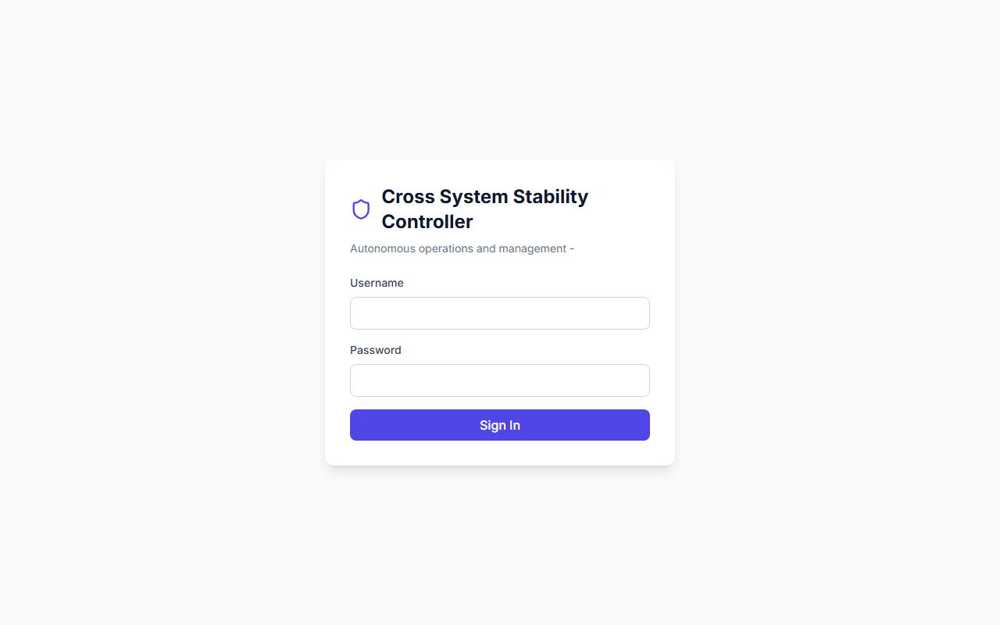

**Directory:** `cross-system-stability-controller`  
**Stack:** React/Vite  
**Port:** 80  
**Docker:** Yes  
**Description:** Autonomous operations and management -  

```bash
cd cross-system-stability-controller
pnpm install
pnpm run dev
```

### Dadaist Concert Visualizer
<a name="dadaist-concert-visualizer"></a>


**Directory:** `dadaist-concert-visualizer`  
**Stack:** React/Vite  
**Port:** 4173  
**Docker:** Yes  

```bash
cd dadaist-concert-visualizer
pnpm install
pnpm run dev
```

### Data Anonymization Engine
<a name="data-anonymization-engine"></a>

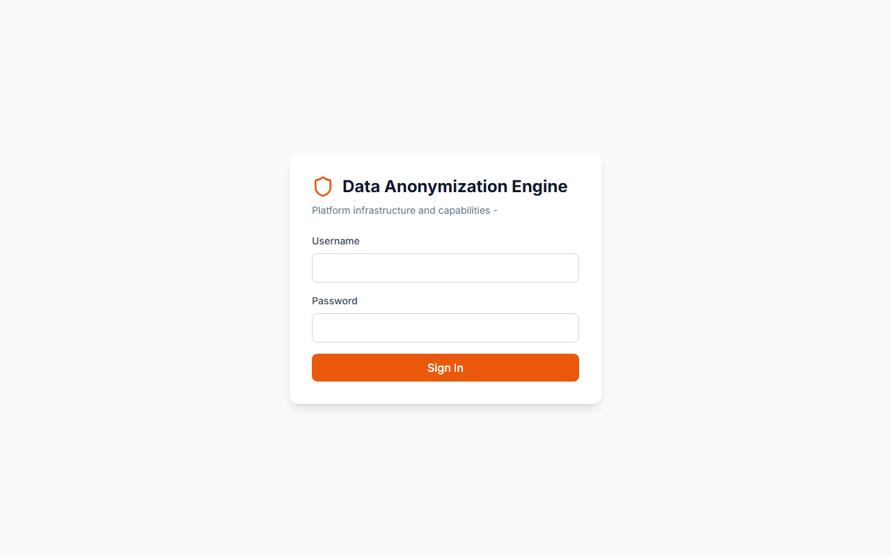

**Directory:** `data-anonymization-engine`  
**Stack:** React/Vite  
**Port:** 80  
**Docker:** Yes  
**Description:** Platform infrastructure and capabilities -  

```bash
cd data-anonymization-engine
pnpm install
pnpm run dev
```

### Data Lineage Tracker
<a name="data-lineage-tracker"></a>

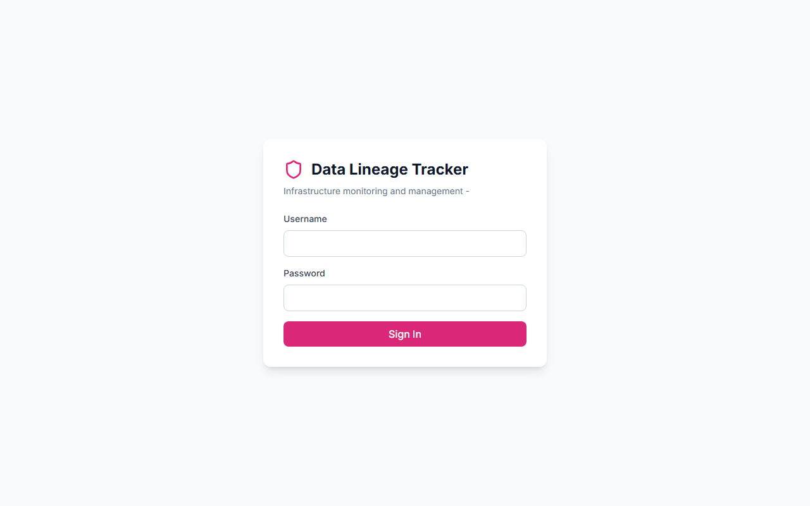

**Directory:** `data-lineage-tracker`  
**Stack:** React/Vite  
**Port:** 80  
**Docker:** Yes  
**Description:** Infrastructure monitoring and management -  

```bash
cd data-lineage-tracker
pnpm install
pnpm run dev
```

### Decision Confidence Estimator
<a name="decision-confidence-estimator"></a>


**Directory:** `decision-confidence-estimator`  
**Stack:** React/Vite  
**Port:** 80  
**Docker:** Yes  
**Description:** AI managing AI and meta-level systems -  

```bash
cd decision-confidence-estimator
pnpm install
pnpm run dev
```

### Dictation App
<a name="dictation-app"></a>


**Directory:** `dictation-app`  
**Stack:** React/Vite  
**Port:** 4173  
**Docker:** Yes  

```bash
cd dictation-app
pnpm install
pnpm run dev
```

### Disaster Response Allocator
<a name="disaster-response-allocator"></a>

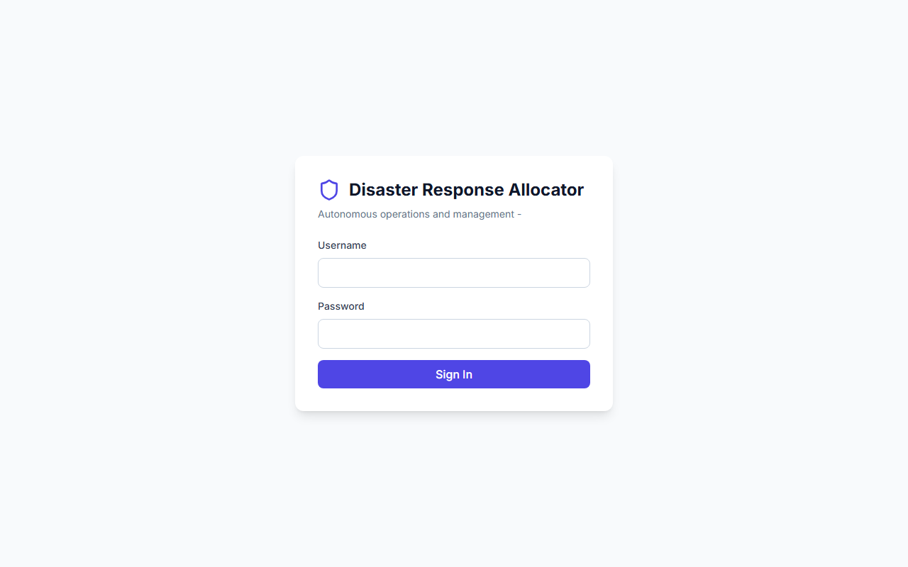

**Directory:** `disaster-response-allocator`  
**Stack:** React/Vite  
**Port:** 80  
**Docker:** Yes  
**Description:** Autonomous operations and management -  

```bash
cd disaster-response-allocator
pnpm install
pnpm run dev
```

### Dns Copy Utility
<a name="dns-copy-utility"></a>


**Directory:** `dns-copy-utility`  
**Stack:** React/Vite  
**Port:** 4173  
**Docker:** Yes  

```bash
cd dns-copy-utility
pnpm install
pnpm run dev
```

### Docujudge 202624502 1111
<a name="docujudge_202624502_1111"></a>

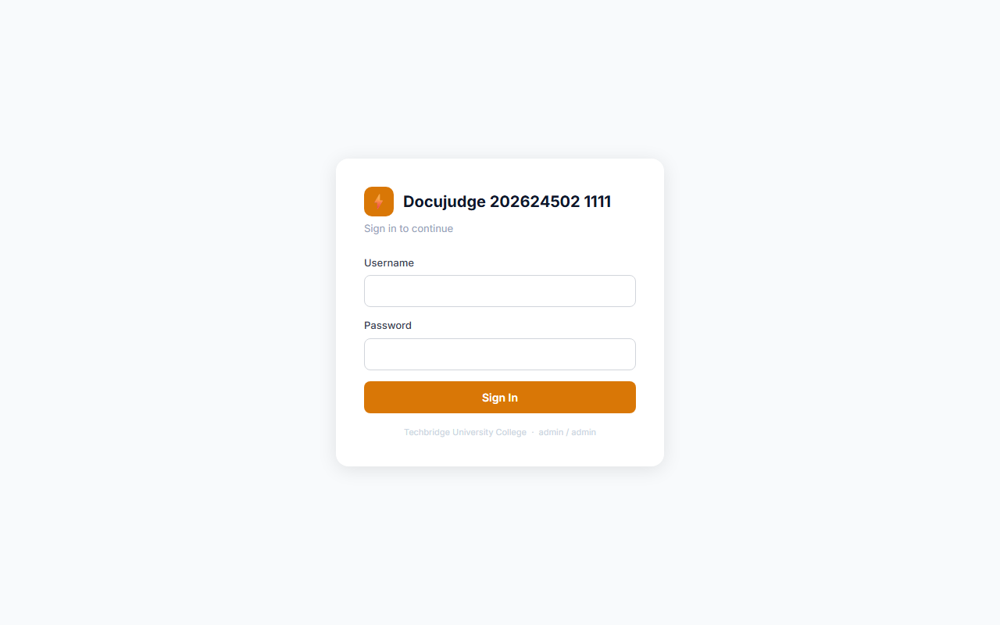

**Directory:** `docujudge_202624502_1111`  
**Stack:** React/Vite  
**Port:** 4173  
**Docker:** Yes  

```bash
cd docujudge_202624502_1111
pnpm install
pnpm run dev
```

### Drone Fleet Intelligence Manager
<a name="drone-fleet-intelligence-manager"></a>


**Directory:** `drone-fleet-intelligence-manager`  
**Stack:** React/Vite  
**Port:** 80  
**Docker:** Yes  
**Description:** Robotics and autonomous systems -  

```bash
cd drone-fleet-intelligence-manager
pnpm install
pnpm run dev
```

### Drone Showcase
<a name="drone-showcase"></a>


**Directory:** `drone-showcase`  
**Stack:** React/Vite  
**Port:** 4173  
**Docker:** Yes  

```bash
cd drone-showcase
pnpm install
pnpm run dev
```

### Dynamic Policy Adjustment Engine
<a name="dynamic-policy-adjustment-engine"></a>

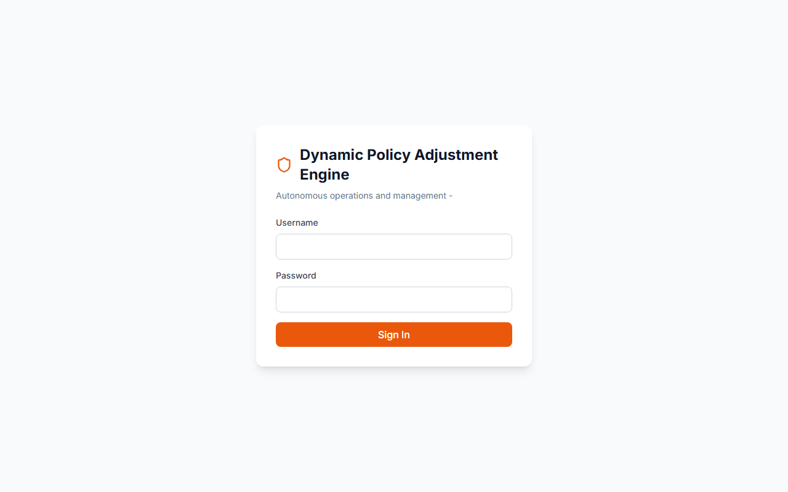

**Directory:** `dynamic-policy-adjustment-engine`  
**Stack:** React/Vite  
**Port:** 80  
**Docker:** Yes  
**Description:** Autonomous operations and management -  

```bash
cd dynamic-policy-adjustment-engine
pnpm install
pnpm run dev
```

### Election Sentiment Analyzer
<a name="election-sentiment-analyzer"></a>

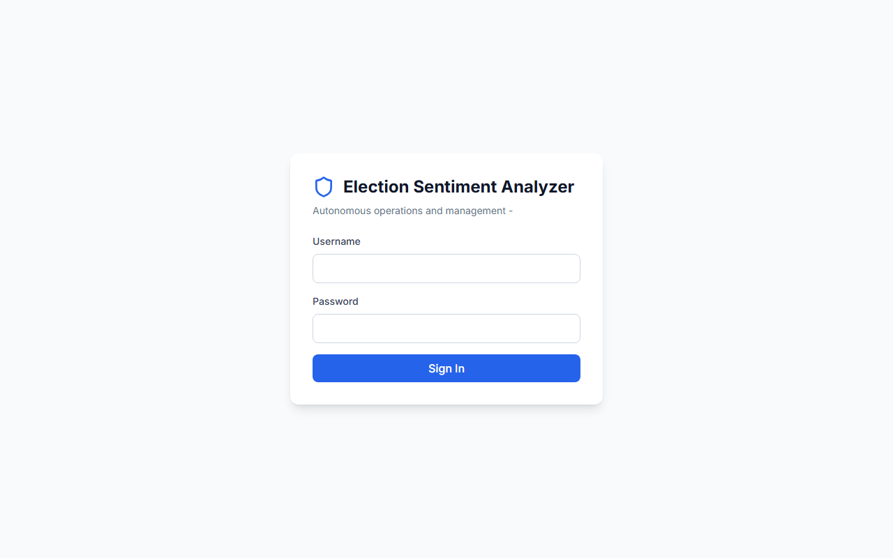

**Directory:** `election-sentiment-analyzer`  
**Stack:** React/Vite  
**Port:** 80  
**Docker:** Yes  
**Description:** Autonomous operations and management -  

```bash
cd election-sentiment-analyzer
pnpm install
pnpm run dev
```

### Enactus Ckt Frontend App Main
<a name="enactus-ckt-frontend-app-main"></a>

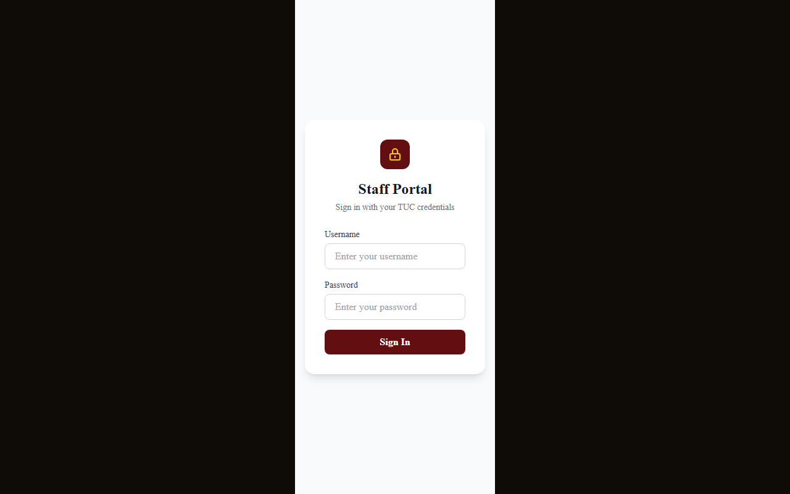

**Directory:** `enactus-ckt-frontend-app-main`  
**Stack:** React/Vite  
**Port:** 4173  
**Docker:** Yes  

```bash
cd enactus-ckt-frontend-app-main
pnpm install
pnpm run dev
```

### English Safari
<a name="english-safari"></a>


**Directory:** `english-safari`  
**Stack:** React/Vite  
**Port:** 4173  
**Docker:** Yes  

```bash
cd english-safari
pnpm install
pnpm run dev
```

### Enhanced Youtube Genie
<a name="enhanced-youtube-genie"></a>

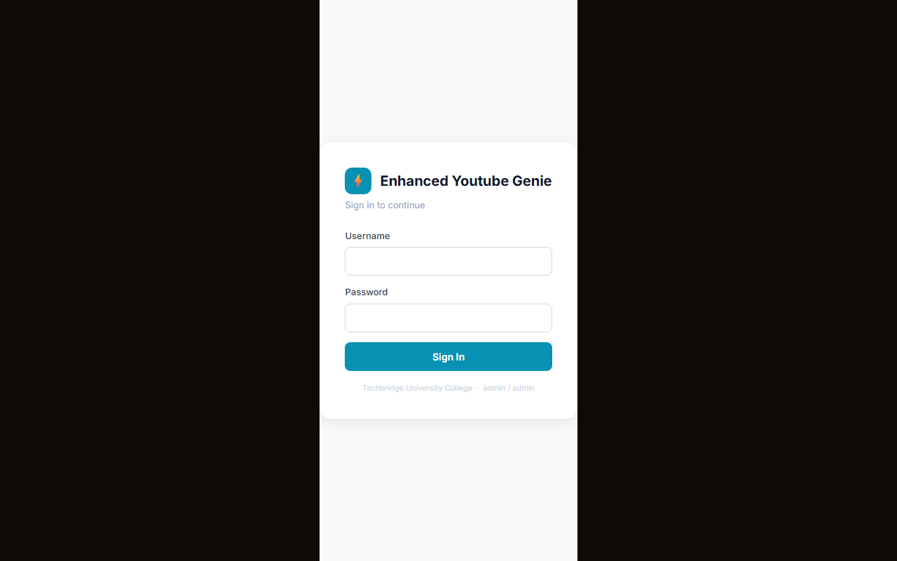

**Directory:** `enhanced-youtube-genie`  
**Stack:** React/Vite  
**Port:** 4173  
**Docker:** Yes  

```bash
cd enhanced-youtube-genie
pnpm install
pnpm run dev
```

### Executive Brief Generator
<a name="executive-brief-generator"></a>

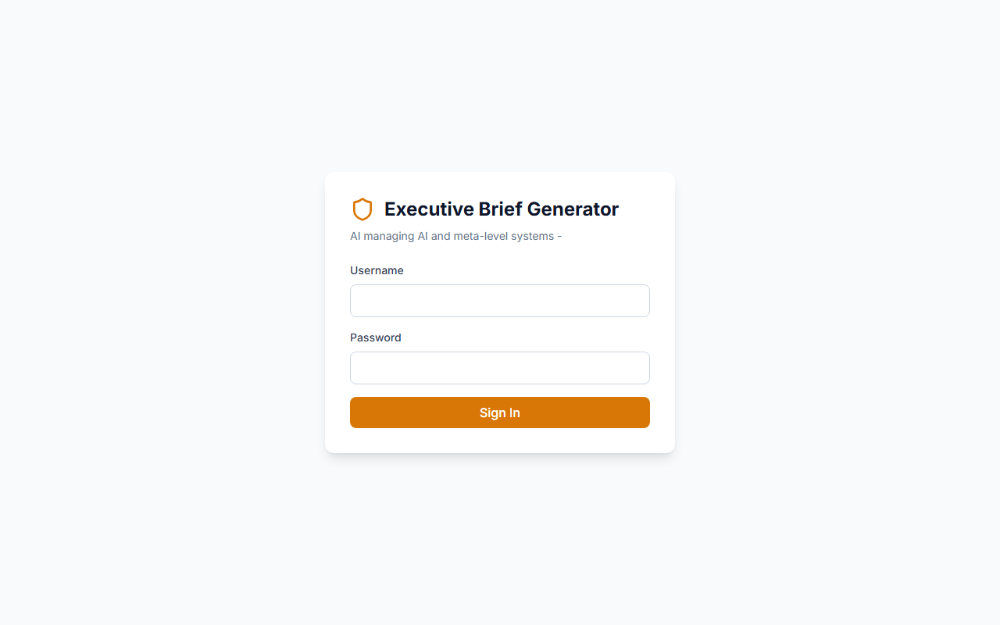

**Directory:** `executive-brief-generator`  
**Stack:** React/Vite  
**Port:** 80  
**Docker:** Yes  
**Description:** AI managing AI and meta-level systems -  

```bash
cd executive-brief-generator
pnpm install
pnpm run dev
```

### Factory Energy Optimizer
<a name="factory-energy-optimizer"></a>


**Directory:** `factory-energy-optimizer`  
**Stack:** React/Vite  
**Port:** 80  
**Docker:** Yes  
**Description:** Industrial automation and manufacturing -  

```bash
cd factory-energy-optimizer
pnpm install
pnpm run dev
```

### Fashionprompt AI
<a name="fashionprompt-ai"></a>


**Directory:** `fashionprompt-ai`  
**Stack:** React/Vite  
**Port:** 4173  
**Docker:** Yes  

```bash
cd fashionprompt-ai
pnpm install
pnpm run dev
```

### Ghana News Aggregator
<a name="ghana-news-aggregator"></a>

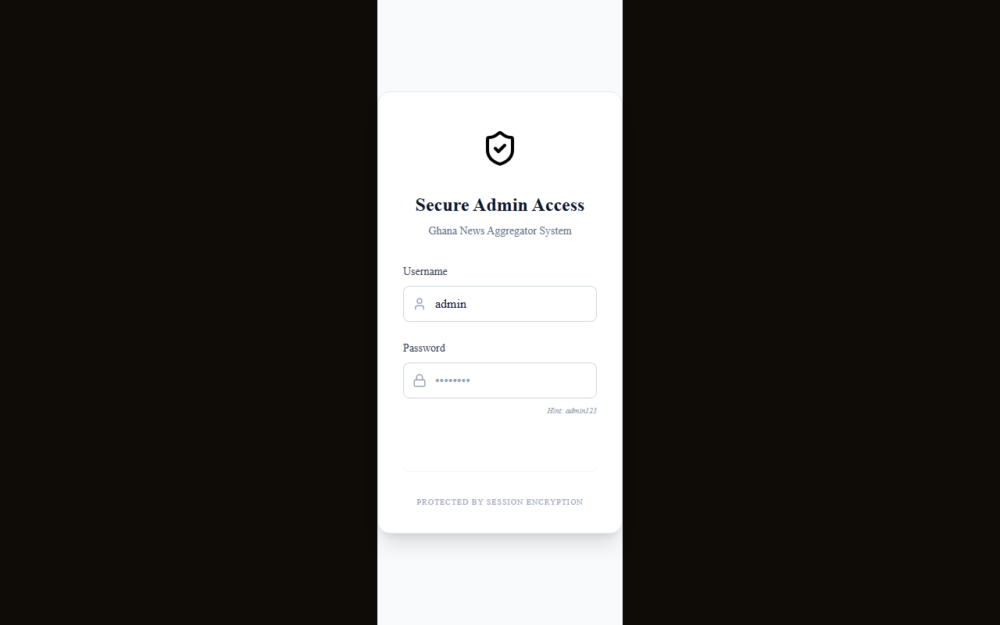

**Directory:** `ghana-news-aggregator`  
**Stack:** React/Vite  
**Port:** 4173  
**Docker:** Yes  

```bash
cd ghana-news-aggregator
pnpm install
pnpm run dev
```

### Ghanare
<a name="ghanare"></a>

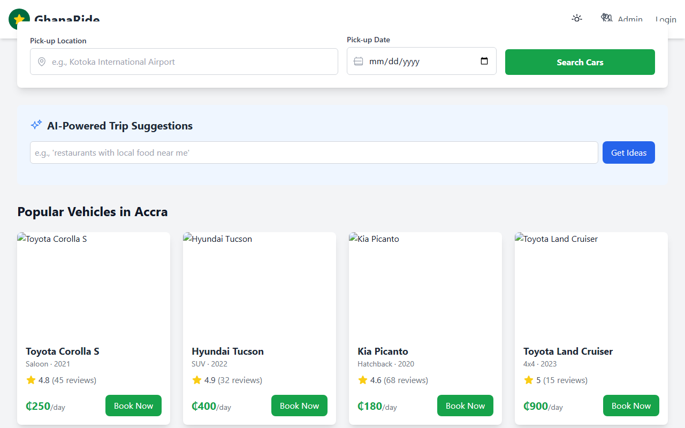

**Directory:** `ghanare`  
**Stack:** React/Vite  
**Port:** 80  
**Docker:** Yes  

```bash
cd ghanare
pnpm install
pnpm run dev
```

### Innovation Opportunity Detector
<a name="innovation-opportunity-detector"></a>

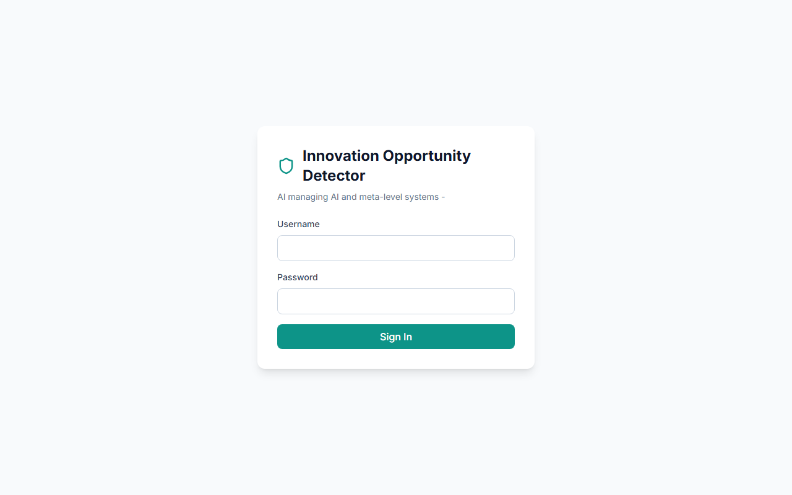

**Directory:** `innovation-opportunity-detector`  
**Stack:** React/Vite  
**Port:** 80  
**Docker:** Yes  
**Description:** AI managing AI and meta-level systems -  

```bash
cd innovation-opportunity-detector
pnpm install
pnpm run dev
```

### Internal Knowledge Embedding Engine
<a name="internal-knowledge-embedding-engine"></a>

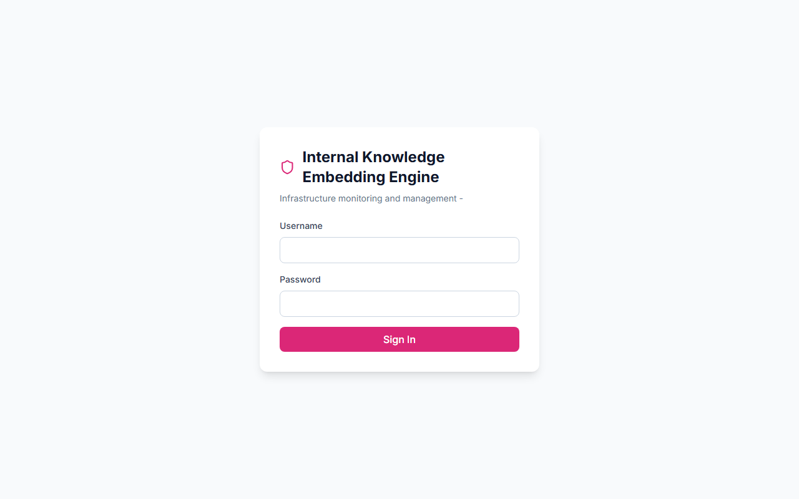

**Directory:** `internal-knowledge-embedding-engine`  
**Stack:** React/Vite  
**Port:** 80  
**Docker:** Yes  
**Description:** Infrastructure monitoring and management -  

```bash
cd internal-knowledge-embedding-engine
pnpm install
pnpm run dev
```

### Internship Program
<a name="internship-program"></a>

**Directory:** `internship-program`  
**Stack:** Node.js/Express  
**Port:** 4173  
**Docker:** Yes  

```bash
cd internship-program
pnpm install
pnpm run dev
```

### Kente Fusion Fashion Workshop
<a name="kente-fusion-fashion-workshop"></a>

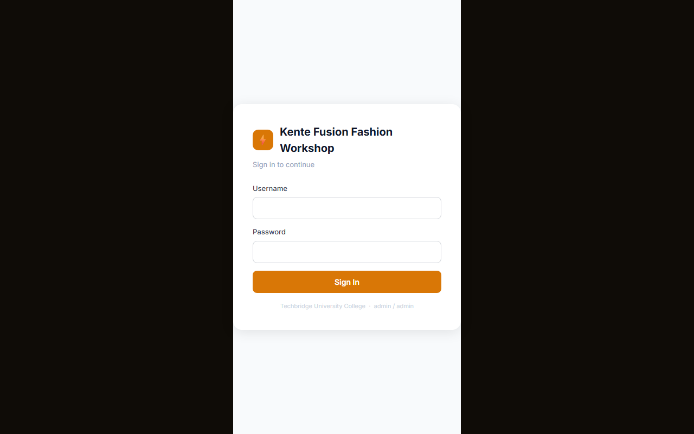

**Directory:** `kente-fusion-fashion-workshop`  
**Stack:** React/Vite  
**Port:** 4173  
**Docker:** Yes  

```bash
cd kente-fusion-fashion-workshop
pnpm install
pnpm run dev
```

### Krpots.Com
<a name="krpots.com"></a>

**Directory:** `krpots.com`  
**Stack:** React/Vite  
**Port:** 4049  
**Docker:** Yes  

```bash
cd krpots.com
pnpm install
pnpm run dev
```

### Lems
<a name="lems"></a>

**Directory:** `lems`  
**Stack:** React/Vite  
**Docker:** No  
**Description:** Lecturer Assessment & Evaluation Portal - React Frontend  

```bash
cd lems
pnpm install
pnpm run dev
```

### Library Management
<a name="library-management"></a>

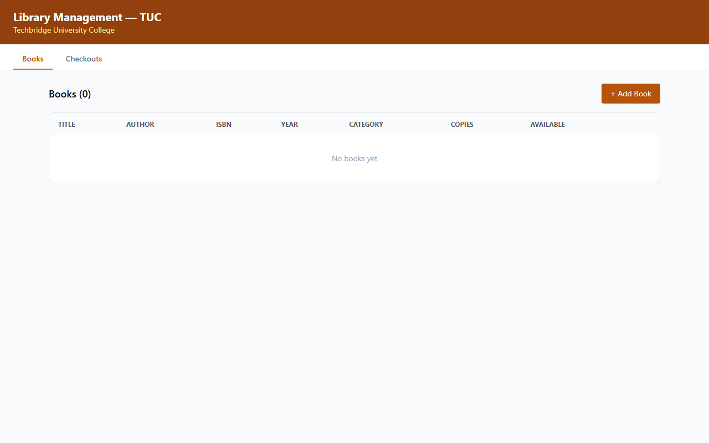

**Directory:** `library-management`  
**Stack:** Node.js/Express  
**Port:** 4173  
**Docker:** Yes  

```bash
cd library-management
pnpm install
pnpm run dev
```

### Lumina Concert Video Wall
<a name="lumina-concert-video-wall"></a>


**Directory:** `lumina-concert-video-wall`  
**Stack:** React/Vite  
**Port:** 4173  
**Docker:** Yes  

```bash
cd lumina-concert-video-wall
pnpm install
pnpm run dev
```

### Lumina Triptych Studio
<a name="lumina-triptych-studio"></a>


**Directory:** `lumina-triptych-studio`  
**Stack:** React/Vite  
**Port:** 4173  
**Docker:** Yes  

```bash
cd lumina-triptych-studio
pnpm install
pnpm run dev
```

### Mannequin AI
<a name="mannequin-ai"></a>


**Directory:** `mannequin-ai`  
**Stack:** React/Vite  
**Port:** 4173  
**Docker:** Yes  

```bash
cd mannequin-ai
pnpm install
pnpm run dev
```

### Master Thumbnail Catalog
<a name="master-thumbnail-catalog"></a>

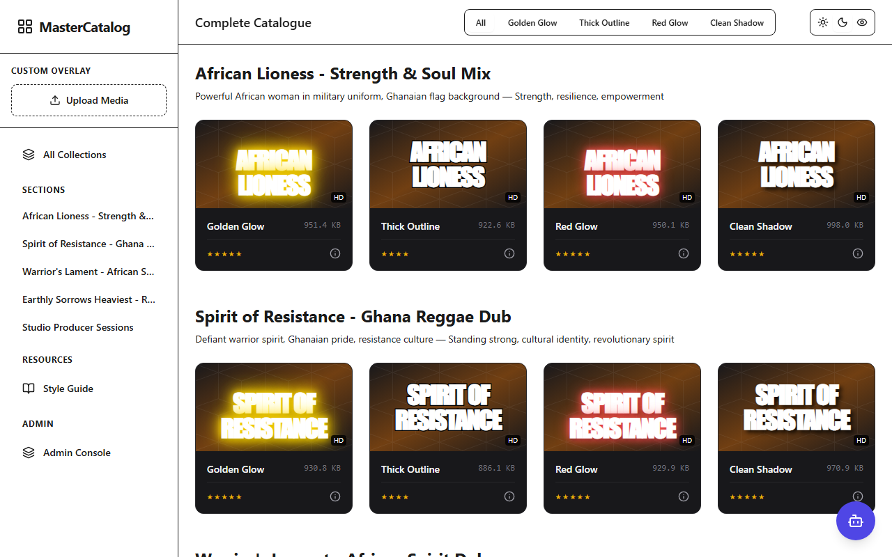

**Directory:** `master-thumbnail-catalog`  
**Stack:** React/Vite  
**Port:** 4173  
**Docker:** Yes  

```bash
cd master-thumbnail-catalog
pnpm install
pnpm run dev
```

### Mentorship Program
<a name="mentorship-program"></a>

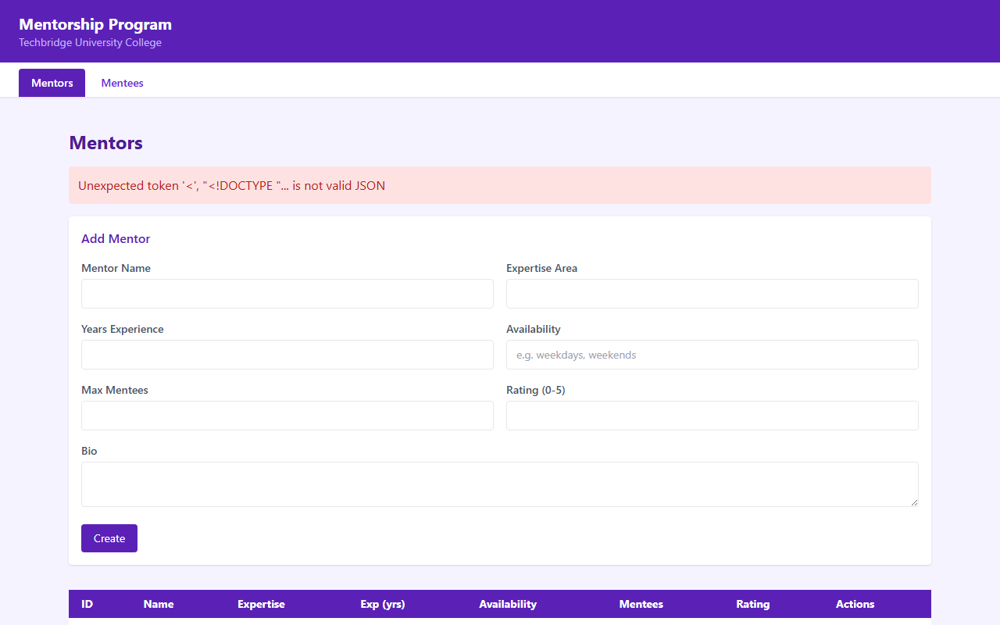

**Directory:** `mentorship-program`  
**Stack:** Node.js/Express  
**Port:** 4173  
**Docker:** Yes  

```bash
cd mentorship-program
pnpm install
pnpm run dev
```

### Midjourney Prompt Helper
<a name="midjourney-prompt-helper"></a>


**Directory:** `midjourney-prompt-helper`  
**Stack:** React/Vite  
**Port:** 4173  
**Docker:** Yes  

```bash
cd midjourney-prompt-helper
pnpm install
pnpm run dev
```

### Mirror Truth   Thumbnail Designer
<a name="mirror-truth---thumbnail-designer"></a>

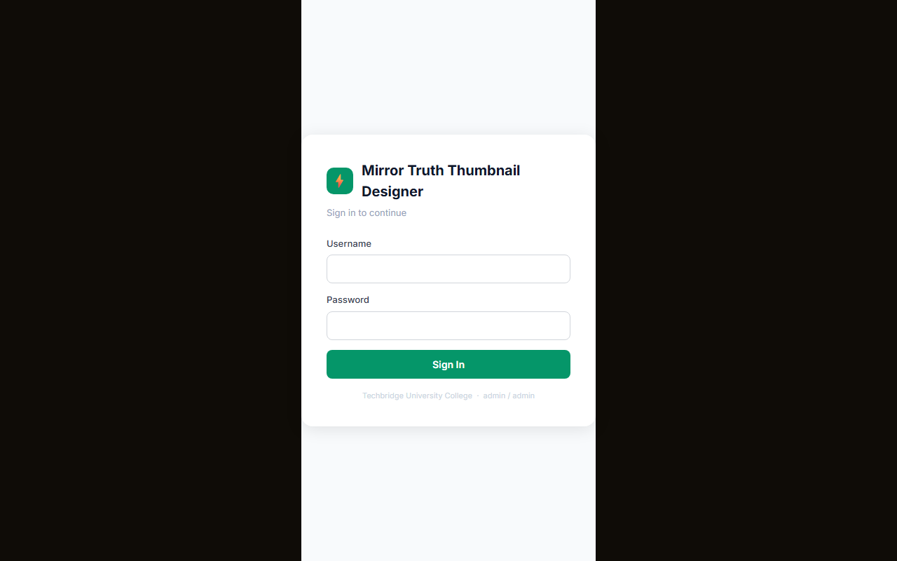

**Directory:** `mirror-truth---thumbnail-designer`  
**Stack:** React/Vite  
**Port:** 4173  
**Docker:** Yes  

```bash
cd mirror-truth---thumbnail-designer
pnpm install
pnpm run dev
```

### Misinformation Detector
<a name="misinformation-detector"></a>

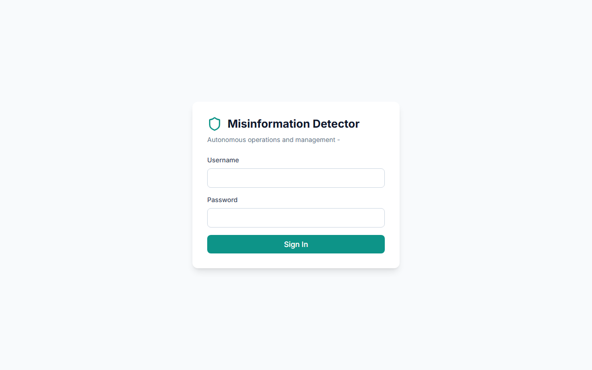

**Directory:** `misinformation-detector`  
**Stack:** React/Vite  
**Port:** 80  
**Docker:** Yes  
**Description:** Autonomous operations and management -  

```bash
cd misinformation-detector
pnpm install
pnpm run dev
```

### Model Version Registry
<a name="model-version-registry"></a>

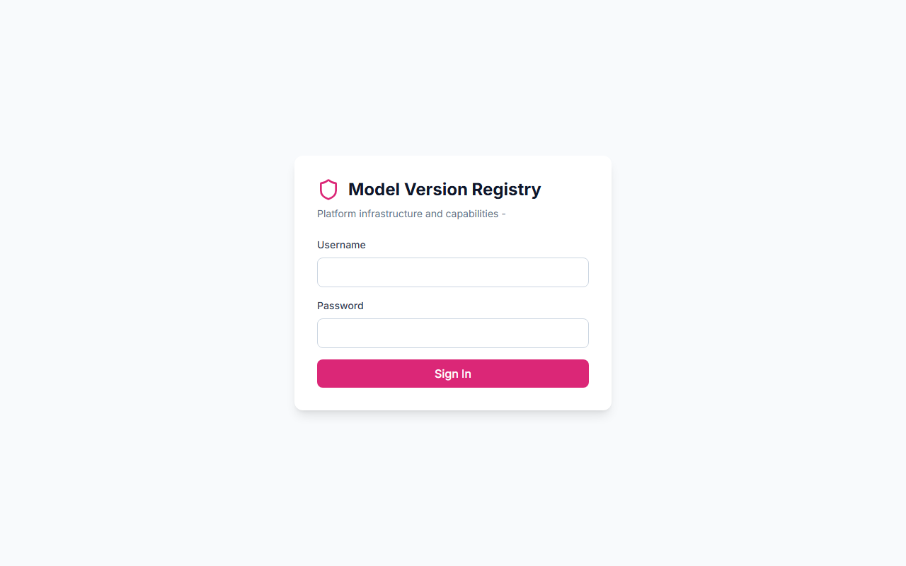

**Directory:** `model-version-registry`  
**Stack:** React/Vite  
**Port:** 80  
**Docker:** Yes  
**Description:** Platform infrastructure and capabilities -  

```bash
cd model-version-registry
pnpm install
pnpm run dev
```

### Modern Product Development Lifecycle
<a name="modern-product-development-lifecycle"></a>

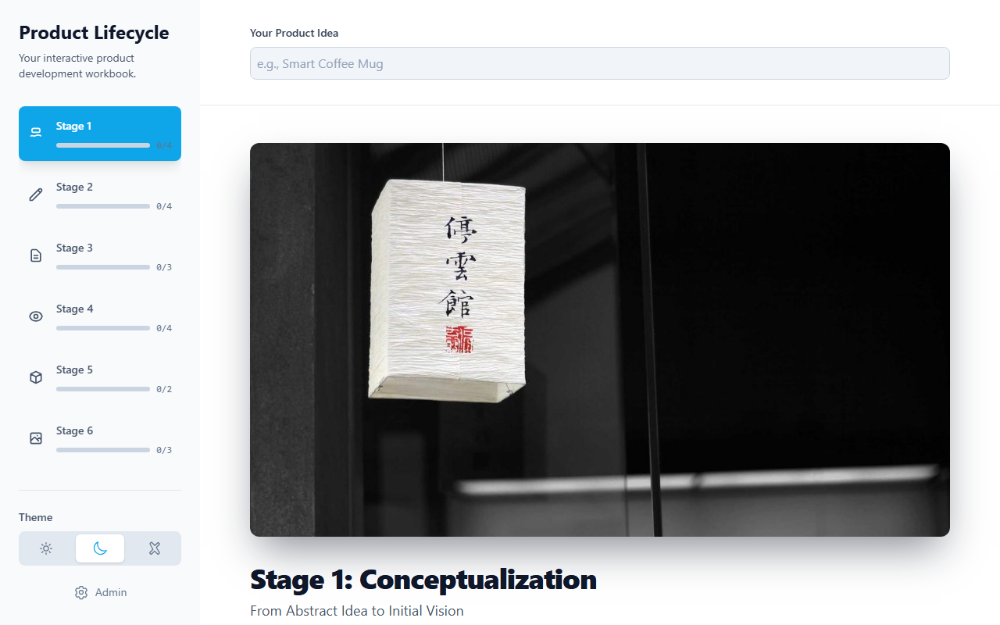

**Directory:** `modern-product-development-lifecycle`  
**Stack:** React/Vite  
**Port:** 80  
**Docker:** Yes  

```bash
cd modern-product-development-lifecycle
pnpm install
pnpm run dev
```

### Multi Agent Negotiation Engine
<a name="multi-agent-negotiation-engine"></a>

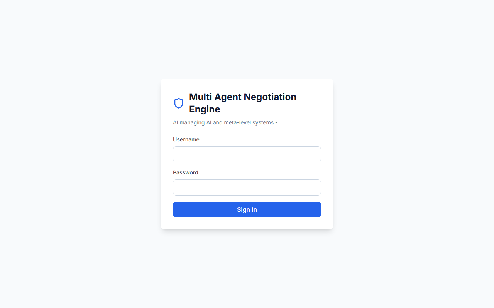

**Directory:** `multi-agent-negotiation-engine`  
**Stack:** React/Vite  
**Port:** 80  
**Docker:** Yes  
**Description:** AI managing AI and meta-level systems -  

```bash
cd multi-agent-negotiation-engine
pnpm install
pnpm run dev
```

### Multi Tenant Role Engine
<a name="multi-tenant-role-engine"></a>


**Directory:** `multi-tenant-role-engine`  
**Stack:** React/Vite  
**Port:** 80  
**Docker:** Yes  
**Description:** Infrastructure monitoring and management -  

```bash
cd multi-tenant-role-engine
pnpm install
pnpm run dev
```

### Myvbci Camper App
<a name="myvbci-camper-app"></a>


**Directory:** `myvbci-camper-app`  
**Stack:** React/Vite  
**Port:** 80  
**Docker:** Yes  

```bash
cd myvbci-camper-app
pnpm install
pnpm run dev
```

### Narrative Intelligence Engine
<a name="narrative-intelligence-engine"></a>

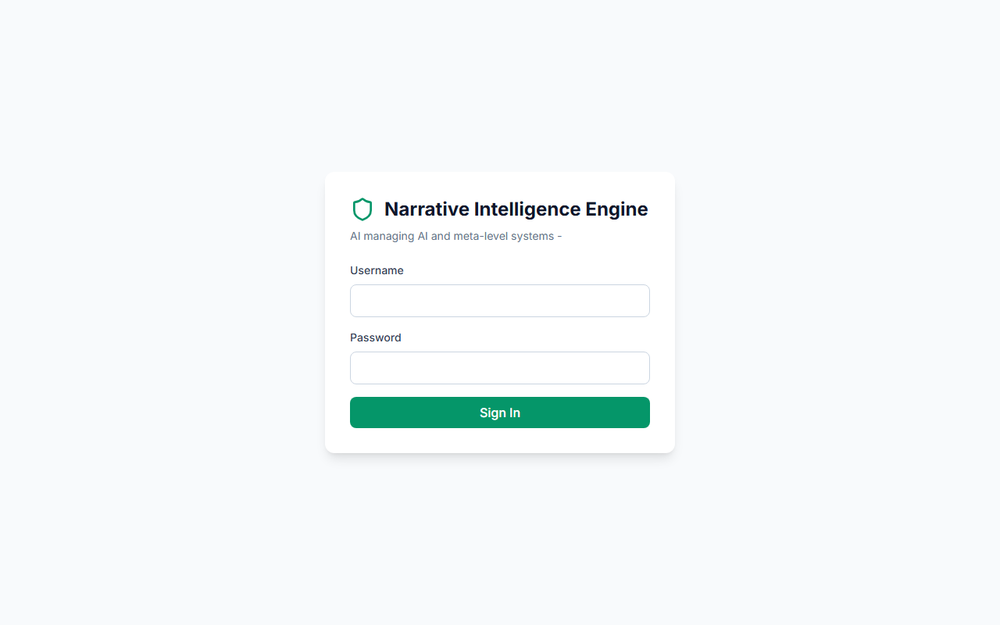

**Directory:** `narrative-intelligence-engine`  
**Stack:** React/Vite  
**Port:** 80  
**Docker:** Yes  
**Description:** AI managing AI and meta-level systems -  

```bash
cd narrative-intelligence-engine
pnpm install
pnpm run dev
```

### Newsfeed
<a name="newsfeed"></a>


**Directory:** `newsfeed`  
**Stack:** Node.js/Express  
**Port:** 4173  
**Docker:** Yes  

```bash
cd newsfeed
pnpm install
pnpm run dev
```

### Omniextract
<a name="omniextract"></a>


**Directory:** `omniextract`  
**Stack:** React/Vite  
**Port:** 4173  
**Docker:** Yes  

```bash
cd omniextract
pnpm install
pnpm run dev
```

### Organizational Design Recommender
<a name="organizational-design-recommender"></a>

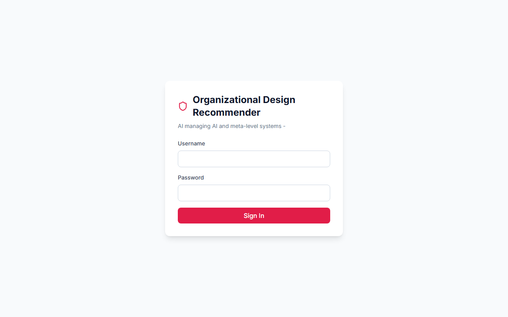

**Directory:** `organizational-design-recommender`  
**Stack:** React/Vite  
**Port:** 80  
**Docker:** Yes  
**Description:** AI managing AI and meta-level systems -  

```bash
cd organizational-design-recommender
pnpm install
pnpm run dev
```

### Pama Realtor
<a name="pama-realtor"></a>

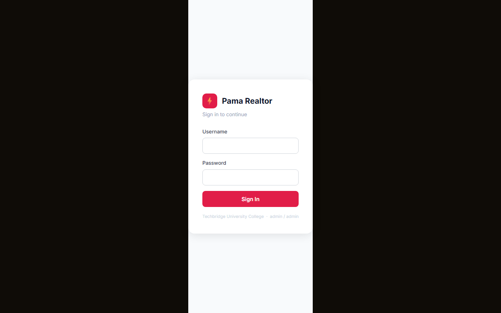

**Directory:** `pama-realtor`  
**Stack:** React/Vite  
**Port:** 4173  
**Docker:** Yes  

```bash
cd pama-realtor
pnpm install
pnpm run dev
```

### Patois Old
<a name="patois-old"></a>

**Directory:** `patois-old`  
**Stack:** React/Vite  
**Port:** 80  
**Docker:** Yes  

```bash
cd patois-old
pnpm install
pnpm run dev
```

### Pdf Extractor App
<a name="pdf-extractor-app"></a>

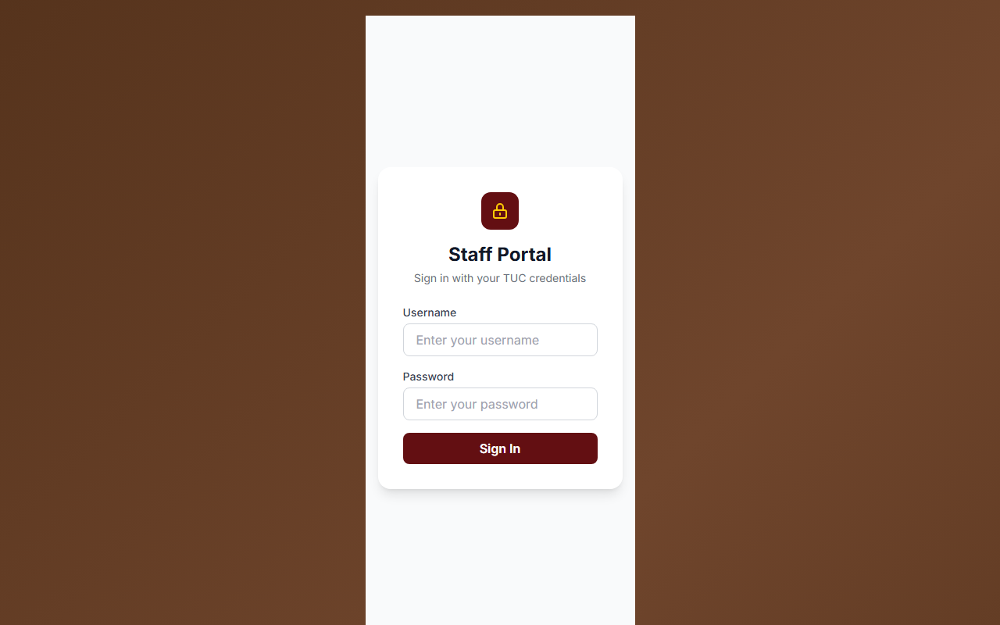

**Directory:** `pdf-extractor-app`  
**Stack:** React/Vite  
**Port:** 4173  
**Docker:** Yes  

```bash
cd pdf-extractor-app
pnpm install
pnpm run dev
```

### Predictive Maintenance AI
<a name="predictive-maintenance-ai"></a>

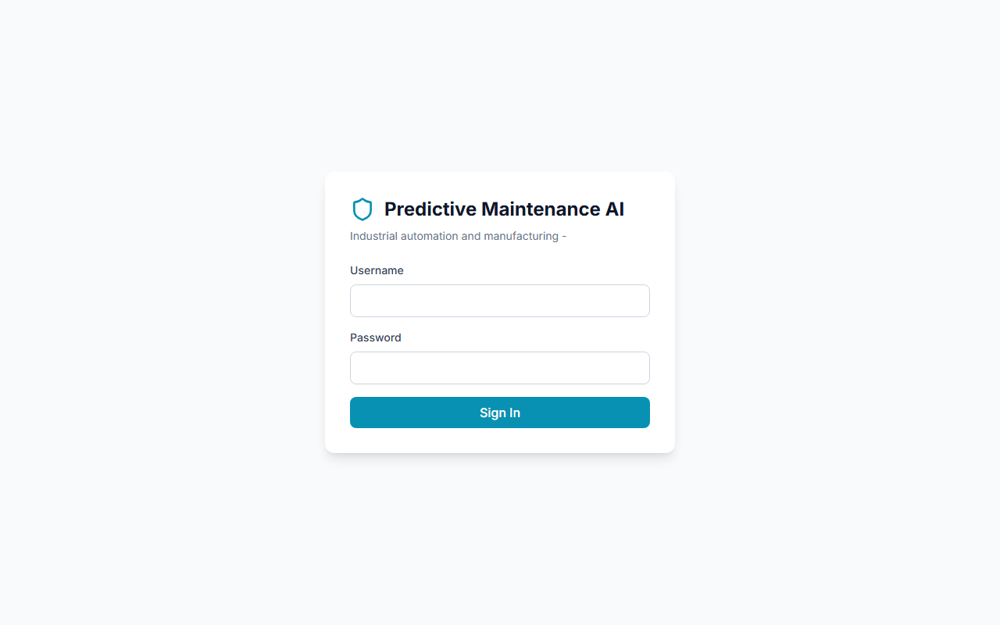

**Directory:** `predictive-maintenance-ai`  
**Stack:** React/Vite  
**Port:** 80  
**Docker:** Yes  
**Description:** Industrial automation and manufacturing -  

```bash
cd predictive-maintenance-ai
pnpm install
pnpm run dev
```

### Predictive Policy Engine
<a name="predictive-policy-engine"></a>

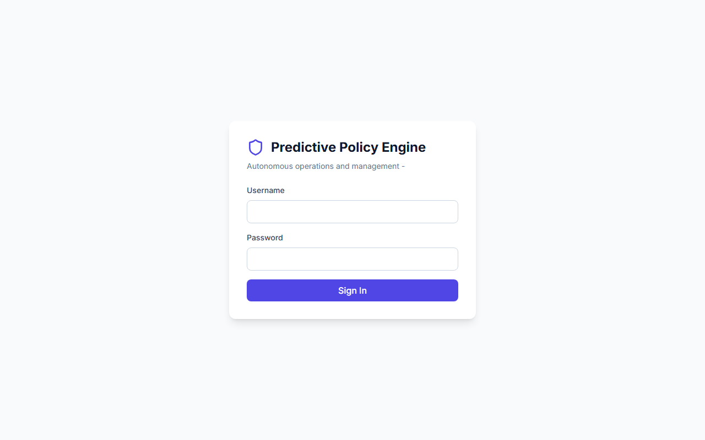

**Directory:** `predictive-policy-engine`  
**Stack:** React/Vite  
**Port:** 80  
**Docker:** Yes  
**Description:** Autonomous operations and management -  

```bash
cd predictive-policy-engine
pnpm install
pnpm run dev
```

### Presentation App
<a name="presentation-app"></a>


**Directory:** `presentation-app`  
**Stack:** React/Vite  
**Port:** 4173  
**Docker:** Yes  

```bash
cd presentation-app
pnpm install
pnpm run dev
```

### Primevaluer Pro
<a name="primevaluer-pro"></a>

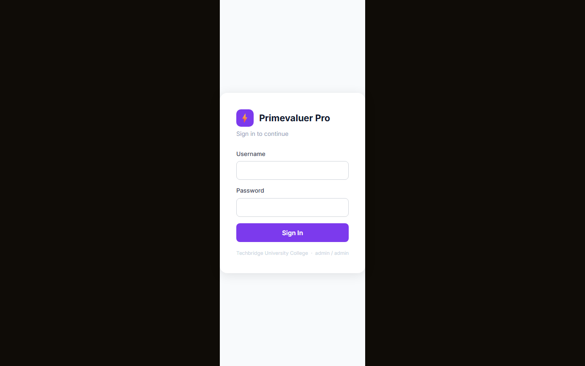

**Directory:** `primevaluer-pro`  
**Stack:** React/Vite  
**Port:** 4173  
**Docker:** Yes  

```bash
cd primevaluer-pro
pnpm install
pnpm run dev
```

### Prompt Optimization Engine
<a name="prompt-optimization-engine"></a>

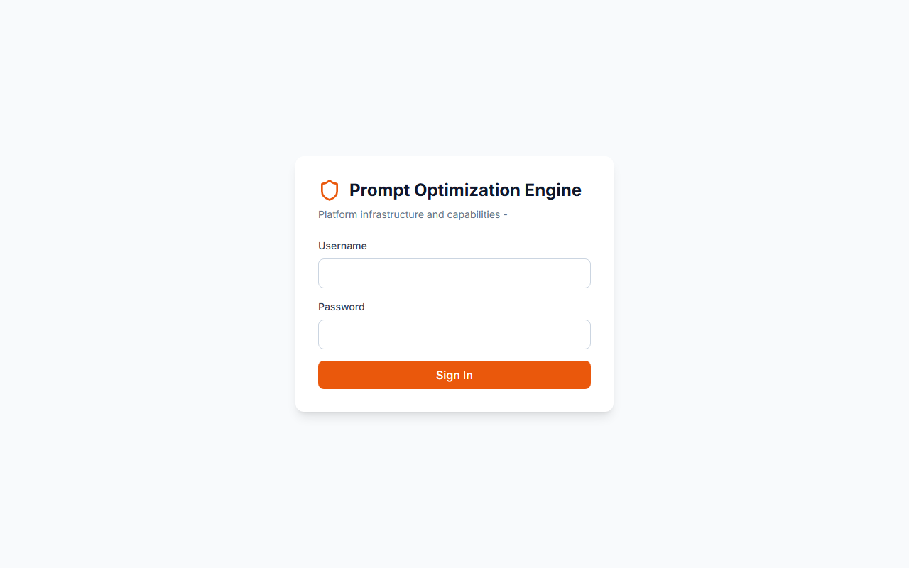

**Directory:** `prompt-optimization-engine`  
**Stack:** React/Vite  
**Port:** 80  
**Docker:** Yes  
**Description:** Platform infrastructure and capabilities -  

```bash
cd prompt-optimization-engine
pnpm install
pnpm run dev
```

### Playwright
<a name="playwright"></a>

**Directory:** `playwright`  
**Stack:** React/Vite  
**Port:** 80  
**Docker:** Yes  

```bash
cd playwright
pnpm install
pnpm run dev
```

### Qmd To Google Slides Converter
<a name="qmd-to-google-slides-converter"></a>

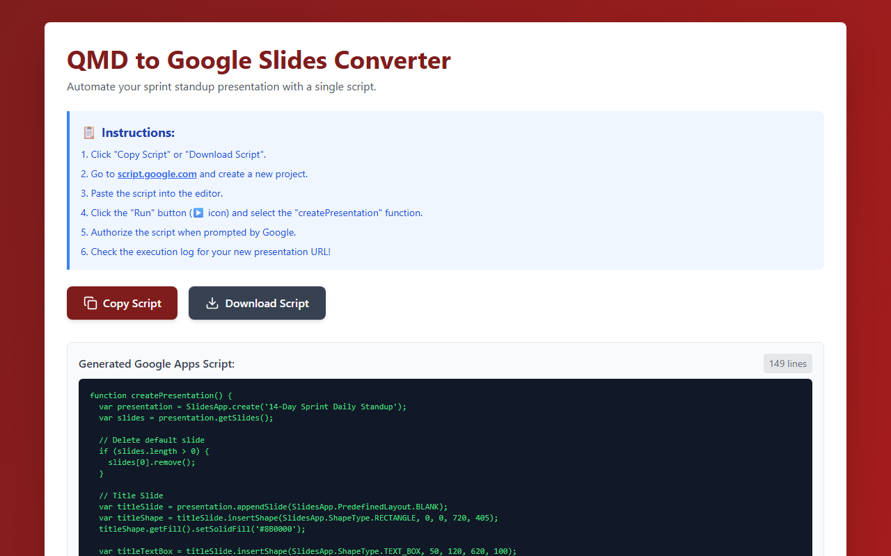

**Directory:** `qmd-to-google-slides-converter`  
**Stack:** React/Vite  
**Port:** 80  
**Docker:** Yes  

```bash
cd qmd-to-google-slides-converter
pnpm install
pnpm run dev
```

### Quality Defect Vision System
<a name="quality-defect-vision-system"></a>


**Directory:** `quality-defect-vision-system`  
**Stack:** React/Vite  
**Port:** 80  
**Docker:** Yes  
**Description:** Industrial automation and manufacturing -  

```bash
cd quality-defect-vision-system
pnpm install
pnpm run dev
```

### Real Time Economic Signal Analyzer
<a name="real-time-economic-signal-analyzer"></a>

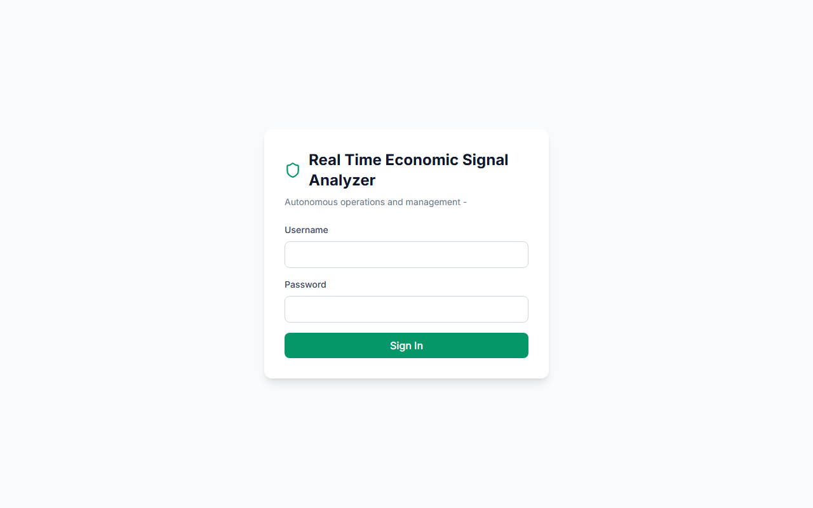

**Directory:** `real-time-economic-signal-analyzer`  
**Stack:** React/Vite  
**Port:** 80  
**Docker:** Yes  
**Description:** Autonomous operations and management -  

```bash
cd real-time-economic-signal-analyzer
pnpm install
pnpm run dev
```

### Real Time Error Classifier
<a name="real-time-error-classifier"></a>

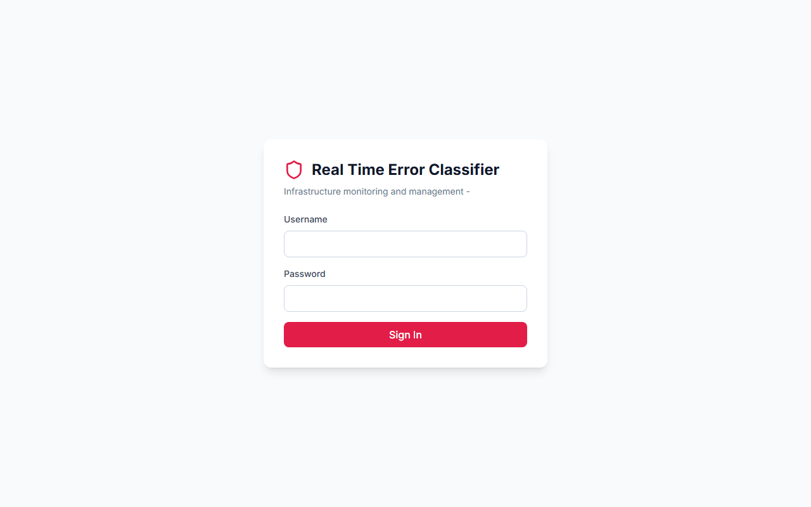

**Directory:** `real-time-error-classifier`  
**Stack:** React/Vite  
**Port:** 80  
**Docker:** Yes  
**Description:** Infrastructure monitoring and management -  

```bash
cd real-time-error-classifier
pnpm install
pnpm run dev
```

### Real Time Persona Engine
<a name="real-time-persona-engine"></a>

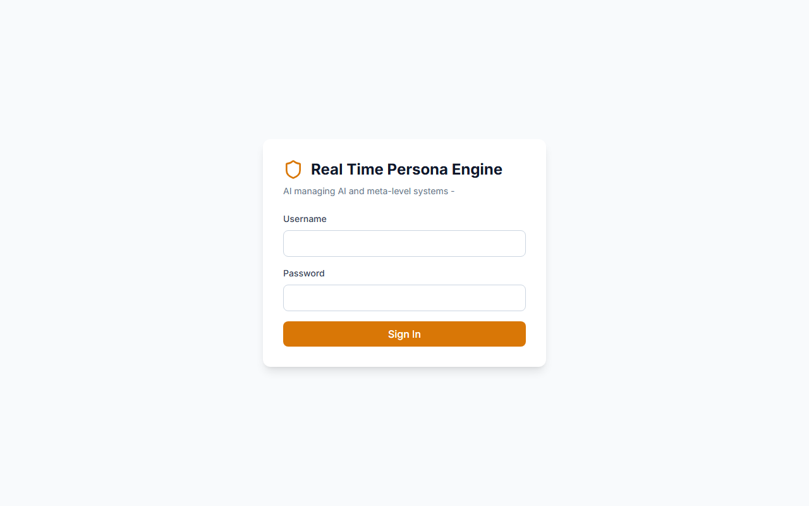

**Directory:** `real-time-persona-engine`  
**Stack:** React/Vite  
**Port:** 80  
**Docker:** Yes  
**Description:** AI managing AI and meta-level systems -  

```bash
cd real-time-persona-engine
pnpm install
pnpm run dev
```

### Regulatory Update Scanner
<a name="regulatory-update-scanner"></a>

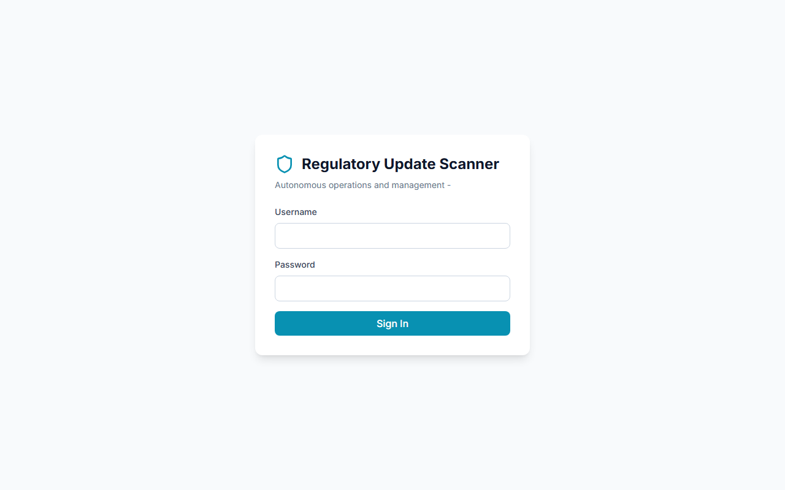

**Directory:** `regulatory-update-scanner`  
**Stack:** React/Vite  
**Port:** 80  
**Docker:** Yes  
**Description:** Autonomous operations and management -  

```bash
cd regulatory-update-scanner
pnpm install
pnpm run dev
```

### Remix Muniratu Portfolio
<a name="remix-muniratu-portfolio"></a>

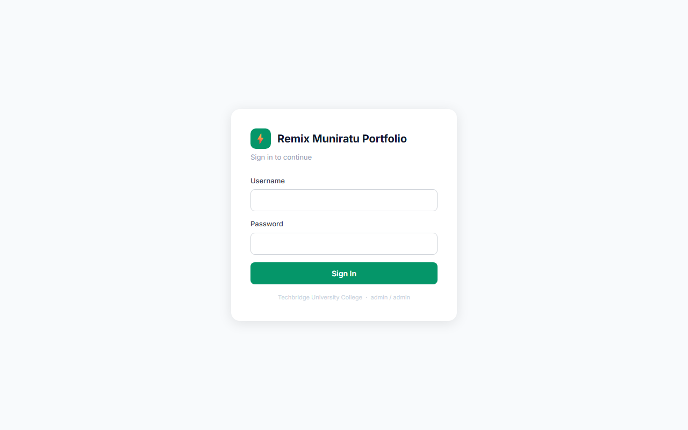

**Directory:** `remix-muniratu-portfolio`  
**Stack:** React/Vite  
**Port:** 4173  
**Docker:** Yes  

```bash
cd remix-muniratu-portfolio
pnpm install
pnpm run dev
```

### Renewable Grid Balancer
<a name="renewable-grid-balancer"></a>

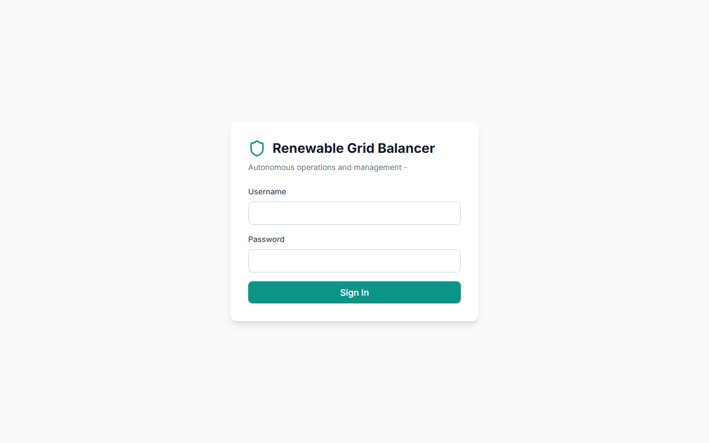

**Directory:** `renewable-grid-balancer`  
**Stack:** React/Vite  
**Port:** 80  
**Docker:** Yes  
**Description:** Autonomous operations and management -  

```bash
cd renewable-grid-balancer
pnpm install
pnpm run dev
```

### Research Portal
<a name="research-portal"></a>

**Directory:** `research-portal`  
**Stack:** Node.js/Express  
**Port:** 4173  
**Docker:** Yes  

```bash
cd research-portal
pnpm install
pnpm run dev
```

### Retail Demand Intelligence
<a name="retail-demand-intelligence"></a>

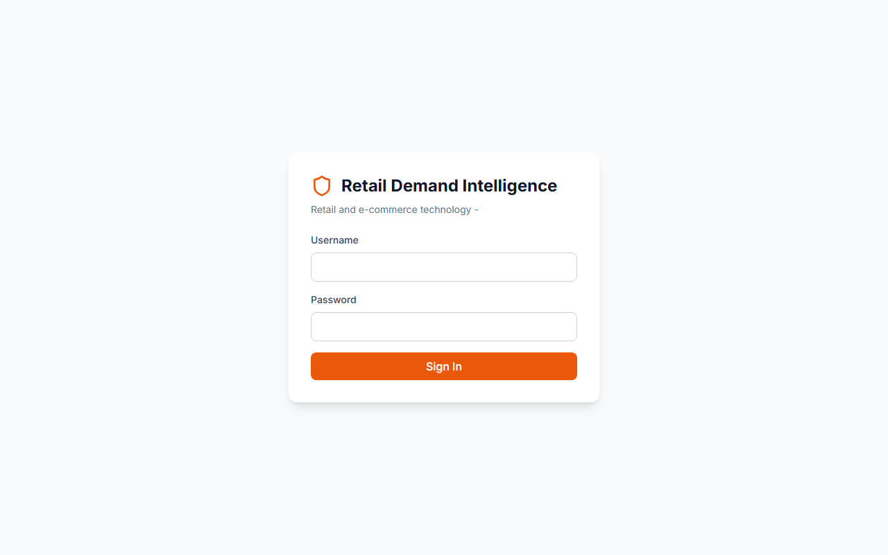

**Directory:** `retail-demand-intelligence`  
**Stack:** React/Vite  
**Port:** 80  
**Docker:** Yes  
**Description:** Retail and e-commerce technology -  

```bash
cd retail-demand-intelligence
pnpm install
pnpm run dev
```

### Rophe Specialist Care Rpms
<a name="rophe-specialist-care-rpms"></a>

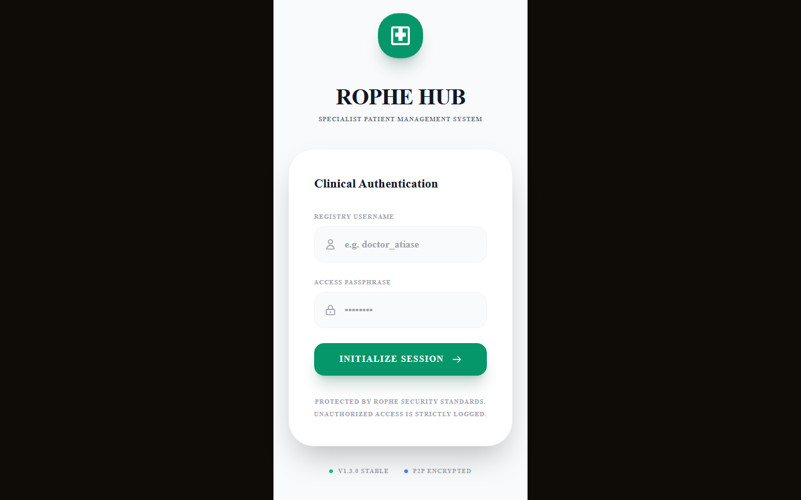

**Directory:** `rophe-specialist-care-rpms`  
**Stack:** React/Vite  
**Port:** 4173  
**Docker:** Yes  

```bash
cd rophe-specialist-care-rpms
pnpm install
pnpm run dev
```

### Salary Calculator Automation System
<a name="salary-calculator-automation-system"></a>

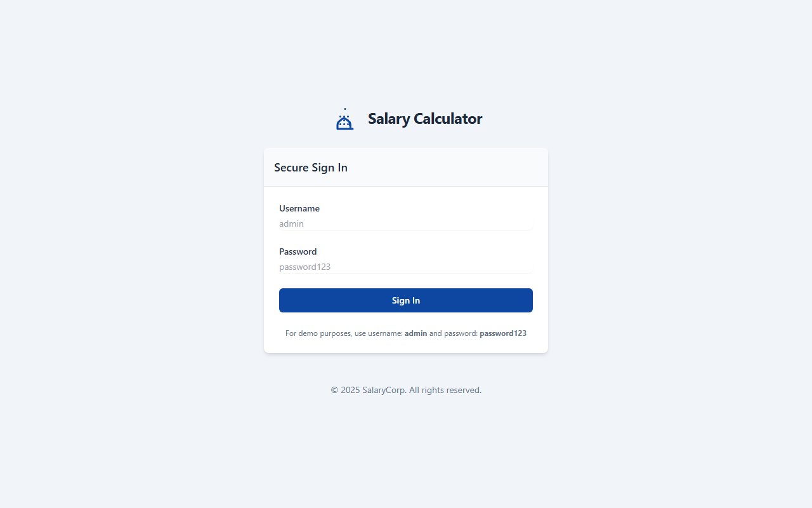

**Directory:** `salary-calculator-automation-system`  
**Stack:** React/Vite  
**Port:** 80  
**Docker:** Yes  

```bash
cd salary-calculator-automation-system
pnpm install
pnpm run dev
```

### Sashmade Kente Academy Proposal
<a name="sashmade-kente-academy-proposal"></a>

**Directory:** `sashmade-kente-academy-proposal`  
**Stack:** React/Vite  
**Port:** 80  
**Docker:** Yes  

```bash
cd sashmade-kente-academy-proposal
pnpm install
pnpm run dev
```

### Scholarship Bond Portal v3
<a name="scholarship-bond-portal-v3"></a>


**Directory:** `scholarship-bond-portal-v3`  
**Stack:** React/Vite  
**Port:** 4173  
**Docker:** Yes  

```bash
cd scholarship-bond-portal-v3
pnpm install
pnpm run dev
```

### Scholarship Tracker
<a name="scholarship-tracker"></a>


**Directory:** `scholarship-tracker`  
**Stack:** Node.js/Express  
**Port:** 4173  
**Docker:** Yes  

```bash
cd scholarship-tracker
pnpm install
pnpm run dev
```

### Script Co Writer
<a name="script-co-writer"></a>

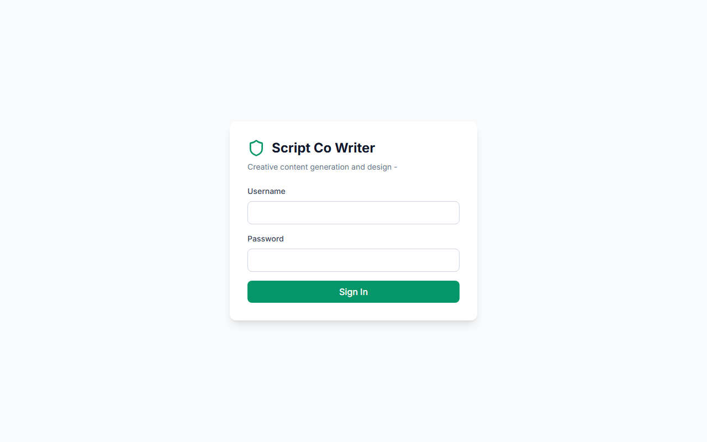

**Directory:** `script-co-writer`  
**Stack:** React/Vite  
**Port:** 80  
**Docker:** Yes  
**Description:** Creative content generation and design -  

```bash
cd script-co-writer
pnpm install
pnpm run dev
```

### Secret Vault Manager
<a name="secret-vault-manager"></a>

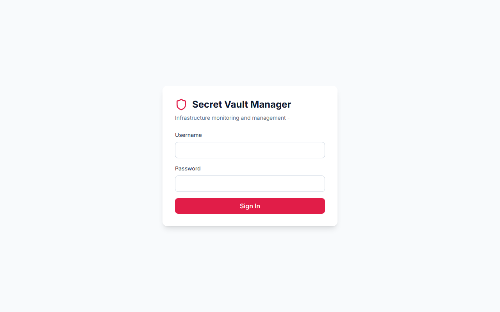

**Directory:** `secret-vault-manager`  
**Stack:** React/Vite  
**Port:** 80  
**Docker:** Yes  
**Description:** Infrastructure monitoring and management -  

```bash
cd secret-vault-manager
pnpm install
pnpm run dev
```

### Self Improving Model Trainer
<a name="self-improving-model-trainer"></a>

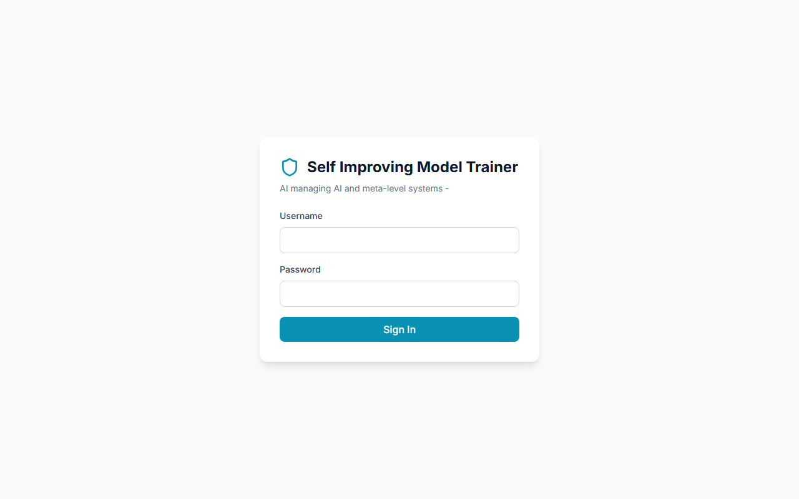

**Directory:** `self-improving-model-trainer`  
**Stack:** React/Vite  
**Port:** 80  
**Docker:** Yes  
**Description:** AI managing AI and meta-level systems -  

```bash
cd self-improving-model-trainer
pnpm install
pnpm run dev
```

### Send Platform API
<a name="send-platform-api"></a>

**Directory:** `send-platform-api`  
**Stack:** Java/Spring Boot  
**Port:** 8090  
**Docker:** Yes  

```bash
cd send-platform-api
pnpm install
pnpm run dev
```

### Sentiment Aware Ux Adapter
<a name="sentiment-aware-ux-adapter"></a>

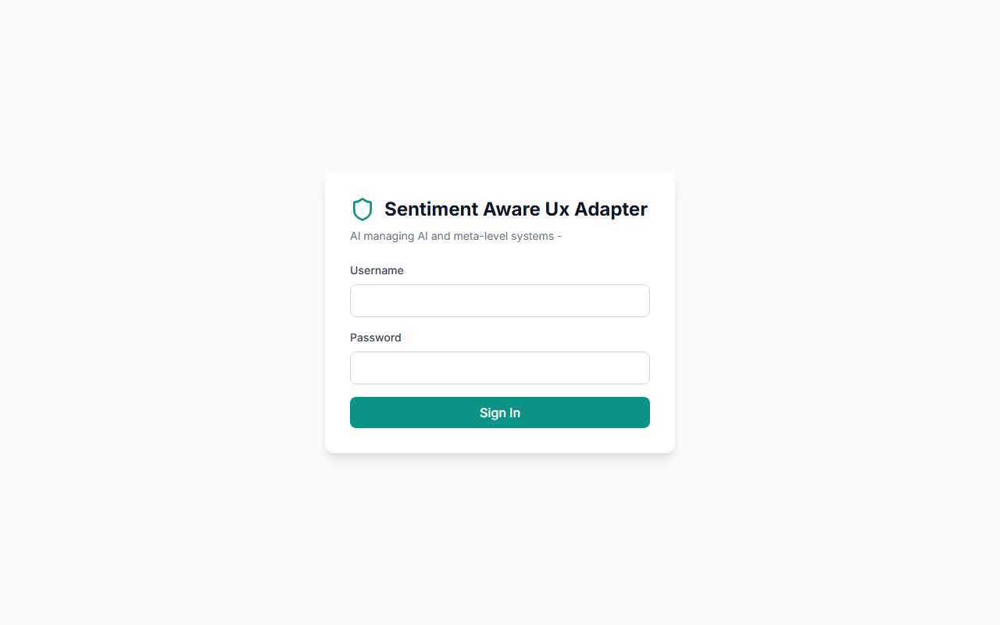

**Directory:** `sentiment-aware-ux-adapter`  
**Stack:** React/Vite  
**Port:** 80  
**Docker:** Yes  
**Description:** AI managing AI and meta-level systems -  

```bash
cd sentiment-aware-ux-adapter
pnpm install
pnpm run dev
```

### Shortcut Master
<a name="shortcut-master"></a>


**Directory:** `shortcut-master`  
**Stack:** React/Vite  
**Port:** 4173  
**Docker:** Yes  

```bash
cd shortcut-master
pnpm install
pnpm run dev
```

### Still Her Baby
<a name="still_her_baby"></a>


**Directory:** `still_her_baby`  
**Stack:** React/Vite  
**Port:** 4173  
**Docker:** Yes  
**Description:** AI Video Generation Prompt Management Dashboard for 'Still Her Baby' music video  

```bash
cd still_her_baby
pnpm install
pnpm run dev
```

### Strategic Scenario Forecast Engine
<a name="strategic-scenario-forecast-engine"></a>

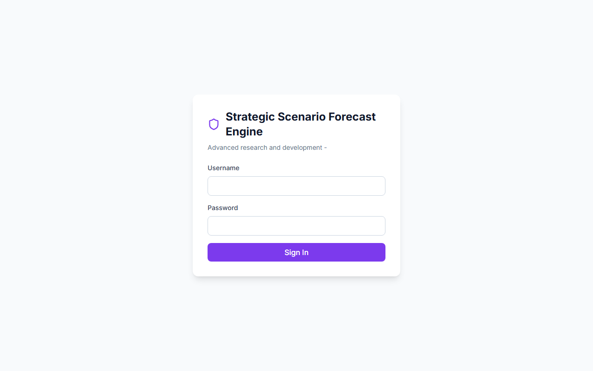

**Directory:** `strategic-scenario-forecast-engine`  
**Stack:** React/Vite  
**Port:** 80  
**Docker:** Yes  
**Description:** Advanced research and development -  

```bash
cd strategic-scenario-forecast-engine
pnpm install
pnpm run dev
```

### Synthetic Data Generator
<a name="synthetic-data-generator"></a>


**Directory:** `synthetic-data-generator`  
**Stack:** React/Vite  
**Port:** 80  
**Docker:** Yes  
**Description:** Platform infrastructure and capabilities -  

```bash
cd synthetic-data-generator
pnpm install
pnpm run dev
```

### Talentverify
<a name="talentverify"></a>

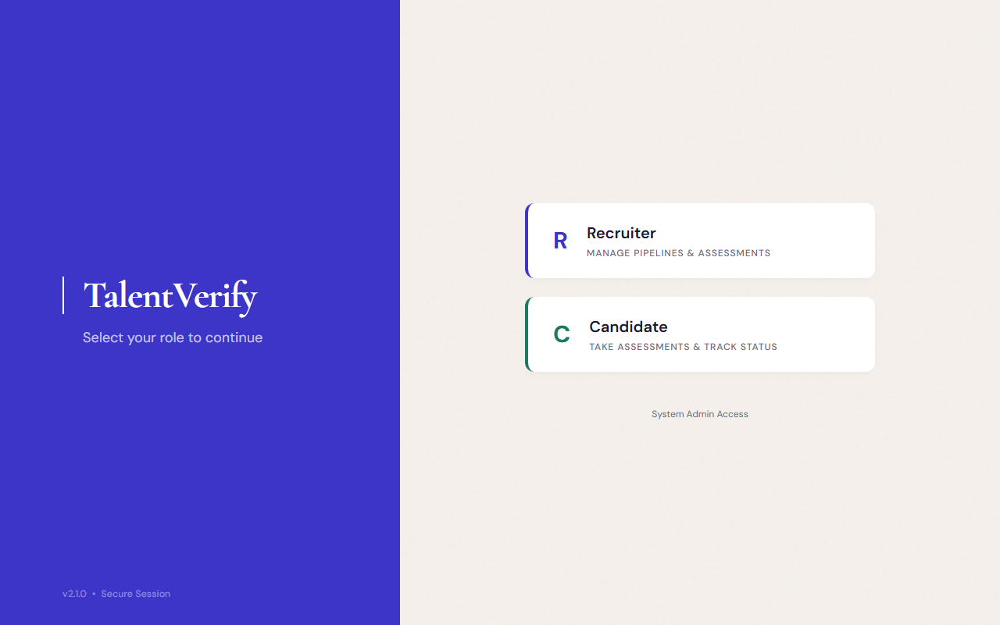

**Directory:** `talentverify`  
**Stack:** React/Vite  
**Port:** 4173  
**Docker:** Yes  

```bash
cd talentverify
pnpm install
pnpm run dev
```

### Thumbnail Generator
<a name="thumbnail-generator"></a>

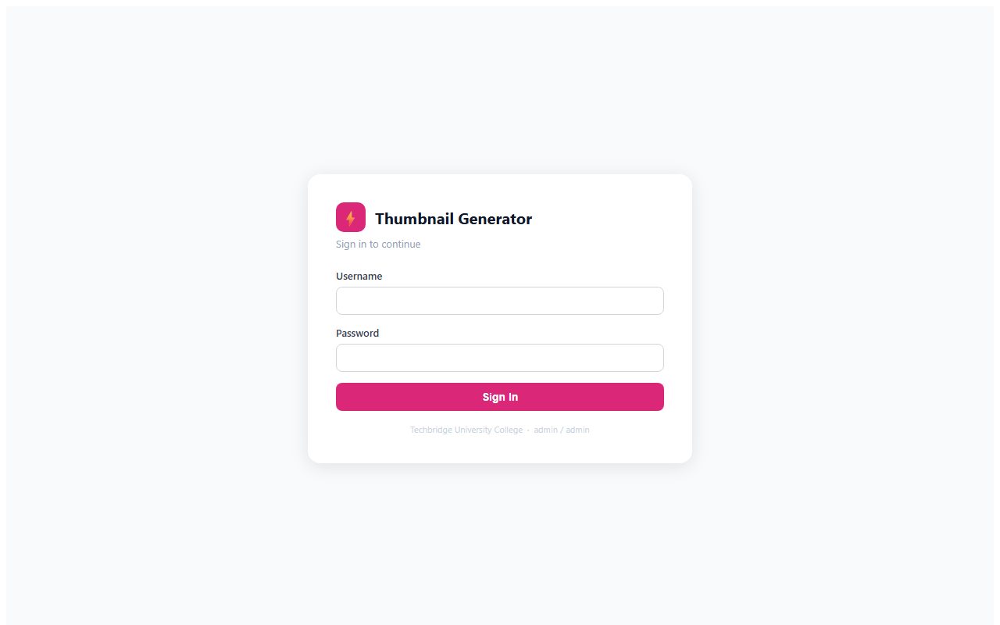

**Directory:** `thumbnail-generator`  
**Stack:** React/Vite  
**Port:** 80  
**Docker:** Yes  

```bash
cd thumbnail-generator
pnpm install
pnpm run dev
```

### Timetable Management System
<a name="timetable-management-system"></a>

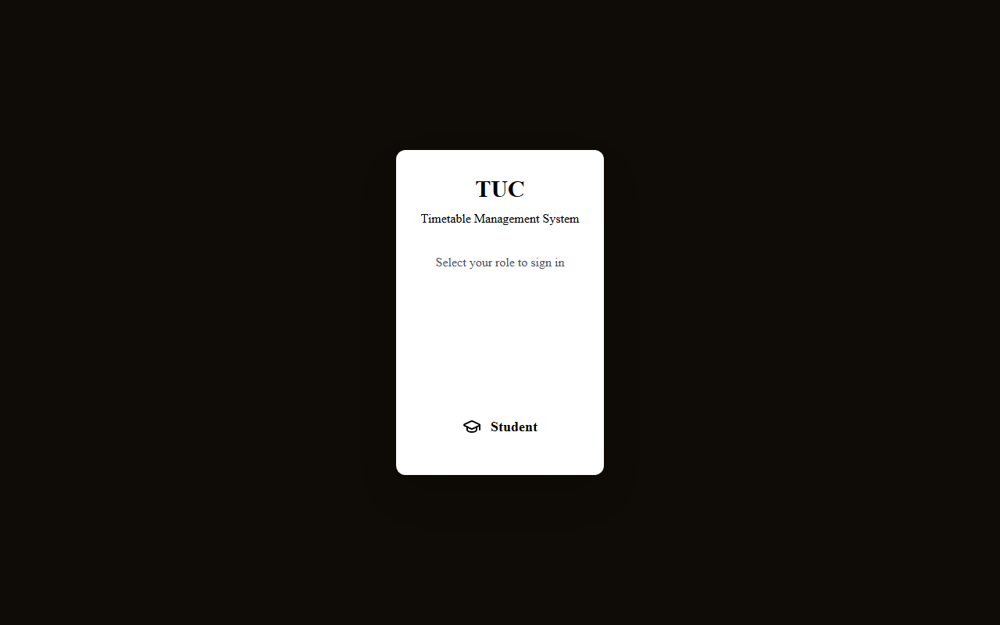

**Directory:** `timetable-management-system`  
**Stack:** React/Vite  
**Port:** 4173  
**Docker:** Yes  

```bash
cd timetable-management-system
pnpm install
pnpm run dev
```

### Tsapro
<a name="tsapro"></a>


**Directory:** `tsapro`  
**Stack:** React/Vite  
**Port:** 4173  
**Docker:** Yes  

```bash
cd tsapro
pnpm install
pnpm run dev
```

### Tsapro Mapping Review
<a name="tsapro-mapping-review"></a>

**Directory:** `tsapro-mapping-review`  
**Stack:** Node.js/Express  
**Port:** 4173  
**Docker:** Yes  
**Description:** Timetable mapping review and conflict resolution service  

```bash
cd tsapro-mapping-review
pnpm install
pnpm run dev
```

### Umoja React App
<a name="umoja-react-app"></a>


**Directory:** `umoja-react-app`  
**Stack:** React/Vite  
**Port:** 4173  
**Docker:** Yes  

```bash
cd umoja-react-app
pnpm install
pnpm run dev
```

### Urban Traffic Optimizer
<a name="urban-traffic-optimizer"></a>


**Directory:** `urban-traffic-optimizer`  
**Stack:** React/Vite  
**Port:** 80  
**Docker:** Yes  
**Description:** Autonomous operations and management -  

```bash
cd urban-traffic-optimizer
pnpm install
pnpm run dev
```

### Urban Waste Optimization Engine
<a name="urban-waste-optimization-engine"></a>

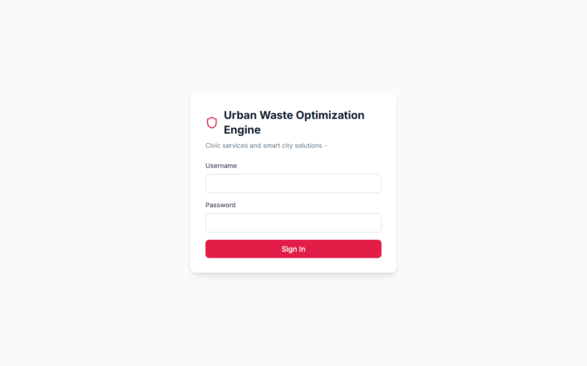

**Directory:** `urban-waste-optimization-engine`  
**Stack:** React/Vite  
**Port:** 80  
**Docker:** Yes  
**Description:** Civic services and smart city solutions -  

```bash
cd urban-waste-optimization-engine
pnpm install
pnpm run dev
```

### Usage Billing Engine
<a name="usage-billing-engine"></a>

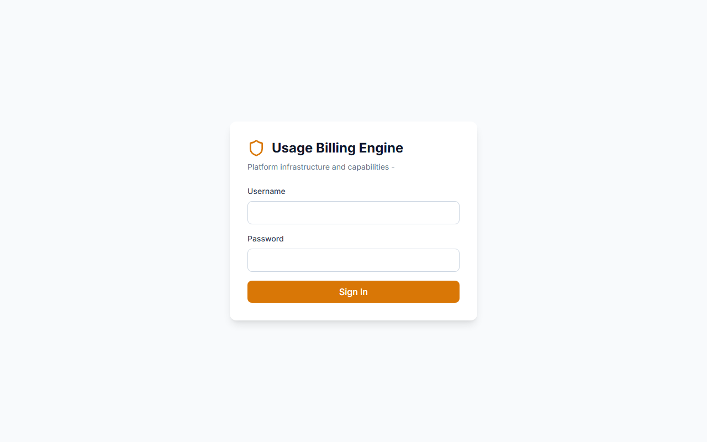

**Directory:** `usage-billing-engine`  
**Stack:** React/Vite  
**Port:** 80  
**Docker:** Yes  
**Description:** Platform infrastructure and capabilities -  

```bash
cd usage-billing-engine
pnpm install
pnpm run dev
```

### Video Scene Generator
<a name="video-scene-generator"></a>


**Directory:** `video-scene-generator`  
**Stack:** React/Vite  
**Port:** 80  
**Docker:** Yes  
**Description:** Creative content generation and design -  

```bash
cd video-scene-generator
pnpm install
pnpm run dev
```

### Whatsapp Parody
<a name="whatsapp-parody"></a>

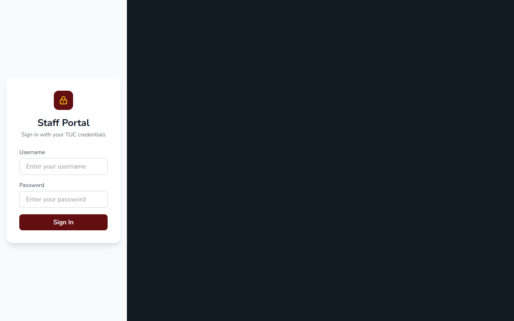

**Directory:** `whatsapp-parody`  
**Stack:** React/Vite  
**Port:** 4173  
**Docker:** Yes  

```bash
cd whatsapp-parody
pnpm install
pnpm run dev
```

### Willpro
<a name="willpro"></a>


**Directory:** `willpro`  
**Stack:** React/Vite  
**Port:** 4173  
**Docker:** Yes  

```bash
cd willpro
pnpm install
pnpm run dev
```

### Youtube Description Genie
<a name="youtube-description-genie"></a>


**Directory:** `youtube-description-genie`  
**Stack:** React/Vite  
**Port:** 4173  
**Docker:** Yes  

```bash
cd youtube-description-genie
pnpm install
pnpm run dev
```

---

## Statistics Summary

| Category | Count |
|----------|-------|
| AI & Machine Learning | 45 |
| Analytics & Monitoring | 22 |
| Digital Twin & Simulation | 18 |
| Healthcare & Medical | 6 |
| Education & Learning | 18 |
| Financial & Risk | 10 |
| Security & Compliance | 6 |
| Infrastructure & DevOps | 6 |
| Sentinel Systems | 5 |
| Techbridge Projects | 16 |
| Grooverx | 1 |
| Business & Operations | 10 |
| Other Applications | 123 |
| **Total** | **286** |

---

*Generated automatically from repository state — March 29, 2026*  
*Techbridge University College Development Team*  
