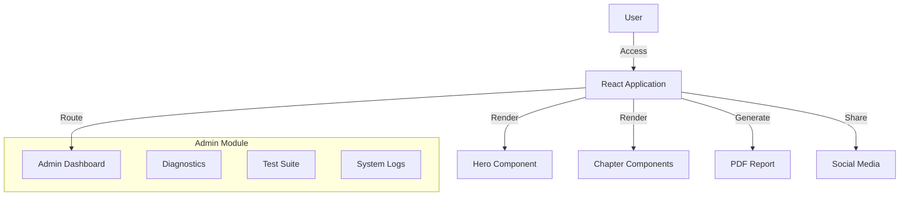
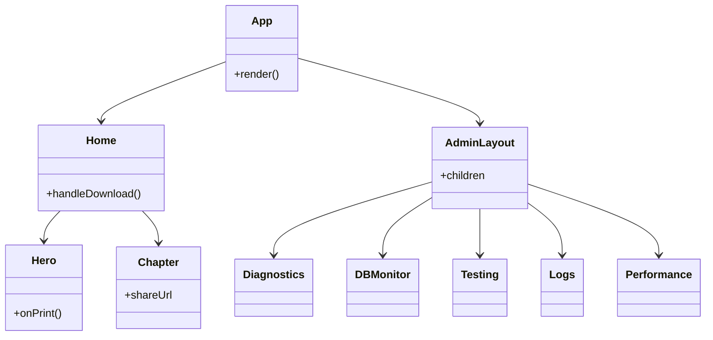
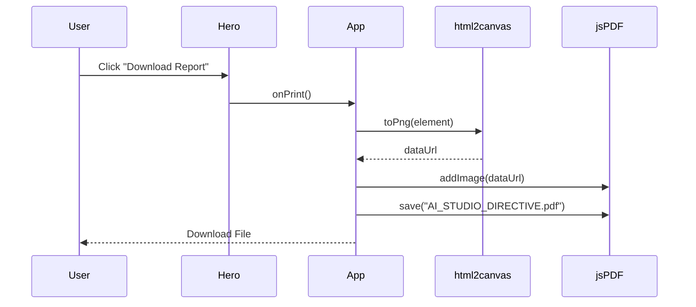

# System Architecture Diagrams

## 1. High-Level Architecture

```mermaid
graph TD
    User[User] -->|Access| App[React Application]
    App -->|Render| Hero[Hero Component]
    App -->|Render| Chapters[Chapter Components]
    App -->|Generate| PDF[PDF Report]
    App -->|Share| Social[Social Media]
    
    subgraph "Admin Module"
        Admin[Admin Dashboard]
        Diagnostics[Diagnostics]
        Tests[Test Suite]
        Logs[System Logs]
    end
    
    App -->|Route| Admin
```

## 2. Component Hierarchy

```mermaid
classDiagram
    class App {
        +render()
    }
    class Home {
        +handleDownload()
    }
    class Hero {
        +onPrint()
    }
    class Chapter {
        +shareUrl
    }
    class AdminLayout {
        +children
    }
    
    App --> Home
    App --> AdminLayout
    Home --> Hero
    Home --> Chapter
    AdminLayout --> Diagnostics
    AdminLayout --> DBMonitor
    AdminLayout --> Testing
    AdminLayout --> Logs
    AdminLayout --> Performance
```

## 3. Data Flow (PDF Generation)

```mermaid
sequenceDiagram
    participant User
    participant Hero
    participant App
    participant html2canvas
    participant jsPDF
    
    User->>Hero: Click "Download Report"
    Hero->>App: onPrint()
    App->>html2canvas: toPng(element)
    html2canvas-->>App: dataUrl
    App->>jsPDF: addImage(dataUrl)
    App->>jsPDF: save("AI_STUDIO_DIRECTIVE.pdf")
    App-->>User: Download File
```
