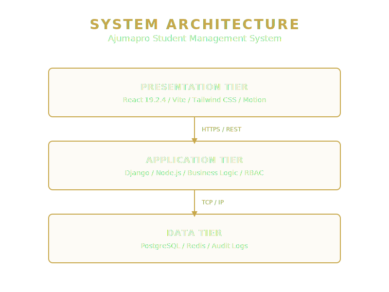
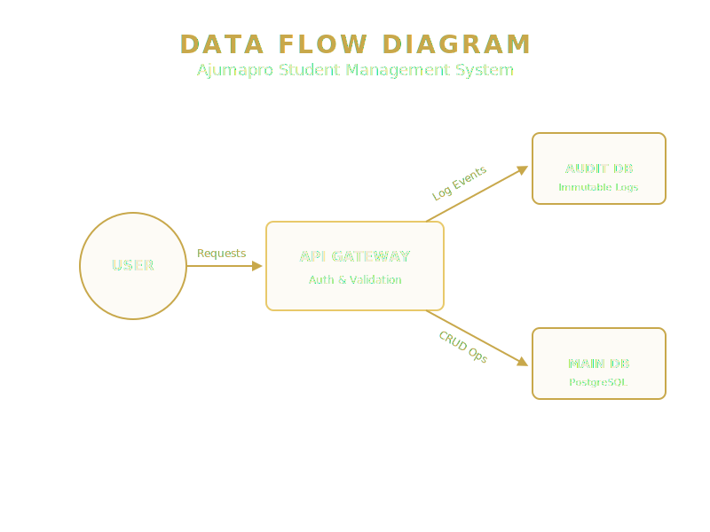

# Software Requirements Specification (SRS)
## Ajumapro Student Management System
**Version:** 3.0.0
**Date:** March 2026

### 1. Introduction
#### 1.1 Purpose
This document specifies the software requirements for the Ajumapro Student Management System (SMS) v3.0.0. It provides a comprehensive overview of the system's architecture, data flow, features, and technical constraints.

#### 1.2 Scope
The Ajumapro SMS is a web-based platform designed to manage student data, facilitate administrative tasks, and provide a secure environment for institutional operations. Key features include a public-facing cover page, a secure admin portal, real-time system diagnostics, and an integrated testing suite.

### 2. Overall Description
#### 2.1 Product Perspective
The system operates as a Single Page Application (SPA) built with React 19.2.5, Vite, and Tailwind CSS. It communicates with a backend Application Tier (Django/Node.js) and a Data Tier (PostgreSQL/Redis).

#### 2.2 System Architecture
The architecture follows a three-tier model: Presentation, Application, and Data.

#### 2.3 Data Flow
User requests are routed through an API Gateway, which handles authentication and validation before interacting with the Main DB and Audit DB.

### 3. Specific Requirements
#### 3.1 Functional Requirements
- **FR1:** The system shall display a public cover page with Ajumapro branding.
- **FR2:** The system shall provide a secure Admin Portal accessible via `#/admin`.
- **FR3:** The Admin Portal shall require authentication (password: `admin123`).
- **FR4:** The system shall maintain an immutable Audit Log of all administrative actions.
- **FR5:** The Admin Portal shall include diagnostic tools (Network Latency, Active Connections, API Error Rate, Uptime).
- **FR6:** The Admin Portal shall include a DB Monitor for tracking PostgreSQL status and query latency.
- **FR7:** The Admin Portal shall feature an interactive Testing Suite to run E2E tests and capture DOM snapshots.
- **FR8:** The system shall support Light, Dark, and High-Contrast themes.

#### 3.2 Non-Functional Requirements
- **NFR1 (Technology):** The frontend MUST be built using React 19.2.5.
- **NFR2 (Accessibility):** The system MUST achieve 100% ARIA/Tooltip coverage for all interactive elements.
- **NFR3 (Performance):** The system MUST load the initial cover page in under 2 seconds.
- **NFR4 (Security):** All diagnostic and testing features MUST be isolated to `/admin/*` routes.

### 4. Appendices
- [Admin Guide](./admin-guide.md)
- [Deployment & Testing Guide](./deployment-and-testing.md)
