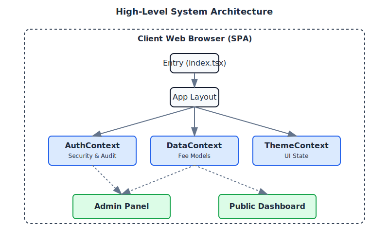
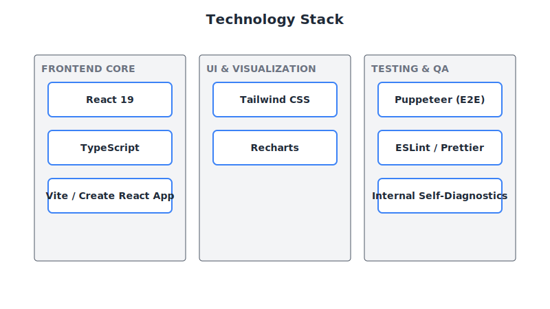
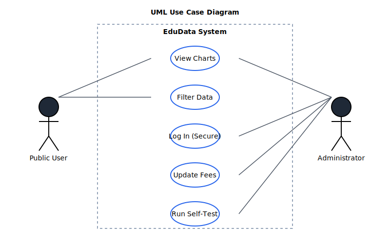
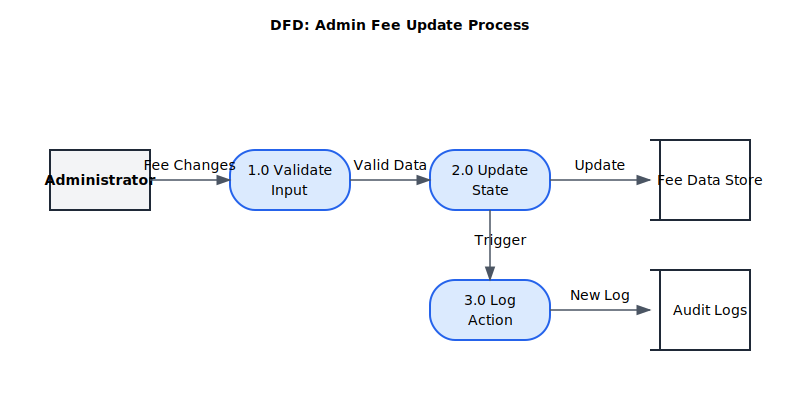
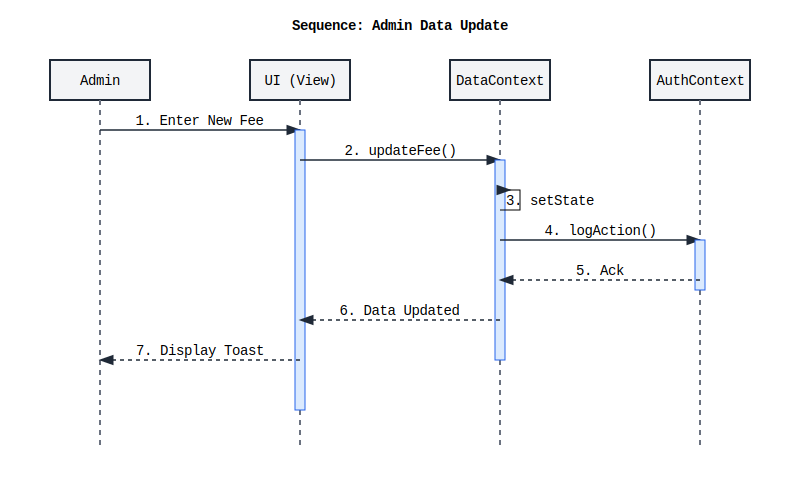

# System Requirements Specification (SRS)
**Project:** EduData Ghana University Fees Dashboard
**Version:** 2.0 (Final Release)
**Date:** October 26, 2023
**Status:** Complete

---

## 1. Introduction

### 1.1 Purpose
The purpose of the EduData Ghana platform is to provide transparent, comparative analysis of university tuition fees across Ghana. This final SRS documents the complete system, including the public dashboard, secure administration panel, audit logging, and testing infrastructure.

### 1.2 Scope
The application is a secure Single Page Application (SPA) offering:
- **Public:** Interactive visualizations of tuition fees (Undergraduate, International, Postgraduate).
- **Admin:** Secure login, real-time data management, and audit logging.
- **System:** Integrated self-diagnostics and high-contrast accessibility modes.

---

## 2. System Architecture

The system utilizes a React-based architecture relying on the Context API for global state management (Auth, Data, Theme). It is designed for client-side execution with zero backend dependency for the MVP phase.

### 2.1 Technology Stack
- **Core:** React 19, TypeScript.
- **Styling:** Tailwind CSS.
- **Visualization:** Recharts.
- **Testing:** Playwright (E2E), Internal Diagnostics.

---

## 3. Functional Requirements

### 3.1 Public Dashboard
- **FR-1:** Display comparative bar charts for fees.
- **FR-2:** Allow filtering by Student Category (Undergraduate, International, Postgraduate).
- **FR-3:** Display tooltips with breakdown of Freshman vs. Continuing fees.
- **FR-4:** Support Light, Dark, and High-Contrast themes.

### 3.2 Administration & Security
- **FR-5:** Secure Login screen with configurable password.
- **FR-6:** Edit fee structures in real-time.
- **FR-7:** Log all administrative actions (Login, Update, Logout).
- **FR-8:** View Audit Logs in a tabular format.

### 3.3 Data Flow
When an administrator updates a fee, the data flows through the Validation layer, updates the DataContext, triggers a re-render of the Dashboard, and appends an entry to the Audit Log.

---

## 4. System Logic (Sequence)

The following sequence diagram illustrates the secure interaction flow when an Admin updates a fee record.

---

## 5. Non-Functional Requirements

### 5.1 Accessibility
- **NFR-1:** WCAG 2.1 AA Compliance.
- **NFR-2:** High-contrast mode for visually impaired users.
- **NFR-3:** Screen reader support (ARIA labels) on all interactive elements.

### 5.2 Performance
- **NFR-4:** Application Time-to-Interactive (TTI) < 1.5s.
- **NFR-5:** Chart re-render latency < 50ms.

### 5.3 Reliability
- **NFR-6:** Internal "System Health" self-test must pass all checks before deployment.
- **NFR-7:** E2E Playwright tests must pass on CI pipeline.

---
*End of Document - Phase 5 Complete*
