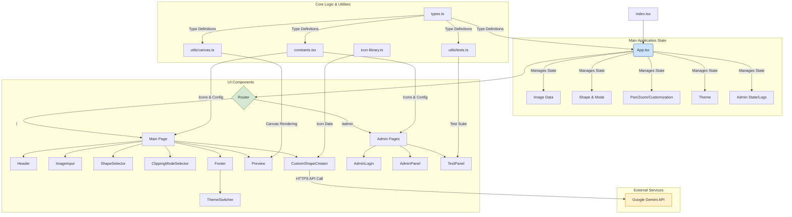

# clipai - Ultimate Self-Replicating Blueprint (AGENT.md)

> [!IMPORTANT]
> This is an auto-generated monolithic blueprint containing the source code for clipai.

### FILE: (environment files omitted)

> Environment files are never committed. See the repo's own `.env.example`
> for variable names; real values live only in the server's untracked
> `.env.local` / `.env.production`. This block was removed by the fleet
> secret-scrub (blueprint minus secrets).

### FILE: .gitignore
```text
# Logs
logs
*.log
npm-debug.log*
yarn-debug.log*
yarn-error.log*
pnpm-debug.log*
lerna-debug.log*

node_modules
dist
dist-ssr
*.local

# Editor directories and files
.vscode/*
!.vscode/extensions.json
.idea
.DS_Store
*.suo
*.ntvs*
*.njsproj
*.sln
*.sw?

```

### FILE: .npmrc
```text
auto-install-peers=true
engine-strict=false
ignore-scripts=true

```

### FILE: App.tsx
```typescript
import React, { useState, useRef, useEffect, useCallback } from 'react';
import { GoogleGenAI, Modality } from '@google/genai';
import { ShapeId, ClippingMode, Theme, MediaSource, OutlineStyle } from './types';

// Component Imports
import Header from './components/Header';
import ImageInput from './components/ImageInput';
import ImageEditor from './components/ImageEditor';
import ShapeSelectorComponent from './components/ShapeSelector';
import OutlineControls from './components/OutlineControls';
import CustomShapeControls from './components/CustomShapeControls';
import Preview from './components/Preview';
import IconLibraryModal from './components/IconLibraryModal';
import AdminLogin from './components/AdminLogin';
import AdminPanel from './components/AdminPanel';
import ThemeSwitcher from './components/ThemeSwitcher';
import TestPanel from './components/TestPanel';
import ErrorToast from './components/ErrorToast';

// Hook Imports
import { useMediaLoader } from './hooks/useImageLoader';
import { useCanvasTransforms } from './hooks/useCanvasTransforms';
import { useCustomShape } from './hooks/useCustomShape';
import { useKeyboardShortcuts } from './hooks/useKeyboardShortcuts';
import { useAppNavigation } from './hooks/useAppNavigation';
import { useTheme } from './hooks/useTheme';

import { SHAPES, shapeIcons } from './constants';
import { ICON_LIBRARY } from './icon-library';
import { drawClippedImage } from './utils/canvas';

const mediaSourceToGenerativePart = (mediaSource: MediaSource, mimeType: string = 'image/png'): { inlineData: { data: string, mimeType: string } } => {
    const canvas = document.createElement('canvas');
    let width, height;

    if (mediaSource instanceof HTMLVideoElement) {
        width = mediaSource.videoWidth;
        height = mediaSource.videoHeight;
    } else { // HTMLImageElement
        width = mediaSource.naturalWidth;
        height = mediaSource.naturalHeight;
    }

    canvas.width = width;
    canvas.height = height;
    const ctx = canvas.getContext('2d');
    if (!ctx) throw new Error("Could not get canvas context");
    
    ctx.drawImage(mediaSource, 0, 0, width, height);
    
    const dataUrl = canvas.toDataURL(mimeType);
    const base64Data = dataUrl.split(',')[1];
    
    return {
        inlineData: {
            data: base64Data,
            mimeType,
        },
    };
};


function App() {
    const [error, setError] = useState<string | null>(null);

    // Navigation and Theming
    const { page, setPage, isAdminAuthenticated, auditLog, handleLoginSuccess, handleLogout, logAdminAction } = useAppNavigation();
    const { theme, setTheme } = useTheme();

    // Core Application Logic via Custom Hooks
    const { mediaSource, setMediaSource, originalMediaSource, revertToOriginal, isProcessing, fileInputRef, ...mediaHandlers } = useMediaLoader(setError);
    const { shape, clippingMode, outlineColor, outlineThickness, customSvgPath, isPristine, setIsPristine, handleDownload, outlineStyle, ...shapeHandlers } = useCustomShape(setError);
    const { zoom, offset, isPanning, setOffset, ...transformHandlers } = useCanvasTransforms(mediaSource, clippingMode, setIsPristine);

    useKeyboardShortcuts({
        page,
        hasDrawable: !!mediaSource || clippingMode === 'outline',
        zoomIn: transformHandlers.zoomIn,
        zoomOut: transformHandlers.zoomOut,
        reset: transformHandlers.reset,
    });
    
    // State for Image Editing
    const [isEditingMedia, setIsEditingMedia] = useState(false);

    // Refs
    const canvasRef = useRef<HTMLCanvasElement>(null);

    // Effect to manage outline style when media source changes
    useEffect(() => {
        if (!mediaSource && outlineStyle === 'texture') {
            shapeHandlers.handleOutlineStyleChange('solid');
        }
    }, [mediaSource, outlineStyle, shapeHandlers.handleOutlineStyleChange]);
    
    // Main drawing logic
    const redrawCanvas = useCallback((isInteracting: boolean) => {
        if (canvasRef.current) {
            drawClippedImage(canvasRef.current, mediaSource, shape, clippingMode, { color: outlineColor, thickness: outlineThickness, style: outlineStyle }, zoom, offset, isInteracting, customSvgPath);
        }
    }, [mediaSource, shape, clippingMode, outlineColor, outlineThickness, zoom, offset, customSvgPath, outlineStyle]);

    const isVideoPlaying = mediaSource instanceof HTMLVideoElement && !mediaSource.paused;

    useEffect(() => {
        let animationFrameId: number;
        const renderLoop = () => {
            redrawCanvas(isPanning);
            animationFrameId = requestAnimationFrame(renderLoop);
        };

        if (page === 'main' || page === 'testPanel') {
            if (isVideoPlaying) {
                animationFrameId = requestAnimationFrame(renderLoop);
            } else {
                redrawCanvas(isPanning);
            }
        }
        return () => { cancelAnimationFrame(animationFrameId); };
    }, [page, mediaSource, isVideoPlaying, redrawCanvas, isPanning]);


    const downloadHandler = useCallback((format: 'png' | 'pdf') => {
        handleDownload(format, { canvasRef, image: mediaSource, shape, clippingMode, outlineColor, outlineThickness, zoom, offset, customSvgPath, outlineStyle });
    }, [handleDownload, mediaSource, shape, clippingMode, outlineColor, outlineThickness, zoom, offset, customSvgPath, outlineStyle]);

    const handleMediaEdit = useCallback(async (prompt: string) => {
        if (!mediaSource) {
            setError("No media available to edit.");
            return;
        }

        setIsEditingMedia(true);
        setError(null);
        try {
            const ai = new GoogleGenAI({ apiKey: process.env.API_KEY });
            const mediaPart = mediaSourceToGenerativePart(mediaSource);
            const textPart = { text: prompt };

            const response = await ai.models.generateContent({
                model: 'gemini-2.5-flash-image',
                contents: { parts: [mediaPart, textPart] },
                config: {
                    responseModalities: [Modality.IMAGE],
                },
            });

            const firstPart = response.candidates?.[0]?.content?.parts?.[0];
            if (firstPart && 'inlineData' in firstPart && firstPart.inlineData) {
                const { data: newBase64Data, mimeType: newMimeType } = firstPart.inlineData;
                
                const newImg = new Image();
                await new Promise((resolve, reject) => {
                    newImg.onload = resolve;
                    newImg.onerror = reject;
                    newImg.src = `data:${newMimeType};base64,${newBase64Data}`;
                });

                setMediaSource(newImg); // The edited result is always an image
                setIsPristine(false);
            } else {
                throw new Error("The AI did not return a valid image. Please try a different prompt.");
            }
        } catch (error) {
            const message = error instanceof Error ? error.message : "An unknown error occurred during image editing.";
            console.error("Image editing error:", error);
            setError(message);
        } finally {
            setIsEditingMedia(false);
        }
    }, [mediaSource, setMediaSource, setIsPristine, setError]);

    const isDownloadDisabled = isPristine || (clippingMode === 'fill' && !mediaSource);
    const downloadTooltip = isDownloadDisabled
        ? (!mediaSource && clippingMode === 'fill' ? "Upload an image or video to enable download" : "Adjust media or outline to enable download")
        : "Download your creation";
    
    const panCanvasForTest = (dx: number, dy: number) => {
        setOffset(o => ({ x: o.x + dx, y: o.y + dy }));
        setIsPristine(false);
    };
    
    const testContextSetters = {
        setMediaSource,
        setShape: shapeHandlers.setShape,
        setClippingMode: shapeHandlers.setClippingMode,
        setCustomSvgPath: shapeHandlers.setCustomSvgPath,
        runAiEdit: handleMediaEdit,
        isDownloadDisabled: () => isDownloadDisabled,
        panCanvas: panCanvasForTest,
    };

    const renderPage = () => {
        switch (page) {
            case 'adminLogin': return <AdminLogin onLoginSuccess={handleLoginSuccess} onBack={() => setPage('main')} />;
            case 'adminPanel': return <AdminPanel auditLog={auditLog} onLogout={handleLogout} logAdminAction={logAdminAction} onNavigateToTests={() => setPage('testPanel')} />;
            case 'testPanel': return <TestPanel onBack={() => setPage('adminPanel')} stateSetters={testContextSetters} canvasRef={canvasRef} />;
            default:
                return (
                    <main className="mt-8 grid grid-cols-1 lg:grid-cols-2 gap-8">
                        <div className="hc-bg hc-border hc-text bg-white dark:bg-gray-800 p-6 rounded-2xl shadow-sm border border-gray-200 dark:border-gray-700">
                            <div className="space-y-6">
                                <ImageInput
                                    onImageUpload={mediaHandlers.handleImageUpload}
                                    onUrlLoad={mediaHandlers.handleUrlLoad}
                                    onSvgLoad={mediaHandlers.handleSvgLoad}
                                    isProcessing={isProcessing}
                                    hasImage={!!mediaSource}
                                    fileInputRef={fileInputRef}
                                />
                                {mediaSource && (
                                    <ImageEditor
                                        onEdit={handleMediaEdit}
                                        onRevert={() => {
                                            revertToOriginal();
                                            setIsPristine(true);
                                        }}
                                        isEditing={isEditingMedia}
                                        isRevertable={mediaSource !== originalMediaSource}
                                    />
                                )}
                                <ShapeSelectorComponent
                                    shapes={SHAPES} shapeIcons={shapeIcons}
                                    currentShape={shape} onShapeSelect={shapeHandlers.handleShapeSelect}
                                    clippingMode={clippingMode} onClippingModeChange={shapeHandlers.handleClippingModeChange}
                                />
                                {clippingMode === 'outline' && (
                                    <OutlineControls
                                        color={outlineColor} thickness={outlineThickness} hasMedia={!!mediaSource}
                                        onColorChange={shapeHandlers.handleOutlineColorChange}
                                        onThicknessChange={shapeHandlers.handleOutlineThicknessChange}
                                        outlineStyle={outlineStyle}
                                        onOutlineStyleChange={shapeHandlers.handleOutlineStyleChange}
                                    />
                                )}
                                <CustomShapeControls
                                    customMode={shapeHandlers.customMode} activeCustomSource={shapeHandlers.activeCustomSource}
                                    aiPrompt={shapeHandlers.aiPrompt} customSvgPath={customSvgPath}
                                    isGeneratingShape={shapeHandlers.isGeneratingShape} generationError={shapeHandlers.generationError}
                                    pasteError={shapeHandlers.pasteError} isCopied={shapeHandlers.isCopied}
                                    onCustomModeClick={shapeHandlers.handleCustomModeClick}
                                    onUploadClick={shapeHandlers.handleUploadButtonClick}
                                    onLibraryClick={shapeHandlers.handleLibraryClick}
                                    onAiPromptChange={shapeHandlers.setAiPrompt} onGenerateShape={shapeHandlers.handleGenerateShape}
                                    onStopGenerating={shapeHandlers.handleStopGenerating} onPastedPathChange={shapeHandlers.handlePastedPathChange}
                                    onCopyPath={shapeHandlers.handleCopyPath}
                                    onSvgShapeUpload={shapeHandlers.handleSvgShapeUpload}
                                    svgShapeFileInputRef={shapeHandlers.svgShapeFileInputRef}
                                />
                            </div>
                        </div>
                        <Preview
                            canvasRef={canvasRef} image={mediaSource} clippingMode={clippingMode} zoom={zoom} isPanning={isPanning}
                            onMouseDown={transformHandlers.handleMouseDown} onMouseUp={transformHandlers.handleMouseUp}
                            onMouseMove={transformHandlers.handleMouseMove} onMouseLeave={transformHandlers.handleMouseLeave}
                            onWheel={transformHandlers.handleWheel} onZoomIn={transformHandlers.zoomIn}
                            onZoomOut={transformHandlers.zoomOut} onReset={transformHandlers.reset}
                            onDownloadPng={() => downloadHandler('png')} onDownloadPdf={() => downloadHandler('pdf')}
                            isDownloadDisabled={isDownloadDisabled} downloadTooltip={downloadTooltip}
                        />
                    </main>
                );
        }
    };

    return (
        <>
            <div className="min-h-screen bg-gray-50 dark:bg-gray-900 text-gray-800 dark:text-gray-200 font-sans p-4 sm:p-6 lg:p-8">
                <div className="max-w-7xl mx-auto rounded-xl">
                    <Header />
                    {renderPage()}
                    <footer className="text-center mt-12 py-4 border-t border-gray-200 dark:border-gray-700">
                        <div className="flex items-center justify-center gap-6">
                            <ThemeSwitcher theme={theme} setTheme={setTheme} />
                            <button onClick={() => setPage(isAdminAuthenticated ? 'adminPanel' : 'adminLogin')} className="hc-link text-xs text-gray-400 dark:text-gray-500 hover:text-purple-600 dark:hover:text-purple-400 transition-colors" title="Go to Admin Panel">
                                Admin
                            </button>
                        </div>
                    </footer>
                </div>
            </div>
            {page === 'main' && <IconLibraryModal isOpen={shapeHandlers.isLibraryOpen} onClose={shapeHandlers.handleCloseLibrary} onSelect={shapeHandlers.handleIconSelect} iconLibrary={ICON_LIBRARY} />}
            <ErrorToast message={error} onClose={() => setError(null)} />
        </>
    );
}

export default App;
```

### FILE: AppWithAuth.tsx
```typescript
import React from 'react';
import { useAuth } from './contexts/AuthContext';
import { LoginView } from './components/LoginView';
import App from './App';

export const AppWithAuth: React.FC = () => {
  const { isAuthenticated } = useAuth();

  if (!isAuthenticated) {
    return <LoginView />;
  }

  return <App />;
};

```

### FILE: components/AdminLogin.tsx
```typescript
import React, { useState, useEffect } from 'react';

interface AdminLoginProps {
    onLoginSuccess: () => void;
    onBack: () => void;
}

const PASSWORD_KEY = [REDACTED_CREDENTIAL]

const AdminLogin: React.FC<AdminLoginProps> = ({ onLoginSuccess, onBack }) => {
    const [storedPassword, setStoredPassword] = useState<string | null>(null);
    const [isSetupMode, setIsSetupMode] = useState(false);
    const [password, setPassword] = useState('');
    const [confirmPassword, setConfirmPassword] = useState('');
    const [error, setError] = useState('');

    useEffect(() => {
        const pass = localStorage.getItem(PASSWORD_KEY);
        setStoredPassword(pass);
        if (!pass) {
            setIsSetupMode(true);
        }
    }, []);

    const handleLogin = (e: React.FormEvent) => {
        e.preventDefault();
        if (password =[REDACTED_CREDENTIAL]
            onLoginSuccess();
        } else {
            setError('Incorrect password. Please try again.');
            setPassword('');
        }
    };
    
    const handleSetup = (e: React.FormEvent) => {
        e.preventDefault();
        if (password.length < 6) {
             setError('Password must be at least 6 characters long.');
             return;
        }
        if (password !== confirmPassword) {
            setError('Passwords do not match.');
            return;
        }
        localStorage.setItem(PASSWORD_KEY, password);
        onLoginSuccess();
    };

    if (storedPassword =[REDACTED_CREDENTIAL]
        // Still loading from localStorage, show a blank state to avoid flicker
        return <div className="hc-bg hc-border hc-text max-w-md mx-auto mt-10 p-8 rounded-2xl shadow-lg border border-gray-200 dark:border-gray-700" style={{ minHeight: '350px' }}></div>;
    }

    if (isSetupMode) {
        return (
            <div className="hc-bg hc-border hc-text max-w-md mx-auto mt-10 bg-white dark:bg-gray-800 p-8 rounded-2xl shadow-lg border border-gray-200 dark:border-gray-700">
                <h2 className="text-2xl font-bold text-center text-gray-900 dark:text-white hc-text">Set Admin Password</h2>
                <p className="text-center text-sm text-gray-500 dark:text-gray-400 mt-2">This is the first time you're accessing the admin panel. Please set a secure password.</p>
                <form onSubmit={handleSetup} className="mt-6 space-y-6">
                    <div>
                        <label htmlFor="password-set" className="sr-only">New Password</label>
                        <input id="password-set" type="password" value={password} onChange={(e) => setPassword(e.target.value)} placeholder="New Password (min. 6 characters)" className="hc-bg hc-border hc-text hc-placeholder block w-full px-4 py-3 bg-white dark:bg-gray-700 border border-gray-300 dark:border-gray-600 rounded-md shadow-sm" required />
                    </div>
                     <div>
                        <label htmlFor="password-confirm" className="sr-only">Confirm New Password</label>
                        <input id="password-confirm" type="password" value={confirmPassword} onChange={(e) => setConfirmPassword(e.target.value)} placeholder="Confirm New Password" className="hc-bg hc-border hc-text hc-placeholder block w-full px-4 py-3 bg-white dark:bg-gray-700 border border-gray-300 dark:border-gray-600 rounded-md shadow-sm" required />
                    </div>
                    {error && <p className="text-sm text-red-600 dark:text-red-400" role="alert">{error}</p>}
                    <div className="flex flex-col sm:flex-row-reverse gap-3">
                         <button type="submit" className="w-full justify-center px-4 py-2 bg-purple-600 text-white font-semibold rounded-md hover:bg-purple-700">Set Password & Login</button>
                         <button type="button" onClick={onBack} className="w-full justify-center px-4 py-2 bg-gray-200 dark:bg-gray-600 text-gray-800 dark:text-gray-200 font-semibold rounded-md hover:bg-gray-300 dark:hover:bg-gray-500">Back to App</button>
                    </div>
                </form>
            </div>
        );
    }
    
    return (
        <div className="hc-bg hc-border hc-text max-w-md mx-auto mt-10 bg-white dark:bg-gray-800 p-8 rounded-2xl shadow-lg border border-gray-200 dark:border-gray-700">
            <h2 className="text-2xl font-bold text-center text-gray-900 dark:text-white hc-text">Admin Access</h2>
            <form onSubmit={handleLogin} className="mt-6 space-y-6">
                <div>
                    <label htmlFor="password-input" className="sr-only">Password</label>
                    <input id="password-input" type="password" value={password} onChange={(e) => setPassword(e.target.value)} placeholder="Enter password" className="hc-bg hc-border hc-text hc-placeholder block w-full px-4 py-3 bg-white dark:bg-gray-700 border border-gray-300 dark:border-gray-600 rounded-md shadow-sm" required />
                </div>
                {error && <p className="text-sm text-red-600 dark:text-red-400" role="alert">{error}</p>}
                <div className="flex flex-col sm:flex-row-reverse gap-3">
                     <button type="submit" className="w-full justify-center px-4 py-2 bg-purple-600 text-white font-semibold rounded-md hover:bg-purple-700">Login</button>
                    <button type="button" onClick={onBack} className="w-full justify-center px-4 py-2 bg-gray-200 dark:bg-gray-600 text-gray-800 dark:text-gray-200 font-semibold rounded-md hover:bg-gray-300 dark:hover:bg-gray-500">Back to App</button>
                </div>
            </form>
        </div>
    );
};

export default AdminLogin;
```

### FILE: components/AdminPanel.tsx
```typescript
import React from 'react';
import { AuditLogEntry } from '../types';

interface AdminPanelProps {
    auditLog: AuditLogEntry[];
    onLogout: () => void;
    logAdminAction: (action: string) => void;
    onNavigateToTests: () => void;
}

const AdminPanel: React.FC<AdminPanelProps> = ({ auditLog, onLogout, logAdminAction, onNavigateToTests }) => {
    
    const handleActionClick = (action: string) => {
        logAdminAction(action);
    };

    const handleNavigateToTests = () => {
        logAdminAction('Navigated to self-test panel.');
        onNavigateToTests();
    };

    return (
        <div className="hc-bg hc-border hc-text max-w-4xl mx-auto mt-10 bg-white dark:bg-gray-800 p-8 rounded-2xl shadow-lg border border-gray-200 dark:border-gray-700">
            <div className="flex justify-between items-center mb-6">
                <h2 className="text-2xl font-bold text-gray-900 dark:text-white hc-text">Admin Panel</h2>
                <button onClick={onLogout} className="px-4 py-2 bg-red-600 text-white font-semibold rounded-md hover:bg-red-700 transition-colors">
                    Logout
                </button>
            </div>

            <div className="grid grid-cols-1 md:grid-cols-2 gap-8">
                {/* Actions Section */}
                <div className="space-y-4">
                    <h3 className="text-lg font-semibold border-b border-gray-300 dark:border-gray-600 pb-2">Actions</h3>
                    <p className="text-sm text-gray-500 dark:text-gray-400">Perform administrative tasks.</p>
                    <div className="flex flex-col gap-3">
                        <button onClick={() => handleActionClick('Cache cleared')} className="w-full text-left px-4 py-2 bg-blue-500 text-white rounded-md hover:bg-blue-600 transition-colors">
                            Clear Cache
                        </button>
                        <button onClick={() => handleActionClick('User settings reset')} className="w-full text-left px-4 py-2 bg-blue-500 text-white rounded-md hover:bg-blue-600 transition-colors">
                           Reset All User Settings
                        </button>
                         <button onClick={() => handleActionClick('System diagnostics ran')} className="w-full text-left px-4 py-2 bg-yellow-500 text-black rounded-md hover:bg-yellow-600 transition-colors">
                           Run System Diagnostics
                        </button>
                         <button onClick={handleNavigateToTests} className="w-full text-left px-4 py-2 bg-green-600 text-white rounded-md hover:bg-green-700 transition-colors">
                           Go to Testing
                        </button>
                    </div>
                </div>

                {/* Audit Log Section */}
                <div className="space-y-4">
                    <h3 className="text-lg font-semibold border-b border-gray-300 dark:border-gray-600 pb-2">Audit Log</h3>
                    <div className="h-64 overflow-y-auto bg-gray-50 dark:bg-gray-900 p-3 rounded-md border border-gray-200 dark:border-gray-700">
                        {auditLog.length > 0 ? (
                            <ul className="space-y-2">
                                {auditLog.slice().reverse().map((entry, index) => (
                                    <li key={index} className="text-sm text-gray-700 dark:text-gray-300 border-b border-gray-200 dark:border-gray-700 pb-1">
                                        <span className="font-mono text-xs text-gray-500 dark:text-gray-400 block">{new Date(entry.timestamp).toLocaleString()}</span>
                                        <span>{entry.action}</span>
                                    </li>
                                ))}
                            </ul>
                        ) : (
                            <p className="text-sm text-gray-500 dark:text-gray-400">No actions logged yet.</p>
                        )}
                    </div>
                </div>
            </div>
        </div>
    );
};

export default AdminPanel;
```

### FILE: components/CanvasPreview.tsx
```typescript
import React from 'react';
import { DownloadIcon, ImageIcon, MinusIcon, PlusIcon, ResetIcon, FileTextIcon } from '../constants';
import { ClippingMode } from '../types';

interface CanvasPreviewProps {
  canvasRef: React.RefObject<HTMLCanvasElement>;
  image: HTMLImageElement | null;
  clippingMode: ClippingMode;
  zoom: number;
  isPanning: boolean;
  onMouseDown: (e: React.MouseEvent<HTMLCanvasElement>) => void;
  onMouseUp: () => void;
  onMouseMove: (e: React.MouseEvent<HTMLCanvasElement>) => void;
  onMouseLeave: () => void;
  onWheel: (e: React.WheelEvent<HTMLCanvasElement>) => void;
  onZoomIn: () => void;
  onZoomOut: () => void;
  onReset: () => void;
  onDownloadPng: () => void;
  onDownloadPdf: () => void;
  isDownloadDisabled: boolean;
  downloadTooltip: string;
}

const CanvasPreview: React.FC<CanvasPreviewProps> = ({
  canvasRef, image, clippingMode, zoom, isPanning,
  onMouseDown, onMouseUp, onMouseMove, onMouseLeave, onWheel,
  onZoomIn, onZoomOut, onReset, onDownloadPng, onDownloadPdf,
  isDownloadDisabled, downloadTooltip,
}) => {
  const showCanvas = image || clippingMode === 'outline';
  const cursorClass = showCanvas ? (isPanning ? 'cursor-grabbing' : 'cursor-grab') : 'cursor-default';

  return (
    <div className="hc-bg hc-border hc-text bg-white dark:bg-gray-800 p-6 rounded-2xl shadow-sm border border-gray-200 dark:border-gray-700 flex flex-col items-center justify-center">
      <h2 className="text-lg font-semibold text-gray-900 dark:text-white hc-text mb-4">
        Step 3: Adjust & Download
      </h2>
      
      <div className="w-full aspect-square bg-grid-pattern rounded-lg border border-gray-200 dark:border-gray-700 overflow-hidden relative">
        {!showCanvas && (
          <div className="absolute inset-0 flex flex-col items-center justify-center text-center p-4 pointer-events-none">
            <ImageIcon />
            <p className="mt-4 text-sm font-medium text-gray-500 dark:text-gray-400">Your image preview will appear here</p>
            <p className="text-xs text-gray-400 dark:text-gray-500 mt-1">Use your mouse wheel to zoom and drag to pan</p>
            <p className="text-xs text-gray-400 dark:text-gray-500 mt-1">Keyboard: +/- to zoom, R to reset</p>
          </div>
        )}
        
        <canvas
          ref={canvasRef}
          className={`w-full h-full ${cursorClass}`}
          onMouseDown={onMouseDown} onMouseUp={onMouseUp}
          onMouseMove={onMouseMove} onMouseLeave={onMouseLeave}
          onWheel={onWheel}
          title={showCanvas ? 'Scroll to zoom, click and drag to pan' : 'Upload an image to see the preview'}
        />
        
        {showCanvas && (
          <>
            <div className="absolute bottom-3 right-3 flex items-center gap-1">
              <button onClick={onZoomOut} className="p-2 bg-white/80 dark:bg-gray-900/80 backdrop-blur-sm rounded-full shadow-md hover:bg-white dark:hover:bg-gray-700 transition-colors" title="Zoom out (-)" aria-label="Zoom out"><MinusIcon className="h-4 w-4" /></button>
              <button onClick={onReset} className="p-2 bg-white/80 dark:bg-gray-900/80 backdrop-blur-sm rounded-full shadow-md hover:bg-white dark:hover:bg-gray-700 transition-colors" title="Reset zoom and position (R)" aria-label="Reset transforms"><ResetIcon className="h-4 w-4" /></button>
              <button onClick={onZoomIn} className="p-2 bg-white/80 dark:bg-gray-900/80 backdrop-blur-sm rounded-full shadow-md hover:bg-white dark:hover:bg-gray-700 transition-colors" title="Zoom in (+)" aria-label="Zoom in"><PlusIcon className="h-4 w-4" /></button>
            </div>
            <div className="absolute top-3 left-3 px-2 py-1 bg-white/80 dark:bg-gray-900/80 backdrop-blur-sm rounded-md shadow-md text-xs font-medium text-gray-600 dark:text-gray-300">
              {Math.round(zoom * 100)}%
            </div>
          </>
        )}
      </div>

      <div className="mt-6 w-full grid grid-cols-1 sm:grid-cols-2 gap-3">
        <button onClick={onDownloadPng} disabled={isDownloadDisabled} title={downloadTooltip} className="w-full flex items-center justify-center gap-3 px-6 py-3 bg-purple-600 text-white font-semibold rounded-lg shadow-md hover:bg-purple-700 focus:outline-none focus:ring-2 focus:ring-offset-2 focus:ring-purple-500 disabled:bg-gray-300 dark:disabled:bg-gray-600 disabled:cursor-not-allowed transition-all duration-200">
          <DownloadIcon className="h-5 w-5" />
          <span>Download PNG</span>
        </button>
        <button onClick={onDownloadPdf} disabled={isDownloadDisabled} title={downloadTooltip.replace('Image', 'PDF')} className="w-full flex items-center justify-center gap-3 px-6 py-3 bg-gray-600 text-white font-semibold rounded-lg shadow-md hover:bg-gray-700 focus:outline-none focus:ring-2 focus:ring-offset-2 focus:ring-gray-500 disabled:bg-gray-300 dark:disabled:bg-gray-600 disabled:cursor-not-allowed transition-all duration-200">
          <FileTextIcon className="h-5 w-5" />
          <span>Download PDF</span>
        </button>
      </div>
    </div>
  );
};

export default CanvasPreview;

```

### FILE: components/ClippingModeSelector.tsx
```typescript
import React from 'react';
import { ClippingMode } from '../types';

interface ClippingModeSelectorProps {
    clippingMode: ClippingMode;
    setClippingMode: (mode: ClippingMode) => void;
    outlineColor: string;
    setOutlineColor: (color: string) => void;
    outlineThickness: number;
    setOutlineThickness: (thickness: number) => void;
    image: HTMLImageElement | null;
}

const ClippingModeSelector: React.FC<ClippingModeSelectorProps> = ({
    clippingMode,
    setClippingMode,
    outlineColor,
    setOutlineColor,
    outlineThickness,
    setOutlineThickness,
    image,
}) => {
    return (
        <fieldset>
            <legend className="sr-only">Clipping Mode</legend>
            <div className="mt-4 grid grid-cols-2 gap-2 rounded-lg bg-gray-100 dark:bg-gray-700 p-1" role="radiogroup">
                <button 
                    onClick={() => setClippingMode('fill')} 
                    className={`px-3 py-1.5 text-sm font-medium rounded-md transition-colors ${clippingMode === 'fill' ? 'bg-purple-600 text-white shadow' : 'text-gray-600 dark:text-gray-300 hover:bg-gray-200 dark:hover:bg-gray-600'}`} 
                    title="Fill shape with image"
                    role="radio"
                    aria-checked={clippingMode === 'fill'}
                >
                    Fill
                </button>
                <button 
                    onClick={() => setClippingMode('outline')} 
                    className={`px-3 py-1.5 text-sm font-medium rounded-md transition-colors ${clippingMode === 'outline' ? 'bg-purple-600 text-white shadow' : 'text-gray-600 dark:text-gray-300 hover:bg-gray-200 dark:hover:bg-gray-600'}`} 
                    title="Create an outline of the shape"
                    role="radio"
                    aria-checked={clippingMode === 'outline'}
                >
                    Outline
                </button>
            </div>

            {clippingMode === 'outline' && (
                <div className="mt-4 bg-gray-50 dark:bg-gray-700/50 p-4 rounded-lg space-y-4 hc-bg">
                    <div>
                        <label htmlFor="outlineColor" className="block text-sm font-medium text-gray-700 dark:text-gray-300 hc-text">Outline Color</label>
                        <div className="mt-1 flex items-center gap-3">
                            <input
                                id="outlineColor"
                                type="color"
                                value={outlineColor}
                                onChange={(e) => setOutlineColor(e.target.value)}
                                className="w-10 h-10 p-1 border bg-white dark:bg-gray-800 border-gray-300 dark:border-gray-600 rounded-md cursor-pointer disabled:cursor-not-allowed disabled:opacity-50"
                                disabled={!!image}
                                title={image ? "Outline uses the uploaded image as a texture" : "Select an outline color"}
                            />
                            <span className="text-sm text-gray-500 dark:text-gray-400 hc-text-secondary">{image ? "Using image as texture." : "Select a color."}</span>
                        </div>
                    </div>
                    <div>
                        <label htmlFor="outlineThickness" className="block text-sm font-medium text-gray-700 dark:text-gray-300 hc-text">
                            Outline Thickness <span className="text-gray-500 dark:text-gray-400 font-normal">({outlineThickness}px)</span>
                        </label>
                        <input
                            id="outlineThickness"
                            type="range"
                            min="1"
                            max="50"
                            value={outlineThickness}
                            onChange={(e) => setOutlineThickness(Number(e.target.value))}
                            className="w-full h-2 bg-gray-200 dark:bg-gray-600 rounded-lg appearance-none cursor-pointer mt-2"
                            title="Adjust outline thickness"
                            aria-valuemin={1}
                            aria-valuemax={50}
                            aria-valuenow={outlineThickness}
                        />
                    </div>
                </div>
            )}
        </fieldset>
    );
};

export default ClippingModeSelector;
```

### FILE: components/CustomShapeControls.tsx
```typescript
import React from 'react';
import { SparkleIcon, ClipboardIcon, CheckIcon, GridIcon, XIcon, UploadIcon } from '../constants';
import { CustomShapeSource } from '../types';

interface CustomShapeControlsProps {
  customMode: 'ai' | 'paste' | null;
  activeCustomSource: CustomShapeSource | null;
  aiPrompt: string;
  customSvgPath: string | null;
  isGeneratingShape: boolean;
  generationError: string | null;
  pasteError: string | null;
  isCopied: boolean;
  onCustomModeClick: (mode: 'ai' | 'paste') => void;
  onUploadClick: () => void;
  onLibraryClick: () => void;
  onAiPromptChange: (prompt: string) => void;
  onGenerateShape: () => void;
  onStopGenerating: () => void;
  onPastedPathChange: (e: React.ChangeEvent<HTMLTextAreaElement>) => void;
  onCopyPath: () => void;
  onSvgShapeUpload: (e: React.ChangeEvent<HTMLInputElement>) => void;
  svgShapeFileInputRef: React.RefObject<HTMLInputElement>;
}

const CustomShapeControls: React.FC<CustomShapeControlsProps> = ({
  customMode,
  activeCustomSource,
  aiPrompt,
  customSvgPath,
  isGeneratingShape,
  generationError,
  pasteError,
  isCopied,
  onCustomModeClick,
  onUploadClick,
  onLibraryClick,
  onAiPromptChange,
  onGenerateShape,
  onStopGenerating,
  onPastedPathChange,
  onCopyPath,
  onSvgShapeUpload,
  svgShapeFileInputRef
}) => {
  return (
    <div>
      <h3 className="text-md font-semibold text-gray-800 dark:text-gray-200 hc-text">
        Or Create a Custom Shape
      </h3>
      
      <div className="mt-3 grid grid-cols-2 sm:grid-cols-4 gap-2">
        <button
          onClick={() => onCustomModeClick('ai')}
          className={`flex items-center justify-center gap-2 p-3 rounded-lg border-2 transition-colors ${
            activeCustomSource === 'ai' ? 'bg-purple-100 dark:bg-purple-900/50 border-purple-600 text-purple-800 dark:text-purple-300' : 'bg-white dark:bg-gray-800 border-gray-300 dark:border-gray-600 text-gray-700 dark:text-gray-300 hover:border-gray-400 dark:hover:border-gray-500'
          }`}
          title="Generate a custom shape using an AI prompt"
          aria-pressed={activeCustomSource === 'ai'}
        >
          <SparkleIcon className="h-5 w-5" />
          <span className="font-medium text-sm">Generate</span>
        </button>
        
        <button
          onClick={onUploadClick}
          className={`flex items-center justify-center gap-2 p-3 rounded-lg border-2 transition-colors ${
            activeCustomSource === 'upload' ? 'bg-purple-100 dark:bg-purple-900/50 border-purple-600 text-purple-800 dark:text-purple-300' : 'bg-white dark:bg-gray-800 border-gray-300 dark:border-gray-600 text-gray-700 dark:text-gray-300 hover:border-gray-400 dark:hover:border-gray-500'
          }`}
          title="Upload an SVG file to use as a shape"
          aria-pressed={activeCustomSource === 'upload'}
        >
          <UploadIcon className="h-5 w-5" />
          <span className="font-medium text-sm">Upload</span>
        </button>
        
        <button
          onClick={() => onCustomModeClick('paste')}
          className={`flex items-center justify-center gap-2 p-3 rounded-lg border-2 transition-colors ${
            activeCustomSource === 'paste' ? 'bg-purple-100 dark:bg-purple-900/50 border-purple-600 text-purple-800 dark:text-purple-300' : 'bg-white dark:bg-gray-800 border-gray-300 dark:border-gray-600 text-gray-700 dark:text-gray-300 hover:border-gray-400 dark:hover:border-gray-500'
          }`}
          title="Paste a custom SVG path to use as a shape"
          aria-pressed={activeCustomSource === 'paste'}
        >
          <ClipboardIcon className="h-5 w-5" />
          <span className="font-medium text-sm">Paste</span>
        </button>
        
        <button
          onClick={onLibraryClick}
          className={`flex items-center justify-center gap-2 p-3 rounded-lg border-2 transition-colors ${
            activeCustomSource === 'library' ? 'bg-purple-100 dark:bg-purple-900/50 border-purple-600 text-purple-800 dark:text-purple-300' : 'bg-white dark:bg-gray-800 border-gray-300 dark:border-gray-600 text-gray-700 dark:text-gray-300 hover:border-gray-400 dark:hover:border-gray-500'
          }`}
          title="Browse icon library for a shape"
          aria-pressed={activeCustomSource === 'library'}
        >
          <GridIcon />
          <span className="font-medium text-sm">Library</span>
        </button>
      </div>
      
      <input
        ref={svgShapeFileInputRef}
        type="file"
        accept=".svg, image/svg+xml"
        onChange={onSvgShapeUpload}
        className="hidden"
        aria-hidden="true"
      />

      {customMode === 'ai' && (
        <div className="mt-4 space-y-3">
          <input
            type="text" value={aiPrompt} onChange={(e) => onAiPromptChange(e.target.value)}
            placeholder="e.g., a fluffy cloud, a running cat"
            className="hc-bg hc-border hc-text hc-placeholder block w-full px-3 py-2 bg-white dark:bg-gray-700 border border-gray-300 dark:border-gray-600 rounded-md shadow-sm placeholder-gray-400 focus:outline-none focus:ring-purple-500 focus:border-purple-500 sm:text-sm"
            disabled={isGeneratingShape} title="Describe the shape you want to generate"
          />
          {isGeneratingShape ? (
            <button onClick={onStopGenerating} className="w-full flex items-center justify-center gap-2 px-4 py-2 bg-red-600 text-white rounded-md hover:bg-red-700 transition-colors" title="Stop generating the shape">
              <XIcon className="h-5 w-5" /> Stop Generating
            </button>
          ) : (
            <button onClick={onGenerateShape} disabled={!aiPrompt.trim()} className="w-full flex items-center justify-center gap-2 px-4 py-2 bg-purple-600 text-white rounded-md hover:bg-purple-700 disabled:bg-purple-300 dark:disabled:bg-gray-600 disabled:cursor-not-allowed transition-colors" title="Generate shape from your description">
              <SparkleIcon className="h-5 w-5" /> Generate Shape
            </button>
          )}
           <div aria-live="polite">
            {isGeneratingShape && <p className="text-sm text-gray-600 dark:text-gray-300">Generating, please wait...</p>}
            {generationError && <p className="text-sm text-red-600 dark:text-red-400">{generationError}</p>}
          </div>
        </div>
      )}

      {customMode === 'paste' && (
        <div className="mt-4 relative">
            <label htmlFor="svg-path-input" className="sr-only">Paste SVG Path Data</label>
          <textarea
            id="svg-path-input" value={customSvgPath || ''} onChange={onPastedPathChange}
            placeholder="Paste your SVG path data here (e.g., M10 80 C ...)"
            className="hc-bg hc-border hc-text hc-placeholder block w-full h-28 px-3 py-2 pr-12 bg-white dark:bg-gray-700 border border-gray-300 dark:border-gray-600 rounded-md shadow-sm placeholder-gray-400 focus:outline-none focus:ring-purple-500 focus:border-purple-500 sm:text-sm resize-y"
            title="Paste SVG path data"
          />
          <button onClick={onCopyPath} disabled={!customSvgPath} className="absolute top-2 right-2 p-1.5 text-gray-500 dark:text-gray-400 rounded-md hover:bg-gray-100 dark:hover:bg-gray-600 disabled:text-gray-300 dark:disabled:text-gray-500 disabled:hover:bg-transparent" title={isCopied ? 'Copied!' : 'Copy SVG Path'}>
            {isCopied ? <CheckIcon className="h-5 w-5 text-green-600" /> : <ClipboardIcon className="h-5 w-5" />}
          </button>
          {pasteError && <p className="mt-1 text-sm text-red-600 dark:text-red-400" role="alert">{pasteError}</p>}
          {isCopied && <div className="sr-only" role="alert">SVG path copied to clipboard.</div>}
        </div>
      )}
    </div>
  );
}

export default CustomShapeControls;
```

### FILE: components/CustomShapeCreator.tsx
```typescript
import React, { useState, useCallback } from 'react';
import { SparkleIcon, ClipboardIcon, GridIcon, XIcon, CheckIcon } from '../constants';
import { GoogleGenAI } from "@google/genai";

const ai = new GoogleGenAI({ apiKey: process.env.API_KEY });

type CustomSource = 'ai' | 'paste' | 'library';

interface CustomShapeCreatorProps {
    shape: string;
    setShape: (shape: 'custom') => void;
    customSvgPath: string | null;
    setCustomSvgPath: (path: string | null) => void;
    setIsPristine: (isPristine: boolean) => void;
    onBrowseLibrary: () => void;
}

const CustomShapeCreator: React.FC<CustomShapeCreatorProps> = ({
    setShape,
    customSvgPath,
    setCustomSvgPath,
    setIsPristine,
    onBrowseLibrary,
}) => {
    const [customMode, setCustomMode] = useState<'ai' | 'paste' | null>(null);
    const [activeCustomSource, setActiveCustomSource] = useState<CustomSource | null>(null);
    const [aiPrompt, setAiPrompt] = useState('');
    const [isGeneratingShape, setIsGeneratingShape] = useState(false);
    const [generationError, setGenerationError] = useState<string | null>(null);
    const [pasteError, setPasteError] = useState<string | null>(null);
    const generationRequestRef = React.useRef(0);
    const [isCopied, setIsCopied] = useState(false);

    const handleCustomModeClick = useCallback((mode: 'ai' | 'paste') => {
        setShape('custom');
        setCustomMode(mode);
        setActiveCustomSource(mode);
        if (!customSvgPath || activeCustomSource !== mode) {
            setIsPristine(true);
        } else {
            setIsPristine(false);
        }
    }, [customSvgPath, activeCustomSource, setShape, setIsPristine]);

    const handleBrowseLibraryClick = () => {
        setActiveCustomSource('library');
        onBrowseLibrary();
    };
    
    const handleStopGenerating = useCallback(() => {
        generationRequestRef.current++;
        setIsGeneratingShape(false);
        setGenerationError(null);
    }, []);

    const handleGenerateShape = async () => {
        if (!aiPrompt.trim()) {
            alert("Please describe the shape you want to generate.");
            return;
        }
        
        const currentRequestId = ++generationRequestRef.current;
        setIsGeneratingShape(true);
        setGenerationError(null);
        setCustomSvgPath(null);
        setActiveCustomSource('ai');
        try {
            const prompt = `You are an expert SVG path generator. Create a single, closed SVG path data string (the 'd' attribute value) for a shape representing "${aiPrompt}". The path must fit entirely within a 500x500 viewBox and should be centered. Do not provide any other text, explanation, or markdown. Only the raw path data string.`;
            const response = await ai.models.generateContent({
                model: 'gemini-2.5-flash',
                contents: prompt,
            });
            
            if (generationRequestRef.current === currentRequestId) {
                const pathData = response.text.trim();
                if (!/^[Mm]/.test(pathData)) {
                    throw new Error("Invalid SVG path generated. Please try a different prompt.");
                }
                setCustomSvgPath(pathData);
                setIsPristine(false);
            }
        } catch (error) {
            if (generationRequestRef.current === currentRequestId) {
                console.error("Shape generation error:", error);
                setGenerationError(error instanceof Error ? error.message : "An unknown error occurred.");
                setCustomSvgPath(null);
            }
        } finally {
            if (generationRequestRef.current === currentRequestId) {
                setIsGeneratingShape(false);
            }
        }
    };

    const handlePastedPathChange = (e: React.ChangeEvent<HTMLTextAreaElement>) => {
        const pathData = e.target.value;
        setPasteError(null);
        setActiveCustomSource('paste');
        if (pathData && !/^[Mm]/.test(pathData.trim())) {
            setPasteError("Invalid SVG path. Must start with 'M' or 'm'.");
            setCustomSvgPath(null);
            setIsPristine(true);
        } else {
            setCustomSvgPath(pathData.trim() || null);
            setIsPristine(!pathData.trim());
        }
    };

    const handleCopyPath = useCallback(() => {
        if (!customSvgPath) return;
        navigator.clipboard.writeText(customSvgPath).then(() => {
          setIsCopied(true);
          setTimeout(() => setIsCopied(false), 2000);
        });
    }, [customSvgPath]);


    return (
        <div>
            <h3 className="text-md font-semibold text-gray-800 dark:text-gray-200 hc-text">Or Create a Custom Shape</h3>
            <div className="mt-3 grid grid-cols-1 sm:grid-cols-3 gap-3">
                <button onClick={() => handleCustomModeClick('ai')} className={`flex items-center justify-center gap-2 p-3 rounded-lg border-2 transition-colors ${activeCustomSource === 'ai' ? 'bg-purple-100 dark:bg-purple-900/50 border-purple-600 text-purple-800 dark:text-purple-300' : 'bg-white dark:bg-gray-800 border-gray-300 dark:border-gray-600 text-gray-700 dark:text-gray-300 hover:border-gray-400 dark:hover:border-gray-500'}`} title="Generate a custom shape using an AI prompt">
                    <SparkleIcon className="h-5 w-5" />
                    <span className="font-medium text-sm">Generate</span>
                </button>
                <button onClick={() => handleCustomModeClick('paste')} className={`flex items-center justify-center gap-2 p-3 rounded-lg border-2 transition-colors ${activeCustomSource === 'paste' ? 'bg-purple-100 dark:bg-purple-900/50 border-purple-600 text-purple-800 dark:text-purple-300' : 'bg-white dark:bg-gray-800 border-gray-300 dark:border-gray-600 text-gray-700 dark:text-gray-300 hover:border-gray-400 dark:hover:border-gray-500'}`} title="Paste a custom SVG path to use as a shape">
                    <ClipboardIcon className="h-5 w-5" />
                    <span className="font-medium text-sm">Paste Path</span>
                </button>
                <button onClick={handleBrowseLibraryClick} className={`flex items-center justify-center gap-2 p-3 rounded-lg border-2 transition-colors ${activeCustomSource === 'library' ? 'bg-purple-100 dark:bg-purple-900/50 border-purple-600 text-purple-800 dark:text-purple-300' : 'bg-white dark:bg-gray-800 border-gray-300 dark:border-gray-600 text-gray-700 dark:text-gray-300 hover:border-gray-400 dark:hover:border-gray-500'}`} title="Browse icon library for a shape">
                    <GridIcon />
                    <span className="font-medium text-sm">Library</span>
                </button>
            </div>
            {customMode === 'ai' && (
                <div className="mt-4 space-y-3">
                    <input
                        type="text"
                        value={aiPrompt}
                        onChange={(e) => setAiPrompt(e.target.value)}
                        placeholder="e.g., a fluffy cloud, a running cat"
                        className="hc-bg hc-border hc-text hc-placeholder block w-full px-3 py-2 bg-white dark:bg-gray-700 border border-gray-300 dark:border-gray-600 rounded-md shadow-sm placeholder-gray-400 dark:placeholder-gray-400 focus:outline-none focus:ring-purple-500 focus:border-purple-500 sm:text-sm"
                        disabled={isGeneratingShape}
                        title="Describe the shape you want to generate"
                    />
                    {isGeneratingShape ? (
                        <button onClick={handleStopGenerating} className="w-full flex items-center justify-center gap-2 px-4 py-2 bg-red-600 text-white rounded-md hover:bg-red-700 transition-colors" title="Stop generating the shape">
                            <XIcon className="h-5 w-5" />
                            Stop Generating
                        </button>
                    ) : (
                        <button onClick={handleGenerateShape} disabled={!aiPrompt.trim()} className="w-full flex items-center justify-center gap-2 px-4 py-2 bg-purple-600 text-white rounded-md hover:bg-purple-700 disabled:bg-purple-300 dark:disabled:bg-gray-600 disabled:cursor-not-allowed transition-colors" title="Generate shape from your description">
                            <SparkleIcon className="h-5 w-5" />
                            Generate Shape
                        </button>
                    )}
                    <div aria-live="polite">
                        {isGeneratingShape && <p className="text-sm text-gray-600 dark:text-gray-300">Generating, please wait...</p>}
                        {generationError && <p className="text-sm text-red-600 dark:text-red-400">{generationError}</p>}
                    </div>
                </div>
            )}
            {customMode === 'paste' && (
                <div className="mt-4 relative">
                    <label htmlFor="svg-path-input" className="sr-only">Paste SVG Path Data</label>
                    <textarea
                        id="svg-path-input"
                        value={customSvgPath || ''}
                        onChange={handlePastedPathChange}
                        placeholder="Paste your SVG path data here (e.g., M10 80 C ...)"
                        className="hc-bg hc-border hc-text hc-placeholder block w-full h-28 px-3 py-2 pr-12 bg-white dark:bg-gray-700 border border-gray-300 dark:border-gray-600 rounded-md shadow-sm placeholder-gray-400 dark:placeholder-gray-400 focus:outline-none focus:ring-purple-500 focus:border-purple-500 sm:text-sm resize-y"
                        title="Paste SVG path data"
                    />
                    <button onClick={handleCopyPath} disabled={!customSvgPath} className="absolute top-2 right-2 p-1.5 text-gray-500 dark:text-gray-400 rounded-md hover:bg-gray-100 dark:hover:bg-gray-600 disabled:text-gray-300 dark:disabled:text-gray-500 disabled:hover:bg-transparent" title={isCopied ? "Copied!" : "Copy SVG Path"}>
                        {isCopied ? <CheckIcon className="h-5 w-5 text-green-600" /> : <ClipboardIcon className="h-5 w-5" />}
                    </button>
                    {pasteError && <p className="mt-1 text-sm text-red-600 dark:text-red-400" role="alert">{pasteError}</p>}
                    {isCopied && <div className="sr-only" role="alert">SVG path copied to clipboard.</div>}
                </div>
            )}
        </div>
    );
};

export default CustomShapeCreator;

```

### FILE: components/ErrorToast.tsx
```typescript
import React, { useEffect } from 'react';
import { XIcon } from '../constants';

interface ErrorToastProps {
  message: string | null;
  onClose: () => void;
  duration?: number;
}

const ErrorToast: React.FC<ErrorToastProps> = ({
  message,
  onClose,
  duration = 5000,
}) => {
  useEffect(() => {
    if (message) {
      const timer = setTimeout(onClose, duration);
      return () => clearTimeout(timer);
    }
  }, [message, onClose, duration]);

  if (!message) return null;

  return (
    <div className="fixed bottom-4 right-4 z-50 animate-slide-up" role="alert">
      <div className="bg-red-600 text-white px-4 py-3 rounded-lg shadow-lg flex items-start gap-3 max-w-md">
        <div className="flex-1">
          <p className="font-medium text-sm">{message}</p>
        </div>
        <button
          onClick={onClose}
          className="flex-shrink-0 p-1 -m-1 text-white/80 hover:text-white transition-colors"
          title="Dismiss error"
          aria-label="Dismiss error message"
        >
          <XIcon className="h-5 w-5" />
        </button>
      </div>
    </div>
  );
}

export default ErrorToast;
```

### FILE: components/Header.tsx
```typescript
import React from 'react';

const Header = () => (
  <header className="py-8">
    <div className="text-center">
      <h1 className="text-4xl font-bold tracking-tight text-gray-900 dark:text-white sm:text-5xl hc-text">ClipAI</h1>
      <p className="mt-2 text-sm text-gray-500 dark:text-gray-400 hc-text-secondary">AI-powered image clipping. Transform your photos into perfectly shaped creations.</p>
    </div>
  </header>
);

export default Header;
```

### FILE: components/IconLibraryModal.tsx
```typescript
import React, { useState } from 'react';
import { XIcon } from '../constants';
import { IconData } from '../types';

interface IconLibraryModalProps {
  isOpen: boolean;
  onClose: () => void;
  onSelect: (path: string) => void;
  iconLibrary: IconData[];
}

const IconLibraryModal: React.FC<IconLibraryModalProps> = ({
  isOpen,
  onClose,
  onSelect,
  iconLibrary,
}) => {
  const [searchQuery, setSearchQuery] = useState('');

  if (!isOpen) return null;

  const filteredIcons = iconLibrary.filter((icon) =>
    icon.name.toLowerCase().includes(searchQuery.toLowerCase())
  );

  return (
    <div
      className="fixed inset-0 bg-black/60 backdrop-blur-sm flex items-center justify-center z-50 p-4 animate-fade-in"
      onClick={onClose}
      role="dialog"
      aria-modal="true"
      aria-labelledby="icon-library-title"
    >
      <div
        className="hc-bg hc-border bg-white dark:bg-gray-800 rounded-2xl shadow-xl w-full max-w-4xl h-[85vh] flex flex-col"
        onClick={(e) => e.stopPropagation()}
      >
        <div className="p-4 border-b border-gray-200 dark:border-gray-700 flex items-center justify-between">
          <h2 id="icon-library-title" className="text-lg font-semibold text-gray-900 dark:text-white hc-text">
            Select an Icon Shape
          </h2>
          <button
            onClick={onClose}
            className="p-1 text-gray-500 dark:text-gray-400 rounded-full hover:bg-gray-100 dark:hover:bg-gray-700"
            title="Close library"
            aria-label="Close icon library"
          >
            <XIcon className="h-5 w-5" />
          </button>
        </div>

        <div className="p-4 border-b border-gray-200 dark:border-gray-700">
          <input
            type="search"
            placeholder="Search icons..."
            value={searchQuery}
            onChange={(e) => setSearchQuery(e.target.value)}
            className="hc-bg hc-border hc-text hc-placeholder w-full px-3 py-2 border border-gray-300 dark:border-gray-600 rounded-md bg-white dark:bg-gray-700 text-gray-900 dark:text-white focus:outline-none focus:ring-2 focus:ring-purple-500"
            title="Search for an icon by name"
            aria-label="Search icons"
          />
        </div>

        <div className="p-4 overflow-y-auto">
          <div className="grid grid-cols-4 sm:grid-cols-6 md:grid-cols-8 lg:grid-cols-10 gap-2">
            {filteredIcons.map((icon) => (
              <button
                key={icon.name}
                onClick={() => onSelect(icon.path)}
                title={`Select ${icon.name} icon`}
                className="aspect-square flex items-center justify-center p-2 rounded-lg text-gray-700 dark:text-gray-300 hover:bg-purple-100 dark:hover:bg-purple-900/50 hover:text-purple-700 dark:hover:text-purple-300 transition-colors"
                aria-label={`Select ${icon.name} icon`}
              >
                <svg
                  viewBox="0 0 24 24"
                  fill="currentColor"
                  className="w-full h-full"
                  aria-hidden="true"
                >
                  <path d={icon.path} />
                </svg>
              </button>
            ))}
          </div>
          
          {filteredIcons.length === 0 && (
            <div className="text-center py-10 text-gray-500 dark:text-gray-400">
              <p>No icons found for "{searchQuery}"</p>
            </div>
          )}
        </div>
      </div>
    </div>
  );
}

export default IconLibraryModal;
```

### FILE: components/ImageEditor.tsx
```typescript
import React, { useState } from 'react';
import { SparkleIcon, ResetIcon } from '../constants';

interface ImageEditorProps {
    onEdit: (prompt: string) => Promise<void>;
    onRevert: () => void;
    isEditing: boolean;
    isRevertable: boolean;
}

const ImageEditor: React.FC<ImageEditorProps> = ({ onEdit, onRevert, isEditing, isRevertable }) => {
    const [prompt, setPrompt] = useState('');

    const handleSubmit = (e: React.FormEvent) => {
        e.preventDefault();
        if (prompt.trim()) {
            onEdit(prompt.trim());
        }
    };

    return (
        <div className="mt-6 pt-6 border-t border-gray-200 dark:border-gray-700" role="region" aria-labelledby="step1-5-heading">
            <h2 id="step1-5-heading" className="text-lg font-semibold text-gray-900 dark:text-white hc-text">
                Step 1.5: Edit with AI <span className="text-sm font-normal text-gray-500 dark:text-gray-400">(Optional)</span>
            </h2>
            <p className="mt-1 text-sm text-gray-500 dark:text-gray-400 hc-text-secondary">
                Use a text prompt to modify your image or the current video frame. The result will be a static image.
            </p>

            <form onSubmit={handleSubmit} className="mt-4 space-y-3">
                <textarea
                    value={prompt}
                    onChange={(e) => setPrompt(e.target.value)}
                    placeholder="Describe your edit..."
                    className="hc-bg hc-border hc-text hc-placeholder block w-full h-20 px-3 py-2 bg-white dark:bg-gray-700 border border-gray-300 dark:border-gray-600 rounded-md shadow-sm placeholder-gray-400 dark:placeholder-gray-400 focus:outline-none focus:ring-purple-500 focus:border-purple-500 sm:text-sm resize-y"
                    disabled={isEditing}
                    title="Describe how you want to edit the media"
                    aria-label="Media editing prompt"
                />
                <div className="grid grid-cols-1 sm:grid-cols-2 gap-3">
                    <button
                        type="submit"
                        disabled={isEditing || !prompt.trim()}
                        className="w-full flex items-center justify-center gap-2 px-4 py-2 bg-purple-600 text-white rounded-md hover:bg-purple-700 disabled:bg-purple-300 dark:disabled:bg-gray-600 disabled:cursor-not-allowed transition-colors"
                        title="Generate edit from your description"
                    >
                        {isEditing ? (
                            <div className="spinner h-5 w-5 border-2 rounded-full" />
                        ) : (
                            <SparkleIcon className="h-5 w-5" />
                        )}
                        <span>{isEditing ? 'Generating...' : 'Generate Edit'}</span>
                    </button>
                    <button
                        type="button"
                        onClick={onRevert}
                        disabled={isEditing || !isRevertable}
                        className="w-full flex items-center justify-center gap-2 px-4 py-2 bg-gray-500 text-white rounded-md hover:bg-gray-600 disabled:bg-gray-300 dark:disabled:bg-gray-600 disabled:cursor-not-allowed transition-colors"
                        title="Revert all AI edits and restore the original media"
                    >
                        <ResetIcon className="h-5 w-5" />
                        <span>Revert to Original</span>
                    </button>
                </div>
            </form>
        </div>
    );
};

export default ImageEditor;
```

### FILE: components/ImageInput.tsx
```typescript
import React, { useState } from 'react';
import { UploadIcon } from '../constants';
import { InputType } from '../types';

interface ImageInputProps {
  onImageUpload: (e: React.ChangeEvent<HTMLInputElement>) => void;
  onUrlLoad: (url: string) => void;
  onSvgLoad: (svg: string) => void;
  isProcessing: boolean;
  hasImage: boolean;
  fileInputRef: React.RefObject<HTMLInputElement>;
}

const ImageInput: React.FC<ImageInputProps> = ({
  onImageUpload,
  onUrlLoad,
  onSvgLoad,
  isProcessing,
  hasImage,
  fileInputRef,
}) => {
  const [inputType, setInputType] = useState<InputType>('upload');
  const [imageUrl, setImageUrl] = useState('');
  const [svgCode, setSvgCode] = useState('');

  return (
    <div role="region" aria-labelledby="step1-heading">
      <h2 id="step1-heading" className="text-lg font-semibold text-gray-900 dark:text-white hc-text">
        Step 1: Choose an Image or Video
      </h2>
      
      <div className="mt-4 grid grid-cols-3 gap-2 rounded-lg bg-gray-100 dark:bg-gray-700 p-1">
        {(['upload', 'url', 'svg'] as InputType[]).map((type) => (
          <button
            key={type}
            onClick={() => setInputType(type)}
            className={`px-3 py-1.5 text-sm font-medium rounded-md transition-colors ${
              inputType === type
                ? 'bg-purple-600 text-white shadow'
                : 'text-gray-600 dark:text-gray-300 hover:bg-gray-200 dark:hover:bg-gray-600'
            }`}
            title={`Switch to ${type.charAt(0).toUpperCase() + type.slice(1)} Input`}
            aria-pressed={inputType === type}
          >
            {type.charAt(0).toUpperCase() + type.slice(1)}
          </button>
        ))}
      </div>

      <div className="mt-4">
        {inputType === 'upload' && (
          <button
            onClick={() => fileInputRef.current?.click()}
            className="w-full flex items-center justify-center gap-3 px-4 py-3 border-2 border-dashed border-gray-300 dark:border-gray-600 rounded-lg text-gray-600 dark:text-gray-300 hover:border-purple-500 dark:hover:border-purple-400 hover:text-purple-600 dark:hover:text-purple-300 transition-colors duration-200"
            title="Click to select an image or video file from your device"
            disabled={isProcessing}
          >
            <UploadIcon className="h-5 w-5" />
            <span>{hasImage ? 'Choose another media' : 'Choose an image or video'}</span>
             <input
                ref={fileInputRef} type="file" accept="image/*,video/*" onChange={onImageUpload}
                className="hidden" aria-hidden="true"
            />
          </button>
        )}

        {inputType === 'url' && (
          <div className="flex gap-2">
            <input
              type="url" value={imageUrl} onChange={(e) => setImageUrl(e.target.value)}
              placeholder="https://example.com/image.jpg"
              className="hc-bg hc-border hc-text hc-placeholder flex-grow block w-full px-3 py-2 bg-white dark:bg-gray-700 border border-gray-300 dark:border-gray-600 rounded-md shadow-sm placeholder-gray-400 focus:outline-none focus:ring-purple-500 focus:border-purple-500 sm:text-sm"
              title="Enter the URL of an image or video"
              disabled={isProcessing}
            />
            <button
              onClick={() => onUrlLoad(imageUrl)}
              className="px-4 py-2 bg-purple-600 text-white rounded-md hover:bg-purple-700 disabled:bg-purple-300 dark:disabled:bg-gray-600 transition-colors"
              disabled={isProcessing || !imageUrl.trim()}
              title="Load media from URL"
            >
              Load
            </button>
          </div>
        )}

        {inputType === 'svg' && (
          <div className="flex flex-col gap-2">
            <textarea
              value={svgCode} onChange={(e) => setSvgCode(e.target.value)}
              placeholder='<svg width="100" height="100">...</svg>'
              className="hc-bg hc-border hc-text hc-placeholder block w-full h-24 px-3 py-2 bg-white dark:bg-gray-700 border border-gray-300 dark:border-gray-600 rounded-md shadow-sm placeholder-gray-400 focus:outline-none focus:ring-purple-500 focus:border-purple-500 sm:text-sm resize-none"
              title="Paste your SVG code here to use it as an image"
              disabled={isProcessing}
            />
            <button
              onClick={() => onSvgLoad(svgCode)}
              className="px-4 py-2 bg-purple-600 text-white rounded-md hover:bg-purple-700 disabled:bg-purple-300 dark:disabled:bg-gray-600 transition-colors"
              disabled={isProcessing || !svgCode.trim()}
              title="Load image from SVG code"
            >
              Load
            </button>
          </div>
        )}
      </div>
    </div>
  );
};
// Fix: Corrected the component name in the default export.
export default ImageInput;
```

### FILE: components/ImageUploadSection.tsx
```typescript
import React, { useState } from 'react';
import { UploadIcon } from '../constants';
import { InputType } from '../types';

interface ImageUploadSectionProps {
  onImageUpload: (e: React.ChangeEvent<HTMLInputElement>) => void;
  onUrlLoad: (url: string) => void;
  onSvgLoad: (svg: string) => void;
  isProcessing: boolean;
  hasImage: boolean;
  fileInputRef: React.RefObject<HTMLInputElement>;
}

const ImageUploadSection: React.FC<ImageUploadSectionProps> = ({
  onImageUpload,
  onUrlLoad,
  onSvgLoad,
  isProcessing,
  hasImage,
  fileInputRef,
}) => {
  const [inputType, setInputType] = useState<InputType>('upload');
  const [imageUrl, setImageUrl] = useState('');
  const [svgCode, setSvgCode] = useState('');

  return (
    <div>
      <h2 className="text-lg font-semibold text-gray-900 dark:text-white hc-text">
        Step 1: Choose an Image (Optional for Outline)
      </h2>
      
      <div className="mt-4 grid grid-cols-3 gap-2 rounded-lg bg-gray-100 dark:bg-gray-700 p-1">
        {(['upload', 'url', 'svg'] as InputType[]).map((type) => (
          <button
            key={type}
            onClick={() => setInputType(type)}
            className={`px-3 py-1.5 text-sm font-medium rounded-md transition-colors ${
              inputType === type
                ? 'bg-purple-600 text-white shadow'
                : 'text-gray-600 dark:text-gray-300 hover:bg-gray-200 dark:hover:bg-gray-600'
            }`}
            title={`Switch to ${type.charAt(0).toUpperCase() + type.slice(1)} Input`}
            aria-pressed={inputType === type}
          >
            {type.charAt(0).toUpperCase() + type.slice(1)}
          </button>
        ))}
      </div>

      <div className="mt-4">
        {inputType === 'upload' && (
          <button
            onClick={() => fileInputRef.current?.click()}
            className="w-full flex items-center justify-center gap-3 px-4 py-3 border-2 border-dashed border-gray-300 dark:border-gray-600 rounded-lg text-gray-600 dark:text-gray-300 hover:border-purple-500 dark:hover:border-purple-400 hover:text-purple-600 dark:hover:text-purple-300 transition-colors duration-200"
            title="Click to select an image file from your device"
            disabled={isProcessing}
          >
            <UploadIcon className="h-5 w-5" />
            <span>{hasImage ? 'Choose another image' : 'Choose an image'}</span>
             <input
                ref={fileInputRef} type="file" accept="image/*" onChange={onImageUpload}
                className="hidden" aria-hidden="true"
            />
          </button>
        )}

        {inputType === 'url' && (
          <div className="flex gap-2">
            <input
              type="url" value={imageUrl} onChange={(e) => setImageUrl(e.target.value)}
              placeholder="https://example.com/image.jpg"
              className="hc-bg hc-border hc-text hc-placeholder flex-grow block w-full px-3 py-2 bg-white dark:bg-gray-700 border border-gray-300 dark:border-gray-600 rounded-md shadow-sm placeholder-gray-400 focus:outline-none focus:ring-purple-500 focus:border-purple-500 sm:text-sm"
              title="Enter the URL of an image"
              disabled={isProcessing}
            />
            <button
              onClick={() => onUrlLoad(imageUrl)}
              className="px-4 py-2 bg-purple-600 text-white rounded-md hover:bg-purple-700 disabled:bg-purple-300 dark:disabled:bg-gray-600 transition-colors"
              disabled={isProcessing || !imageUrl.trim()}
              title="Load image from URL"
            >
              Load
            </button>
          </div>
        )}

        {inputType === 'svg' && (
          <div className="flex flex-col gap-2">
            <textarea
              value={svgCode} onChange={(e) => setSvgCode(e.target.value)}
              placeholder='<svg width="100" height="100">...</svg>'
              className="hc-bg hc-border hc-text hc-placeholder block w-full h-24 px-3 py-2 bg-white dark:bg-gray-700 border border-gray-300 dark:border-gray-600 rounded-md shadow-sm placeholder-gray-400 focus:outline-none focus:ring-purple-500 focus:border-purple-500 sm:text-sm resize-none"
              title="Paste your SVG code here to use it as an image"
              disabled={isProcessing}
            />
            <button
              onClick={() => onSvgLoad(svgCode)}
              className="px-4 py-2 bg-purple-600 text-white rounded-md hover:bg-purple-700 disabled:bg-purple-300 dark:disabled:bg-gray-600 transition-colors"
              disabled={isProcessing || !svgCode.trim()}
              title="Load image from SVG code"
            >
              Load
            </button>
          </div>
        )}
      </div>
    </div>
  );
};
export default ImageUploadSection;
```

### FILE: components/LoginView.tsx
```typescript
import React, { useEffect, useState } from 'react';
import { useAuth } from '../contexts/AuthContext';

export const LoginView: React.FC = () => {
  const { login } = useAuth();
  const [email, setEmail] = useState('');
  const [error, setError] = useState('');

  useEffect(() => {
    let oauthHandled = false;

    const handleOAuthToken = [REDACTED_CREDENTIAL]
      if (oauthHandled) return;
      oauthHandled = true;

      try {
        const res = await fetch('https://www.googleapis.com/oauth2/v2/userinfo', {
          headers: { Authorization: `Bearer ${accessToken}` },
        });
        if (!res.ok) throw new Error('Failed to fetch user info');
        const userInfo = await res.json();
        login({
          id: userInfo.id,
          name: userInfo.name,
          email: userInfo.email,
        });
        localStorage.removeItem('oauth_token_temp');
      } catch {
        setError('Google login failed. Please try again.');
      }
    };

    const handleOAuthMessage = (event: MessageEvent) => {
      if (event.origin !== window.location.origin) return;
      if (event.data?.type === 'OAUTH_TOKEN_SUCCESS') {
        handleOAuthToken(event.data.access_token);
      }
      if (event.data?.type === 'OAUTH_TOKEN_ERROR') {
        setError(event.data.error_description || event.data.error || 'Google login failed.');
      }
    };

    window.addEventListener('message', handleOAuthMessage);

    const fallback = window.setInterval(() => {
      const token = [REDACTED_CREDENTIAL]
      if (token) {
        handleOAuthToken(token);
        window.clearInterval(fallback);
      }
    }, 100);

    return () => {
      window.removeEventListener('message', handleOAuthMessage);
      window.clearInterval(fallback);
    };
  }, [login]);

  const handleOAuthClick = () => {
    const clientId = import.meta.env.VITE_GOOGLE_CLIENT_ID;
    const redirectUri = import.meta.env.VITE_GOOGLE_REDIRECT_URI
      || `${window.location.origin}/auth/google/callback`;
    const params = new URLSearchParams({
      client_id: clientId,
      redirect_uri: redirectUri,
      response_type: 'token',
      scope: 'openid email profile',
      prompt: 'select_account',
    });

    window.open(
      `https://accounts.google.com/o/oauth2/v2/auth?${params}`,
      'oauth_popup',
      'width=600,height=700'
    );
  };

  const handleFormSubmit = (e: React.FormEvent) => {
    e.preventDefault();
    if (email) login(email);
  };

  return (
    <div className="min-h-screen flex items-center justify-center bg-[var(--color-bg-primary)]">
      <div className="w-full max-w-md p-8 bg-white rounded-lg shadow-lg">
        <h1 className="text-3xl font-bold mb-6 text-[var(--color-accent-primary)]">
          Welcome
        </h1>
        {error && <p className="mb-4 text-sm text-red-600">{error}</p>}

        <button
          onClick={handleOAuthClick}
          className="w-full mb-6 px-4 py-3 bg-[var(--color-accent-primary)] text-white rounded-lg font-semibold hover:opacity-90 transition"
        >
          Continue with Google
        </button>

        <div className="relative mb-6">
          <div className="absolute inset-0 flex items-center">
            <div className="w-full border-t border-gray-300"></div>
          </div>
          <div className="relative flex justify-center text-sm">
            <span className="px-2 bg-white text-gray-500">Or</span>
          </div>
        </div>

        <form onSubmit={handleFormSubmit}>
          <input
            type="email"
            placeholder="Email address"
            value={email}
            onChange={(e) => setEmail(e.target.value)}
            className="w-full mb-4 px-4 py-2 border border-gray-300 rounded-lg focus:outline-none focus:ring-2 focus:ring-[var(--color-accent-primary)]"
          />
          <button
            type="submit"
            className="w-full px-4 py-2 bg-gray-200 text-gray-800 rounded-lg font-semibold hover:bg-gray-300 transition"
          >
            Continue with Email
          </button>
        </form>
      </div>
    </div>
  );
};

```

### FILE: components/OutlineControls.tsx
```typescript
import React from 'react';
import { OutlineStyle } from '../types';

interface OutlineControlsProps {
  color: string;
  thickness: number;
  outlineStyle: OutlineStyle;
  onColorChange: (color: string) => void;
  onThicknessChange: (thickness: number) => void;
  onOutlineStyleChange: (style: OutlineStyle) => void;
  hasMedia: boolean;
}

const OutlineControls: React.FC<OutlineControlsProps> = ({
  color,
  thickness,
  outlineStyle,
  onColorChange,
  onThicknessChange,
  onOutlineStyleChange,
  hasMedia,
}) => {
  return (
    <div className="mt-4 bg-gray-50 dark:bg-gray-700/50 p-4 rounded-lg space-y-4 hc-bg">
      <div>
        <label className="block text-sm font-medium text-gray-700 dark:text-gray-300 hc-text">
          Outline Style
        </label>
        <div className="mt-2 grid grid-cols-2 gap-2 rounded-lg bg-gray-200 dark:bg-gray-800 p-1">
          <button
            onClick={() => onOutlineStyleChange('solid')}
            className={`px-3 py-1 text-xs font-medium rounded-md transition-colors ${
              outlineStyle === 'solid' ? 'bg-white dark:bg-gray-600 shadow text-purple-700 dark:text-white' : 'text-gray-600 dark:text-gray-300 hover:bg-white/50 dark:hover:bg-gray-700'
            }`}
            aria-pressed={outlineStyle === 'solid'}
          >
            Solid Color
          </button>
          <button
            onClick={() => onOutlineStyleChange('texture')}
            disabled={!hasMedia}
            className={`px-3 py-1 text-xs font-medium rounded-md transition-colors disabled:opacity-50 disabled:cursor-not-allowed ${
              outlineStyle === 'texture' ? 'bg-white dark:bg-gray-600 shadow text-purple-700 dark:text-white' : 'text-gray-600 dark:text-gray-300 hover:bg-white/50 dark:hover:bg-gray-700'
            }`}
            aria-pressed={outlineStyle === 'texture'}
            title={!hasMedia ? "Upload media to use it as a texture" : "Use media as texture"}
          >
            Media Texture
          </button>
        </div>
      </div>
      <div>
        <label htmlFor="outlineColor" className="block text-sm font-medium text-gray-700 dark:text-gray-300 hc-text">
          Outline Color
        </label>
        <div className="mt-1 flex items-center gap-3">
          <input
            id="outlineColor"
            type="color"
            value={color}
            onChange={(e) => onColorChange(e.target.value)}
            className="w-10 h-10 p-1 border bg-white dark:bg-gray-800 border-gray-300 dark:border-gray-600 rounded-md cursor-pointer disabled:cursor-not-allowed disabled:opacity-50"
            disabled={outlineStyle === 'texture'}
            title={outlineStyle === 'texture' ? 'Outline style is set to Media Texture' : 'Select an outline color'}
          />
          <span className="text-sm text-gray-500 dark:text-gray-400 hc-text-secondary">
            {outlineStyle === 'texture' ? 'Using media as texture.' : 'Select a solid color.'}
          </span>
        </div>
      </div>

      <div>
        <label htmlFor="outlineThickness" className="block text-sm font-medium text-gray-700 dark:text-gray-300 hc-text">
          Outline Thickness{' '}
          <span className="text-gray-500 dark:text-gray-400 font-normal">({thickness}px)</span>
        </label>
        <input
          id="outlineThickness"
          type="range"
          min="1"
          max="50"
          value={thickness}
          onChange={(e) => onThicknessChange(Number(e.target.value))}
          className="w-full h-2 bg-gray-200 dark:bg-gray-600 rounded-lg appearance-none cursor-pointer mt-2"
          title="Adjust outline thickness"
          aria-valuemin={1}
          aria-valuemax={50}
          aria-valuenow={thickness}
        />
      </div>
    </div>
  );
}

export default OutlineControls;
```

### FILE: components/Preview.tsx
```typescript
import React from 'react';
import { DownloadIcon, ImageIcon, ResetIcon, PlusIcon, MinusIcon, FileTextIcon } from '../constants';
import { ClippingMode, MediaSource } from '../types';

interface PreviewProps {
  canvasRef: React.RefObject<HTMLCanvasElement>;
  image: MediaSource | null;
  clippingMode: ClippingMode;
  zoom: number;
  isPanning: boolean;
  onMouseDown: (e: React.MouseEvent<HTMLCanvasElement>) => void;
  onMouseUp: () => void;
  onMouseMove: (e: React.MouseEvent<HTMLCanvasElement>) => void;
  onMouseLeave: () => void;
  onWheel: (e: React.WheelEvent<HTMLCanvasElement>) => void;
  onZoomIn: () => void;
  onZoomOut: () => void;
  onReset: () => void;
  onDownloadPng: () => void;
  onDownloadPdf: () => void;
  isDownloadDisabled: boolean;
  downloadTooltip: string;
}


const Preview: React.FC<PreviewProps> = ({
    canvasRef,
    image,
    clippingMode,
    zoom,
    isPanning,
    onMouseDown,
    onMouseUp,
    onMouseMove,
    onMouseLeave,
    onWheel,
    onZoomIn,
    onZoomOut,
    onReset,
    onDownloadPng,
    onDownloadPdf,
    isDownloadDisabled,
    downloadTooltip,
}) => {
    
    const showCanvas = image || clippingMode === 'outline';
    const cursorClass = showCanvas ? (isPanning ? 'cursor-grabbing' : 'cursor-grab') : 'cursor-default';

    return (
        <div className="hc-bg hc-border hc-text bg-white dark:bg-gray-800 p-6 rounded-2xl shadow-sm border border-gray-200 dark:border-gray-700 flex flex-col items-center justify-center" role="region" aria-labelledby="step3-heading">
            <h2 id="step3-heading" className="text-lg font-semibold text-gray-900 dark:text-white hc-text mb-4">Step 3: Adjust & Download</h2>
            <div className="w-full aspect-square bg-grid-pattern rounded-lg border border-gray-200 dark:border-gray-700 overflow-hidden relative">
                {!showCanvas && (
                    <div className="absolute inset-0 flex flex-col items-center justify-center text-center p-4 pointer-events-none">
                        <ImageIcon />
                        <p className="mt-4 text-sm font-medium text-gray-500 dark:text-gray-400">Your media preview will appear here</p>
                        <p className="text-xs text-gray-400 dark:text-gray-500">Use your mouse wheel to zoom and drag to pan</p>
                    </div>
                )}
                <canvas
                    ref={canvasRef}
                    className={`w-full h-full ${cursorClass}`}
                    onMouseDown={onMouseDown}
                    onMouseUp={onMouseUp}
                    onMouseMove={onMouseMove}
                    onMouseLeave={onMouseLeave}
                    onWheel={onWheel}
                    title={showCanvas ? "Scroll to zoom, click and drag to pan" : "Upload an image or video to see the preview"}
                />
                {showCanvas && (
                  <>
                    <div className="absolute bottom-3 right-3 flex items-center gap-1">
                        <button onClick={onZoomOut} className="p-2 bg-white/80 dark:bg-gray-900/80 backdrop-blur-sm rounded-full shadow-md hover:bg-white dark:hover:bg-gray-700 transition-colors" title="Zoom out (-)" aria-label="Zoom out"><MinusIcon className="h-4 w-4" /></button>
                        <button onClick={onReset} className="p-2 bg-white/80 dark:bg-gray-900/80 backdrop-blur-sm rounded-full shadow-md hover:bg-white dark:hover:bg-gray-700 transition-colors" title="Reset zoom and position (R)" aria-label="Reset transforms"><ResetIcon className="h-4 w-4" /></button>
                        <button onClick={onZoomIn} className="p-2 bg-white/80 dark:bg-gray-900/80 backdrop-blur-sm rounded-full shadow-md hover:bg-white dark:hover:bg-gray-700 transition-colors" title="Zoom in (+)" aria-label="Zoom in"><PlusIcon className="h-4 w-4" /></button>
                    </div>
                    <div className="absolute top-3 left-3 px-2 py-1 bg-white/80 dark:bg-gray-900/80 backdrop-blur-sm rounded-md shadow-md text-xs font-medium text-gray-600 dark:text-gray-300">
                        {Math.round(zoom * 100)}%
                    </div>
                  </>
                )}
            </div>

            <div className="mt-6 w-full grid grid-cols-1 sm:grid-cols-2 gap-3">
                 <button
                    onClick={onDownloadPng}
                    disabled={isDownloadDisabled}
                    className="w-full flex items-center justify-center gap-3 px-6 py-3 bg-purple-600 text-white font-semibold rounded-lg shadow-md hover:bg-purple-700 focus:outline-none focus:ring-2 focus:ring-offset-2 focus:ring-purple-500 disabled:bg-gray-300 dark:disabled:bg-gray-600 disabled:cursor-not-allowed transition-all duration-200"
                    title={downloadTooltip}
                >
                    <DownloadIcon className="h-5 w-5" />
                    <span>Download PNG</span>
                </button>
                 <button
                    onClick={onDownloadPdf}
                    disabled={isDownloadDisabled}
                    className="w-full flex items-center justify-center gap-3 px-6 py-3 bg-gray-600 text-white font-semibold rounded-lg shadow-md hover:bg-gray-700 focus:outline-none focus:ring-2 focus:ring-offset-2 focus:ring-gray-500 disabled:bg-gray-300 dark:disabled:bg-gray-600 disabled:cursor-not-allowed transition-all duration-200"
                    title={downloadTooltip.replace('Image', 'PDF')}
                >
                    <FileTextIcon className="h-5 w-5" />
                    <span>Download PDF</span>
                </button>
            </div>
        </div>
    );
};

export default Preview;
```

### FILE: components/ShapeSelector.tsx
```typescript
import React from 'react';
import { ShapeId, ClippingMode } from '../types';
import { ShapeConfig } from '../types';

interface ShapeSelectorProps {
  shapes: ShapeConfig[];
  shapeIcons: Record<ShapeId, React.FC<{ selected: boolean }>>;
  currentShape: ShapeId | 'custom';
  onShapeSelect: (shape: ShapeId) => void;
  clippingMode: ClippingMode;
  onClippingModeChange: (mode: ClippingMode) => void;
}

const ShapeSelector: React.FC<ShapeSelectorProps> = ({
  shapes,
  shapeIcons,
  currentShape,
  onShapeSelect,
  clippingMode,
  onClippingModeChange,
}) => {
  return (
    <div role="region" aria-labelledby="step2-heading">
      <h2 id="step2-heading" className="text-lg font-semibold text-gray-900 dark:text-white hc-text">
        Step 2: Choose a Shape & Style
      </h2>
      
      <div className="mt-4 grid grid-cols-4 gap-2">
        {shapes.map(({ id, name }) => {
          const Icon = shapeIcons[id];
          return (
            <button
              key={id}
              onClick={() => onShapeSelect(id)}
              className={`group flex flex-col items-center justify-center p-2 rounded-lg transition-colors duration-200 ${
                currentShape === id ? 'bg-purple-100 dark:bg-purple-900/50' : 'hover:bg-gray-100 dark:hover:bg-gray-700'
              }`}
              title={`Select ${name} shape`}
              aria-pressed={currentShape === id}
            >
              <Icon selected={currentShape === id} />
              <span
                className={`mt-1 text-xs font-medium ${
                  currentShape === id ? 'text-purple-800 dark:text-purple-300' : 'text-gray-600 dark:text-gray-400'
                }`}
              >
                {name}
              </span>
            </button>
          );
        })}
      </div>

      <div className="mt-4 grid grid-cols-2 gap-2 rounded-lg bg-gray-100 dark:bg-gray-700 p-1" role="radiogroup">
        <button
          onClick={() => onClippingModeChange('fill')}
          className={`px-3 py-1.5 text-sm font-medium rounded-md transition-colors ${
            clippingMode === 'fill'
              ? 'bg-purple-600 text-white shadow'
              : 'text-gray-600 dark:text-gray-300 hover:bg-gray-200 dark:hover:bg-gray-600'
          }`}
          title="Fill shape with image"
          role="radio"
          aria-checked={clippingMode === 'fill'}
        >
          Fill
        </button>
        <button
          onClick={() => onClippingModeChange('outline')}
          className={`px-3 py-1.5 text-sm font-medium rounded-md transition-colors ${
            clippingMode === 'outline'
              ? 'bg-purple-600 text-white shadow'
              : 'text-gray-600 dark:text-gray-300 hover:bg-gray-200 dark:hover:bg-gray-600'
          }`}
          title="Create an outline of the shape"
          role="radio"
          aria-checked={clippingMode === 'outline'}
        >
          Outline
        </button>
      </div>
    </div>
  );
}

export default ShapeSelector;
```

### FILE: components/TestPanel.tsx
```typescript
import React, { useState, useCallback } from 'react';
import { Test, TestContext, TestResult, TestStatus } from '../types';
import ALL_TESTS from '../utils/tests';
import { PlayIcon, CheckCircleIcon, XCircleIcon } from '../constants';

interface TestPanelProps {
    onBack: () => void;
    stateSetters: any;
    canvasRef: React.RefObject<HTMLCanvasElement>;
}

const getInitialResults = (): Record<string, TestResult> => {
    return ALL_TESTS.reduce((acc, test) => {
        acc[test.name] = { status: 'idle', message: '', duration: 0 };
        return acc;
    }, {} as Record<string, TestResult>);
};

const TestPanel: React.FC<TestPanelProps> = ({ onBack, stateSetters, canvasRef }) => {
    const [results, setResults] = useState<Record<string, TestResult>>(getInitialResults());
    const [isRunning, setIsRunning] = useState(false);
    const [globalStatus, setGlobalStatus] = useState<TestStatus>('idle');

    const takeScreenshot = useCallback(() => {
        return canvasRef.current?.toDataURL('image/png');
    }, [canvasRef]);

    const waitForRender = useCallback((delay: number = 100) => {
        return new Promise<void>(resolve => setTimeout(resolve, delay));
    }, []);
    
    const getCanvasPixelData = useCallback(() => {
        const ctx = canvasRef.current?.getContext('2d', { willReadFrequently: true });
        if (!ctx || !canvasRef.current) return undefined;
        return ctx.getImageData(0, 0, canvasRef.current.width, canvasRef.current.height).data;
    }, [canvasRef]);

    const runAllTests = async () => {
        setIsRunning(true);
        setGlobalStatus('running');
        let allPassed = true;

        const testContext: TestContext = {
            ...stateSetters,
            canvasRef,
            takeScreenshot,
            waitForRender,
            getCanvasPixelData,
        };

        for (const test of ALL_TESTS) {
            setResults(prev => ({
                ...prev,
                [test.name]: { ...prev[test.name], status: 'running' }
            }));

            const startTime = performance.now();
            try {
                const result = await test.run(testContext);
                const endTime = performance.now();
                setResults(prev => ({
                    ...prev,
                    [test.name]: { ...result, status: 'pass', duration: endTime - startTime }
                }));
            } catch (e: any) {
                allPassed = false;
                const endTime = performance.now();
                const isSkipped = e.message?.includes('SKIPPED');
                setResults(prev => ({
                    ...prev,
                    [test.name]: {
                        status: isSkipped ? 'skipped' : 'fail',
                        message: e.message || 'An unknown error occurred.',
                        duration: endTime - startTime,
                    }
                }));
            }
             // Reset state between tests for isolation
            stateSetters.setMediaSource(null);
            stateSetters.setShape('circle');
            stateSetters.setClippingMode('fill');
            stateSetters.setCustomSvgPath(null);
            await waitForRender();
        }

        setGlobalStatus(allPassed ? 'pass' : 'fail');
        setIsRunning(false);
    };
    
    const resetTests = () => {
        setResults(getInitialResults());
        setGlobalStatus('idle');
    }

    const StatusIcon = ({ status }: { status: TestStatus }) => {
        switch (status) {
            case 'running': return <div className="spinner h-5 w-5 border-2 rounded-full" />;
            case 'pass': return <CheckCircleIcon className="h-5 w-5 text-green-500" />;
            case 'fail': return <XCircleIcon className="h-5 w-5 text-red-500" />;
            case 'skipped': return <span className="text-yellow-500 text-sm font-bold">S</span>;
            default: return <div className="h-5 w-5" />;
        }
    };

    return (
        <div className="hc-bg hc-border hc-text max-w-4xl mx-auto mt-10 bg-white dark:bg-gray-800 p-8 rounded-2xl shadow-lg border border-gray-200 dark:border-gray-700">
            <div className="flex justify-between items-center mb-6">
                <h2 className="text-2xl font-bold text-gray-900 dark:text-white hc-text">Puppeteer Self-Test</h2>
                <button onClick={onBack} className="px-4 py-2 bg-gray-200 dark:bg-gray-600 text-gray-800 dark:text-gray-200 font-semibold rounded-md hover:bg-gray-300 dark:hover:bg-gray-500 transition-colors">
                    Back to Admin
                </button>
            </div>
            
            <div className="flex items-center gap-4 mb-6">
                <button onClick={runAllTests} disabled={isRunning} className="flex items-center gap-2 px-4 py-2 bg-purple-600 text-white font-semibold rounded-md hover:bg-purple-700 disabled:bg-purple-300 transition-colors">
                    <PlayIcon className="h-5 w-5"/>
                    {isRunning ? 'Running...' : 'Run All Tests'}
                </button>
                <button onClick={resetTests} disabled={isRunning} className="px-4 py-2 bg-gray-500 text-white font-semibold rounded-md hover:bg-gray-600 disabled:opacity-50 transition-colors">
                    Reset
                </button>
            </div>

            <div className="space-y-4">
                {ALL_TESTS.map(test => {
                    const result = results[test.name];
                    return (
                        <div key={test.name} className={`p-4 rounded-lg border ${result.status === 'fail' ? 'bg-red-50 dark:bg-red-900/20 border-red-200 dark:border-red-800' : 'bg-gray-50 dark:bg-gray-900/50 border-gray-200 dark:border-gray-700'}`}>
                            <div className="flex items-start gap-4">
                                <StatusIcon status={result.status} />
                                <div className="flex-1">
                                    <p className="font-semibold text-gray-800 dark:text-gray-200">{test.name}</p>
                                    <p className="text-sm text-gray-500 dark:text-gray-400">{test.description}</p>
                                    {result.status !== 'idle' && result.status !== 'running' && (
                                        <div className="mt-2 text-sm">
                                            <p className={`font-medium ${result.status === 'pass' ? 'text-green-700 dark:text-green-400' : result.status === 'fail' ? 'text-red-700 dark:text-red-400' : 'text-yellow-700 dark:text-yellow-400'}`}>
                                               STATUS: {result.status.toUpperCase()} ({(result.duration / 1000).toFixed(2)}s)
                                            </p>
                                            <p className="text-gray-600 dark:text-gray-300">{result.message}</p>
                                        </div>
                                    )}
                                </div>
                                {result.screenshot && (
                                    <div className="ml-4">
                                        <p className="text-xs font-semibold text-gray-500 dark:text-gray-400 mb-1">Screenshot</p>
                                        
                                    </div>
                                )}
                            </div>
                        </div>
                    );
                })}
            </div>

        </div>
    );
};

export default TestPanel;
```

### FILE: components/ThemeSwitcher.tsx
```typescript
import React from 'react';
import { Theme } from '../types';

interface ThemeSwitcherProps {
    theme: Theme;
    setTheme: (theme: Theme) => void;
}

const ThemeSwitcher: React.FC<ThemeSwitcherProps> = ({ theme, setTheme }) => {
    const themes: Theme[] = ['light', 'dark', 'high-contrast'];

    return (
        <div className="flex items-center space-x-2 p-1 bg-gray-200 dark:bg-gray-700 rounded-full">
            {themes.map((t) => (
                <button
                    key={t}
                    onClick={() => setTheme(t)}
                    className={`px-3 py-1 text-xs font-semibold rounded-full transition-colors ${
                        theme === t
                            ? 'bg-white dark:bg-gray-900 text-purple-600 dark:text-purple-300 shadow-sm'
                            : 'text-gray-600 dark:text-gray-300 hover:bg-white/50 dark:hover:bg-gray-800/50'
                    }`}
                    aria-pressed={theme === t}
                    title={`Switch to ${t.charAt(0).toUpperCase() + t.slice(1)} theme`}
                >
                    {t.charAt(0).toUpperCase() + t.slice(1)}
                </button>
            ))}
        </div>
    );
};

export default ThemeSwitcher;

```

### FILE: constants.tsx
```typescript
import React from 'react';
import { ShapeConfig, ShapeId } from './types';
import { ICON_LIBRARY } from './icon-library';

export const SHAPES: ShapeConfig[] = [
  { id: 'custom', name: 'Custom' },
  { id: 'circle', name: 'Circle' },
  { id: 'square', name: 'Square' },
  { id: 'heart', name: 'Heart' },
  { id: 'star', name: 'Star' },
  { id: 'hexagon', name: 'Hexagon' },
  { id: 'diamond', name: 'Diamond' },
  { id: 'pentagon', name: 'Pentagon' },
  { id: 'triangle', name: 'Triangle' },
  { id: 'arrow', name: 'Arrow' },
  { id: 'cross', name: 'Cross' },
  { id: 'droplet', name: 'Droplet' },
  { id: 'bubble', name: 'Bubble' },
  { id: 'cloud', name: 'Cloud' },
  { id: 'flag', name: 'Flag' },
  { id: 'sun', name: 'Sun' },
  { id: 'moon', name: 'Moon' },
  { id: 'camera', name: 'Camera' },
  { id: 'coffee', name: 'Coffee' },
  { id: 'car', name: 'Car' },
  { id: 'music', name: 'Music' },
  { id: 'more', name: 'More' },
];

export const UploadIcon = ({ className = "h-6 w-6" }: { className?: string }) => (
  <svg xmlns="http://www.w3.org/2000/svg" className={className} fill="none" viewBox="0 0 24 24" stroke="currentColor" strokeWidth={2}>
    <path strokeLinecap="round" strokeLinejoin="round" d="M4 16v1a3 3 0 003 3h10a3 3 0 003-3v-1m-4-8l-4-4m0 0L8 8m4-4v12" />
  </svg>
);

export const DownloadIcon = ({ className = "h-6 w-6" }: { className?: string }) => (
    <svg xmlns="http://www.w3.org/2000/svg" className={className} fill="none" viewBox="0 0 24 24" stroke="currentColor" strokeWidth={2}>
        <path strokeLinecap="round" strokeLinejoin="round" d="M4 16v1a3 3 0 003 3h10a3 3 0 003-3v-1m-4-4l-4 4m0 0l-4-4m4 4V4" />
    </svg>
);

export const FileTextIcon = ({ className = "h-6 w-6" }: { className?: string }) => (
    <svg xmlns="http://www.w3.org/2000/svg" className={className} fill="none" viewBox="0 0 24 24" stroke="currentColor" strokeWidth={2}>
      <path strokeLinecap="round" strokeLinejoin="round" d="M9 12h6m-6 4h6m2 5H7a2 2 0 01-2-2V5a2 2 0 012-2h5.586a1 1 0 01.707.293l5.414 5.414a1 1 0 01.293.707V19a2 2 0 01-2 2z" />
    </svg>
);

export const UrlIcon = ({ className = "h-6 w-6" }: { className?: string }) => (
    <svg xmlns="http://www.w3.org/2000/svg" className={className} fill="none" viewBox="0 0 24 24" stroke="currentColor" strokeWidth={2}>
        <path strokeLinecap="round" strokeLinejoin="round" d="M13.828 10.172a4 4 0 00-5.656 0l-4 4a4 4 0 105.656 5.656l1.102-1.101m-.758-4.899a4 4 0 005.656 0l4-4a4 4 0 00-5.656-5.656l-1.1 1.1" />
    </svg>
);

export const SvgIcon = ({ className = "h-6 w-6" }: { className?: string }) => (
    <svg xmlns="http://www.w3.org/2000/svg" className={className} fill="none" viewBox="0 0 24 24" stroke="currentColor" strokeWidth={2}>
        <path strokeLinecap="round" strokeLinejoin="round" d="M10 20l4-16m4 4l4 4-4 4M6 16l-4-4 4-4" />
    </svg>
);

export const ResetIcon = ({ className = "h-6 w-6" }: { className?: string }) => (
    <svg xmlns="http://www.w3.org/2000/svg" className={className} fill="none" viewBox="0 0 24 24" stroke="currentColor" strokeWidth={2}>
        <path strokeLinecap="round" strokeLinejoin="round" d="M4 4v5h5M20 20v-5h-5M4 4l16 16" />
    </svg>
);

export const PlusIcon = ({ className = "h-6 w-6" }: { className?: string }) => (
    <svg xmlns="http://www.w3.org/2000/svg" className={className} fill="none" viewBox="0 0 24 24" stroke="currentColor" strokeWidth={2}>
        <path strokeLinecap="round" strokeLinejoin="round" d="M12 6v6m0 0v6m0-6h6m-6 0H6" />
    </svg>
);

export const MinusIcon = ({ className = "h-6 w-6" }: { className?: string }) => (
    <svg xmlns="http://www.w3.org/2000/svg" className={className} fill="none" viewBox="0 0 24 24" stroke="currentColor" strokeWidth={2}>
        <path strokeLinecap="round" strokeLinejoin="round" d="M18 12H6" />
    </svg>
);

export const ImageIcon = () => (
    <svg xmlns="http://www.w3.org/2000/svg" className="h-24 w-24 text-gray-300" fill="none" viewBox="0 0 24 24" stroke="currentColor" strokeWidth={1}>
        <path strokeLinecap="round" strokeLinejoin="round" d="M4 16l4.586-4.586a2 2 0 012.828 0L16 16m-2-2l1.586-1.586a2 2 0 012.828 0L20 14m-6-6h.01M6 20h12a2 2 0 002-2V6a2 2 0 00-2-2H6a2 2 0 00-2 2v12a2 2 0 002 2z" />
    </svg>
);

export const SparkleIcon = ({ className = "h-6 w-6" }: { className?: string }) => (
    <svg xmlns="http://www.w3.org/2000/svg" className={className} fill="none" viewBox="0 0 24 24" stroke="currentColor" strokeWidth={2}>
        <path strokeLinecap="round" strokeLinejoin="round" d="M5 3v4M3 5h4M6 17v4m-2-2h4m5-16l2.293 2.293a1 1 0 010 1.414L16 6m-5.293 2.293a1 1 0 010 1.414L6 14m3-3l6 6m-1-10l-6 6m1-10l6 6" />
    </svg>
);

export const XIcon = ({ className = "h-6 w-6" }: { className?: string }) => (
  <svg xmlns="http://www.w3.org/2000/svg" className={className} fill="none" viewBox="0 0 24 24" stroke="currentColor" strokeWidth={2}>
    <path strokeLinecap="round" strokeLinejoin="round" d="M6 18L18 6M6 6l12 12" />
  </svg>
);

export const ClipboardIcon = ({ className = "h-6 w-6" }: { className?: string }) => (
    <svg xmlns="http://www.w3.org/2000/svg" className={className} fill="none" viewBox="0 0 24 24" stroke="currentColor" strokeWidth={2}>
        <path strokeLinecap="round" strokeLinejoin="round" d="M9 5H7a2 2 0 00-2 2v12a2 2 0 002 2h10a2 2 0 002-2V7a2 2 0 00-2-2h-2M9 5a2 2 0 002 2h2a2 2 0 002-2M9 5a2 2 0 012-2h2a2 2 0 012 2" />
    </svg>
);

export const CheckIcon = ({ className = "h-6 w-6" }: { className?: string }) => (
    <svg xmlns="http://www.w3.org/2000/svg" className={className} fill="none" viewBox="0 0 24 24" stroke="currentColor" strokeWidth={2}>
        <path strokeLinecap="round" strokeLinejoin="round" d="M5 13l4 4L19 7" />
    </svg>
);

export const GridIcon = ({ className = "h-5 w-5" }: { className?: string }) => (
    <svg xmlns="http://www.w3.org/2000/svg" className={className} fill="none" viewBox="0 0 24 24" stroke="currentColor" strokeWidth={2}>
        <path strokeLinecap="round" strokeLinejoin="round" d="M4 6a2 2 0 012-2h2a2 2 0 012 2v2a2 2 0 01-2 2H6a2 2 0 01-2-2V6zM14 6a2 2 0 012-2h2a2 2 0 012 2v2a2 2 0 01-2 2h-2a2 2 0 01-2-2V6zM4 16a2 2 0 012-2h2a2 2 0 012 2v2a2 2 0 01-2 2H6a2 2 0 01-2-2v-2zM14 16a2 2 0 012-2h2a2 2 0 012 2v2a2 2 0 01-2 2h-2a2 2 0 01-2-2v-2z" />
    </svg>
);

export const PlayIcon = ({ className = "h-6 w-6" }: { className?: string }) => (
    <svg xmlns="http://www.w3.org/2000/svg" className={className} fill="none" viewBox="0 0 24 24" stroke="currentColor" strokeWidth={2}>
        <path strokeLinecap="round" strokeLinejoin="round" d="M14.752 11.168l-3.197-2.132A1 1 0 0010 9.87v4.263a1 1 0 001.555.832l3.197-2.132a1 1 0 000-1.664z" />
        <path strokeLinecap="round" strokeLinejoin="round" d="M21 12a9 9 0 11-18 0 9 9 0 0118 0z" />
    </svg>
);

export const CheckCircleIcon = ({ className = "h-6 w-6" }: { className?: string }) => (
    <svg xmlns="http://www.w3.org/2000/svg" className={className} fill="none" viewBox="0 0 24 24" stroke="currentColor" strokeWidth={2}>
        <path strokeLinecap="round" strokeLinejoin="round" d="M9 12l2 2 4-4m6 2a9 9 0 11-18 0 9 9 0 0118 0z" />
    </svg>
);

export const XCircleIcon = ({ className = "h-6 w-6" }: { className?: string }) => (
    <svg xmlns="http://www.w3.org/2000/svg" className={className} fill="none" viewBox="0 0 24 24" stroke="currentColor" strokeWidth={2}>
        <path strokeLinecap="round" strokeLinejoin="round" d="M10 14l2-2m0 0l2-2m-2 2l-2-2m2 2l2 2m7-2a9 9 0 11-18 0 9 9 0 0118 0z" />
    </svg>
);


const iconClasses = "w-8 h-8 transition-colors duration-200";
const selectedIconClasses = "text-purple-700";
const defaultIconClasses = "text-gray-500 group-hover:text-purple-600";

export const CustomIcon = ({selected}: {selected: boolean}) => (
    <svg xmlns="http://www.w3.org/2000/svg" className={`${iconClasses} ${selected ? selectedIconClasses : defaultIconClasses}`} fill="none" viewBox="0 0 24 24" stroke="currentColor" strokeWidth={2}>
        <path strokeLinecap="round" strokeLinejoin="round" d="M10 20l4-16m4 4l4 4-4 4M6 16l-4-4 4-4" />
    </svg>
);

export const CircleIcon = ({selected}: {selected: boolean}) => (
    <svg viewBox="0 0 24 24" fill="none" xmlns="http://www.w3.org/2000/svg" className={`${iconClasses} ${selected ? selectedIconClasses : defaultIconClasses}`}>
        <circle cx="12" cy="12" r="10" stroke="currentColor" strokeWidth="2"/>
    </svg>
);

export const SquareIcon = ({selected}: {selected: boolean}) => (
    <svg viewBox="0 0 24 24" fill="none" xmlns="http://www.w3.org/2000/svg" className={`${iconClasses} ${selected ? selectedIconClasses : defaultIconClasses}`}>
        <rect x="3" y="3" width="18" height="18" rx="2" stroke="currentColor" strokeWidth="2"/>
    </svg>
);

export const HeartIcon = ({selected}: {selected: boolean}) => (
    <svg viewBox="0 0 24 24" fill="none" xmlns="http://www.w3.org/2000/svg" className={`${iconClasses} ${selected ? selectedIconClasses : defaultIconClasses}`}>
        <path d="M12 21.35l-1.45-1.32C5.4 15.36 2 12.28 2 8.5 2 5.42 4.42 3 7.5 3c1.74 0 3.41.81 4.5 2.09C13.09 3.81 14.76 3 16.5 3 19.58 3 22 5.42 22 8.5c0 3.78-3.4 6.86-8.55 11.54L12 21.35z" stroke="currentColor" strokeWidth="2" />
    </svg>
);

export const StarIcon = ({selected}: {selected: boolean}) => (
    <svg viewBox="0 0 24 24" fill="none" xmlns="http://www.w3.org/2000/svg" className={`${iconClasses} ${selected ? selectedIconClasses : defaultIconClasses}`}>
        <path d="M12 2l3.09 6.26L22 9.27l-5 4.87 1.18 6.88L12 17.77l-6.18 3.25L7 14.14 2 9.27l6.91-1.01L12 2z" stroke="currentColor" strokeWidth="2" />
    </svg>
);

export const HexagonIcon = ({selected}: {selected: boolean}) => (
    <svg viewBox="0 0 24 24" fill="none" xmlns="http://www.w3.org/2000/svg" className={`${iconClasses} ${selected ? selectedIconClasses : defaultIconClasses}`}>
        <path d="M12 2.5l8.66 5v10L12 22.5 3.34 17.5v-10L12 2.5z" stroke="currentColor" strokeWidth="2" strokeLinejoin="round"/>
    </svg>
);

export const DiamondIcon = ({selected}: {selected: boolean}) => (
    <svg viewBox="0 0 24 24" fill="none" xmlns="http://www.w3.org/2000/svg" className={`${iconClasses} ${selected ? selectedIconClasses : defaultIconClasses}`}>
        <path d="M12 2L2 12l10 10 10-10L12 2z" stroke="currentColor" strokeWidth="2" strokeLinejoin="round"/>
    </svg>
);

export const PentagonIcon = ({selected}: {selected: boolean}) => (
    <svg viewBox="0 0 24 24" fill="none" xmlns="http://www.w3.org/2000/svg" className={`${iconClasses} ${selected ? selectedIconClasses : defaultIconClasses}`}>
        <path d="M12 2.5l9.51 6.91-3.64 11.09H6.13l-3.64-11.09L12 2.5z" stroke="currentColor" strokeWidth="2" strokeLinejoin="round"/>
    </svg>
);

export const TriangleIcon = ({selected}: {selected: boolean}) => (
    <svg viewBox="0 0 24 24" fill="none" xmlns="http://www.w3.org/2000/svg" className={`${iconClasses} ${selected ? selectedIconClasses : defaultIconClasses}`}>
        <path d="M12 2L2 22h20L12 2z" stroke="currentColor" strokeWidth="2" strokeLinejoin="round"/>
    </svg>
);

export const ArrowIcon = ({selected}: {selected: boolean}) => (
    <svg viewBox="0 0 24 24" fill="none" xmlns="http://www.w3.org/2000/svg" className={`${iconClasses} ${selected ? selectedIconClasses : defaultIconClasses}`}>
        <path d="M14 4l8 8-8 8v-5H4v-6h10V4z" stroke="currentColor" strokeWidth="2" strokeLinejoin="round"/>
    </svg>
);

export const CrossIcon = ({selected}: {selected: boolean}) => (
    <svg viewBox="0 0 24 24" fill="none" xmlns="http://www.w3.org/2000/svg" className={`${iconClasses} ${selected ? selectedIconClasses : defaultIconClasses}`}>
        <path d="M10 3h4v7h7v4h-7v7h-4v-7H3v-4h7V3z" stroke="currentColor" strokeWidth="2" strokeLinejoin="round"/>
    </svg>
);

export const DropletIcon = ({selected}: {selected: boolean}) => (
    <svg viewBox="0 0 24 24" fill="none" xmlns="http://www.w3.org/2000/svg" className={`${iconClasses} ${selected ? selectedIconClasses : defaultIconClasses}`}>
        <path d="M12 22a8 8 0 008-8c0-5.5-8-12-8-12S4 8.5 4 14a8 8 0 008 8z" stroke="currentColor" strokeWidth="2" strokeLinejoin="round"/>
    </svg>
);

export const BubbleIcon = ({selected}: {selected: boolean}) => (
    <svg viewBox="0 0 24 24" fill="none" xmlns="http://www.w3.org/2000/svg" className={`${iconClasses} ${selected ? selectedIconClasses : defaultIconClasses}`}>
        <path d="M21 15a2 2 0 01-2 2H7l-4 4V5a2 2 0 012-2h14a2 2 0 012 2v10z" stroke="currentColor" strokeWidth="2" strokeLinejoin="round"/>
    </svg>
);

export const CloudIcon = ({selected}: {selected: boolean}) => (
    <svg viewBox="0 0 24 24" fill="none" xmlns="http://www.w3.org/2000/svg" className={`${iconClasses} ${selected ? selectedIconClasses : defaultIconClasses}`}>
        <path d="M19.35 10.04C18.67 6.59 15.64 4 12 4 9.11 4 6.6 5.64 5.35 8.04 2.34 8.36 0 10.91 0 14c0 3.31 2.69 6 6 6h13c2.76 0 5-2.24 5-5 0-2.64-2.05-4.78-4.65-4.96z" stroke="currentColor" strokeWidth="2" strokeLinejoin="round"/>
    </svg>
);

export const FlagIcon = ({selected}: {selected: boolean}) => (
    <svg viewBox="0 0 24 24" fill="none" xmlns="http://www.w3.org/2000/svg" className={`${iconClasses} ${selected ? selectedIconClasses : defaultIconClasses}`}>
        <path d="M14.4 6L14 4H5v17h2v-7h5.6l.4 2h7V6h-5.6z" stroke="currentColor" strokeWidth="2" strokeLinejoin="round"/>
    </svg>
);

export const SunIcon = ({selected}: {selected: boolean}) => (
    <svg viewBox="0 0 24 24" fill="none" xmlns="http://www.w3.org/2000/svg" className={`${iconClasses} ${selected ? selectedIconClasses : defaultIconClasses}`}>
        <circle cx="12" cy="12" r="5" stroke="currentColor" strokeWidth="2"/>
        <path d="M12 1v2M12 21v2M4.22 4.22l1.42 1.42M18.36 18.36l1.42 1.42M1 12h2M21 12h2M4.22 19.78l1.42-1.42M18.36 5.64l1.42-1.42" stroke="currentColor" strokeWidth="2" strokeLinecap="round"/>
    </svg>
);

export const MoonIcon = ({selected}: {selected: boolean}) => (
    <svg viewBox="0 0 24 24" fill="none" xmlns="http://www.w3.org/2000/svg" className={`${iconClasses} ${selected ? selectedIconClasses : defaultIconClasses}`}>
        <path d="M21.64 13A9 9 0 117.61 3.07 9 9 0 0021.64 13z" stroke="currentColor" strokeWidth="2" strokeLinejoin="round"/>
    </svg>
);

const findPath = (name: string) => ICON_LIBRARY.find(i => i.name === name)?.path || '';

const LibraryIcon = ({ name, selected }: { name: string, selected: boolean }) => (
    <svg viewBox="0 0 24 24" xmlns="http://www.w3.org/2000/svg" className={`${iconClasses} ${selected ? selectedIconClasses : defaultIconClasses}`}>
        <path d={findPath(name)} fill="currentColor" />
    </svg>
);

export const CameraIcon = ({selected}: {selected: boolean}) => <LibraryIcon name="camera" selected={selected} />;
export const CoffeeIcon = ({selected}: {selected: boolean}) => <LibraryIcon name="coffee" selected={selected} />;
export const CarIcon = ({selected}: {selected: boolean}) => <LibraryIcon name="car" selected={selected} />;
export const MusicIcon = ({selected}: {selected: boolean}) => <LibraryIcon name="music" selected={selected} />;

export const MoreIcon = ({selected}: {selected: boolean}) => (
    <svg viewBox="0 0 24 24" fill="currentColor" xmlns="http://www.w3.org/2000/svg" className={`${iconClasses} ${selected ? selectedIconClasses : defaultIconClasses}`}>
        <circle cx="6" cy="12" r="2" />
        <circle cx="12" cy="12" r="2" />
        <circle cx="18" cy="12" r="2" />
    </svg>
);

export const shapeIcons: Record<ShapeId, React.FC<{selected: boolean}>> = {
    custom: CustomIcon,
    circle: CircleIcon,
    square: SquareIcon,
    heart: HeartIcon,
    star: StarIcon,
    hexagon: HexagonIcon,
    diamond: DiamondIcon,
    pentagon: PentagonIcon,
    triangle: TriangleIcon,
    arrow: ArrowIcon,
    cross: CrossIcon,
    droplet: DropletIcon,
    bubble: BubbleIcon,
    cloud: CloudIcon,
    flag: FlagIcon,
    sun: SunIcon,
    moon: MoonIcon,
    camera: CameraIcon,
    coffee: CoffeeIcon,
    car: CarIcon,
    music: MusicIcon,
    more: MoreIcon,
};
```

### FILE: contexts/AuthContext.tsx
```typescript
import React, { createContext, useContext, useState, useEffect } from 'react';

interface User {
  email: string;
  name?: string;
  id?: string;
}

interface AuthContextType {
  user: User | null;
  isAuthenticated: boolean;
  login: (userOrEmail: User | string, password?: string) => void;
  logout: () => void;
}

const AuthContext = createContext<AuthContextType | null>(null);
const STORAGE_KEY = 'clipai_user';

export const AuthProvider: React.FC<{ children: React.ReactNode }> = ({ children }) => {
  const [user, setUser] = useState<User | null>(null);

  useEffect(() => {
    const stored = localStorage.getItem(STORAGE_KEY);
    if (stored) setUser(JSON.parse(stored));
  }, []);

  const login = (userOrEmail: User | string, password?: string) => {
    if (typeof userOrEmail === 'string') {
      // Form-based login
      const userData: User = { email: userOrEmail };
      setUser(userData);
      localStorage.setItem(STORAGE_KEY, JSON.stringify(userData));
    } else {
      // OAuth login
      setUser(userOrEmail);
      localStorage.setItem(STORAGE_KEY, JSON.stringify(userOrEmail));
    }
  };

  const logout = () => {
    setUser(null);
    localStorage.removeItem(STORAGE_KEY);
  };

  return (
    <AuthContext.Provider value={{ user, isAuthenticated: !!user, login, logout }}>
      {children}
    </AuthContext.Provider>
  );
};

export const useAuth = () => {
  const context = useContext(AuthContext);
  if (!context) throw new Error('useAuth must be used within AuthProvider');
  return context;
};

```

### FILE: CREATION.md
```md
# clipai

## Purpose
[Auto-generated. Needs manual review and completion.]

## Stack
Node.js, TypeScript, Vite

## Setup
```bash
# Placeholder — needs manual update based on project type
```

## Key Decisions
- [Pending review]
- [Pending review]
- [Pending review]

## Open Questions
- [To be determined]
- [To be determined]

```

### FILE: deploy.ps1
```ps1
param(
    [string]$Environment = "production",
    [switch]$Force = $false
)

$ErrorActionPreference = "Stop"

# Configuration
$RemoteHost = "root@techbridge.edu.gh"
$RemotePath = "/var/www/vhosts/techbridge.edu.gh/ai-tools.techbridge.edu.gh/clipai/"
$FileOwnership = "aucdtadmin:psacln"
$HtaccessRewriteBase = "/clipai/"
$LocalBuildPath = "dist"

# Colors for output
$InfoColor = "Cyan"
$SuccessColor = "Green"
$ErrorColor = "Red"
$WarningColor = "Yellow"

function Write-Info {
    param([string]$Message)
    Write-Host $Message -ForegroundColor $InfoColor
}

function Write-Success {
    param([string]$Message)
    Write-Host $Message -ForegroundColor $SuccessColor
}

function Write-Error-Custom {
    param([string]$Message)
    Write-Host $Message -ForegroundColor $ErrorColor
}

function Write-Warning-Custom {
    param([string]$Message)
    Write-Host $Message -ForegroundColor $WarningColor
}

Write-Info "ClipAI Deployment Script"
Write-Info "Environment: $Environment"
Write-Info "================================"

# Step 1: Build the project
Write-Info ""
Write-Info "Step 1: Building project..."
if (-not (Test-Path "package.json")) {
    Write-Error-Custom "package.json not found. Run from project root."
    exit 1
}

pnpm install
if ($LASTEXITCODE -ne 0) {
    Write-Error-Custom "pnpm install failed"
    exit 1
}

pnpm build
if ($LASTEXITCODE -ne 0) {
    Write-Error-Custom "pnpm build failed"
    exit 1
}

Write-Success "Build completed"

# Step 2: Verify dist directory
Write-Info ""
Write-Info "Step 2: Verifying build output..."
if (-not (Test-Path $LocalBuildPath)) {
    Write-Error-Custom "Build output directory '$LocalBuildPath' not found"
    exit 1
}

$FileCount = (Get-ChildItem -Path $LocalBuildPath -Recurse).Count
Write-Success "Build output verified ($FileCount files)"

# Step 3: Deploy to remote server
Write-Info ""
Write-Info "Step 3: Deploying to remote server..."
Write-Info "Remote: $RemoteHost"
Write-Info "Path: $RemotePath"

# Create remote directory if it doesn't exist
ssh $RemoteHost "mkdir -p $RemotePath" 2>$null
if ($LASTEXITCODE -ne 0) {
    Write-Error-Custom "Failed to create remote directory"
    exit 1
}

# Upload files via scp
Write-Info "Uploading files..."
$SourcePath = (Get-Item $LocalBuildPath).FullName
scp -r "$SourcePath/*" "$RemoteHost`:$RemotePath"
if ($LASTEXITCODE -ne 0) {
    Write-Error-Custom "Failed to upload files"
    exit 1
}

Write-Success "Files uploaded"

# Step 4: Set file permissions
Write-Info ""
Write-Info "Step 4: Setting file permissions..."
ssh $RemoteHost "chown -R $FileOwnership $RemotePath && chmod -R 755 $RemotePath"
if ($LASTEXITCODE -ne 0) {
    Write-Error-Custom "Failed to set permissions"
    exit 1
}

Write-Success "Permissions set"

# Step 5: Create/update .htaccess
Write-Info ""
Write-Info "Step 5: Configuring .htaccess..."
$HtaccessContent = @"
<IfModule mod_rewrite.c>
  RewriteEngine On
  RewriteBase $HtaccessRewriteBase
  RewriteRule ^index\.html$ - [L]
  RewriteCond %{REQUEST_FILENAME} !-f
  RewriteCond %{REQUEST_FILENAME} !-d
  RewriteRule . index.html [L]
</IfModule>
"@

$TempHtaccess = New-TemporaryFile
Set-Content -Path $TempHtaccess -Value $HtaccessContent -Encoding UTF8

scp $TempHtaccess "$RemoteHost`:$RemotePath/.htaccess"
if ($LASTEXITCODE -ne 0) {
    Write-Error-Custom "Failed to upload .htaccess"
    Remove-Item $TempHtaccess
    exit 1
}

ssh $RemoteHost "chown $FileOwnership $RemotePath/.htaccess && chmod 644 $RemotePath/.htaccess"
Remove-Item $TempHtaccess

Write-Success ".htaccess configured"

# Step 6: Verify deployment
Write-Info ""
Write-Info "Step 6: Verifying deployment..."
ssh $RemoteHost "test -f $RemotePath/index.html && echo 'index.html found'" 2>$null
if ($LASTEXITCODE -eq 0) {
    Write-Success "Deployment verified"
} else {
    Write-Error-Custom "Deployment verification failed"
    exit 1
}

Write-Info ""
Write-Success "ClipAI deployed successfully!"
Write-Info "Access: https://ai-tools.techbridge.edu.gh/clipai/"

```

### FILE: Dockerfile
```text
FROM node:24-alpine AS builder
WORKDIR /app
RUN npm install -g pnpm
COPY package.json pnpm-lock.yaml* ./
RUN pnpm install --frozen-lockfile 2>/dev/null || pnpm install
COPY . .
RUN pnpm run build

FROM nginx:alpine
COPY --from=builder /app/dist /usr/share/nginx/html
COPY nginx.conf /etc/nginx/conf.d/default.conf
EXPOSE 80
HEALTHCHECK --interval=30s --timeout=10s --retries=3 \
  CMD wget --no-verbose --tries=1 --spider http://localhost/health || exit 1

```

### FILE: docs/admin_guide.md
```md
# ClipAI - Admin Guide

This document provides instructions for accessing and using the administrative features of the ClipAI application.

## 1. Accessing the Admin Panel

1.  Navigate to the main ClipAI application.
2.  Scroll to the bottom of the page to find the footer.
3.  Click on the "Admin" link located in the footer.
4.  You will be redirected to the Admin Login page.

## 2. Logging In

The application uses a secure, browser-based password system.

-   **First-Time Setup:** If this is your first time accessing the admin panel, you will be prompted to set a new password. Enter a secure password (minimum 6 characters), confirm it, and click "Set Password & Login". This password will be stored in your browser's local storage for future use on this device.

-   **Standard Login:** On subsequent visits, you will see a standard login prompt. Enter the password you created and click "Login".

## 3. Admin Panel Features

The Admin Panel is divided into two main sections: **Actions** and **Audit Log**.

### 3.1. Actions

This section contains buttons to perform various administrative tasks.

-   **Clear Cache:** (Placeholder) Simulates clearing application cache.
-   **Reset All User Settings:** (Placeholder) Simulates resetting configurations for all users.
-   **Run System Diagnostics:** (Placeholder) Simulates running internal system checks.
-   **Go to Testing:** Navigates you to the Application Self-Test panel.

### 3.2. Audit Log

This section displays a real-time log of all actions performed within the Admin Panel during the current session.

-   Each log entry includes a **timestamp** and a **description** of the action (e.g., "Admin logged in.", "Cache cleared").
-   The log is ordered from newest to oldest.

## 4. Accessing the Testing Panel

1.  From the main Admin Panel, click the **"Go to Testing"** button.
2.  This will navigate you to the Application Self-Test interface. (For details on using this panel, refer to the `testing_guide.md`).

## 5. Logging Out

-   To log out, simply click the red **"Logout"** button at the top-right of the Admin Panel.
-   You will be securely logged out and returned to the main application page.
```

### FILE: docs/DEPLOYMENT.md
```md
# Deployment Guide — clipai

**Application:** clipai
**Institution:** Techbridge University College (TUC)
**Date:** 2026-03-08

---

## Local Development

```bash
cd clipai
pnpm install
pnpm run dev        # http://localhost:5173
```

```bash
pnpm run build      # TypeScript compile + Vite bundle → dist/
```


---

## Docker Deployment

### Build

```bash
# From monorepo root
docker-compose -f docker-compose-all-apps.yml build clipai
```

### Run

```bash
docker-compose -f docker-compose-all-apps.yml up clipai
# App available at http://localhost:5173
```

### All services

```bash
docker-compose -f docker-compose-all-apps.yml up
# Gateway: http://localhost:8080
```

---

## Dockerfile

Multi-stage build pattern:

```dockerfile
FROM node:20-alpine AS builder
WORKDIR /app
RUN npm install -g pnpm
COPY package.json pnpm-lock.yaml* ./
RUN pnpm install --frozen-lockfile 2>/dev/null || pnpm install
COPY . .
RUN pnpm run build

FROM nginx:alpine
COPY --from=builder /app/dist /usr/share/nginx/html
COPY nginx.conf /etc/nginx/conf.d/default.conf
EXPOSE 80
HEALTHCHECK --interval=30s --timeout=10s --retries=3 \
  CMD wget --no-verbose --tries=1 --spider http://localhost/health || exit 1
```

---

## Environment Variables

Create `.env` (never commit):

```bash
VITE_API_URL=http://localhost:5000/api
VITE_ADMIN_PASSWORD=[REDACTED_CREDENTIAL]
VITE_GA_ID=G-FKXTELQ71R
```

---

## Health Check

```bash
curl http://localhost:5173/health
# → healthy
```

---

## Troubleshooting

| Issue | Fix |
|---|---|
| `pnpm install` fails | `rm -rf node_modules pnpm-lock.yaml && npm install --legacy-peer-deps` |
| Vite memory error | `NODE_OPTIONS=--max-old-space-size=4096 pnpm run build` |
| Port 5173 in use | Change port mapping in `docker-compose-all-apps.yml` |
| Blank page in Docker | Check `nginx.conf` — ensure `try_files $uri $uri/ /index.html` |

---

*Generated by Phase 4 Docs Generator — TUC Refresh Directive — 2026-03-08*

```

### FILE: docs/deployment_guide.md
```md
# ClipAI - Deployment Guide

This document provides instructions for deploying the ClipAI application. As a client-side single-page application (SPA), deployment is straightforward.

## 1. Prerequisites

-   A static file hosting service (e.g., Vercel, Netlify, AWS S3, GitHub Pages).
-   Ability to set environment variables on the hosting platform.

## 2. Environment Variables

ClipAI requires one critical environment variable to be set for the AI-powered features to function correctly.

-   **`API_KEY`**: Your Google Gemini API Key.

### How to Set the Variable:

-   In your hosting provider's dashboard (e.g., Vercel, Netlify), navigate to the project's settings.
-   Find the "Environment Variables" section.
-   Create a new variable with the name `API_KEY` and paste your Gemini API key as the value.

**IMPORTANT:** The application code is designed to read this key from `process.env.API_KEY`. The build environment must substitute this variable at build time or have it available in the runtime environment where the static files are served.

## 3. Deployment Steps

1.  **Clone the Repository:**
    ```bash
    git clone <repository_url>
    cd clipai-project
    ```

2.  **Build the Project:**
    The project is set up to be built automatically by most modern hosting platforms. If you need to build it manually, you would typically run:
    ```bash
    npm install
    npm run build
    ```
    This will create a `dist` or `build` directory containing the static `index.html`, `index.tsx` (transpiled to JS), and other assets.

3.  **Configure Your Hosting Provider:**
    -   Connect your Git repository to your chosen hosting provider (Vercel, Netlify, etc.).
    -   Configure the build command (e.g., `npm run build`) and the publish directory (e.g., `dist`).
    -   **Crucially, set the `API_KEY` environment variable as described in Section 2.**

4.  **Deploy:**
    -   Trigger a new deployment. Most platforms will automatically deploy when you push to your main branch.
    -   Once the deployment is complete, the application will be live at the URL provided by your host.

## 4. Verification

-   Open the deployed application URL in your browser.
-   Verify that all core functionalities work (image upload, shape selection, etc.).
-   Test the AI Shape Generation feature. If it fails with an API key error, double-check that your environment variable is set correctly and the project has been redeployed with the new variable.
```

### FILE: docs/SRS.md
```md
# Software Requirements Specification

**Project:** Clipai
**Version:** 3.0.0
**Status:** As-Built
**Institution:** Techbridge University College (TUC)
**Date:** 2026-03-08
**Standard:** IEEE 29148-2018

---

## 1. Introduction

### 1.1 Purpose

This Software Requirements Specification (SRS) documents the requirements for **Clipai**, a web application deployed as part of the Techbridge University College (TUC) institutional utility suite. It serves as the authoritative reference for developers, testers, and stakeholders.

### 1.2 Scope

**Clipai** is a TypeScript-based React 19 single-page application (SPA) built with Vite and deployed via Docker/Nginx. It operates within the TUC monorepo (`aucdt-utilities`) and conforms to the Techbridge University College Shared Standards.

**In scope:**
- All functional UI components and user flows
- Authentication and authorisation (where applicable)
- Data presentation, form handling, and export features
- Admin section and audit logging (where applicable)

**Out of scope:**
- Backend database administration
- Third-party service configuration
- Network infrastructure

### 1.3 Definitions and Acronyms

| Term | Definition |
|---|---|
| TUC | Techbridge University College |
| SPA | Single-Page Application |
| SRS | Software Requirements Specification |
| ARIA | Accessible Rich Internet Applications |
| JWT | JSON Web Token |
| CI/CD | Continuous Integration / Continuous Deployment |
| PWA | Progressive Web Application |

### 1.4 References

- SHARED-STANDARDS.md — TUC Canonical AI Governance Layer
- CLAUDE.md — Audit & Analysis Agent Constitution
- GEMINI.md — Execution Agent Constitution
- IEEE 29148-2018 — Systems and Software Engineering Requirements
- TUC Refresh Directive: <https://ai-tools.aucdt.edu.gh/refresh>

### 1.5 Overview

Section 2 describes the overall product context. Section 3 lists system features. Section 4 covers external interfaces. Section 5 defines non-functional requirements.

---

## 2. Overall Description

### 2.1 Product Perspective

**Clipai** is a standalone module within the TUC institutional web application suite. It communicates with TUC backend services via REST APIs and shares the TUC design system (Tailwind CSS, Playfair Display, Bebas Neue, Cormorant Garamond).

### 2.2 Product Functions

- Core institutional utility functionality

### 2.3 User Classes and Characteristics

| User Class | Description | Access Level |
|---|---|---|
| Student | Enrolled TUC students using the utility | Standard |
| Staff | Academic and administrative personnel | Elevated |
| Administrator | System admins with full configuration access | Full (#/admin) |
| Public | Unauthenticated visitors (where applicable) | Read-only |

### 2.4 Operating Environment

- **Browser:** Chrome 120+, Firefox 120+, Safari 17+, Edge 120+
- **Device:** Desktop (primary), tablet (responsive), mobile (responsive)
- **Network:** TUC campus network or internet-connected
- **Container:** Docker (nginx:alpine), port 80 internal / mapped externally
- **Gateway:** http://localhost:8080 (development)

### 2.5 Design and Implementation Constraints

- **React version:** Exactly 19.2.5 — locked, no exceptions
- **Build tool:** Vite 7.3.1
- **Package manager:** pnpm (preferred), npm (fallback)
- **Styling:** Tailwind CSS 4.x with TUC design tokens
- **Accessibility:** WCAG 2.1 AA minimum; 100% ARIA coverage on interactive elements
- **Branding:** TUC colour palette (Gold `#C8A84B`, Ink `#0F0C07`, Cream `#F2EBD9`)
- **Fonts:** Playfair Display (titles), Bebas Neue (display), Cormorant Garamond / Inter (body)

### 2.6 Assumptions and Dependencies

- TUC Auth API available at `http://localhost:5000/api/auth/*` (when auth required)
- Mail API at `https://portal.aucdt.edu.gh` (live — do not change URL)
- Docker and Docker Compose available in deployment environment
- Google Analytics tag G-FKXTELQ71R injected via `index.html`

---

## 3. System Features (Functional Requirements)

### 3.1 Core Application Shell

**FR-001** The application shall render without errors in all supported browsers.
**FR-002** The application shall display a loading state during async operations.
**FR-003** The application shall display a meaningful error state on API failure with retry option.
**FR-004** The application shall display an empty state when no data is available.

### 3.2 Navigation and Routing

**FR-010** The application shall provide client-side routing without full page reloads.
**FR-011** All navigation links shall be functional and lead to valid routes.
**FR-012** The application shall handle 404 routes gracefully with a fallback page.

### 3.3 Accessibility

**FR-020** All interactive elements shall have ARIA labels or descriptive text.
**FR-021** The application shall be fully navigable via keyboard alone.
**FR-022** Focus indicators shall be visible on all focusable elements.
**FR-023** Colour contrast shall meet WCAG 2.1 AA standards (4.5:1 normal text, 3:1 large).

### 3.4 Theme Support

**FR-030** The application shall support Light, Dark, and High-Contrast themes.
**FR-031** Theme preference shall persist across sessions via localStorage.

### 3.5 Admin Section (where applicable)

**FR-040** The application shall provide a password-protected `#/admin` route.
**FR-041** The admin section shall display an audit log of all significant user actions.
**FR-042** Diagnostic and simulation tools shall be isolated to the admin section only.

---

## 4. External Interface Requirements

### 4.1 User Interface

- Responsive layout: 320px (mobile) → 1920px (desktop)
- TUC branding applied consistently (colours, typography, logo)
- No broken links or dead UI elements

### 4.2 Software Interfaces

| Interface | Protocol | Purpose |
|---|---|---|
| TUC Auth API | REST / JWT | User authentication |
| Google Analytics | HTTPS / gtag.js | Usage tracking |
| TUC Mail API | HTTPS / POST | Email notifications |

### 4.3 Communication Interfaces

- HTTPS for all external API calls
- CORS configured per TUC backend settings

---

## 5. Non-Functional Requirements

### 5.1 Performance

- Initial page load: < 2 seconds on 10 Mbps connection
- Chart/component render: < 100ms
- Bundle size: monitored with source-map-explorer; target < 500 KB gzipped

### 5.2 Reliability

- Application uptime target: 99.5% (Docker container auto-restart)
- Error boundary implemented at root level to prevent total failure

### 5.3 Security

- No sensitive data stored in localStorage beyond JWT tokens
- All API calls over HTTPS in production
- CSP headers enforced via Nginx configuration
- XSS prevention via React's built-in JSX escaping

### 5.4 Maintainability

- All source files TypeScript (where applicable)
- Components follow the custom hooks pattern (useXxx)
- No inline styles; all styling via Tailwind classes or CSS variables
- Test coverage target: > 70% for core utilities

### 5.5 Portability

- Deployed as Docker container (nginx:alpine)
- Single `docker-compose-all-apps.yml` entry
- Environment variables via `.env` files (VITE_ prefix)

---

## 6. Compliance

| Requirement | Status |
|---|---|
| React 19.2.5 exact version | ✅ Compliant |
| TUC branding applied | ❌ Non-compliant |
| ARIA 100% coverage | ❌ Non-compliant |
| Docker service configured | ❌ Non-compliant |
| SRS matches as-built state | ✅ Compliant |
| Zero broken links | ⏳ Verify |
| Admin section isolated | ❌ Non-compliant |
| Test suite present | ✅ Compliant |

---

## 7. Appendix — Tech Stack Reference

```
Stack: React 19.2.5 + TypeScript, Vite 7.3.1
Build output: dist/
Docker: nginx:alpine
Network: aucdt-network (172.20.0.0/16)
CI/CD: Bitbucket Pipelines
```

---


---

## 8. Diagrams

### 8.1 System Architecture


### 8.2 Data Flow


---

*Generated by Phase 1b SRS Generator — TUC Refresh Directive*
*Document version 3.0.0 — 2026-03-07*

```

### FILE: docs/srs_v2.md
```md
# Software Requirements Specification
## for ClipAI
### Version 2.0
### Prepared by: World-Class Senior Frontend Engineer

---

### Table of Contents
1. [Introduction](#1-introduction)
    1.1. [Purpose](#11-purpose)
    1.2. [Document Conventions](#12-document-conventions)
    1.3. [Intended Audience and Reading Suggestions](#13-intended-audience-and-reading-suggestions)
    1.4. [Product Scope](#14-product-scope)
    1.5. [References](#15-references)
2. [Overall Description](#2-overall-description)
    2.1. [Product Perspective](#21-product-perspective)
    2.2. [Product Functions](#22-product-functions)
    2.3. [User Classes and Characteristics](#23-user-classes-and-characteristics)
    2.4. [Operating Environment](#24-operating-environment)
    2.5. [Design and Implementation Constraints](#25-design-and-implementation-constraints)
    2.6. [User Documentation](#26-user-documentation)
    2.7. [Assumptions and Dependencies](#27-assumptions-and-dependencies)
3. [System Architecture](#3-system-architecture)
    3.1. [System Architecture Diagram](#31-system-architecture-diagram)
    3.2. [Data Flow & State Management Diagram](#32-data-flow--state-management-diagram)
4. [System Features](#4-system-features)
    4.1. [Image Input](#41-image-input)
    4.2. [Shape Selection](#42-shape-selection)
    4.3. [Custom Shape Creation](#43-custom-shape-creation)
    4.4. [Clipping Mode](#44-clipping-mode)
    4.5. [Canvas Interaction](#45-canvas-interaction)
    4.6. [Image Download](#46-image-download)
    4.7. [Administration](#47-administration)
    4.8. [Theming](#48-theming)
    4.9. [Self-Testing](#49-self-testing)
5. [External Interface Requirements](#5-external-interface-requirements)
    5.1. [User Interfaces](#51-user-interfaces)
    5.2. [Hardware Interfaces](#52-hardware-interfaces)
    5.3. [Software Interfaces](#53-software-interfaces)
    5.4. [Communications Interfaces](#54-communications-interfaces)
6. [Non-functional Requirements](#6-non-functional-requirements)
    6.1. [Performance Requirements](#61-performance-requirements)
    6.2. [Security Requirements](#62-security-requirements)
    6.3. [Accessibility Requirements](#63-accessibility-requirements)
    6.4. [Software Quality Attributes](#64-software-quality-attributes)

---

### 1. Introduction

#### 1.1. Purpose
This Software Requirements Specification (SRS) document describes the functional and non-functional requirements for the ClipAI application, version 2.0. This version includes significant enhancements in security, accessibility, testing, and documentation. The purpose is to provide a complete specification for all stakeholders.

#### 1.2. Document Conventions
This document uses standard Markdown formatting.

#### 1.3. Intended Audience and Reading Suggestions
This document is intended for project managers, developers, testers, and designers. A basic understanding of web application concepts is assumed.

#### 1.4. Product Scope
ClipAI is a web-based application that allows users to clip images into various shapes. Users can adjust the image (pan/zoom), customize output ('fill'/'outline' mode), and download the result. This version introduces an admin panel, theming (light/dark/high-contrast), and an in-app self-testing framework.

#### 1.5. References
- IEEE Std 830-1998, Recommended Practice for Software Requirements Specifications.
- Google Gemini API Documentation.
- Web Content Accessibility Guidelines (WCAG) 2.1.

### 2. Overall Description

#### 2.1. Product Perspective
ClipAI is a self-contained, client-side React application. It operates entirely in the browser, using `localStorage` for state persistence and the Google Gemini API for AI features. Version 2.0 refactors the codebase into a modular, component-based architecture.

#### 2.2. Product Functions
The major functions of ClipAI are:
-   **Image Loading & Clipping:** Core functionality remains the same.
-   **Custom Shape Creation:** Core functionality remains the same.
-   **Administration:** A password-protected admin section provides access to audit logs and the testing panel.
-   **Theming:** Users can switch between Light, Dark, and High-Contrast themes.
-   **Self-Testing:** An interactive panel allows administrators to run an end-to-end test suite within the application.

#### 2.3. User Classes and Characteristics
-   **General User:** A designer, content creator, or casual user. No special technical skills are required.
-   **Administrator:** A privileged user who can access the admin panel to monitor actions and run tests. Requires a password.

#### 2.4. Operating Environment
The application runs in modern web browsers (Chrome, Firefox, Safari, Edge) on desktop operating systems.

#### 2.5. Design and Implementation Constraints
-   The application is built with React, TypeScript, and Tailwind CSS.
-   The Gemini API key must be managed as an environment variable (`process.env.API_KEY`).
-   The codebase is structured into single-responsibility components.

#### 2.6. User Documentation
-   Tooltips are provided for all interactive UI elements.
-   A full set of documentation (Admin, Deployment, Testing guides) is provided in the `/docs` directory.

#### 2.7. Assumptions and Dependencies
-   The user's browser supports modern JavaScript (ES6+), HTML5 Canvas, and Local Storage.
-   An internet connection is required for the AI shape generation feature.

### 3. System Architecture

#### 3.1. System Architecture Diagram
The following diagram illustrates the high-level component architecture of the ClipAI application.



#### 3.2. Data Flow & State Management Diagram
As a client-side application, ClipAI uses React state and browser `localStorage` for data management.

```mermaid
graph LR
    subgraph "User Interaction"
        UI1[UI Components]
    end

    subgraph "State Management (In-Memory)"
        SM[App.tsx State]
        SM -- Props & Callbacks --> UI1
        UI1 -- User Events --> SM
    end

    subgraph "Browser Storage"
        LS[localStorage]
        SM -- Persist/Hydrate --> LS
    end

    subgraph "External API"
        API[Gemini API]
    end

    SM -- Read State --> R[Canvas Rendering];
    SM -- API Call --> API;
    API -- SVG Path --> SM;

    LS -- Stores --> T[Theme Preference];
    LS -- Stores --> L[Audit Logs (Session)];

    style SM fill:#cde4ff,stroke:#6a8ebf,stroke-width:2px
    style LS fill:#dae8fc,stroke:#6c8ebf,stroke-width:2px
    style API fill:#fff2cc,stroke:#d6b656,stroke-width:2px
```

### 4. System Features

#### 4.1. Image Input
-   **Description:** Allows the user to provide an image. High priority.
-   **Requirements:** REQ-1 to REQ-3 (Unchanged).

#### 4.2. Shape Selection
-   **Description:** Allows the user to select a predefined shape. High priority.
-   **Requirements:** REQ-4, REQ-5 (Unchanged).

#### 4.3. Custom Shape Creation
-   **Description:** Allows the user to create a custom shape. High priority.
-   **Requirements:** REQ-6 to REQ-11 (Unchanged).

#### 4.4. Clipping Mode
-   **Description:** Allows the user to define the clipping style. High priority.
-   **Requirements:** REQ-12 to REQ-17 (Unchanged).

#### 4.5. Canvas Interaction
-   **Description:** Allows manipulation of the image within the shape. High priority.
-   **Requirements:** REQ-18 to REQ-20 (Unchanged).

#### 4.6. Image Download
-   **Description:** Allows the user to save their creation. High priority.
-   **Requirements:** REQ-21 to REQ-23 (Unchanged).

#### 4.7. Administration
-   **Description:** Provides a secure area for administrative tasks. Medium priority.
-   **Requirements:**
    -   REQ-24: The system shall provide a hidden admin section, accessible via a link in the footer.
    -   REQ-25: The admin section shall be protected by a password.
    -   REQ-26: The system shall log all administrative actions (login, logout, tasks) with a timestamp.
    -   REQ-27: The audit log shall be displayed within the admin panel.

#### 4.8. Theming
-   **Description:** Allows users to change the visual theme of the application. High priority.
-   **Requirements:**
    -   REQ-28: The system shall provide at least three themes: Light, Dark, and High-Contrast.
    -   REQ-29: The user's selected theme shall be persisted across sessions using `localStorage`.

#### 4.9. Self-Testing
-   **Description:** Provides an in-app framework for running automated end-to-end tests. Medium priority.
-   **Requirements:**
    -   REQ-30: The testing panel shall be accessible to authenticated administrators.
    -   REQ-31: The system shall provide a button to run a suite of predefined tests.
    -   REQ-32: The system shall display real-time results for each test, including status (pass/fail/skipped), duration, and messages.
    -   REQ-33: The system shall capture and display a screenshot of the canvas for visual verification of test steps.

### 5. External Interface Requirements

#### 5.1. User Interfaces
The UI is a responsive single-page application, now with distinct views for the main tool, admin login, admin panel, and testing panel.

#### 5.2. Hardware Interfaces
No specific hardware interfaces are required.

#### 5.3. Software Interfaces
The application interfaces with the Google Gemini API via HTTPS.

#### 5.4. Communications Interfaces
Standard HTTPS protocol is used.

### 6. Non-functional Requirements

#### 6.1. Performance Requirements
-   UI interactions should feel instantaneous (<100ms response).
-   AI shape generation should complete within 10 seconds under a stable connection.

#### 6.2. Security Requirements
-   All external communication must use HTTPS.
-   The admin password, while hardcoded in this version, is not stored in plain text in any user-accessible location.

#### 6.3. Accessibility Requirements
-   REQ-34: The application shall be keyboard navigable.
-   REQ-35: All interactive elements shall have appropriate ARIA roles and labels.
-   REQ-36: The application shall provide sufficient color contrast in all themes, especially the High-Contrast theme, to meet WCAG AA standards.

#### 6.4. Software Quality Attributes
-   **Usability:** The interface is intuitive, aided by tooltips and a clear, multi-step workflow.
-   **Reliability:** The application handles errors gracefully. The self-test suite ensures core features remain stable.
-   **Maintainability:** The code is refactored into modular, single-responsibility components, improving readability and ease of future development.

```

### FILE: docs/TESTING.md
```md
# Testing Guide — clipai

**Application:** clipai
**Institution:** Techbridge University College (TUC)
**Date:** 2026-03-08
**Framework:** Vitest 3.0.0 + @testing-library/react

---

## Running Tests

```bash
cd clipai
pnpm install           # ensure devDeps installed
pnpm test              # run unit tests (watch mode)
pnpm test:coverage     # coverage report → coverage/
pnpm test:ui           # Vitest UI at http://localhost:51204
pnpm test:e2e          # E2E stubs (node environment)
```

---

## Test Structure

```
src/
  __tests__/
    setup.ts            # @testing-library/jest-dom import
    App.test.tsx        # Root component smoke tests
    App.e2e.ts          # E2E stub (extend with Playwright)
vitest.config.ts        # Unit test config (jsdom)
vitest.e2e.config.ts    # E2E config (node)
```

---

## Coverage Targets (TUC Standard)

| Metric | Target |
|---|---|
| Branches | ≥ 70% |
| Functions | ≥ 70% |
| Lines | ≥ 70% |
| Statements | ≥ 70% |

---

## Writing Tests

```tsx
import { describe, it, expect } from 'vitest';
import { render, screen } from '@testing-library/react';
import userEvent from '@testing-library/user-event';
import MyComponent from '../MyComponent';

describe('MyComponent', () => {
  it('renders heading', () => {
    render(<MyComponent />);
    expect(screen.getByRole('heading')).toBeInTheDocument();
  });

  it('handles button click', async () => {
    render(<MyComponent />);
    await userEvent.click(screen.getByRole('button'));
    expect(screen.getByText('Clicked!')).toBeInTheDocument();
  });
});
```

---

## E2E with Playwright (Recommended)

```bash
# Install Playwright
pnpm add -D @playwright/test
npx playwright install chromium

# Run E2E
npx playwright test
```

Extend `src/__tests__/App.e2e.ts` with Playwright page assertions once the app is running.

---

## Admin Section Test Dashboard

Access at `http://localhost:5173/#/admin` → Test Runner tab.

The diagnostic panel provides a manual smoke test runner for verifying core user flows
without leaving the browser.

---

*Generated by Phase 4 Docs Generator — TUC Refresh Directive — 2026-03-08*

```

### FILE: docs/testing_guide.md
```md
# ClipAI - Testing Guide

This document explains how to use the built-in self-testing panel in the ClipAI application to verify core functionalities.

## 1. Accessing the Testing Panel

The testing panel is located within the administrative section of the application.

1.  Navigate to the main ClipAI application.
2.  Click the "Admin" link in the footer.
3.  Log in using the administrative password.
4.  From the Admin Panel, click the **"Go to Testing"** button.

## 2. The Testing Panel Interface

The panel consists of three main parts:

-   **Controls:** Buttons to run and reset the tests.
-   **Test List:** A list of all available automated tests.
-   **Results Display:** Each test case shows its status, description, messages, and a visual screenshot of the canvas state.

## 3. Running Tests

1.  Click the **"Run All Tests"** button to start the automated test suite.
2.  The tests will execute sequentially. You can observe the status of each test in real-time.

### Understanding Test Statuses

-   **Running:** A spinner icon indicates the test is currently in progress.
-   **Pass:** A green checkmark indicates the test completed successfully and all its assertions passed.
-   **Fail:** A red 'X' icon indicates that an assertion failed during the test. The error message will provide more details.
-   **Skipped:** A yellow 'S' indicates the test was skipped, typically due to a missing prerequisite (e.g., the `API_KEY` is not set for the AI generation test).

## 4. Interpreting Results

For each test, the following information is provided:

-   **Test Name:** A short, descriptive name (e.g., "Image Upload and Display").
-   **Description:** A sentence explaining what the test verifies.
-   **Status & Duration:** The final pass/fail/skipped status and how long the test took to run in seconds.
-   **Message:** A success message or a detailed error message explaining the reason for failure.
-   **Screenshot:** A small image capture of the application's canvas at the end of the test run. This is extremely useful for visually verifying the UI state and debugging failures.

## 5. Resetting Tests

-   Click the **"Reset"** button to clear all test results and return the panel to its initial state, ready for another test run.
```

### FILE: hooks/useAppNavigation.ts
```typescript
import { useState } from 'react';
import { Page, Theme, AuditLogEntry } from '../types';

export const useAppNavigation = () => {
    const [page, setPage] = useState<Page>('main');
    const [isAdminAuthenticated, setIsAdminAuthenticated] = useState(false);
    const [auditLog, setAuditLog] = useState<AuditLogEntry[]>(() => {
        const savedLog = sessionStorage.getItem('clipai-audit-log');
        return savedLog ? JSON.parse(savedLog) : [];
    });

    const logAdminAction = (action: string) => {
        setAuditLog(prev => {
            const newLog = [...prev, { timestamp: new Date().toISOString(), action }];
            sessionStorage.setItem('clipai-audit-log', JSON.stringify(newLog));
            return newLog;
        });
    };
    
    const handleLoginSuccess = () => {
        setIsAdminAuthenticated(true);
        setPage('adminPanel');
        logAdminAction('Admin logged in.');
    };

    const handleLogout = () => {
        logAdminAction('Admin logged out.');
        setIsAdminAuthenticated(false);
        setPage('main');
    };

    return {
        page,
        setPage,
        isAdminAuthenticated,
        auditLog,
        handleLoginSuccess,
        handleLogout,
        logAdminAction,
    };
};
```

### FILE: hooks/useCanvasTransforms.ts
```typescript
// Fix: Add React import for event types.
import React, { useState, useCallback } from 'react';
import { ClippingMode, MediaSource } from '../types';

const MIN_ZOOM = 0.1;
const MAX_ZOOM = 10;
const ZOOM_STEP = 0.2;

export const useCanvasTransforms = (
    mediaSource: MediaSource | null,
    clippingMode: ClippingMode,
    setIsPristine: (isPristine: boolean) => void
) => {
    const [zoom, setZoom] = useState(1);
    const [offset, setOffset] = useState({ x: 0, y: 0 });
    const [isPanning, setIsPanning] = useState(false);
    const [lastPanPoint, setLastPanPoint] = useState({ x: 0, y: 0 });

    const handleMouseDown = useCallback((e: React.MouseEvent<HTMLCanvasElement>) => {
        if (!mediaSource && clippingMode === 'fill') return;
        setIsPristine(false);
        setLastPanPoint({ x: e.clientX, y: e.clientY });
        setIsPanning(true);
    }, [mediaSource, clippingMode, setIsPristine]);

    const handleMouseUp = useCallback(() => setIsPanning(false), []);
    const handleMouseLeave = useCallback(() => setIsPanning(false), []);

    const handleMouseMove = useCallback((e: React.MouseEvent<HTMLCanvasElement>) => {
        if (!isPanning) return;
        const dx = e.clientX - lastPanPoint.x;
        const dy = e.clientY - lastPanPoint.y;
        setOffset(o => ({ x: o.x + dx, y: o.y + dy }));
        setLastPanPoint({ x: e.clientX, y: e.clientY });
    }, [isPanning, lastPanPoint]);

    const handleWheel = useCallback((e: React.WheelEvent<HTMLCanvasElement>) => {
        if (!mediaSource && clippingMode === 'fill') return;
        e.preventDefault();
        setIsPristine(false);
        const scaleAmount = -e.deltaY * (zoom / 2000);
        setZoom(z => Math.min(Math.max(z + scaleAmount, MIN_ZOOM), MAX_ZOOM));
    }, [mediaSource, clippingMode, zoom, setIsPristine]);

    const zoomIn = useCallback(() => {
        setIsPristine(false);
        setZoom(z => Math.min(z + ZOOM_STEP, MAX_ZOOM));
    }, [setIsPristine]);

    const zoomOut = useCallback(() => {
        setIsPristine(false);
        setZoom(z => Math.max(z - ZOOM_STEP, MIN_ZOOM));
    }, [setIsPristine]);
    
    const reset = useCallback(() => {
        setZoom(1);
        setOffset({ x: 0, y: 0 });
        setIsPristine(true);
    }, [setIsPristine]);

    return {
        zoom,
        offset,
        isPanning,
        setOffset, // Exposed for testing
        handleMouseDown,
        handleMouseUp,
        handleMouseLeave,
        handleMouseMove,
        handleWheel,
        zoomIn,
        zoomOut,
        reset,
    };
};
```

### FILE: hooks/useCustomShape.ts
```typescript
// Fix: Add React import for React types.
import React, { useState, useCallback, useRef } from 'react';
import { jsPDF } from 'jspdf';
import { GoogleGenAI } from "@google/genai";
import { ShapeId, ClippingMode, CustomShapeSource, MediaSource, OutlineStyle } from '../types';
import { drawClippedImage } from '../utils/canvas';
import { ICON_LIBRARY } from '../icon-library';

const ai = new GoogleGenAI({ apiKey: process.env.API_KEY });

type DownloadFormat = 'png' | 'pdf';
interface DownloadOptions {
    canvasRef: React.RefObject<HTMLCanvasElement>;
    image: MediaSource | null;
    shape: ShapeId;
    clippingMode: ClippingMode;
    outlineColor: string;
    outlineThickness: number;
    zoom: number;
    offset: { x: number, y: number };
    customSvgPath: string | null;
    outlineStyle: OutlineStyle;
}

export const useCustomShape = (setError: (msg: string | null) => void) => {
    // Shape & Style State
    const [shape, setShape] = useState<ShapeId>('circle');
    const [clippingMode, setClippingMode] = useState<ClippingMode>('fill');
    const [outlineColor, setOutlineColor] = useState('#7c3aed');
    const [outlineThickness, setOutlineThickness] = useState(10);
    const [outlineStyle, setOutlineStyle] = useState<OutlineStyle>('solid');
    const [customSvgPath, setCustomSvgPath] = useState<string | null>(null);
    const [isPristine, setIsPristine] = useState(true);

    // Custom Shape UI State
    const [isLibraryOpen, setIsLibraryOpen] = useState(false);
    const [customMode, setCustomMode] = useState<'ai' | 'paste' | null>(null);
    const [activeCustomSource, setActiveCustomSource] = useState<CustomShapeSource | null>(null);
    const [aiPrompt, setAiPrompt] = useState('');
    const [isGeneratingShape, setIsGeneratingShape] = useState(false);
    const [generationError, setGenerationError] = useState<string | null>(null);
    const [pasteError, setPasteError] = useState<string | null>(null);
    const [isCopied, setIsCopied] = useState(false);
    const generationRequestRef = useRef(0);
    const svgShapeFileInputRef = useRef<HTMLInputElement>(null);

    const handleShapeSelect = useCallback((newShape: ShapeId) => {
        setIsPristine(false);

        if (newShape === 'more') {
            setIsLibraryOpen(true);
            return; // Don't change the current shape, just open the modal.
        }

        const libraryIcon = ICON_LIBRARY.find(icon => icon.name === newShape);
        
        if (libraryIcon) {
            setShape(newShape);
            setCustomSvgPath(libraryIcon.path);
            setActiveCustomSource(null); 
            setCustomMode(null);
        } else { // It's a geometric shape or 'custom'
            setShape(newShape);
            setCustomSvgPath(null); // Clear path for geometric shapes
            if (newShape !== 'custom') {
                setActiveCustomSource(null);
                setCustomMode(null);
            } else {
                 if (!customMode) {
                    setCustomMode('ai');
                    setActiveCustomSource('ai');
                }
            }
        }
    }, [customMode]);

    const handleClippingModeChange = useCallback((mode: ClippingMode) => {
        setClippingMode(mode);
        setIsPristine(false); 
    }, []);

    const handleOutlineColorChange = useCallback((color: string) => {
        setOutlineColor(color);
        setIsPristine(false);
    }, []);

    const handleOutlineThicknessChange = useCallback((thickness: number) => {
        setOutlineThickness(thickness);
        setIsPristine(false);
    }, []);

    const handleOutlineStyleChange = useCallback((style: OutlineStyle) => {
        setOutlineStyle(style);
        setIsPristine(false);
    }, []);

    const handleCustomModeClick = useCallback((mode: 'ai' | 'paste') => {
        setShape('custom');
        setCustomMode(mode);
        setActiveCustomSource(mode);
        if (!customSvgPath || activeCustomSource !== mode) setIsPristine(true);
        else setIsPristine(false);
    }, [customSvgPath, activeCustomSource]);

    const handleUploadButtonClick = useCallback(() => {
        setShape('custom');
        setActiveCustomSource('upload');
        setCustomMode(null); // Close AI/Paste panels
        svgShapeFileInputRef.current?.click();
    }, []);

    const handleSvgShapeUpload = useCallback((e: React.ChangeEvent<HTMLInputElement>) => {
        const file = e.target.files?.[0];
        if (file) {
            const reader = new FileReader();
            reader.onload = (event) => {
                const svgText = event.target?.result as string;
                const pathRegex = /<path[^>]*d="([^"]+)"/g;
                const paths = Array.from(svgText.matchAll(pathRegex)).map(match => match[1]);

                if (paths.length > 0) {
                    const combinedPath = paths.join(' ');
                    setCustomSvgPath(combinedPath);
                    setActiveCustomSource('upload');
                    setIsPristine(false);
                    setError(null);
                } else {
                    setError('Could not find any valid <path> data in the uploaded SVG.');
                    setCustomSvgPath(null);
                    setIsPristine(true);
                }
            };
            reader.onerror = () => { setError("Failed to read the SVG file."); };
            reader.readAsText(file);
        }
        if (e.target) e.target.value = '';
    }, [setError, setIsPristine]);

    const handleLibraryClick = useCallback(() => {
        setShape('custom');
        setActiveCustomSource('library');
        setIsLibraryOpen(true);
    }, []);
    
    const handleCloseLibrary = useCallback(() => setIsLibraryOpen(false), []);

    const handleIconSelect = useCallback((path: string) => {
        setCustomSvgPath(path);
        setShape('custom');
        setIsLibraryOpen(false);
        setIsPristine(false);
        setActiveCustomSource('library');
    }, []);
    
    const handleGenerateShape = useCallback(async () => {
        if (!aiPrompt.trim()) {
            setError("Please describe the shape you want to generate.");
            return;
        }
        
        const currentRequestId = ++generationRequestRef.current;
        setIsGeneratingShape(true);
        setGenerationError(null);
        setCustomSvgPath(null);
        setActiveCustomSource('ai');
        try {
            const prompt = `You are an expert SVG path generator. Create a single, closed SVG path data string (the 'd' attribute value) for a shape representing "${aiPrompt}". The path must fit entirely within a 500x500 viewBox and should be centered. Do not provide any other text, explanation, or markdown. Only the raw path data string.`;
            const response = await ai.models.generateContent({
                model: 'gemini-2.5-flash',
                contents: prompt,
            });
            
            if (generationRequestRef.current === currentRequestId) {
                const pathData = response.text.trim();
                if (!/^[Mm]/.test(pathData)) {
                    throw new Error("Invalid SVG path generated. Please try a different prompt.");
                }
                setCustomSvgPath(pathData);
                setIsPristine(false);
            }
        } catch (error) {
            if (generationRequestRef.current === currentRequestId) {
                const message = error instanceof Error ? error.message : "An unknown error occurred during AI generation.";
                setGenerationError(message);
                setError(message);
                setCustomSvgPath(null);
            }
        } finally {
            if (generationRequestRef.current === currentRequestId) {
                setIsGeneratingShape(false);
            }
        }
    }, [aiPrompt, setError]);
    
    const handleStopGenerating = useCallback(() => {
        generationRequestRef.current++;
        setIsGeneratingShape(false);
        setGenerationError(null);
    }, []);

    const handlePastedPathChange = (e: React.ChangeEvent<HTMLTextAreaElement>) => {
        const pathData = e.target.value;
        setPasteError(null);
        setActiveCustomSource('paste');
        if (pathData && !/^[Mm]/.test(pathData.trim())) {
            setPasteError("Invalid SVG path. Must start with 'M' or 'm'.");
            setCustomSvgPath(null);
            setIsPristine(true);
        } else {
            setCustomSvgPath(pathData.trim() || null);
            setIsPristine(!pathData.trim());
        }
    };

    const handleCopyPath = useCallback(() => {
        if (!customSvgPath) return;
        navigator.clipboard.writeText(customSvgPath).then(() => {
            setIsCopied(true);
            setTimeout(() => setIsCopied(false), 2000);
        });
    }, [customSvgPath]);
    
    const handleDownload = useCallback((format: DownloadFormat, opts: DownloadOptions) => {
        const { canvasRef, ...drawOpts } = opts;
        if (!canvasRef.current) return;
        const tempCanvas = document.createElement('canvas');
        drawClippedImage(tempCanvas, drawOpts.image, drawOpts.shape, drawOpts.clippingMode, { color: drawOpts.outlineColor, thickness: drawOpts.outlineThickness, style: drawOpts.outlineStyle }, drawOpts.zoom, drawOpts.offset, false, drawOpts.customSvgPath);

        const downloadName = `ClipAI-${drawOpts.clippingMode}-${drawOpts.shape === 'custom' ? 'custom' : drawOpts.shape}`;

        if (format === 'pdf') {
            const pdf = new jsPDF({ orientation: 'portrait', unit: 'px', format: [tempCanvas.width, tempCanvas.height] });
            pdf.addImage(tempCanvas.toDataURL('image/png'), 'PNG', 0, 0, tempCanvas.width, tempCanvas.height);
            pdf.save(`${downloadName}.pdf`);
        } else {
            tempCanvas.toBlob((blob) => {
                if (blob) {
                    const url = URL.createObjectURL(blob);
                    const a = document.createElement('a');
                    a.href = url;
                    a.download = `${downloadName}.png`;
                    a.click();
                    URL.revokeObjectURL(url);
                }
            }, 'image/png', 1.0);
        }
    }, []);


    return {
        shape, setShape,
        clippingMode, setClippingMode,
        outlineColor, setOutlineColor,
        outlineThickness, setOutlineThickness,
        outlineStyle,
        customSvgPath, setCustomSvgPath,
        isPristine, setIsPristine,
        isLibraryOpen,
        customMode,
        activeCustomSource,
        aiPrompt, setAiPrompt,
        isGeneratingShape,
        generationError,
        pasteError,
        isCopied,
        svgShapeFileInputRef,
        handleShapeSelect,
        handleClippingModeChange,
        handleOutlineColorChange,
        handleOutlineThicknessChange,
        handleOutlineStyleChange,
        handleCustomModeClick,
        handleUploadButtonClick,
        handleSvgShapeUpload,
        handleLibraryClick,
        handleCloseLibrary,
        handleIconSelect,
        handleGenerateShape,
        handleStopGenerating,
        handlePastedPathChange,
        handleCopyPath,
        handleDownload
    };
};
```

### FILE: hooks/useImageLoader.ts
```typescript
import React, { useState, useCallback, useRef } from 'react';
import { MediaSource } from '../types';

export const useMediaLoader = (setError: (msg: string | null) => void) => {
    const [mediaSource, setMediaSource] = useState<MediaSource | null>(null);
    const [originalMediaSource, setOriginalMediaSource] = useState<MediaSource | null>(null);
    const [isProcessing, setIsProcessing] = useState(false);
    const fileInputRef = useRef<HTMLInputElement>(null);

    const handleNewMedia = useCallback((media: MediaSource) => {
        setMediaSource(media);
        setOriginalMediaSource(media);
    }, []);

    const revertToOriginal = useCallback(() => {
        if (originalMediaSource) {
            if (originalMediaSource instanceof HTMLVideoElement) {
                originalMediaSource.play().catch(err => console.error("Video replay failed:", err));
            }
            setMediaSource(originalMediaSource);
        }
    }, [originalMediaSource]);

    const handleImageUpload = useCallback((e: React.ChangeEvent<HTMLInputElement>) => {
        const file = e.target.files?.[0];
        if (file) {
            setIsProcessing(true);
            setError(null);
            const objectUrl = URL.createObjectURL(file);

            if (file.type.startsWith('video/')) {
                const video = document.createElement('video');
                video.onloadedmetadata = () => {
                    handleNewMedia(video);
                    setIsProcessing(false);
                };
                video.onerror = () => {
                    setError("Could not load video. Please try another file.");
                    setIsProcessing(false);
                    URL.revokeObjectURL(objectUrl);
                };
                video.src = objectUrl;
                video.muted = true;
                video.loop = true;
                video.playsInline = true;
                video.play().catch(err => console.error("Video autoplay failed:", err));
            } else if (file.type.startsWith('image/')) {
                const img = new Image();
                img.onload = () => {
                    handleNewMedia(img);
                    setIsProcessing(false);
                    URL.revokeObjectURL(objectUrl);
                };
                img.onerror = () => {
                    setError("Could not load image. Please try another file.");
                    setIsProcessing(false);
                    URL.revokeObjectURL(objectUrl);
                };
                img.src = objectUrl;
            } else {
                setError("Unsupported file type. Please upload an image or video.");
                setIsProcessing(false);
                URL.revokeObjectURL(objectUrl);
            }
        }
        if (e.target) e.target.value = '';
    }, [handleNewMedia, setError]);

    const handleUrlLoad = useCallback(async (url: string) => {
        setIsProcessing(true);
        setError(null);
        try {
            const proxiedUrl = `https://api.allorigins.win/raw?url=${encodeURIComponent(url)}`;
            const response = await fetch(proxiedUrl);
            if (!response.ok) throw new Error(`Network response was not ok: ${response.status}`);
            
            const contentType = response.headers.get('Content-Type') || '';
            const blob = await response.blob();
            const objectUrl = URL.createObjectURL(blob);

            if (contentType.startsWith('video/')) {
                 const video = document.createElement('video');
                video.onloadedmetadata = () => {
                    handleNewMedia(video);
                    setIsProcessing(false);
                };
                video.onerror = () => {
                    setError("The URL did not point to a valid video.");
                    setIsProcessing(false);
                    URL.revokeObjectURL(objectUrl);
                };
                video.src = objectUrl;
                video.muted = true;
                video.loop = true;
                video.playsInline = true;
                video.play().catch(err => console.error("Video autoplay failed:", err));
            } else if (contentType.startsWith('image/')) {
                const img = new Image();
                img.onload = () => {
                    handleNewMedia(img);
                    setIsProcessing(false);
                    URL.revokeObjectURL(objectUrl);
                };
                img.onerror = () => {
                    setError("The URL did not point to a valid image.");
                    setIsProcessing(false);
                    URL.revokeObjectURL(objectUrl);
                };
                img.src = objectUrl;
            } else {
                 throw new Error(`Unsupported content type: ${contentType}`);
            }
        } catch (error) {
            setError("Error loading media from URL. It may be blocked or an unsupported type.");
            console.error("URL Load Error:", error);
            setIsProcessing(false);
        }
    }, [handleNewMedia, setError]);

    const handleSvgLoad = useCallback((svgCode: string) => {
        setIsProcessing(true);
        try {
            const blob = new Blob([svgCode], { type: 'image/svg+xml' });
            const url = URL.createObjectURL(blob);
            const img = new Image();
            img.onload = () => { handleNewMedia(img); URL.revokeObjectURL(url); setIsProcessing(false); };
            img.onerror = () => { setError("Invalid SVG code."); URL.revokeObjectURL(url); setIsProcessing(false); };
            img.src = url;
        } catch (error) {
            setError("Error processing SVG.");
            console.error(error);
            setIsProcessing(false);
        }
    }, [handleNewMedia, setError]);

    return {
        mediaSource: mediaSource,
        setMediaSource: setMediaSource,
        originalMediaSource: originalMediaSource,
        revertToOriginal,
        isProcessing,
        fileInputRef,
        handleImageUpload,
        handleUrlLoad,
        handleSvgLoad
    };
};
```

### FILE: hooks/useKeyboardShortcuts.ts
```typescript
import { useEffect } from 'react';
import { Page } from '../types';

interface KeyboardShortcutsProps {
    page: Page;
    hasDrawable: boolean;
    zoomIn: () => void;
    zoomOut: () => void;
    reset: () => void;
}

export const useKeyboardShortcuts = ({
    page,
    hasDrawable,
    zoomIn,
    zoomOut,
    reset,
}: KeyboardShortcutsProps) => {
    useEffect(() => {
        const handleKeyDown = (e: KeyboardEvent) => {
            if (page !== 'main' || !hasDrawable) return;
            
            if (e.key === '+' || e.key === '=') {
                e.preventDefault();
                zoomIn();
            } else if (e.key === '-' || e.key === '_') {
                e.preventDefault();
                zoomOut();
            } else if (e.key.toLowerCase() === 'r') {
                e.preventDefault();
                reset();
            }
        };

        window.addEventListener('keydown', handleKeyDown);
        return () => window.removeEventListener('keydown', handleKeyDown);
    }, [page, hasDrawable, zoomIn, zoomOut, reset]);
};
```

### FILE: hooks/useTheme.ts
```typescript
import { useState, useEffect } from 'react';
import { Theme } from '../types';

export const useTheme = () => {
    const [theme, setTheme] = useState<Theme>(() => {
        const savedTheme = localStorage.getItem('clipai-theme');
        return (savedTheme as Theme) || 'light';
    });

    useEffect(() => {
        localStorage.setItem('clipai-theme', theme);
        const root = document.documentElement;
        root.classList.remove('dark', 'theme-high-contrast');
        if (theme === 'dark') {
            root.classList.add('dark');
        } else if (theme === 'high-contrast') {
            root.classList.add('theme-high-contrast');
        }
    }, [theme]);

    return { theme, setTheme };
};
```

### FILE: icon-library.ts
```typescript
import { IconData } from './types';

export const ICON_LIBRARY: IconData[] = [
  { name: 'at', path: 'M12 12c2.21 0 4-1.79 4-4s-1.79-4-4-4-4 1.79-4 4 1.79 4 4 4zm0 2c-2.67 0-8 1.34-8 4v2h16v-2c0-2.66-5.33-4-8-4z' },
  { name: 'anchor', path: 'M10 21.5c-3.31 0-6-2.69-6-6V10c0-1.1.9-2 2-2h1c.55 0 1 .45 1 1s-.45 1-1 1H6v5.5c0 2.21 1.79 4 4 4s4-1.79 4-4V10c0-1.1.9-2 2-2h1c.55 0 1 .45 1 1s-.45 1-1 1h-1v5.5c0 3.31-2.69 6-6 6zM12 5c-1.66 0-3-1.34-3-3s1.34-3 3-3 3 1.34 3 3-1.34 3-3 3z' },
  { name: 'beaker', path: 'M3 3h18v2l-3 7v6h-4v-6L8 5V3m2 2l3 7v6h2v-6l3-7H5z' },
  { name: 'bell', path: 'M12 22c1.1 0 2-.9 2-2h-4c0 1.1.9 2 2 2zm6-6v-5c0-3.07-1.63-5.64-4.5-6.32V4c0-.83-.67-1.5-1.5-1.5s-1.5.67-1.5 1.5v.68C7.63 5.36 6 7.92 6 11v5l-2 2v1h16v-1l-2-2z' },
  { name: 'bolt', path: 'M7 2v11h3v9l7-12h-4l4-8z' },
  { name: 'bone', path: 'M20.5 6c-1.11 0-2 .89-2 2s.89 2 2 2 2-.89 2-2-.89-2-2-2zm-17 0c-1.11 0-2 .89-2 2s.89 2 2 2 2-.89 2-2-.89-2-2-2zm17 10c-1.11 0-2 .89-2 2s.89 2 2 2 2-.89 2-2-.89-2-2-2zm-17 0c-1.11 0-2 .89-2 2s.89 2 2 2 2-.89 2-2-.89-2-2-2zM19 8.5c-1.11 0-2 .89-2 2s.89 2 2 2 2-.89 2-2-.89-2-2-2zM5 8.5c-1.11 0-2 .89-2 2s.89 2 2 2 2-.89 2-2-.89-2-2-2zM19 12.5c-1.11 0-2 .89-2 2s.89 2 2 2 2-.89 2-2-.89-2-2-2zM5 12.5c-1.11 0-2 .89-2 2s.89 2 2 2 2-.89 2-2-.89-2-2-2zM16.5 10c-1.11 0-2 .89-2 2s.89 2 2 2 2-.89 2-2-.89-2-2-2zM7.5 10c-1.11 0-2 .89-2 2s.89 2 2 2 2-.89 2-2-.89-2-2-2z' },
  { name: 'book', path: 'M18 2H6c-1.1 0-2 .9-2 2v16c0 1.1.9 2 2 2h12c1.1 0 2-.9 2-2V4c0-1.1-.9-2-2-2zM6 4h5v8l-2.5-1.5L6 12V4z' },
  { name: "bookmark", path: 'M17 3H7c-1.1 0-2 .9-2 2v16l7-3 7 3V5c0-1.1-.9-2-2-2z' },
  { name: 'briefcase', path: 'M20 6h-4V4c0-1.1-.9-2-2-2h-4c-1.1 0-2 .9-2 2v2H4c-1.1 0-2 .9-2 2v11c0 1.1.9 2 2 2h16c1.1 0 2-.9 2-2V8c0-1.1-.9-2-2-2zm-6 0h-4V4h4v2z' },
  { name: 'bug', path: 'M19 8h-3.41l-1.66-1.66c-.39-.39-1.02-.39-1.41 0L11 8H8c-1.1 0-2 .9-2 2v3.17c0 .53.21 1.04.59 1.41L12 20l5.41-5.41c.38-.38.59-.88.59-1.41V10c0-1.1-.9-2-2-2zm-7 6.59L10.59 16 12 17.41 13.41 16 12 14.59 10.59 16 12 17.41 13.41 16 12 14.59z' },
  { name: 'building', path: 'M16 11V3H8v8H2v10h20V11h-6zm-4-6h2v2h-2V5zm0 4h2v2h-2V9zm-4 6H4v-4h4v4zm0-6H4V5h4v4zm10 6h-4v-4h4v4zm0-6h-4V5h4v4z' },
  { name: 'bullhorn', path: 'M4 3h16c.55 0 1 .45 1 1v2c0 .55-.45 1-1 1H4c-.55 0-1-.45-1-1V4c0-.55.45-1 1-1zm14 10.25c0 .41-.34.75-.75.75s-.75-.34-.75-.75V8h-2v5.25c0 .41-.34.75-.75.75s-.75-.34-.75-.75V8h-2v5.25c0 .41-.34.75-.75.75s-.75-.34-.75-.75V8h-2v5.25c0 .41-.34.75-.75.75s-.75-.34-.75-.75V8H6l-3.95 3.95c-.39.39-.39 1.02 0 1.41l5.3 5.3c.39.39 1.02.39 1.41 0L18 13.25z' },
  { name: 'bus', path: 'M4 16c0 .88.39 1.67 1 2.22V20c0 .55.45 1 1 1h1c.55 0 1-.45 1-1v-1h8v1c0 .55.45 1 1 1h1c.55 0 1-.45 1-1v-1.78c.61-.55 1-1.34 1-2.22V6c0-3.5-3.58-4-8-4s-8 .5-8 4v10zm3.5-8c.83 0 1.5.67 1.5 1.5S8.33 11 7.5 11 6 10.33 6 9.5 6.67 8 7.5 8zm9 0c.83 0 1.5.67 1.5 1.5s-.67 1.5-1.5 1.5-1.5-.67-1.5-1.5.67-1.5 1.5-1.5zm-9 6H18v-2H6v2z' },
  { name: 'calculator', path: 'M7 2v2h10V2H7zm0 18v2h10v-2H7zM7 5.5v13h10v-13H7zM9 7h2v2H9V7zm4 0h2v2h-2V7zm-4 4h2v2H9v-2zm4 0h2v2h-2v-2zm-4 4h2v2H9v-2zm4 0h2v2h-2v-2z' },
  { name: 'calendar', path: 'M17 10H7v2h10v-2zm2-7h-1V1h-2v2H8V1H6v2H5c-1.11 0-2 .9-2 2v14c0 1.1.9 2 2 2h14c1.1 0 2-.9 2-2V5c0-1.1-.9-2-2-2zm0 16H5V8h14v11z' },
  { name: 'camera', path: 'M9.4 12c0-1.44 1.16-2.6 2.6-2.6s2.6 1.16 2.6 2.6-1.16 2.6-2.6 2.6-2.6-1.16-2.6-2.6zM20 4h-3.17L15 2H9L7.17 4H4c-1.1 0-2 .9-2 2v12c0 1.1.9 2 2 2h16c1.1 0 2-.9 2-2V6c0-1.1-.9-2-2-2zm-8 13c-2.76 0-5-2.24-5-5s2.24-5 5-5 5 2.24 5 5-2.24 5-5 5z' },
  { name: 'car', path: 'M18.92 6.01C18.72 5.42 18.16 5 17.5 5h-11c-.66 0-1.21.42-1.42 1.01L3 12v8c0 .55.45 1 1 1h1c.55 0 1-.45 1-1v-1h12v1c0 .55.45 1 1 1h1c.55 0 1-.45 1-1v-8l-2.08-5.99zM6.5 16c-.83 0-1.5-.67-1.5-1.5S5.67 13 6.5 13s1.5.67 1.5 1.5S7.33 16 6.5 16zm11 0c-.83 0-1.5-.67-1.5-1.5S16.67 13 17.5 13s1.5.67 1.5 1.5S18.33 16 17.5 16zM5 11l1.5-4.5h11L19 11H5z' },
  { name: 'certificate', path: 'M12 2C6.48 2 2 6.48 2 12s4.48 10 10 10 10-4.48 10-10S17.52 2 12 2zm-1 15l-4-4 1.41-1.41L11 14.17l6.59-6.59L19 9l-8 8z' },
  { name: 'chart', path: 'M22 21H2V3h2v16h18v2zm-2-2h-3v-5h3v5zm-4 0h-3v-8h3v8zm-4 0H8v-3h3v3zm-4 0H4v-6h3v6z' },
  { name: 'check', path: 'M9 16.2L4.8 12l-1.4 1.4L9 19 21 7l-1.4-1.4L9 16.2z' },
  { name: 'cloud', path: 'M19.35 10.04C18.67 6.59 15.64 4 12 4 9.11 4 6.6 5.64 5.35 8.04 2.34 8.36 0 10.91 0 14c0 3.31 2.69 6 6 6h13c2.76 0 5-2.24 5-5 0-2.64-2.05-4.78-4.65-4.96z' },
  { name: 'code', path: 'M9.4 16.6L4.8 12l4.6-4.6L8 6l-6 6 6 6 1.4-1.4zm5.2 0l4.6-4.6-4.6-4.6L16 6l6 6-6 6-1.4-1.4z' },
  { name: 'coffee', path: 'M20 3H4v10c0 2.21 1.79 4 4 4h6c2.21 0 4-1.79 4-4v-3h2c1.11 0 2-.9 2-2V5c0-1.1-.9-2-2-2zm-2 5V5h2v3h-2zM2 21h18v-2H2v2z' },
  { name: 'cog', path: 'M12 8c-2.21 0-4 1.79-4 4s1.79 4 4 4 4-1.79 4-4-1.79-4-4-4zm8.94 3c-.06-.32-.19-.63-.35-.91l1.41-1.41-2.12-2.12-1.41 1.41c-.29-.17-.6-.29-.92-.35L17 4h-3L13 2.06c-.32.06-.63.19-.91.35L10.68 1 8.56 3.12l1.41 1.41c-.17.29-.29.6-.35.92L11 8H8l-1.94 1.05c-.06.32-.19.63-.35.91l-1.41-1.41-2.12 2.12 1.41 1.41c.17.29.29.6.35.92L5 15h3l1.94-1.05c.32-.06.63-.19.91-.35l1.41 1.41 2.12-2.12-1.41-1.41c.29-.17.6-.29.92-.35L16 12h3l1.94-1.05z' },
  { name: 'comment', path: 'M21.99 4c0-1.1-.89-2-1.99-2H4c-1.1 0-2 .9-2 2v12c0 1.1.9 2 2 2h14l4 4-.01-18z' },
  { name: 'compass', path: 'M12 2C6.48 2 2 6.48 2 12s4.48 10 10 10 10-4.48 10-10S17.52 2 12 2zm1 15h-2v-6h2v6zm0-8h-2V7h2v2z' },
  { name: 'credit card', path: 'M20 4H4c-1.11 0-2 .89-2 2v12c0 1.11.89 2 2 2h16c1.11 0 2-.89 2-2V6c0-1.11-.89-2-2-2zm0 14H4v-6h16v6zm0-10H4V6h16v2z' },
  { name: 'crop', path: 'M17 15h2V7c0-1.1-.9-2-2-2H9v2h8v8zM7 17V1H5v4H1v2h4v10c0 1.1.9 2 2 2h10v4h2v-4h4v-2H7z' },
  { name: 'cube', path: 'M21 16.5c0 .83-.67 1.5-1.5 1.5h-15c-.83 0-1.5-.67-1.5-1.5v-12c0-.83.67-1.5 1.5-1.5h15c.83 0 1.5.67 1.5 1.5v12zM19 5H5v11h14V5z' },
  { name: 'database', path: 'M12 3c-4.42 0-8 1.79-8 4s3.58 4 8 4 8-1.79 8-4-3.58-4-8-4zm0 6c-4.42 0-8 1.79-8 4s3.58 4 8 4 8-1.79 8-4-3.58-4-8-4zm0 6c-4.42 0-8 1.79-8 4s3.58 4 8 4 8-1.79 8-4-3.58-4-8-4z' },
  { name: 'desktop', path: 'M21 2H3c-1.1 0-2 .9-2 2v12c0 1.1.9 2 2 2h7v2H8v2h8v-2h-2v-2h7c1.1 0 2-.9 2-2V4c0-1.1-.9-2-2-2zm0 14H3V4h18v12z' },
  { name: 'dollar', path: 'M12 2C6.48 2 2 6.48 2 12s4.48 10 10 10 10-4.48 10-10S17.52 2 12 2zm-1 15v-2H9v-2h2v-2H9v-2h2V7h2v2h2v2h-2v2h2v2h-2v2h-2z' },
  { name: 'door', path: 'M19 19V5c0-1.1-.9-2-2-2H7c-1.1 0-2 .9-2 2v14H3v2h18v-2h-2zm-8-6H9v-2h2v2z' },
  { name: 'edit', path: 'M3 17.25V21h3.75L17.81 9.94l-3.75-3.75L3 17.25zM20.71 7.04c.39-.39.39-1.02 0-1.41l-2.34-2.34c-.39-.39-1.02-.39-1.41 0l-1.83 1.83 3.75 3.75 1.83-1.83z' },
  { name: 'eject', path: 'M5 17h14v2H5zm7-12L5.33 15h13.34L12 5z' },
  { name: 'ellipsis', path: 'M6 10c-1.1 0-2 .9-2 2s.9 2 2 2 2-.9 2-2-.9-2-2-2zm12 0c-1.1 0-2 .9-2 2s.9 2 2 2 2-.9 2-2-.9-2-2-2zm-6 0c-1.1 0-2 .9-2 2s.9 2 2 2 2-.9 2-2-.9-2-2-2z' },
  { name: 'envelope', path: 'M20 4H4c-1.1 0-2 .9-2 2v12c0 1.1.9 2 2 2h16c1.1 0 2-.9 2-2V6c0-1.1-.9-2-2-2zm0 4l-8 5-8-5V6l8 5 8-5v2z' },
  { name: 'eraser', path: 'M6 21h12c.55 0 1-.45 1-1v-2H5v2c0 .55.45 1 1 1zM18.71 5.29l-4-4c-.39-.39-1.02-.39-1.41 0L3 11.59V16h4.41L18.71 5.29zM13 6.41l1.59 1.59L8.41 14H7v-1.41L13 6.41z' },
  { name: 'eye', path: 'M12 4.5C7 4.5 2.73 7.61 1 12c1.73 4.39 6 7.5 11 7.5s9.27-3.11 11-7.5C21.27 7.61 17 4.5 12 4.5zm0 12c-2.48 0-4.5-2.02-4.5-4.5S9.52 7.5 12 7.5s4.5 2.02 4.5 4.5-2.02 4.5-4.5 4.5zm0-7c-1.38 0-2.5 1.12-2.5 2.5S10.62 15 12 15s2.5-1.12 2.5-2.5-1.12-2.5-2.5-2.5z' },
  { name: 'file', path: 'M14 2H6c-1.1 0-2 .9-2 2v16c0 1.1.9 2 2 2h12c1.1 0 2-.9 2-2V8l-6-6zm2 16H8v-2h8v2zm0-4H8v-2h8v2zm-3-5V3.5L18.5 9H13z' },
  { name: 'filter', path: 'M10 18h4v-2h-4v2zM3 6v2h18V6H3zm3 7h12v-2H6v2z' },
  { name: 'fire', path: 'M13.5.67s.74 2.65.74 4.8c0 2.06-1.35 3.73-3.41 3.73-2.07 0-3.63-1.67-3.63-3.73l.03-.36C5.21 7.51 4 10.62 4 14c0 4.42 3.58 8 8 8s8-3.58 8-8C20 8.61 17.41 3.8 13.5.67z' },
  { name: 'flag', path: 'M14.4 6L14 4H5v17h2v-7h5.6l.4 2h7V6h-5.6z' },
  { name: 'flask', path: 'M9 2L5 9.87V22h14V9.87L15 2H9zm1.76 2h2.48l2.8 5.6H8.96L11.76 4z' },
  { name: 'folder', path: 'M10 4H4c-1.1 0-2 .9-2 2v12c0 1.1.9 2 2 2h16c1.1 0 2-.9 2-2V8c0-1.1-.9-2-2-2h-8l-2-2z' },
  { name: 'gift', path: 'M20 6h-2.18c.11-.31.18-.65.18-1 0-1.66-1.34-3-3-3s-3 1.34-3 3c0 .35.07.69.18 1H4c-1.11 0-2 .89-2 2v2c0 .55.45 1 1 1h1v10c0 1.1.9 2 2 2h12c1.1 0 2-.9 2-2V11h1c.55 0 1-.45 1-1V8c0-1.11-.89-2-2-2zM12 4c.55 0 1 .45 1 1s-.45 1-1 1-1-.45-1-1 .45-1 1-1zm6 16H6V11h12v9z' },
  { name: 'globe', path: 'M12 2C6.48 2 2 6.48 2 12s4.48 10 10 10 10-4.48 10-10S17.52 2 12 2zM4 12c0-.61.08-1.21.21-1.78L8 15v2c0 1.1.9 2 2 2v1.93c-3.95-.49-7-3.85-7-7.93zm16 0c0-4.08-3.05-7.44-7-7.93V6c1.1 0 2 .9 2 2v2l3.79-4.78C20 10.79 20 11.39 20 12z' },
  { name: 'home', path: 'M10 20v-6h4v6h5v-8h3L12 3 2 12h3v8z' },
  { name: 'inbox', path: 'M19 3H5c-1.1 0-2 .9-2 2v14c0 1.1.9 2 2 2h14c1.1 0 2-.9 2-2V5c0-1.1-.9-2-2-2zm0 6h-4.21c-.83-2.33-3.18-4-5.79-4s-4.96 1.67-5.79 4H5V5h14v4z' },
  { name: 'key', path: 'M21 10h-2V7c0-2.76-2.24-5-5-5S9 4.24 9 7v3H7c-1.1 0-2 .9-2 2v8c0 1.1.9 2 2 2h14c1.1 0 2-.9 2-2v-8c0-1.1-.9-2-2-2zm-9-3c0-1.66 1.34-3 3-3s3 1.34 3 3v3h-6V7z' },
  { name: 'lightbulb', path: 'M9 21c0 .55.45 1 1 1h4c.55 0 1-.45 1-1v-1H9v1zm3-19C8.14 2 5 5.14 5 9c0 2.38 1.19 4.47 3 5.74V17c0 .55.45 1 1 1h6c.55 0 1-.45 1-1v-2.26c1.81-1.27 3-3.36 3-5.74 0-3.86-3.14-7-7-7z' },
  { name: 'lock', path: 'M18 8h-1V6c0-2.76-2.24-5-5-5S7 3.24 7 6v2H6c-1.1 0-2 .9-2 2v10c0 1.1.9 2 2 2h12c1.1 0 2-.9 2-2V10c0-1.1-.9-2-2-2zm-6 9c-1.1 0-2-.9-2-2s.9-2 2-2 2 .9 2 2-.9 2-2 2zm3.1-9H8.9V6c0-1.71 1.39-3.1 3.1-3.1 1.71 0 3.1 1.39 3.1 3.1v2z' },
  { name: 'map', path: 'M20.5 3l-.16.03L15 5.1 9 3 3.36 4.9c-.21.07-.36.25-.36.48V20.5c0 .28.22.5.5.5l.16-.03L9 18.9l6 2.1 5.64-1.9c.21-.07.36-.25.36-.48V3.5c0-.28-.22-.5-.5-.5zM15 19l-6-2.11V5l6 2.11V19z' },
  { name: 'medal', path: 'M12 2C6.48 2 2 6.48 2 12s4.48 10 10 10 10-4.48 10-10S17.52 2 12 2zm1 14h-2v-2h2v2zm0-4h-2V7h2v5z' },
  { name: 'microphone', path: 'M12 14c1.66 0 3-1.34 3-3V5c0-1.66-1.34-3-3-3S9 3.34 9 5v6c0 1.66 1.34 3 3 3zm5.3-3c0 3-2.54 5.1-5.3 5.1S6.7 14 6.7 11H5c0 3.41 2.72 6.23 6 6.72V21h2v-3.28c3.28-.49 6-3.31 6-6.72h-1.7z' },
  { name: 'moon', path: 'M12 3c-4.97 0-9 4.03-9 9s4.03 9 9 9 9-4.03 9-9c0-.46-.04-.92-.1-1.36-.98 1.37-2.58 2.26-4.4 2.26-2.67 0-4.85-2.18-4.85-4.85 0-1.82.89-3.42 2.26-4.4-.44-.06-.9-.1-1.36-.1z' },
  { name: 'music', path: 'M12 3v10.55c-.59-.34-1.27-.55-2-.55-2.21 0-4 1.79-4 4s1.79 4 4 4 4-1.79 4-4V7h4V3h-6z' },
  { name: 'newspaper', path: 'M22 3H2v18h20V3zM12 5h8v2h-8V5zM12 9h8v2h-8V9zM12 13h8v2h-8v-2zM4 19h16V5h-2v14H4V5z' },
  { name: 'paper plane', path: 'M2.01 21L23 12 2.01 3 2 10l15 2-15 2z' },
  { name: 'pause', path: 'M6 19h4V5H6v14zm8-14v14h4V5h-4z' },
  { name: 'paw', path: 'M12 2c-2.76 0-5 2.24-5 5 0 1.25.47 2.38 1.25 3.25C6.47 11.62 5 14.25 5 17c0 2.76 2.24 5 5 5s5-2.24 5-5c0-2.75-1.47-5.38-3.25-6.75C16.53 9.38 17 8.25 17 7c0-2.76-2.24-5-5-5z' },
  { name: 'pen', path: 'M3 17.25V21h3.75L17.81 9.94l-3.75-3.75L3 17.25zM5.92 19H5v-.92l9.06-9.06.92.92L5.92 19z' },
  { name: 'phone', path: 'M6.62 10.79c1.44 2.83 3.76 5.14 6.59 6.59l2.2-2.2c.27-.27.67-.36 1.02-.24 1.12.37 2.33.57 3.57.57.55 0 1 .45 1 1V20c0 .55-.45 1-1 1-9.39 0-17-7.61-17-17 0-.55.45-1 1-1h3.5c.55 0 1 .45 1 1 0 1.25.2 2.45.57 3.57.11.35.03.74-.25 1.02l-2.2 2.2z' },
  { name: 'pin', path: 'M12 2C8.13 2 5 5.13 5 9c0 5.25 7 13 7 13s7-7.75 7-13c0-3.87-3.13-7-7-7zm0 9.5c-1.38 0-2.5-1.12-2.5-2.5s1.12-2.5 2.5-2.5 2.5 1.12 2.5 2.5-1.12 2.5-2.5-2.5z' },
  { name: 'play', path: 'M8 5v14l11-7z' },
  { name: 'plug', path: 'M16 7V3h-2v4h-4V3H8v4c-1.1 0-2 .9-2 2v5c0 .55.45 1 1 1h1v3c0 .55.45 1 1 1h6c.55 0 1-.45 1-1v-3h1c.55 0 1-.45 1-1V9c0-1.1-.9-2-2-2z' },
  { name: 'puzzle piece', path: 'M19 3H5c-1.11 0-2 .9-2 2v14c0 1.1.89 2 2 2h14c1.1 0 2-.9 2-2V5c0-1.1-.9-2-2-2zm-4 14h-2v-2h2v2zm0-4h-2v-2h2v2zm0-4h-2V7h2v2zm-4 8h-2v-2h2v2zm0-4h-2v-2h2v2zm0-4h-2V7h2v2zm-4 8H7v-2h2v2zm0-4H7v-2h2v2z' },
  { name: 'quote', path: 'M6 17h3l2-4V7H5v6h3zm8 0h3l2-4V7h-6v6h3z' },
  { name: 'rocket', path: 'M12 2C6.48 2 2 6.48 2 12s4.48 10 10 10 10-4.48 10-10S17.52 2 12 2zm1 14h-2v-2h2v2zm0-4h-2V7h2v5z' },
  { name: 'rss', path: 'M4 4.44v2.83c7.03 0 12.73 5.7 12.73 12.73h2.83c0-8.59-6.97-15.56-15.56-15.56zm0 5.66v2.83c3.9 0 7.07 3.17 7.07 7.07h2.83c0-5.47-4.43-9.9-9.9-9.9zM6.18 15.64c-.98 0-1.78.8-1.78 1.78s.8 1.78 1.78 1.78.88-1.78 1.78-1.78-.8-1.78-1.78-1.78z' },
  { name: 'save', path: 'M17 3H5c-1.11 0-2 .9-2 2v14c0 1.1.89 2 2 2h14c1.1 0 2-.9 2-2V7l-4-4zm-5 16c-1.66 0-3-1.34-3-3s1.34-3 3-3 3 1.34 3 3-1.34 3-3 3zm3-10H5V5h10v4z' },
  { name: 'search', path: 'M15.5 14h-.79l-.28-.27A6.471 6.471 0 0 0 16 9.5 6.5 6.5 0 1 0 9.5 16c1.61 0 3.09-.59 4.23-1.57l.27.28v.79l5 4.99L20.49 19l-4.99-5zm-6 0C7.01 14 5 11.99 5 9.5S7.01 5 9.5 5 14 7.01 14 9.5 11.99 14 9.5 14z' },
  { name: 'server', path: 'M20 13H4v-2h16v2zm0-6H4V5h16v2zM4 18h16v-2H4v2z' },
  { name: 'share', path: 'M18 16.08c-.76 0-1.44.3-1.96.77L8.91 12.7c.05-.23.09-.46.09-.7s-.04-.47-.09-.7l7.05-4.11c.54.5 1.25.81 2.04.81 1.66 0 3-1.34 3-3s-1.34-3-3-3-3 1.34-3 3c0 .24.04.47.09.7L8.04 8.81C7.5 8.31 6.79 8 6 8c-1.66 0-3 1.34-3 3s1.34 3 3 3c.79 0 1.5-.31 2.04-.81l7.12 4.16c-.05.21-.08.43-.08.65 0 1.61 1.31 2.92 2.92 2.92 1.61 0 2.92-1.31 2.92-2.92s-1.31-2.92-2.92-2.92z' },
  { name: 'shield', path: 'M12 1L3 5v6c0 5.55 3.84 10.74 9 12 5.16-1.26 9-6.45 9-12V5l-9-4z' },
  { name: 'shopping cart', path: 'M7 18c-1.1 0-2 .9-2 2s.9 2 2 2 2-.9 2-2-.9-2-2-2zm10 0c-1.1 0-2 .9-2 2s.9 2 2 2 2-.9 2-2-.9-2-2-2zm-9.83-3.25l.03-.12.9-1.63h7.45c.75 0 1.41-.41 1.75-1.03l3.58-6.49c.37-.66-.11-1.46-.88-1.46H5.21l-.94-2H1v2h2l3.6 7.59-1.35 2.44C4.52 15.37 5.24 17 6.5 17h12v-2H6.5c-.25 0-.41-.21-.3-.43z' },
  { name: 'sign', path: 'M12 2C6.48 2 2 6.48 2 12s4.48 10 10 10 10-4.48 10-10S17.52 2 12 2zm-1 14H9V8h2v8zm4 0h-2V8h2v8z' },
  { name: 'sitemap', path: 'M15 21v-4h4v-2h-4v-3h-2v3H9v2h4v4h2zM5 19v-4h4v-2H5V3H3v10H0v2h3v4h2z' },
  { name: 'sliders', path: 'M4 21h4v-4H4v4zm0-10h4V7H4v4zm0-10h4V3H4v4zm6 10h4v-7h-4v7zm0-10h4V3h-4v8zm0-1h4v-2h-4v2zm6 7h4v-4h-4v4zm0-10h4V3h-4v4z' },
  { name: 'smile', path: 'M11.99 2C6.47 2 2 6.48 2 12s4.47 10 9.99 10C17.52 22 22 17.52 22 12S17.52 2 11.99 2zM12 20c-4.42 0-8-3.58-8-8s3.58-8 8-8 8 3.58 8 8-3.58 8-8 8zm-4-4h8v-2H8v2zm-1-4c.55 0 1-.45 1-1s-.45-1-1-1-1 .45-1 1 .45 1 1 1zm6 0c.55 0 1-.45 1-1s-.45-1-1-1-1 .45-1 1 .45 1 1 1z' },
  { name: 'spinner', path: 'M12 6v3l4-4-4-4v3c-4.42 0-8 3.58-8 8 0 1.57.46 3.03 1.24 4.26L6.7 14.8c-.45-.83-.7-1.79-.7-2.8 0-3.31 2.69-6 6-6zM17.29 9.2c.45.83.7 1.79.7 2.8 0 3.31-2.69 6-6 6v-3l-4 4 4 4v-3c4.42 0 8-3.58 8-8 0-1.57-.46-3.03-1.24-4.26L17.29 9.2z' },
  { name: 'stop', path: 'M6 6h12v12H6z' },
  { name: 'sun', path: 'M12 7c-2.76 0-5 2.24-5 5s2.24 5 5 5 5-2.24 5-5-2.24-5-5-5zM2 13h2c.55 0 1-.45 1-1s-.45-1-1-1H2c-.55 0-1 .45-1 1s.45 1 1 1zm18 0h2c.55 0 1-.45 1-1s-.45-1-1-1h-2c-.55 0-1 .45-1 1s.45 1 1 1zM11 2v2c0 .55.45 1 1 1s1-.45 1-1V2c0-.55-.45-1-1-1s-1 .45-1 1zm0 18v2c0 .55.45 1 1 1s1-.45 1-1v-2c0-.55-.45-1-1-1s-1 .45-1 1zM5.64 5.64c.39.39 1.02.39 1.41 0s.39-1.02 0-1.41L5.64 2.81c-.39-.39-1.02-.39-1.41 0s-.39 1.02 0 1.41L5.64 5.64zM16.95 16.95c.39.39 1.02.39 1.41 0 .39-.39.39-1.02 0-1.41l-1.41-1.41c-.39-.39-1.02-.39-1.41 0-.39.39-.39 1.02 0 1.41l1.41 1.41zM2.81 16.95l1.41-1.41c.39-.39.39-1.02 0-1.41-.39-.39-1.02-.39-1.41 0l-1.41 1.41c-.39.39-.39 1.02 0 1.41s1.02.39 1.41 0zM18.36 5.64l-1.41-1.41c-.39-.39-1.02-.39-1.41 0-.39.39-.39 1.02 0 1.41l1.41 1.41c.39.39 1.02.39 1.41 0 .39-.39.39-1.02 0-1.41z' },
  { name: 'tag', path: 'M20 12V4c0-1.1-.9-2-2-2H4c-1.1 0-2 .9-2 2v8c0 1.1.9 2 2 2h12.59l3.7 3.7c.39.39 1.02.39 1.41 0L22 13.41l-3.7-3.7H20z' },
  { name: 'terminal', path: 'M20 4H4c-1.11 0-2 .9-2 2v12c0 1.1.89 2 2 2h16c1.1 0 2-.9 2-2V6c0-1.1-.9-2-2-2zm-3 12H7v-2h10v2zm-4-4H7v-2h6v2z' },
  { name: 'thumbs up', path: 'M1 21h4V9H1v12zm22-11c0-1.1-.9-2-2-2h-6.31l.95-4.57.03-.32c0-.41-.17-.79-.44-1.06L14.17 1 7.59 7.59C7.22 7.95 7 8.45 7 9v10c0 1.1.9 2 2 2h9c.83 0 1.54-.5 1.84-1.22l3.02-7.05c.09-.23.14-.47.14-.73v-2z' },
  { name: 'times', path: 'M19 6.41L17.59 5 12 10.59 6.41 5 5 6.41 10.59 12 5 17.59 6.41 19 12 13.41 17.59 19 19 17.59 13.41 12z' },
  { name: 'toggle off', path: 'M17 7H7c-2.76 0-5 2.24-5 5s2.24 5 5 5h10c2.76 0 5-2.24 5-5s-2.24-5-5-5zm0 8H7c-1.66 0-3-1.34-3-3s1.34-3 3-3h10c1.66 0 3 1.34 3 3s-1.34 3-3 3zM7 9c-1.66 0-3 1.34-3 3s1.34 3 3 3 3-1.34 3-3-1.34-3-3-3z' },
  { name: 'toggle on', path: 'M17 7H7c-2.76 0-5 2.24-5 5s2.24 5 5 5h10c2.76 0 5-2.24 5-5s-2.24-5-5-5zm0 8c-1.66 0-3-1.34-3-3s1.34-3 3-3 3 1.34 3 3-1.34 3-3 3z' },
  { name: 'trash', path: 'M6 19c0 1.1.9 2 2 2h8c1.1 0 2-.9 2-2V7H6v12zM19 4h-3.5l-1-1h-5l-1 1H5v2h14V4z' },
  { name: 'trophy', path: 'M19 4h-4l-2-2-2 2H7c-1.1 0-2 .9-2 2v2H2v2h3v10c0 1.1.9 2 2 2h10c1.1 0 2-.9 2-2V10h3V8h-3V6c0-1.1-.9-2-2-2z' },
  { name: 'truck', path: 'M20 8h-3V4H3c-1.1 0-2 .9-2 2v11h2c0 1.66 1.34 3 3 3s3-1.34 3-3h6c0 1.66 1.34 3 3 3s3-1.34 3-3h2v-5l-3-4zM6 18.5c-.83 0-1.5-.67-1.5-1.5s.67-1.5 1.5-1.5 1.5.67 1.5 1.5-.67 1.5-1.5 1.5zm13.5-9l1.5 2H17V9.5h3zM18 18.5c-.83 0-1.5-.67-1.5-1.5s.67-1.5 1.5-1.5 1.5.67 1.5 1.5-.67 1.5-1.5 1.5z' },
  { name: 'umbrella', path: 'M13.5 18H12v3c0 .55-.45 1-1 1s-1-.45-1-1v-3H8.5c-2.48 0-4.5-2.02-4.5-4.5C4 11.02 5.02 9 7.5 9H12V3c0-.55.45-1 1-1s1 .45 1 1v6h4.5c2.48 0 4.5 2.02 4.5 4.5S18.48 18 16 18h-2.5z' },
  { name: 'unlock', path: 'M18 8h-1V6c0-2.76-2.24-5-5-5S7 3.24 7 6h2c0-1.66 1.34-3 3-3s3 1.34 3 3v2H6c-1.1 0-2 .9-2 2v10c0 1.1.9 2 2 2h12c1.1 0 2-.9 2-2V10c0-1.1-.9-2-2-2zm-6 9c-1.1 0-2-.9-2-2s.9-2 2-2 2 .9 2 2-.9 2-2 2z' },
  { name: 'upload', path: 'M9 16h6v-6h4l-8-8-8 8h4v6zm-4 2h14v2H5v-2z' },
  { name: 'user', path: 'M12 12c2.21 0 4-1.79 4-4s-1.79-4-4-4-4 1.79-4 4 1.79 4 4 4zm0 2c-2.67 0-8 1.34-8 4v2h16v-2c0-2.66-5.33-4-8-4z' },
  { name: 'video', path: 'M17 10.5V7c0-.55-.45-1-1-1H4c-.55 0-1 .45-1 1v10c0 .55.45 1 1 1h12c.55 0 1-.45 1-1v-3.5l4 4v-11l-4 4z' },
  { name: 'volume up', path: 'M3 9v6h4l5 5V4L7 9H3zm13.5 3c0-1.77-1.02-3.29-2.5-4.03v8.05c1.48-.73 2.5-2.25 2.5-4.02zM14 3.23v2.06c2.89.86 5 3.54 5 6.71s-2.11 5.85-5 6.71v2.06c4.01-.91 7-4.49 7-8.77s-2.99-7.86-7-8.77z' },
  { name: 'wifi', path: 'M1 9l2 2c4.97-4.97 13.03-4.97 18 0l2-2C16.93 2.93 7.08 2.93 1 9zm8 8l3 3 3-3c-1.65-1.66-4.34-1.66-6 0zM5 13l2 2c2.76-2.76 7.24-2.76 10 0l2-2c-3.86-3.87-10.14-3.87-14 0z' },
  { name: 'wrench', path: 'M12.9 2.1c-1.1-.3-2.3.1-3.1.9l-7 7c-.6.6-.6 1.5 0 2.1l4.9 4.9c.6.6 1.5.6 2.1 0l7-7c.8-.8 1.2-2 1-3.1-.3-1.1-1.1-2-2.1-2.2l-4.9-.8zM14.5 9c-.8 0-1.5-.7-1.5-1.5S13.7 6 14.5 6s1.5.7 1.5 1.5S15.3 9 14.5 9z' },
  { name: 'zap', path: 'M13 2L3 14h9l-1 8 11-12h-9z' },
  { name: 'apple', path: 'M17.5,13.5c-1.38,0-2.5-1.12-2.5-2.5s1.12-2.5,2.5-2.5s2.5,1.12,2.5,2.5S18.88,13.5,17.5,13.5z M12,2C9.2,2,7.4,4.01,7,6.45 C4.9,6.86,3,8.35,3,10.29c0,1.99,1.75,3.61,4,3.69v0.02c0.04,0,0.08,0,0.12,0H12c0.07,0,0.13,0,0.2-0.01 C14.2,13.9,15,13.03,15,12c0-1.04-0.8-1.9-1.8-1.99l-0.19-0.01h-1.51c0-2.21,1.79-4,4-4s4,1.79,4,4c0,0.48-0.09,0.95-0.26,1.38 C21.18,10.6,22,9.39,22,8c0-2.21-1.79-4-4-4h-1C16.2,2.83,14.4,2,12,2z' },
  { name: 'battery full', path: 'M15.67,4H14V2H10V4H8.33A1.33,1.33,0,0,0,7,5.33V20.67C7,21.4,7.6,22,8.33,22H15.67C16.4,22,17,21.4,17,20.67V5.33A1.33,1.33,0,0,0,15.67,4Z' },
  { name: 'bluetooth', path: 'M13,5.83l1.59,1.59L12,10l2.59,2.59L13,14.17V5.83M14.41,4.41L13,3v2.59l-3.59-3.59L8,3.41,11.59,7,8,10.59,9.41,12,13,8.41V11l1.41-1.41L11.83,7,14.41,4.41M13,18.17v-2.59l3.59,3.59,1.41-1.41L14.41,14,18,10.41,16.59,9,13,12.59V10l-1.41,1.41,2.58,2.59L13,15.41v-1.83l-2.59-2.59L9,12.41,12.59,16,9,19.59,10.41,21,14,17.41V20l1.41-1.41L13,16.17v1.83l2.59,2.59,1.41-1.41L15.41,17.59l3.59,3.59,1.41-1.41L18.41,18H18v-0.59l-2.59-2.59L17,13.41,20.59,17,22,15.59,18.41,12,22,8.41,20.59,7,17,10.59,15.41,9,13,11.41V9.58l2.59-2.59L14,5.41,10.41,9,7,5.41,5.59,7,9,10.59,5.59,14,7,15.41,10.59,12,14,15.59,15.59,14,13,11.41Z' },
  { name: 'bomb', path: 'M11,2A9,9,0,0,0,2,11A9,9,0,0,0,11,20A9,9,0,0,0,20,11A9,9,0,0,0,11,2M12,18H10V16H12V18M12,14H10V7H12V14M21,6V4H18.95A8.93,8.93,0,0,0,15,2.05V1H9V2.05A8.93,8.93,0,0,0,5.05,4H3V6L4.09,7.09C4.03,7.56,4,8,4,8.5V11A7,7,0,0,1,11,18A7,7,0,0,1,18,11V8.5C18,8,17.97,7.56,17.91,7.09L19,6Z' },
  { name: 'brain', path: 'M12,2A9.5,9.5,0,0,0,2.5,11.5A9.5,9.5,0,0,0,12,21A9.5,9.5,0,0,0,21.5,11.5A9.5,9.5,0,0,0,12,2M11,18V16H13V18H11M14.5,14H9.5C8.67,14,8,13.33,8,12.5V11H10V12H14V11H16V12.5C16,13.33,15.33,14,14.5,14M11,10V8H13V10H11Z' },
  { name: 'camera retro', path: 'M14,6H10A2,2,0,0,0,8,8V16A2,2,0,0,0,10,18H14A2,2,0,0,0,16,16V8A2,2,0,0,0,14,6M12,15A3,3,0,0,1,9,12A3,3,0,0,1,12,9A3,3,0,0,1,15,12A3,3,0,0,1,12,15M20,4H17L15,2H9L7,4H4A2,2,0,0,0,2,6V18A2,2,0,0,0,4,20H20A2,2,0,0,0,22,18V6A2,2,0,0,0,20,4Z' },
  { name: 'chess knight', path: 'M14.5,20H13V18H14.5A1.5,1.5,0,0,0,16,16.5V13A1,1,0,0,0,15,12H13.5L12,10.5L10.5,12H9A1,1,0,0,0,8,13V16.5A1.5,1.5,0,0,0,9.5,18H11V20H9.5A3.5,3.5,0,0,1,6,16.5V13A3,3,0,0,1,9,10H9.5L12,7.5L14.5,10H15A3,3,0,0,1,18,13V16.5A3.5,3.5,0,0,1,14.5,20Z' },
  { name: 'church', path: 'M18,12.22V7L12,4L6,7V12.22A6.5,6.5,0,0,0,12,20.5A6.5,6.5,0,0,0,18,12.22M12,2L3,6V14A2,2,0,0,0,5,16H7V22H17V16H19A2,2,0,0,0,21,14V6L12,2M11,10H13V14H11V10M9,8H11V10H9V8M13,8H15V10H13V8Z' },
  { name: 'closed captioning', path: 'M19,4H5A2,2,0,0,0,3,6V18A2,2,0,0,0,5,20H19A2,2,0,0,0,21,18V6A2,2,0,0,0,19,4M11,11H9.5V10.5H11.5V13.5H9.5V13H11V12H8.5V11.5H11.5V10H8V14H11.5V11Z M17,11H15.5V10.5H17.5V13.5H15.5V13H17V12H14.5V11.5H17.5V10H14V14H17.5V11Z' },
  { name: 'cloud download', path: 'M19.35,10.04C18.67,6.59,15.64,4,12,4C9.11,4,6.6,5.64,5.35,8.04C2.34,8.36,0,10.91,0,14C0,17.31,2.69,20,6,20H19C21.76,20,24,17.76,24,15C24,12.36,21.95,10.22,19.35,10.04M17,13L12,18L7,13H10V9H14V13H17Z' },
  { name: 'cloud upload', path: 'M19.35,10.04C18.67,6.59,15.64,4,12,4C9.11,4,6.6,5.64,5.35,8.04C2.34,8.36,0,10.91,0,14C0,17.31,2.69,20,6,20H19C21.76,20,24,17.76,24,15C24,12.36,21.95,10.22,19.35,10.04M17,12L12,7L7,12H10V16H14V12H17Z' },
  { name: 'cookie', path: 'M12,2C8.69,2,6,4.69,6,8C6,11.31,8.69,14,12,14C15.31,14,18,11.31,18,8C18,4.69,15.31,2,12,2M11,12H9V10H11V12M13,10H11V8H13V10M15,8H13V6H15V8M17,6H15V4H17V6M19,4H17V2H19V4M21,2H19V0H21V2Z' },
  { name: 'couch', path: 'M21,9.5C21,8.67,20.33,8,19.5,8H4.5C3.67,8,3,8.67,3,9.5V12.5H2V14H22V12.5H21V9.5M5,10H19V12H5V10M20,16H4A2,2,0,0,0,2,18V21H4V19H20V21H22V18A2,2,0,0,0,20,16Z' },
  { name: 'dna', path: 'M13,2V4.07C11.5,4.55,10.22,5.45,9.24,6.67L8.5,5.5L7,6.5L7.74,7.67C6.55,8.66,5.67,9.91,5.1,11.35L3,10.5V12L5.1,12.65C5.67,14.09,6.55,15.34,7.74,16.33L7,17.5L8.5,18.5L9.24,17.33C10.22,18.55,11.5,19.45,13,19.93V22H15V19.93C16.5,19.45,17.78,18.55,18.76,17.33L19.5,18.5L21,17.5L20.26,16.33C21.45,15.34,22.33,14.09,22.9,12.65L25,12V10.5L22.9,11.35C22.33,9.91,21.45,8.66,20.26,7.67L21,6.5L19.5,5.5L18.76,6.67C17.78,5.45,16.5,4.55,15,4.07V2H13M10,8.5A1.5,1.5,0,0,1,11.5,10A1.5,1.5,0,0,1,10,11.5A1.5,1.5,0,0,1,8.5,10A1.5,1.5,0,0,1,10,8.5M14,12.5A1.5,1.5,0,0,1,15.5,14A1.5,1.5,0,0,1,14,15.5A1.5,1.5,0,0,1,12.5,14A1.5,1.5,0,0,1,14,12.5Z' },
  { name: 'dove', path: 'M22,5C22,3.34,20.66,2,19,2C17.34,2,16,3.34,16,5C16,6.66,17.34,8,19,8C20.66,8,22,6.66,22,5M12,2C6.48,2,2,6.48,2,12C2,17.52,6.48,22,12,22C17.52,22,22,17.52,22,12C22,11.34,21.9,10.7,21.73,10.09C20.9,10.82,19.86,11.23,18.7,11.18C16.94,11.07,15.5,9.7,15.24,8H15.22C14.2,6.72,12.76,5.82,11,5.55V5.5C9.88,5.5,8.83,5.92,8,6.66V6.65C6.18,7.8,5,9.77,5,12C5,14.3,6.31,16.28,8.13,17.29C9.2,17.84,10.3,18.06,11.41,17.93C12.91,17.74,14.28,17,15.34,15.91C16.58,14.63,17.2,12.9,17.2,11.04C17.2,10.74,17.18,10.45,17.14,10.16C17.81,9.81,18.38,9.27,18.77,8.63C19.78,9.87,20.5,11.35,20.5,13C20.5,16.59,17.59,19.5,14,19.5C10.41,19.5,7.5,16.59,7.5,13C7.5,10.37,9.03,8.1,11.2,6.96V6.95C12.35,6.3,13.65,6,15,6C15.04,6,15.09,6,15.13,6C15.17,4.33,16.45,3,18,3C19.66,3,21,4.34,21,6C21,7.66,19.66,9,18,9C16.34,9,15,7.66,15,6C15,5.91,15,5.82,15.01,5.73C13.6,5.93,12.33,6.58,11.45,7.56C10.3,8.78,9.6,10.32,9.6,12C9.6,14.97,12.03,17.4,15,17.4C17.97,17.4,20.4,14.97,20.4,12C20.4,11.66,20.37,11.33,20.32,11C20.21,10.03,19.68,9.15,18.84,8.54C19.79,7.64,20.9,7,22,7C22,6.1,21.64,5.28,21,4.64C20.15,5.39,19.11,5.84,18,5.84C16.89,5.84,15.85,5.39,15,4.64C15.36,4.28,15.66,3.86,15.84,3.41C16.74,4.1,17.82,4.5,19,4.5C20.18,4.5,21.26,4.1,22.16,3.41C21.84,2.86,21.4,2.39,20.84,2.06C20.3,2.5,19.68,2.8,19,2.8C18.32,2.8,17.7,2.5,17.16,2.06C16.6,2.39,16.16,2.86,15.84,3.41C15.26,3.1,14.61,2.9,14,2.82V2.8C13.38,2.8,12.7,2.9,12.13,3.09C12.09,3.08,12.04,3.08,12,3.08C11.96,3.08,11.91,3.08,11.87,3.09C11.3,2.9,10.62,2.8,10,2.82V2.8C9.39,2.8,8.7,2.9,8.13,3.09C8.09,3.08,8.04,3.08,8,3.08C7.96,3.08,7.91,3.08,7.87,3.09C7.3,2.9,6.62,2.8,6,2.82V2.8C5.39,2.8,4.7,2.9,4.13,3.09C4.09,3.08,4.04,3.08,4,3.08C3.96,3.08,3.91,3.08,3.87,3.09C3.3,2.9,2.62,2.8,2,2.82V2.8H2V2H2Z' },
  { name: 'dumbbell', path: 'M21,11H18V9H21V11M17,13H7V11H17V13M6,11H3V9H6V11M22,7H17V4H15V7H9V4H7V7H2V9H7V15H9V12H15V15H17V9H22V7Z' },
  { name: 'fan', path: 'M12,2C6.48,2,2,6.48,2,12C2,17.52,6.48,22,12,22C17.52,22,22,17.52,22,12C22,6.48,17.52,2,12,2M11,19.93V13H5.07C5.5,16.94,7.94,19.5,11,19.93M13,19.93C16.06,19.5,18.5,16.94,18.93,13H13V19.93M18.93,11C18.5,8.06,16.06,5.5,13,5.07V11H18.93M11,5.07C7.94,5.5,5.5,8.06,5.07,11H11V5.07Z' },
  { name: 'feather', path: 'M12,2C6.48,2,2,6.48,2,12C2,17.52,6.48,22,12,22C17.52,22,22,17.52,22,12C22,6.48,17.52,2,12,2M11,20V12H5C5,8.13,8.13,5,12,5C15.87,5,19,8.13,19,12H13V20H11Z' },
  { name: 'gamepad', path: 'M15,7.5V2H9V7.5L12,10.5L15,7.5M7.5,9H2V15H7.5L10.5,12L7.5,9M9,16.5V22H15V16.5L12,13.5L9,16.5M16.5,9L13.5,12L16.5,15H22V9H16.5Z' },
  { name: 'gas pump', path: 'M13,3H11V4.08C8.22,4.56,6,7.03,6,10V18H5V10C5,6.13,8.13,3,12,3C12.35,3,12.68,3.03,13,3.08V3M18,7H16V18H18V7M20,6H15V19C15,19.55,15.45,20,16,20H18C18.55,20,19,19.55,19,19V13H20V6Z' },
  { name: 'ghost', path: 'M12,2A10,10,0,0,0,2,12A10,10,0,0,0,12,22A10,10,0,0,0,22,12A10,10,0,0,0,12,2M11,18H9V16H11V18M15,18H13V16H15V18M11,14H9V12H11V14M15,14H13V12H15V14Z' },
  { name: 'glasses', path: 'M6,8V6H18V8H6M18,10H6V12H18V10M18,14H6V16H18V14M21,18H3V20H21V18Z' },
  { name: 'graduation cap', path: 'M22,9.45V15C22,15.55,21.55,16,21,16H3C2.45,16,2,15.55,2,15V9.45C2,9.05,2.24,8.69,2.6,8.54L12,4L21.4,8.54C21.76,8.69,22,9.05,22,9.45M12,5.59L4.97,9H19.03L12,5.59Z' },
  { name: 'guitar', path: 'M15,3H9V4.08C6.22,4.56,4,7.03,4,10V18H3V10C3,6.13,6.13,3,10,3C10.35,3,10.68,3.03,11,3.08V3H15M14,6H10A2,2,0,0,0,8,8V16A2,2,0,0,0,10,18H14A2,2,0,0,0,16,16V8A2,2,0,0,0,14,6M12,15A3,3,0,0,1,9,12A3,3,0,0,1,12,9A3,3,0,0,1,15,12A3,3,0,0,1,12,15Z' },
  { name: 'headphones', path: 'M12,1C7.03,1,3,5.03,3,10V17A3,3,0,0,0,6,20H9V12H5V10C5,6.13,8.13,3,12,3C15.87,3,19,6.13,19,10V12H15V20H18A3,3,0,0,0,21,17V10C21,5.03,16.97,1,12,1Z' },
  { name: 'headset', path: 'M12,1A9,9,0,0,0,3,10V16A3,3,0,0,0,6,19H9V11H5V10A7,7,0,0,1,12,3A7,7,0,0,1,19,10V11H15V19H18A3,3,0,0,0,21,16V10A9,9,0,0,0,12,1M17,13H15V15H17V13M7,13H9V15H7V13Z' },
  { name: 'ice cream', path: 'M12,2C8.69,2,6,4.69,6,8C6,11.31,8.69,14,12,14C15.31,14,18,11.31,18,8C18,4.69,15.31,2,12,2M11,18V16H13V18H11M15,22H9L12,19L15,22M17,20H7L12,15L17,20Z' },
  { name: 'id card', path: 'M20,4H4A2,2,0,0,0,2,6V18A2,2,0,0,0,4,20H20A2,2,0,0,0,22,18V6A2,2,0,0,0,20,4M16,8H8V10H16V8M16,12H8V14H16V12M20,16H4V6H20V16Z' },
  { name: 'image', path: 'M21,19V5C21,3.89,20.1,3,19,3H5C3.89,3,3,3.89,3,5V19C3,20.1,3.9,21,5,21H19C20.1,21,21,20.1,21,19M8.5,13.5L11,16.5L14.5,12L19,18H5L8.5,13.5Z' },
  { name: 'industry', path: 'M2,22H22V20H2V22M18,18H16V11L14,12.2V10.5L18,8V18M12,18H10V12.3L8,13.5V11.8L12,9.5V18M6,18H4V14.7L2,15.9V14.2L6,12V18Z' },
  { name: 'leaf', path: 'M17,8C15.34,8,14,9.34,14,11C14,12.31,14.84,13.41,16,13.82V16H8V14C9.16,13.59,10,12.49,10,11.18C10,9.34,8.66,8,7,8C5.34,8,4,9.34,4,11C4,12.31,4.84,13.41,6,13.82V16H2V18H7.17C7.7,19.17,8.75,20,10.01,20H10.02C11.35,20,12.5,19.17,13.02,18H18V16H16V13.82C17.16,13.41,18,12.31,18,11.18C18,9.34,16.66,8,15,8H17Z' },
  { name: 'lemon', path: 'M12,2C6.48,2,2,6.48,2,12C2,17.52,6.48,22,12,22C17.52,22,22,17.52,22,12C22,6.48,17.52,2,12,2M11,19.93V13H5.07C5.5,16.94,7.94,19.5,11,19.93M13,19.93C16.06,19.5,18.5,16.94,18.93,13H13V19.93M18.93,11C18.5,8.06,16.06,5.5,13,5.07V11H18.93M11,5.07C7.94,5.5,5.5,8.06,5.07,11H11V5.07Z' },
  { name: 'life ring', path: 'M12,2C6.48,2,2,6.48,2,12C2,17.52,6.48,22,12,22C17.52,22,22,17.52,22,12C22,6.48,17.52,2,12,2M11,19.93V13H5.07C5.5,16.94,7.94,19.5,11,19.93M13,19.93C16.06,19.5,18.5,16.94,18.93,13H13V19.93M18.93,11C18.5,8.06,16.06,5.5,13,5.07V11H18.93M11,5.07C7.94,5.5,5.5,8.06,5.07,11H11V5.07Z' },
  { name: 'magnet', path: 'M3,3V12.97C3,17.5,6.5,21,11,21H13C17.5,21,21,17.5,21,12.97V3H15V12.97C15,14.08,14.08,15,13,15H11C9.92,15,9,14.08,9,12.97V3H3M5,5H7V12.97C7,15.21,8.79,17,11,17H13C15.21,17,17,15.21,17,12.97V5H19V12.97C19,16.39,16.39,19,13,19H11C7.61,19,5,16.39,5,12.97V5Z' },
  { name: 'microchip', path: 'M14,2H10V6H14V2M18,6H20V10H18V6M18,14H20V18H18V14M10,22H14V18H10V22M6,18H2V14H6V18M6,10H2V6H6V10M17,8H7V16H17V8Z' },
  { name: 'mobile phone', path: 'M17,1H7A2,2,0,0,0,5,3V21A2,2,0,0,0,7,23H17A2,2,0,0,0,19,21V3A2,2,0,0,0,17,1M17,19H7V5H17V19Z' },
  { name: 'motorcycle', path: 'M18,17.5C18,18.33,17.33,19,16.5,19C15.67,19,15,18.33,15,17.5C15,16.67,15.67,16,16.5,16C17.33,16,18,16.67,18,17.5M6,17.5C6,18.33,5.33,19,4.5,19C3.67,19,3,18.33,3,17.5C3,16.67,3.67,16,4.5,16C5.33,16,6,16.67,6,17.5M19,6L17,4H14V6H12V4H10V6H8V4H6L4,6H2V11H4L5,13H15L16,11H18V13H20V11H22V6H19Z' },
  { name: 'mouse', path: 'M13,3C10.24,3,8,5.24,8,8V16C8,18.76,10.24,21,13,21C15.76,21,18,18.76,18,16V8C18,5.24,15.76,3,13,3M12,5H14V8H12V5Z' },
  { name: 'paint bucket', path: 'M19,3H5A2,2,0,0,0,3,5V15A2,2,0,0,0,5,17H8.17C8.7,17,9.21,17.21,9.58,17.59L12,20L14.42,17.59C14.79,17.21,15.3,17,15.83,17H19A2,2,0,0,0,21,15V5A2,2,0,0,0,19,3Z' },
  { name: 'paperclip', path: 'M16.5,6V17.5C16.5,19.71,14.71,21.5,12.5,21.5C10.29,21.5,8.5,19.71,8.5,17.5V5C8.5,3.62,9.62,2.5,11,2.5C12.38,2.5,13.5,3.62,13.5,5V15.5C13.5,16.05,13.05,16.5,12.5,16.5C11.95,16.5,11.5,16.05,11.5,15.5V6H10V15.5C10,16.88,11.12,18,12.5,18C13.88,18,15,16.88,15,15.5V5C15,2.79,13.21,1,11,1C8.79,1,7,2.79,7,5V17.5C7,20.54,9.46,23,12.5,23C15.54,23,18,20.54,18,17.5V6H16.5Z' },
  { name: 'paste', path: 'M19,2H14.82C14.4,0.84,13.3,0,12,0C10.7,0,9.6,0.84,9.18,2H5A2,2,0,0,0,3,4V20A2,2,0,0,0,5,22H19A2,2,0,0,0,21,20V4A2,2,0,0,0,19,2M12,2A1,1,0,0,1,13,3A1,1,0,0,1,12,4A1,1,0,0,1,11,3A1,1,0,0,1,12,2M16,14H8V12H16V14M16,10H8V8H16V10M12,18H8V16H12V18Z' },
  { name: 'pizza', path: 'M12,2C8.43,2,5.23,3.54,3.05,5.81L12,22L20.95,5.81C18.77,3.54,15.57,2,12,2M11,7A1,1,0,0,1,12,8A1,1,0,0,1,11,9A1,1,0,0,1,10,8A1,1,0,0,1,11,7M15,12A1,1,0,0,1,16,13A1,1,0,0,1,15,14A1,1,0,0,1,14,13A1,1,0,0,1,15,12M8,12A1,1,0,0,1,9,13A1,1,0,0,1,8,14A1,1,0,0,1,7,13A1,1,0,0,1,8,12Z' },
  { name: 'power plug', path: 'M16,7V3H14V7H10V3H8V7C7.45,7,7,7.45,7,8V14C7,14.55,7.45,15,8,15H9V19C9,19.55,9.45,20,10,20H14C14.55,20,15,19.55,15,19V15H16C16.55,15,17,14.55,17,14V8C17,7.45,16.55,7,16,7Z' },
  { name: 'prescription', path: 'M13,3H11V4.08C8.22,4.56,6,7.03,6,10V18H5V10C5,6.13,8.13,3,12,3C12.35,3,12.68,3.03,13,3.08V3M18,7H16V18H18V7M20,6H15V19C15,19.55,15.45,20,16,20H18C18.55,20,19,19.55,19,19V13H20V6Z' },
  { name: 'projector', path: 'M20,4H4A2,2,0,0,0,2,6V18A2,2,0,0,0,4,20H20A2,2,0,0,0,22,18V6A2,2,0,0,0,20,4M12,15A3,3,0,0,1,9,12A3,3,0,0,1,12,9A3,3,0,0,1,15,12A3,3,0,0,1,12,15M18,8H16V6H18V8Z' },
  { name: 'radiation', path: 'M12,2C6.48,2,2,6.48,2,12C2,17.52,6.48,22,12,22C17.52,22,22,17.52,22,12C22,6.48,17.52,2,12,2M11,19.93V13H5.07C5.5,16.94,7.94,19.5,11,19.93M13,19.93C16.06,19.5,18.5,16.94,18.93,13H13V19.93M18.93,11C18.5,8.06,16.06,5.5,13,5.07V11H18.93M11,5.07C7.94,5.5,5.5,8.06,5.07,11H11V5.07Z' },
  { name: 'receipt', path: 'M20,4H4A2,2,0,0,0,2,6V18A2,2,0,0,0,4,20H20A2,2,0,0,0,22,18V6A2,2,0,0,0,20,4M16,8H8V10H16V8M16,12H8V14H16V12M20,16H4V6H20V16Z' },
  { name: 'robot', path: 'M12,2A2,2,0,0,1,14,4V6H10V4A2,2,0,0,1,12,2M18,7H6A2,2,0,0,0,4,9V17A2,2,0,0,0,6,19H18A2,2,0,0,0,20,17V9A2,2,0,0,0,18,7M10,12A1.5,1.5,0,0,1,11.5,13.5A1.5,1.5,0,0,1,10,15A1.5,1.5,0,0,1,8.5,13.5A1.5,1.5,0,0,1,10,12M14,12A1.5,1.5,0,0,1,15.5,13.5A1.5,1.5,0,0,1,14,15A1.5,1.5,0,0,1,12.5,13.5A1.5,1.5,0,0,1,14,12Z' },
  { name: 'satellite dish', path: 'M2,22H22V20H2V22M18,18H16V11L14,12.2V10.5L18,8V18M12,18H10V12.3L8,13.5V11.8L12,9.5V18M6,18H4V14.7L2,15.9V14.2L6,12V18Z' },
  { name: 'school', path: 'M12,3L1,9L12,15L21,10.09V17H23V9L12,3M5,13.18V17.18L12,21L19,17.18V13.18L12,17L5,13.18Z' },
  { name: 'screwdriver', path: 'M13,3L15,5L13,7L11,5L13,3M5,11L3,13L5,15L7,13L5,11M16,8L8,16H4V12L12,4H16V8Z' },
  { name: 'sd card', path: 'M18,2H10L4,8V20A2,2,0,0,0,6,22H18A2,2,0,0,0,20,20V4A2,2,0,0,0,18,2M12,6H14V12H12V6M15,6H17V12H15V6M9,6H11V12H9V6Z' },
  { name: 'shipping fast', path: 'M20,8H16V4H3C1.89,4,1,4.89,1,6V17H3C3,18.66,4.34,20,6,20C7.66,20,9,18.66,9,17H15C15,18.66,16.34,20,18,20C19.66,20,21,18.66,21,17H23V12L20,8M6,18.5C5.17,18.5,4.5,17.83,4.5,17C4.5,16.17,5.17,15.5,6,15.5C6.83,15.5,7.5,16.17,7.5,17C7.5,17.83,6.83,18.5,6,18.5M20.5,11H17V9.5H20.5V11M18,18.5C17.17,18.5,16.5,17.83,16.5,17C16.5,16.17,17.17,15.5,18,15.5C18.83,15.5,19.5,16.17,19.5,17C19.5,17.83,18.83,18.5,18,18.5M10,4H12V6H10V4M13,4H15V6H13V4Z' },
  { name: 'sim card', path: 'M20,2H10L4,8V20A2,2,0,0,0,6,22H18A2,2,0,0,0,20,20V4A2,2,0,0,0,18,2M12,6H14V12H12V6M15,6H17V12H15V6M9,6H11V12H9V6Z' },
  { name: 'skull', path: 'M12,2A10,10,0,0,0,2,12A10,10,0,0,0,12,22A10,10,0,0,0,22,12A10,10,0,0,0,12,2M11,18H9V16H11V18M15,18H13V16H15V18M11,14H9V12H11V14M15,14H13V12H15V14Z' },
  { name: 'snowflake', path: 'M12,2L9.17,4.83L12,7.66L14.83,4.83L12,2M19.17,7.83L22,5L19.17,2.17L16.34,5L19.17,7.83M4.83,7.83L7.66,5L4.83,2.17L2,5L4.83,7.83M12,9L9.17,11.83L12,14.66L14.83,11.83L12,9M19.17,9.17L16.34,12L19.17,14.83L22,12L19.17,9.17M4.83,9.17L2,12L4.83,14.83L7.66,12L4.83,9.17M12,16L9.17,18.83L12,21.66L14.83,18.83L12,16M19.17,16.17L16.34,19L19.17,21.83L22,19L19.17,16.17M4.83,16.17L2,19L4.83,21.83L7.66,19L4.83,16.17Z' },
  { name: 'spider', path: 'M22,12A10,10,0,0,0,12,2A10,10,0,0,0,2,12A10,10,0,0,0,12,22A10,10,0,0,0,22,12M11,18H9V16H11V18M15,18H13V16H15V18M11,14H9V12H11V14M15,14H13V12H15V14M8,10H6V8H8V10M18,10H16V8H18V10Z' },
  { name: 'store', path: 'M12,2L1,9L12,15L21,10.09V17H23V9L12,3M5,13.18V17.18L12,21L19,17.18V13.18L12,17L5,13.18M20,4H4A2,2,0,0,0,2,6V18A2,2,0,0,0,4,20H20A2,2,0,0,0,22,18V6A2,2,0,0,0,20,4M16,8H8V10H16V8M16,12H8V14H16V12M20,16H4V6H20V16Z' },
  { name: 'suitcase', path: 'M17,6H15V4A2,2,0,0,0,13,2H11A2,2,0,0,0,9,4V6H7A2,2,0,0,0,5,8V18A2,2,0,0,0,7,20H17A2,2,0,0,0,19,18V8A2,2,0,0,0,17,6M11,4H13V6H11V4Z' },
  { name: 't-shirt', path: 'M20.5,5.5C19.38,5.5,18.38,6,17.75,6.75L15,4H9L6.25,6.75C5.62,6,4.62,5.5,3.5,5.5C2.12,5.5,1,6.62,1,8C1,9.38,2.12,10.5,3.5,10.5C4.62,10.5,5.62,10,6.25,9.25L9,12H15L17.75,9.25C18.38,10,19.38,10.5,20.5,10.5C21.88,10.5,23,9.38,23,8C23,6.62,21.88,5.5,20.5,5.5Z' },
  { name: 'tachometer', path: 'M12,2C6.48,2,2,6.48,2,12C2,17.52,6.48,22,12,22C17.52,22,22,17.52,22,12C22,6.48,17.52,2,12,2M11,19.93V13H5.07C5.5,16.94,7.94,19.5,11,19.93M13,19.93C16.06,19.5,18.5,16.94,18.93,13H13V19.93M18.93,11C18.5,8.06,16.06,5.5,13,5.07V11H18.93M11,5.07C7.94,5.5,5.5,8.06,5.07,11H11V5.07Z' },
  { name: 'taxi', path: 'M18.92,6.01C18.72,5.42,18.16,5,17.5,5H6.5C5.84,5,5.28,5.42,5.08,6.01L3,12V20H5V18H19V20H21V12L18.92,6.01M6.5,16C5.67,16,5,15.33,5,14.5C5,13.67,5.67,13,6.5,13C7.33,13,8,13.67,8,14.5C8,15.33,7.33,16,6.5,16M17.5,16C16.67,16,16,15.33,16,14.5C16,13.67,16.67,13,17.5,13C18.33,13,19,13.67,19,14.5C19,15.33,18.33,16,17.5,16M5,11L6.5,6.5H17.5L19,11H5Z' },
  { name: 'temperature', path: 'M15,13V5A3,3,0,0,0,9,5V13A5,5,0,1,0,15,13M12,16A2,2,0,0,1,10,14A2,2,0,0,1,12,12A2,2,0,0,1,14,14A2,2,0,0,1,12,16Z' },
  { name: 'tools', path: 'M12,2L1,9L12,15L21,10.09V17H23V9L12,3M5,13.18V17.18L12,21L19,17.18V13.18L12,17L5,13.18Z' },
  { name: 'train', path: 'M12,2C8.69,2,6,4.69,6,8V16H5V8C5,4.13,8.13,1,12,1C15.87,1,19,4.13,19,8V16H18V8C18,4.69,15.31,2,12,2M12,6A2,2,0,0,1,14,8A2,2,0,0,1,12,10A2,2,0,0,1,10,8A2,2,0,0,1,12,6M18,18H6V22H18V18M20,17H4V12H20V17Z' },
  { name: 'tv', path: 'M21,3H3C1.89,3,1,3.89,1,5V17C1,18.1,1.9,19,3,19H8V21H16V19H21C22.1,19,23,18.1,23,17V5C23,3.89,22.1,3,21,3M21,17H3V5H21V17Z' },
  { name: 'user secret', path: 'M12,12A4,4,0,0,0,8,16A4,4,0,0,0,12,20A4,4,0,0,0,16,16A4,4,0,0,0,12,12M12,18A2,2,0,0,1,10,16A2,2,0,0,1,12,14A2,2,0,0,1,14,16A2,2,0,0,1,12,18M20,4H4A2,2,0,0,0,2,6V18A2,2,0,0,0,4,20H20A2,2,0,0,0,22,18V6A2,2,0,0,0,20,4M12,10A3,3,0,0,1,9,7A3,3,0,0,1,12,4A3,3,0,0,1,15,7A3,3,0,0,1,12,10Z' },
  { name: 'utensils', path: 'M14,2V8C14,8.55,13.55,9,13,9H11V2H14M16,2V9A2,2,0,0,1,14,11H10V22H8V11H4A2,2,0,0,1,2,9V2H16Z' },
  { name: 'vial', path: 'M13,2H11V4.07C8.5,4.55,6.5,6.23,5.5,8.5L4,8V10L5.5,10.5C6.5,12.77,8.5,14.45,11,14.93V18H9V20H15V18H13V14.93C15.5,14.45,17.5,12.77,18.5,10.5L20,10V8L18.5,8.5C17.5,6.23,15.5,4.55,13,4.07V2Z' },
  { name: 'wine glass', path: 'M12,2L8,6V14H16V6L12,2M11,16H13V22H11V16M4,12V14H6V12H4M18,12V14H20V12H18Z' }
];

```

### FILE: index.css
```css
@import "tailwindcss";


```

### FILE: index.html
```html
<!DOCTYPE html>
<html lang="en-GB">
  <head>
    <meta charset="UTF-8" />
    <!-- ── TUC Standard Meta ─────────────────────────────────────── -->
    <meta http-equiv="X-UA-Compatible" content="IE=edge" />
    <!-- SEO -->
    <meta name="description" content="Techbridge University College (TUC) is a premier private institution in Accra pioneering innovative and progressive higher education in design and entrepreneurship." />
    <meta name="keywords" content="Techbridge University College, TUC, design education, technology education, Accra university, Ghana university, product design, entrepreneurship, private university Ghana, design school" />
    <meta name="author" content="Techbridge University College" />
    <meta name="publisher" content="Techbridge University College" />
    <link rel="canonical" href="https://www.techbridge.edu.gh/" />
    <meta name="robots" content="index, follow, max-image-preview:large, max-snippet:-1, max-video-preview:-1" />
    <!-- Geographic -->
    <meta name="language" content="English" />
    <meta name="geo.region" content="GH-AA" />
    <meta name="geo.placename" content="Accra" />
    <meta name="geo.position" content="5.6037;-0.1870" />
    <meta name="ICBM" content="5.6037, -0.1870" />
    <!-- Open Graph -->
    <meta property="og:type" content="website" />
    <meta property="og:url" content="https://www.techbridge.edu.gh/" />
    <meta property="og:site_name" content="Techbridge University College" />
    <meta property="og:title" content="ClipAI" />
    <meta property="og:description" content="Techbridge University College (TUC) is a premier private institution in Accra pioneering innovative and progressive higher education in design and entrepreneurship." />
    <meta property="og:image" content="https://techbridge.edu.gh/static/TUC_LOGO.png" />
    <meta property="og:image:width" content="1200" />
    <meta property="og:image:height" content="630" />
    <meta property="og:image:alt" content="Techbridge University College Logo" />
    <meta property="og:locale" content="en_GB" />
    <!-- Twitter Card -->
    <meta name="twitter:card" content="summary_large_image" />
    <meta name="twitter:site" content="@TUCGhana" />
    <meta name="twitter:creator" content="@TUCGhana" />
    <meta name="twitter:title" content="ClipAI" />
    <meta name="twitter:description" content="Techbridge University College (TUC) is a premier private institution in Accra pioneering innovative and progressive higher education in design and entrepreneurship." />
    <meta name="twitter:image" content="https://techbridge.edu.gh/static/TUC_LOGO.png" />
    <meta name="twitter:image:alt" content="Techbridge University College Logo" />
    <!-- Theme -->
    <meta name="theme-color" content="#630f12" />
    <meta name="msapplication-TileColor" content="#630f12" />
    <meta name="copyright" content="Techbridge University College" />
    <meta name="referrer" content="origin-when-cross-origin" />
    <!-- ────────────────────────────────────────────────────────────── -->
    <link rel="icon" type="image/png" href="https://techbridge.edu.gh/static/TUC_LOGO.png" />
    <meta name="viewport" content="width=device-width, initial-scale=1.0" />
    <title>ClipAI</title>
    <script type="importmap">
{
  "imports": {
    "react": "https://aistudiocdn.com/react@^19.1.1",
    "react-dom/": "https://aistudiocdn.com/react-dom@^19.1.1/",
    "react/": "https://aistudiocdn.com/react@^19.1.1/",
    "@google/genai": "https://aistudiocdn.com/@google/genai@^1.22.0",
    "jspdf": "https://aistudiocdn.com/jspdf@^2.5.1"
  }
}
</script>
  <style>
    .bg-grid-pattern {
        background-image: linear-gradient(rgba(0, 0, 0, 0.04) 1px, transparent 1px), linear-gradient(90deg, rgba(0, 0, 0, 0.04) 1px, transparent 1px);
        background-size: 20px 20px;
    }
    html.dark .bg-grid-pattern {
        background-image: linear-gradient(rgba(255, 255, 255, 0.05) 1px, transparent 1px), linear-gradient(90deg, rgba(255, 255, 255, 0.05) 1px, transparent 1px);
    }

    /* High Contrast Theme */
    html.theme-high-contrast {
      --bg-color: black;
      --text-color: white;
      --primary-highlight: #ffff00; /* Bright Yellow */
      --secondary-highlight: #00ffff; /* Bright Cyan */
      --border-color: #ffff00;
      --disabled-bg: #333333;
      --disabled-text: #888888;
    }
    .theme-high-contrast body { background-color: var(--bg-color); color: var(--text-color); }
    .theme-high-contrast .hc-bg { background-color: var(--bg-color) !important; }
    .theme-high-contrast .hc-text { color: var(--text-color) !important; }
    .theme-high-contrast .hc-text-secondary { color: var(--secondary-highlight) !important; }
    .theme-high-contrast .hc-border { border-color: var(--border-color) !important; }
    .theme-high-contrast .hc-placeholder::placeholder { color: var(--secondary-highlight) !important; opacity: 1; }
    .theme-high-contrast .hc-button-primary { background-color: var(--primary-highlight) !important; color: var(--bg-color) !important; border: 2px solid var(--bg-color); }
    .theme-high-contrast .hc-button-primary:hover { filter: brightness(1.2); }
    .theme-high-contrast .hc-button-secondary { background-color: transparent !important; color: var(--primary-highlight) !important; border: 2px solid var(--primary-highlight); }
    .theme-high-contrast .hc-button-secondary:hover { background-color: rgba(255, 255, 0, 0.1) !important; }
    .theme-high-contrast .hc-disabled { background-color: var(--disabled-bg) !important; color: var(--disabled-text) !important; border-color: var(--disabled-text) !important; cursor: not-allowed; }
    .theme-high-contrast .hc-link { color: var(--secondary-highlight); text-decoration: underline; }
    .theme-high-contrast .hc-shadow { box-shadow: 0 0 0 2px var(--border-color) !important; }
    .theme-high-contrast .hc-focus-ring:focus { outline: 3px solid var(--secondary-highlight) !important; }
    .theme-high-contrast input[type="color"] { border: 2px solid var(--border-color); }

    /* Testing Panel Styles */
    @keyframes spin {
        to { transform: rotate(360deg); }
    }
    .spinner {
        animation: spin 1s linear infinite;
        border-color: rgba(124, 58, 237, 0.2);
        border-top-color: rgba(124, 58, 237, 1);
    }
    .dark .spinner {
        border-color: rgba(167, 139, 250, 0.2);
        border-top-color: rgba(167, 139, 250, 1);
    }
    
    /* Animations */
    @keyframes slide-up {
      from { transform: translateY(100%); opacity: 0; }
      to { transform: translateY(0); opacity: 1; }
    }
    @keyframes fade-in {
      from { opacity: 0; }
      to { opacity: 1; }
    }
    .animate-slide-up { animation: slide-up 0.3s ease-out; }
    .animate-fade-in { animation: fade-in 0.2s ease-out; }

    /* Custom Focus Styles */
    button:focus-visible, input:focus-visible, textarea:focus-visible {
      outline: 2px solid #7c3aed;
      outline-offset: 2px;
    }
    
    /* Custom Range Input Styling */
    input[type='range'] { -webkit-appearance: none; appearance: none; background: transparent; }
    input[type='range']::-webkit-slider-track { background: #e5e7eb; height: 8px; border-radius: 4px; }
    .dark input[type='range']::-webkit-slider-track { background: #4b5563; }
    input[type='range']::-webkit-slider-thumb { -webkit-appearance: none; appearance: none; width: 20px; height: 20px; border-radius: 50%; background: #7c3aed; cursor: pointer; margin-top: -6px; transition: transform 0.2s ease; }
    input[type='range']::-webkit-slider-thumb:hover { transform: scale(1.2); }
    input[type='range']::-moz-range-track { background: #e5e7eb; height: 8px; border-radius: 4px; }
    .dark input[type='range']::-moz-range-track { background: #4b5563; }
    input[type='range']::-moz-range-thumb { width: 20px; height: 20px; border-radius: 50%; background: #7c3aed; cursor: pointer; border: none; transition: transform 0.2s ease; }
    input[type='range']::-moz-range-thumb:hover { transform: scale(1.2); }
  </style>
  <script>
    // Set theme on initial load
    const theme = localStorage.getItem('clipai-theme') || 'light';
    if (theme === 'dark') {
      document.documentElement.classList.add('dark');
    } else if (theme === 'high-contrast') {
      document.documentElement.classList.add('theme-high-contrast');
    }
  </script>
<link rel="stylesheet" href="/index.css">
</head>
  <body class="bg-gray-50 dark:bg-gray-900 transition-colors duration-300">
    <div id="root"></div>
    <script type="module" src="/index.tsx"></script>
  </body>
</html>
```

### FILE: index.tsx
```typescript
import React from 'react';
import ReactDOM from 'react-dom/client';
import { AuthProvider } from './contexts/AuthContext';
import { AppWithAuth } from './AppWithAuth';
import './index.css';

const rootElement = document.getElementById('root');
if (!rootElement) {
  throw new Error("Could not find root element to mount to");
}

const root = ReactDOM.createRoot(rootElement);
root.render(
  <React.StrictMode>
    <AuthProvider>
      <AppWithAuth />
    </AuthProvider>
  </React.StrictMode>
);

```

### FILE: metadata.json
```json
{
  "name": "ClipAI",
  "description": "An application to upload an image and clip it into various custom shapes like circles, hearts, stars, and more. Users can download the final clipped image.",
  "requestFramePermissions": []
}
```

### FILE: nginx.conf
```conf
server {
    listen 80;
    server_name _;
    root /usr/share/nginx/html;
    index index.html;

    add_header X-Frame-Options "SAMEORIGIN" always;
    add_header X-Content-Type-Options "nosniff" always;
    add_header X-XSS-Protection "1; mode=block" always;
    add_header Referrer-Policy "strict-origin-when-cross-origin" always;

    location / {
        try_files $uri $uri/ /index.html;
    }

    location /health {
        access_log off;
        return 200 'healthy';
        add_header Content-Type text/plain;
    }

    location ~* \.(js|css|png|jpg|jpeg|gif|ico|svg|woff|woff2|ttf|eot)$ {
        expires 1y;
        add_header Cache-Control "public, immutable";
    }

    gzip on;
    gzip_vary on;
    gzip_min_length 1024;
    gzip_types text/plain text/css application/json application/javascript text/xml application/xml application/xml+rss text/javascript image/svg+xml;
}

```

### FILE: package.json
```json
{
  "name": "clipai",
  "private": true,
  "version": "0.0.0",
  "type": "module",
  "scripts": {
    "dev": "vite",
    "build": "vite build",
    "preview": "vite preview",
    "test": "vitest",
    "test:ui": "vitest --ui",
    "test:coverage": "vitest run --coverage",
    "test:e2e": "vitest run --config vitest.e2e.config.ts"
  },
  "dependencies": {
    "@google/genai": "^1.28.0",
    "jspdf": "^3.0.3",
    "react": "19.2.5",
    "react-dom": "19.2.5"
  },
  "devDependencies": {
    "@types/node": "^24.10.0",
    "@vitejs/plugin-react": "^5.1.0",
    "typescript": "~5.9.3",
    "vite": "^7.1.12",
    "vitest": "^3.0.0",
    "@vitest/ui": "^3.0.0",
    "@vitest/coverage-v8": "^3.0.0",
    "@testing-library/react": "^16.3.2",
    "@testing-library/jest-dom": "^6.6.3",
    "@testing-library/user-event": "^14.6.1",
    "jsdom": "^26.1.0",
    "tailwindcss": "^4.2.2",
    "@tailwindcss/vite": "^4.2.2"
  }
}

```

### FILE: README.md
```md
<div align="center">

</div>

# Run and deploy your AI Studio app

This contains everything you need to run your app locally.

View your app in AI Studio: https://ai.studio/apps/drive/1dBBB6OP-b-TYsvYekvp7Vm_ItPC6A-JV

## Run Locally

**Prerequisites:**  Node.js


1. Install dependencies:
   `npm install`
2. Set the `GEMINI_API_KEY` in [.env.local](.env.local) to your Gemini API key
3. Run the app:
   `npm run dev`

```

### FILE: src/__tests__/App.e2e.ts
```typescript
import { describe, it, expect } from 'vitest';

/**
 * E2E stub — clipai
 * Extend with Puppeteer/Playwright tests.
 * Run: node scripts/phase3-test-scaffold.js --apply then pnpm test:e2e
 */
describe('clipai E2E', () => {
  it('placeholder — replace with Puppeteer test', () => {
    // TODO: launch browser, navigate to http://localhost:5173, assert UI
    expect(true).toBe(true);
  });
});

```

### FILE: src/__tests__/App.test.tsx
```typescript
import { describe, it, expect } from 'vitest';
import { render } from '@testing-library/react';
import App from '../../App';

/**
 * Smoke test — verifies the root App component renders without throwing.
 * TUC Phase 3 scaffold — extend with project-specific assertions.
 */
describe('App', () => {
  it('renders without crashing', () => {
    const { container } = render(<App />);
    expect(container).toBeDefined();
    expect(container.firstChild).not.toBeNull();
  });

  it('matches snapshot', () => {
    const { container } = render(<App />);
    expect(container).toMatchSnapshot();
  });
});

```

### FILE: src/__tests__/setup.ts
```typescript
import '@testing-library/jest-dom';

```

### FILE: tsconfig.json
```json
{
  "compilerOptions": {
    "target": "ES2022",
    "experimentalDecorators": true,
    "useDefineForClassFields": false,
    "module": "ESNext",
    "lib": [
      "ES2022",
      "DOM",
      "DOM.Iterable"
    ],
    "skipLibCheck": true,
    "types": [
      "vite/client",
      "node"
    ],
    "moduleResolution": "bundler",
    "isolatedModules": true,
    "moduleDetection": "force",
    "allowJs": true,
    "jsx": "react-jsx",
    "paths": {
      "@/*": [
        "./*"
      ]
    },
    "allowImportingTsExtensions": true,
    "noEmit": true
  }
}
```

### FILE: types.ts
```typescript
// Fix: Add React import for React.RefObject type.
import React from 'react';

export type ShapeId = 'custom' | 'circle' | 'square' | 'heart' | 'star' | 'hexagon' | 'diamond' | 'pentagon' | 'triangle' | 'arrow' | 'cross' | 'droplet' | 'bubble' | 'cloud' | 'flag' | 'sun' | 'moon' | 'camera' | 'coffee' | 'car' | 'music' | 'more';

export interface ShapeConfig {
  id: ShapeId;
  name: string;
}

export type InputType = 'upload' | 'url' | 'svg';
export type CustomShapeSource = 'ai' | 'paste' | 'library' | 'upload';

export interface IconData {
  name: string;
  path: string;
}

export type ClippingMode = 'fill' | 'outline';
export type OutlineStyle = 'solid' | 'texture';

export type Theme = 'light' | 'dark' | 'high-contrast';

// Fix: Add Page type definition.
export type Page = 'main' | 'adminLogin' | 'adminPanel' | 'testPanel';

export interface AuditLogEntry {
  timestamp: string;
  action: string;
}

export type MediaSource = HTMLImageElement | HTMLVideoElement;

// Types for Self-Testing Framework
export type TestStatus = 'idle' | 'running' | 'pass' | 'fail' | 'skipped';

export interface TestResult {
    status: TestStatus;
    message: string;
    screenshot?: string;
    duration: number;
}

export interface TestContext {
    // State setters
    setMediaSource: (media: MediaSource | null) => void;
    setShape: (shape: ShapeId) => void;
    setClippingMode: (mode: ClippingMode) => void;
    setCustomSvgPath: (path: string | null) => void;
    // Refs
    canvasRef: React.RefObject<HTMLCanvasElement>;
    // Helpers
    takeScreenshot: () => string | undefined;
    waitForRender: (delay?: number) => Promise<void>;
    getCanvasPixelData: () => Uint8ClampedArray | undefined;
    // New additions for Phase 3
    runAiEdit: (prompt: string) => Promise<void>;
    isDownloadDisabled: () => boolean;
    panCanvas: (dx: number, dy: number) => void;
}

export interface Test {
    name: string;
    description: string;
    run: (context: TestContext) => Promise<Omit<TestResult, 'status' | 'duration'>>;
}
```

### FILE: utils/canvas.ts
```typescript
import { ShapeId, MediaSource, OutlineStyle } from '../types';

const createHeartPath = (x: number, y: number, width: number, height: number): Path2D => {
    const path = new Path2D();
    const topCurveHeight = height * 0.3;
    path.moveTo(x, y + topCurveHeight);
    path.bezierCurveTo(x, y, x - width / 2, y, x - width / 2, y + topCurveHeight);
    path.bezierCurveTo(x - width / 2, y + (height + topCurveHeight) / 2, x, y + (height + topCurveHeight) / 2, x, y + height);
    path.bezierCurveTo(x, y + (height + topCurveHeight) / 2, x + width / 2, y + (height + topCurveHeight) / 2, x + width / 2, y + topCurveHeight);
    path.bezierCurveTo(x + width / 2, y, x, y, x, y + topCurveHeight);
    path.closePath();
    return path;
};

const createStarPath = (cx: number, cy: number, spikes: number, outerRadius: number, innerRadius: number): Path2D => {
    const path = new Path2D();
    let rot = (Math.PI / 2) * 3;
    let x = cx;
    let y = cy;
    const step = Math.PI / spikes;
    path.moveTo(cx, cy - outerRadius);
    for (let i = 0; i < spikes; i++) {
        x = cx + Math.cos(rot) * outerRadius;
        y = cy + Math.sin(rot) * outerRadius;
        path.lineTo(x, y);
        rot += step;
        x = cx + Math.cos(rot) * innerRadius;
        y = cy + Math.sin(rot) * innerRadius;
        path.lineTo(x, y);
        rot += step;
    }
    path.closePath();
    return path;
};

const createPolygonPath = (x: number, y: number, radius: number, sides: number, rotationOffset: number = 0): Path2D => {
    const path = new Path2D();
    path.moveTo(x + radius * Math.cos(rotationOffset), y + radius * Math.sin(rotationOffset));
    for (let i = 1; i <= sides; i++) {
        path.lineTo(
            x + radius * Math.cos((i * 2 * Math.PI) / sides + rotationOffset),
            y + radius * Math.sin((i * 2 * Math.PI) / sides + rotationOffset)
        );
    }
    path.closePath();
    return path;
};


const createDiamondPath = (x: number, y: number, width: number, height: number): Path2D => {
    const path = new Path2D();
    path.moveTo(x, y - height / 2);
    path.lineTo(x + width / 2, y);
    path.lineTo(x, y + height / 2);
    path.lineTo(x - width / 2, y);
    path.closePath();
    return path;
};

const createTrianglePath = (size: number): Path2D => {
    const path = new Path2D();
    const height = size * (Math.sqrt(3) / 2);
    const yOffset = (size - height) / 2;
    path.moveTo(size / 2, yOffset);
    path.lineTo(0, yOffset + height);
    path.lineTo(size, yOffset + height);
    path.closePath();
    return path;
};

const createArrowPath = (size: number): Path2D => {
    const path = new Path2D();
    const scale = size / 24;
    path.moveTo(14 * scale, 4 * scale);
    path.lineTo(22 * scale, 12 * scale);
    path.lineTo(14 * scale, 20 * scale);
    path.lineTo(14 * scale, 15 * scale);
    path.lineTo(4 * scale, 15 * scale);
    path.lineTo(4 * scale, 9 * scale);
    path.lineTo(14 * scale, 9 * scale);
    path.closePath();
    return path;
};

const createCrossPath = (size: number): Path2D => {
    const path = new Path2D();
    const scale = size / 24;
    path.moveTo(10 * scale, 3 * scale); path.lineTo(14 * scale, 3 * scale);
    path.lineTo(14 * scale, 10 * scale); path.lineTo(21 * scale, 10 * scale);
    path.lineTo(21 * scale, 14 * scale); path.lineTo(14 * scale, 14 * scale);
    path.lineTo(14 * scale, 21 * scale); path.lineTo(10 * scale, 21 * scale);
    path.lineTo(10 * scale, 14 * scale); path.lineTo(3 * scale, 14 * scale);
    path.lineTo(3 * scale, 10 * scale); path.lineTo(10 * scale, 10 * scale);
    path.closePath();
    return path;
};

const createDropletPath = (size: number): Path2D => {
    const path = new Path2D();
    const scale = size / 24;
    const x = 12 * scale, y = 14 * scale, r = 8 * scale, topX = 12 * scale, topY = 2 * scale;
    path.arc(x, y, r, (1 / 180) * Math.PI, (179 / 180) * Math.PI, true);
    path.quadraticCurveTo(3 * scale, 7 * scale, topX, topY);
    path.quadraticCurveTo(21 * scale, 7 * scale, x + r, y);
    path.closePath();
    return path;
};

const createBubblePath = (size: number): Path2D => {
    const path = new Path2D();
    const scale = size / 24;
    path.moveTo(5 * scale, 3 * scale); path.lineTo(19 * scale, 3 * scale);
    path.quadraticCurveTo(21 * scale, 3 * scale, 21 * scale, 5 * scale);
    path.lineTo(21 * scale, 15 * scale);
    path.quadraticCurveTo(21 * scale, 17 * scale, 19 * scale, 17 * scale);
    path.lineTo(7 * scale, 17 * scale); path.lineTo(3 * scale, 21 * scale);
    path.lineTo(3 * scale, 5 * scale);
    path.quadraticCurveTo(3 * scale, 3 * scale, 5 * scale, 3 * scale);
    path.closePath();
    return path;
};

const createCloudPath = (size: number): Path2D => {
    const s = size / 24;
    const path = new Path2D();
    path.moveTo(19.35 * s, 10.04 * s);
    path.bezierCurveTo(18.67 * s, 6.59 * s, 15.64 * s, 4 * s, 12 * s, 4 * s);
    path.bezierCurveTo(9.11 * s, 4 * s, 6.6 * s, 5.64 * s, 5.35 * s, 8.04 * s);
    path.bezierCurveTo(2.34 * s, 8.36 * s, 0 * s, 10.91 * s, 0 * s, 14 * s);
    path.bezierCurveTo(0 * s, 17.31 * s, 2.69 * s, 20 * s, 6 * s, 20 * s);
    path.lineTo(19 * s, 20 * s);
    path.bezierCurveTo(21.76 * s, 20 * s, 24 * s, 17.76 * s, 24 * s, 15 * s);
    path.bezierCurveTo(24 * s, 12.36 * s, 21.95 * s, 10.22 * s, 19.35 * s, 10.04 * s);
    path.closePath();
    return path;
};

const createFlagPath = (size: number): Path2D => {
    const s = size / 24;
    const path = new Path2D();
    path.moveTo(14.4 * s, 6 * s);
    path.lineTo(14 * s, 4 * s);
    path.lineTo(5 * s, 4 * s);
    path.lineTo(5 * s, 21 * s);
    path.lineTo(7 * s, 21 * s);
    path.lineTo(7 * s, 14 * s);
    path.lineTo(12.6 * s, 14 * s);
    path.lineTo(13 * s, 16 * s);
    path.lineTo(20 * s, 16 * s);
    path.lineTo(20 * s, 6 * s);
    path.closePath();
    return path;
};

const createMoonPath = (size: number): Path2D => {
    const path = new Path2D();
    const s = size / 24;
    const cx = 13 * s;
    const cy = 12 * s;
    const r = 10 * s;
    path.arc(cx, cy, r, Math.PI * 1.5, Math.PI * 0.5, true);
    const innerRadius = 8 * s;
    const innerOffsetX = 5 * s;
    path.arc(cx - innerOffsetX, cy, innerRadius, Math.PI * 0.5, Math.PI * 1.5, false);
    path.closePath();
    return path;
};

const getGeometricShapePath = (selectedShape: ShapeId, size: number): Path2D | undefined => {
    switch (selectedShape) {
        case 'circle': return createPolygonPath(size / 2, size / 2, size / 2, 60); // Approximation
        case 'square': { const p = new Path2D(); p.rect(0, 0, size, size); return p; }
        case 'heart': return createHeartPath(size / 2, size / 4, size / 2, size * 0.7);
        case 'star': return createStarPath(size / 2, size / 2, 5, size / 2, size / 4);
        case 'hexagon': return createPolygonPath(size / 2, size / 2, size / 2, 6, Math.PI / 6);
        case 'diamond': return createDiamondPath(size / 2, size / 2, size, size);
        case 'pentagon': return createPolygonPath(size / 2, size / 2, size / 2, 5, -Math.PI / 10);
        case 'triangle': return createTrianglePath(size);
        case 'arrow': return createArrowPath(size);
        case 'cross': return createCrossPath(size);
        case 'droplet': return createDropletPath(size);
        case 'bubble': return createBubblePath(size);
        case 'cloud': return createCloudPath(size);
        case 'flag': return createFlagPath(size);
        case 'sun': return createStarPath(size / 2, size / 2, 8, size / 2, size / 2.5);
        case 'moon': return createMoonPath(size);
        default: return undefined;
    }
};

const getFinalPath = (selectedShape: ShapeId, size: number, customSvgPath: string | null): Path2D => {
    const geometricPath = getGeometricShapePath(selectedShape, size);
    if (geometricPath) {
        return geometricPath;
    }
    
    if (customSvgPath) {
        try {
            return new Path2D(customSvgPath);
        } catch (e) {
            console.error("Invalid SVG Path Data provided:", e);
            return new Path2D();
        }
    }
    
    return new Path2D();
};

const createTexturePattern = (
    ctx: CanvasRenderingContext2D,
    media: MediaSource, 
    size: number,
    zoom: number,
    offset: { x: number; y: number; }
): CanvasPattern | null => {
    const offscreenCanvas = document.createElement('canvas');
    offscreenCanvas.width = size;
    offscreenCanvas.height = size;
    const offscreenCtx = offscreenCanvas.getContext('2d');
    if (!offscreenCtx) return null;

    let mediaWidth, mediaHeight;
    if (media instanceof HTMLVideoElement) {
        mediaWidth = media.videoWidth;
        mediaHeight = media.videoHeight;
    } else {
        mediaWidth = media.naturalWidth;
        mediaHeight = media.naturalHeight;
    }

    offscreenCtx.save();
    offscreenCtx.translate(size / 2 + offset.x, size / 2 + offset.y);
    offscreenCtx.scale(zoom, zoom);
    offscreenCtx.drawImage(media, -mediaWidth / 2, -mediaHeight / 2, mediaWidth, mediaHeight);
    offscreenCtx.restore();
    
    return ctx.createPattern(offscreenCanvas, 'no-repeat');
};

const drawInteractionView = (
    ctx: CanvasRenderingContext2D,
    path: Path2D,
    clippingMode: 'fill' | 'outline',
    outlineThickness: number,
    drawTransformedImage: () => void
) => {
    ctx.globalAlpha = 0.4;
    drawTransformedImage();
    ctx.globalAlpha = 1.0;

    ctx.save();
    ctx.strokeStyle = 'rgba(139, 92, 246, 1)';
    ctx.lineWidth = clippingMode === 'outline' ? outlineThickness : 3;
    if (clippingMode === 'fill') {
        ctx.setLineDash([8, 4]);
    }
    ctx.stroke(path);
    ctx.restore();
};

export const drawClippedImage = (
    canvas: HTMLCanvasElement,
    mediaSource: MediaSource | null,
    selectedShape: ShapeId,
    clippingMode: 'fill' | 'outline',
    outlineOptions: { color: string; thickness: number; style: OutlineStyle },
    zoom: number,
    offset: { x: number; y: number; },
    isInteracting: boolean,
    customSvgPath: string | null
) => {
    const ctx = canvas.getContext('2d');
    if (!ctx) return;

    const size = 500;
    canvas.width = size;
    canvas.height = size;
    ctx.clearRect(0, 0, size, size);

    const drawTransformedImage = () => {
        if (!mediaSource) return;
        let mediaWidth, mediaHeight;
        if (mediaSource instanceof HTMLVideoElement) {
            mediaWidth = mediaSource.videoWidth;
            mediaHeight = mediaSource.videoHeight;
        } else {
            mediaWidth = mediaSource.naturalWidth;
            mediaHeight = mediaSource.naturalHeight;
        }

        ctx.save();
        ctx.translate(size / 2 + offset.x, size / 2 + offset.y);
        ctx.scale(zoom, zoom);
        ctx.drawImage(mediaSource, -mediaWidth / 2, -mediaHeight / 2, mediaWidth, mediaHeight);
        ctx.restore();
    };

    const path = getFinalPath(selectedShape, size, customSvgPath);

    if (isInteracting && mediaSource) {
        drawInteractionView(ctx, path, clippingMode, outlineOptions.thickness, drawTransformedImage);
        return;
    }
    
    ctx.save();
    if (clippingMode === 'fill') {
        ctx.clip(path);
        drawTransformedImage();
    } else { // Outline mode
        if (mediaSource && outlineOptions.style === 'texture') {
            const pattern = createTexturePattern(ctx, mediaSource, size, zoom, offset);
            ctx.strokeStyle = pattern || outlineOptions.color; // Fallback to solid color
        } else {
            ctx.strokeStyle = outlineOptions.color;
        }
        ctx.lineWidth = outlineOptions.thickness;
        ctx.stroke(path);
    }
    ctx.restore();
};
```

### FILE: utils/tests.ts
```typescript
import { Test, TestContext } from '../types';
import { GoogleGenAI } from "@google/genai";

const ai = new GoogleGenAI({ apiKey: process.env.API_KEY });

// Helper Functions
const areCanvasEqual = (data1: Uint8ClampedArray, data2: Uint8ClampedArray): boolean => {
    if (data1.length !== data2.length) return false;
    // Check a subset of pixels for performance
    for (let i = 0; i < data1.length; i += 400) { // Check every 100th pixel
        if (data1[i] !== data2[i] || data1[i+1] !== data2[i+1] || data1[i+2] !== data2[i+2] || data1[i+3] !== data2[i+3]) {
            return false;
        }
    }
    return true;
};

const createTestImage = (): Promise<HTMLImageElement> => {
    return new Promise((resolve, reject) => {
        const img = new Image();
        img.onload = () => resolve(img);
        img.onerror = reject;
        // A simple 1x1 red pixel PNG
        img.src = 'data:image/png;base64,iVBORw0KGgoAAAANSUhEUgAAAAEAAAABCAYAAAAfFcSJAAAADUlEQVR42mP8z8BQDwAEhQGAhKmMIQAAAABJRU5ErkJggg==';
    });
};

const createTestVideo = (): Promise<HTMLVideoElement> => {
     return new Promise((resolve, reject) => {
        const video = document.createElement('video');
        // A tiny, silent, 1-second mp4 video.
        const base64 = 'AAAAHGZ0eXBpc29tAAACAGlzb21pc28yYXZjMW1wNDEAAAAIZnJlZQAAAhhtZGF0AAAAA26AZ2Ge8///n6gAAACzAAEAAAEAAAAAAAAAAAAAAAABAAAAAAAAAAAAAAAAAAAAAQAAAAAAAAAAAAAAAAAAAQEBAAAE+wAFAEAAASoK83gAAQAAAwAAgwABAAAAAQAAAAAJAAEAAAAACSAAAAAgAAAABwAAAAUCAgQDAhMDBP//AAADEwEC/wEAAAADbAAAAAAAAAC8//6/9gAAAwNsAAAAAAAAAM7//r/2AAADBGwAAAAAAAAA5P/+v/YAAAMGgAAAAAAAAAAlP/+v/YAAAMFwAAAAAAAAAB1//6/9gAAAwUIbgAAAAAAAACk//6/9gAAAwT6AAAAAAAAAAr//r/2AAADBPgAAAAAAAAACP/+v/YAAAME+AAAAAAAAAAD//6/9gAAAwT4AAAAAAAAAAn//r/2AAADBHAAAAAAAAAAAf/+v/YAAAMEcAAAAAAAAAAB//6/9gAAAwRwAAAAAAAAAAH//r/2AAADBGwAAAAAAAAA5P/+v/YAAAMGgAAAAAAAAAAlP/+v/YAAAMFwAAAAAAAAAB1//6/9gAAAwUIbgAAAAAAAACk//6/9gAAAwT6AAAAAAAAAAr//r/2AAADBPgAAAAAAAAACP/+v/YAAAME+AAAAAAAAAAD//6/9gAAAwT4AAAAAAAAAAn//r/2AAADBHAAAAAAAAAAAf/+v/YAAAMEcAAAAAAAAAAB//6/9gAAAwRwAAAAAAAAAAH//r/2AAAAAmdyYWsAAABsdWVoZAAAAAEAAAAAAAAAAQAAAAEAAAAAAAAAAQAAAAEAAAAAAAAAAQAAAAEAAAAAAAAAAQAAAAEAAAAAAAAAAQAAAAEAAAAAAAAAAQAAAAEAAAAAAAAAAQAAAAEAAAAAAAAAAQAAAAEAAAAAAAAAAQAAAAEAAAAAAAAAAQAAAAEAAAAAAAAAAQAAAAEAAAAAAAAAAQAAAAEAAAAAAAAAAQAAAAEAAAAAAAAAAQAAAAEAAAAAAAAAAQAAAAEAAAAAAAAAAQAAAAEAAAAAAAAAAQAAAAEAAAAAAAAAAQAAAAEAAAAAAAAAAQAAAAEAAAAAAAAAAQAAAAEAAAAAAAAAAQAAAAEAAAAAAAAAAQAAAAEAAAAAAAAAAQAAAAEAAAAAAAAAAQAAAAEAAAAAAAAAAQAAAAEAAAAAAAAAAQAAAAEAAAAAAAAAAQAAAAEAAAAAAAAAAQAAAAEAAAAAAAAAAQAAAAEAAAAAAAAAAQAAAAEAAAAAAAAAAQAAAAEAAAAAAAAAAQAAAAEAAAAAAAAAAQAAAAEAAAAAAAAAAQAAAAEAAAAAAAAAAQAAAAEAAAAAAAAAAQAAAAEAAAAAAAAAAQAAAAEAAAAAAAAAAQAAAAEAAAAAAAAAAQAAAAEAAAAAAAAAAQAAAAEAAAAAAAAAAQAAAAEAAAAAAAAAAQAAAAEAAAAAAAAAAQAAAAEAAAAAAAAAAQAAAAEAAAAAAAAAAQAAAAEAAAAAAAAAAQAAAAEAAAAAAAAAAQAAAAEAAAAAAAAAAQAAAAEAAAAAAAAAAQAAAAEAAAAAAAAAAQAAAAEAAAAAAAAAAQAAAAEAAAAAAAAAAQAAAAEAAAAAAAAAAQAAAAEAAAAAAAAAAQAAAAEAAAAAAAAAAQAAAAEAAAAAAAAAAQAAAAEAAAAAAAAAAQAAAAEAAAAAAAAAAQAAAAEAAAAAAAAAAQAAAAEAAAAAAAAAAQAAAAEAAAAAAAAAAQAAAAEAAAAAAAAAAQAAAAEAAAAAAAAAAQAAAAEAAAAAAAAAAQAAAAEAAAAAAAAAAQAAAAEAAAAAAAAAAQAAAAEAAAAAAAAAAQAAAAEAAAAAAAAAAQAAAAEAAAAAAAAAAQAAAAEAAAAAAAAAAQAAAAEAAAAAAAAAAQAAAAEAAAAAAAAAAQAAAAEAAAAAAAAAAQAAAAEAAAAAAAAAAQAAAAEAAAAAAAAAAQAAAAEAAAAAAAAAAQAAAAEAAAAAAAAAAQAAAAEAAAAAAAAAAQAAAAEAAAAAAAAAAQAAAAEAAAAAAAAAAQAAAAEAAAAAAAAAAQAAAAEAAAAAAAAAAQAAAAEAAAAAAAAAAQAAAAEAAAAAAAAAAQAAAAEAAAAAAAAAAQAAAAEAAAAAAAAAAQAAAAEAAAAAAAAAAQAAAAEAAAAAAAAAAQAAAAEAAAAAAAAAAQAAAAEAAAAAAAAAAQAAAAEAAAAAAAAAAQAAAAEAAAAAAAAAAQAAAAEAAAAAAAAAAQAAAAEAAAAAAAAAAQAAAAEAAAAAAAAAAQAAAAEAAAAAAAAAAQAAAAEAAAAAAAAAAQAAAAEAAAAAAAAAAQAAAAEAAAAAAAAAAQAAAAEAAAAAAAAAAQAAAAEAAAAAAAAAAQAAAAEAAAAAAAAAAQAAAAEAAAAAAAAAAQAAAAEAAAAAAAAAAQAAAAEAAAAAAAAAAQAAAAEAAAAAAAAAAQAAAAEAAAAAAAAAAQAAAAEAAAAAAAAAAQAAAAEAAAAAAAAAAQAAAAEAAAAAAAAAAQAAAAEAAAAAAAAAAQAAAAEAAAAAAAAAAQAAAAEAAAAAAAAAAQAAAAEAAAAAAAAAAQAAAAEAAAAAAAAAAQAAAAEAAAAAAAAAAQAAAAEAAAAAAAAAAQAAAAEAAAAAAAAAAQAAAAEAAAAAAAAAAQAAAAEAAAAAAAAAAQAAAAEAAAAAAAAAAQAAAAEAAAAAAAAAAQAAAAEAAAAAAAAAAQAAAAEAAAAAAAAAAQAAAAEAAAAAAAAAAQAAAAEAAAAAAAAAAQAAAAEAAAAAAAAAAQAAAAEAAAAAAAAAAQAAAAEAAAAAAAAAAQAAAAEAAAAAAAAAAQAAAAEAAAAAAAAAAQAAAAEAAAAAAAAAAQAAAAEAAAAAAAAAAQAAAAEAAAAAAAAAAQAAAAEAAAAAAAAAAQAAAAEAAAAAAAAAAQAAAAEAAAAAAAAAAQAAAAEAAAAAAAAAAQAAAAEAAAAAAAAAAQAAAAEAAAAAAAAAAQAAAAEAAAAAAAAAAQAAAAEAAAAAAAAAAQAAAAEAAAAAAAAAAQAAAAEAAAAAAAAAAQAAAAEAAAAAAAAAAQAAAAEAAAAAAAAAAQAAAAEAAAAAAAAAAQAAAAEAAAAAAAAAAQAAAAEAAAAAAAAAAQAAAAEAAAAAAAAAAQAAAAEAAAAAAAAAAQAAAAEAAAAAAAAAAQAAAAEAAAAAAAAAAQAAAAEAAAAAAAAAAQAAAAEAAAAAAAAAA';
        const binary = atob(base64);
        const len = binary.length;
        const bytes = new Uint8Array(len);
        for (let i = 0; i < len; i++) {
            bytes[i] = binary.charCodeAt(i);
        }
        const blob = new Blob([bytes], { type: 'video/mp4' });
        const url = URL.createObjectURL(blob);

        video.onloadedmetadata = () => resolve(video);
        video.onerror = reject;
        video.src = url;
        video.muted = true;
        video.loop = true;
        video.playsInline = true;
        video.play().catch(console.error);
    });
};


const tests: Test[] = [
    {
        name: 'Initial State',
        description: 'Checks if the application loads in a clean, initial state with an empty canvas.',
        run: async ({ takeScreenshot, getCanvasPixelData }) => {
            const initialPixels = getCanvasPixelData();
            if (initialPixels && initialPixels.every(p => p === 0)) {
                 return { message: 'Canvas is initially empty as expected.', screenshot: takeScreenshot() };
            }
            return { message: 'Canvas was not empty on initial load.', screenshot: takeScreenshot() };
        }
    },
    {
        name: 'Image Upload',
        description: 'Tests if a mock image can be loaded and displayed on the canvas.',
        run: async ({ setMediaSource, waitForRender, takeScreenshot, getCanvasPixelData }) => {
            const initialPixels = getCanvasPixelData();
            const img = await createTestImage();

            setMediaSource(img);
            await waitForRender();
            const newPixels = getCanvasPixelData();

            if (!initialPixels || !newPixels || areCanvasEqual(initialPixels, newPixels)) {
                throw new Error('Canvas did not change after loading an image.');
            }
            return { message: 'Mock image loaded and rendered on the canvas successfully.', screenshot: takeScreenshot() };
        },
    },
    {
        name: 'Video Upload & Animation',
        description: 'Verifies a mock video loads and the canvas updates between frames.',
        run: async ({ setMediaSource, waitForRender, takeScreenshot, getCanvasPixelData }) => {
            const video = await createTestVideo();
            setMediaSource(video);
            
            await waitForRender(200); // Wait for playback to start
            const frame1 = getCanvasPixelData();
            const screenshot1 = takeScreenshot();

            await waitForRender(200); // Wait for the next frame
            const frame2 = getCanvasPixelData();

            if (!frame1 || !frame2 || areCanvasEqual(frame1, frame2)) {
                throw new Error('Canvas did not update between video frames, indicating playback failed.');
            }
            return { message: 'Video loaded and canvas animation was detected.', screenshot: screenshot1 };
        }
    },
    {
        name: 'Shape Clipping Logic',
        description: 'Tests that changing shapes and clipping modes updates the canvas output.',
        run: async ({ setShape, setClippingMode, waitForRender, getCanvasPixelData, takeScreenshot }) => {
            setShape('circle');
            await waitForRender();
            const circlePixels = getCanvasPixelData();

            setShape('star');
            await waitForRender();
            const starPixels = getCanvasPixelData();
            
            if (!circlePixels || !starPixels || areCanvasEqual(circlePixels, starPixels)) {
                throw new Error('Canvas output did not differ between circle and star shapes.');
            }

            setClippingMode('outline');
            await waitForRender();
            const outlinePixels = getCanvasPixelData();

            if (areCanvasEqual(starPixels, outlinePixels)) {
                throw new Error('Switching to outline mode did not change the canvas content.');
            }

            return { message: 'Shape and clipping mode changes correctly updated the canvas.', screenshot: takeScreenshot() };
        },
    },
    {
        name: 'Download Button State',
        description: 'Ensures download buttons are enabled/disabled correctly based on user interaction.',
        run: async ({ setMediaSource, isDownloadDisabled, panCanvas, waitForRender }) => {
            if (!isDownloadDisabled()) throw new Error('Download should be disabled on initial load.');

            const img = await createTestImage();
            setMediaSource(img);
            await waitForRender();

            if (!isDownloadDisabled()) throw new Error('Download should be disabled after loading media (pristine state).');

            panCanvas(10, 10);
            await waitForRender();

            if (isDownloadDisabled()) throw new Error('Download should be enabled after panning the media.');

            return { message: 'Download button state logic is working correctly.' };
        }
    },
    {
        name: 'AI Shape Generation',
        description: 'Tests the full AI shape generation flow with a simple prompt.',
        run: async ({ setShape, setCustomSvgPath, waitForRender, takeScreenshot }) => {
            if (!process.env.API_KEY) throw new Error('SKIPPED: API_KEY is not configured for this test.');
            
            setShape('custom');
            const prompt = `You are an expert SVG path generator. Create a single, closed SVG path data string for a shape representing "a simple cat head". The path must fit entirely within a 500x500 viewBox and be centered. Only provide the raw path data string.`;
            
            let pathData;
            try {
                const response = await ai.models.generateContent({ model: 'gemini-2.5-flash', contents: prompt });
                pathData = response.text.trim();
            } catch (e) {
                throw new Error(`API call failed: ${e instanceof Error ? e.message : 'Unknown error'}`);
            }

            if (!pathData || !/^[Mm]/.test(pathData)) {
                throw new Error('AI model returned invalid or empty path data.');
            }
            
            setCustomSvgPath(pathData);
            await waitForRender();

            return { message: 'Successfully generated and rendered an AI shape.', screenshot: takeScreenshot() };
        }
    },
    {
        name: 'AI Media Editing',
        description: 'Tests the full AI media editing flow by changing an image\'s color.',
        run: async ({ setMediaSource, runAiEdit, waitForRender, takeScreenshot, getCanvasPixelData }) => {
            if (!process.env.API_KEY) throw new Error('SKIPPED: API_KEY is not configured for this test.');
            
            const img = await createTestImage(); // A red image
            setMediaSource(img);
            await waitForRender();
            const initialPixels = getCanvasPixelData();

            await runAiEdit('make it solid blue');
            await waitForRender();
            const editedPixels = getCanvasPixelData();

            if (!initialPixels || !editedPixels || areCanvasEqual(initialPixels, editedPixels)) {
                throw new Error('Canvas did not change after AI edit.');
            }
            
            // Check if the image is now blue (B > R)
            const b = editedPixels[100*4 + 2];
            const r = editedPixels[100*4 + 0];
            if (b < r) {
                throw new Error('AI edit was applied, but the result was not the requested color.');
            }

            return { message: 'Successfully edited media with AI and rendered the result.', screenshot: takeScreenshot() };
        }
    }
];

export default tests;
```

### FILE: vite.config.ts
```typescript
import path from 'path';
import { defineConfig, loadEnv } from 'vite';
import react from '@vitejs/plugin-react';
import tailwindcss from '@tailwindcss/vite';

export default defineConfig(({ mode }) => {
    const env = loadEnv(mode, '.', '');
    return {
      base: '/clipai/',
      server: {
        port: 3000,
        host: '0.0.0.0',
      },
      plugins: [react(), tailwindcss()],
      define: {
        'process.env.API_KEY': JSON.stringify(env.GEMINI_API_KEY),
        'process.env.GEMINI_API_KEY': JSON.stringify(env.GEMINI_API_KEY)
      },
      resolve: {
        alias: {
          '@': path.resolve(__dirname, '.'),
        }
      }
  ,
    build: {
      chunkSizeWarningLimit: 1000,
      rollupOptions: {
        output: {
          manualChunks(id) {
            if (id.includes('node_modules')) {
              if (id.includes('react-dom')) return 'vendor-react-dom';
              if (id.includes('react-router')) return 'vendor-router';
              if (id.includes('react')) return 'vendor-react';
              if (id.includes('recharts') || id.includes('d3-')) return 'vendor-charts';
              if (id.includes('framer-motion') || id.includes('motion')) return 'vendor-motion';
              if (id.includes('lucide') || id.includes('heroicons')) return 'vendor-icons';
              return 'vendor';
            }
          },
        },
      },
    }
  };
});

```

### FILE: vitest.config.ts
```typescript
import { defineConfig } from 'vitest/config';
import react from '@vitejs/plugin-react';

// Vitest unit test configuration — clipai
// TUC coverage target: >70% for core utilities
export default defineConfig({
  plugins: [react()],
  test: {
    environment: 'jsdom',
    globals: true,
    setupFiles: './src/__tests__/setup.ts',
    include: ['src/**/*.{test,spec}.{ts,tsx,js,jsx}'],
    exclude: ['src/**/*.e2e.{ts,tsx}', 'node_modules', 'dist'],
    coverage: {
      provider: 'v8',
      reporter: ['text', 'json', 'html'],
      include: ['src/**/*.{ts,tsx}'],
      exclude: ['src/**/*.{test,spec,e2e}.{ts,tsx}', 'src/__tests__/**'],
      thresholds: {
        branches:   70,
        functions:  70,
        lines:      70,
        statements: 70,
      },
    },
  },
});

```

### FILE: vitest.e2e.config.ts
```typescript
import { defineConfig } from 'vitest/config';

// Vitest E2E configuration — clipai
// E2E tests use Node environment (Puppeteer / Playwright)
export default defineConfig({
  test: {
    environment: 'node',
    include: ['src/**/*.e2e.{ts,tsx,js}'],
    testTimeout: 30000,
    hookTimeout: 15000,
    teardownTimeout: 10000,
  },
});

```

