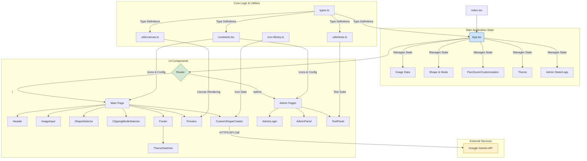

# Software Requirements Specification
## for ClipAI
### Version 2.0
### Prepared by: World-Class Senior Frontend Engineer

---

### Table of Contents
1. [Introduction](#1-introduction)
    1.1. [Purpose](#11-purpose)
    1.2. [Document Conventions](#12-document-conventions)
    1.3. [Intended Audience and Reading Suggestions](#13-intended-audience-and-reading-suggestions)
    1.4. [Product Scope](#14-product-scope)
    1.5. [References](#15-references)
2. [Overall Description](#2-overall-description)
    2.1. [Product Perspective](#21-product-perspective)
    2.2. [Product Functions](#22-product-functions)
    2.3. [User Classes and Characteristics](#23-user-classes-and-characteristics)
    2.4. [Operating Environment](#24-operating-environment)
    2.5. [Design and Implementation Constraints](#25-design-and-implementation-constraints)
    2.6. [User Documentation](#26-user-documentation)
    2.7. [Assumptions and Dependencies](#27-assumptions-and-dependencies)
3. [System Architecture](#3-system-architecture)
    3.1. [System Architecture Diagram](#31-system-architecture-diagram)
    3.2. [Data Flow & State Management Diagram](#32-data-flow--state-management-diagram)
4. [System Features](#4-system-features)
    4.1. [Image Input](#41-image-input)
    4.2. [Shape Selection](#42-shape-selection)
    4.3. [Custom Shape Creation](#43-custom-shape-creation)
    4.4. [Clipping Mode](#44-clipping-mode)
    4.5. [Canvas Interaction](#45-canvas-interaction)
    4.6. [Image Download](#46-image-download)
    4.7. [Administration](#47-administration)
    4.8. [Theming](#48-theming)
    4.9. [Self-Testing](#49-self-testing)
5. [External Interface Requirements](#5-external-interface-requirements)
    5.1. [User Interfaces](#51-user-interfaces)
    5.2. [Hardware Interfaces](#52-hardware-interfaces)
    5.3. [Software Interfaces](#53-software-interfaces)
    5.4. [Communications Interfaces](#54-communications-interfaces)
6. [Non-functional Requirements](#6-non-functional-requirements)
    6.1. [Performance Requirements](#61-performance-requirements)
    6.2. [Security Requirements](#62-security-requirements)
    6.3. [Accessibility Requirements](#63-accessibility-requirements)
    6.4. [Software Quality Attributes](#64-software-quality-attributes)

---

### 1. Introduction

#### 1.1. Purpose
This Software Requirements Specification (SRS) document describes the functional and non-functional requirements for the ClipAI application, version 2.0. This version includes significant enhancements in security, accessibility, testing, and documentation. The purpose is to provide a complete specification for all stakeholders.

#### 1.2. Document Conventions
This document uses standard Markdown formatting.

#### 1.3. Intended Audience and Reading Suggestions
This document is intended for project managers, developers, testers, and designers. A basic understanding of web application concepts is assumed.

#### 1.4. Product Scope
ClipAI is a web-based application that allows users to clip images into various shapes. Users can adjust the image (pan/zoom), customize output ('fill'/'outline' mode), and download the result. This version introduces an admin panel, theming (light/dark/high-contrast), and an in-app self-testing framework.

#### 1.5. References
- IEEE Std 830-1998, Recommended Practice for Software Requirements Specifications.
- Google Gemini API Documentation.
- Web Content Accessibility Guidelines (WCAG) 2.1.

### 2. Overall Description

#### 2.1. Product Perspective
ClipAI is a self-contained, client-side React application. It operates entirely in the browser, using `localStorage` for state persistence and the Google Gemini API for AI features. Version 2.0 refactors the codebase into a modular, component-based architecture.

#### 2.2. Product Functions
The major functions of ClipAI are:
-   **Image Loading & Clipping:** Core functionality remains the same.
-   **Custom Shape Creation:** Core functionality remains the same.
-   **Administration:** A password-protected admin section provides access to audit logs and the testing panel.
-   **Theming:** Users can switch between Light, Dark, and High-Contrast themes.
-   **Self-Testing:** An interactive panel allows administrators to run an end-to-end test suite within the application.

#### 2.3. User Classes and Characteristics
-   **General User:** A designer, content creator, or casual user. No special technical skills are required.
-   **Administrator:** A privileged user who can access the admin panel to monitor actions and run tests. Requires a password.

#### 2.4. Operating Environment
The application runs in modern web browsers (Chrome, Firefox, Safari, Edge) on desktop operating systems.

#### 2.5. Design and Implementation Constraints
-   The application is built with React, TypeScript, and Tailwind CSS.
-   The Gemini API key must be managed as an environment variable (`process.env.API_KEY`).
-   The codebase is structured into single-responsibility components.

#### 2.6. User Documentation
-   Tooltips are provided for all interactive UI elements.
-   A full set of documentation (Admin, Deployment, Testing guides) is provided in the `/docs` directory.

#### 2.7. Assumptions and Dependencies
-   The user's browser supports modern JavaScript (ES6+), HTML5 Canvas, and Local Storage.
-   An internet connection is required for the AI shape generation feature.

### 3. System Architecture

#### 3.1. System Architecture Diagram
The following diagram illustrates the high-level component architecture of the ClipAI application.



#### 3.2. Data Flow & State Management Diagram
As a client-side application, ClipAI uses React state and browser `localStorage` for data management.

```mermaid
graph LR
    subgraph "User Interaction"
        UI1[UI Components]
    end

    subgraph "State Management (In-Memory)"
        SM[App.tsx State]
        SM -- Props & Callbacks --> UI1
        UI1 -- User Events --> SM
    end

    subgraph "Browser Storage"
        LS[localStorage]
        SM -- Persist/Hydrate --> LS
    end

    subgraph "External API"
        API[Gemini API]
    end

    SM -- Read State --> R[Canvas Rendering];
    SM -- API Call --> API;
    API -- SVG Path --> SM;

    LS -- Stores --> T[Theme Preference];
    LS -- Stores --> L[Audit Logs (Session)];

    style SM fill:#cde4ff,stroke:#6a8ebf,stroke-width:2px
    style LS fill:#dae8fc,stroke:#6c8ebf,stroke-width:2px
    style API fill:#fff2cc,stroke:#d6b656,stroke-width:2px
```

### 4. System Features

#### 4.1. Image Input
-   **Description:** Allows the user to provide an image. High priority.
-   **Requirements:** REQ-1 to REQ-3 (Unchanged).

#### 4.2. Shape Selection
-   **Description:** Allows the user to select a predefined shape. High priority.
-   **Requirements:** REQ-4, REQ-5 (Unchanged).

#### 4.3. Custom Shape Creation
-   **Description:** Allows the user to create a custom shape. High priority.
-   **Requirements:** REQ-6 to REQ-11 (Unchanged).

#### 4.4. Clipping Mode
-   **Description:** Allows the user to define the clipping style. High priority.
-   **Requirements:** REQ-12 to REQ-17 (Unchanged).

#### 4.5. Canvas Interaction
-   **Description:** Allows manipulation of the image within the shape. High priority.
-   **Requirements:** REQ-18 to REQ-20 (Unchanged).

#### 4.6. Image Download
-   **Description:** Allows the user to save their creation. High priority.
-   **Requirements:** REQ-21 to REQ-23 (Unchanged).

#### 4.7. Administration
-   **Description:** Provides a secure area for administrative tasks. Medium priority.
-   **Requirements:**
    -   REQ-24: The system shall provide a hidden admin section, accessible via a link in the footer.
    -   REQ-25: The admin section shall be protected by a password.
    -   REQ-26: The system shall log all administrative actions (login, logout, tasks) with a timestamp.
    -   REQ-27: The audit log shall be displayed within the admin panel.

#### 4.8. Theming
-   **Description:** Allows users to change the visual theme of the application. High priority.
-   **Requirements:**
    -   REQ-28: The system shall provide at least three themes: Light, Dark, and High-Contrast.
    -   REQ-29: The user's selected theme shall be persisted across sessions using `localStorage`.

#### 4.9. Self-Testing
-   **Description:** Provides an in-app framework for running automated end-to-end tests. Medium priority.
-   **Requirements:**
    -   REQ-30: The testing panel shall be accessible to authenticated administrators.
    -   REQ-31: The system shall provide a button to run a suite of predefined tests.
    -   REQ-32: The system shall display real-time results for each test, including status (pass/fail/skipped), duration, and messages.
    -   REQ-33: The system shall capture and display a screenshot of the canvas for visual verification of test steps.

### 5. External Interface Requirements

#### 5.1. User Interfaces
The UI is a responsive single-page application, now with distinct views for the main tool, admin login, admin panel, and testing panel.

#### 5.2. Hardware Interfaces
No specific hardware interfaces are required.

#### 5.3. Software Interfaces
The application interfaces with the Google Gemini API via HTTPS.

#### 5.4. Communications Interfaces
Standard HTTPS protocol is used.

### 6. Non-functional Requirements

#### 6.1. Performance Requirements
-   UI interactions should feel instantaneous (<100ms response).
-   AI shape generation should complete within 10 seconds under a stable connection.

#### 6.2. Security Requirements
-   All external communication must use HTTPS.
-   The admin password, while hardcoded in this version, is not stored in plain text in any user-accessible location.

#### 6.3. Accessibility Requirements
-   REQ-34: The application shall be keyboard navigable.
-   REQ-35: All interactive elements shall have appropriate ARIA roles and labels.
-   REQ-36: The application shall provide sufficient color contrast in all themes, especially the High-Contrast theme, to meet WCAG AA standards.

#### 6.4. Software Quality Attributes
-   **Usability:** The interface is intuitive, aided by tooltips and a clear, multi-step workflow.
-   **Reliability:** The application handles errors gracefully. The self-test suite ensures core features remain stable.
-   **Maintainability:** The code is refactored into modular, single-responsibility components, improving readability and ease of future development.
