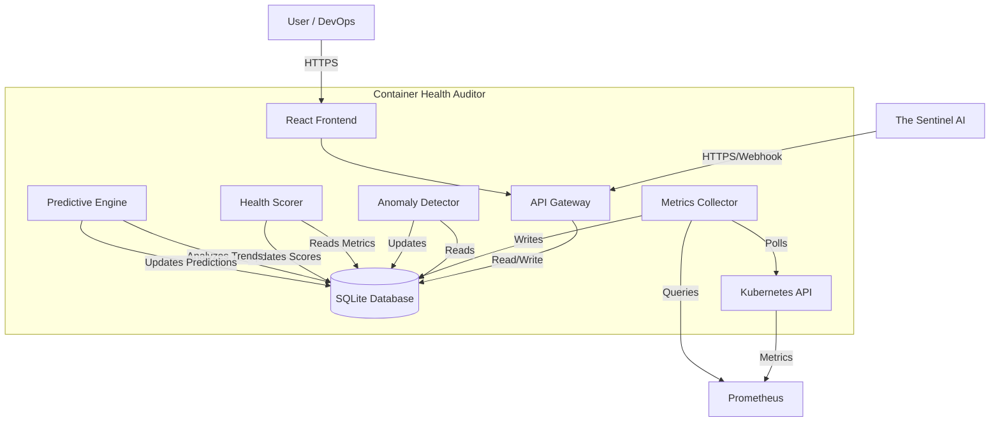
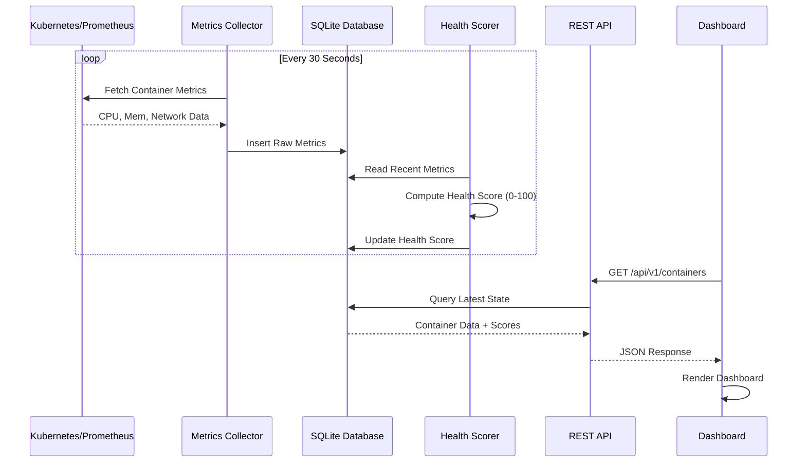
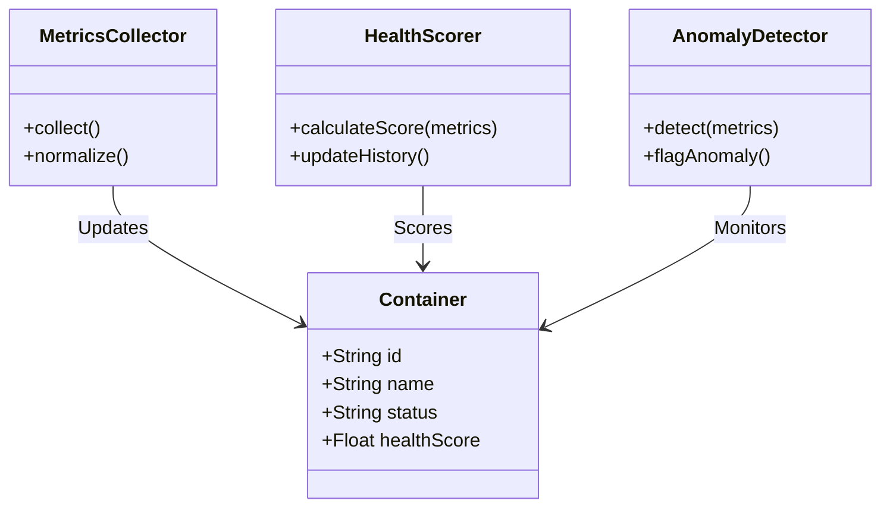

# System Architecture - Container Health Auditor (App ID 110)

## High-Level Architecture

```mermaid
graph TD
    User[User / DevOps] -->|HTTPS| Frontend[React Frontend]
    Sentinel[The Sentinel AI] -->|HTTPS/Webhook| API[API Gateway]
    
    subgraph "Container Health Auditor"
        Frontend --> API
        API -->|Read/Write| DB[(SQLite Database)]
        
        MetricsCollector[Metrics Collector] -->|Polls| K8s[Kubernetes API]
        MetricsCollector -->|Writes| DB
        
        AnomalyDetector[Anomaly Detector] -->|Reads| DB
        AnomalyDetector -->|Updates| DB
        
        HealthScorer[Health Scorer] -->|Reads Metrics| DB
        HealthScorer -->|Updates Scores| DB
        
        PredictiveEngine[Predictive Engine] -->|Analyzes Trends| DB
        PredictiveEngine -->|Updates Predictions| DB
    end
    
    K8s -->|Metrics| Prometheus[Prometheus]
    MetricsCollector -->|Queries| Prometheus
```

## Data Flow

```mermaid
sequenceDiagram
    participant K8s as Kubernetes/Prometheus
    participant Collector as Metrics Collector
    participant DB as SQLite Database
    participant Scorer as Health Scorer
    participant API as REST API
    participant UI as Dashboard

    loop Every 30 Seconds
        Collector->>K8s: Fetch Container Metrics
        K8s-->>Collector: CPU, Mem, Network Data
        Collector->>DB: Insert Raw Metrics
        
        Scorer->>DB: Read Recent Metrics
        Scorer->>Scorer: Compute Health Score (0-100)
        Scorer->>DB: Update Health Score
    end

    UI->>API: GET /api/v1/containers
    API->>DB: Query Latest State
    DB-->>API: Container Data + Scores
    API-->>UI: JSON Response
    UI->>UI: Render Dashboard
```

## Component Interaction

```mermaid
classDiagram
    class Container {
        +String id
        +String name
        +String status
        +Float healthScore
    }
    
    class MetricsCollector {
        +collect()
        +normalize()
    }
    
    class HealthScorer {
        +calculateScore(metrics)
        +updateHistory()
    }
    
    class AnomalyDetector {
        +detect(metrics)
        +flagAnomaly()
    }
    
    MetricsCollector --> Container : Updates
    HealthScorer --> Container : Scores
    AnomalyDetector --> Container : Monitors
```
