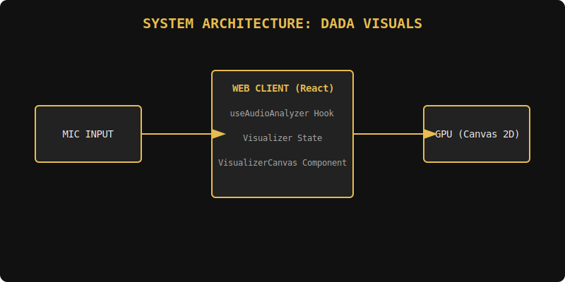
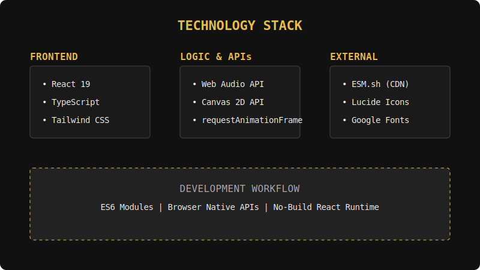
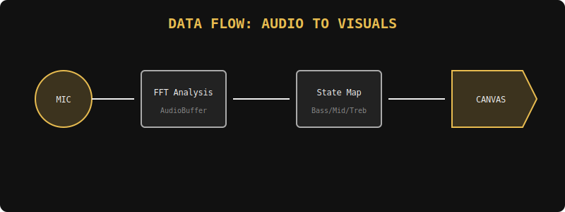
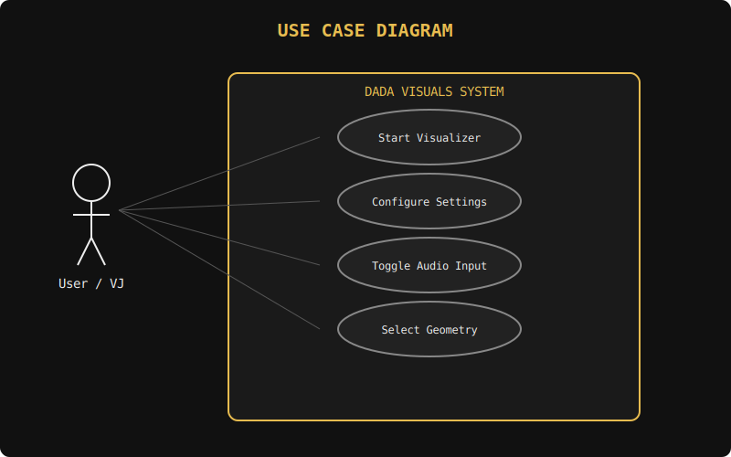
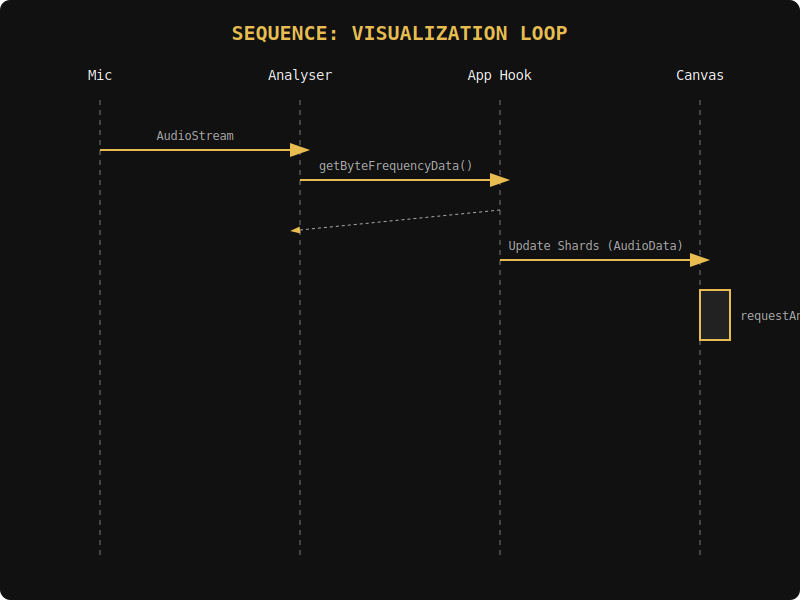

# Software Requirements Specification (SRS) - Dadaist Concert Visualizer

## 1. Introduction
The **Dadaist Concert Visualizer** (DADA VISUALS) is a real-time, browser-based performance tool designed for concert video walls. It takes live microphone input and generates complex, sound-reactive animations inspired by Dadaist collage and geometric abstraction.

## 2. System Architecture
The system follows a reactive data-driven architecture.

- **Audio Layer:** Utilizes the Web Audio API to capture raw microphone input and process it into frequency bands (Bass, Mid, Treble) and overall Volume.
- **Logic Layer:** A custom React hook (`useAudioAnalyzer`) manages the state of audio data at 60fps.
- **Rendering Layer:** The `VisualizerCanvas` component uses the HTML5 Canvas 2D API to render high-performance animations with GPU acceleration.

## 3. Technology Stack
Our stack is chosen for maximum performance and compatibility without a heavy build step.

## 4. Functional Requirements
### 4.1 Audio Reactivity
- **Data Flow:**

- The system MUST map Bass frequencies to the "pulse" and "organic morphing" of shards.
- The system MUST map Treble frequencies to high-intensity "glitch" artifacts and particle emission.

### 4.2 Interactive Controls
- **Use Cases:**

- Users can toggle microphone access.
- Users can adjust sensitivity to match different acoustic environments.
- Users can select specific geometric shapes or use "Random Chaos" mode.

## 5. Implementation Details
### 5.1 Visualization Loop
The animation loop ensures that every frame is synchronized with the latest audio analysis.

## 6. Visual Design & Aesthetics
- **Dadaist Influence:** Use of disjointed geometric shapes, high-contrast palettes, and unexpected "glitch" artifacts.
- **Central Iconography:** A dynamic, wandering central eye that reacts to the music's volume and stress levels.
- **Particle Systems:** Real-time trails that follow shards, influenced by rotation and audio frequencies.

## 7. Performance & Security
- **Efficiency:** Optimized for 60FPS on modern browsers using `requestAnimationFrame`.
- **Security:** Microphone permissions are requested via standard browser prompts. No audio data is ever transmitted or stored; processing is strictly client-side.
