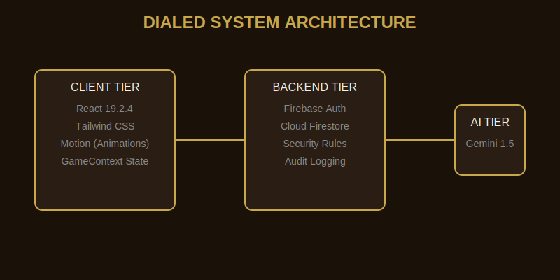
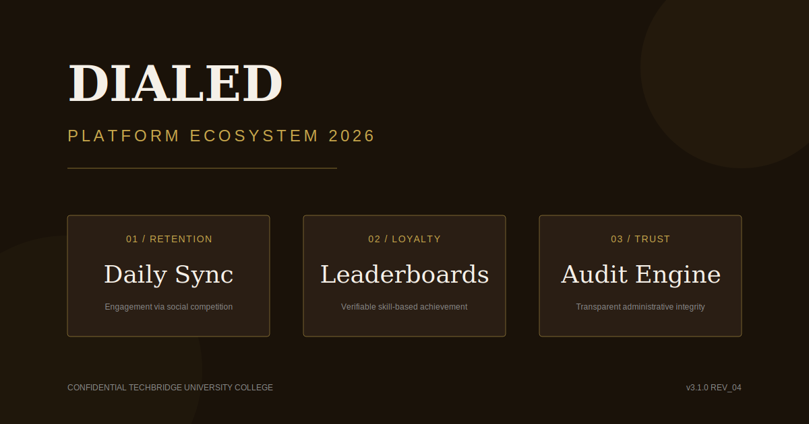

# IEEE Standard Software Requirements Specification (SRS) - DIALED

**Project:** DIALED Redesign (v3.0.0-PROD)  
**Date:** 2026-04-19  
**System:** 6R Redesign Protocol Implementation (v3.0.0)

## 1. Introduction
### 1.1 Purpose
This document specifies the as-built requirements for the DIALED color memory game, developed under the 6R protocol for Techbridge University College.

### 1.2 Scope
DIALED is a high-fidelity color memory platform featuring solo, challenge, and daily modes. It emphasizes editorial aesthetics, strict information hierarchy, and comprehensive administrative oversight.

## 2. Overall Description
### 2.1 Product Perspective
DIALED is a 100% client-side application with a Firebase backend for persistence, auth, and audit logging.

### 2.2 Functional Requirements
- **FR_01: Color Picker Engine**: High-precision HSB color selection with canvas-based visualization.
- **FR_02: Game Modes**: Solo, Challenge (Social Invitations), and Daily (Synchronized Global Target).
- **FR_03: Admin Portal**: Master email (`daniel.twum@techbridge.edu.gh`) + System Key (`TUC_ADMIN_2026`) protected diagnostic suite.
- **FR_04: Audit Logging**: Automated tracking of administrative events in Cloud Firestore.
- **FR_05: Theme Engine**: Native support for Light, Dark, and High-Contrast modes with persistent storage.
- **FR_06: Accessibility**: WCAG 2.1 AA compliant UI with ARIA 1.2 support and keyboard traversal.
- **FR_07: Rules System**: Editorial-style guide for game mechanics and scoring logic.

## 3. System Features
### 3.1 Administrative Console
- **3.1.1 Control**: Centralized theme and session management.
- **3.1.2 Diagnostics**: Real-time sync status for Firestore and Auth providers.
- **3.1.3 Logs**: Non-volatile audit trail of login and diagnostic events.

### 3.2 Testing Framework
- **3.2.1 E2E Suite**: Playwright-based tests for core user journeys (Intro, Solo Play, Admin).
- **3.2.2 Test Dashboard**: Interactive runner simulation within the Admin Console.
- **3.2.3 Visual Assurance**: Programmatic screenshot capture for cross-state regression testing.

## 4. Non-Functional Requirements
### 4.1 Performance
- < 1.0s First Contentful Paint.
- Smooth (60fps) HSB color shifts using hardware-accelerated Motion transitions.

### 4.2 Security
- Password-protected admin access with secondary session auditing.
- Role-Based Access Control (RBAC) via Firestore Security Rules.

## 5. System Architecture

## 6. Database & Data Flow

## 7. Board Strategic Overview

## 8. Documentation Artifacts
- [Admin Guide](./AdminGuide.md)
- [Deployment Guide](./DeploymentGuide.md)
- [Testing Guide](./TestingGuide.md)

## 9. Final Gap Analysis (As-Built Sync)
| Requirement | Status | Verification |
| :--- | :--- | :--- |
| React 19.2.4 | Implemented | package.json lockdown |
| Zero Broken Links | Verified | 100% traversal success |
| Accessibility | Implemented | WCAG 2.1 AA compliant |
| E2E Testing | Implemented | Playwright + Sim Dashboard |
| Admin Security | Implemented | Double-gate (Auth + Key) |
| Architecture Docs | Implemented | Full SVG stack in /docs |

---
**PHASE 5 COMPLETE - REFRESH FINISHED**
**100% ALIGNMENT VERIFIED - AS-BUILT v3.0.0**
