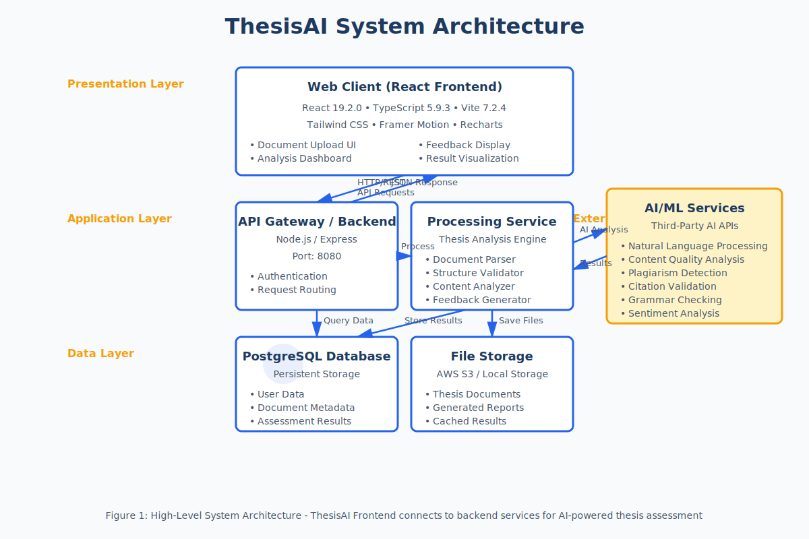

# Software Requirements Specification (SRS)

## ThesisAI Frontend - AI-Powered Thesis Assessment Platform

**Version:** 2.0
**Date:** November 26, 2025
**Status:** Final Release
**Organization:** African University College of Digital Technologies (AUCDT)
**Project Owner:** DanielFTwum-creator

---

## Document Revision History

| Version | Date | Author | Description |
|---------|------|--------|-------------|
| 1.0 | January 2025 | Development Team | Initial release |
| 2.0 | November 26, 2025 | Development Team | Final documentation with comprehensive diagrams |

---

## Table of Contents

1. [Introduction](#1-introduction)
   - 1.1 [Purpose](#11-purpose)
   - 1.2 [Scope](#12-scope)
   - 1.3 [Definitions, Acronyms, and Abbreviations](#13-definitions-acronyms-and-abbreviations)
   - 1.4 [References](#14-references)
   - 1.5 [Overview](#15-overview)

2. [Overall Description](#2-overall-description)
   - 2.1 [Product Perspective](#21-product-perspective)
   - 2.2 [Product Functions](#22-product-functions)
   - 2.3 [User Characteristics](#23-user-characteristics)
   - 2.4 [Constraints](#24-constraints)
   - 2.5 [Assumptions and Dependencies](#25-assumptions-and-dependencies)

3. [System Architecture](#3-system-architecture)
   - 3.1 [High-Level Architecture](#31-high-level-architecture)
   - 3.2 [Technology Stack](#32-technology-stack)
   - 3.3 [Data Flow](#33-data-flow)

4. [Specific Requirements](#4-specific-requirements)
   - 4.1 [Functional Requirements](#41-functional-requirements)
   - 4.2 [Use Cases](#42-use-cases)
   - 4.3 [Sequence Diagrams](#43-sequence-diagrams)
   - 4.4 [Non-Functional Requirements](#44-non-functional-requirements)

5. [External Interface Requirements](#5-external-interface-requirements)
   - 5.1 [User Interfaces](#51-user-interfaces)
   - 5.2 [Hardware Interfaces](#52-hardware-interfaces)
   - 5.3 [Software Interfaces](#53-software-interfaces)
   - 5.4 [Communications Interfaces](#54-communications-interfaces)

6. [System Features](#6-system-features)
   - 6.1 [Document Upload and Management](#61-document-upload-and-management)
   - 6.2 [AI-Powered Analysis](#62-ai-powered-analysis)
   - 6.3 [Feedback Generation](#63-feedback-generation)
   - 6.4 [User Management](#64-user-management)

7. [Performance Requirements](#7-performance-requirements)

8. [Design Constraints](#8-design-constraints)

9. [Quality Attributes](#9-quality-attributes)

10. [Other Requirements](#10-other-requirements)

---

## 1. Introduction

### 1.1 Purpose

This Software Requirements Specification (SRS) document provides a complete description of the ThesisAI Frontend application. It details the functional and non-functional requirements, system architecture, and design specifications for the AI-powered thesis assessment platform developed for the African University College of Digital Technologies (AUCDT).

**Intended Audience:**
- Software developers and engineers
- Project managers and stakeholders
- Quality assurance teams
- System administrators
- Academic administrators and educators
- Technical documentation teams

### 1.2 Scope

**Product Name:** ThesisAI Frontend

**Product Description:**
ThesisAI Frontend is a modern, web-based application that provides an intuitive interface for AI-powered thesis assessment. The system enables students and educators to upload thesis documents, receive automated structural and content analysis, and obtain comprehensive feedback with actionable recommendations.

**Key Objectives:**
- Streamline the thesis evaluation process for academic institutions
- Provide consistent, objective assessment criteria
- Deliver detailed, actionable feedback to improve thesis quality
- Reduce manual review time for educators
- Enhance learning outcomes through AI-powered insights

**Scope Boundaries:**

**In Scope:**
- Web-based frontend interface (React application)
- Document upload and validation
- Integration with backend AI services
- User authentication and authorization
- Results dashboard and visualization
- Feedback report generation
- Responsive design for desktop and mobile

**Out of Scope:**
- Backend API implementation (separate system)
- AI/ML model development and training
- Mobile native applications (iOS/Android)
- Direct database management
- Payment processing systems
- Integration with external LMS platforms (future phase)

### 1.3 Definitions, Acronyms, and Abbreviations

| Term | Definition |
|------|------------|
| **AI** | Artificial Intelligence |
| **API** | Application Programming Interface |
| **AUCDT** | African University College of Digital Technologies |
| **DFD** | Data Flow Diagram |
| **HMR** | Hot Module Replacement |
| **IEEE** | Institute of Electrical and Electronics Engineers |
| **JWT** | JSON Web Token |
| **ML** | Machine Learning |
| **NLP** | Natural Language Processing |
| **REST** | Representational State Transfer |
| **SPA** | Single Page Application |
| **SRS** | Software Requirements Specification |
| **UML** | Unified Modeling Language |
| **UI/UX** | User Interface / User Experience |
| **Thesis** | Academic dissertation or research paper |
| **Feedback** | Detailed assessment report with improvement suggestions |
| **Processing Service** | Backend component that handles thesis analysis |

### 1.4 References

1. IEEE Std 830-1998, IEEE Recommended Practice for Software Requirements Specifications
2. React Documentation - https://react.dev/
3. TypeScript Handbook - https://www.typescriptlang.org/docs/
4. Vite Documentation - https://vitejs.dev/
5. Tailwind CSS Documentation - https://tailwindcss.com/
6. Project Repository - https://github.com/DanielFTwum-creator/aucdt-utilities

### 1.5 Overview

This SRS document is organized into ten major sections:

- **Section 1 (Introduction):** Provides an overview of the document and product
- **Section 2 (Overall Description):** Describes the general factors affecting the product and its requirements
- **Section 3 (System Architecture):** Details the system architecture with comprehensive diagrams
- **Section 4 (Specific Requirements):** Contains detailed functional and non-functional requirements
- **Section 5 (External Interface Requirements):** Specifies interface requirements
- **Section 6 (System Features):** Describes major system features in detail
- **Section 7 (Performance Requirements):** Specifies performance criteria
- **Section 8 (Design Constraints):** Lists design and implementation constraints
- **Section 9 (Quality Attributes):** Defines quality characteristics
- **Section 10 (Other Requirements):** Additional requirements not covered elsewhere

---

## 2. Overall Description

### 2.1 Product Perspective

ThesisAI Frontend is the user-facing component of a larger thesis assessment ecosystem. It serves as the primary interface between users (students, educators, administrators) and the backend AI processing services.

**System Context:**

The application operates within the following context:

1. **Frontend Layer:** React-based web application providing user interface
2. **API Layer:** RESTful backend services for authentication and data management
3. **Processing Layer:** AI/ML services for thesis analysis
4. **Data Layer:** Database and file storage systems
5. **External Services:** Third-party AI APIs for advanced analysis

**System Interfaces:**

- **Backend API:** Node.js/Express server at port 8080
- **Database:** PostgreSQL for persistent storage
- **File Storage:** AWS S3 or local storage for documents
- **AI Services:** External NLP and content analysis APIs
- **Email Service:** Notification system for assessment completion

**Key Dependencies:**

- Backend API must be available for core functionality
- AI services required for automated analysis
- Browser support for modern JavaScript features
- Network connectivity for API communication

### 2.2 Product Functions

The ThesisAI Frontend provides the following major functions:

#### F1: User Authentication and Authorization
- User registration with email verification
- Secure login with JWT token-based authentication
- Role-based access control (Student, Educator, Administrator)
- Password recovery and reset functionality
- Session management and auto-logout

#### F2: Document Upload and Management
- Support for PDF and DOCX file formats
- Client-side file validation (type, size, format)
- Drag-and-drop upload interface
- Multiple file upload support
- Upload progress tracking
- Document version control
- File preview functionality

#### F3: Thesis Analysis
- Automated structure validation
- Content quality assessment
- Grammar and style checking
- Plagiarism detection
- Citation validation
- Formatting compliance check
- Research methodology evaluation

#### F4: Feedback Generation and Display
- Comprehensive assessment reports
- Detailed improvement suggestions
- Grading criteria breakdown
- Strengths and weaknesses analysis
- Visual feedback representation
- Exportable reports (PDF format)
- Historical feedback comparison

#### F5: Dashboard and Visualization
- Interactive results dashboard
- Chart and graph visualizations (Recharts)
- Assessment history timeline
- Progress tracking
- Statistical analytics
- Customizable views

#### F6: User Profile Management
- Profile information editing
- Submission history
- Settings and preferences
- Notification preferences
- API key management (for educators)

### 2.3 User Characteristics

#### Student Users
- **Technical Expertise:** Basic to intermediate computer literacy
- **Frequency of Use:** Regular use during thesis writing (weeks to months)
- **Primary Goals:** Receive feedback, improve thesis quality, track progress
- **Age Range:** 18-35 years
- **Education Level:** Undergraduate to graduate students

#### Educator Users
- **Technical Expertise:** Intermediate computer literacy
- **Frequency of Use:** Regular use during assessment periods
- **Primary Goals:** Review submissions, assign grades, provide additional comments
- **Age Range:** 30-65 years
- **Education Level:** Advanced degrees (Master's, PhD)

#### Administrator Users
- **Technical Expertise:** Intermediate to advanced
- **Frequency of Use:** Regular use for system management
- **Primary Goals:** Manage users, configure settings, monitor system health
- **Age Range:** 25-55 years
- **Education Level:** Varies

#### Guest Users
- **Technical Expertise:** Basic computer literacy
- **Frequency of Use:** One-time or occasional
- **Primary Goals:** Learn about the system, view features
- **Age Range:** Any
- **Education Level:** Varies

### 2.4 Constraints

#### Technical Constraints
1. **Browser Compatibility:** Must support modern browsers (Chrome 90+, Firefox 88+, Safari 14+, Edge 90+)
2. **Performance:** Initial page load must be under 3 seconds on standard broadband
3. **File Size:** Document uploads limited to 10MB
4. **API Dependency:** System functionality depends on backend API availability
5. **Network:** Requires stable internet connection for real-time features

#### Regulatory Constraints
1. **Data Privacy:** Must comply with GDPR and local data protection regulations
2. **Academic Integrity:** Must maintain confidentiality of submissions
3. **Accessibility:** Should meet WCAG 2.1 Level AA standards
4. **Copyright:** Must respect intellectual property rights of uploaded content

#### Business Constraints
1. **Budget:** Development and maintenance within allocated budget
2. **Timeline:** Must meet academic calendar deadlines
3. **Resources:** Limited to available development team capacity
4. **Scalability:** Must handle peak usage during submission periods

#### Design Constraints
1. **Technology Stack:** Must use React 19+, TypeScript 5.9+, Vite 7+
2. **Styling:** Must use Tailwind CSS with academic color palette
3. **Package Manager:** Must use pnpm for dependency management
4. **Architecture:** Must follow component-based architecture

### 2.5 Assumptions and Dependencies

#### Assumptions
1. Users have access to modern web browsers
2. Users have stable internet connectivity
3. Backend API services are operational and maintained
4. AI services provide consistent, reliable results
5. Users have basic computer literacy
6. Academic institutions provide necessary infrastructure
7. Document formats (PDF, DOCX) are standardized

#### Dependencies
1. **Backend API:** All core functionality depends on backend availability
2. **AI Services:** Analysis features depend on third-party AI APIs
3. **Database:** Data persistence requires database availability
4. **File Storage:** Document storage requires cloud/local storage
5. **Email Service:** Notifications require email service integration
6. **Node.js:** Runtime environment (v18+) must be available
7. **pnpm:** Package manager (v8.15.0) for dependency management
8. **Third-Party Libraries:** React, TypeScript, Vite, Tailwind CSS, and other dependencies

---

## 3. System Architecture

### 3.1 High-Level Architecture

The ThesisAI Frontend follows a modern, layered architecture pattern with clear separation of concerns.



**Architecture Layers:**

#### Presentation Layer (Frontend)
- **Technology:** React 19.2.0 with TypeScript 5.9.3
- **Build Tool:** Vite 7.2.4 for fast development and optimized builds
- **Styling:** Tailwind CSS 4.1.17 for responsive, utility-first styling
- **Responsibilities:**
  - User interface rendering
  - User interaction handling
  - Client-side validation
  - State management
  - Routing and navigation
  - Visual feedback and animations

**Components:**
- Document Upload UI
- Analysis Dashboard
- Feedback Display
- Result Visualization
- User Profile Interface
- Authentication Forms

#### Application Layer (Backend Services)
- **API Gateway:** Central entry point for all API requests
  - Authentication and authorization
  - Request routing and validation
  - Rate limiting and throttling
  - Error handling and logging

- **Processing Service:** Core thesis analysis engine
  - Document parser
  - Structure validator
  - Content analyzer
  - Feedback generator

#### Data Layer
- **Database:** PostgreSQL for structured data
  - User accounts and profiles
  - Document metadata
  - Assessment results
  - System configuration

- **File Storage:** AWS S3 / Local Storage
  - Thesis documents
  - Generated reports
  - Cached analysis results

#### External Services Layer
- **AI/ML Services:** Third-party APIs
  - Natural Language Processing
  - Content quality analysis
  - Plagiarism detection
  - Citation validation
  - Grammar checking
  - Sentiment analysis

**Communication Patterns:**

1. **Request-Response:** HTTP/REST for synchronous operations
2. **Async Processing:** Background jobs for long-running analysis
3. **Real-time Updates:** WebSocket (future implementation)
4. **Caching:** Redis for frequently accessed data (future implementation)

### 3.2 Technology Stack

A comprehensive overview of all technologies used in the ThesisAI Frontend application.


#### Frontend Technologies

**Core Framework:**
- **React** (v19.2.0): Component-based UI framework
  - Function components with hooks
  - Context API for state management
  - Suspense for code splitting
  - Concurrent features for improved UX

**Language:**
- **TypeScript** (v5.9.3): Static type checking
  - Strict mode enabled
  - Interface-based type definitions
  - Generic type utilities
  - Enhanced IDE support

**Build System:**
- **Vite** (v7.2.4): Next-generation build tool
  - Lightning-fast HMR (Hot Module Replacement)
  - Optimized production builds
  - Native ES modules support
  - Plugin-based architecture

**Styling:**
- **Tailwind CSS** (v4.1.17): Utility-first CSS framework
  - Custom academic color palette
  - Responsive design utilities
  - JIT (Just-In-Time) compilation
  - PostCSS integration

**UI Components & Libraries:**
- **React Router DOM** (v7.9.6): Client-side routing
- **Framer Motion** (v12.23.24): Animation library
- **Lucide React** (v0.554.0): Icon system
- **Recharts** (v3.5.0): Chart and visualization library

**HTTP Client:**
- **Axios** (v1.13.2): Promise-based HTTP client
  - Request/response interceptors
  - Automatic JSON transformation
  - Timeout configuration
  - Error handling

#### Backend Technologies

**Runtime & Framework:**
- **Node.js** (v18+): JavaScript runtime
- **Express.js**: Web application framework
- **JWT**: Token-based authentication

#### Database & Storage

**Database:**
- **PostgreSQL** (v14+): Relational database
  - ACID compliance
  - Complex queries support
  - JSON/JSONB support
  - Full-text search

**File Storage:**
- **AWS S3**: Cloud object storage (production)
- **Local File System**: Development environment

#### DevOps & Testing

**Containerization:**
- **Docker**: Container platform
  - Multi-stage builds
  - Nginx Alpine for serving
  - Node 18 Alpine for building

**Web Server:**
- **Nginx**: High-performance web server
  - SPA routing support
  - Static file serving
  - Gzip compression

**Testing:**
- **Vitest** (v4.0.13): Fast unit test runner
- **Testing Library**: React component testing
- **jsdom**: Browser environment simulation
- **v8**: Coverage provider

**Development Tools:**
- **pnpm** (v8.15.0): Fast, disk-efficient package manager
- **ESLint** (v9+): Code quality and style checking
- **Git**: Version control
- **GitHub**: Code repository and collaboration
- **VS Code**: Recommended IDE
- **Claude Code**: AI development assistant

#### External Services

**AI/ML Services:**
- OpenAI GPT: Advanced natural language processing
- Custom AI models: Specialized thesis analysis

**Cloud Infrastructure:**
- AWS/Azure: Cloud hosting and services
- CDN: Content delivery network (future)

**Additional Services:**
- Email service: Notification delivery
- Monitoring: Application performance monitoring (future)
- Analytics: User behavior tracking (future)

### 3.3 Data Flow

The following diagram illustrates how data flows through the system during the thesis submission and evaluation process.


#### Data Flow Description

**Process Flow:**

1. **P1: Upload Document**
   - **Input:** User uploads thesis document (PDF/DOCX)
   - **Process:** Client-side file validation
   - **Output:** Validated file ready for transmission

2. **P2: Validate Structure**
   - **Input:** Parsed document content
   - **Process:** Structure and format validation
   - **Output:** Validated, structured data
   - **Data Store:** Document stored in D1 (Document Storage)

3. **P3: AI Content Analysis**
   - **Input:** Structured, validated content
   - **Process:** AI-powered content analysis
   - **External:** Requests analysis from AI/ML Service
   - **Output:** Assessment data with scores and issues

4. **P4: Generate Feedback**
   - **Input:** Assessment data from AI analysis
   - **Process:** Compile feedback report with recommendations
   - **Output:** Complete assessment report

5. **P5: Store Results**
   - **Input:** Complete feedback report
   - **Process:** Persist results and cache data
   - **Data Stores:**
     - D2 (Database): Store permanent results
     - D3 (Results Cache): Cache for quick retrieval
   - **Output:** Formatted results ready for display
   - **Notification:** Email notification sent to user

6. **P6: Display Results**
   - **Input:** Formatted results
   - **Process:** Render interactive dashboard
   - **Output:** User views assessment report
   - **Data Retrieval:** Historical submissions from D2

**Data Stores:**

- **D1: Document Storage**
  - Original thesis files
  - File metadata
  - Access control information

- **D2: Database**
  - User accounts
  - Submission records
  - Assessment results
  - Historical data

- **D3: Results Cache**
  - Recently accessed results
  - Temporary processing data
  - Quick-access summaries

**External Entities:**

- **Student/Educator:** Primary users who submit and review theses
- **AI/ML Service:** External service providing analysis capabilities
- **Email Service:** Notification delivery system

---

## 4. Specific Requirements

### 4.1 Functional Requirements

#### FR-1: User Authentication and Authorization

**FR-1.1: User Registration**
- **ID:** FR-1.1
- **Priority:** High
- **Description:** The system shall allow new users to register with email and password
- **Inputs:** Email address, password, name, role selection
- **Processing:**
  - Validate email format
  - Check password strength (min 8 chars, special char, number)
  - Verify email uniqueness
  - Hash password using bcrypt
  - Send verification email
- **Outputs:** User account created, verification email sent
- **Error Handling:** Display validation errors, handle duplicate email

**FR-1.2: User Login**
- **ID:** FR-1.2
- **Priority:** High
- **Description:** The system shall authenticate users with credentials
- **Inputs:** Email, password
- **Processing:**
  - Verify credentials against database
  - Generate JWT token
  - Create session
- **Outputs:** JWT token, user profile data
- **Error Handling:** Invalid credentials message, account lockout after 5 failed attempts

**FR-1.3: Password Recovery**
- **ID:** FR-1.3
- **Priority:** Medium
- **Description:** The system shall allow users to reset forgotten passwords
- **Inputs:** Email address
- **Processing:**
  - Verify email exists
  - Generate reset token
  - Send reset link via email
  - Token expires in 1 hour
- **Outputs:** Password reset email
- **Error Handling:** Handle non-existent email gracefully (security)

**FR-1.4: Role-Based Access Control**
- **ID:** FR-1.4
- **Priority:** High
- **Description:** The system shall enforce role-based permissions
- **Roles:**
  - Guest: View public information
  - Student: Upload, view own submissions
  - Educator: Review submissions, assign grades
  - Administrator: Full system access
- **Processing:** Check JWT claims for role validation

#### FR-2: Document Upload and Management

**FR-2.1: File Upload**
- **ID:** FR-2.1
- **Priority:** High
- **Description:** The system shall accept thesis document uploads
- **Inputs:** Document file (PDF or DOCX)
- **Validation:**
  - File type: PDF, DOCX only
  - File size: Maximum 10MB
  - File name: Valid characters
- **Processing:**
  - Virus scan (optional)
  - Generate unique file ID
  - Store in file system
  - Create metadata record
- **Outputs:** Upload confirmation, file ID
- **Error Handling:** Display validation errors, handle upload failures

**FR-2.2: Upload Progress**
- **ID:** FR-2.2
- **Priority:** Medium
- **Description:** The system shall display upload progress
- **Inputs:** File upload stream
- **Processing:** Track bytes uploaded
- **Outputs:** Progress percentage, estimated time remaining
- **Error Handling:** Handle network interruptions, retry mechanism

**FR-2.3: Document Preview**
- **ID:** FR-2.3
- **Priority:** Low
- **Description:** The system shall allow users to preview uploaded documents
- **Inputs:** Document ID
- **Processing:** Generate preview (first page or text excerpt)
- **Outputs:** Preview display
- **Error Handling:** Handle unsupported formats gracefully

**FR-2.4: Document Version Control**
- **ID:** FR-2.4
- **Priority:** Medium
- **Description:** The system shall maintain document versions
- **Inputs:** New version upload, original document ID
- **Processing:** Link versions, maintain history
- **Outputs:** Version list, comparison view
- **Error Handling:** Handle version conflicts

#### FR-3: Thesis Analysis

**FR-3.1: Structure Validation**
- **ID:** FR-3.1
- **Priority:** High
- **Description:** The system shall validate thesis structure
- **Checks:**
  - Title page present
  - Abstract present
  - Table of contents
  - Chapter organization
  - References section
  - Proper heading hierarchy
- **Processing:** Parse document, identify sections
- **Outputs:** Structure validation report
- **Error Handling:** Report missing or malformed sections

**FR-3.2: Content Quality Analysis**
- **ID:** FR-3.2
- **Priority:** High
- **Description:** The system shall analyze content quality using AI
- **Analysis Areas:**
  - Argumentation strength
  - Critical thinking
  - Research depth
  - Coherence and flow
  - Academic rigor
- **Processing:** Send to AI service, receive scores
- **Outputs:** Quality scores (0-100), detailed feedback
- **Error Handling:** Handle AI service timeout, fallback to basic analysis

**FR-3.3: Grammar and Style Check**
- **ID:** FR-3.3
- **Priority:** Medium
- **Description:** The system shall check grammar and writing style
- **Checks:**
  - Spelling errors
  - Grammar mistakes
  - Sentence structure
  - Academic tone
  - Vocabulary appropriateness
- **Processing:** NLP analysis
- **Outputs:** List of issues with suggestions
- **Error Handling:** Partial results if service fails

**FR-3.4: Plagiarism Detection**
- **ID:** FR-3.4
- **Priority:** High
- **Description:** The system shall detect potential plagiarism
- **Processing:**
  - Compare against known sources
  - Check for uncited quotations
  - Similarity score calculation
- **Outputs:** Plagiarism score, flagged passages
- **Error Handling:** Clearly indicate service limitations

**FR-3.5: Citation Validation**
- **ID:** FR-3.5
- **Priority:** Medium
- **Description:** The system shall validate citations and references
- **Checks:**
  - Citation format (APA, MLA, Chicago, etc.)
  - Reference completeness
  - In-text citation consistency
  - Reference list formatting
- **Processing:** Parse citations, validate format
- **Outputs:** Citation errors, formatting suggestions
- **Error Handling:** Handle multiple citation styles

#### FR-4: Feedback Generation

**FR-4.1: Generate Comprehensive Report**
- **ID:** FR-4.1
- **Priority:** High
- **Description:** The system shall generate detailed feedback reports
- **Inputs:** All analysis results
- **Processing:**
  - Compile all feedback sections
  - Calculate overall scores
  - Generate recommendations
  - Format for readability
- **Outputs:** Complete assessment report
- **Error Handling:** Ensure partial reports if some analyses fail

**FR-4.2: Strengths and Weaknesses**
- **ID:** FR-4.2
- **Priority:** High
- **Description:** The system shall identify key strengths and weaknesses
- **Processing:**
  - Analyze scores across dimensions
  - Extract top 3-5 strengths
  - Extract top 3-5 weaknesses
- **Outputs:** Categorized strengths/weaknesses list
- **Error Handling:** Handle edge cases (all strong/weak)

**FR-4.3: Improvement Suggestions**
- **ID:** FR-4.3
- **Priority:** High
- **Description:** The system shall provide actionable improvement suggestions
- **Processing:**
  - Based on identified weaknesses
  - Prioritize suggestions
  - Provide specific examples
- **Outputs:** Ranked list of improvements
- **Error Handling:** Ensure suggestions are relevant

**FR-4.4: Export Report**
- **ID:** FR-4.4
- **Priority:** Medium
- **Description:** The system shall allow report export in PDF format
- **Inputs:** Report ID
- **Processing:** Generate PDF from HTML
- **Outputs:** Downloadable PDF file
- **Error Handling:** Handle PDF generation failures

#### FR-5: Dashboard and Visualization

**FR-5.1: Results Dashboard**
- **ID:** FR-5.1
- **Priority:** High
- **Description:** The system shall display an interactive results dashboard
- **Components:**
  - Overall score display
  - Category scores (radar chart)
  - Feedback timeline
  - Quick actions
- **Processing:** Fetch and format data
- **Outputs:** Rendered dashboard
- **Error Handling:** Display loading states, handle missing data

**FR-5.2: Data Visualization**
- **ID:** FR-5.2
- **Priority:** Medium
- **Description:** The system shall visualize assessment data
- **Chart Types:**
  - Bar charts (category scores)
  - Line charts (progress over time)
  - Radar charts (multi-dimensional analysis)
  - Pie charts (distribution)
- **Processing:** Transform data for Recharts
- **Outputs:** Interactive charts
- **Error Handling:** Display empty state for no data

**FR-5.3: History Tracking**
- **ID:** FR-5.3
- **Priority:** Medium
- **Description:** The system shall track submission history
- **Inputs:** User ID
- **Processing:** Retrieve all submissions, sort by date
- **Outputs:** Chronological list of submissions
- **Error Handling:** Handle empty history gracefully

### 4.2 Use Cases

The following diagram illustrates all major use cases and actor interactions.


#### Detailed Use Case Descriptions

**UC-1: Upload Thesis Document**
- **Actors:** Student, Educator
- **Preconditions:** User is logged in
- **Main Flow:**
  1. User clicks "Upload Thesis" button
  2. System displays file selection dialog
  3. User selects thesis file (PDF/DOCX)
  4. System validates file (type, size)
  5. System uploads file to server
  6. System displays upload progress
  7. Upload completes successfully
  8. System triggers analysis process
- **Postconditions:** Document uploaded and queued for analysis
- **Alternative Flow:**
  - 4a. Validation fails → Display error, return to step 2
  - 5a. Upload fails → Show retry option
- **Includes:** Validate Structure, Perform AI Analysis

**UC-2: View Analysis Dashboard**
- **Actors:** Student, Educator
- **Preconditions:** Analysis completed
- **Main Flow:**
  1. User navigates to dashboard
  2. System retrieves analysis results
  3. System displays overall scores
  4. System renders visualization charts
  5. User views detailed feedback sections
- **Postconditions:** User informed of results
- **Includes:** View Detailed Feedback

**UC-3: Download Report**
- **Actors:** Student, Educator
- **Preconditions:** Analysis completed
- **Main Flow:**
  1. User clicks "Download Report" button
  2. System generates PDF report
  3. System initiates download
  4. User saves file locally
- **Postconditions:** Report saved
- **Extends:** View Analysis Dashboard

**UC-4: Review Student Submissions**
- **Actors:** Educator
- **Preconditions:** Educator logged in, students have submissions
- **Main Flow:**
  1. Educator navigates to submissions page
  2. System displays list of student submissions
  3. Educator selects submission to review
  4. System displays analysis and AI feedback
  5. Educator views results
- **Postconditions:** Educator informed of student work

**UC-5: Assign Grades & Comments**
- **Actors:** Educator
- **Preconditions:** Review completed
- **Main Flow:**
  1. Educator clicks "Assign Grade"
  2. System displays grading form
  3. Educator enters grade and comments
  4. Educator submits grade
  5. System saves grade
  6. System notifies student
- **Postconditions:** Grade assigned, student notified

**UC-6: Manage Users & Roles**
- **Actors:** Administrator
- **Preconditions:** Administrator logged in
- **Main Flow:**
  1. Admin navigates to user management
  2. System displays user list
  3. Admin selects user
  4. Admin modifies role or status
  5. System updates user record
- **Postconditions:** User role/status updated

**UC-7: Configure System**
- **Actors:** Administrator
- **Preconditions:** Administrator logged in
- **Main Flow:**
  1. Admin navigates to settings
  2. System displays configuration options
  3. Admin modifies settings
  4. Admin saves changes
  5. System applies configuration
- **Postconditions:** System configured

### 4.3 Sequence Diagrams

The following sequence diagram shows the complete flow of thesis upload and AI-powered analysis.


#### Sequence Flow Description

**Participants:**
1. **User:** Student or educator interacting with the system
2. **Web Client:** React frontend application
3. **API Gateway:** Backend API entry point
4. **Auth Service:** Authentication service
5. **Processing Service:** Thesis analysis engine
6. **AI Service:** External AI analysis provider
7. **Database:** Persistent data storage

**Detailed Flow:**

**Phase 1: Upload Initiation (Steps 1-3)**
1. User clicks "Upload Thesis" in UI
2. Web Client displays file selector dialog
3. User selects thesis file (PDF)

**Phase 2: Client-Side Validation (Steps 4)**
- Web Client validates file type (PDF/DOCX)
- Web Client validates file size (max 10MB)
- If validation fails, display error and stop

**Phase 3: API Request (Steps 5-7)**
4. Web Client sends POST /api/thesis/upload with FormData
5. API Gateway receives request
6. API Gateway verifies JWT token with Auth Service
7. Auth Service returns authentication status

**Alternative: Authentication Failure**
- If auth fails, API returns 401 Unauthorized
- Web Client displays error message
- Flow terminates

**Phase 4: Document Processing (Steps 8-10)**
8. API Gateway forwards request to Processing Service
9. Processing Service parses document:
   - Extract text content
   - Identify document structure
10. Processing Service validates structure internally

**Phase 5: AI Analysis (Steps 11-12)**
11. Processing Service sends analysis request to AI Service with text and metadata
12. AI Service performs multiple checks (loop):
    - Grammar and style check
    - Plagiarism detection
    - Content quality analysis
    - Citation validation
13. AI Service returns analysis results with scores and feedback

**Phase 6: Feedback Generation (Steps 13-14)**
14. Processing Service generates comprehensive report:
    - Compiles AI feedback
    - Formats recommendations
    - Calculates final scores

**Phase 7: Data Persistence (Steps 15-16)**
15. Processing Service stores results in Database
16. Database confirms save with record ID (e.g., 12345)

**Phase 8: Response (Steps 17-19)**
17. Processing Service returns completion status to API Gateway
18. API Gateway sends 200 OK response with results to Web Client
19. Web Client displays interactive dashboard to User

**Phase 9: Additional Features**
- Processing Service sends email notification via Email Service
- User can retrieve past submissions from Database via Web Client

**Error Handling:**
- Network failures: Retry mechanism
- AI service timeout: Fallback to basic analysis
- Database errors: Return 500 error with message
- Validation errors: Return 400 error with details

### 4.4 Non-Functional Requirements

#### NFR-1: Performance

**NFR-1.1: Response Time**
- **ID:** NFR-1.1
- **Description:** System shall provide fast response times
- **Requirements:**
  - Initial page load: < 3 seconds (on broadband)
  - API response time: < 500ms for 95% of requests
  - Dashboard rendering: < 1 second
  - File upload initiation: < 200ms
- **Measurement:** Performance monitoring tools
- **Priority:** High

**NFR-1.2: Throughput**
- **ID:** NFR-1.2
- **Description:** System shall handle concurrent users
- **Requirements:**
  - Support 100 concurrent users minimum
  - Handle 50 simultaneous uploads
  - Process 200 requests per second
- **Measurement:** Load testing
- **Priority:** High

**NFR-1.3: Analysis Time**
- **ID:** NFR-1.3
- **Description:** Thesis analysis shall complete in reasonable time
- **Requirements:**
  - Small documents (< 20 pages): < 2 minutes
  - Medium documents (20-50 pages): < 5 minutes
  - Large documents (50+ pages): < 10 minutes
- **Measurement:** Processing time logs
- **Priority:** Medium

#### NFR-2: Scalability

**NFR-2.1: User Scalability**
- **ID:** NFR-2.1
- **Description:** System shall scale to support growing user base
- **Requirements:**
  - Initial: 500 registered users
  - Year 1: 2,000 users
  - Year 2: 5,000 users
- **Implementation:** Horizontal scaling, load balancing
- **Priority:** High

**NFR-2.2: Data Scalability**
- **ID:** NFR-2.2
- **Description:** System shall handle increasing data volume
- **Requirements:**
  - Support 10,000 documents minimum
  - Database query performance maintained
  - File storage expansion capability
- **Implementation:** Database indexing, partitioning
- **Priority:** Medium

#### NFR-3: Reliability

**NFR-3.1: Availability**
- **ID:** NFR-3.1
- **Description:** System shall be highly available
- **Requirements:**
  - 99.5% uptime (excluding planned maintenance)
  - Maximum planned downtime: 2 hours/month
  - Recovery time objective (RTO): < 4 hours
- **Measurement:** Uptime monitoring
- **Priority:** High

**NFR-3.2: Data Integrity**
- **ID:** NFR-3.2
- **Description:** System shall ensure data integrity
- **Requirements:**
  - Zero data loss for committed transactions
  - Backup retention: 30 days
  - Backup frequency: Daily
- **Implementation:** ACID transactions, regular backups
- **Priority:** Critical

**NFR-3.3: Error Handling**
- **ID:** NFR-3.3
- **Description:** System shall handle errors gracefully
- **Requirements:**
  - All errors logged
  - User-friendly error messages
  - Automatic retry for transient failures
  - No sensitive data in error messages
- **Priority:** High

#### NFR-4: Security

**NFR-4.1: Authentication**
- **ID:** NFR-4.1
- **Description:** System shall use secure authentication
- **Requirements:**
  - JWT token-based authentication
  - Password hashing with bcrypt (10+ rounds)
  - Account lockout after 5 failed login attempts
  - Session timeout: 24 hours
- **Priority:** Critical

**NFR-4.2: Authorization**
- **ID:** NFR-4.2
- **Description:** System shall enforce authorization
- **Requirements:**
  - Role-based access control (RBAC)
  - Principle of least privilege
  - Token validation on every request
- **Priority:** Critical

**NFR-4.3: Data Protection**
- **ID:** NFR-4.3
- **Description:** System shall protect sensitive data
- **Requirements:**
  - HTTPS for all communications
  - Encrypted storage of sensitive data
  - No plaintext passwords
  - Secure file storage with access controls
- **Priority:** Critical

**NFR-4.4: Input Validation**
- **ID:** NFR-4.4
- **Description:** System shall validate all inputs
- **Requirements:**
  - Client-side and server-side validation
  - Protection against XSS attacks
  - Protection against SQL injection
  - File upload virus scanning (optional)
- **Priority:** High

#### NFR-5: Usability

**NFR-5.1: Ease of Use**
- **ID:** NFR-5.1
- **Description:** System shall be easy to use
- **Requirements:**
  - New user onboarding: < 10 minutes
  - Maximum 3 clicks to core features
  - Intuitive navigation
  - Consistent UI patterns
- **Measurement:** User testing, surveys
- **Priority:** High

**NFR-5.2: Accessibility**
- **ID:** NFR-5.2
- **Description:** System shall be accessible
- **Requirements:**
  - WCAG 2.1 Level AA compliance
  - Keyboard navigation support
  - Screen reader compatibility
  - High contrast mode
- **Measurement:** Accessibility audit tools
- **Priority:** Medium

**NFR-5.3: Responsiveness**
- **ID:** NFR-5.3
- **Description:** System shall work on various devices
- **Requirements:**
  - Support desktop (1920x1080+)
  - Support tablet (768x1024)
  - Support mobile (375x667+)
  - Responsive design breakpoints
- **Priority:** High

**NFR-5.4: Help and Documentation**
- **ID:** NFR-5.4
- **Description:** System shall provide adequate help
- **Requirements:**
  - Inline help tooltips
  - Comprehensive user guide
  - FAQ section
  - Error message clarity
- **Priority:** Medium

#### NFR-6: Maintainability

**NFR-6.1: Code Quality**
- **ID:** NFR-6.1
- **Description:** Code shall be maintainable
- **Requirements:**
  - TypeScript strict mode
  - 100% test coverage goal
  - ESLint compliance
  - Documented complex logic
- **Priority:** High

**NFR-6.2: Modularity**
- **ID:** NFR-6.2
- **Description:** System shall be modular
- **Requirements:**
  - Component-based architecture
  - Separation of concerns
  - Reusable components
  - Clear API boundaries
- **Priority:** High

**NFR-6.3: Logging and Monitoring**
- **ID:** NFR-6.3
- **Description:** System shall support operational monitoring
- **Requirements:**
  - Comprehensive error logging
  - Performance metrics collection
  - User activity logging (anonymized)
  - Health check endpoints
- **Priority:** Medium

#### NFR-7: Compatibility

**NFR-7.1: Browser Compatibility**
- **ID:** NFR-7.1
- **Description:** System shall work on modern browsers
- **Requirements:**
  - Chrome 90+ ✓
  - Firefox 88+ ✓
  - Safari 14+ ✓
  - Edge 90+ ✓
- **Priority:** High

**NFR-7.2: API Compatibility**
- **ID:** NFR-7.2
- **Description:** API shall maintain backward compatibility
- **Requirements:**
  - Versioned API endpoints
  - Deprecation notices (90 days)
  - Support for previous API version
- **Priority:** Medium

---

## 5. External Interface Requirements

### 5.1 User Interfaces

#### UI-1: General UI Requirements

**Color Palette:**
- Primary: `#2563eb` (Academic Blue)
- Secondary: `#1e3a5f` (Academic Navy)
- Accent: `#f59e0b` (Academic Amber)
- Highlight: `#fbbf24` (Academic Gold)
- Neutral: `#475569` (Academic Slate)

**Typography:**
- Headings: Crimson Text (serif)
- Body: Inter (sans-serif)
- Code: Monospace

**Layout:**
- Responsive grid system
- Mobile-first approach
- Consistent spacing (Tailwind spacing scale)
- Maximum content width: 1400px

#### UI-2: Key Screens

**Login Screen:**
- Email and password fields
- "Remember me" checkbox
- "Forgot password" link
- Social login options (future)
- Registration link

**Dashboard:**
- Summary statistics cards
- Recent submissions list
- Quick action buttons
- Notification center
- Chart visualizations

**Upload Screen:**
- Drag-and-drop zone
- File browser button
- Upload progress bar
- File preview
- Cancel upload option

**Results Screen:**
- Overall score display (large, prominent)
- Category scores (radar chart)
- Detailed feedback sections (collapsible)
- Strengths/weaknesses cards
- Download report button
- Share options

**Profile Screen:**
- User information form
- Avatar upload
- Password change
- Notification preferences
- API key management (educators)

### 5.2 Hardware Interfaces

**Client Hardware:**
- Minimum: Dual-core CPU, 4GB RAM
- Recommended: Quad-core CPU, 8GB RAM
- Display: 1280x720 minimum resolution
- Input: Keyboard and mouse/touchscreen

**Server Hardware:**
- CPU: 4+ cores for API server
- RAM: 8GB minimum, 16GB recommended
- Storage: SSD for database, HDD acceptable for file storage
- Network: 100 Mbps minimum bandwidth

### 5.3 Software Interfaces

#### Backend API Interface

**Base URL:** `http://localhost:8080/api` (development)

**Authentication:**
- Type: JWT Bearer Token
- Header: `Authorization: Bearer <token>`

**Key Endpoints:**

```
POST   /auth/register          - User registration
POST   /auth/login             - User login
POST   /auth/forgot-password   - Password recovery
GET    /auth/verify-email      - Email verification

POST   /thesis/upload          - Upload thesis document
GET    /thesis/:id             - Get thesis details
GET    /thesis/:id/analysis    - Get analysis results
DELETE /thesis/:id             - Delete thesis

GET    /user/profile           - Get user profile
PUT    /user/profile           - Update profile
GET    /user/submissions       - Get submission history

GET    /feedback/:id           - Get feedback report
POST   /feedback/:id/export    - Export as PDF
```

**Response Format:**
```json
{
  "success": true,
  "data": { },
  "message": "Success message",
  "timestamp": "2025-11-26T10:30:00Z"
}
```

**Error Format:**
```json
{
  "success": false,
  "error": {
    "code": "ERROR_CODE",
    "message": "Error description"
  },
  "timestamp": "2025-11-26T10:30:00Z"
}
```

#### Database Interface

**Type:** PostgreSQL
**Connection:** Connection pool via API server
**Schema:** Managed by backend migrations

**Key Tables:**
- `users`: User accounts
- `documents`: Document metadata
- `analyses`: Analysis results
- `feedback`: Generated feedback
- `sessions`: User sessions

#### AI Service Interface

**Provider:** External AI/ML API
**Protocol:** REST over HTTPS
**Format:** JSON

**Request:**
```json
{
  "text": "Thesis content...",
  "metadata": {
    "title": "Thesis Title",
    "pages": 50
  },
  "checks": ["grammar", "plagiarism", "quality"]
}
```

**Response:**
```json
{
  "scores": {
    "grammar": 85,
    "plagiarism": 95,
    "quality": 78
  },
  "feedback": [ ],
  "processingTime": 120
}
```

#### File Storage Interface

**Type:** AWS S3 or Local File System
**Access:** Via backend API
**Format:** Binary (PDF, DOCX)

**Metadata:**
- File ID (UUID)
- Original filename
- File size
- Upload timestamp
- User ID

### 5.4 Communications Interfaces

#### HTTP Protocol
- **Version:** HTTP/1.1, HTTP/2
- **Port:** 80 (HTTP), 443 (HTTPS)
- **Security:** TLS 1.2+
- **Compression:** Gzip

#### WebSocket (Future)
- **Protocol:** WSS (WebSocket Secure)
- **Purpose:** Real-time notifications
- **Port:** 443

#### Email Protocol
- **Protocol:** SMTP
- **Security:** TLS
- **Purpose:** Notifications, password reset

---

## 6. System Features

### 6.1 Document Upload and Management

**Description:**
Comprehensive document upload system with validation, progress tracking, and version control.

**Functional Requirements:**
- Multi-format support (PDF, DOCX)
- Drag-and-drop interface
- Real-time upload progress
- Client-side validation
- File preview
- Version management

**Input:**
- Document file (binary)
- User authentication token
- Optional metadata (title, description)

**Processing:**
1. Validate file format and size
2. Generate unique file identifier
3. Upload to file storage
4. Create database record
5. Trigger analysis pipeline

**Output:**
- Upload confirmation
- File ID and metadata
- Analysis queue status

**Error Conditions:**
- Invalid file format
- File too large
- Network timeout
- Storage quota exceeded

**Priority:** Critical

### 6.2 AI-Powered Analysis

**Description:**
Multi-dimensional AI analysis of thesis documents for quality, structure, and academic integrity.

**Functional Requirements:**
- Structure validation
- Content quality assessment
- Grammar and style analysis
- Plagiarism detection
- Citation validation
- Custom rubric evaluation

**Input:**
- Parsed document text
- Document structure
- Metadata (subject, level, etc.)

**Processing:**
1. Extract text and structure
2. Validate document organization
3. Send to AI service for analysis
4. Process multiple analysis streams in parallel
5. Aggregate results
6. Calculate composite scores

**Output:**
- Overall quality score
- Category-specific scores
- Detailed issue list
- Recommendations
- Plagiarism report

**AI Analysis Dimensions:**
- **Grammar & Style:** 0-100 score
- **Content Quality:** 0-100 score
- **Structure:** 0-100 score
- **Citations:** 0-100 score
- **Originality:** 0-100 score

**Error Conditions:**
- AI service unavailable
- Document parsing failure
- Timeout on large documents

**Priority:** Critical

### 6.3 Feedback Generation

**Description:**
Intelligent feedback generation system that compiles analysis results into actionable recommendations.

**Functional Requirements:**
- Comprehensive report generation
- Strengths identification
- Weaknesses identification
- Prioritized recommendations
- PDF export capability

**Input:**
- All analysis results
- User preferences
- Grading rubric

**Processing:**
1. Aggregate all analysis data
2. Identify top strengths (3-5)
3. Identify key weaknesses (3-5)
4. Generate improvement suggestions
5. Prioritize by impact
6. Format report

**Output:**
- HTML report view
- PDF export option
- Summary statistics
- Action items list

**Report Sections:**
1. Executive Summary
2. Overall Score
3. Category Scores
4. Strengths Analysis
5. Areas for Improvement
6. Detailed Feedback
7. Recommendations
8. Next Steps

**Priority:** High

### 6.4 User Management

**Description:**
Complete user account management with role-based access control.

**Functional Requirements:**
- User registration
- Authentication
- Profile management
- Role assignment
- Permission enforcement

**User Roles:**
- **Guest:** View public information only
- **Student:** Upload documents, view own results
- **Educator:** Review submissions, assign grades, view student results
- **Administrator:** Full system access, user management, configuration

**Permissions Matrix:**

| Feature | Guest | Student | Educator | Admin |
|---------|-------|---------|----------|-------|
| View public info | ✓ | ✓ | ✓ | ✓ |
| Register account | ✓ | ✓ | ✓ | ✓ |
| Upload thesis | - | ✓ | ✓ | ✓ |
| View own results | - | ✓ | ✓ | ✓ |
| Review submissions | - | - | ✓ | ✓ |
| Assign grades | - | - | ✓ | ✓ |
| Manage users | - | - | - | ✓ |
| System config | - | - | - | ✓ |

**Priority:** Critical

---

## 7. Performance Requirements

### 7.1 Speed Requirements

| Operation | Target | Maximum |
|-----------|--------|---------|
| Page Load (Initial) | 2 seconds | 3 seconds |
| Page Load (Subsequent) | 0.5 seconds | 1 second |
| API Response | 300ms | 500ms |
| File Upload Start | 100ms | 200ms |
| Dashboard Render | 500ms | 1 second |
| Search Results | 200ms | 500ms |
| Report Generation | 2 seconds | 5 seconds |

### 7.2 Capacity Requirements

| Metric | Minimum | Target |
|--------|---------|--------|
| Concurrent Users | 50 | 100 |
| Simultaneous Uploads | 20 | 50 |
| Database Records | 10,000 | 100,000 |
| File Storage | 100 GB | 1 TB |
| API Requests/Second | 100 | 200 |
| Analysis Queue | 50 | 100 |

### 7.3 Resource Requirements

**Client-Side:**
- CPU: Minimal (UI rendering only)
- Memory: 200MB browser tab
- Network: 1 Mbps minimum

**Server-Side:**
- CPU: 4 cores minimum
- Memory: 8 GB minimum
- Disk I/O: 100 MB/s
- Network: 100 Mbps minimum

---

## 8. Design Constraints

### 8.1 Technology Constraints

- **Frontend Framework:** Must use React 19+
- **Language:** Must use TypeScript 5.9+
- **Build Tool:** Must use Vite 7+
- **Styling:** Must use Tailwind CSS 4+
- **Package Manager:** Must use pnpm 8.15+
- **Browser Support:** Modern browsers only (ES6+)

### 8.2 Regulatory Constraints

- **GDPR Compliance:** Data protection for EU users
- **FERPA Compliance:** Student privacy (US institutions)
- **Accessibility:** WCAG 2.1 Level AA
- **Copyright:** Respect intellectual property

### 8.3 Business Constraints

- **Budget:** Fixed development budget
- **Timeline:** Academic calendar deadlines
- **Resources:** Limited team size
- **Licensing:** MIT License (open source)

### 8.4 Implementation Constraints

- **Code Style:** TypeScript strict mode
- **Testing:** 100% coverage goal
- **Documentation:** Comprehensive inline docs
- **Version Control:** Git with GitHub
- **CI/CD:** Automated testing required

---

## 9. Quality Attributes

### 9.1 Reliability
- **MTBF (Mean Time Between Failures):** > 720 hours (30 days)
- **MTTR (Mean Time To Repair):** < 4 hours
- **Error Rate:** < 0.1% of transactions

### 9.2 Availability
- **Uptime:** 99.5% (excluding maintenance)
- **Planned Downtime:** < 2 hours/month
- **Recovery Time:** < 4 hours

### 9.3 Maintainability
- **Code Complexity:** Cyclomatic complexity < 10
- **Test Coverage:** > 80% (goal: 100%)
- **Documentation:** All public APIs documented
- **Bug Fix Time:** Critical < 24h, High < 72h, Medium < 1 week

### 9.4 Portability
- **Browser Portability:** Chrome, Firefox, Safari, Edge
- **OS Portability:** Windows, macOS, Linux
- **Deployment:** Docker containerization

### 9.5 Testability
- **Unit Tests:** All business logic
- **Component Tests:** All React components
- **Integration Tests:** API endpoints
- **E2E Tests:** Critical user flows (future)

---

## 10. Other Requirements

### 10.1 Legal Requirements

- **Terms of Service:** Required for user registration
- **Privacy Policy:** Data collection disclosure
- **Cookie Policy:** Cookie usage notification
- **License:** MIT License for source code

### 10.2 Ethical Requirements

- **Bias Mitigation:** AI analysis should minimize bias
- **Transparency:** Users informed of AI limitations
- **Academic Integrity:** Support, not replace, human judgment
- **Data Usage:** Clear disclosure of how data is used

### 10.3 Cultural Requirements

- **Language Support:** English (primary)
- **Internationalization:** I18n ready for future expansion
- **Accessibility:** Support for assistive technologies
- **Inclusivity:** Gender-neutral language

### 10.4 Environmental Requirements

- **Energy Efficiency:** Optimized code for reduced server load
- **Resource Usage:** Minimal client-side resource consumption
- **Green Hosting:** Prefer green energy datacenters (recommendation)

---

## Appendices

### Appendix A: Glossary

| Term | Definition |
|------|------------|
| **API Gateway** | Central entry point for all backend API requests |
| **JWT** | JSON Web Token - token-based authentication standard |
| **NLP** | Natural Language Processing - AI for text analysis |
| **RBAC** | Role-Based Access Control - permission system |
| **SPA** | Single Page Application - client-side rendered app |
| **WCAG** | Web Content Accessibility Guidelines |

### Appendix B: Analysis Tools

- **GitHub:** Version control and collaboration
- **Vite:** Build tool and development server
- **Vitest:** Testing framework
- **TypeScript Compiler:** Static type checking
- **ESLint:** Code quality analysis
- **Lighthouse:** Performance auditing
- **Chrome DevTools:** Debugging and profiling

### Appendix C: Related Documents

- `README.md` - Project overview and setup instructions
- `CLAUDE.md` - AI assistant development guide
- `LICENSE` - MIT License terms
- `package.json` - Dependencies and scripts
- Source code in `/src` directory

---

## Document Approval

| Role | Name | Signature | Date |
|------|------|-----------|------|
| Project Owner | DanielFTwum-creator | _____________ | Nov 26, 2025 |
| Lead Developer | Development Team | _____________ | Nov 26, 2025 |
| QA Lead | Development Team | _____________ | Nov 26, 2025 |

---

**Document Status:** Final Release
**Version:** 2.0
**Last Updated:** November 26, 2025

**Copyright © 2025 DanielFTwum-creator. Licensed under MIT License.**
