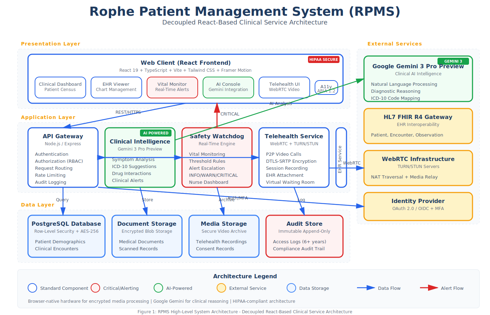
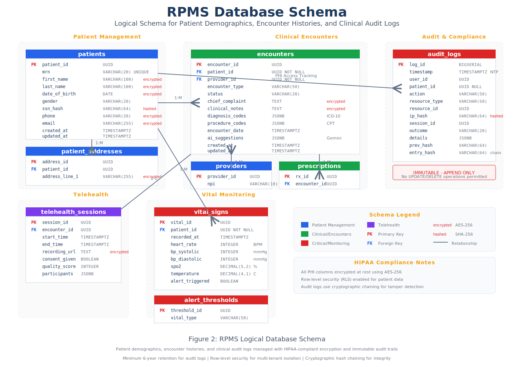

# Software Requirements Specification (SRS)

## Rophe Patient Management System (RPMS)

**Standard:** IEEE 830-1998 (Specialist Care Variant)
**Version:** 1.5.0 (Final Production)
**Date:** May 2024
**Status:** Final Release
**Organization:** Rophe Healthcare Systems
**Project Owner:** Clinical Systems Division

---

## Document Revision History

| Version | Date | Author | Description |
|---------|------|--------|-------------|
| 1.0.0 | January 2024 | Clinical Systems Team | Initial requirements draft |
| 1.1.0 | February 2024 | Development Team | Added EHR integration specifications |
| 1.2.0 | March 2024 | AI Integration Team | Gemini 3 clinical intelligence integration |
| 1.3.0 | April 2024 | Security Team | HIPAA compliance requirements |
| 1.4.0 | April 2024 | QA Team | Telehealth and accessibility requirements |
| 1.5.0 | May 2024 | Development Team | Final production release |

---

## Table of Contents

1. [Introduction](#1-introduction)
   - 1.1 [Purpose](#11-purpose)
   - 1.2 [Scope](#12-scope)
   - 1.3 [Definitions, Acronyms, and Abbreviations](#13-definitions-acronyms-and-abbreviations)
   - 1.4 [References](#14-references)
   - 1.5 [Overview](#15-overview)

2. [Overall Description](#2-overall-description)
   - 2.1 [Product Perspective](#21-product-perspective)
   - 2.2 [Product Functions](#22-product-functions)
   - 2.3 [User Characteristics](#23-user-characteristics)
   - 2.4 [Constraints](#24-constraints)
   - 2.5 [Assumptions and Dependencies](#25-assumptions-and-dependencies)

3. [Architectural Design](#3-architectural-design)
   - 3.1 [System Overview](#31-system-overview)
   - 3.2 [Technology Stack](#32-technology-stack)
   - 3.3 [Data Persistence](#33-data-persistence)
   - 3.4 [Integration Architecture](#34-integration-architecture)

4. [Functional Requirements](#4-functional-requirements)
   - 4.1 [Clinical Intelligence (REQ-001)](#41-clinical-intelligence-req-001)
   - 4.2 [Safety Watchdog (REQ-002)](#42-safety-watchdog-req-002)
   - 4.3 [Telehealth Archiving (REQ-003)](#43-telehealth-archiving-req-003)
   - 4.4 [Universal Accessibility (REQ-004)](#44-universal-accessibility-req-004)
   - 4.5 [Electronic Health Records Management](#45-electronic-health-records-management)
   - 4.6 [Patient Management](#46-patient-management)
   - 4.7 [Encounter Management](#47-encounter-management)
   - 4.8 [Prescription Management](#48-prescription-management)

5. [Security & Compliance](#5-security--compliance)
   - 5.1 [HIPAA Compliance](#51-hipaa-compliance)
   - 5.2 [Passphrase Protection](#52-passphrase-protection)
   - 5.3 [Audit Logging](#53-audit-logging)
   - 5.4 [Data Encryption](#54-data-encryption)

6. [Non-Functional Requirements](#6-non-functional-requirements)
   - 6.1 [Performance Requirements](#61-performance-requirements)
   - 6.2 [Reliability Requirements](#62-reliability-requirements)
   - 6.3 [Scalability Requirements](#63-scalability-requirements)
   - 6.4 [Availability Requirements](#64-availability-requirements)

7. [External Interface Requirements](#7-external-interface-requirements)
   - 7.1 [User Interfaces](#71-user-interfaces)
   - 7.2 [Hardware Interfaces](#72-hardware-interfaces)
   - 7.3 [Software Interfaces](#73-software-interfaces)
   - 7.4 [Communication Interfaces](#74-communication-interfaces)

8. [Use Cases](#8-use-cases)

9. [Quality Attributes](#9-quality-attributes)

10. [Appendices](#10-appendices)

---

## 1. Introduction

### 1.1 Purpose

This Software Requirements Specification (SRS) document provides a complete and authoritative description of the software requirements for the **Rophe Patient Management System (RPMS)**. It serves as the master clinical reference for developers, administrators, quality assurance specialists, and healthcare compliance officers.

**Intended Audience:**
- Software developers and engineers
- Clinical informaticists
- Healthcare IT administrators
- Quality assurance and testing teams
- HIPAA compliance officers
- System integrators
- Medical staff trainers
- Project stakeholders

**Document Objectives:**
- Define functional and non-functional requirements
- Establish clinical workflow specifications
- Document security and compliance requirements
- Provide architectural guidance for implementation
- Serve as a contractual basis for development

### 1.2 Scope

**Product Name:** Rophe Patient Management System (RPMS)

**Product Description:**
RPMS is a secure, comprehensive clinical management hub designed for specialist care environments. The system integrates Electronic Health Records (EHR), AI-assisted diagnostic intelligence powered by Google Gemini 3, dynamic medical alerting capabilities, and HIPAA-compliant telehealth functionalities.

**Key Objectives:**
- Centralize patient data management across care settings
- Leverage AI for clinical decision support and ICD-10 code suggestions
- Enable real-time vital sign monitoring with intelligent alerting
- Provide secure, compliant telehealth capabilities with session recording
- Ensure universal accessibility through adaptive interface themes
- Maintain comprehensive audit trails for medico-legal transparency

**Scope Boundaries:**

**In Scope:**
- Web-based React frontend application
- Patient demographic management
- Electronic Health Records (EHR) integration
- AI-powered clinical intelligence (Gemini 3)
- Real-time vital sign monitoring and alerting
- Secure P2P telehealth video conferencing
- Session recording and EHR file attachment
- Multi-theme accessibility support (Light, Dark, High-Contrast)
- ARIA 1.2 landmark compliance
- Comprehensive audit logging
- HIPAA-compliant data handling

**Out of Scope:**
- Backend API implementation (separate system specification)
- AI/ML model training and fine-tuning
- Native mobile applications (iOS/Android)
- Medical device hardware integration
- Pharmacy dispensing systems
- Insurance claim processing (Phase 2)
- Laboratory Information System (LIS) integration (Phase 2)

### 1.3 Definitions, Acronyms, and Abbreviations

| Term | Definition |
|------|------------|
| **AI** | Artificial Intelligence |
| **ARIA** | Accessible Rich Internet Applications |
| **API** | Application Programming Interface |
| **BAA** | Business Associate Agreement |
| **CPT** | Current Procedural Terminology |
| **EHR** | Electronic Health Record |
| **EMR** | Electronic Medical Record |
| **ePHI** | Electronic Protected Health Information |
| **Gemini 3** | Google's advanced multimodal AI model |
| **HIPAA** | Health Insurance Portability and Accountability Act |
| **HL7** | Health Level Seven International |
| **ICD-10** | International Classification of Diseases, 10th Revision |
| **JWT** | JSON Web Token |
| **MFA** | Multi-Factor Authentication |
| **NLP** | Natural Language Processing |
| **P2P** | Peer-to-Peer |
| **PHI** | Protected Health Information |
| **RBAC** | Role-Based Access Control |
| **RPMS** | Rophe Patient Management System |
| **SNOMED CT** | Systematized Nomenclature of Medicine Clinical Terms |
| **TLS** | Transport Layer Security |
| **WCAG** | Web Content Accessibility Guidelines |
| **WebRTC** | Web Real-Time Communication |

### 1.4 References

1. IEEE Std 830-1998, IEEE Recommended Practice for Software Requirements Specifications
2. HIPAA Security Rule (45 CFR Part 160 and Subparts A and C of Part 164)
3. HIPAA Privacy Rule (45 CFR Part 160 and Subparts A and E of Part 164)
4. WCAG 2.1 Guidelines - https://www.w3.org/WAI/WCAG21/quickref/
5. ARIA 1.2 Specification - https://www.w3.org/TR/wai-aria-1.2/
6. HL7 FHIR R4 Specification - https://hl7.org/fhir/R4/
7. ICD-10-CM Guidelines - https://www.cms.gov/Medicare/Coding/ICD10
8. Google Gemini API Documentation - https://ai.google.dev/docs
9. React Documentation - https://react.dev/
10. WebRTC Specification - https://www.w3.org/TR/webrtc/

### 1.5 Overview

This SRS document is organized into ten major sections:

- **Section 1 (Introduction):** Provides document purpose, scope, and definitions
- **Section 2 (Overall Description):** Describes product context and constraints
- **Section 3 (Architectural Design):** Details system architecture with diagrams
- **Section 4 (Functional Requirements):** Contains detailed functional specifications
- **Section 5 (Security & Compliance):** Specifies HIPAA compliance and security measures
- **Section 6 (Non-Functional Requirements):** Defines performance and quality requirements
- **Section 7 (External Interface Requirements):** Specifies all system interfaces
- **Section 8 (Use Cases):** Documents primary use case scenarios
- **Section 9 (Quality Attributes):** Defines quality characteristics
- **Section 10 (Appendices):** Additional reference materials

---

## 2. Overall Description

### 2.1 Product Perspective

RPMS is a self-contained clinical management platform designed to operate as the central hub for specialist care practices. It interfaces with existing healthcare infrastructure while providing modern, AI-enhanced clinical workflows.

**System Context:**

The system utilizes a decoupled React-based service architecture, leveraging browser-native hardware for encrypted media processing and Google Gemini for clinical reasoning.



**Key System Interfaces:**

1. **Frontend Layer:** React-based web application with TypeScript
2. **API Layer:** RESTful backend services (port 8080)
3. **AI Intelligence Layer:** Google Gemini 3 Pro Preview integration
4. **Data Layer:** PostgreSQL with encrypted PHI storage
5. **Media Layer:** WebRTC for secure telehealth sessions
6. **External Integrations:** HL7 FHIR for EHR interoperability

**Operational Environment:**

- Modern web browsers (Chrome 100+, Firefox 100+, Safari 15+, Edge 100+)
- Minimum 1920x1080 display resolution (responsive down to 768px)
- WebRTC-capable browser for telehealth features
- Stable internet connection (minimum 5 Mbps for video)

### 2.2 Product Functions

The RPMS provides the following major functional areas:

#### F1: Clinical Intelligence Engine
- AI-powered symptom analysis using Gemini 3 Pro Preview
- Automated ICD-10 code suggestions based on clinical notes
- Differential diagnosis support
- Drug interaction warnings
- Clinical decision support alerts

#### F2: Safety Watchdog System
- Real-time vital sign monitoring
- Configurable institutional threshold management
- Multi-level alert escalation (INFO, WARNING, CRITICAL)
- Automated escalation to designated care providers
- Integration with nursing station dashboards

#### F3: Telehealth Platform
- Secure P2P video consultations via WebRTC
- End-to-end encrypted media streams
- Session recording with patient consent
- EHR integration for session attachment
- Screen sharing for diagnostic image review
- Virtual waiting room management

#### F4: Electronic Health Records
- Comprehensive patient demographic management
- Clinical encounter documentation
- Medical history tracking
- Allergy and medication lists
- Laboratory result integration
- Document management and scanning

#### F5: Universal Accessibility
- Three accessibility themes (Light, Dark, High-Contrast)
- Full ARIA 1.2 landmark support
- Keyboard navigation for all functions
- Screen reader optimization
- Configurable font sizing
- Color blindness accommodations

#### F6: Audit and Compliance
- Immutable audit logging
- Access tracking per PHI record
- Report generation for compliance audits
- Breach notification support
- Data retention policy enforcement

### 2.3 User Characteristics

#### Physicians / Specialists
- **Technical Expertise:** Moderate to high
- **Primary Responsibilities:** Patient care, diagnosis, treatment planning
- **Key Functions Used:** Clinical intelligence, EHR, prescriptions, telehealth
- **Frequency of Use:** Multiple times daily
- **Training Required:** 4-8 hours

#### Nurses / Clinical Staff
- **Technical Expertise:** Moderate
- **Primary Responsibilities:** Patient intake, vital monitoring, care coordination
- **Key Functions Used:** Safety watchdog, patient management, documentation
- **Frequency of Use:** Continuous throughout shift
- **Training Required:** 4-6 hours

#### Medical Administrators
- **Technical Expertise:** Moderate
- **Primary Responsibilities:** Scheduling, billing preparation, records management
- **Key Functions Used:** Patient demographics, encounter management, reporting
- **Frequency of Use:** Continuous
- **Training Required:** 6-8 hours

#### System Administrators
- **Technical Expertise:** High
- **Primary Responsibilities:** System configuration, user management, security
- **Key Functions Used:** Admin console, audit logs, compliance reporting
- **Frequency of Use:** Daily
- **Training Required:** 8-16 hours

#### Patients (Telehealth)
- **Technical Expertise:** Variable (basic assumed)
- **Primary Responsibilities:** Attend virtual appointments
- **Key Functions Used:** Telehealth portal, document viewing
- **Frequency of Use:** As scheduled
- **Training Required:** Minimal (guided experience)

### 2.4 Constraints

#### Regulatory Constraints
1. **HIPAA Compliance:** All PHI handling must comply with HIPAA Security and Privacy Rules
2. **State Regulations:** Must support state-specific telehealth consent requirements
3. **Medical Device Regulations:** Safety Watchdog must not be marketed as diagnostic device
4. **Data Residency:** Patient data must remain within specified jurisdictions
5. **Retention Requirements:** Medical records retained per state/federal requirements (minimum 7 years)

#### Technical Constraints
1. **Browser Compatibility:** Must support WebRTC for telehealth features
2. **Performance:** Real-time alerting requires sub-second response times
3. **Encryption:** All PHI must be encrypted at rest (AES-256) and in transit (TLS 1.3)
4. **Integration:** Must support HL7 FHIR R4 for EHR interoperability
5. **AI Availability:** Gemini 3 API availability affects clinical intelligence features

#### Business Constraints
1. **Budget:** Development within allocated clinical IT budget
2. **Timeline:** Initial deployment aligned with fiscal year
3. **Resources:** Limited to certified healthcare IT professionals
4. **Licensing:** Must use HIPAA-eligible cloud services with BAA

#### Accessibility Constraints
1. **WCAG 2.1 AA:** Minimum accessibility compliance level
2. **Section 508:** Federal accessibility requirements for government contracts
3. **ADA Compliance:** Americans with Disabilities Act requirements

### 2.5 Assumptions and Dependencies

#### Assumptions
1. Users have access to WebRTC-capable browsers
2. Healthcare facility has adequate network bandwidth (minimum 10 Mbps)
3. Clinical staff complete mandatory training before system access
4. Patients consent to telehealth recordings when applicable
5. Institutional thresholds for vital sign alerts are pre-configured
6. Google Gemini API maintains clinical-grade response accuracy
7. Healthcare facility maintains valid BAA with cloud providers

#### Dependencies
1. **Backend API:** Core functionality requires operational backend services
2. **Gemini 3 API:** Clinical intelligence depends on Google AI availability
3. **Database:** PostgreSQL availability for data persistence
4. **WebRTC Infrastructure:** TURN/STUN servers for telehealth connectivity
5. **Encryption Services:** Key management system for PHI encryption
6. **Identity Provider:** Authentication service availability
7. **Time Synchronization:** NTP for accurate audit timestamps
8. **Network Infrastructure:** Stable connectivity for real-time features

---

## 3. Architectural Design

### 3.1 System Overview

The Rophe Patient Management System utilizes a decoupled React-based service architecture designed for healthcare environments. The architecture emphasizes security, scalability, and clinical workflow optimization.


**Architecture Principles:**

1. **Security-First Design:** All components implement defense-in-depth security
2. **HIPAA-Native Architecture:** PHI protection built into every layer
3. **Microservices Readiness:** Decoupled services for independent scaling
4. **AI Integration:** Native support for clinical AI inference
5. **Real-Time Capable:** Event-driven architecture for instant alerting
6. **Accessibility-Embedded:** ARIA compliance at the component level

**Architecture Layers:**

#### Presentation Layer (Frontend)
- **Technology:** React 19+ with TypeScript
- **Styling:** Tailwind CSS with clinical color palette
- **Animation:** Framer Motion for smooth interactions
- **Charts:** Recharts for clinical data visualization
- **Accessibility:** Full ARIA 1.2 implementation

**Components:**
- Patient Dashboard
- Clinical Intelligence Console
- Vital Sign Monitor
- Telehealth Video Interface
- EHR Document Viewer
- Administrative Console
- Audit Log Viewer

#### Application Layer (Backend Services)
- **API Gateway:** Authentication, authorization, request routing
- **Clinical Intelligence Service:** Gemini 3 integration
- **Alert Engine:** Real-time vital sign monitoring
- **Telehealth Service:** WebRTC signaling and recording
- **EHR Service:** Patient record management
- **Audit Service:** Compliance logging

#### Data Layer
- **Primary Database:** PostgreSQL with row-level security
- **Document Storage:** Encrypted blob storage for medical documents
- **Media Storage:** Secure storage for telehealth recordings
- **Cache Layer:** Redis for session and real-time data
- **Audit Store:** Immutable append-only audit log

#### Integration Layer
- **HL7 FHIR Gateway:** EHR interoperability
- **AI Gateway:** Gemini 3 API integration
- **Notification Service:** Email, SMS, push notifications
- **Identity Provider:** OAuth 2.0 / OIDC authentication

### 3.2 Technology Stack

| Category | Technology | Version | Purpose |
|----------|------------|---------|---------|
| **Frontend Framework** | React | 19.x | Component-based UI |
| **Language** | TypeScript | 5.9+ | Type-safe development |
| **Build Tool** | Vite | 7.x | Fast development/build |
| **Styling** | Tailwind CSS | 4.x | Utility-first CSS |
| **Animation** | Framer Motion | 12.x | Smooth UI animations |
| **Charts** | Recharts | 3.x | Clinical data visualization |
| **Icons** | Lucide React | 0.5+ | Consistent iconography |
| **HTTP Client** | Axios | 1.x | API communication |
| **Routing** | React Router | 7.x | Client-side routing |
| **State Management** | Zustand/Context | Latest | Application state |
| **Video Conferencing** | WebRTC | Native | P2P telehealth |
| **AI Integration** | Gemini 3 Pro | Preview | Clinical intelligence |

**Backend Technologies (Reference):**
- Node.js / Express.js
- PostgreSQL with encryption
- Redis for caching
- WebRTC TURN/STUN servers

### 3.3 Data Persistence

The logical schema manages patient demographics, encounter histories, and clinical audit logs as defined in the master database specification.



**Core Data Entities:**

#### Patient Demographics
- Patient identifier (UUID)
- Personal information (encrypted)
- Contact information (encrypted)
- Insurance information (encrypted)
- Emergency contacts
- Privacy preferences
- Consent records

#### Clinical Encounters
- Encounter identifier
- Patient reference
- Provider reference
- Date/time stamps
- Chief complaint
- Clinical notes (encrypted)
- Diagnoses (ICD-10)
- Procedures (CPT)
- Vital signs
- Attachments

#### Audit Logs
- Event identifier
- Timestamp (NTP synchronized)
- User identifier
- Patient identifier (if applicable)
- Action performed
- Resource accessed
- IP address (hashed)
- Session identifier
- Outcome status

#### Telehealth Sessions
- Session identifier
- Participants
- Start/end times
- Recording location (encrypted reference)
- Consent status
- Technical quality metrics

### 3.4 Integration Architecture

**External System Integrations:**

1. **Google Gemini 3 API**
   - Purpose: Clinical intelligence and ICD-10 suggestions
   - Protocol: REST/HTTPS
   - Authentication: API Key with OAuth 2.0
   - Data Handling: PHI anonymized before transmission

2. **HL7 FHIR R4**
   - Purpose: EHR interoperability
   - Protocol: REST/HTTPS
   - Resources: Patient, Encounter, Observation, Condition
   - Authentication: OAuth 2.0 / SMART on FHIR

3. **WebRTC Media Servers**
   - Purpose: Telehealth video infrastructure
   - Protocol: STUN/TURN
   - Encryption: DTLS-SRTP
   - Recording: Server-side with encryption

4. **Notification Gateway**
   - Purpose: Multi-channel patient/provider notifications
   - Channels: Email, SMS, Push
   - Protocol: REST/HTTPS
   - Compliance: HIPAA-safe messaging

---

## 4. Functional Requirements

### 4.1 Clinical Intelligence (REQ-001)

**Requirement ID:** REQ-001
**Title:** Clinical Intelligence
**Priority:** Critical
**Category:** AI-Assisted Diagnosis

**Description:**
The system shall utilize `gemini-3-pro-preview` to analyze symptoms and suggest ICD-10 codes, providing AI-assisted clinical decision support for healthcare providers.

#### REQ-001.1: Symptom Analysis

**ID:** REQ-001.1
**Description:** The system shall accept symptom descriptions and clinical notes for AI analysis
**Inputs:**
- Free-text symptom description
- Structured symptom checklist
- Relevant patient history context
- Current medications

**Processing:**
1. Sanitize and anonymize PHI before AI transmission
2. Submit to Gemini 3 Pro Preview API
3. Parse AI response for clinical suggestions
4. Map suggestions to ICD-10 codes
5. Calculate confidence scores

**Outputs:**
- Suggested diagnoses with confidence levels
- Relevant ICD-10 codes
- Differential diagnosis list
- Recommended follow-up actions

**Validation:**
- AI suggestions are advisory only
- Physician must confirm all diagnoses
- Audit trail of AI suggestions vs. final diagnosis

#### REQ-001.2: ICD-10 Code Suggestion

**ID:** REQ-001.2
**Description:** The system shall suggest appropriate ICD-10 codes based on clinical documentation
**Inputs:**
- Clinical encounter notes
- Problem list entries
- Procedure descriptions

**Processing:**
1. Extract clinical concepts from documentation
2. Match concepts to ICD-10 code categories
3. Rank suggestions by relevance
4. Display with clinical descriptions

**Outputs:**
- Ranked list of ICD-10 codes
- Code descriptions
- Selection confidence percentage
- Related codes for consideration

**Constraints:**
- Must use current ICD-10-CM version
- Updates synchronized with CMS releases
- Suggestions do not replace medical judgment

#### REQ-001.3: Drug Interaction Checking

**ID:** REQ-001.3
**Description:** The system shall identify potential drug-drug and drug-condition interactions
**Inputs:**
- Current medication list
- Proposed new medication
- Patient conditions/diagnoses
- Patient allergies

**Processing:**
1. Cross-reference against drug interaction database
2. Analyze contraindications
3. Check allergy cross-reactivity
4. Generate severity-rated alerts

**Outputs:**
- Interaction warnings (Severe, Moderate, Minor)
- Contraindication alerts
- Alternative medication suggestions
- Clinical references

#### REQ-001.4: Clinical Decision Support Alerts

**ID:** REQ-001.4
**Description:** The system shall generate context-aware clinical alerts
**Alert Types:**
- Preventive care reminders
- Overdue screening notifications
- Clinical guideline recommendations
- Quality measure compliance

**Presentation:**
- Non-intrusive notification system
- Dismissible with reason tracking
- Configurable alert thresholds
- Role-appropriate filtering

### 4.2 Safety Watchdog (REQ-002)

**Requirement ID:** REQ-002
**Title:** Safety Watchdog
**Priority:** Critical
**Category:** Real-Time Monitoring

**Description:**
The system shall monitor vital signs in real-time and trigger 'CRITICAL' alerts if institutional thresholds are breached, enabling rapid clinical response to patient deterioration.

#### REQ-002.1: Vital Sign Monitoring

**ID:** REQ-002.1
**Description:** The system shall continuously monitor patient vital signs
**Monitored Parameters:**
- Heart rate (beats per minute)
- Blood pressure (systolic/diastolic mmHg)
- Respiratory rate (breaths per minute)
- Oxygen saturation (SpO2 %)
- Temperature (Celsius/Fahrenheit)
- Pain level (0-10 scale)

**Data Sources:**
- Manual entry by clinical staff
- Integration with bedside monitors (Phase 2)
- Patient-reported values (telehealth)

**Update Frequency:**
- Real-time for integrated devices
- Manual: Upon entry
- Display refresh: < 1 second

#### REQ-002.2: Threshold Configuration

**ID:** REQ-002.2
**Description:** The system shall support configurable vital sign thresholds
**Configuration Levels:**
- Institutional defaults
- Department-specific overrides
- Patient-specific adjustments
- Age/condition-based rules

**Threshold Types:**
- Absolute limits (above/below)
- Rate of change thresholds
- Trending thresholds
- Combination rules

**Administration:**
- Role-restricted configuration access
- Audit logging of changes
- Change approval workflow
- Threshold validation rules

#### REQ-002.3: Alert Escalation

**ID:** REQ-002.3
**Description:** The system shall implement multi-level alert escalation
**Alert Levels:**

| Level | Criteria | Response Time | Notification |
|-------|----------|---------------|--------------|
| INFO | Minor deviation | No SLA | In-app only |
| WARNING | Moderate deviation | 15 minutes | In-app + push |
| CRITICAL | Severe deviation | Immediate | All channels |

**Escalation Rules:**
1. Initial alert to assigned nurse
2. 5-minute escalation to charge nurse
3. 10-minute escalation to attending physician
4. 15-minute escalation to department supervisor
5. Configurable rapid response team activation

**Acknowledgment:**
- Alert acknowledgment required
- Reason for acknowledgment recorded
- Time-to-acknowledgment tracked
- Unacknowledged alert re-escalation

#### REQ-002.4: Dashboard Display

**ID:** REQ-002.4
**Description:** The system shall provide real-time monitoring dashboards
**Dashboard Views:**
- Unit/floor overview
- Individual patient detail
- Trending charts
- Alert summary

**Visual Indicators:**
- Color-coded status (Green/Yellow/Red)
- Animated alert indicators
- Trend arrows
- Time since last reading

### 4.3 Telehealth Archiving (REQ-003)

**Requirement ID:** REQ-003
**Title:** Telehealth Archiving
**Priority:** High
**Category:** Video Conferencing

**Description:**
The system shall support secure P2P video calls with integrated session recording and EHR file attachment, enabling compliant telehealth consultations.

#### REQ-003.1: Secure Video Conferencing

**ID:** REQ-003.1
**Description:** The system shall provide encrypted P2P video consultations
**Technology:**
- WebRTC for browser-native video
- DTLS-SRTP encryption
- TURN/STUN for NAT traversal

**Features:**
- HD video (720p minimum, 1080p preferred)
- Echo-cancelled audio
- Bandwidth adaptation
- Connection quality indicators

**Participants:**
- 1:1 consultations
- Multi-party support (up to 4 participants)
- Provider-to-provider consultations
- Interpreter integration

#### REQ-003.2: Session Recording

**ID:** REQ-003.2
**Description:** The system shall record telehealth sessions with consent
**Consent Management:**
- Pre-session consent capture
- Consent stored in patient record
- Opt-out option with documentation
- State-specific consent requirements

**Recording Features:**
- Audio and video capture
- Server-side recording for security
- Encrypted storage (AES-256)
- Retention per medical record policy

**Quality:**
- Minimum 720p resolution
- AAC audio encoding
- Maximum 30-day processing time

#### REQ-003.3: EHR Integration

**ID:** REQ-003.3
**Description:** The system shall attach recordings to patient EHR
**Attachment Process:**
1. Session completion triggers processing
2. Recording encrypted and stored
3. Metadata extracted (duration, participants)
4. Reference linked to encounter record
5. Thumbnail generated for preview

**Access Control:**
- Provider access to own sessions
- Supervising physician access
- Patient portal access (configurable)
- Audit logging of all access

#### REQ-003.4: Virtual Waiting Room

**ID:** REQ-003.4
**Description:** The system shall manage patient queuing for telehealth
**Features:**
- Patient check-in confirmation
- Estimated wait time display
- Provider availability status
- Session readiness notification

**Patient Experience:**
- Device/connection testing
- Pre-visit questionnaire
- Document upload capability
- Technical support access

### 4.4 Universal Accessibility (REQ-004)

**Requirement ID:** REQ-004
**Title:** Universal Accessibility
**Priority:** High
**Category:** User Interface

**Description:**
The system shall provide three distinct accessibility themes (Light, Dark, High-Contrast) with full ARIA 1.2 landmark support, ensuring usability for all users regardless of ability.

#### REQ-004.1: Theme Support

**ID:** REQ-004.1
**Description:** The system shall provide multiple visual themes
**Available Themes:**

| Theme | Background | Text | Accent | Use Case |
|-------|------------|------|--------|----------|
| Light | #FFFFFF | #1A1A1A | #2563EB | Standard daytime use |
| Dark | #1A1A1A | #F5F5F5 | #60A5FA | Low-light environments |
| High-Contrast | #000000 | #FFFFFF | #FFFF00 | Visual impairment |

**Theme Features:**
- User preference persistence
- System preference detection
- Scheduled theme switching
- Per-device preferences

#### REQ-004.2: ARIA Compliance

**ID:** REQ-004.2
**Description:** The system shall implement full ARIA 1.2 landmarks
**Landmark Regions:**
- `banner` - Site header
- `navigation` - Primary navigation
- `main` - Primary content
- `complementary` - Sidebar content
- `contentinfo` - Footer information
- `search` - Search functionality
- `form` - Form regions

**ARIA Requirements:**
- All interactive elements labeled
- Live regions for dynamic content
- Focus management for modals
- Error announcements
- State changes communicated

#### REQ-004.3: Keyboard Navigation

**ID:** REQ-004.3
**Description:** The system shall support complete keyboard navigation
**Navigation Requirements:**
- Tab order follows visual layout
- Skip links for main content
- Focus indicators visible
- Keyboard shortcuts documented
- No keyboard traps

**Shortcut Keys:**
- Alt+1: Dashboard
- Alt+2: Patients
- Alt+3: Schedule
- Alt+4: Messages
- Alt+?: Help/shortcuts list

#### REQ-004.4: Screen Reader Support

**ID:** REQ-004.4
**Description:** The system shall be compatible with screen readers
**Supported Screen Readers:**
- NVDA (Windows)
- JAWS (Windows)
- VoiceOver (macOS/iOS)
- TalkBack (Android)

**Implementation:**
- Semantic HTML structure
- Meaningful alt text for images
- Table headers for data tables
- Form label associations
- Error message association

### 4.5 Electronic Health Records Management

#### REQ-005: Patient Record Management

**ID:** REQ-005
**Description:** The system shall maintain comprehensive electronic health records

**REQ-005.1: Demographics Management**
- Patient identification (MRN, name, DOB)
- Contact information
- Insurance information
- Emergency contacts
- Privacy preferences
- Communication preferences

**REQ-005.2: Clinical Documentation**
- Progress notes
- Assessment forms
- Care plans
- Orders and results
- Referral letters
- Consent forms

**REQ-005.3: Medical History**
- Problem list (active/resolved)
- Surgical history
- Family history
- Social history
- Immunization records
- Allergy documentation

**REQ-005.4: Document Management**
- Document scanning/upload
- Version control
- Digital signatures
- Document categorization
- Retention management

### 4.6 Patient Management

#### REQ-006: Patient Workflow

**ID:** REQ-006
**Description:** The system shall support complete patient management workflows

**REQ-006.1: Registration**
- New patient registration
- Duplicate detection
- Identity verification
- Insurance verification
- Consent collection

**REQ-006.2: Scheduling**
- Appointment booking
- Resource scheduling
- Waitlist management
- Reminder notifications
- Check-in/check-out

**REQ-006.3: Patient Portal**
- Secure messaging
- Appointment requests
- Document viewing
- Result access
- Bill viewing

### 4.7 Encounter Management

#### REQ-007: Clinical Encounters

**ID:** REQ-007
**Description:** The system shall manage clinical encounters comprehensively

**REQ-007.1: Encounter Creation**
- Walk-in registration
- Scheduled appointment conversion
- Telehealth session initiation
- Emergency encounter creation

**REQ-007.2: Clinical Workflow**
- Chief complaint capture
- Vital sign entry
- Clinical note documentation
- Order entry
- Diagnosis assignment
- Procedure documentation

**REQ-007.3: Encounter Closure**
- Encounter summary generation
- Billing code assignment
- Follow-up scheduling
- Referral generation
- Patient instructions

### 4.8 Prescription Management

#### REQ-008: Medication Management

**ID:** REQ-008
**Description:** The system shall support prescription workflows

**REQ-008.1: Prescription Writing**
- Medication search
- Dosage selection
- Duration specification
- Refill authorization
- E-prescribing integration (Phase 2)

**REQ-008.2: Medication Reconciliation**
- Current medication list
- External medication import
- Discrepancy identification
- Reconciliation documentation

**REQ-008.3: Formulary Support**
- Insurance formulary checking
- Alternative suggestions
- Prior authorization alerts
- Cost transparency

---

## 5. Security & Compliance

### 5.1 HIPAA Compliance

The system shall implement all required HIPAA Security Rule safeguards:

#### Administrative Safeguards
- Security management process
- Assigned security responsibility
- Workforce security measures
- Information access management
- Security awareness training
- Security incident procedures
- Contingency planning
- Evaluation procedures
- Business associate contracts

#### Physical Safeguards
- Facility access controls
- Workstation use policies
- Workstation security
- Device and media controls

#### Technical Safeguards
- Access control mechanisms
- Audit controls
- Integrity controls
- Person/entity authentication
- Transmission security

### 5.2 Passphrase Protection

**Description:**
Administrative zones are protected by institutional-grade access keys.

**Requirements:**

#### REQ-SEC-001: Authentication
- Multi-factor authentication required
- Minimum password complexity: 12 characters, mixed case, numbers, symbols
- Password rotation: 90 days
- Account lockout: 5 failed attempts
- Session timeout: 15 minutes idle

#### REQ-SEC-002: Authorization
- Role-based access control (RBAC)
- Principle of least privilege
- Break-the-glass emergency access
- Access request workflow
- Periodic access reviews

#### REQ-SEC-003: Session Management
- Secure session tokens
- Token expiration
- Concurrent session limits
- Session termination on logout
- Idle session timeout

### 5.3 Audit Logging

**Description:**
Every clinical and administrative action is recorded in an immutable audit stream for medico-legal transparency.

#### REQ-AUDIT-001: Event Capture
**Logged Events:**
- User authentication (success/failure)
- PHI access (view, create, modify, delete)
- Administrative actions
- System configuration changes
- Security events
- Error conditions

**Log Content:**
- Timestamp (ISO 8601, UTC)
- User identifier
- Patient identifier (if applicable)
- Action performed
- Resource affected
- Outcome (success/failure)
- Client IP (hashed)
- User agent

#### REQ-AUDIT-002: Immutability
- Append-only storage
- Cryptographic chaining
- Tamper detection
- No deletion capability
- Separate audit administrator role

#### REQ-AUDIT-003: Retention
- Minimum 6-year retention
- Configurable per jurisdiction
- Secure archival process
- Retrieval capability
- Legal hold support

#### REQ-AUDIT-004: Reporting
- Pre-built compliance reports
- Custom query capability
- Scheduled report generation
- Export formats (PDF, CSV)
- Dashboard analytics

### 5.4 Data Encryption

#### REQ-ENCRYPT-001: Encryption at Rest
- Algorithm: AES-256
- Key management: HSM or KMS
- Database-level encryption
- File storage encryption
- Backup encryption

#### REQ-ENCRYPT-002: Encryption in Transit
- Protocol: TLS 1.3
- Certificate management
- Perfect forward secrecy
- HSTS enforcement
- Certificate transparency

#### REQ-ENCRYPT-003: Key Management
- Key rotation schedule
- Key access controls
- Key backup procedures
- Key destruction procedures
- Separation of duties

---

## 6. Non-Functional Requirements

### 6.1 Performance Requirements

| Metric | Requirement | Target |
|--------|-------------|--------|
| Page Load Time | < 3 seconds | < 2 seconds |
| API Response Time (95th percentile) | < 500ms | < 300ms |
| Real-Time Alert Latency | < 1 second | < 500ms |
| Video Call Setup | < 5 seconds | < 3 seconds |
| Search Results | < 2 seconds | < 1 second |
| Report Generation | < 30 seconds | < 15 seconds |
| Concurrent Users | 500 minimum | 1000 |
| Database Query Time | < 100ms | < 50ms |

### 6.2 Reliability Requirements

| Metric | Requirement |
|--------|-------------|
| Mean Time Between Failures (MTBF) | > 720 hours |
| Mean Time To Recovery (MTTR) | < 1 hour |
| Error Rate | < 0.01% of transactions |
| Data Loss | Zero tolerance for committed data |
| Backup Frequency | Every 6 hours |
| Backup Retention | 30 days |
| Recovery Point Objective (RPO) | < 6 hours |
| Recovery Time Objective (RTO) | < 4 hours |

### 6.3 Scalability Requirements

| Metric | Initial | Year 1 | Year 3 |
|--------|---------|--------|--------|
| Registered Users | 500 | 2,000 | 10,000 |
| Active Patients | 5,000 | 20,000 | 100,000 |
| Daily Encounters | 200 | 800 | 4,000 |
| Concurrent Telehealth Sessions | 20 | 80 | 400 |
| Document Storage | 100 GB | 500 GB | 5 TB |
| Audit Log Volume | 1 GB/month | 5 GB/month | 25 GB/month |

### 6.4 Availability Requirements

| Metric | Requirement |
|--------|-------------|
| System Uptime | 99.9% (8.76 hours downtime/year) |
| Planned Maintenance Window | Sunday 2-6 AM local time |
| Maximum Planned Downtime | 4 hours/month |
| Geographic Redundancy | Required for production |
| Failover Time | < 15 minutes |
| Data Replication | Synchronous within region |

---

## 7. External Interface Requirements

### 7.1 User Interfaces

#### UI Design Principles
- Clinical workflow optimization
- Minimal clicks to common actions
- Consistent navigation patterns
- Clear visual hierarchy
- Error prevention over error handling

#### Color Palette (Clinical Theme)
| Color | Hex | Usage |
|-------|-----|-------|
| Primary Blue | #2563EB | Actions, links |
| Clinical Navy | #1E3A5F | Headers, emphasis |
| Alert Red | #DC2626 | Critical alerts |
| Warning Amber | #F59E0B | Warnings |
| Success Green | #16A34A | Confirmations |
| Neutral Gray | #6B7280 | Secondary text |

#### Key Screens

**Clinical Dashboard**
- Patient census
- Alert summary
- Pending tasks
- Quick actions
- Upcoming appointments

**Patient Chart**
- Demographics header
- Navigation tabs
- Problem list sidebar
- Timeline view
- Quick documentation

**Telehealth Interface**
- Video display (primary)
- Patient information panel
- Chat/notes panel
- Media controls
- Screen sharing

**Administrative Console**
- User management
- System configuration
- Audit log viewer
- Report generator
- Integration status

### 7.2 Hardware Interfaces

#### Client Requirements
| Component | Minimum | Recommended |
|-----------|---------|-------------|
| CPU | Dual-core 2GHz | Quad-core 2.5GHz |
| RAM | 4 GB | 8 GB |
| Display | 1280x720 | 1920x1080 |
| Camera | 720p | 1080p |
| Microphone | Built-in | Headset |
| Network | 5 Mbps | 25 Mbps |

#### Server Requirements
| Component | Production |
|-----------|------------|
| CPU | 8+ cores |
| RAM | 32 GB minimum |
| Storage | SSD, RAID 10 |
| Network | 1 Gbps |

### 7.3 Software Interfaces

#### Backend API
- **Base URL:** https://api.rpms.healthcare/v1
- **Protocol:** REST over HTTPS
- **Authentication:** OAuth 2.0 / JWT
- **Format:** JSON

**Core Endpoints:**
```
POST   /auth/login              - User authentication
POST   /auth/mfa/verify         - MFA verification
GET    /patients                - List patients
POST   /patients                - Create patient
GET    /patients/{id}           - Get patient details
PUT    /patients/{id}           - Update patient
GET    /encounters              - List encounters
POST   /encounters              - Create encounter
GET    /encounters/{id}         - Get encounter details
POST   /ai/analyze              - Submit for AI analysis
GET    /ai/suggestions/{id}     - Get AI suggestions
POST   /telehealth/sessions     - Create telehealth session
GET    /vitals/monitor          - WebSocket vital monitoring
GET    /audit/logs              - Query audit logs
```

#### Gemini 3 Integration
- **Endpoint:** https://generativelanguage.googleapis.com/v1beta
- **Model:** gemini-3-pro-preview
- **Authentication:** API Key
- **PHI Handling:** Anonymized before transmission

#### HL7 FHIR Integration
- **Version:** R4
- **Resources:** Patient, Encounter, Observation, Condition, Procedure
- **Authentication:** SMART on FHIR

### 7.4 Communication Interfaces

#### HTTP/HTTPS
- **Versions:** HTTP/2, HTTP/1.1 fallback
- **TLS:** 1.3 required, 1.2 minimum
- **Ports:** 443 (HTTPS)

#### WebSocket
- **Purpose:** Real-time vital monitoring
- **Protocol:** WSS (Secure WebSocket)
- **Heartbeat:** 30-second interval

#### WebRTC
- **Purpose:** Telehealth video/audio
- **Signaling:** WebSocket
- **ICE Servers:** STUN/TURN with authentication

---

## 8. Use Cases

### UC-001: AI-Assisted Diagnosis

**Actors:** Physician
**Preconditions:** Patient encounter open, symptoms documented
**Main Flow:**
1. Physician enters symptoms in clinical notes
2. System analyzes symptoms via Gemini 3
3. System displays suggested diagnoses with confidence
4. Physician reviews ICD-10 code suggestions
5. Physician selects appropriate diagnosis
6. System records selection with AI suggestion audit

**Postconditions:** Diagnosis recorded, AI interaction audited

### UC-002: Vital Sign Alert Response

**Actors:** Nurse, Physician
**Preconditions:** Patient with active monitoring
**Main Flow:**
1. Vital sign exceeds threshold
2. System generates CRITICAL alert
3. Assigned nurse receives notification
4. Nurse acknowledges alert
5. Nurse documents intervention
6. Alert status updated

**Alternative Flow:**
- 3a. Nurse unavailable → Escalate to charge nurse (5 min)
- 4a. No acknowledgment → Escalate to physician (10 min)

**Postconditions:** Alert resolved, intervention documented

### UC-003: Telehealth Consultation

**Actors:** Physician, Patient
**Preconditions:** Appointment scheduled, patient checked in
**Main Flow:**
1. Physician joins virtual room
2. Patient admitted from waiting room
3. System confirms recording consent
4. Video session conducted
5. Physician documents encounter
6. Session ends and recording attached to EHR

**Postconditions:** Encounter documented, recording stored

### UC-004: Patient Registration

**Actors:** Registration Staff
**Preconditions:** None
**Main Flow:**
1. Staff initiates new patient registration
2. System checks for existing patient (duplicate detection)
3. Staff enters demographic information
4. Staff scans identification documents
5. Staff collects consent signatures
6. System creates patient record

**Postconditions:** Patient registered, consents recorded

### UC-005: Prescription with Interaction Check

**Actors:** Physician
**Preconditions:** Patient encounter open
**Main Flow:**
1. Physician searches for medication
2. System displays drug information
3. Physician enters dosage and duration
4. System checks for interactions
5. System displays interaction warnings (if any)
6. Physician reviews and confirms
7. Prescription created

**Alternative Flow:**
- 4a. Severe interaction found → Require acknowledgment reason

**Postconditions:** Prescription recorded, interactions documented

---

## 9. Quality Attributes

### 9.1 Reliability
- **MTBF:** > 720 hours
- **MTTR:** < 1 hour
- **Error Rate:** < 0.01%
- **Data Integrity:** 100% for committed transactions

### 9.2 Availability
- **Uptime:** 99.9%
- **Failover:** < 15 minutes
- **Maintenance:** Planned windows only

### 9.3 Security
- **Encryption:** AES-256 at rest, TLS 1.3 in transit
- **Authentication:** MFA required
- **Authorization:** RBAC with least privilege
- **Audit:** Complete, immutable logging

### 9.4 Maintainability
- **Code Coverage:** > 80%
- **Documentation:** All APIs documented
- **Modularity:** Microservices-ready architecture

### 9.5 Usability
- **Training Time:** < 8 hours for clinical staff
- **Error Prevention:** Confirmation for destructive actions
- **Accessibility:** WCAG 2.1 AA compliant

### 9.6 Portability
- **Browser Support:** Chrome, Firefox, Safari, Edge
- **OS Support:** Windows, macOS, Linux
- **Deployment:** Docker containerization

---

## 10. Appendices

### Appendix A: Glossary

| Term | Definition |
|------|------------|
| **Break-the-Glass** | Emergency access override for patient safety |
| **EHR** | Electronic Health Record - digital patient chart |
| **ePHI** | Electronic Protected Health Information |
| **Encounter** | Clinical visit or interaction with patient |
| **FHIR** | Fast Healthcare Interoperability Resources |
| **PHI** | Protected Health Information |
| **RBAC** | Role-Based Access Control |

### Appendix B: Compliance Checklist

| Requirement | HIPAA Reference | Status |
|-------------|-----------------|--------|
| Access Control | 164.312(a)(1) | Required |
| Audit Controls | 164.312(b) | Required |
| Integrity | 164.312(c)(1) | Required |
| Authentication | 164.312(d) | Required |
| Transmission Security | 164.312(e)(1) | Required |
| Encryption | 164.312(e)(2)(ii) | Addressable |

### Appendix C: Related Documents

- RPMS Backend API Specification
- RPMS Security Implementation Guide
- RPMS Deployment Guide
- HIPAA Compliance Attestation
- Gemini 3 Integration Guide

---

## Document Approval

| Role | Name | Signature | Date |
|------|------|-----------|------|
| Clinical Director | _____________ | _____________ | May 2024 |
| Chief Medical Information Officer | _____________ | _____________ | May 2024 |
| HIPAA Security Officer | _____________ | _____________ | May 2024 |
| Lead Developer | _____________ | _____________ | May 2024 |
| QA Lead | _____________ | _____________ | May 2024 |

---

**Document Status:** Final Production
**Version:** 1.5.0
**Last Updated:** May 2024

**Copyright 2024 Rophe Healthcare Systems. All Rights Reserved.**
**CONFIDENTIAL - Contains Protected Health Information Requirements**
