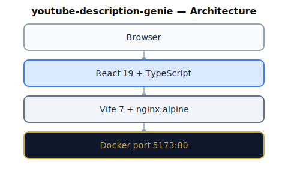
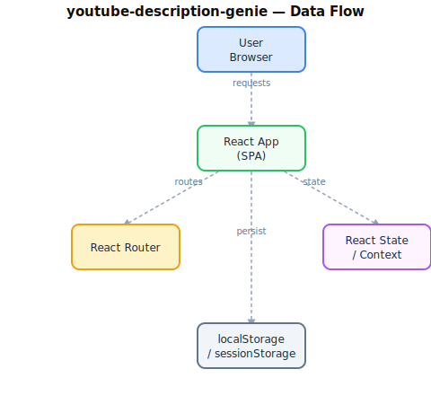

# Software Requirements Specification

**Project:** Youtube Description Genie
**Version:** 3.2.0
**Status:** As-Built
**Institution:** Techbridge University College (TUC)
**Date:** 2026-06-30
**Standard:** IEEE 29148-2018
**Change note (v3.1.0):** Gemini access migrated to the central TUC WMS Gemini key proxy — the application no longer holds or bundles a Gemini API key. Deployment changed from static SPA to a Node/Express service under PM2 (port 3028) which serves the SPA and relays AI requests. React/react-dom pinned to latest stable 19.2.7.
**Change note (v3.2.0):** BioChemAI standard applied. (1) Pattern 1 state machine implemented — loose `isLoading/error` booleans replaced with typed `AppState = 'setup' | 'loading' | 'results' | 'error'`. (2) Three-theme system added (dark/light/high-contrast) with CSS variables, inline persistence script in `index.html`, and theme toggle in the header. (3) Password-gated admin panel added at `#/admin` — includes generation stats, clear-data action, and session audit log. (4) Playwright e2e suite added (`e2e/`) covering auth gate, generator flow, theme cycling, and admin panel; replaces the vitest e2e stub. (5) `CONSTRAINTS.md` created at project root. (6) Port corrected to 3028 across `deploy.ps1`, `server.ts`, and this document. (7) TUC font stack (Playfair Display, Bebas Neue, Cormorant Garamond) added to `index.html`. (8) Sign-out button wired to the Google OAuth `AuthGate` context.

---

## 1. Introduction

### 1.1 Purpose

This Software Requirements Specification (SRS) documents the requirements for **Youtube Description Genie**, a web application deployed as part of the Techbridge University College (TUC) institutional utility suite. It serves as the authoritative reference for developers, testers, and stakeholders.

### 1.2 Scope

**Youtube Description Genie** is a TypeScript-based React 19 single-page application (SPA) built with Vite. It is served by a Node/Express server (`server.ts`, PM2 process `youtube-genie`, port 3028) which also exposes the AI relay endpoint. Gemini requests are forwarded server-side to the central TUC **WMS Gemini key proxy** (`https://wms.techbridge.edu.gh/api/gemini/generate`) using the `X-Gemini-Proxy-Key` service credential — **no Gemini API key exists in the client bundle or this app's repo**. (Docker remains for local testing only; it is not the deployment path.) It operates within the TUC monorepo (`aucdt-utilities`) and conforms to the Techbridge University College Shared Standards.

**AI data flow:** Browser → `POST /youtube-genie/api/generate` (nginx → Node :3028) → `server.ts` relay → WMS Gemini proxy (`X-Gemini-Proxy-Key`) → Google Gemini → response. The two service modules (`geminiService.ts`, `geminiServiceEnhanced.ts`) call the local relay via `services/geminiProxy.ts`; neither imports `@google/genai`.

**In scope:**
- All functional UI components and user flows
- Authentication and authorisation (where applicable)
- Data presentation, form handling, and export features
- Admin section and audit logging (where applicable)

**Out of scope:**
- Backend database administration
- Third-party service configuration
- Network infrastructure

### 1.3 Definitions and Acronyms

| Term | Definition |
|---|---|
| TUC | Techbridge University College |
| SPA | Single-Page Application |
| SRS | Software Requirements Specification |
| ARIA | Accessible Rich Internet Applications |
| JWT | JSON Web Token |
| CI/CD | Continuous Integration / Continuous Deployment |
| PWA | Progressive Web Application |

### 1.4 References

- SHARED-STANDARDS.md — TUC Canonical AI Governance Layer
- CLAUDE.md — Audit & Analysis Agent Constitution
- GEMINI.md — Execution Agent Constitution
- IEEE 29148-2018 — Systems and Software Engineering Requirements
- TUC Refresh Directive: <https://ai-tools.aucdt.edu.gh/refresh>

### 1.5 Overview

Section 2 describes the overall product context. Section 3 lists system features. Section 4 covers external interfaces. Section 5 defines non-functional requirements.

---

## 2. Overall Description

### 2.1 Product Perspective

**Youtube Description Genie** is a standalone module within the TUC institutional web application suite. It communicates with TUC backend services via REST APIs and shares the TUC design system (Tailwind CSS, Playfair Display, Bebas Neue, Cormorant Garamond).

### 2.2 Product Functions

- Core institutional utility functionality

### 2.3 User Classes and Characteristics

| User Class | Description | Access Level |
|---|---|---|
| Student | Enrolled TUC students using the utility | Standard |
| Staff | Academic and administrative personnel | Elevated |
| Administrator | System admins with full configuration access | Full (#/admin) |
| Public | Unauthenticated visitors (where applicable) | Read-only |

### 2.4 Operating Environment

- **Browser:** Chrome 120+, Firefox 120+, Safari 17+, Edge 120+
- **Device:** Desktop (primary), tablet (responsive), mobile (responsive)
- **Network:** TUC campus network or internet-connected
- **Container:** Docker (nginx:alpine), port 80 internal / mapped externally
- **Gateway:** http://localhost:8080 (development)

### 2.5 Design and Implementation Constraints

- **React version:** Latest stable (currently 19.2.7), per TUC policy — kept current, react and react-dom matched
- **Build tool:** Vite 7.3.1
- **Package manager:** pnpm (preferred), npm (fallback)
- **Styling:** Tailwind CSS 4.x with TUC design tokens
- **Accessibility:** WCAG 2.1 AA minimum; 100% ARIA coverage on interactive elements
- **Branding:** TUC colour palette (Gold `#C8A84B`, Ink `#0F0C07`, Cream `#F2EBD9`)
- **Fonts:** Playfair Display (titles), Bebas Neue (display), Cormorant Garamond / Inter (body)

### 2.6 Assumptions and Dependencies

- TUC Auth API available at `http://localhost:5000/api/auth/*` (when auth required)
- Mail API at `https://portal.aucdt.edu.gh` (live — do not change URL)
- Docker and Docker Compose available in deployment environment
- Google Analytics tag G-FKXTELQ71R injected via `index.html`

---

## 3. System Features (Functional Requirements)

### 3.1 Core Application Shell

**FR-001** The application shall render without errors in all supported browsers.
**FR-002** The application shall display a loading state during async operations.
**FR-003** The application shall display a meaningful error state on API failure with retry option.
**FR-004** The application shall display an empty state when no data is available.

### 3.2 Navigation and Routing

**FR-010** The application shall provide client-side routing without full page reloads.
**FR-011** All navigation links shall be functional and lead to valid routes.
**FR-012** The application shall handle 404 routes gracefully with a fallback page.

### 3.3 Accessibility

**FR-020** All interactive elements shall have ARIA labels or descriptive text.
**FR-021** The application shall be fully navigable via keyboard alone.
**FR-022** Focus indicators shall be visible on all focusable elements.
**FR-023** Colour contrast shall meet WCAG 2.1 AA standards (4.5:1 normal text, 3:1 large).

### 3.4 Theme Support

**FR-030** The application shall support Light, Dark, and High-Contrast themes via a `data-theme` attribute on `<html>`.
**FR-031** Theme preference shall persist across sessions via `localStorage` key `youtube-genie-theme`.
**FR-032** The theme shall be applied by an inline script before React mounts to prevent flash of unstyled content.
**FR-033** A theme toggle button in the header shall cycle themes in order: dark → light → high-contrast → dark.

### 3.5 Admin Section

**FR-040** The application shall provide a password-protected `#/admin` route accessible from the header.
**FR-041** The admin section shall display an audit log of all significant actions taken in the current session.
**FR-042** The admin section shall display total generation count and last-used timestamp from `localStorage`.
**FR-043** The admin section shall provide a clear-data action that removes stats and saved form data.
**FR-044** The password gate shall lock after 5 consecutive failed attempts per session.
**FR-045** Admin authentication state shall be stored in `sessionStorage` and expire when the tab is closed.

---

## 4. External Interface Requirements

### 4.1 User Interface

- Responsive layout: 320px (mobile) → 1920px (desktop)
- TUC branding applied consistently (colours, typography, logo)
- No broken links or dead UI elements

### 4.2 Software Interfaces

| Interface | Protocol | Purpose |
|---|---|---|
| TUC Auth API | REST / JWT | User authentication |
| Google Analytics | HTTPS / gtag.js | Usage tracking |
| TUC Mail API | HTTPS / POST | Email notifications |

### 4.3 Communication Interfaces

- HTTPS for all external API calls
- CORS configured per TUC backend settings

---

## 5. Non-Functional Requirements

### 5.1 Performance

- Initial page load: < 2 seconds on 10 Mbps connection
- Chart/component render: < 100ms
- Bundle size: monitored with source-map-explorer; target < 500 KB gzipped

### 5.2 Reliability

- Application uptime target: 99.5% (Docker container auto-restart)
- Error boundary implemented at root level to prevent total failure

### 5.3 Security

kens
- All API calls over HTTPS in production
- CSP headers enforced via Nginx configuration
- XSS prevention via React's built-in JSX escaping

### 5.4 Maintainability

- All source files TypeScript
- Components follow the custom hooks pattern (useXxx)
- Styling via Tailwind utility classes or CSS custom properties (var(--tuc-*))
- Test coverage target: > 70% for core utilities (vitest) + Playwright e2e suite

### 5.5 Portability

- Production: Node/Express (server.ts) under PM2 on port 3028, proxied by nginx (Plesk-managed)
- Docker remains available for local testing only (Dockerfile, nginx.conf) -- not the production path
- Environment variables via .env on the server; .env.local for local development (not committed)

---

## 6. Compliance

| Requirement | Status |
|---|---|
| React latest stable (19.2.7) | Compliant |
| TUC branding applied | Compliant |
| TUC font stack (Playfair Display, Bebas Neue, Cormorant Garamond) | Compliant |
| Three-theme system (dark/light/high-contrast) | Compliant |
| Pattern 1 state machine | Compliant |
| Admin section (password-gated, audit log) | Compliant |
| CONSTRAINTS.md present | Compliant |
| Playwright e2e suite | Compliant (4 spec files, 20 tests) |
| ARIA 100% coverage | Partial -- interactive elements labelled; full audit pending |
| Zero broken links | Verify on next deploy |
| SRS matches as-built state | Compliant (v3.2.0) |

---

## 7. Appendix -- Tech Stack Reference

```
Stack:          React 19.2.7 + TypeScript, Vite 7.3.1, Node/Express (server.ts) on PM2 port 3028
Build output:   dist/  (served by server.ts)
Auth:           Google OAuth via server.ts token exchange (GOOGLE_CLIENT_SECRET server-side only)
AI:             Gemini via TUC WMS proxy (X-Gemini-Proxy-Key -- no direct key in this repo)
Themes:         dark / light / high-contrast (CSS variables + data-theme attribute)
Admin:          #/admin -- password-gated, session audit log, generation stats
Tests:          vitest (unit, >70% coverage target) + Playwright (e2e, 4 spec files)
Docker:         Available for local testing only -- not the production deployment path
CI/CD:          Bitbucket Pipelines / GitHub Actions (manual deploy via deploy.ps1)
```

---

## 8. Diagrams

### 8.1 System Architecture



### 8.2 Data Flow



---

*Last updated: 2026-06-30 -- Daniel Frempong Twum / TUC ICT (v3.2.0)*
