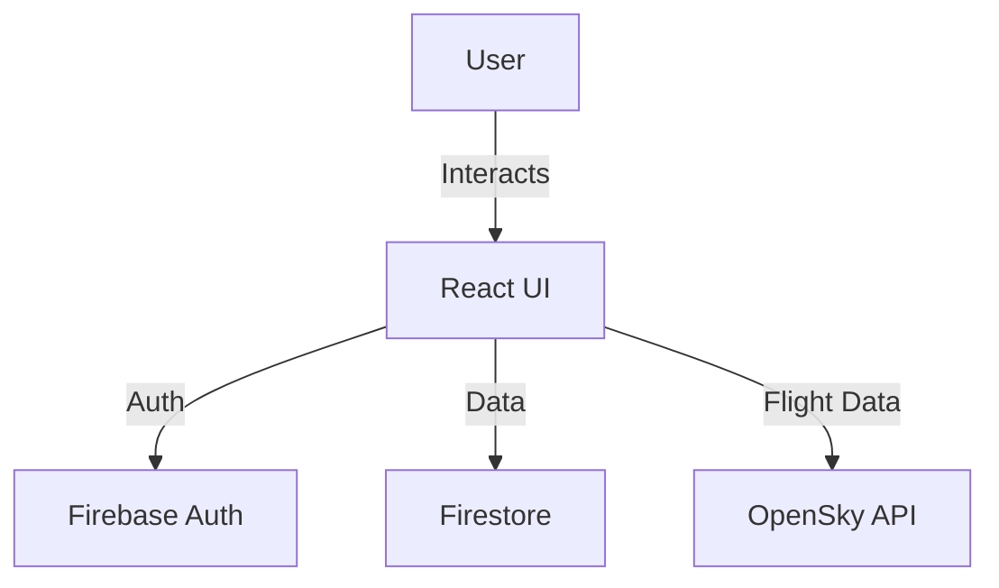
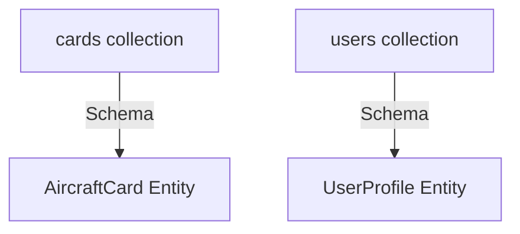

# Architecture Overview

## System Architecture
The application follows a client-side SPA architecture using React 19.2.4, Vite, and Tailwind CSS. Firebase is used for authentication and Firestore for data storage.

## Database Architecture
The database structure is defined in `firebase-blueprint.json` and uses Firestore.

