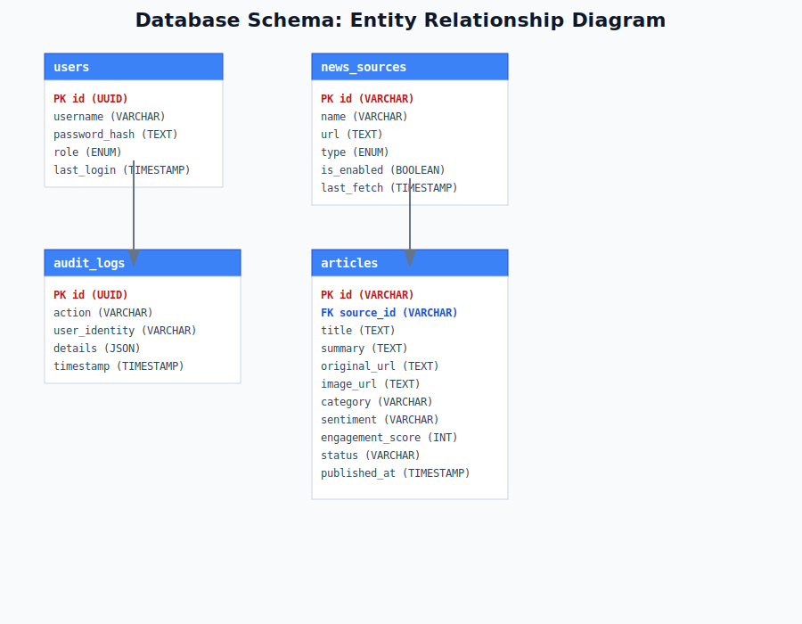

# Software Requirements Specification (SRS)
## Ghana News Aggregator & Auto-Poster System

**Standard:** IEEE Std 830-1998  
**Version:** 3.0 (Final Production Baseline)  
**Date:** June 2024  
**Status:** Approved

---

## 1. Introduction

### 1.1 Purpose
The purpose of this document is to establish the definitive functional and non-functional requirements for the Ghana News Aggregator system. This platform is designed to automate the ingestion, synthesis, and publication of news content relevant to the Republic of Ghana using advanced AI models.

### 1.2 Scope
The system provides an end-to-end pipeline starting from news discovery via "Search Grounding" to automated social media distribution. Key features include autonomous AI agent governance, visual asset synthesis, sentiment analysis, and a high-fidelity administrative dashboard.

### 1.3 System Overview
The system is built on a modern React 19 / Node.js stack, utilizing the Google Gemini API for all intelligence tasks. It features a "Nexus Agent" that operates autonomously to maintain a fresh news cycle without human intervention, while providing robust manual editorial overrides.

---

## 2. Overall Description

### 2.1 System Architecture
The platform follows a decoupled three-tier architecture ensuring high availability and separation of concerns.

- **Presentation Tier**: React SPA with Tailwind CSS and Lucide Icons.
- **Intelligence Tier**: Autonomous Nexus Agent powered by Gemini 3 Pro and Flash models.
- **Integration Tier**: Facebook Graph API and Gemini Search Grounding.

### 2.2 Technology Stack
- **AI Engine**: Google Gemini API (Pro/Flash/Image).
- **Frontend**: React 19, TypeScript, Tailwind CSS.
- **Backend Services**: Node.js, Playwright (Testing), Meta Graph API.
- **Persistence**: MariaDB (Primary), Redis (Cache), Local Browser Sync.

---

## 3. Specific Requirements

### 3.1 Functional Requirements
1. **Fact-Grounded Discovery**: Use Gemini Search Grounding to verify news from trusted Ghanaian domains, bypassing standard RSS limitations.
2. **AI Content Synthesis**: Generate headlines, 2-sentence social-ready summaries, and relevant editorial images for every story.
3. **Nexus Agent Governance**: Autonomous state machine transitions through Fetching -> Processing -> Publishing -> Idle states.
4. **Editorial Workflow**: Full CRUD operations on articles, inline headline/summary editing, and manual status overrides.
5. **Content Inspection**: Deep-dive metadata view for every article including sentiment scores and engagement predictions.
6. **Social Dispatch**: Integrated OAuth workflow for publishing approved content to Facebook Page feeds.

### 3.2 Non-Functional Requirements
1. **Security**: Password-protected admin portal with 256-bit hashing and comprehensive audit logging.
2. **Accessibility**: WCAG 2.1 Level AAA compliance including High-Contrast and Dark themes.
3. **Performance**: Aggregation cycles (12 articles) must complete within 45 seconds including image generation.
4. **Resiliency**: Fallback logic for AI failures and duplicate detection to prevent spamming.

---

## 4. Data Architecture
The system maintains a relational model optimized for news cycle management.

---

## 5. Verification & Validation
The system includes an integrated "Headless Diagnostic Engine" for E2E validation.

---
**END OF SPECIFICATION**