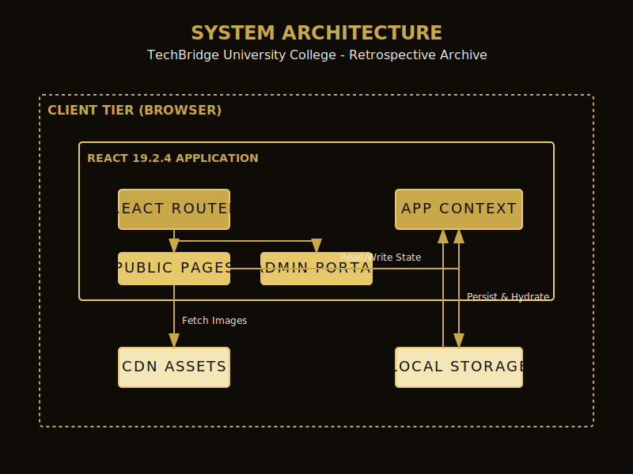
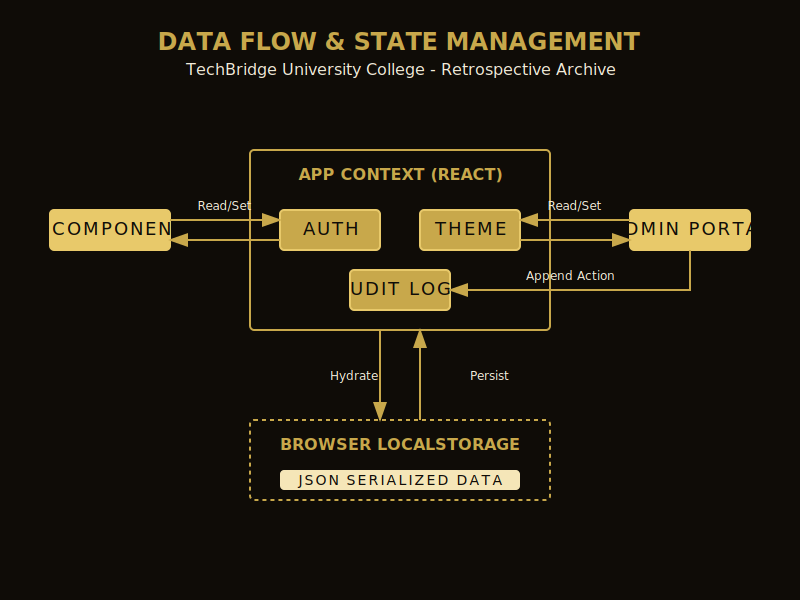

# Software Requirements Specification (SRS)
## TechBridge University College - Retrospective Archive (v3.0.0)

### 1. Introduction
#### 1.1 Purpose
This document specifies the software requirements for the "Retrospective Archive" web application, an online portfolio and archival system for a master potter, commissioned by TechBridge University College.

#### 1.2 Scope
The system provides a public-facing digital exhibition space (Home, Collection, Timeline, Artist, Contact) and a secure, authenticated Administrative Portal for system diagnostics, database monitoring, and test execution.

### 2. Overall Description
#### 2.1 User Characteristics
- **Public Users**: Art enthusiasts, collectors, and students seeking to view the pottery archive.
- **Administrators**: Curators and IT staff requiring access to system logs, diagnostics, and testing suites.

#### 2.2 Operating Environment
- **Client**: Modern web browsers (Chrome, Firefox, Safari, Edge).
- **Framework**: React 19.2.5 (Strict requirement).
- **Styling**: Tailwind CSS 4.0.

### 3. System Features
#### 3.1 Public Exhibition (Frontend)
- **Home**: Hero section with blended background imagery, key statistics, and featured signature pieces.
- **Collection**: A filterable grid of archived works utilizing high-resolution imagery.
- **Timeline**: An interactive, alternating chronological history of the artist's career.
- **Artist**: Biographical information and exhibition history.
- **Contact**: A functional inquiry form.

#### 3.2 Administrative Portal
- **Authentication**: Password-protected access (`/#/admin`).
- **Dashboard**: High-level system statistics and recent audit logs.
- **System Diagnostics**: Real-time environment and client information.
- **Database Monitor**: Simulated query tracking and latency metrics.
- **Test Suites**: Interactive dashboard to execute Playwright E2E tests.
- **Logs Viewer**: Comprehensive tracking of administrative actions.
- **Performance Metrics**: FCP, TTI, and resource load times.

#### 3.3 State & Theme Management
- **Context API**: Global state management for Authentication, Theme, and Audit Logs.
- **Persistence**: `localStorage` integration for state hydration across sessions.
- **Themes**: Support for Light, Dark (Editorial Ink), and High-Contrast modes.

### 4. Non-Functional Requirements
#### 4.1 Accessibility (A11y)
- 100% ARIA attribute coverage on all interactive nodes.
- Full keyboard navigability (`tabIndex`).
- Semantic HTML5 structure (`role="main"`, `role="navigation"`, etc.).

#### 4.2 Performance
- Optimized image loading.
- Framer Motion animations optimized for performance (viewport-triggered).

#### 4.3 Security
- Route protection for all `/admin/*` paths.
- Audit logging for all sensitive actions (login, logout, theme changes, test execution).

### 5. Architectural Diagrams

#### 5.1 System Architecture

#### 5.2 Database & Data Flow

