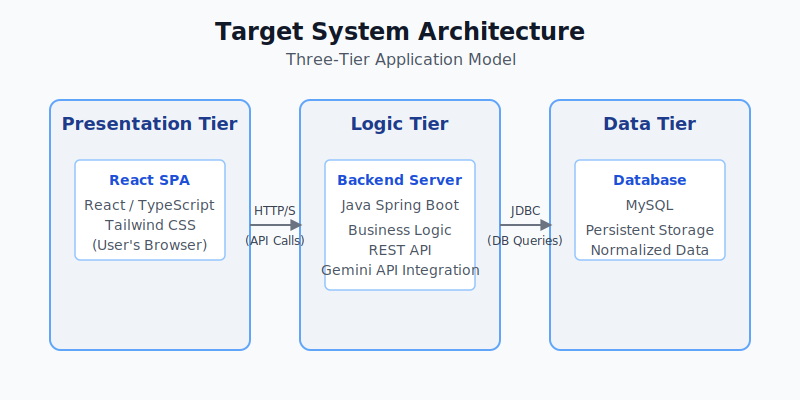
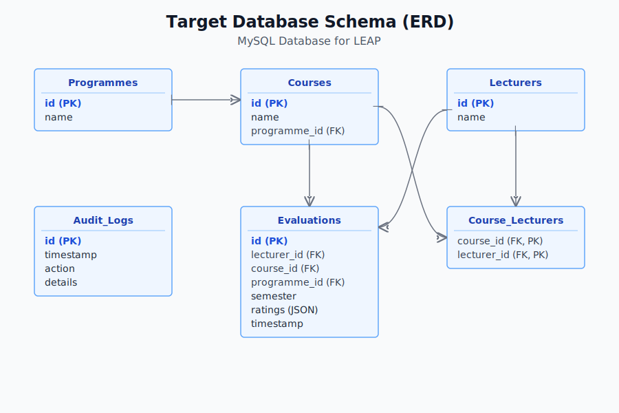

# Software Requirements Specification (SRS)
## Lecturer Assessment & Evaluation Portal (LEAP)

**Version 4.0**

---

### 1. Introduction

#### 1.1 Purpose
This document provides a detailed description of the requirements for the Lecturer Assessment & Evaluation Portal (LEAP). Its purpose is to define the features and functionalities of the current high-fidelity frontend prototype, which operates as a self-contained Single-Page Application (SPA).

#### 1.2 Scope
The system is a high-fidelity, frontend-only prototype implemented in React. It runs entirely in the user's browser, managing all data in-memory for the duration of a session. The scope includes:
- A public-facing **Assessment Portal** for students to submit anonymous lecturer and course evaluations.
- A secure, password-protected **Administrator Panel** for data visualization, curriculum management, audit logging, and system testing.
- An **AI-powered feature** using the Google Gemini API to extract and structure curriculum data from uploaded PDF timetables, with all processing handled client-side.
- An **In-Memory Audit Log** that tracks significant user and system actions.
- A simulated **E2E Self-Testing Suite** for in-browser validation of core application workflows.
- Full accessibility support, including **Light, Dark, and High-Contrast themes**.

#### 1.3 Definitions, Acronyms, and Abbreviations
- **SPA:** Single-Page Application
- **UI:** User Interface
- **E2E:** End-to-End (Testing)
- **SRS:** Software Requirements Specification
- **API:** Application Programming Interface
- **JSON:** JavaScript Object Notation

#### 1.4 References
- IEEE Std 830-1998, Recommended Practice for Software Requirements Specifications.

#### 1.5 Overview
This SRS is organized into three sections. Section 1 provides an introduction. Section 2 gives an overall description of the product, its users, and its operational constraints. Section 3 provides detailed functional, user interface, and non-functional requirements for the application.

---

### 2. Overall Description

#### 2.1 Product Perspective
The LEAP system is a standalone, frontend-only Single-Page Application (SPA) built with React and TypeScript. It brilliantly simulates the functionality of a full-stack system without a backend server or database.
- **Data Management:** All application data (curriculum, evaluations, audit logs) is initialized from local constants and managed in-memory within the React application's state. Data is not persisted between browser sessions.
- **API Simulation:** All business logic, including data submission and processing, is handled client-side within the React context and component state. There are no actual network requests to a backend API for data manipulation.

#### 2.2 Product Functions
- **Student Feedback Submission:** Allows students to select a programme, course, and lecturer, rate them against a detailed set of criteria, and submit the evaluation anonymously.
- **Secure Admin Access Simulation:** Provides a mock login mechanism (password is configurable via environment variable, defaults to `admin123`) to demonstrate role-based access to the administrative dashboard.
- **In-Memory Data Management:** All curriculum and evaluation data is managed within the application's state for a single session.
- **Client-Side AI-Powered Curriculum Management:** Administrators can upload a PDF timetable. The application reads the file, extracts its text content, calls the Google Gemini API to parse the text into structured JSON, and updates the application's in-memory curriculum data.
- **Client-Side Audit Logging:** The application records significant system events (e.g., login, submission, curriculum updates) in-memory, which are then displayed to the admin in a sortable, filterable table.
- **Self-Testing Suite:** An in-browser E2E test runner allows an administrator to verify core application workflows, such as form submission and logging.

#### 2.3 User Characteristics
1.  **Students (Anonymous Users):** General users who access the portal to provide feedback. They do not need to log in and are assumed to have no special technical expertise.
2.  **Administrators (Authenticated Users):** Staff or faculty who require access to aggregated evaluation data. They use a simulated login to access the dashboard and are expected to have basic computer literacy.

#### 2.4 Constraints
- **C1:** The application must be run in a modern web browser that supports JavaScript (ES6+).
- **C2:** An active internet connection is required for the AI-Powered Curriculum Management feature to communicate with the Google Gemini API.
- **C3:** A valid Google Gemini `API_KEY` must be configured in the environment for the PDF extraction feature to function. The application will show a warning if the key is missing.

#### 2.5 Assumptions and Dependencies
- **A1:** It is assumed that uploaded timetable PDFs are text-based and have a structure that the AI model can reasonably parse. Image-based PDFs will fail text extraction.
- **A2:** The user has a stable internet connection when using the AI features.

---

### 3. Specific Requirements

#### 3.1 Functional Requirements

##### FR1: Student Assessment Submission
- **FR1.1:** The user shall be presented with a two-column, visually-rich form for submitting an evaluation.
- **FR1.2:** The user must first select a Programme from a dropdown list populated from the current curriculum data.
- **FR1.3:** After selecting a programme, the user must select a Course from a dynamically populated dropdown.
- **FR1.4:** After selecting a course, the user must select a Lecturer from a dynamically populated dropdown of lecturers who teach that course. If a course has only one lecturer, that lecturer is automatically selected.
- **FR1.5:** The user shall rate the lecturer on criteria grouped into three accordion sections: "Lecturer's Delivery & Knowledge," "Course Content & Structure," and "Assessment & Feedback."
- **FR1.6:** For each criterion, the user shall select a rating from "Strongly Disagree" (1) to "Strongly Agree" (5).
- **FR1.7:** The form shall be validated to ensure a programme, course, lecturer, and all criteria are rated before submission.
- **FR1.8:** Upon successful submission, a "Thank You" confirmation message shall be displayed, and the form shall be reset. The new evaluation is added to the in-memory state.

##### FR2: Administrator Authentication
- **FR2.1:** The portal shall provide an "Admin" button in the header.
- **FR2.2:** Clicking the "Admin" button shall navigate the user to a login page.
- **FR2.3:** Access shall be protected by a simulated password check. The password can be set via the `ADMIN_PASSWORD` environment variable, defaulting to `admin123`.
- **FR2.4:** Upon successful authentication, the user is granted access to the Admin Dashboard, and a "Login" event is recorded in the audit log.
- **FR2.5:** A "Logout" button shall be available to the authenticated administrator, which returns them to the student/login view.

##### FR3: Administrator Dashboard
- **FR3.1:** The Admin Dashboard shall feature a tabbed navigation interface.
- **FR3.2:** The dashboard shall contain four sections: "Overview," "Curriculum AI," "Audit Log," and "Self-Testing."

##### FR4: Data Visualization (Overview Tab)
- **FR4.1:** The "Overview" tab shall display a master-detail view for analyzing lecturer evaluations.
- **FR4.2:** A list of all lecturers shall be displayed. A selected lecturer is highlighted for clarity.
- **FR4.3:** By default, a bar chart shall display the overall average evaluation score for all lecturers.
- **FR4.4:** Upon selecting a specific lecturer, the view shall update to show detailed statistics for that individual, including total evaluations and overall average score.
- **FR4.5:** A radar chart shall display the selected lecturer's average scores broken down by evaluation category.
- **FR4.6:** Recent written comments for the selected lecturer shall be displayed.

##### FR5: AI-Powered PDF Data Extraction (Curriculum AI Tab)
- **FR5.1:** The administrator shall be able to upload a PDF file.
- **FR5.2:** Before processing, a confirmation modal shall warn the admin that proceeding will clear all in-memory evaluation data for the current session.
- **FR5.3:** The frontend shall extract text from the PDF client-side using `pdf.js`.
- **FR5.4:** The extracted text shall be sent to the Google Gemini API with a prompt to structure the data into a specific JSON format (programmes, courses, lecturers).
- **FR5.5:** Upon receiving a valid JSON response, the frontend will replace the existing in-memory curriculum data and log a "Curriculum Updated" event.
- **FR5.6:** The system shall display clear status updates (processing, success, error) to the user during this process.

##### FR6: Audit Logging (Audit Log Tab)
- **FR6.1:** Key system events shall be logged with a timestamp, action type, and details.
- **FR6.2:** The "Audit Log" tab shall display all logged events in a table.
- **FR6.3:** The administrator shall be able to filter the logs by typing a search query that matches the action or details.
- **FR6.4:** The administrator shall be able to sort the log table by Timestamp, Action, or Details in ascending or descending order.

##### FR7: E2E Self-Testing (Self-Testing Tab)
- **FR7.1:** The "Self-Testing" tab shall provide a button to initiate an in-browser test suite.
- **FR7.2:** The suite shall simulate core user workflows, including Student Form Submission and Audit Log Entry Creation.
- **FR7.3:** Real-time feedback on the status of each test (e.g., Pending, Running, Passed, Failed) shall be displayed to the administrator.

#### 3.2 User Interface (UI) Requirements
- **UI1: Responsiveness:** The UI shall be responsive and adapt to screen sizes from mobile to desktop.
- **UI2: Theming:** The application shall support three user-selectable themes: a default Light Theme, a Dark Theme, and a High-Contrast Theme for accessibility.
- **UI3: Visual Design:** The student portal shall feature a modern, visually engaging dark theme with custom gradients and iconography. The admin portal shall feature a clean, professional, and data-centric design.
- **UI4: Accessibility:** The application uses ARIA attributes (e.g., `role="tab"`, `aria-expanded`, `aria-modal`) and provides clear visual feedback for interactive elements to meet accessibility standards. The High-Contrast theme ensures readability for visually impaired users.

#### 3.3 Non-Functional Requirements
- **NFR1: Performance:** All UI interactions and client-side data processing shall be smooth and responsive. Complex calculations are memoized using React hooks (`useMemo`, `useCallback`) to prevent unnecessary re-renders.
- **NFR2: Security:** The Google Gemini API key must not be hardcoded in the source code and is expected to be loaded from an environment variable. The admin password is for simulation purposes only and provides no real security.
- **NFR3: Maintainability:** The frontend code shall be well-structured and organized into modular components using a clear folder structure (e.g., `components`, `services`, `hooks`, `contexts`). The use of TypeScript ensures type safety and improves code quality.

---
### 4. System Architecture (Target)

The application is designed as a prototype with a clear path to evolve into a classic three-tier architecture.

---
### 5. Database Schema (Target)

The data persistence model for the target application is a normalized MySQL database.

