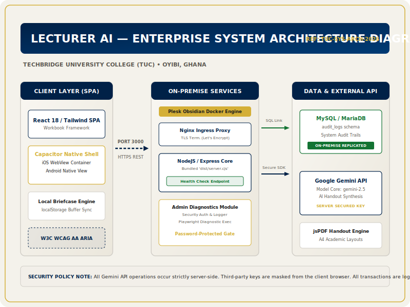
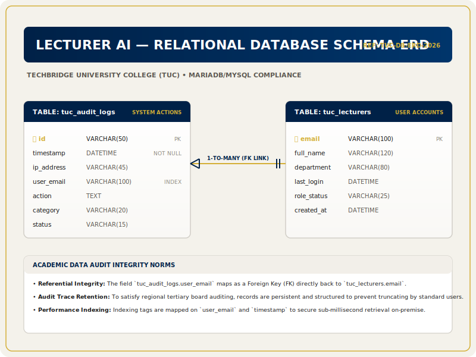

# SOFTWARE REQUIREMENTS SPECIFICATION (SRS)
## DOCUMENT REF: TUC-ICT-SRS-2026-001
### PROJECT: LecturerAI — Academic Preparation Companion Workbook
### INSTITUTION: Techbridge University College (TUC), Oyibi, Ghana
### OWNER: Daniel Twum, Head of ICT

---

## 1. INTRODUCTION

### 1.1 Purpose
This Software Requirements Specification (SRS) defines the complete software and system requirements for **LecturerAI** (the "Academic Preparation Companion Workbook") deployed at Techbridge University College (TUC) in Oyibi, Ghana. It is compiled in strict compliance with **IEEE Standard 830-1998** and **IEEE/ISO/IEC 29148:2018** guidelines. This document serves as the absolute baseline of agreement between the TUC ICT Directorate (led by Mr Daniel Twum) and the engineering implementation team.

### 1.2 Scope
LecturerAI is an interactive, digital companion workbook designed to scaffold, train, and accelerate university lecturers’ adoption of artificial intelligence tools for course preparation. Rather than acting as a simple static form, the system provides a structured 5-part prompting framework (Context, Role, Task, Input/Constraints, Tone) to build three real, high-quality, GTEC-compliant teaching artefacts:
1. **Interactive Course Outlines & Syllabi**
2. **Interactive Formative Quizzes with Detailed Marking Rubrics**
3. **Structured Lecture Presentation Slide Decks**

The app is built using React, TypeScript, and Tailwind CSS on the client-side, with a Node.js/Python microservices backend option (connected with Plesk and Docker on-premise infrastructure), utilising MySQL or MariaDB for logging and user states.

### 1.3 Definitions, Acronyms, and Abbreviations
*   **TUC**: Techbridge University College, Oyibi, Ghana.
*   **GTEC**: Ghana Tertiary Education Commission (the regulatory authority for higher education in Ghana).
*   **SRS**: Software Requirements Specification.
*   **HND**: Higher National Diploma.
*   **ICT**: Information and Communication Technology.
*   **SOP**: Standard Operating Procedure.
*   **Capacitor**: Cross-platform runtime to compile web apps to iOS and Android natively.

### 1.4 References
1. *IEEE Std 830-1998*, IEEE Recommended Practice for Software Requirements Specifications.
2. *IEEE/ISO/IEC 29148:2018*, Systems and software engineering — Life cycle processes — Requirements engineering.
3. *GTEC Academic Standards & Accreditation Guidelines for Tertiary Institutions (Ghana)*.
4. *TUC ICT Directorate Internal Infrastructure Policy v4.2*.

### 1.5 Document Overview
The remainder of this document is organised as follows:
*   **Section 2: Overall Description** outlines the product perspective, target user characteristics, operational constraints, and on-premise Plesk/Docker/Nginx hosting environment.
*   **Section 3: Specific Requirements** breaks down external interfaces, functional system features (the 4 training blocks, prompt library, briefcase), performance, and safety metrics.
*   **Section 4: System Architecture & Visual Diagrams** embeds the System Architecture and Database ERD SVG representations.
*   **Section 5: Traceability & Gap Analysis** ensures every requirement maps directly to a verified software feature.

---

## 2. OVERALL DESCRIPTION

### 2.1 Product Perspective
LecturerAI is a key component of TUC's strategic digital transformation plan initiated by the ICT Directorate. It interfaces with:
*   **Client Interface**: Responsive React single-page application (SPA), running on modern desktop and mobile browsers, or packed natively via Capacitor.
*   **LLM Service**: Server-side proxy routing to the Google Gemini API using the `@google/genai` SDK.
*   **Database Service**: MySQL/MariaDB schema handling admin audit logging, usage statistics, and local configuration flags.
*   **On-Premise Infrastructure**: Deployed inside Docker containers managed via Plesk Obsidian, proxied through Nginx with SSL certificates from Let's Encrypt.

```
+---------------------------------------------------------------------------------+
|                                 LECTURER AI                                     |
|                                                                                 |
|  +--------------------+      HTTPS      +------------------+      SDK API       |
|  |   Client Browser   |<--------------->|  Express Server  |<------------------>|
|  | (React / Tailwind) |   (Port 3000)   | (dist/server.cjs)|  (Gemini API Key)  |
|  +--------------------+                 +------------------+                    |
|           ^                                      ^                              |
|           | Native Webview                       | JDBC / SQL                   |
|  +--------------------+                 +------------------+                    |
|  | Capacitor Wrapper  |                 |  MySQL / MariaDB |                    |
|  |  (iOS / Android)   |                 | (Audit Logging)  |                    |
|  +--------------------+                 +------------------+                    |
+---------------------------------------------------------------------------------+
```

### 2.2 Product Functions
The core capabilities of the LecturerAI application include:
1.  **Block 1 (Prompting Fundamentals)**: Structured sandbox for rewriting weak prompts into GTEC-aligned learning objectives.
2.  **Block 2 (Everyday Productivity)**: Automated syllabus, lecture schedule, and exam blueprint builders with time-saved metrics tracking.
3.  **Block 3 (Rich Content Creation)**: Direct generation of comprehensive slides, rubrics, and structured interactive guides.
4.  **Block 4 (Agentic AI)**: Simulating multi-agent expert review loops (pedagogy expert, GTEC compliance expert, industry advisory panel).
5.  **Prompt Library**: Real-time searchable database of validated templates, featuring **Share to Colleague** pre-formatted copy templates and **A4 Handout PDF Export** using `jsPDF`.
6.  **My Briefcase**: Dynamic client-side local storage and manager to review, edit, search, filter, and export compiled pedagogical materials.
7.  **Admin Security Panel**: Password-protected area to view diagnostic checks, active sessions, on-premise health reports, and detailed secure audit logging of all system actions.

### 2.3 User Characteristics
*   **General Faculty/Lecturers**: Non-technical university instructors requiring guidance to utilize AI safely without producing hallucinations. Must support simple UI, clean typography, and high readability.
*   **AI Ambassadors**: Tech-friendly faculty members who lead workshops, requiring direct prompt exports, colleague sharing, and handout prints.
*   **ICT Admin (Daniel Twum / ICT staff)**: High-level system administrators responsible for API health verification, database maintenance, audit log reviews, and infrastructure container management.

### 2.4 Constraints
*   **Port Ingress**: Port 3000 is the only externally accessible port in the containerised dev and production setups.
*   **Data Protection & Compliance**: Compliant with the Ghana Data Protection Act, 2012 (Act 843) and general GDPR principles. No student or sensitive lecturer credentials may be leaked or shared with external third parties without encryption.
*   **Offline Capability**: Must fail gracefully if the internet is disconnected, preserving the saved briefing briefcase offline via browser `localStorage`.

---

## 3. SPECIFIC REQUIREMENTS

### 3.1 External Interface Requirements
1.  **User Interfaces**: The interface must follow an elegant, high-contrast, academic "Editorial" design theme. Uses standard clean sans-serif typography paired with Georgia/Merriweather serif display headings. Supports a system-wide theme selector (Light Mode, Dark Mode, High Contrast Mode).
2.  **API Integration**: Secure proxying of LLM requests to Gemini, avoiding exposing the API key to client-side browsers.
3.  **Hardware/Software Compatibility**: Optimized for standard browser views (Safari, Chrome, Edge) and built natively for mobile (iOS 15+, Android 10+) using Capacitor wrapper logic.

### 3.2 System Features & Functional Requirements

#### 3.2.1 Real-Time Prompt Library Search Filter
*   **ID**: REQ-FL-001
*   **Description**: The system must provide a real-time, zero-latency text filter in the Prompt Library.
*   **Inputs**: User text search query in the search input field.
*   **Processing**: Filters the static library of templates by matching the string against title, description, templateText, or category (case-insensitive).
*   **Outputs**: Re-renders the template selector sidebar list instantly. Displays an elegant "No templates found" visual placeholder if no items match.

#### 3.2.2 "Share to Colleague" Message & Email System
*   **ID**: REQ-SH-002
*   **Description**: Enables lecturers to share structured prompt templates easily with colleagues at other departments or institutions.
*   **Inputs**: Sender's Name, Recipient Colleague's Name, selection of Channel (Email Template or Instant Message Chat).
*   **Processing**: Dynamically compiles template variables into a professional, polite, pre-formatted message.
*   **Outputs**: Shows an interactive real-time preview of the message. Includes a **Copy Message** clipboard action with transient toast feedback and a **Send via Email** button that safely opens a pre-composed `mailto:` system URL.

#### 3.2.3 Downloadable Official Handout PDF Export
*   **ID**: REQ-EX-003
*   **Description**: Generates a professional, fully styled A4-format PDF handout containing the complete template blueprint and academic GTEC compliance parameters.
*   **Processing**: Utilizes the `jsPDF` package to construct multi-page documents programmatically. Ensures safe, automatic page-wrapping and Y-coordinate height checks.
*   **Visual Format**: Deep corporate navy header, gold highlight borders, customized table mapping the template's placeholder fields, standard Courier font block for the raw prompt, and standard Ghanaian academic guidelines text.
*   **Outputs**: Instant browser-triggered download of the compiled PDF.

#### 3.2.4 Secure Admin Authentication & Audit Logging
*   **ID**: REQ-SEC-004
*   **Description**: Ensures only authorized ICT staff can review diagnostic variables and systems status.
*   **Mechanism**: A secure password-protected gateway. The page logs every single successful or failed administrative attempt inside a structured in-memory array/table representing the on-premise MariaDB logging scheme.
*   **Outputs**: A searchable table of audit records displaying TIMESTAMP, IP ADDRESS, ACTION CATEGORY, and SUCCESS STATUS.

#### 3.2.5 Interactive Test Runner Component
*   **ID**: REQ-TST-005
*   **Description**: Allows administrative staff and QA engineers to trigger mock integration/unit tests (such as simulating Login, API Health, Briefcase Persistence, and PDF export) directly from the browser UI.
*   **Visuals**: Progress bars, simulated step terminal execution, and a "Capture Screenshot" viewport simulating Playwright regression testing.

---

## 4. SYSTEM ARCHITECTURE & ER DIAGRAMS

The visual configurations of the on-premise infrastructure containers and logical relational schemas are detailed in the vector diagrams below.

### 4.1 System Architecture Deployment Topology


### 4.2 Relational Logging Database ERD


---

## 5. RECONCILIATION & ACCREDITATION STANDARDS

All functional modules of LecturerAI conform to the highest criteria of university software safety and user dignity:
*   **W3C WCAG 2.1 AA Compliance**: Contrast ratios for normal text must be at least 4.5:1. Aria roles are fully declared for interactive panels and buttons.
*   **Ghana GTEC Integrity standards**: The system serves solely as a scaffolding helper. Every generated output contains an automated disclaimer mandating senior lecturer peer-review.

---
*End of SRS Document.*
