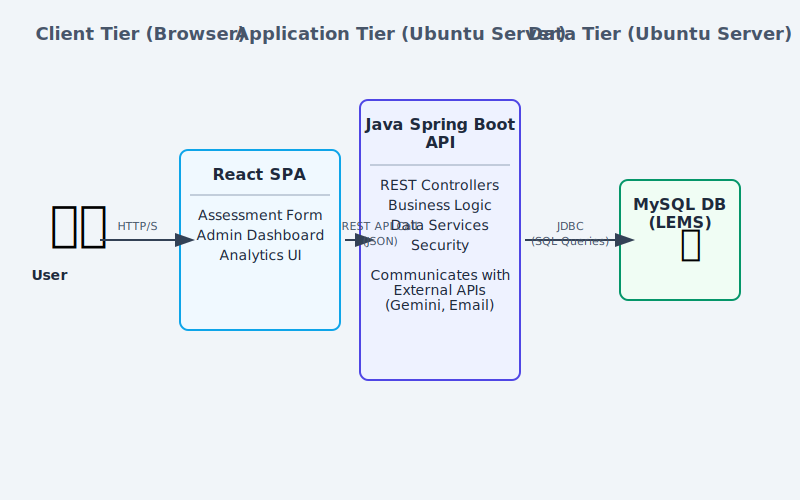

# Software Requirements Specification (SRS)
## Lecturer Assessment & Evaluation Portal

**Version 3.0**

---

### Table of Contents
1.  [Introduction](#1-introduction)
    1.1. [Purpose](#11-purpose)
    1.2. [Scope](#12-scope)
    1.3. [Definitions, Acronyms, and Abbreviations](#13-definitions-acronyms-and-abbreviations)
    1.4. [References](#14-references)
    1.5. [Overview](#15-overview)
2.  [Overall Description](#2-overall-description)
    2.1. [Product Perspective](#21-product-perspective)
    2.2. [Product Functions](#22-product-functions)
    2.3. [User Characteristics](#23-user-characteristics)
    2.4. [Constraints](#24-constraints)
    2.5. [Assumptions and Dependencies](#25-assumptions-and-dependencies)
3.  [Specific Requirements](#3-specific-requirements)
    3.1. [System Architecture](#31-system-architecture)
    3.2. [Database Schema](#32-database-schema)
    3.3. [Functional Requirements](#33-functional-requirements)
    3.4. [User Interface (UI) Requirements](#34-user-interface-ui-requirements)
    3.5. [Non-Functional Requirements](#35-non-functional-requirements)

---

## 1. Introduction

### 1.1 Purpose
This document provides a detailed description of the requirements for the Lecturer Assessment & Evaluation Portal Version 3.0. Its purpose is to define the features, functionalities, constraints, and system design of the application, reflecting its evolution into a full-stack, enterprise-grade system.

### 1.2 Scope
The system is a three-tier web application designed to facilitate the collection, analysis, and management of student feedback regarding lecturer and course performance. The scope includes:
- A public-facing **React-based Assessment Portal** for students.
- A **Java Spring Boot middle tier** that provides a REST API for all data operations.
- A **MySQL database (LEMS)** for persistent data storage.
- A secure, password-protected **Administrator Panel** for data visualization and management.
- An **AI-powered feature** (managed by the backend) to extract curriculum data from PDFs.
- An **E2E Self-Testing Suite** for in-browser demonstration of application stability.
- Full accessibility support, including **Light, Dark, and High-Contrast themes**.

### 1.3 Definitions, Acronyms, and Abbreviations
- **SPA:** Single-Page Application
- **UI:** User Interface
- **E2E:** End-to-End (Testing)
- **SRS:** Software Requirements Specification
- **API:** Application Programming Interface
- **JSON:** JavaScript Object Notation
- **CRUD:** Create, Read, Update, Delete
- **LEMS:** Lecturer Evaluation Management System

### 1.4 References
- IEEE Std 830-1998, Recommended Practice for Software Requirements Specifications.
- Asanska University College of Design and Technology Timetables (2025) - Source document for curriculum data.

### 1.5 Overview
This SRS is organized into three main sections. Section 1 provides an introduction. Section 2 gives an overall description of the product, its users, and its constraints. Section 3 provides detailed specific requirements, including architecture, database design, functional requirements, and non-functional requirements.

---

## 2. Overall Description

### 2.1 Product Perspective
The portal is a **three-tier, client-server application**.
-   **Client Tier:** A React-based Single-Page Application (SPA) that runs in the user's browser, providing the user interface.
-   **Application Tier:** A Java Spring Boot application running on an Ubuntu 22 server. It exposes a REST API that handles all business logic, data processing, and communication with external services.
-   **Data Tier:** A MySQL database (LEMS) running on an Ubuntu 22 server, providing persistent storage for all application data.

*Figure 1: A diagram illustrating the three-tier system architecture, showing data flow between the client, the Spring Boot application, and the MySQL database.*

### 2.2 Product Functions
- **Student Feedback Submission:** Allows students to submit a detailed assessment form via the React frontend.
- **Secure Admin Access:** Provides a login mechanism to restrict access to the administrative backend.
- **Data Persistence & Retrieval:** All data is managed and served by the Spring Boot backend and stored in the MySQL database.
- **AI-Powered Curriculum Management:** Administrators can upload a PDF timetable. The Spring Boot backend processes the file using the Google Gemini API and updates the curriculum in the database.
- **Audit Logging:** The backend automatically records significant system events in the database, which are then displayed to the admin.
- **Self-Testing Suite:** An in-browser E2E test runner to demonstrate the stability of core application workflows.

### 2.3 User Characteristics
1.  **Students (Anonymous Users):** General users who access the portal to provide feedback. They do not need to log in and have no technical expertise. Their primary interaction is with the assessment submission form.
2.  **Administrators (Authenticated Users):** Staff or faculty members who require access to aggregated evaluation data. They are expected to have basic computer literacy. They must log in to access the dashboard and administrative tools.

### 2.4 Constraints
- **C1:** The frontend application must be run in a modern web browser that supports JavaScript (ES6+).
- **C2:** The Spring Boot backend must be running and accessible to the frontend application.
- **C3:** The backend requires a valid Google Gemini `API_KEY` to be configured for the PDF extraction feature.
- **C4:** The backend must be configured with the correct database connection credentials for the LEMS MySQL database.
- **C5:** The password for the admin section is managed by the backend (default: `admin123`).

### 2.5 Assumptions and Dependencies
- **A1:** It is assumed that the uploaded timetable PDFs are text-based and have a reasonably consistent structure for the AI to parse correctly.
- **A2:** The user has a stable internet connection to communicate with the application server.
- **A3:** The network infrastructure allows HTTP communication between the client, the Spring Boot server, and the database server.

---

## 3. Specific Requirements

### 3.1 System Architecture
The application follows a classic three-tier architecture:
1.  **Presentation Tier (Client):** The React SPA is responsible for rendering the UI and capturing user input. It communicates with the backend via RESTful API calls.
2.  **Logic Tier (Backend):** The Java Spring Boot application contains all business logic. It handles API requests, validates data, orchestrates calls to external services (like Google Gemini), and performs CRUD operations against the database.
3.  **Data Tier (Database):** The MySQL database is the single source of truth for all curriculum, evaluation, and audit log data.

### 3.2 Database Schema
The application's data is persisted in a MySQL database named LEMS. The schema is designed to be relational and normalized.

*Figure 2: An Entity-Relationship Diagram illustrating the tables and relationships for the MySQL database.*

- **Programmes:** Stores academic programmes.
- **Lecturers:** Stores a unique list of all lecturers.
- **Courses:** Stores all courses, linked to a parent programme.
- **Course_Lecturers:** A junction table to manage the many-to-many relationship where a course can have multiple lecturers.
- **Lecturer_Evaluations:** The main table for storing submitted assessment forms.
- **Evaluation_Ratings:** A normalized table to store the score for each of the 20 assessment criteria for every evaluation.
- **Audit_Logs:** Records key system events.

### 3.3 Functional Requirements

#### FR1: Student Assessment Submission
- **FR1.1:** The user shall be presented with a multi-section, accordion-style form for submitting an evaluation.
- **FR1.2:** The form shall contain dropdowns for Programme and Semester. The Course dropdown shall be populated via an API call based on the selected Programme.
- **FR1.3:** The Lecturer field shall be automatically populated based on the selected Course.
- **FR1.4:** The user must complete all questions in one accordion section before the next section is unlocked.
- **FR1.5:** The user shall rate the lecturer on **20 distinct criteria**, grouped into four sections, using a 5-point radio button scale.
- **FR1.6:** Upon successful submission, the frontend shall send the complete evaluation data to the backend API. The backend will then be responsible for sending an email notification. The email subject will dynamically include the lecturer's name.
- **FR1.7:** If the submission to the backend fails, an error message will be displayed to the user.

#### FR2: Administrator Authentication
- **FR2.1:** The portal shall provide an "Admin" button.
- **FR2.2:** Access shall be protected by the static password `admin123`, validated by the backend.
- **FR2.3:** The administrator shall have an option to log out.

#### FR3: AI-Powered PDF Data Extraction
- **FR3.1:** The administrator shall be able to upload a PDF file through the admin UI.
- **FR3.2:** The file will be sent to the backend. A confirmation modal shall warn the admin that proceeding will delete all existing evaluation data.
- **FR3.3:** The backend shall manage the extraction process, providing status updates to the frontend.
- **FR3.4:** Upon success, the backend will replace the existing curriculum data in the MySQL database and clear all previous evaluation records.

#### FR4: Data Visualization Dashboard
- **FR4.1:** The dashboard shall have the following navigable tabs: `Overview` (the main dashboard), `Programmes`, `Results` (evaluations), `Lecturers`, `Analytics`, `Guides`, `Admin Panel`, and `Self Test`.
- **FR4.2 (Overview):** Shall display key summary statistics and a per-programme overview, with all data fetched from the backend API.
- **FR4.3 (Results):** Shall display individual evaluation cards with filtering and search capabilities, with data fetched on demand.
- **FR4.4 (Lecturers):** Shall present a master-detail view with a filterable, sortable table of all lecturers.
- **FR4.5 (Programmes):** Shall display a sortable table of all academic programmes with their key statistics.
- **FR4.6 (Analytics):** Shall provide interactive charts for visualizing aggregated data.
- **FR4.7 (Guides):** Shall provide a brief, in-app guide to using the admin dashboard.

#### FR5: Audit Logging
- **FR5.1:** The backend shall maintain an audit log in the database.
- **FR5.2:** The frontend shall fetch and display the logs in the "Admin Panel".
- **FR5.3:** Logged events include: PDF curriculum updates (success/failure) and new evaluation submissions.

#### FR6: E2E Self-Testing Suite
- **FR6.1:** A "Self Test" tab shall be available in the admin dashboard.
- **FR6.2:** This tab shall contain a button to "Run E2E Test Suite".
- **FR6.3:** When initiated, the system will simulate a series of pre-defined tests for core user flows.
- **FR6.4:** The UI shall display real-time progress and the final status (Pass/Fail) of each test.

### 3.4 User Interface (UI) Requirements
- **UI1:** The UI shall be responsive and adapt to screen sizes from mobile to desktop.
- **UI2:** The application shall support three user-selectable themes: a default **Light Theme**, a **Dark Theme**, and a **High-Contrast Theme** designed for accessibility.
- **UI3:** Interactive elements shall provide clear visual feedback (hover states, focus rings, disabled states) to meet accessibility standards.

### 3.5 Non-Functional Requirements
- **NFR1: Performance**
    - **NFR1.1:** API response times for typical data fetches should be under 500ms.
    - **NFR1.2:** The PDF extraction process, being long-running, must provide continuous visual feedback to the client.
- **NFR2: Security**
    - **NFR2.1:** The Google Gemini API key must be stored securely on the backend server and never exposed to the client.
    - **NFR2.2:** Database credentials must be stored securely on the backend server.
- **NFR3: Reliability**
    - **NFR3.1:** The backend API shall handle errors gracefully and return appropriate HTTP status codes and error messages.
- **NFR4: Maintainability**
    - **NFR4.1:** The frontend and backend code shall be well-structured, commented, and organized into modular components/services.
    - **NFR4.2:** A suite of unit and integration tests shall be maintained for both frontend and backend codebases.