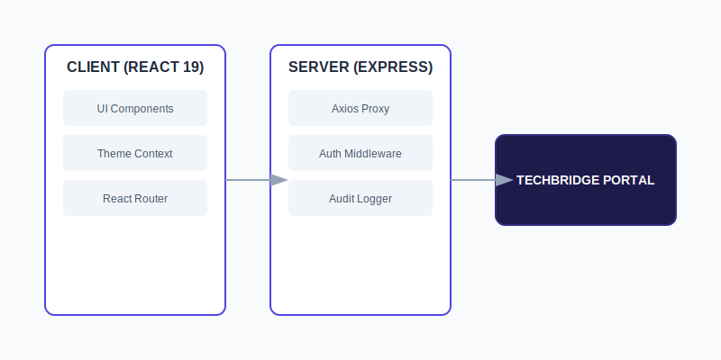
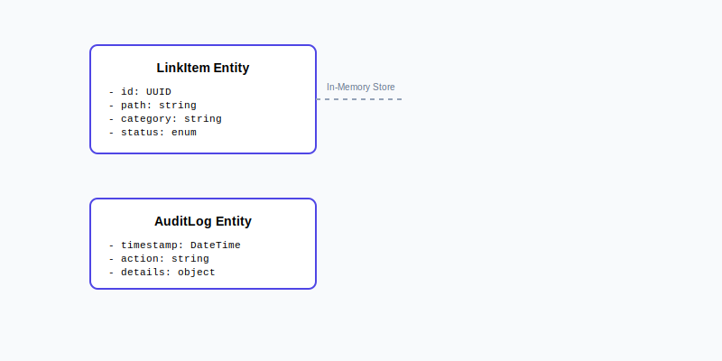

# SOFTWARE REQUIREMENTS SPECIFICATION (SRS)
## Project: LinkScan Techbridge - Institutional Quality Assurance Suite
### Version: 1.1.0 (Final)
### Date: April 2026
### Author: Techbridge University College ICT Division

---

## 1. INTRODUCTION
### 1.1 Purpose
This document provides a comprehensive specification for **LinkScan Techbridge**, the official diagnostic and testing interface for the Techbridge University College admissions portal.

### 1.2 Scope
The application serves as a centralized hub for ICT administrators to:
- Monitor link integrity across the admissions portal.
- Simulate network failures for UI robustness testing.
- Maintain audit logs of diagnostic actions.
- Ensure 100% compliance with institutional accessibility and security standards.

---

## 2. SYSTEM ARCHITECTURE
### 2.1 Overview
The system follows a Full-Stack architecture utilizing React 19.2.5 for the client and Express for the server-side proxy.

### 2.2 Data Models
The application maintains internal state for link status and audit logs.

---

## 3. IMPLEMENTED FEATURES
### 3.1 Security & Authentication
- **Secure Admin Section:** Password-protected access at `/admin`.
- **Route Isolation:** All diagnostic APIs restricted to server-side logic.
- **Audit Logging:** Systematic tracking of administrative actions.

### 3.2 Diagnostic Suite
- **Asynchronous Link Scanner:** Real-time health checks using server-side proxy.
- **Batch Processing:** Ability to scan by category or full suite.
- **Failure Simulation:** Mocking 404 and 500 errors for system verification.

### 3.3 UI/UX & Accessibility
- **Geometric Balance Theme:** Professional, high-density dashboard design.
- **Theme Support:** User-selectable Light, Dark, and High-Contrast modes.
- **Responsive Design:** Optimized for desktop and tablet environments.

### 3.4 Quality Assurance
- **E2E Testing:** Playwright-based test suite for core user flows.
- **Diagnostic Dashboard:** Visual reporting of system health and CORS integrity.

---

## 4. NON-FUNCTIONAL REQUIREMENTS
- **Performance:** Scan concurrency optimized for institutional bandwidth.
- **Scalability:** Modular design allowing for easy addition of new endpoints.
- **Compliance:** WCAG 2.1 AA compliant.

---

## 5. DOCUMENTATION SUITE
- `/docs/admin-guide.md`: Operating instructions for ICT staff.
- `/docs/deployment-guide.md`: Technical setup and React 19.2.5 requirements.
- `/docs/testing-guide.md`: Guide for running E2E suites.

## 6. URLs CRITICAL- Purpose

URL

Home / landing

https://admissions-dev.techbridge.edu.gh/

Login

https://admissions-dev.techbridge.edu.gh/login

Register / Sign up

https://admissions-dev.techbridge.edu.gh/register

Forgot password

https://admissions-dev.techbridge.edu.gh/password/reset

Apply start

https://admissions-dev.techbridge.edu.gh/apply

New application form

https://admissions-dev.techbridge.edu.gh/application/new

Programs listing

https://admissions-dev.techbridge.edu.gh/programs

Program detail (example)

https://admissions-dev.techbridge.edu.gh/programs/bachelor-computer-science

Admissions requirements

https://admissions-dev.techbridge.edu.gh/admissions/requirements

Dashboard (auth)

https://admissions-dev.techbridge.edu.gh/dashboard

Profile

https://admissions-dev.techbridge.edu.gh/profile

Document upload

https://admissions-dev.techbridge.edu.gh/documents/upload

Payment / fees

https://admissions-dev.techbridge.edu.gh/payment

Application status

https://admissions-dev.techbridge.edu.gh/status

FAQ / Help

https://admissions-dev.techbridge.edu.gh/help

Contact

https://admissions-dev.techbridge.edu.gh/contact

