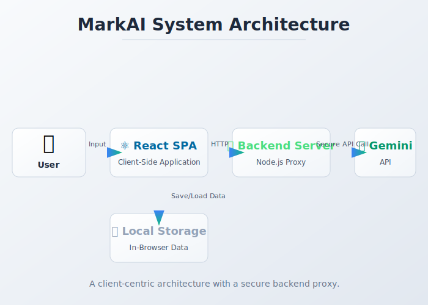

# markai - Ultimate Self-Replicating Blueprint (AGENT.md)

> [!IMPORTANT]
> This is an auto-generated monolithic blueprint containing the source code for markai.

### FILE: .env.example
```text
API_KEY=
[REDACTED_CREDENTIAL]
GOOGLE_CLIENT_SECRET=

[REDACTED_CREDENTIAL]

### FILE: .env.local
```text
# AI Configuration for MarkAI
API_KEY=[REDACTED_CREDENTIAL]
GOOGLE_CLIENT_ID=[REDACTED_CREDENTIAL]
GOOGLE_CLIENT_SECRET=[REDACTED_CREDENTIAL]
VITE_GOOGLE_CLIENT_ID=[REDACTED_CREDENTIAL]
VITE_GOOGLE_REDIRECT_URI=https://ai-tools.techbridge.edu.gh/markai/auth/google/callback
PORT=3000

```

### FILE: App.tsx
```typescript
import React, { useState, Suspense, lazy } from 'react';

// Always-loaded (small, needed immediately)
import LoginView from './components/LoginView';
import Header from './components/Header';
import HomeView from './components/HomeView';
import FeatureDisabledView from './components/FeatureDisabledView';
import Spinner from './components/Spinner';

// Lazy-loaded views (split into separate chunks)
const ContentGenerator  = lazy(() => import('./components/ContentGenerator'));
const CalendarView      = lazy(() => import('./components/CalendarView'));
const ImageEditor       = lazy(() => import('./components/ImageEditor'));
const PricingPage       = lazy(() => import('./components/PricingPage'));
const AdminDashboard    = lazy(() => import('./components/AdminDashboard'));
const AdminLoginModal   = lazy(() => import('./components/AdminLoginModal'));
const TestingView       = lazy(() => import('./components/TestingView'));
const DemoRunner        = lazy(() => import('./components/DemoRunner'));
const LiveChatView      = lazy(() => import('./components/LiveChatView'));
const DemoVideoModal    = lazy(() => import('./components/DemoVideoModal'));

// Context Imports
import { AuthProvider, useAuth } from './contexts/AuthContext';
import { ThemeProvider } from './contexts/ThemeContext';
import { FeatureFlagsProvider, useFeatureFlags } from './contexts/FeatureFlagsContext';
import { PostsProvider, usePosts } from './contexts/PostsContext';
import { AdminProvider, useAdmin } from './contexts/AdminContext';
import { BookingProvider } from './contexts/BookingContext';

import { AppView, FeatureFlag } from './types';

const ViewLoader = () => (
  <div className="min-h-[60vh] flex items-center justify-center">
    <Spinner className="w-10 h-10 border-accent-primary" />
  </div>
);

const AdminRoute: React.FC<{ children: React.ReactNode }> = ({ children }) => {
  const { isAdmin } = useAdmin();
  return isAdmin ? <>{children}</> : <FeatureDisabledView featureName="Admin Area Access" />;
};

const AppContent: React.FC = () => {
  const { currentUser, isLoading: isAuthLoading } = useAuth();
  const { isAdmin, isCheckingAdmin } = useAdmin();
  const { featureFlags } = useFeatureFlags();
  const { addPost } = usePosts();

  const [activeView, setActiveView]           = useState<AppView>(AppView.HOME);
  const [isShowingAdminLogin, setAdminLogin]  = useState(false);
  const [isDemoRunning, setDemoRunning]       = useState(false);
  const [isShowingDemoVideo, setDemoVideo]    = useState(false);

  const handleAdminNavigate = () => {
    if (isAdmin) setActiveView(AppView.ADMIN);
    else setAdminLogin(true);
  };

  const enabled = (flag: FeatureFlag) => featureFlags[flag];

  if (isAuthLoading || isCheckingAdmin) {
    return (
      <div className="min-h-screen flex items-center justify-center bg-secondary">
        <Spinner className="w-12 h-12 border-accent-primary" />
      </div>
    );
  }
  if (!currentUser) return <LoginView />;

  const renderView = () => {
    if (activeView === AppView.HOME) {
      return <HomeView onNavigate={setActiveView} onStartDemo={() => setDemoVideo(true)} />;
    }
    const inner = (() => {
      switch (activeView) {
        case AppView.GENERATOR:    return enabled(FeatureFlag.AI_CONTENT_GENERATION) ? <ContentGenerator /> : <FeatureDisabledView featureName="AI Content Generation" />;
        case AppView.IMAGE_EDITOR: return enabled(FeatureFlag.IMAGE_EDITING)         ? <ImageEditor />       : <FeatureDisabledView featureName="AI Image Tools" />;
        case AppView.CALENDAR:     return enabled(FeatureFlag.CAMPAIGN_SCHEDULING)   ? <CalendarView />      : <FeatureDisabledView featureName="Campaign Scheduling" />;
        case AppView.LIVE_CHAT:    return enabled(FeatureFlag.LIVE_AUDIO)            ? <LiveChatView />      : <FeatureDisabledView featureName="Live AI Chat" />;
        case AppView.ADMIN:        return <AdminRoute><AdminDashboard onNavigate={setActiveView} /></AdminRoute>;
        case AppView.PRICING:      return <PricingPage />;
        case AppView.TESTING_HOME: return <AdminRoute><TestingView onStartDemo={() => setDemoRunning(true)} /></AdminRoute>;
        default:                   return <HomeView onNavigate={setActiveView} onStartDemo={() => setDemoVideo(true)} />;
      }
    })();
    return <div className="p-4 sm:p-6 lg:p-8">{inner}</div>;
  };

  return (
    <div className="min-h-screen bg-primary text-primary font-sans transition-colors duration-300">
      <Header activeView={activeView} setActiveView={setActiveView} onAdminNavigate={handleAdminNavigate} />
      <main id="main-content">
        <Suspense fallback={<ViewLoader />}>
          {renderView()}
        </Suspense>
      </main>
      <Suspense fallback={null}>
        {isShowingAdminLogin && <AdminLoginModal onClose={() => setAdminLogin(false)} onLoginSuccess={() => { setAdminLogin(false); setActiveView(AppView.ADMIN); }} />}
        {isDemoRunning       && <DemoRunner onClose={() => setDemoRunning(false)} setActiveView={setActiveView} onSchedulePost={addPost} />}
        {isShowingDemoVideo  && <DemoVideoModal onClose={() => setDemoVideo(false)} />}
      </Suspense>
    </div>
  );
};

const App: React.FC = () => (
  <ThemeProvider>
    <BookingProvider>
      <AuthProvider>
        <FeatureFlagsProvider>
          <PostsProvider>
            <AdminProvider>
              <AppContent />
            </AdminProvider>
          </PostsProvider>
        </FeatureFlagsProvider>
      </AuthProvider>
    </BookingProvider>
  </ThemeProvider>
);

export default App;

```

### FILE: components/AdminDashboard.tsx
```typescript

import React from 'react';
import { AuditLogEntry, AppView, FeatureFlag, GeminiModel } from '../types';
import { useAdmin } from '../contexts/AdminContext';
import { useFeatureFlags } from '../contexts/FeatureFlagsContext';

const FeatureToggle: React.FC<{
  flag: FeatureFlag,
  label: string,
  description: string,
  isEnabled: boolean,
  onToggle: (flag: FeatureFlag) => void
}> = ({ flag, label, description, isEnabled, onToggle }) => (
  <div className="flex items-center justify-between p-4 border border-default rounded-lg bg-primary">
    <div>
      <h4 className="font-semibold text-primary">{label}</h4>
      <p className="text-sm text-secondary">{description}</p>
    </div>
    <label htmlFor={flag} className="flex items-center cursor-pointer">
      <div className="relative">
        <input type="checkbox" id={flag} className="sr-only" checked={isEnabled} onChange={() => onToggle(flag)} />
        <div className={`block w-14 h-8 rounded-full ${isEnabled ? 'bg-accent-primary' : 'bg-gray-600'}`}></div>
        <div className={`dot absolute left-1 top-1 bg-white w-6 h-6 rounded-full transition-transform ${isEnabled ? 'translate-x-6' : ''}`}></div>
      </div>
    </label>
  </div>
);


interface AdminDashboardProps {
  onNavigate?: (view: AppView) => void;
}

const AdminDashboard: React.FC<AdminDashboardProps> = ({ onNavigate }) => {
  const { auditLogs, geminiModel, setGeminiModel, onToggleFlag, adminLogout } = useAdmin();
  const { featureFlags } = useFeatureFlags();

  const formatAction = (action: AuditLogEntry['action']) => {
    switch(action) {
      case 'ADMIN_LOGIN_SUCCESS': return <span className="px-2 inline-flex text-xs leading-5 font-semibold rounded-full bg-green-100 text-green-800 dark:bg-green-500/10 dark:text-green-400">Login Success</span>;
      case 'ADMIN_LOGIN_FAIL': return <span className="px-2 inline-flex text-xs leading-5 font-semibold rounded-full bg-yellow-100 text-yellow-800 dark:bg-yellow-500/10 dark:text-yellow-400">Login Fail</span>;
      case 'ADMIN_LOGOUT': return <span className="px-2 inline-flex text-xs leading-5 font-semibold rounded-full bg-blue-100 text-blue-800 dark:bg-blue-500/10 dark:text-blue-400">Logout</span>;
      case 'ADMIN_FEATURE_FLAG_TOGGLED': return <span className="px-2 inline-flex text-xs leading-5 font-semibold rounded-full bg-purple-100 text-purple-800 dark:bg-purple-500/10 dark:text-purple-400">Feature Flag</span>;
      case 'ADMIN_MODEL_CHANGED': return <span className="px-2 inline-flex text-xs leading-5 font-semibold rounded-full bg-indigo-100 text-indigo-800 dark:bg-indigo-500/10 dark:text-indigo-400">Model Change</span>;
      default: return action;
    }
  };

  return (
    <div role="main" aria-label="Admin Dashboard" className="max-w-7xl mx-auto bg-secondary p-6 sm:p-8 rounded-2xl shadow-lg border border-default space-y-8">
      <div className="flex flex-wrap justify-between items-center gap-4">
        <h1 className="text-3xl font-bold text-primary">Admin Dashboard</h1>
        <button
          onClick={adminLogout}
          aria-label="Logout from admin panel"
          className="px-6 py-2 rounded-lg bg-red-600 text-white font-bold hover:bg-red-700 transition"
        >
          Logout
        </button>
      </div>

      <div className="bg-primary p-6 rounded-lg border border-default">
          <h2 className="text-xl font-semibold text-primary mb-2">Admin Tools</h2>
          <button
            onClick={() => onNavigate?.(AppView.TESTING_HOME)}
            aria-label="Navigate to Testing Dashboard"
            className="text-accent-primary hover:underline focus:outline-none focus:ring-2 focus:ring-accent-primary rounded"
          >
            Go to Testing Dashboard
          </button>
      </div>
      
      <div className="grid grid-cols-1 md:grid-cols-2 gap-8">
        <div>
          <h2 className="text-xl font-semibold text-primary mb-4">Feature Flags</h2>
          <div className="space-y-4">
            <FeatureToggle 
              flag={FeatureFlag.AI_CONTENT_GENERATION}
              label="AI Content Generation"
              description="Enables the core AI content creation tools."
              isEnabled={featureFlags[FeatureFlag.AI_CONTENT_GENERATION]}
              onToggle={onToggleFlag}
            />
             <FeatureToggle 
              flag={FeatureFlag.IMAGE_EDITING}
              label="AI Image Tools"
              description="Enables AI image editing and generation features."
              isEnabled={featureFlags[FeatureFlag.IMAGE_EDITING]}
              onToggle={onToggleFlag}
            />
            <FeatureToggle 
              flag={FeatureFlag.CAMPAIGN_SCHEDULING}
              label="Campaign Scheduling"
              description="Enables the calendar and post scheduling features."
              isEnabled={featureFlags[FeatureFlag.CAMPAIGN_SCHEDULING]}
              onToggle={onToggleFlag}
            />
            <FeatureToggle 
              flag={FeatureFlag.LIVE_AUDIO}
              label="Live AI Chat"
              description="Enables the real-time audio conversation feature."
              isEnabled={featureFlags[FeatureFlag.LIVE_AUDIO]}
              onToggle={onToggleFlag}
            />
          </div>
        </div>

        <div>
          <h2 className="text-xl font-semibold text-primary mb-4">AI Model Configuration</h2>
          <div className="p-4 border border-default rounded-lg bg-primary">
            <label htmlFor="model-select" className="block font-semibold text-primary mb-2">Active Gemini Model</label>
            <p className="text-sm text-secondary mb-3">Select the AI model used for content generation.</p>
            <select
              id="model-select"
              value={geminiModel}
              onChange={(e) => setGeminiModel(e.target.value as GeminiModel)}
              className="w-full p-3 bg-secondary text-primary border border-default rounded-lg focus:ring-2 focus:ring-accent-primary transition"
            >
              {Object.values(GeminiModel).map(model => (
                <option key={model} value={model}>{model}</option>
              ))}
            </select>
            <p className="text-xs text-secondary mt-2">
              Note: This model is used for all AI content generation. Different models may vary in cost, speed, and output quality.
            </p>
          </div>
        </div>
      </div>

      <div className="border-t border-default pt-8">
        <h2 className="text-xl font-semibold text-primary mb-4">Activity Log</h2>
        <div className="overflow-x-auto rounded-lg border border-default">
          <table className="min-w-full divide-y divide-default" aria-label="Admin activity log">
            <thead className="bg-primary">
              <tr>
                <th scope="col" className="px-6 py-3 text-left text-xs font-medium text-secondary uppercase tracking-wider">Timestamp</th>
                <th scope="col" className="px-6 py-3 text-left text-xs font-medium text-secondary uppercase tracking-wider">Action</th>
                <th scope="col" className="px-6 py-3 text-left text-xs font-medium text-secondary uppercase tracking-wider">Details</th>
              </tr>
            </thead>
            <tbody className="bg-secondary divide-y divide-default">
              {auditLogs.length > 0 ? auditLogs.map((log) => (
                <tr key={log.id} className="hover:bg-primary transition-colors">
                  <td className="px-6 py-4 whitespace-nowrap text-sm text-secondary">
                    {new Date(log.timestamp).toLocaleString()}
                  </td>
                  <td className="px-6 py-4 whitespace-nowrap text-sm text-secondary">
                    {formatAction(log.action)}
                  </td>
                  <td className="px-6 py-4 whitespace-nowrap text-sm text-secondary font-mono">{log.details || 'N/A'}</td>
                </tr>
              )) : (
                <tr>
                  <td colSpan={3} className="px-6 py-10 text-center text-sm text-secondary">
                    No log entries yet.
                  </td>
                </tr>
              )}
            </tbody>
          </table>
        </div>
      </div>
    </div>
  );
};

export default AdminDashboard;

```

### FILE: components/AdminLoginModal.tsx
```typescript

import React, { useState, useEffect, useRef } from 'react';
import Spinner from './Spinner';
import { useAdmin } from '../contexts/AdminContext';

interface AdminLoginModalProps {
  onClose: () => void;
  onLoginSuccess: () => void;
}

const AdminLoginModal: React.FC<AdminLoginModalProps> = ({ onClose, onLoginSuccess }) => {
  const { adminLogin } = useAdmin();
  const [password, setPassword] = useState('');
  const [error, setError] = useState<string | null>(null);
  const [isLoading, setIsLoading] = useState(false);
  const modalRef = useRef<HTMLDivElement>(null);
  const passwordInputRef = [REDACTED_CREDENTIAL]

  useEffect(() => {
    passwordInputRef.current?.focus();
    const modal = modalRef.current;
    if (!modal) return;

    const focusableElements = modal.querySelectorAll<HTMLElement>(
      'button, [href], input, select, textarea, [tabindex]:not([tabindex="-1"])'
    );
    const firstElement = focusableElements[0];
    const lastElement = focusableElements[focusableElements.length - 1];

    const handleKeyDown = (event: KeyboardEvent) => {
        if (event.key === 'Escape') {
          onClose();
          return;
        }
        if (event.key === 'Tab') {
            if (event.shiftKey) { // Shift+Tab
            if (document.activeElement === firstElement) {
                lastElement.focus();
                event.preventDefault();
            }
            } else { // Tab
            if (document.activeElement === lastElement) {
                firstElement.focus();
                event.preventDefault();
            }
            }
        }
    };
    
    window.addEventListener('keydown', handleKeyDown);
    return () => {
      window.removeEventListener('keydown', handleKeyDown);
    };
  }, [onClose]);


  const handleSubmit = async (e: React.FormEvent) => {
    e.preventDefault();
    setError(null);
    setIsLoading(true);
    try {
      const success = await adminLogin(password);
      if (success) {
        onLoginSuccess();
      } else {
        setError('Invalid password. Please try again.');
      }
    } catch (err) {
      setError('An unexpected error occurred during login.');
    } finally {
      setIsLoading(false);
    }
  };

  return (
    <div className="fixed inset-0 bg-black bg-opacity-60 backdrop-blur-sm flex items-center justify-center z-50 p-4" onClick={onClose}>
      <div ref={modalRef} className="bg-secondary rounded-2xl shadow-xl p-6 sm:p-8 w-full max-w-sm" onClick={(e) => e.stopPropagation()} role="dialog" aria-modal="true" aria-labelledby="admin-login-title">
        <h2 id="admin-login-title" className="text-2xl font-bold text-primary mb-2">Admin Access</h2>
        <p className="text-secondary mb-6">Please enter the password to continue.</p>
        <form onSubmit={handleSubmit} className="space-y-4">
          <div>
            <label htmlFor="admin-password" className="block text-sm font-semibold text-primary mb-2">Password</label>
            <input
              ref={passwordInputRef}
              type="password"
              id="admin-password"
              value={password}
              onChange={(e) => setPassword(e.target.value)}
              className="w-full p-3 bg-primary text-primary border border-default rounded-lg focus:ring-2 focus:ring-accent-primary transition"
              placeholder="Enter password"
              required
              disabled={isLoading}
            />
          </div>
          {error && <p className="text-red-600 text-sm font-medium">{error}</p>}
          <div className="flex justify-end gap-4 pt-4">
            <button type="button" onClick={onClose} disabled={isLoading} className="px-6 py-2 rounded-lg text-primary bg-primary hover:bg-border-default font-bold transition disabled:opacity-50">Cancel</button>
            <button type="submit" disabled={isLoading} className="px-6 py-2 rounded-lg bg-accent-primary text-white font-bold hover:bg-accent-primary/90 transition flex items-center justify-center w-28 disabled:bg-gray-400">
              {isLoading ? <Spinner/> : 'Login'}
            </button>
          </div>
        </form>
      </div>
    </div>
  );
};

export default AdminLoginModal;

```

### FILE: components/Background.tsx
```typescript
import React, { useEffect, useState } from 'react';
import { motion, useMotionValue, useSpring, useTransform, MotionValue } from 'framer-motion';
import { useTheme } from '../contexts/ThemeContext';
import { Theme } from '../types';

interface Particle { id: number; x: number; y: number; size: number; duration: number; delay: number; }

interface InteractiveParticleProps {
  x: number; y: number; size: number;
  mouseX: MotionValue<number>; mouseY: MotionValue<number>;
  factor: number; color: string;
}

const InteractiveParticle: React.FC<InteractiveParticleProps> = ({ x, y, size, mouseX, mouseY, factor, color }) => {
  const xOffset = useTransform(mouseX, (val) => val * factor);
  const yOffset = useTransform(mouseY, (val) => val * factor);
  return (
    <motion.div
      className="absolute rounded-full blur-[1px] constellation-particle"
      style={{ top: `${y}%`, left: `${x}%`, width: size, height: size, x: xOffset, y: yOffset, backgroundColor: color }}
    />
  );
};

export const Background: React.FC = () => {
  const { theme } = useTheme();
  const [particles, setParticles] = useState<Particle[]>([]);
  const [interactiveParticles, setInteractiveParticles] = useState<Array<{ x: number; y: number; size: number; factor: number }>>([]);

  const mouseX = useMotionValue(0);
  const mouseY = useMotionValue(0);
  const smoothX = useSpring(mouseX, { damping: 25, stiffness: 120 });
  const smoothY = useSpring(mouseY, { damping: 25, stiffness: 120 });

  useEffect(() => {
    setParticles(Array.from({ length: 12 }, (_, i) => ({
      id: i,
      x: Math.random() * 100,
      y: Math.random() * 100,
      size: Math.random() * 3 + 1.5,
      duration: Math.random() * 10 + 12,
      delay: Math.random() * 6,
    })));
    setInteractiveParticles(Array.from({ length: 20 }, () => ({
      x: Math.random() * 100,
      y: Math.random() * 100,
      size: Math.random() * 2.5 + 1,
      factor: (Math.random() - 0.5) * 80,
    })));
  }, []);

  useEffect(() => {
    const handler = (e: MouseEvent) => {
      mouseX.set((e.clientX / window.innerWidth) * 2 - 1);
      mouseY.set((e.clientY / window.innerHeight) * 2 - 1);
    };
    window.addEventListener('mousemove', handler);
    return () => window.removeEventListener('mousemove', handler);
  }, [mouseX, mouseY]);

  if (theme === Theme.HighContrast) {
    return <div className="fixed inset-0 bg-black z-0" />;
  }

  const isDark  = theme === Theme.Dark;
  const particleColor     = isDark ? 'hsl(var(--brand-300))' : 'hsl(var(--brand-500))';
  const interactiveColor  = isDark ? 'hsl(var(--brand-500) / 0.15)' : 'hsl(var(--brand-500) / 0.08)';

  return (
    <div
      className="fixed inset-0 w-full h-full z-0 overflow-hidden transition-colors duration-500"
      style={{ background: 'var(--bg-page)' }}
    >
      {/* Video background — dark and light modes */}
      {theme !== Theme.HighContrast && (
        <>
          <video
            src="https://techbridge.edu.gh/static/videos/video-1037996266055286.mp4"
            autoPlay
            loop
            muted
            playsInline
            className="absolute inset-0 w-full h-full object-cover"
            style={{ opacity: isDark ? 0.45 : 0.15 }}
          />
          {/* Overlay: dark mode deep tint, light mode white wash */}
          <div
            className="absolute inset-0"
            style={{ background: isDark ? 'rgba(10,0,20,0.55)' : 'rgba(255,255,255,0.70)' }}
          />
        </>
      )}

      {/* Floating particles */}
      <div className="absolute inset-0 pointer-events-none z-10">
        {particles.map((p) => (
          <motion.div
            key={p.id}
            className="absolute rounded-full constellation-particle"
            style={{
              width: p.size, height: p.size,
              left: `${p.x}%`, top: `${p.y}%`,
              backgroundColor: particleColor,
              filter: 'blur(0.5px)',
            }}
            animate={{ y: [0, -110], opacity: [0, 0.7, 0] }}
            transition={{ duration: p.duration, repeat: Infinity, delay: p.delay, ease: 'linear' }}
          />
        ))}
      </div>

      {/* Mouse-reactive particles */}
      <div className="absolute inset-0 pointer-events-none z-10">
        {interactiveParticles.map((p, i) => (
          <InteractiveParticle
            key={i}
            x={p.x} y={p.y} size={p.size}
            mouseX={smoothX} mouseY={smoothY}
            factor={p.factor} color={interactiveColor}
          />
        ))}
      </div>
    </div>
  );
};

```

### FILE: components/CalendarView.tsx
```typescript

import React, { useState } from 'react';
import { ScheduledPost, Platform, PostStatus, PostPriority } from '../types';
import { PLATFORM_DETAILS } from '../constants';
import PostDetailModal from './PostDetailModal';
import { usePosts } from '../contexts/PostsContext';

const CalendarView: React.FC = () => {
  const { scheduledPosts, deletePost } = usePosts();
  const [currentDate, setCurrentDate] = useState(new Date());
  const [selectedPost, setSelectedPost] = useState<ScheduledPost | null>(null);
  const [statusFilter, setStatusFilter] = useState<'all' | PostStatus>('all');
  const [priorityFilter, setPriorityFilter] = useState<'all' | PostPriority>('all');

  const changeMonth = (offset: number) => {
    setCurrentDate(prev => {
      const newDate = new Date(prev);
      newDate.setMonth(newDate.getMonth() + offset, 1); // Set to day 1 to avoid month-end issues
      return newDate;
    });
  };

  const filteredPosts = React.useMemo(() => {
    return scheduledPosts.filter(post => {
      const statusMatch = statusFilter === 'all' || post.status === statusFilter;
      const priorityMatch = priorityFilter === 'all' || post.priority === priorityFilter;
      return statusMatch && priorityMatch;
    });
  }, [scheduledPosts, statusFilter, priorityFilter]);

  const startOfMonth = new Date(currentDate.getFullYear(), currentDate.getMonth(), 1);
  
  const days = [];
  // Start from the first day of the week of the start of the month
  const startDate = new Date(startOfMonth);
  startDate.setDate(startDate.getDate() - startDate.getDay()); 
  
  for (let i = 0; i < 42; i++) { // Render 6 weeks to have a consistent grid size
    const d = new Date(startDate);
    d.setDate(d.getDate() + i);
    days.push(d);
  }

  const getPlatformIcon = (platform: Platform) => {
      const platformDetail = PLATFORM_DETAILS.find(p => p.id === platform);
      return platformDetail ? <platformDetail.icon className="h-4 w-4 shrink-0" /> : null;
  }
  
  const getPriorityColor = (priority: PostPriority) => {
    switch (priority) {
      case PostPriority.HIGH: return 'bg-red-500';
      case PostPriority.MEDIUM: return 'bg-yellow-500';
      case PostPriority.LOW: return 'bg-green-500';
      default: return 'bg-gray-400';
    }
  }

  const isToday = (date: Date) => {
      const today = new Date();
      return date.getDate() === today.getDate() &&
             date.getMonth() === today.getMonth() &&
             date.getFullYear() === today.getFullYear();
  }

  return (
    <>
      <div className="max-w-7xl mx-auto bg-secondary p-4 sm:p-6 rounded-2xl shadow-lg">
        <div className="flex justify-between items-center mb-4">
          <button onClick={() => changeMonth(-1)} aria-label="Go to previous month" className="p-2 rounded-full hover:bg-primary transition-colors">
              <svg xmlns="http://www.w3.org/2000/svg" className="h-6 w-6 text-secondary" fill="none" viewBox="0 0 24 24" stroke="currentColor"><path strokeLinecap="round" strokeLinejoin="round" strokeWidth="2" d="M15 19l-7-7 7-7" /></svg>
          </button>
          <h2 className="text-xl sm:text-2xl font-bold text-primary text-center">
            {currentDate.toLocaleString('default', { month: 'long', year: 'numeric' })}
          </h2>
          <button onClick={() => changeMonth(1)} aria-label="Go to next month" className="p-2 rounded-full hover:bg-primary transition-colors">
              <svg xmlns="http://www.w3.org/2000/svg" className="h-6 w-6 text-secondary" fill="none" viewBox="0 0 24 24" stroke="currentColor"><path strokeLinecap="round" strokeLinejoin="round" strokeWidth="2" d="M9 5l7 7-7 7" /></svg>
          </button>
        </div>

        <div className="flex flex-wrap gap-4 items-center mb-4 p-2 border-b border-t border-default">
          <h3 className="text-md font-semibold text-primary">Filters:</h3>
          <div className="flex items-center gap-2">
            <label htmlFor="status-filter" className="text-sm font-medium text-secondary">Status</label>
            <select id="status-filter" value={statusFilter} onChange={e => setStatusFilter(e.target.value as any)} className="bg-primary border border-default rounded-md py-1 px-2 text-sm focus:ring-accent-primary focus:border-accent-primary">
              <option value="all">All Statuses</option>
              {Object.values(PostStatus).map(s => <option key={s} value={s}>{s.charAt(0) + s.slice(1).toLowerCase()}</option>)}
            </select>
          </div>
          <div className="flex items-center gap-2">
            <label htmlFor="priority-filter" className="text-sm font-medium text-secondary">Priority</label>
            <select id="priority-filter" value={priorityFilter} onChange={e => setPriorityFilter(e.target.value as any)} className="bg-primary border border-default rounded-md py-1 px-2 text-sm focus:ring-accent-primary focus:border-accent-primary">
              <option value="all">All Priorities</option>
              {Object.values(PostPriority).map(p => <option key={p} value={p}>{p.charAt(0) + p.slice(1).toLowerCase()}</option>)}
            </select>
          </div>
        </div>

        <div className="grid grid-cols-7 border-t border-l border-default">
          {['Sun', 'Mon', 'Tue', 'Wed', 'Thu', 'Fri', 'Sat'].map(dayName => (
            <div key={dayName} className="text-center font-semibold text-secondary text-xs sm:text-sm py-3 bg-primary border-b border-r border-default">{dayName}</div>
          ))}

          {days.map((d, i) => {
            const postsForDay = filteredPosts.filter(p => {
              const postDate = new Date(p.scheduledAt);
              return postDate.getFullYear() === d.getFullYear() &&
                    postDate.getMonth() === d.getMonth() &&
                    postDate.getDate() === d.getDate();
            });
            const isCurrentMonth = d.getMonth() === currentDate.getMonth();

            return (
              <div key={i} className={`relative min-h-[120px] p-1 sm:p-2 border-b border-r border-default ${isCurrentMonth ? 'bg-secondary' : 'bg-primary'}`}>
                <span className={`text-sm font-semibold ${isToday(d) ? 'bg-accent-primary text-white rounded-full h-6 w-6 flex items-center justify-center' : (isCurrentMonth ? 'text-primary' : 'text-secondary/50')}`}>
                  {d.getDate()}
                </span>
                <div className="mt-2 space-y-1 overflow-y-auto max-h-24">
                  {postsForDay.map(post => {
                    const time = new Date(post.scheduledAt).toLocaleTimeString([], { hour: 'numeric', minute: '2-digit' });
                    return (
                      <div 
                        key={post.id} 
                        onClick={() => setSelectedPost(post)}
                        onKeyDown={(e) => { if (e.key === 'Enter') setSelectedPost(post); }}
                        tabIndex={0}
                        role="button"
                        aria-label={`View details for ${post.platform} post at ${time}`}
                        title={`${post.platform}: ${post.content.substring(0, 50)}...`} 
                        data-testid="scheduled-post-item"
                        className="p-1.5 rounded-md bg-accent-primary/10 text-primary text-xs flex items-center gap-1.5 cursor-pointer hover:bg-accent-primary/20 transition-colors focus:outline-none focus:ring-2 focus:ring-offset-2 focus:ring-offset-secondary focus:ring-accent-primary"
                      >
                         <span className={`w-2 h-2 rounded-full shrink-0 ${getPriorityColor(post.priority)}`} title={`Priority: ${post.priority}`}></span>
                        {getPlatformIcon(post.platform)}
                        <span className="font-semibold truncate">{time}</span>
                      </div>
                    )
                  })}
                </div>
              </div>
            );
          })}
        </div>
        
        {filteredPosts.length === 0 && (
            <div className="text-center py-16 border-t border-default">
                <svg xmlns="http://www.w3.org/2000/svg" className="mx-auto h-12 w-12 text-secondary/50" fill="none" viewBox="0 0 24 24" stroke="currentColor"><path strokeLinecap="round" strokeLinejoin="round" strokeWidth="2" d="M8 7V3m8 4V3m-9 8h10M5 21h14a2 2 0 002-2V7a2 2 0 00-2-2H5a2 2 0 00-2 2v12a2 2 0 002 2z" /></svg>
                <h3 className="mt-2 text-sm font-medium text-primary">No scheduled posts</h3>
                <p className="mt-1 text-sm text-secondary">{scheduledPosts.length > 0 ? 'No posts match your current filters.' : 'Go to the Content Generator to create a new post.'}</p>
            </div>
        )}
      </div>
      
      {selectedPost && (
        <PostDetailModal 
          post={selectedPost} 
          onClose={() => setSelectedPost(null)}
          onDelete={deletePost}
        />
      )}
    </>
  );
};

export default CalendarView;

```

### FILE: components/Constellation.tsx
```typescript
import React from 'react';
import { motion } from 'framer-motion';

const PRIMARY   = '#7c3aed';
const SECONDARY = '#4f46e5';
const SHADOW    = 'rgba(124, 58, 237,';

const NODES = [
  { icon: '📣', top: 50,  left: 150, color: 'from-[#7c3aed] to-[#6d28d9]', delay: '0s',   shadow: 'rgba(124,58,237,' },
  { icon: '📊', top: 100, right: 50, color: 'from-[#4f46e5] to-[#4338ca]', delay: '0.5s', shadow: 'rgba(79,70,229,' },
  { icon: '✍️', bottom: 100, right: 50, color: 'from-[#10b981] to-[#059669]', delay: '1s', shadow: 'rgba(16,185,129,' },
  { icon: '🎯', bottom: 50, left: 150, color: 'from-[#f59e0b] to-[#d97706]', delay: '1.5s', shadow: 'rgba(245,158,11,' },
  { icon: '⚡', top: 100, left: 50,  color: 'from-[#ec4899] to-[#db2777]', delay: '2s',   shadow: 'rgba(236,72,153,' },
];

const BEAMS = [
  { t: '75px',  l: '175px', r: '-15deg', w: '80px' },
  { t: '120px', l: '200px', r: '25deg',  w: '70px' },
  { b: '120px', l: '200px', r: '-25deg', w: '70px' },
  { b: '75px',  l: '175px', r: '15deg',  w: '80px' },
  { t: '120px', l: '100px', r: '-25deg', w: '70px' },
];

const FLOATERS = [
  { i: '🚀', t: '20%', l: '20%' },
  { i: '💡', t: '30%', r: '20%' },
  { i: '⭐', b: '30%', l: '15%' },
];

export const Constellation: React.FC = () => (
  <div className="relative h-[350px] md:h-[450px] w-full flex items-center justify-center [perspective:1000px]">
    <div
      className="relative w-[300px] h-[300px] md:w-[350px] md:h-[350px] [transform-style:preserve-3d]"
      style={{ animation: 'rotate3d 20s linear infinite' }}
    >
      {/* Orbit rings — tilted */}
      <div
        className="absolute top-1/2 left-1/2 w-[200px] h-[200px] border-2 rounded-full"
        style={{ borderColor: 'rgba(124,58,237,0.25)', transform: 'translate(-50%,-50%) rotateX(60deg)' }}
      />
      <div
        className="absolute top-1/2 left-1/2 w-[280px] h-[280px] border-2 rounded-full"
        style={{ borderColor: 'rgba(124,58,237,0.15)', transform: 'translate(-50%,-50%) rotateX(30deg)' }}
      />

      {/* Central core */}
      <div
        className="absolute top-1/2 left-1/2 w-24 h-24 z-10"
        style={{ transform: 'translate(-50%, -50%) translateZ(50px)' }}
      >
        <motion.div
          className="w-full h-full rounded-full flex items-center justify-center text-white font-black text-xl relative overflow-hidden"
          style={{ background: '#0f0f23' }}
          animate={{
            scale: [1, 1.1, 1],
            boxShadow: [
              `0 0 60px ${SHADOW}0.3)`,
              `0 0 90px ${SHADOW}0.65)`,
              `0 0 60px ${SHADOW}0.3)`,
            ],
          }}
          transition={{ duration: 2, repeat: Infinity, ease: 'easeInOut' }}
        >
          {/* Video background inside core */}
          <div className="absolute inset-0 w-full h-full">
            <video
              src="https://techbridge.edu.gh/static/videos/video-1037996266055286.mp4"
              autoPlay
              loop
              muted
              playsInline
              className="w-full h-full object-cover scale-150"
            />
            <div
              className="absolute inset-0 mix-blend-multiply"
              style={{ background: 'linear-gradient(135deg, #7c3aed99, #4f46e599)' }}
            />
          </div>
          <span className="relative z-10 font-display drop-shadow-[0_2px_4px_rgba(0,0,0,0.5)]">MA</span>
        </motion.div>
      </div>

      {/* Floating nodes */}
      {NODES.map((node, idx) => (
        <div
          key={idx}
          className="absolute w-[50px] h-[50px]"
          style={{
            top:    node.top    !== undefined ? node.top    : undefined,
            bottom: (node as any).bottom !== undefined ? (node as any).bottom : undefined,
            left:   node.left   !== undefined ? node.left   : undefined,
            right:  (node as any).right  !== undefined ? (node as any).right  : undefined,
            animation: `float-node 3s ease-in-out infinite ${node.delay}`,
          }}
        >
          <motion.div
            className={`w-full h-full rounded-full flex items-center justify-center text-lg bg-gradient-to-br ${node.color}`}
            animate={{
              boxShadow: [
                `0 0 0 0 ${node.shadow}0.4)`,
                `0 0 20px 5px ${node.shadow}0.25)`,
                `0 0 0 0 ${node.shadow}0.4)`,
              ],
            }}
            transition={{ duration: 2, repeat: Infinity, ease: 'easeInOut' }}
            whileHover={{
              scale: 1.25,
              boxShadow: `0 0 30px 10px ${node.shadow}0.6)`,
              transition: { duration: 0.2 },
            }}
          >
            {node.icon}
          </motion.div>
        </div>
      ))}

      {/* Energy beams */}
      {BEAMS.map((beam, idx) => (
        <motion.div
          key={`beam-${idx}`}
          className="absolute h-[2px] origin-left"
          style={{
            background: `linear-gradient(90deg, transparent, ${PRIMARY}, transparent)`,
            top:    (beam as any).t,
            bottom: (beam as any).b,
            left:   beam.l,
            width:  beam.w,
            transform: `rotate(${beam.r})`,
          }}
          animate={{
            opacity: [0.3, 1, 0.3],
            filter: [
              `drop-shadow(0 0 0px ${SHADOW}0)) brightness(1)`,
              `drop-shadow(0 0 15px ${SHADOW}1)) brightness(2.5)`,
              `drop-shadow(0 0 0px ${SHADOW}0)) brightness(1)`,
            ],
            scaleX: [0.95, 1.1, 0.95],
          }}
          transition={{ duration: 2, repeat: Infinity, delay: idx * 0.4, ease: 'easeInOut' }}
        />
      ))}

      {/* Floating ambient icons */}
      {FLOATERS.map((f, idx) => (
        <motion.div
          key={`floater-${idx}`}
          className="absolute text-2xl opacity-70 pointer-events-none"
          style={{
            top:    (f as any).t,
            bottom: (f as any).b,
            left:   (f as any).l,
            right:  (f as any).r,
          }}
          animate={{ y: [-10, 10, -10], rotate: [0, 10, -10, 0] }}
          transition={{ duration: 8, repeat: Infinity, delay: idx * 2 }}
        >
          {f.i}
        </motion.div>
      ))}
    </div>
  </div>
);

export default Constellation;

```

### FILE: components/ContentGenerator.tsx
```typescript

import React, { useState, useReducer, useCallback } from 'react';
import { generateMarketingContent, generateImage } from '../services/geminiService';
import { GeneratedContent, Platform, ScheduledPost, PostStatus, FeatureFlag, PostPriority } from '../types';
import { PLATFORM_DETAILS } from '../constants';
import GeneratedContentCard from './GeneratedContentCard';
import Spinner from './Spinner';
import ScheduleModal from './ScheduleModal';
import PreviewModal from './PreviewModal';
import { usePosts } from '../contexts/PostsContext';
import { useAdmin } from '../contexts/AdminContext';
import { useFeatureFlags } from '../contexts/FeatureFlagsContext';


// --- STATE MANAGEMENT --- //

type ContentWithStatus = GeneratedContent & { 
  isGeneratingImage?: boolean; 
  generationError?: string | null;
};

interface State {
  prompt: string;
  brandVoice: string;
  selectedPlatforms: Set<Platform>;
  generatedContent: ContentWithStatus[];
  isLoading: boolean;
  error: string | null;
  emailVariantCount: number;
  schedulingPost: (ContentWithStatus & { originalIndex: number }) | null;
  previewingPost: ContentWithStatus | null;
}

type Action =
  | { type: 'SET_FIELD'; field: 'prompt' | 'brandVoice'; payload: string }
  | { type: 'TOGGLE_PLATFORM'; payload: Platform }
  | { type: 'SET_EMAIL_VARIANT_COUNT'; payload: number }
  | { type: 'SUBMIT_START' }
  | { type: 'SUBMIT_SUCCESS'; payload: GeneratedContent[] }
  | { type: 'SUBMIT_FAILURE'; payload: string }
  | { type: 'OPEN_SCHEDULE_MODAL'; payload: { content: ContentWithStatus; index: number } }
  | { type: 'CLOSE_SCHEDULE_MODAL' }
  | { type: 'OPEN_PREVIEW_MODAL'; payload: { content: ContentWithStatus } }
  | { type: 'CLOSE_PREVIEW_MODAL' }
  | { type: 'CONFIRM_SCHEDULE'; payload: number }
  | { type: 'GENERATE_IMAGE_START'; payload: { index: number } }
  | { type: 'GENERATE_IMAGE_SUCCESS'; payload: { index: number; imageUrl: string } }
  | { type: 'GENERATE_IMAGE_FAILURE'; payload: { index: number; error: string } };

const initialState: State = {
  prompt: 'Announce our new seasonal coffee flavor: Pumpkin Spice Delight.',
  brandVoice: 'Friendly, warm, and slightly humorous.',
  selectedPlatforms: new Set([Platform.Instagram, Platform.Email]),
  generatedContent: [],
  isLoading: false,
  error: null,
  emailVariantCount: 3,
  schedulingPost: null,
  previewingPost: null,
};

const contentGeneratorReducer = (state: State, action: Action): State => {
  switch (action.type) {
    case 'SET_FIELD':
      return { ...state, [action.field]: action.payload };
    case 'TOGGLE_PLATFORM':
      const newPlatforms = new Set(state.selectedPlatforms);
      if (newPlatforms.has(action.payload)) {
        newPlatforms.delete(action.payload);
      } else {
        newPlatforms.add(action.payload);
      }
      return { ...state, selectedPlatforms: newPlatforms };
    case 'SET_EMAIL_VARIANT_COUNT':
      const count = Math.max(1, Math.min(5, action.payload));
      return { ...state, emailVariantCount: count };
    case 'SUBMIT_START':
      return { ...state, isLoading: true, error: null, generatedContent: [] };
    case 'SUBMIT_SUCCESS':
      return { ...state, isLoading: false, generatedContent: action.payload };
    case 'SUBMIT_FAILURE':
      return { ...state, isLoading: false, error: action.payload };
    case 'OPEN_SCHEDULE_MODAL':
      return { ...state, schedulingPost: { ...action.payload.content, originalIndex: action.payload.index } };
    case 'CLOSE_SCHEDULE_MODAL':
      return { ...state, schedulingPost: null };
    case 'OPEN_PREVIEW_MODAL':
      return { ...state, previewingPost: action.payload.content };
    case 'CLOSE_PREVIEW_MODAL':
      return { ...state, previewingPost: null };
    case 'CONFIRM_SCHEDULE':
      return {
        ...state,
        generatedContent: state.generatedContent.filter((_, i) => i !== action.payload),
        schedulingPost: null,
      };
    case 'GENERATE_IMAGE_START': {
      const newContent = [...state.generatedContent];
      newContent[action.payload.index] = { ...newContent[action.payload.index], isGeneratingImage: true, generationError: null };
      return { ...state, generatedContent: newContent };
    }
    case 'GENERATE_IMAGE_SUCCESS': {
      const newContent = [...state.generatedContent];
      newContent[action.payload.index] = { ...newContent[action.payload.index], isGeneratingImage: false, generatedImageUrl: action.payload.imageUrl };
      return { ...state, generatedContent: newContent };
    }
    case 'GENERATE_IMAGE_FAILURE': {
      const newContent = [...state.generatedContent];
      newContent[action.payload.index] = { ...newContent[action.payload.index], isGeneratingImage: false, generationError: action.payload.error };
      return { ...state, generatedContent: newContent };
    }
    default:
      return state;
  }
};


// --- COMPONENT --- //

const ContentGenerator: React.FC = () => {
  const { addPost } = usePosts();
  const { geminiModel } = useAdmin();
  const { featureFlags } = useFeatureFlags();

  const [state, dispatch] = useReducer(contentGeneratorReducer, initialState);
  const { prompt, brandVoice, selectedPlatforms, generatedContent, isLoading, error, schedulingPost, emailVariantCount, previewingPost } = state;

  const handleSubmit = useCallback(async (e: React.FormEvent) => {
    e.preventDefault();
    if (prompt.trim() === '' || brandVoice.trim() === '' || selectedPlatforms.size === 0) {
      dispatch({ type: 'SUBMIT_FAILURE', payload: 'Please fill in all fields and select at least one platform.' });
      return;
    }
    dispatch({ type: 'SUBMIT_START' });
    try {
      const platformsArray: Platform[] = Array.from(selectedPlatforms);
      const result = await generateMarketingContent(prompt, brandVoice, platformsArray, geminiModel, emailVariantCount);
      dispatch({ type: 'SUBMIT_SUCCESS', payload: result });
    } catch (err) {
      dispatch({ type: 'SUBMIT_FAILURE', payload: err instanceof Error ? err.message : 'An unknown error occurred.' });
    }
  }, [prompt, brandVoice, selectedPlatforms, geminiModel, emailVariantCount]);

  const handleGenerateImage = useCallback(async (prompt: string, index: number) => {
    dispatch({ type: 'GENERATE_IMAGE_START', payload: { index } });
    try {
      const imageUrl = await generateImage(prompt);
      dispatch({ type: 'GENERATE_IMAGE_SUCCESS', payload: { index, imageUrl } });
    } catch (err) {
      dispatch({ type: 'GENERATE_IMAGE_FAILURE', payload: { index, error: err instanceof Error ? err.message : 'Failed to generate image.' } });
    }
  }, []);

  const handleConfirmSchedule = (scheduledAt: Date, priority: PostPriority) => {
    if (!schedulingPost) return;
    const { isGeneratingImage, generationError, originalIndex, ...contentToSchedule } = schedulingPost;
    const newScheduledPost: ScheduledPost = {
      ...contentToSchedule,
      id: `${new Date().getTime()}-${Math.random()}`,
      scheduledAt: scheduledAt.toISOString(),
      status: PostStatus.SCHEDULED,
      priority,
    };
    addPost(newScheduledPost);
    dispatch({ type: 'CONFIRM_SCHEDULE', payload: schedulingPost.originalIndex });
  };

  return (
    <>
      <div className="max-w-7xl mx-auto grid grid-cols-1 lg:grid-cols-12 gap-8">
        <aside className="lg:col-span-4">
          <div className="bg-secondary p-6 rounded-2xl shadow-lg sticky top-24">
            <h2 className="text-2xl font-bold text-primary mb-4">Create Content</h2>
            <p className="text-secondary mb-6">Describe your goal and let MarkAI do the rest.</p>
            <GeneratorForm
              prompt={prompt}
              brandVoice={brandVoice}
              selectedPlatforms={selectedPlatforms}
              emailVariantCount={emailVariantCount}
              isLoading={isLoading}
              dispatch={dispatch}
              onSubmit={handleSubmit}
            />
          </div>
        </aside>
        
        <section className="lg:col-span-8" aria-live="polite">
          <ResultsView
            isLoading={isLoading}
            error={error}
            generatedContent={generatedContent}
            featureFlags={featureFlags}
            dispatch={dispatch}
            onGenerateImage={handleGenerateImage}
          />
        </section>
      </div>

      {schedulingPost && (
        <ScheduleModal
          post={schedulingPost}
          onClose={() => dispatch({ type: 'CLOSE_SCHEDULE_MODAL' })}
          onSchedule={handleConfirmSchedule}
        />
      )}
      
      {previewingPost && (
        <PreviewModal
          post={previewingPost}
          onClose={() => dispatch({ type: 'CLOSE_PREVIEW_MODAL' })}
        />
      )}
    </>
  );
};

// --- SUB-COMPONENTS --- //

interface GeneratorFormProps {
  prompt: string;
  brandVoice: string;
  selectedPlatforms: Set<Platform>;
  emailVariantCount: number;
  isLoading: boolean;
  dispatch: React.Dispatch<Action>;
  onSubmit: (e: React.FormEvent) => void;
}

const GeneratorForm: React.FC<GeneratorFormProps> = React.memo(({ prompt, brandVoice, selectedPlatforms, emailVariantCount, isLoading, dispatch, onSubmit }) => (
  <form onSubmit={onSubmit} className="space-y-6" aria-busy={isLoading}>
    <div>
      <label htmlFor="prompt" className="block text-sm font-semibold text-primary mb-2">
        What do you want to promote?
      </label>
      <textarea
        id="prompt"
        rows={3}
        value={prompt}
        onChange={(e) => dispatch({ type: 'SET_FIELD', field: 'prompt', payload: e.target.value })}
        className="w-full p-3 bg-primary text-primary border border-default rounded-lg focus:ring-2 focus:ring-accent-primary focus:border-accent-primary transition duration-200"
        placeholder="e.g., Announce a 20% sale on all products"
        required
      />
    </div>

    <div>
      <label htmlFor="brand-voice" className="block text-sm font-semibold text-primary mb-2">
        What's your Brand Voice?
      </label>
      <textarea
        id="brand-voice"
        rows={2}
        value={brandVoice}
        onChange={(e) => dispatch({ type: 'SET_FIELD', field: 'brandVoice', payload: e.target.value })}
        className="w-full p-3 bg-primary text-primary border border-default rounded-lg focus:ring-2 focus:ring-accent-primary focus:border-accent-primary transition duration-200"
        placeholder="e.g., Professional and authoritative"
        required
      />
    </div>
    
    <fieldset>
      <legend className="block text-sm font-semibold text-primary mb-3">Select Platforms</legend>
      <div className="space-y-3">
        {PLATFORM_DETAILS.map((p) => {
          const isSelected = selectedPlatforms.has(p.id);
          return (
            <div key={p.id} onClick={() => dispatch({ type: 'TOGGLE_PLATFORM', payload: p.id })}
              role="checkbox"
              aria-checked={isSelected}
              tabIndex={0}
              onKeyDown={(e) => { if (e.key === ' ' || e.key === 'Enter') { e.preventDefault(); dispatch({ type: 'TOGGLE_PLATFORM', payload: p.id }); } }}
              className={`flex items-center p-3 border rounded-lg cursor-pointer transition-all duration-200 ${isSelected ? 'bg-accent-primary/10 border-accent-primary ring-2 ring-accent-primary' : 'bg-primary border-default hover:border-gray-400'}`}>
              <p.icon className={`h-6 w-6 mr-3 ${isSelected ? 'text-accent-primary' : 'text-secondary'}`} />
              <div>
                <p className="font-semibold text-primary">{p.name}</p>
                <p className="text-xs text-secondary">{p.description}</p>
              </div>
            </div>
          )
        })}
      </div>
    </fieldset>
    
    {selectedPlatforms.has(Platform.Email) && (
      <div className="transition-all duration-300 ease-in-out transform opacity-100">
        <label htmlFor="email-variants" className="block text-sm font-semibold text-primary mb-2">
          Number of Email Subject Lines (1-5)
        </label>
        <input
          type="number"
          id="email-variants"
          value={emailVariantCount}
          onChange={(e) => dispatch({ type: 'SET_EMAIL_VARIANT_COUNT', payload: parseInt(e.target.value, 10) || 1 })}
          min="1"
          max="5"
          className="w-full p-3 bg-primary text-primary border border-default rounded-lg focus:ring-2 focus:ring-accent-primary focus:border-accent-primary transition duration-200"
          required
        />
      </div>
    )}

    <button
      type="submit"
      disabled={isLoading}
      className="w-full bg-accent-primary text-white font-bold py-3 px-4 rounded-lg hover:bg-accent-primary/90 focus:outline-none focus:ring-4 focus:ring-accent-primary/50 transition-transform transform hover:scale-105 disabled:bg-gray-400 disabled:cursor-not-allowed disabled:transform-none"
    >
      {isLoading ? (
        <span className="flex items-center justify-center">
          <Spinner /> Generating...
        </span>
      ) : (
        'Generate Content'
      )}
    </button>
  </form>
));

interface ResultsViewProps {
  isLoading: boolean;
  error: string | null;
  generatedContent: ContentWithStatus[];
  featureFlags: Record<FeatureFlag, boolean>;
  dispatch: React.Dispatch<Action>;
  onGenerateImage: (prompt: string, index: number) => void;
}

const ResultsView: React.FC<ResultsViewProps> = React.memo(({ isLoading, error, generatedContent, featureFlags, dispatch, onGenerateImage }) => {
  if (error) {
    return (
      <div className="bg-red-100 border-l-4 border-red-500 text-red-700 p-4 rounded-lg mb-6" role="alert">
        <p className="font-bold">An Error Occurred</p>
        <p>{error}</p>
      </div>
    );
  }

  if (isLoading && !generatedContent.length) {
    return (
      <div className="text-center p-10 bg-secondary rounded-2xl shadow-lg">
        <Spinner className="w-12 h-12 mx-auto text-accent-primary" />
        <p className="mt-4 text-lg font-semibold text-secondary">MarkAI is thinking...</p>
        <p className="text-secondary">Crafting the perfect message for you.</p>
      </div>
    );
  }

  if (!isLoading && !generatedContent.length) {
    return (
      <div className="text-center p-10 bg-secondary rounded-2xl shadow-lg flex flex-col items-center justify-center h-full">
        <svg xmlns="http://www.w3.org/2000/svg" className="h-20 w-20 text-gray-300 dark:text-gray-600" fill="none" viewBox="0 0 24 24" stroke="currentColor">
          <path strokeLinecap="round" strokeLinejoin="round" strokeWidth={1} d="M9 13h6m-3-3v6m5 5H7a2 2 0 01-2-2V5a2 2 0 012-2h5.586a1 1 0 01.707.293l5.414 5.414a1 1 0 01.293.707V19a2 2 0 01-2 2z" />
        </svg>
        <h3 className="mt-4 text-xl font-bold text-primary">Your Generated Content Will Appear Here</h3>
        <p className="mt-1 text-secondary">Fill out the form on the left to get started.</p>
      </div>
    );
  }

  return (
    <div className="space-y-6">
      {generatedContent.map((content, index) => (
        <GeneratedContentCard 
          key={`${index}-${content.platform}`} 
          content={content}
          index={index}
          onSchedule={() => dispatch({ type: 'OPEN_SCHEDULE_MODAL', payload: { content, index } })}
          onPreview={() => dispatch({ type: 'OPEN_PREVIEW_MODAL', payload: { content } })}
          onGenerateImage={onGenerateImage}
          isSchedulingEnabled={featureFlags[FeatureFlag.CAMPAIGN_SCHEDULING]}
          isImageGenerationEnabled={featureFlags[FeatureFlag.IMAGE_EDITING]}
        />
      ))}
    </div>
  );
});

export default ContentGenerator;
```

### FILE: components/DemoRunner.tsx
```typescript

import React, { useState, useEffect, useRef } from 'react';
import html2canvas from 'html2canvas';
// Fix: Added PostPriority to the import to resolve missing property error.
import { AppView, GeneratedContent, Platform, PostStatus, ScheduledPost, PostPriority } from '../types';
import Spinner from './Spinner';

interface DemoRunnerProps {
  onClose: () => void;
  setActiveView: (view: AppView) => void;
  onSchedulePost: (post: ScheduledPost) => void;
}

const delay = (ms: number) => new Promise(res => setTimeout(res, ms));

const DemoRunner: React.FC<DemoRunnerProps> = ({ onClose, setActiveView, onSchedulePost }) => {
  const [logs, setLogs] = useState<string[]>([]);
  const [status, setStatus] = useState<'running' | 'success' | 'failed'>('running');
  const [screenshots, setScreenshots] = useState<{ dataUrl: string; title: string }[]>([]);
  const [selectedScreenshot, setSelectedScreenshot] = useState<string | null>(null);
  const [isCapturing, setIsCapturing] = useState(false);
  const runnerRef = useRef<HTMLDivElement>(null);

  const logStep = (message: string) => {
    setLogs(prev => [...prev, `[${new Date().toLocaleTimeString()}] ${message}`]);
  };

  const captureScreenshotForStep = async (title: string) => {
    logStep(`📸 Capturing screenshot: ${title}`);
    setIsCapturing(true);
    const runnerElement = runnerRef.current;
    if (runnerElement) {
      runnerElement.style.opacity = '0';
      runnerElement.style.pointerEvents = 'none';
    }
    await delay(100); // Allow UI to update before capture

    try {
      const canvas = await html2canvas(document.body);
      const dataUrl = canvas.toDataURL('image/png');
      setScreenshots(prev => [...prev, { dataUrl, title }]);
      logStep(`✅ Screenshot captured.`);
    } catch (error) {
      logStep(`❌ Screenshot capture failed for "${title}": ${error instanceof Error ? error.message : 'Unknown error'}`);
    } finally {
      if (runnerElement) {
        runnerElement.style.opacity = '1';
        runnerElement.style.pointerEvents = 'auto';
      }
      setIsCapturing(false);
    }
  };

  useEffect(() => {
    const runDemo = async () => {
      try {
        logStep('🚀 Starting MarkAI E2E Simulation...');
        await delay(1500);

        logStep('Navigating to Content Generator...');
        setActiveView(AppView.GENERATOR);
        await delay(2000);
        await captureScreenshotForStep('1. Generator View');

        logStep('Submitting default prompt to mock AI...');
        const mockApiResponse: GeneratedContent[] = [
          {
            platform: Platform.Instagram,
            content: "✨ Say hello to Pumpkin Spice Delight! 🍂 Your favorite season is now in a cup. Come get cozy with us!",
            imagePrompt: "A steaming latte in a cozy mug with a cinnamon stick, surrounded by autumn leaves.",
            variants: [],
          },
          {
            platform: Platform.Email,
            content: "Subject: Fall-elujah! Your New Favorite Coffee Has Arrived...\n\nHi there,\n\nReady to fall in love with your coffee all over again? We're thrilled to introduce our new seasonal special: the Pumpkin Spice Delight! It's the perfect blend of rich espresso, creamy steamed milk, and our signature pumpkin spice mix. It's like a warm hug in a mug.\n\nStop by and treat yourself today!\n\nWarmly,\nThe Team",
            imagePrompt: "A flat lay of a Pumpkin Spice Delight coffee, a croissant, and a notebook on a cafe table.",
            variants: ["Your Autumn Obsession is Here!", "Taste the Season: Pumpkin Spice Delight is Back!", "A Little Slice of Autumn Heaven."],
          },
        ];
        await delay(2500); // Simulate API response time
        logStep('✅ AI content generated successfully.');
        await delay(1500);
        await captureScreenshotForStep('2. Content Generated');

        logStep('Scheduling the Instagram post...');
        const postToSchedule = mockApiResponse[0];
        const scheduledAt = new Date();
        scheduledAt.setDate(scheduledAt.getDate() + 1);
        
        const newScheduledPost: ScheduledPost = {
          ...postToSchedule,
          id: `demo-${Date.now()}`,
          scheduledAt: scheduledAt.toISOString(),
          status: PostStatus.SCHEDULED,
          // Fix: The 'priority' property was missing. Added a default value.
          priority: PostPriority.MEDIUM,
        };
        onSchedulePost(newScheduledPost);
        logStep('✅ Post saved to schedule.');
        await delay(1500);
        await captureScreenshotForStep('3. Post Scheduled');
        
        logStep('Navigating to Calendar view...');
        setActiveView(AppView.CALENDAR);
        await delay(2000);
        await captureScreenshotForStep('4. Calendar View');

        logStep('Verifying post appears on the calendar...');
        logStep('✅ Verification successful. Post is on the calendar.');
        await delay(1000);
        await captureScreenshotForStep('5. Final Verification');
        
        logStep('🎉 E2E Simulation Passed Successfully!');
        setStatus('success');

      } catch (error) {
        logStep(`❌ Demo Failed: ${error instanceof Error ? error.message : 'An unknown error occurred.'}`);
        setStatus('failed');
      }
    };

    runDemo();
    // eslint-disable-next-line react-hooks/exhaustive-deps
  }, []);

  return (
    <>
      <div ref={runnerRef} className="fixed inset-0 bg-black bg-opacity-50 backdrop-blur-sm z-40 flex items-end justify-center p-4">
        <div className="w-full max-w-4xl bg-slate-900/80 border border-slate-700 rounded-t-lg shadow-2xl text-white font-mono text-sm max-h-[50vh] flex flex-col">
          <div className="flex items-center justify-between p-3 bg-slate-800/90 rounded-t-lg border-b border-slate-700">
            <div className="flex items-center gap-3">
              <span className={`w-3 h-3 rounded-full ${status === 'running' ? 'bg-yellow-500 animate-pulse' : status === 'success' ? 'bg-green-500' : 'bg-red-500'}`}></span>
              <h3 className="font-bold">MarkAI E2E Test Simulation</h3>
            </div>
            <button onClick={onClose} className="px-3 py-1 rounded-md bg-slate-700 hover:bg-red-600 transition-colors text-xs font-sans">
              Close
            </button>
          </div>
          <div className="p-4 overflow-y-auto flex-grow">
            {logs.map((log, index) => (
              <p key={index} className="whitespace-pre-wrap">{log}</p>
            ))}
            {status === 'running' && !isCapturing && <div className="flex items-center gap-2"><Spinner className="w-4 h-4 text-white"/><span>Running...</span></div>}
            {isCapturing && <div className="flex items-center gap-2 text-cyan-400"><Spinner className="w-4 h-4 text-cyan-400"/><span>Capturing screenshot...</span></div>}

            {screenshots.length > 0 && (
              <div className="mt-4 pt-4 border-t border-slate-700">
                <h4 className="font-sans font-bold text-slate-300 mb-2">Captured Screenshots:</h4>
                <div className="flex gap-2 flex-wrap">
                  {screenshots.map((ss, index) => (
                    <div key={index} className="text-center">
                       setSelectedScreenshot(ss.dataUrl)}
                        onKeyDown={(e) => { if (e.key === 'Enter' || e.key === ' ') setSelectedScreenshot(ss.dataUrl); }}
                        tabIndex={0}
                        role="button"
                        aria-label={`View screenshot: ${ss.title}`}
                      />
                      <p className="text-xs text-slate-400 mt-1 font-sans">{ss.title}</p>
                    </div>
                  ))}
                </div>
              </div>
            )}
          </div>
        </div>
      </div>
      {selectedScreenshot && (
        <div className="fixed inset-0 bg-black bg-opacity-70 z-50 flex flex-col items-center justify-center p-4" onClick={() => setSelectedScreenshot(null)}>
          <div className="bg-secondary p-4 rounded-lg shadow-2xl w-full max-w-6xl max-h-full flex flex-col" onClick={(e) => e.stopPropagation()}>
            <h3 className="text-xl font-bold text-primary mb-4">Screenshot Preview</h3>
            <div className="flex-grow overflow-auto border border-default rounded-md">
              
            </div>
            <div className="mt-4 flex justify-end gap-4">
              <a
                href={selectedScreenshot}
                download={`markai-screenshot-${Date.now()}.png`}
                className="px-4 py-2 rounded-lg bg-accent-secondary text-white font-bold hover:bg-accent-secondary/90 transition"
              >
                Download
              </a>
              <button
                onClick={() => setSelectedScreenshot(null)}
                className="px-4 py-2 rounded-lg bg-primary text-primary font-bold hover:bg-border-default transition"
              >
                Close
              </button>
            </div>
          </div>
        </div>
      )}
    </>
  );
};

export default DemoRunner;

```

### FILE: components/DemoVideoModal.tsx
```typescript

import React, { useEffect, useRef } from 'react';
import { X } from 'lucide-react';

interface DemoVideoModalProps {
  onClose: () => void;
}

const DemoVideoModal: React.FC<DemoVideoModalProps> = ({ onClose }) => {
  const modalRef = useRef<HTMLDivElement>(null);
  const closeButtonRef = useRef<HTMLButtonElement>(null);

  useEffect(() => {
    const handleKeyDown = (event: KeyboardEvent) => {
      if (event.key === 'Escape') {
        onClose();
      }
    };
    window.addEventListener('keydown', handleKeyDown);

    // Focus trapping
    const modal = modalRef.current;
    if (modal) {
        const focusableElements = modal.querySelectorAll<HTMLElement>(
            'button, [href], input, select, textarea, [tabindex]:not([tabindex="-1"])'
        );
        const firstElement = focusableElements[0];
        const lastElement = focusableElements[focusableElements.length - 1];

        closeButtonRef.current?.focus();

        const handleTabKeyPress = (event: KeyboardEvent) => {
            if (event.key === 'Tab') {
                if (event.shiftKey) { // Shift+Tab
                    if (document.activeElement === firstElement) {
                        lastElement.focus();
                        event.preventDefault();
                    }
                } else { // Tab
                    if (document.activeElement === lastElement) {
                        firstElement.focus();
                        event.preventDefault();
                    }
                }
            }
        };
        modal.addEventListener('keydown', handleTabKeyPress);
        return () => {
            window.removeEventListener('keydown', handleKeyDown);
            modal.removeEventListener('keydown', handleTabKeyPress);
        };
    }
    
    return () => {
      window.removeEventListener('keydown', handleKeyDown);
    };
  }, [onClose]);

  return (
    <div 
      className="fixed inset-0 bg-black bg-opacity-70 backdrop-blur-md flex items-center justify-center z-50 p-4 animate-fade-in" 
      onClick={onClose}
      role="dialog"
      aria-modal="true"
      aria-labelledby="demo-video-title"
    >
      <div 
        ref={modalRef}
        className="bg-secondary rounded-2xl shadow-2xl w-full max-w-4xl aspect-video relative flex flex-col border border-default" 
        onClick={(e) => e.stopPropagation()}
      >
        <div className="flex items-center justify-between p-4 border-b border-default">
            <h2 id="demo-video-title" className="text-xl font-bold text-primary">MarkAI Product Demo</h2>
            <button 
                ref={closeButtonRef}
                onClick={onClose} 
                className="p-2 rounded-full text-secondary hover:bg-primary hover:text-primary transition-colors focus:outline-none focus:ring-2 focus:ring-offset-2 focus:ring-accent-primary"
                aria-label="Close video demo"
            >
                <X className="h-6 w-6" />
            </button>
        </div>
        <div className="flex-grow bg-black rounded-b-xl">
             <iframe 
                className="w-full h-full" 
                src="https://www.youtube.com/embed/dQw4w9WgXcQ?autoplay=1&rel=0"
                title="YouTube video player" 
                frameBorder="0" 
                allow="accelerometer; autoplay; clipboard-write; encrypted-media; gyroscope; picture-in-picture" 
                allowFullScreen
            ></iframe>
        </div>
      </div>
    </div>
  );
};

export default DemoVideoModal;

```

### FILE: components/FeatureDisabledView.tsx
```typescript
import React from 'react';

interface FeatureDisabledViewProps {
    featureName: string;
}

const FeatureDisabledView: React.FC<FeatureDisabledViewProps> = ({ featureName }) => {
    return (
        <div className="max-w-3xl mx-auto text-center p-10 bg-secondary rounded-2xl shadow-lg border border-default flex flex-col items-center">
            <svg xmlns="http://www.w3.org/2000/svg" className="h-16 w-16 text-yellow-500" fill="none" viewBox="0 0 24 24" stroke="currentColor">
                <path strokeLinecap="round" strokeLinejoin="round" strokeWidth={2} d="M12 9v2m0 4h.01m-6.938 4h13.856c1.54 0 2.502-1.667 1.732-3L13.732 4c-.77-1.333-2.694-1.333-3.464 0L3.34 16c-.77 1.333.192 3 1.732 3z" />
            </svg>
            <h3 className="mt-4 text-2xl font-bold text-primary">Feature Disabled</h3>
            <p className="mt-2 text-lg text-secondary">
                The "{featureName}" feature is currently turned off.
            </p>
            <p className="mt-1 text-secondary">
                An administrator can re-enable this in the Admin Dashboard.
            </p>
        </div>
    );
};

export default FeatureDisabledView;

```

### FILE: components/ForgotPasswordModal.tsx
```typescript
import React, { useState, useEffect, useRef } from 'react';
import Spinner from './Spinner';
import { sendNotification } from '../services/notificationService';

interface ForgotPasswordModalProps {
  onClose: () => void;
  onSendLink: (email: string) => void;
}

const ForgotPasswordModal: React.FC<ForgotPasswordModalProps> = ({ onClose, onSendLink }) => {
  const [email, setEmail] = useState('');
  const [isSubmitted, setIsSubmitted] = useState(false);
  const [isLoading, setIsLoading] = useState(false);
  
  const modalRef = useRef<HTMLDivElement>(null);
  const emailInputRef = useRef<HTMLInputElement>(null);

  useEffect(() => {
    emailInputRef.current?.focus();

    const modal = modalRef.current;
    if (!modal) return;

    const handleKeyDown = (event: KeyboardEvent) => {
      if (event.key === 'Escape') {
        onClose();
      }
    };
    
    window.addEventListener('keydown', handleKeyDown);
    return () => {
      window.removeEventListener('keydown', handleKeyDown);
    };
  }, [onClose]);

  const handleSubmit = async (e: React.FormEvent) => {
    e.preventDefault();
    if (!email) return;

    setIsLoading(true);
    
    // Send password reset email via notification service
    const resetLink = `https://markai.app/reset?token=[REDACTED_CREDENTIAL]
    await sendNotification({
        to: email,
        subject: 'Your MarkAI Password Reset Link',
        body: `
            <h1>Password Reset Request</h1>
            <p>We received a request to reset your password. Click the link below to proceed:</p>
            <p><a href="${resetLink}" target="_blank" style="padding: 10px 15px; background-color: #3b82f6; color: white; text-decoration: none; border-radius: 5px;">Reset Your Password</a></p>
            <p>If you did not request this, you can safely ignore this email.</p>
            <br/>
            <p>Thank you,<br/>The MarkAI Team</p>
        `
    });

    onSendLink(email);
    setIsLoading(false);
    setIsSubmitted(true);
  };

  return (
    <div className="fixed inset-0 bg-black bg-opacity-60 backdrop-blur-sm flex items-center justify-center z-50 p-4" onClick={onClose}>
      <div ref={modalRef} className="bg-secondary rounded-2xl shadow-xl p-6 sm:p-8 w-full max-w-sm" onClick={(e) => e.stopPropagation()} role="dialog" aria-modal="true" aria-labelledby="reset-password-title">
        <h2 id="reset-password-title" className="text-2xl font-bold text-primary mb-2">Reset Password</h2>
        
        {isSubmitted ? (
          <div className="text-center">
            <svg xmlns="http://www.w3.org/2000/svg" className="h-16 w-16 text-accent-tertiary mx-auto my-4" fill="none" viewBox="0 0 24 24" stroke="currentColor">
              <path strokeLinecap="round" strokeLinejoin="round" strokeWidth={2} d="M9 12l2 2 4-4m6 2a9 9 0 11-18 0 9 9 0 0118 0z" />
            </svg>
            <p className="text-secondary mb-6">If an account exists for <span className="font-semibold text-primary">{email}</span>, you will receive an email with instructions to reset your password.</p>
            <div className="flex justify-end">
              <button onClick={onClose} className="px-6 py-2 rounded-lg bg-accent-primary text-white font-bold hover:bg-accent-primary/90 transition">Close</button>
            </div>
          </div>
        ) : (
          <>
            <p className="text-secondary mb-6">Enter your email address and we'll send you a link to reset your password.</p>
            <form onSubmit={handleSubmit} className="space-y-4">
              <div>
                <label htmlFor="reset-email" className="block text-sm font-semibold text-primary mb-2">Email Address</label>
                <input
                  ref={emailInputRef}
                  type="email"
                  id="reset-email"
                  value={email}
                  onChange={(e) => setEmail(e.target.value)}
                  className="w-full p-3 bg-primary text-primary border border-default rounded-lg focus:ring-2 focus:ring-accent-primary transition"
                  placeholder="you@example.com"
                  required
                  disabled={isLoading}
                />
              </div>
              <div className="flex justify-end gap-4 pt-4">
                <button type="button" onClick={onClose} disabled={isLoading} className="px-6 py-2 rounded-lg text-primary bg-primary hover:bg-border-default font-bold transition disabled:opacity-50">Cancel</button>
                <button type="submit" disabled={isLoading || !email} className="px-6 py-2 rounded-lg bg-accent-primary text-white font-bold hover:bg-accent-primary/90 transition flex items-center justify-center w-40 disabled:bg-gray-400">
                  {isLoading ? <Spinner/> : 'Send Reset Link'}
                </button>
              </div>
            </form>
          </>
        )}
      </div>
    </div>
  );
};

export default ForgotPasswordModal;
```

### FILE: components/GeneratedContentCard.tsx
```typescript

import React from 'react';
// Fix: Import types from App.tsx where they are now defined.
import { GeneratedContent } from '../types';
import { PLATFORM_DETAILS } from '../constants';
import { Wand2, Eye } from 'lucide-react';
import Spinner from './Spinner';

type ContentWithStatus = GeneratedContent & { 
  isGeneratingImage?: boolean; 
  generationError?: string | null;
};

interface GeneratedContentCardProps {
  content: ContentWithStatus;
  index: number;
  onSchedule: () => void;
  onPreview: () => void;
  onGenerateImage: (prompt: string, index: number) => void;
  isSchedulingEnabled: boolean;
  isImageGenerationEnabled: boolean;
}

const GeneratedContentCard: React.FC<GeneratedContentCardProps> = ({ content, index, onSchedule, onPreview, onGenerateImage, isSchedulingEnabled, isImageGenerationEnabled }) => {
  const platformDetail = PLATFORM_DETAILS.find(p => p.id === content.platform);
  const placeholderImageUrl = `https://picsum.photos/seed/${encodeURIComponent(content.imagePrompt)}/800/450`;
  const imageUrl = content.generatedImageUrl || placeholderImageUrl;

  const copyToClipboard = () => {
    navigator.clipboard.writeText(content.content);
  };

  return (
    <div data-testid="generated-content-card" className="bg-secondary rounded-2xl shadow-lg overflow-hidden transition-all duration-300 hover:shadow-2xl border border-transparent hover:border-accent-primary/50">
      <div className="p-6">
        <div className="flex items-center justify-between mb-4">
          <div className="flex items-center">
            {platformDetail && <platformDetail.icon className="h-8 w-8 text-accent-primary" />}
            <h3 className="text-xl font-bold ml-3 text-primary">{content.platform} Post</h3>
          </div>
          <div className="flex items-center gap-2">
            <button
              onClick={onPreview}
              aria-label={`Preview this ${content.platform} post`}
              className="flex items-center gap-2 px-3 py-2 rounded-lg bg-accent-secondary/10 text-accent-secondary text-sm font-semibold hover:bg-accent-secondary/20 transition-colors"
            >
              <Eye className="h-5 w-5" />
              <span>Preview</span>
            </button>
            {isSchedulingEnabled && (
              <button
                onClick={onSchedule}
                aria-label={`Schedule this ${content.platform} post`}
                className="flex items-center gap-2 px-3 py-2 rounded-lg bg-accent-primary/10 text-accent-primary text-sm font-semibold hover:bg-accent-primary/20 transition-colors"
              >
                <svg xmlns="http://www.w3.org/2000/svg" className="h-5 w-5" fill="none" viewBox="0 0 24 24" stroke="currentColor"><path strokeLinecap="round" strokeLinejoin="round" strokeWidth={2} d="M8 7V3m8 4V3m-9 8h10M5 21h14a2 2 0 002-2V7a2 2 0 00-2-2H5a2 2 0 00-2 2v12a2 2 0 002 2z" /></svg>
                <span>Schedule</span>
              </button>
            )}
            <button 
              onClick={copyToClipboard}
              aria-label="Copy content to clipboard"
              className="p-2 rounded-full hover:bg-gray-100 dark:hover:bg-gray-700 text-secondary hover:text-accent-primary transition-colors">
                <svg xmlns="http://www.w3.org/2000/svg" className="h-5 w-5" fill="none" viewBox="0 0 24 24" stroke="currentColor"><path strokeLinecap="round" strokeLinejoin="round" strokeWidth={2} d="M8 16H6a2 2 0 01-2-2V6a2 2 0 012-2h8a2 2 0 012 2v2m-6 12h8a2 2 0 002-2v-8a2 2 0 00-2-2h-8a2 2 0 00-2 2v8a2 2 0 002 2z" /></svg>
            </button>
          </div>
        </div>
        <div className="grid grid-cols-1 md:grid-cols-12 gap-6">
          <div className="md:col-span-7">
            {content.platform === 'Email' && content.variants && content.variants.length > 0 && (
                <div className="mb-5 bg-blue-500/10 border border-blue-500/20 rounded-lg p-4">
                    <h4 className="font-semibold text-sm text-blue-800 dark:text-blue-300 mb-2">Suggested Subject Lines (A/B Test)</h4>
                    <ul className="list-disc list-inside space-y-1 text-blue-700 dark:text-blue-400 text-sm">
                        {content.variants.map((variant, i) => <li key={i}>{variant}</li>)}
                    </ul>
                </div>
            )}
            <p className="text-secondary whitespace-pre-wrap leading-relaxed">{content.content}</p>
          </div>
          <div className="md:col-span-5 space-y-3">
            <div className="aspect-w-16 aspect-h-9 relative">
              
              {content.isGeneratingImage && (
                <div className="absolute inset-0 bg-secondary/80 flex flex-col items-center justify-center rounded-lg backdrop-blur-sm">
                  <Spinner className="w-10 h-10 text-accent-primary" />
                  <p className="mt-2 text-sm font-semibold text-secondary">Generating...</p>
                </div>
              )}
            </div>
            <div className="text-center">
              <p className="text-xs text-secondary italic">
                Suggested Image: "{content.imagePrompt}"
              </p>
              {isImageGenerationEnabled && (
                <button
                  onClick={() => onGenerateImage(content.imagePrompt, index)}
                  disabled={content.isGeneratingImage}
                  className="mt-2 flex items-center justify-center gap-2 w-full px-3 py-2 rounded-lg bg-accent-secondary/10 text-accent-secondary text-sm font-semibold hover:bg-accent-secondary/20 transition-colors disabled:opacity-50 disabled:cursor-not-allowed"
                >
                  {content.isGeneratingImage ? <Spinner className="w-4 h-4" /> : <Wand2 className="h-4 w-4" />}
                  <span>Generate Image</span>
                </button>
              )}
              {content.generationError && <p className="text-xs text-red-500 mt-2">{content.generationError}</p>}
            </div>
          </div>
        </div>
      </div>
    </div>
  );
};

export default GeneratedContentCard;
```

### FILE: components/Header.tsx
```typescript
import React from 'react';
import { AppView, FeatureFlag } from '../types';
import ThemeSwitcher from './ThemeSwitcher';
import {
  LogOut, Home, Sparkles, ImageIcon, Calendar, DollarSign,
  Shield, Mic, Menu, X, TestTube,
} from 'lucide-react';
import { useAuth } from '../contexts/AuthContext';
import { useFeatureFlags } from '../contexts/FeatureFlagsContext';

interface HeaderProps {
  activeView: AppView;
  setActiveView: (view: AppView) => void;
  onAdminNavigate: () => void;
}

const NAV_ITEMS = [
  { view: AppView.HOME,         icon: Home,      label: 'Home',        flag: null,                                     testId: 'nav-home' },
  { view: AppView.GENERATOR,    icon: Sparkles,  label: 'Generate',    flag: FeatureFlag.AI_CONTENT_GENERATION,        testId: 'nav-generator' },
  { view: AppView.LIVE_CHAT,    icon: Mic,       label: 'Live Chat',   flag: FeatureFlag.LIVE_AUDIO,                   testId: 'nav-live-chat' },
  { view: AppView.IMAGE_EDITOR, icon: ImageIcon, label: 'Edit Images', flag: FeatureFlag.IMAGE_EDITING,                testId: 'nav-image-editor' },
  { view: AppView.CALENDAR,     icon: Calendar,  label: 'Calendar',    flag: FeatureFlag.CAMPAIGN_SCHEDULING,          testId: 'nav-calendar' },
  { view: AppView.PRICING,      icon: DollarSign,label: 'Pricing',     flag: null,                                     testId: 'nav-pricing' },
  { view: AppView.TESTING_HOME, icon: TestTube,  label: 'Testing',     flag: null,                                     testId: 'nav-testing' },
] as const;

const Header: React.FC<HeaderProps> = ({ activeView, setActiveView, onAdminNavigate }) => {
  const { currentUser, logout } = useAuth();
  const { featureFlags } = useFeatureFlags();
  const [mobileOpen, setMobileOpen] = React.useState(false);

  const visibleNav = NAV_ITEMS.filter(
    item => item.flag === null || featureFlags[item.flag]
  );

  const initials = currentUser?.name
    ? currentUser.name.slice(0, 2).toUpperCase()
    : '??';

  const handleNav = (view: AppView) => { setActiveView(view); setMobileOpen(false); };
  const handleAdmin = () => { onAdminNavigate(); setMobileOpen(false); };

  const navLinkClass = (view: AppView) =>
    [
      'whitespace-nowrap flex items-center gap-1.5 px-3 py-2 rounded-lg text-sm font-medium',
      'transition-colors duration-150',
      activeView === view
        ? 'bg-[hsl(var(--brand-500)/0.12)] text-[hsl(var(--brand-300))]'
        : 'text-[var(--text-secondary)] hover:bg-[var(--bg-elevated)] hover:text-[var(--text-primary)]',
    ].join(' ');

  return (
    <header
      className="sticky top-0 z-50 border-b"
      style={{
        backdropFilter: 'blur(20px)',
        WebkitBackdropFilter: 'blur(20px)',
        background: 'var(--bg-surface)',
        borderColor: 'var(--border-subtle)',
      }}
    >
      {/* Skip link target */}
      <div className="max-w-7xl mx-auto px-4 sm:px-6 h-16 flex items-center gap-4">

        {/* Logo */}
        <button
          onClick={() => handleNav(AppView.HOME)}
          aria-label="MarkAI Home"
          className="flex items-center gap-2.5 shrink-0 mr-2"
        >
          <div
            className="w-9 h-9 rounded-lg flex items-center justify-center font-display font-bold text-white text-base"
            style={{ background: 'linear-gradient(135deg, hsl(var(--brand-500)), hsl(var(--brand-700)))' }}
          >
            M
          </div>
          <div className="leading-tight text-left">
            <div className="font-display font-semibold text-base" style={{ color: 'var(--text-primary)' }}>
              MarkAI
            </div>
            <div
              className="text-[10px] uppercase tracking-[0.15em]"
              style={{ color: 'var(--text-muted)' }}
            >
              for non-marketers
            </div>
          </div>
        </button>

        {/* Desktop nav */}
        <nav className="hidden md:flex items-center gap-0.5 flex-1 overflow-hidden" aria-label="Main navigation">
          {visibleNav.map(({ view, icon: Icon, label, testId }) => (
            <button
              key={view}
              data-testid={testId}
              onClick={() => handleNav(view)}
              aria-current={activeView === view ? 'page' : undefined}
              className={navLinkClass(view)}
            >
              <Icon className="w-4 h-4 shrink-0" />
              <span>{label}</span>
            </button>
          ))}
          <button
            data-testid="nav-admin"
            onClick={handleAdmin}
            aria-current={activeView === AppView.ADMIN ? 'page' : undefined}
            className={navLinkClass(AppView.ADMIN)}
          >
            <Shield className="w-4 h-4 shrink-0" />
            <span>Admin</span>
          </button>
        </nav>

        {/* Right cluster */}
        <div className="flex items-center gap-3 ml-auto shrink-0">
          <ThemeSwitcher />

          {/* User block — desktop */}
          <div
            className="hidden md:flex items-center gap-3 pl-3 border-l"
            style={{ borderColor: 'var(--border-subtle)' }}
          >
            <div
              className="w-8 h-8 rounded-full flex items-center justify-center font-semibold text-sm text-white shrink-0"
              style={{ background: 'linear-gradient(135deg, hsl(var(--accent-500)), hsl(var(--brand-500)))' }}
              aria-hidden="true"
            >
              {initials}
            </div>
            <div className="leading-tight hidden lg:block">
              <div className="text-[11px] uppercase tracking-wide" style={{ color: 'var(--text-muted)' }}>
                Welcome back
              </div>
              <div className="text-sm font-medium" style={{ color: 'var(--text-primary)' }}>
                {currentUser?.name}
              </div>
            </div>
            <button
              onClick={logout}
              aria-label="Log out"
              className="p-2 rounded-lg transition-colors hover:bg-[var(--bg-elevated)]"
              style={{ color: 'var(--text-muted)' }}
            >
              <LogOut className="w-4 h-4" />
            </button>
          </div>

          {/* Mobile hamburger */}
          <button
            onClick={() => setMobileOpen(!mobileOpen)}
            aria-label={mobileOpen ? 'Close menu' : 'Open menu'}
            aria-expanded={mobileOpen}
            className="md:hidden p-2 rounded-lg transition-colors hover:bg-[var(--bg-elevated)]"
            style={{ color: 'var(--text-secondary)' }}
          >
            {mobileOpen ? <X className="w-5 h-5" /> : <Menu className="w-5 h-5" />}
          </button>
        </div>
      </div>

      {/* Mobile menu */}
      {mobileOpen && (
        <div
          className="md:hidden border-t px-4 py-3 space-y-1"
          style={{ borderColor: 'var(--border-subtle)', background: 'var(--bg-surface)' }}
        >
          {visibleNav.map(({ view, icon: Icon, label, testId }) => (
            <button
              key={view}
              data-testid={`${testId}-mobile`}
              onClick={() => handleNav(view)}
              aria-current={activeView === view ? 'page' : undefined}
              className={`w-full text-left flex items-center gap-3 px-3 py-2.5 rounded-lg text-sm font-medium transition-colors ${
                activeView === view
                  ? 'bg-[hsl(var(--brand-500)/0.12)] text-[hsl(var(--brand-300))]'
                  : 'text-[var(--text-secondary)] hover:bg-[var(--bg-elevated)]'
              }`}
            >
              <Icon className="w-4 h-4 shrink-0" />
              {label}
            </button>
          ))}
          <button
            data-testid="nav-admin-mobile"
            onClick={handleAdmin}
            className={`w-full text-left flex items-center gap-3 px-3 py-2.5 rounded-lg text-sm font-medium transition-colors ${
              activeView === AppView.ADMIN
                ? 'bg-[hsl(var(--brand-500)/0.12)] text-[hsl(var(--brand-300))]'
                : 'text-[var(--text-secondary)] hover:bg-[var(--bg-elevated)]'
            }`}
          >
            <Shield className="w-4 h-4 shrink-0" />
            Admin
          </button>
          <div className="border-t my-2" style={{ borderColor: 'var(--border-subtle)' }} />
          <button
            onClick={() => { logout(); setMobileOpen(false); }}
            className="w-full text-left flex items-center gap-3 px-3 py-2.5 rounded-lg text-sm font-medium transition-colors text-[var(--text-secondary)] hover:bg-[var(--bg-elevated)]"
          >
            <LogOut className="w-4 h-4 shrink-0" />
            Log out
          </button>
        </div>
      )}
    </header>
  );
};

export default Header;

```

### FILE: components/HomeView.tsx
```typescript
import React from 'react';
import { motion } from 'framer-motion';
import { PlayCircle, Users, Zap, Clock, ArrowRight } from 'lucide-react';
import { AppView, Theme } from '../types';
import { useTheme } from '../contexts/ThemeContext';
import { Background } from './Background';
import { Constellation } from './Constellation';

interface HomeViewProps {
  onNavigate: (view: AppView) => void;
  onStartDemo: () => void;
}

const STATS = [
  { value: '10K+',    label: 'Active Users',    icon: Users, trend: '+24% MoM' },
  { value: '50K+',    label: 'Tasks Automated', icon: Zap,   trend: 'Last 30 days' },
  { value: '1M+ hrs', label: 'Time Saved',      icon: Clock, trend: 'All-time' },
];

const up = (delay = 0) => ({
  initial: { opacity: 0, y: 32 },
  animate: { opacity: 1, y: 0 },
  transition: { delay, duration: 0.7, ease: [0.16, 1, 0.3, 1] },
});

const HomeView: React.FC<HomeViewProps> = ({ onNavigate, onStartDemo }) => {
  const { theme } = useTheme();
  const isHC = theme === Theme.HighContrast;

  return (
    <div id="main-content" className="relative min-h-[calc(100vh-4rem)]">
      <Background />

      <div className="relative z-10 max-w-7xl mx-auto px-8 lg:px-12">

        {/* ── Hero ── */}
        <section
          className="grid grid-cols-1 lg:grid-cols-2 gap-8 items-center min-h-[calc(100vh-4rem)] py-16"
          aria-labelledby="hero-heading"
        >
          {/* Left — content */}
          <div className="flex flex-col gap-7">

            {/* Eyebrow */}
            <motion.div {...up(0)}>
              <div
                className="inline-flex items-center gap-2.5 px-5 py-2 rounded-full border backdrop-blur-md"
                style={{
                  background: 'hsl(var(--brand-500) / 0.12)',
                  borderColor: 'hsl(var(--brand-500) / 0.35)',
                }}
              >
                <span
                  className="w-2 h-2 rounded-full animate-pulse shrink-0"
                  style={{ background: 'hsl(var(--accent-500))' }}
                />
                <span
                  className="text-xs font-semibold tracking-[0.22em] uppercase"
                  style={{ color: 'hsl(var(--brand-300))' }}
                >
                  AI-Powered Marketing
                </span>
              </div>
            </motion.div>

            {/* Headline */}
            <motion.div {...up(0.1)}>
              <h1
                id="hero-heading"
                className="font-display font-bold leading-[1.0] tracking-[-0.02em]"
                style={{ fontSize: 'clamp(3rem, 6vw, 5.5rem)', color: 'var(--text-primary)' }}
              >
                Simplifying
                <span
                  className="block gradient-text mt-1"
                  style={{ fontSize: 'clamp(3rem, 6vw, 5.5rem)' }}
                >
                  MarkAI Tasks.
                </span>
              </h1>
            </motion.div>

            {/* Body */}
            <motion.p
              {...up(0.2)}
              className="text-lg md:text-xl leading-relaxed max-w-[520px]"
              style={{ color: 'var(--text-secondary)' }}
            >
              Your go-to cloud-based marketing platform designed for non-marketers —
              using AI to simplify, automate, and amplify every campaign.
            </motion.p>

            {/* Feature chips */}
            <motion.div {...up(0.28)} className="flex flex-wrap gap-2">
              {['Content Generation', 'Campaign Scheduling', 'AI Image Tools', 'Live Analytics'].map(f => (
                <span
                  key={f}
                  className="px-3 py-1 rounded-full text-xs font-medium border"
                  style={{
                    borderColor: 'hsl(var(--brand-500) / 0.25)',
                    color: 'hsl(var(--brand-300))',
                    background: 'hsl(var(--brand-500) / 0.08)',
                  }}
                >
                  {f}
                </span>
              ))}
            </motion.div>

            {/* CTAs */}
            <motion.div {...up(0.36)} className="flex flex-wrap items-center gap-4 pt-2">
              <button
                onClick={() => onNavigate(AppView.GENERATOR)}
                className="group flex items-center gap-2.5 px-8 py-4 rounded-xl font-semibold text-base text-white transition-all duration-300 hover:-translate-y-0.5 active:translate-y-0"
                style={{
                  background: 'linear-gradient(135deg, hsl(var(--brand-500)), hsl(var(--brand-700)))',
                  boxShadow: '0 8px 32px -6px hsl(var(--brand-500) / 0.6)',
                }}
                onMouseEnter={e => (e.currentTarget.style.boxShadow = '0 14px 40px -6px hsl(var(--brand-500) / 0.8)')}
                onMouseLeave={e => (e.currentTarget.style.boxShadow = '0 8px 32px -6px hsl(var(--brand-500) / 0.6)')}
              >
                Get Started
                <ArrowRight className="w-4 h-4 transition-transform group-hover:translate-x-1" />
              </button>

              <button
                onClick={onStartDemo}
                className="group flex items-center gap-2.5 px-6 py-4 rounded-xl font-semibold text-base border transition-all duration-200 hover:-translate-y-0.5"
                style={{
                  borderColor: 'hsl(var(--brand-500) / 0.4)',
                  color: isHC ? '#fff' : 'var(--text-primary)',
                  background: 'hsl(var(--brand-500) / 0.06)',
                  backdropFilter: 'blur(8px)',
                }}
              >
                <PlayCircle className="w-5 h-5" style={{ color: 'hsl(var(--brand-300))' }} />
                Watch Demo
              </button>
            </motion.div>

            {/* Social proof */}
            <motion.div
              {...up(0.44)}
              className="flex items-center gap-3 pt-2"
            >
              <div className="flex -space-x-2">
                {['#7c3aed','#4f46e5','#10b981','#f59e0b'].map((c, i) => (
                  <div
                    key={i}
                    className="w-8 h-8 rounded-full border-2 border-[var(--bg-page)] flex items-center justify-center text-white text-xs font-bold"
                    style={{ background: c, zIndex: 4 - i }}
                  >
                    {['T','A','M','K'][i]}
                  </div>
                ))}
              </div>
              <p className="text-sm" style={{ color: 'var(--text-muted)' }}>
                Trusted by <span className="font-semibold" style={{ color: 'var(--text-primary)' }}>10,000+</span> marketers across Africa
              </p>
            </motion.div>
          </div>

          {/* Right — Constellation */}
          <motion.div
            className="hidden lg:flex items-center justify-center h-[480px]"
            initial={{ opacity: 0, scale: 0.85 }}
            animate={{ opacity: 1, scale: 1 }}
            transition={{ delay: 0.15, duration: 0.9, ease: [0.16, 1, 0.3, 1] }}
          >
            <Constellation />
          </motion.div>
        </section>

        {/* ── Stats row ── */}
        <motion.section
          initial={{ opacity: 0, y: 32 }}
          animate={{ opacity: 1, y: 0 }}
          transition={{ delay: 0.55, duration: 0.7, ease: [0.16, 1, 0.3, 1] }}
          aria-label="Platform statistics"
          className="border-t py-12 mb-8"
          style={{ borderColor: 'var(--border-subtle)' }}
        >
          <div
            className="grid grid-cols-1 md:grid-cols-3 divide-y md:divide-y-0 md:divide-x"
            style={{ '--tw-divide-color': 'var(--border-subtle)' } as React.CSSProperties}
          >
            {STATS.map(({ value, label, icon: Icon, trend }) => (
              <div key={label} className="px-8 py-6 md:py-0 flex items-start gap-4">
                <div
                  className="w-12 h-12 rounded-xl flex items-center justify-center shrink-0"
                  style={{ background: 'hsl(var(--brand-500) / 0.12)' }}
                >
                  <Icon className="w-5 h-5" style={{ color: 'hsl(var(--brand-300))' }} />
                </div>
                <div>
                  <div
                    className="font-display font-bold tracking-tight tabular-nums leading-none"
                    style={{ fontSize: 'clamp(1.75rem, 3vw, 2.5rem)', color: 'var(--text-primary)' }}
                  >
                    {value}
                  </div>
                  <div className="text-sm mt-1.5" style={{ color: 'var(--text-secondary)' }}>
                    {label}
                  </div>
                  <div className="text-xs mt-1 font-semibold" style={{ color: 'hsl(var(--accent-500))' }}>
                    {trend}
                  </div>
                </div>
              </div>
            ))}
          </div>
        </motion.section>

      </div>
    </div>
  );
};

export default HomeView;

```

### FILE: components/IconComponents.tsx
```typescript
// This file is intentionally left blank.
// The icon components have been moved to `constants.ts` to resolve a circular dependency issue.
export {};

```

### FILE: components/ImageEditor.tsx
```typescript

import React, { useState, useCallback, useRef } from 'react';
import { UploadCloud, Wand2, Download } from 'lucide-react';
import { editImageWithPrompt } from '../services/geminiService';
import Spinner from './Spinner';

const fileToBase64 = (file: File): Promise<string> =>
  new Promise((resolve, reject) => {
    const reader = new FileReader();
    reader.readAsDataURL(file);
    reader.onload = () => {
      const result = reader.result as string;
      // remove the data url prefix
      resolve(result.split(',')[1]);
    };
    reader.onerror = (error) => reject(error);
  });

const ImageEditor: React.FC = () => {
  const [originalImageFile, setOriginalImageFile] = useState<File | null>(null);
  const [originalImagePreview, setOriginalImagePreview] = useState<string | null>(null);
  const [editPrompt, setEditPrompt] = useState<string>('Make the image black and white, but keep the main subject in color.');
  const [editedImage, setEditedImage] = useState<string | null>(null);
  const [isLoading, setIsLoading] = useState<boolean>(false);
  const [error, setError] = useState<string | null>(null);
  const [isDragging, setIsDragging] = useState<boolean>(false);
  const fileInputRef = useRef<HTMLInputElement>(null);

  const handleFileChange = (file: File | null) => {
    if (file && file.type.startsWith('image/')) {
      setOriginalImageFile(file);
      setOriginalImagePreview(URL.createObjectURL(file));
      setEditedImage(null);
      setError(null);
    } else if (file) {
      setError('Please select a valid image file (e.g., JPG, PNG, WEBP).');
    }
  };

  const onDragAndDrop = (e: React.DragEvent<HTMLDivElement>, action: 'enter' | 'leave' | 'drop') => {
    e.preventDefault();
    e.stopPropagation();
    if (action === 'enter') setIsDragging(true);
    if (action === 'leave') setIsDragging(false);
    if (action === 'drop') {
      setIsDragging(false);
      const file = e.dataTransfer.files?.[0];
      if (file) handleFileChange(file);
    }
  };
  
  const handleKeyboardUpload = (e: React.KeyboardEvent<HTMLDivElement>) => {
    if (e.key === 'Enter' || e.key === ' ') {
        e.preventDefault();
        fileInputRef.current?.click();
    }
  };

  const handleSubmit = useCallback(async () => {
    if (!originalImageFile || !editPrompt.trim()) {
      setError('Please upload an image and provide an editing prompt.');
      return;
    }

    setIsLoading(true);
    setError(null);
    setEditedImage(null);

    try {
      const base64Data = await fileToBase64(originalImageFile);
      const resultDataUrl = await editImageWithPrompt(base64Data, originalImageFile.type, editPrompt);
      setEditedImage(resultDataUrl);
    } catch (err) {
      setError(err instanceof Error ? err.message : 'An unknown error occurred during image editing.');
    } finally {
      setIsLoading(false);
    }
  }, [originalImageFile, editPrompt]);
  
  const ImageContainer: React.FC<{ title: string; imageUrl: string | null; children?: React.ReactNode, isLoading?: boolean }> = ({ title, imageUrl, children, isLoading = false }) => (
    <div className="w-full bg-primary rounded-xl border-2 border-default p-4 flex flex-col items-center justify-center aspect-video relative">
      <h3 className="absolute top-4 left-4 text-lg font-semibold text-primary bg-secondary/80 px-3 py-1 rounded-full">{title}</h3>
      {imageUrl && }
      {children}
      {isLoading && (
        <div className="absolute inset-0 bg-secondary/70 flex flex-col items-center justify-center rounded-lg">
          <Spinner className="w-12 h-12 text-accent-primary" />
          <p className="mt-4 text-lg font-semibold text-secondary">AI is editing...</p>
        </div>
      )}
      {imageUrl && title === "Edited Image" && (
         <a 
            href={imageUrl} 
            download={`markai-edited-${Date.now()}.png`}
            className="absolute bottom-4 right-4 flex items-center gap-2 px-3 py-2 rounded-lg bg-accent-primary text-white text-sm font-semibold hover:bg-accent-primary/90 transition-colors shadow-lg"
        >
            <Download className="h-4 w-4" />
            <span>Download</span>
        </a>
      )}
    </div>
  );

  return (
    <div className="max-w-7xl mx-auto space-y-8">
      <div className="text-center">
        <h1 className="text-4xl font-extrabold text-primary sm:text-5xl">AI Image Editor</h1>
        <p className="mt-4 text-xl text-secondary">
          Transform your images with simple text commands.
        </p>
      </div>

      <div className="bg-secondary p-6 rounded-2xl shadow-lg">
        <div className="grid grid-cols-1 lg:grid-cols-2 gap-6 items-start">
            {/* Input Section */}
            <div className="space-y-4">
                <div 
                    role="button"
                    tabIndex={0}
                    aria-label="Upload an image"
                    className={`relative border-2 border-dashed rounded-xl p-8 text-center cursor-pointer transition-colors focus:outline-none focus:ring-2 focus:ring-accent-primary ${isDragging ? 'border-accent-primary bg-accent-primary/10' : 'border-default hover:border-accent-secondary'}`}
                    onClick={() => fileInputRef.current?.click()}
                    onKeyDown={handleKeyboardUpload}
                    onDragEnter={(e) => onDragAndDrop(e, 'enter')}
                    onDragOver={(e) => onDragAndDrop(e, 'enter')}
                    onDragLeave={(e) => onDragAndDrop(e, 'leave')}
                    onDrop={(e) => onDragAndDrop(e, 'drop')}
                >
                    <input
                        ref={fileInputRef}
                        type="file"
                        accept="image/*"
                        className="hidden"
                        onChange={(e) => handleFileChange(e.target.files?.[0] || null)}
                    />
                    <UploadCloud className="mx-auto h-12 w-12 text-secondary" />
                    <p className="mt-2 text-sm text-secondary">
                        <span className="font-semibold text-accent-primary">Click to upload</span> or drag and drop an image
                    </p>
                    <p className="text-xs text-secondary/80">PNG, JPG, GIF up to 10MB</p>
                </div>
                 <div>
                    <label htmlFor="edit-prompt" className="block text-sm font-semibold text-primary mb-2">
                        How should we edit the image?
                    </label>
                    <textarea
                        id="edit-prompt"
                        rows={3}
                        value={editPrompt}
                        onChange={(e) => setEditPrompt(e.target.value)}
                        className="w-full p-3 bg-primary text-primary border border-default rounded-lg focus:ring-2 focus:ring-accent-primary focus:border-accent-primary transition duration-200"
                        placeholder="e.g., Add a retro filter, remove the background"
                    />
                </div>
                <button
                    onClick={handleSubmit}
                    disabled={isLoading || !originalImageFile}
                    className="w-full bg-accent-primary text-white font-bold py-3 px-4 rounded-lg hover:bg-accent-primary/90 focus:outline-none focus:ring-4 focus:ring-accent-primary/50 transition-transform transform hover:scale-105 disabled:bg-gray-400 disabled:cursor-not-allowed disabled:transform-none flex items-center justify-center gap-2"
                >
                    {isLoading ? <Spinner /> : <Wand2 />}
                    <span>{isLoading ? 'Generating...' : 'Apply Edit'}</span>
                </button>
            </div>

            {/* Output Section */}
            <div className="space-y-6">
                 {error && <div className="bg-red-100 border-l-4 border-red-500 text-red-700 p-4 rounded-lg" role="alert"><p>{error}</p></div>}
                <ImageContainer title="Original Image" imageUrl={originalImagePreview}>
                    {!originalImagePreview && <p className="text-secondary">Upload an image to get started</p>}
                </ImageContainer>
                <ImageContainer title="Edited Image" imageUrl={editedImage} isLoading={isLoading}>
                    {!editedImage && !isLoading && <p className="text-secondary">Your edited image will appear here</p>}
                </ImageContainer>
            </div>
        </div>
      </div>
    </div>
  );
};

export default ImageEditor;

```

### FILE: components/LiveChatView.tsx
```typescript

import React, { useState, useEffect, useRef, useCallback } from 'react';
// Fix: Use `GoogleGenAI` instead of the deprecated `GoogleGenerativeAI`.
import { GoogleGenAI, LiveServerMessage, Modality, Blob as GenaiBlob } from '@google/genai';
import { TranscriptionEntry } from '../types';
import { Mic, AlertTriangle, MicOff } from 'lucide-react';
import Spinner from './Spinner';

// =====================
// AUDIO UTILITIES
// =====================
const encode = (bytes: Uint8Array) => btoa(String.fromCharCode(...bytes));

const decode = (base64: string) => {
  const binaryString = atob(base64);
  const len = binaryString.length;
  const bytes = new Uint8Array(len);
  for (let i = 0; i < len; i++) {
    bytes[i] = binaryString.charCodeAt(i);
  }
  return bytes;
};

const decodeAudioData = async (data: Uint8Array, ctx: AudioContext, sampleRate: number, numChannels: number): Promise<AudioBuffer> => {
  const dataInt16 = new Int16Array(data.buffer);
  const frameCount = dataInt16.length / numChannels;
  const buffer = ctx.createBuffer(numChannels, frameCount, sampleRate);
  for (let channel = 0; channel < numChannels; channel++) {
    const channelData = buffer.getChannelData(channel);
    for (let i = 0; i < frameCount; i++) {
      channelData[i] = dataInt16[i * numChannels + channel] / 32768.0;
    }
  }
  return buffer;
};


const LiveChatView: React.FC = () => {
    type SessionStatus = 'DISCONNECTED' | 'CONNECTING' | 'CONNECTED' | 'ERROR';
    const [status, setStatus] = useState<SessionStatus>('DISCONNECTED');
    const [transcriptionHistory, setTranscriptionHistory] = useState<TranscriptionEntry[]>([]);
    const [currentTranscription, setCurrentTranscription] = useState<TranscriptionEntry | null>(null);
    const [error, setError] = useState<string | null>(null);

    const sessionPromiseRef = useRef<Promise<any> | null>(null);
    const inputAudioContextRef = useRef<AudioContext | null>(null);
    const outputAudioContextRef = useRef<AudioContext | null>(null);
    const scriptProcessorRef = useRef<ScriptProcessorNode | null>(null);
    const microphoneStreamRef = useRef<MediaStream | null>(null);
    const nextStartTimeRef = useRef<number>(0);
    const audioSourcesRef = useRef<Set<AudioBufferSourceNode>>(new Set());
    const chatLogRef = useRef<HTMLDivElement>(null);

    useEffect(() => {
        chatLogRef.current?.scrollTo({ top: chatLogRef.current.scrollHeight, behavior: 'smooth' });
    }, [transcriptionHistory, currentTranscription]);

    const stopSession = useCallback(() => {
        if (sessionPromiseRef.current) {
            sessionPromiseRef.current.then(s => s.close()).catch(console.error);
            sessionPromiseRef.current = null;
        }
        microphoneStreamRef.current?.getTracks().forEach(track => track.stop());
        microphoneStreamRef.current = null;
        scriptProcessorRef.current?.disconnect();
        scriptProcessorRef.current = null;
        inputAudioContextRef.current?.close();
        outputAudioContextRef.current?.close();
        
        audioSourcesRef.current.forEach(source => source.stop());
        audioSourcesRef.current.clear();

        setStatus('DISCONNECTED');
        setCurrentTranscription(null);
    }, []);

    const startSession = useCallback(async () => {
        setStatus('CONNECTING');
        setError(null);
        setTranscriptionHistory([]);
        setCurrentTranscription(null);

        try {
            const stream = await navigator.mediaDevices.getUserMedia({ audio: true });
            microphoneStreamRef.current = stream;

            const apiKey = process.env.API_KEY;
            if (!apiKey) throw new Error("API_KEY environment variable not set.");
            const ai = new GoogleGenAI({ apiKey });
            
            inputAudioContextRef.current = new (window.AudioContext)({ sampleRate: 16000 });
            outputAudioContextRef.current = new (window.AudioContext)({ sampleRate: 24000 });
            nextStartTimeRef.current = 0;

            const sessionPromise = ai.live.connect({
                model: 'gemini-2.5-flash-native-audio-preview-09-2025',
                callbacks: {
                    onopen: () => {
                        setStatus('CONNECTED');
                        const inputCtx = inputAudioContextRef.current!;
                        const source = inputCtx.createMediaStreamSource(stream);
                        const scriptProcessor = inputCtx.createScriptProcessor(4096, 1, 1);
                        scriptProcessorRef.current = scriptProcessor;

                        scriptProcessor.onaudioprocess = (e) => {
                            const inputData = e.inputBuffer.getChannelData(0);
                            const int16 = new Int16Array(inputData.map(x => x * 32768));
                            const pcmBlob: GenaiBlob = { data: encode(new Uint8Array(int16.buffer)), mimeType: 'audio/pcm;rate=16000' };
                            sessionPromiseRef.current?.then(s => s.sendRealtimeInput({ media: pcmBlob }));
                        };
                        source.connect(scriptProcessor);
                        scriptProcessor.connect(inputCtx.destination);
                    },
                    onmessage: async (message: LiveServerMessage) => {
                        if (message.serverContent?.inputTranscription) {
                            setCurrentTranscription(prev => ({ ...prev, id: Date.now(), speaker: 'user', text: (prev?.text || '') + message.serverContent!.inputTranscription!.text }));
                        }
                        if (message.serverContent?.outputTranscription) {
                            setCurrentTranscription(prev => ({ ...prev, id: Date.now(), speaker: 'model', text: (prev?.text || '') + message.serverContent!.outputTranscription!.text }));
                        }
                        if (message.serverContent?.turnComplete && currentTranscription) {
                            setTranscriptionHistory(prev => [...prev, { ...currentTranscription, isFinal: true }]);
                            setCurrentTranscription(null);
                        }
                        
                        const base64Audio = message.serverContent?.modelTurn?.parts[0]?.inlineData.data;
                        if (base64Audio && outputAudioContextRef.current) {
                            const outputCtx = outputAudioContextRef.current;
                            nextStartTimeRef.current = Math.max(nextStartTimeRef.current, outputCtx.currentTime);
                            const audioBuffer = await decodeAudioData(decode(base64Audio), outputCtx, 24000, 1);
                            
                            const source = outputCtx.createBufferSource();
                            source.buffer = audioBuffer;
                            source.connect(outputCtx.destination);
                            source.addEventListener('ended', () => audioSourcesRef.current.delete(source));
                            source.start(nextStartTimeRef.current);
                            nextStartTimeRef.current += audioBuffer.duration;
                            audioSourcesRef.current.add(source);
                        }

                        if (message.serverContent?.interrupted) {
                            audioSourcesRef.current.forEach(source => { source.stop(); audioSourcesRef.current.delete(source); });
                            nextStartTimeRef.current = 0;
                        }
                    },
                    onerror: (e: ErrorEvent) => { console.error('Live session error:', e); setError('A connection error occurred.'); setStatus('ERROR'); stopSession(); },
                    onclose: () => { stopSession(); },
                },
                config: {
                    responseModalities: [Modality.AUDIO], inputAudioTranscription: {},
                    outputAudioTranscription: {}, systemInstruction: 'You are MarkAI, a friendly marketing assistant.',
                },
            });
            sessionPromiseRef.current = sessionPromise;

        } catch (err) {
            console.error('Failed to start session:', err);
            const message = err instanceof Error ? err.message : 'An unknown error occurred.';
            setError(`Failed to start session: ${message}. Ensure microphone access is allowed.`);
            setStatus('ERROR');
        }
    }, [stopSession, currentTranscription]);

    useEffect(() => () => stopSession(), [stopSession]);

    const isSessionActive = status === 'CONNECTED' || status === 'CONNECTING';

    return (
        <div className="max-w-4xl mx-auto">
            <h2 className="text-3xl font-bold text-primary mb-2 text-center">Live AI Conversation</h2>
            <p className="text-secondary mb-8 text-center">Speak directly with MarkAI and get instant voice responses.</p>
            
            <div className="bg-secondary rounded-2xl shadow-lg p-6 border border-default">
                <div className="flex flex-col items-center justify-center mb-6">
                    <button 
                        onClick={isSessionActive ? stopSession : startSession}
                        className={`relative flex items-center justify-center w-24 h-24 rounded-full transition-all duration-300 focus:outline-none focus:ring-4 focus:ring-opacity-50
                            ${status === 'DISCONNECTED' && 'bg-green-500 hover:bg-green-600 focus:ring-green-400'}
                            ${status === 'CONNECTING' && 'bg-yellow-500 cursor-not-allowed'}
                            ${status === 'CONNECTED' && 'bg-red-500 hover:bg-red-600 focus:ring-red-400'}
                            ${status === 'ERROR' && 'bg-gray-500 hover:bg-gray-600 focus:ring-gray-400'}
                        `}>
                        {status === 'CONNECTED' && <div className="absolute inset-0 rounded-full bg-red-500 animate-ping"></div>}
                        {status === 'CONNECTING' && <Spinner className="w-12 h-12 border-white" />}
                        {status !== 'CONNECTING' && (isSessionActive ? <MicOff className="w-10 h-10 text-white" /> : <Mic className="w-10 h-10 text-white" />)}
                    </button>
                    <p className="mt-4 font-semibold text-primary">
                        {status === 'DISCONNECTED' && 'Tap to Start'}
                        {status === 'CONNECTING' && 'Connecting...'}
                        {status === 'CONNECTED' && 'Connected (Tap to End)'}
                        {status === 'ERROR' && 'Error (Tap to Retry)'}
                    </p>
                </div>
                
                {error && (
                    <div className="bg-red-100 border-l-4 border-red-500 text-red-700 p-4 rounded-md mb-4" role="alert">
                        <div className="flex"><AlertTriangle className="h-5 w-5 text-red-500 mr-3" /><div><p className="font-bold">Error</p><p>{error}</p></div></div>
                    </div>
                )}

                <div ref={chatLogRef} className="bg-primary rounded-lg p-4 h-80 overflow-y-auto space-y-4 border border-default">
                    {transcriptionHistory.length === 0 && !currentTranscription && (
                        <div className="flex flex-col items-center justify-center h-full text-secondary/50">
                            <MicOff className="w-12 h-12 mb-2"/><p className="font-semibold">Your conversation will appear here.</p>
                        </div>
                    )}
                    {transcriptionHistory.map(entry => (
                        <div key={entry.id} className={`flex ${entry.speaker === 'user' ? 'justify-end' : 'justify-start'}`}>
                            <div className={`max-w-[80%] p-3 rounded-xl ${entry.speaker === 'user' ? 'bg-blue-500 text-white' : 'bg-gray-200 dark:bg-slate-700 text-primary'}`}>
                                <p className="font-bold text-sm mb-1 capitalize">{entry.speaker}</p><p>{entry.text}</p>
                            </div>
                        </div>
                    ))}
                     {currentTranscription && (
                        <div className={`flex ${currentTranscription.speaker === 'user' ? 'justify-end' : 'justify-start'}`}>
                            <div className={`max-w-[80%] p-3 rounded-xl opacity-70 ${currentTranscription.speaker === 'user' ? 'bg-blue-500 text-white' : 'bg-gray-200 dark:bg-slate-700 text-primary'}`}>
                                <p className="font-bold text-sm mb-1 capitalize">{currentTranscription.speaker}</p>
                                <p>{currentTranscription.text}<span className="inline-block w-2 h-4 bg-current animate-ping ml-1"></span></p>
                            </div>
                        </div>
                    )}
                </div>
            </div>
        </div>
    );
};

export default LiveChatView;

```

### FILE: components/LoginView.tsx
```typescript
import React, { useState, useEffect } from 'react';
import * as authService from '../services/authService';
import { User } from '../types';
import { useAuth } from '../contexts/AuthContext';
import Logo from './Logo';
import Spinner from './Spinner';
import { AtSign, Lock, Phone, User as UserIcon, Eye, EyeOff } from 'lucide-react';
import ForgotPasswordModal from './ForgotPasswordModal';
import ThemeSwitcher from './ThemeSwitcher';

const LoginView: React.FC = () => {
  const { login } = useAuth();
  const [mode, setMode] = useState<'login' | 'register'>('login');
  
  // States for form fields
  const [identifier, setIdentifier] = useState(''); // For login
  const [username, setUsername] = useState(''); // For registration
  const [phone, setPhone] = useState(''); // For registration
  const [password, setPassword] = useState('');
  const [confirmPassword, setConfirmPassword] = useState('');
  
  // UI states
  const [error, setError] = useState<string | null>(null);
  const [isLoading, setIsLoading] = useState(false);
  const [showForgotPassword, setShowForgotPassword] = useState(false);
  const [showPassword, setShowPassword] = useState(false);
  const [showConfirmPassword, setShowConfirmPassword] = useState(false);

  useEffect(() => {
    const handleMessage = async (event: MessageEvent) => {
      if (event.data?.type !== 'OAUTH_TOKEN_SUCCESS') return;
      const { access_token } = event.data;
      try {
        setIsLoading(true);
        const res = await fetch('https://www.googleapis.com/oauth2/v2/userinfo', {
          headers: { Authorization: `Bearer ${access_token}` }
        });
        if (!res.ok) throw new Error('Failed to fetch user info');
        const userInfo = await res.json();
        login({
          id: userInfo.id,
          name: userInfo.name,
          email: userInfo.email,
          picture: userInfo.picture,
          tier: 'free',
        });
      } catch (err) {
        setError('Google Login failed. Please try again.');
        setIsLoading(false);
      }
    };
    window.addEventListener('message', handleMessage);
    return () => window.removeEventListener('message', handleMessage);
  }, [login]);

  const handleGoogleLogin = () => {
    const clientId = import.meta.env.VITE_GOOGLE_CLIENT_ID;
    if (!clientId) {
      setError('Google login is not configured.');
      return;
    }
    const redirectUri = import.meta.env.VITE_GOOGLE_REDIRECT_URI
      || `${window.location.origin}/auth/google/callback`;
    const params = new URLSearchParams({
      client_id: clientId,
      redirect_uri: redirectUri,
      response_type: 'token',
      scope: 'openid email profile',
    });
    const authWindow = window.open(
      `https://accounts.google.com/o/oauth2/v2/auth?${params}`,
      'oauth_popup',
      'width=600,height=700'
    );
    if (!authWindow) setError('Popup blocked. Please allow popups for this site.');
  };

  const getVerifiedLocation = (): Promise<GeolocationCoordinates> => {
    return new Promise((resolve, reject) => {
      if (!navigator.geolocation) {
        reject(new Error("Geolocation is not supported by your browser."));
        return;
      }
      navigator.geolocation.getCurrentPosition(
        (position) => resolve(position.coords),
        (error) => {
          switch (error.code) {
            case error.PERMISSION_DENIED:
              reject(new Error("Location access denied. Please enable location permissions to log in."));
              break;
            case error.POSITION_UNAVAILABLE:
              reject(new Error("Location information is unavailable."));
              break;
            case error.TIMEOUT:
              reject(new Error("The request to get user location timed out."));
              break;
            default:
              reject(new Error("An unknown error occurred while getting location."));
              break;
          }
        }
      );
    });
  };
  
  const clearForm = () => {
    setIdentifier('');
    setUsername('');
    setPhone('');
    setPassword('');
    setConfirmPassword('');
    setError(null);
  };

  const handleModeChange = (newMode: 'login' | 'register') => {
    setMode(newMode);
    clearForm();
  };


  const handleSubmit = async (e: React.FormEvent) => {
    e.preventDefault();
    setError(null);
    setIsLoading(true);

    try {
      // Geolocation is optional — never block login if denied or unavailable
      let location: GeolocationCoordinates | null = null;
      try { location = await getVerifiedLocation(); } catch { /* proceed without */ }

      let user: User | null = null;

      if (mode === 'login') {
          user = await authService.loginWithUsernameOrPhone(identifier, password, location as GeolocationCoordinates);
      } else { // 'register'
          if (password !== confirmPassword) throw new Error("Passwords do not match.");
          if (!username) throw new Error("Username is required.");
          user = await authService.register(username, password, phone || undefined, location as GeolocationCoordinates);
      }

      if (user) {
        login(user);
      }
    } catch (err) {
      setError(err instanceof Error ? err.message : 'An unknown error occurred.');
    } finally {
      setIsLoading(false);
    }
  };

  const renderFormContent = () => {
    if (mode === 'login') {
        return (
            <>
                <h2 className="text-2xl font-bold text-primary text-center">Welcome Back!</h2>
                <p className="text-secondary text-center mb-6">Sign in to continue to MarkAI.</p>
                <div className="relative mb-4">
                    <UserIcon className="absolute top-1/2 left-4 -translate-y-1/2 h-5 w-5 text-secondary" />
                    <input type="text" placeholder="Username or Phone Number" value={identifier} onChange={e => setIdentifier(e.target.value)} className="w-full p-3 pl-12 bg-primary text-primary border border-default rounded-lg focus:ring-2 focus:ring-accent-primary transition" required />
                </div>
                <div className="relative mb-4">
                    <Lock className="absolute top-1/2 left-4 -translate-y-1/2 h-5 w-5 text-secondary" />
                    <input
                      type={showPassword ? 'text' : 'password'}
                      placeholder="Password"
                      value={password}
                      onChange={e => setPassword(e.target.value)}
                      className="w-full p-3 pl-12 pr-12 bg-primary text-primary border border-default rounded-lg focus:ring-2 focus:ring-accent-primary transition"
                      required
                    />
                    <button
                      type="button"
                      onClick={() => setShowPassword(!showPassword)}
                      className="absolute top-1/2 right-3 -translate-y-1/2 text-secondary hover:text-primary transition-colors focus:outline-none focus:ring-2 focus:ring-accent-primary rounded-full p-1"
                      aria-label={showPassword ? "Hide password" : "Show password"}
                    >
                      {showPassword ? <EyeOff className="h-5 w-5" /> : <Eye className="h-5 w-5" />}
                    </button>
                </div>
                 <div className="text-right text-sm mb-6">
                    <button
                      type="button"
                      onClick={() => setShowForgotPassword(true)}
                      className="font-semibold text-accent-primary hover:underline focus:outline-none focus:ring-2 focus:ring-accent-primary rounded"
                    >
                      Forgot Password?
                    </button>
                  </div>
            </>
        );
    }
    
    // Register mode
    return (
        <>
            <h2 className="text-2xl font-bold text-primary text-center">Create Your Account</h2>
            <p className="text-secondary text-center mb-6">Get started with your new marketing assistant.</p>
            <div className="relative mb-4">
                <UserIcon className="absolute top-1/2 left-4 -translate-y-1/2 h-5 w-5 text-secondary" />
                <input type="text" placeholder="Username" value={username} onChange={e => setUsername(e.target.value)} className="w-full p-3 pl-12 bg-primary text-primary border border-default rounded-lg focus:ring-2 focus:ring-accent-primary transition" required />
            </div>
            <div className="relative mb-4">
                <Phone className="absolute top-1/2 left-4 -translate-y-1/2 h-5 w-5 text-secondary" />
                <input type="tel" placeholder="Phone Number (Optional)" value={phone} onChange={e => setPhone(e.target.value)} className="w-full p-3 pl-12 bg-primary text-primary border border-default rounded-lg focus:ring-2 focus:ring-accent-primary transition" />
            </div>
            <div className="relative mb-4">
                <Lock className="absolute top-1/2 left-4 -translate-y-1/2 h-5 w-5 text-secondary" />
                <input
                  type={showPassword ? 'text' : 'password'}
                  placeholder="Password"
                  value={password}
                  onChange={e => setPassword(e.target.value)}
                  className="w-full p-3 pl-12 pr-12 bg-primary text-primary border border-default rounded-lg focus:ring-2 focus:ring-accent-primary transition"
                  required
                />
                <button type="button" onClick={() => setShowPassword(!showPassword)} className="absolute top-1/2 right-3 -translate-y-1/2 text-secondary hover:text-primary transition-colors focus:outline-none focus:ring-2 focus:ring-accent-primary rounded-full p-1" aria-label={showPassword ? "Hide password" : "Show password"}>
                  {showPassword ? <EyeOff className="h-5 w-5" /> : <Eye className="h-5 w-5" />}
                </button>
            </div>
            <div className="relative mb-4">
                <Lock className="absolute top-1/2 left-4 -translate-y-1/2 h-5 w-5 text-secondary" />
                <input
                  type={showConfirmPassword ? 'text' : 'password'}
                  placeholder="Confirm Password"
                  value={confirmPassword}
                  onChange={e => setConfirmPassword(e.target.value)}
                  className="w-full p-3 pl-12 pr-12 bg-primary text-primary border border-default rounded-lg focus:ring-2 focus:ring-accent-primary transition"
                  required
                />
                 <button type="button" onClick={() => setShowConfirmPassword(!showConfirmPassword)} className="absolute top-1/2 right-3 -translate-y-1/2 text-secondary hover:text-primary transition-colors focus:outline-none focus:ring-2 focus:ring-accent-primary rounded-full p-1" aria-label={showConfirmPassword ? "Hide password" : "Show password"}>
                  {showConfirmPassword ? <EyeOff className="h-5 w-5" /> : <Eye className="h-5 w-5" />}
                </button>
            </div>
        </>
    );
  };
  

  return (
    <div className="min-h-screen flex items-center justify-center bg-primary p-4 relative overflow-hidden">
      {/* Animated Background */}
      <div className="absolute inset-0 z-0 pointer-events-none">
        <div 
          className="absolute top-[-20%] left-[-10%] w-96 h-96 bg-accent-primary rounded-full filter blur-3xl opacity-30 animate-drift"
          style={{ animationDuration: '25s' }}
        ></div>
        <div 
          className="absolute bottom-[-20%] right-[-15%] w-80 h-80 bg-accent-secondary rounded-full filter blur-3xl opacity-30 animate-drift"
          style={{ animationDuration: '30s', animationDelay: '-10s' }}
        ></div>
         <div 
          className="absolute bottom-[40%] right-[20%] w-48 h-48 bg-accent-tertiary rounded-full filter blur-2xl opacity-20 animate-drift"
          style={{ animationDuration: '20s', animationDelay: '-5s' }}
        ></div>
      </div>

      <div className="absolute top-4 right-4 z-20">
        <ThemeSwitcher />
      </div>
      <div className="w-full max-w-md relative z-10">
        <div className="flex justify-center mb-8">
            <Logo size="lg" />
        </div>
        <div className="bg-secondary/80 backdrop-blur-sm rounded-xl shadow-2xl border border-default overflow-hidden">
            <form onSubmit={handleSubmit} className="p-8">
                <div className="min-h-[280px]">
                    <div key={mode} className="animate-fade-in">
                        {renderFormContent()}
                    </div>
                </div>

                <div className="h-6 mt-2 text-center">
                    {error && <p className="text-red-500 text-sm animate-fade-in">{error}</p>}
                </div>
                
                <button type="submit" disabled={isLoading} className="mt-4 w-full bg-gradient-to-r from-accent-primary to-accent-secondary text-white font-bold py-3 px-4 rounded-lg hover:opacity-90 transition flex items-center justify-center disabled:opacity-50 disabled:cursor-not-allowed">
                    {isLoading ? <Spinner /> : (mode === 'login' ? 'Sign In' : 'Create Account')}
                </button>

                <div className="my-4 flex items-center justify-center space-x-2">
                    <div className="h-px bg-default flex-1"></div>
                    <span className="text-secondary text-sm">or</span>
                    <div className="h-px bg-default flex-1"></div>
                </div>

                <button
                  type="button"
                  onClick={handleGoogleLogin}
                  disabled={isLoading}
                  className="w-full bg-primary text-primary font-bold py-3 px-4 rounded-lg hover:bg-secondary border border-default transition flex items-center justify-center disabled:opacity-50 disabled:cursor-not-allowed mb-2"
                >
                  <svg className="w-5 h-5 mr-2" viewBox="0 0 24 24">
                    <path fill="#4285F4" d="M22.56 12.25c0-.78-.07-1.53-.2-2.25H12v4.26h5.92c-.26 1.37-1.04 2.53-2.21 3.31v2.77h3.57c2.08-1.92 3.28-4.74 3.28-8.09z" />
                    <path fill="#34A853" d="M12 23c2.97 0 5.46-.98 7.28-2.66l-3.57-2.77c-.98.66-2.23 1.06-3.71 1.06-2.86 0-5.29-1.93-6.16-4.53H2.18v2.84C3.99 20.53 7.7 23 12 23z" />
                    <path fill="#FBBC05" d="M5.84 14.09c-.22-.66-.35-1.36-.35-2.09s.13-1.43.35-2.09V7.07H2.18C1.43 8.55 1 10.22 1 12s.43 3.45 1.18 4.93l2.85-2.22.81-.62z" />
                    <path fill="#EA4335" d="M12 5.38c1.62 0 3.06.56 4.21 1.64l3.15-3.15C17.45 2.09 14.97 1 12 1 7.7 1 3.99 3.47 2.18 7.07l3.66 2.84c.87-2.6 3.3-4.53 6.16-4.53z" />
                  </svg>
                  Continue with Google
                </button>

                <div className="h-6 mt-4 text-center">
                    <p className="text-sm text-secondary animate-fade-in">
                        {mode === 'login' ? "Don't have an account?" : "Already have an account?"}
                        <button
                          type="button"
                          onClick={() => handleModeChange(mode === 'login' ? 'register' : 'login')}
                          className="font-semibold text-accent-primary hover:underline ml-1 focus:outline-none focus:ring-2 focus:ring-accent-primary rounded"
                        >
                            {mode === 'login' ? 'Sign Up' : 'Sign In'}
                        </button>
                    </p>
                </div>
            </form>
        </div>
      </div>
       {showForgotPassword && (
        <ForgotPasswordModal
            onClose={() => setShowForgotPassword(false)}
            onSendLink={(email) => {
                // We intentionally do NOT close the modal immediately here 
                // so the user can actually see the confirmation message rendered inside it.
                console.log("Reset link sent for:", email);
            }}
        />
      )}
    </div>
  );
};

export default LoginView;
```

### FILE: components/Logo.tsx
```typescript

import React from 'react';

const Logo: React.FC<{ size?: 'sm' | 'lg' }> = ({ size = 'sm' }) => {
  const isLarge = size === 'lg';
  return (
    <div className="animate-subtle-glow">
      <div className={`text-center ${isLarge ? 'text-5xl' : 'text-2xl'} font-extrabold tracking-tight leading-none`}>
        <span className="text-primary">Mark</span>
        <span className="text-accent-secondary">AI</span>
      </div>
      <p className={`text-center font-medium text-accent-tertiary tracking-wide ${isLarge ? 'text-base mt-1' : 'text-[10px]'}`}>
        marketing for non-marketers
      </p>
    </div>
  );
};

export default Logo;
```

### FILE: components/PlaceholderView.tsx
```typescript

import React from 'react';

const PlaceholderView: React.FC<{ viewName: string }> = ({ viewName }) => (
    <div className="max-w-6xl mx-auto text-center py-20">
        <h2 className="text-3xl font-bold text-text-primary mb-6">{viewName}</h2>
        <p className="text-text-secondary">This feature is under construction.</p>
    </div>
);

export default PlaceholderView;

```

### FILE: components/PostDetailModal.tsx
```typescript

import React, { useEffect, useRef } from 'react';
// Fix: Import types from App.tsx where they are now defined.
import { ScheduledPost, PostPriority } from '../types';
import { PLATFORM_DETAILS } from '../constants';

interface PostDetailModalProps {
  post: ScheduledPost;
  onClose: () => void;
  onDelete: (postId: string) => void;
}

const PostDetailModal: React.FC<PostDetailModalProps> = ({ post, onClose, onDelete }) => {
  const platformDetail = PLATFORM_DETAILS.find(p => p.id === post.platform);
  const placeholderImageUrl = `https://picsum.photos/seed/${encodeURIComponent(post.imagePrompt)}/800/450`;
  const imageUrl = post.generatedImageUrl || placeholderImageUrl;
  
  const modalRef = useRef<HTMLDivElement>(null);

  // Close modal on 'Escape' key press and implement focus trap
  useEffect(() => {
    const modal = modalRef.current;
    if (!modal) return;

    const focusableElements = modal.querySelectorAll<HTMLElement>(
      'button, [href], input, select, textarea, [tabindex]:not([tabindex="-1"])'
    );
    const firstElement = focusableElements[0];
    const lastElement = focusableElements[focusableElements.length - 1];

    const handleKeyDown = (event: KeyboardEvent) => {
      if (event.key === 'Escape') {
        onClose();
      }
      if (event.key === 'Tab') {
        if (event.shiftKey) { // Shift+Tab
          if (document.activeElement === firstElement) {
            lastElement.focus();
            event.preventDefault();
          }
        } else { // Tab
          if (document.activeElement === lastElement) {
            firstElement.focus();
            event.preventDefault();
          }
        }
      }
    };

    window.addEventListener('keydown', handleKeyDown);
    firstElement?.focus(); // Focus the first element on open
    
    return () => {
      window.removeEventListener('keydown', handleKeyDown);
    };
  }, [onClose]);

  const handleDelete = () => {
    if (window.confirm('Are you sure you want to delete this scheduled post? This action cannot be undone.')) {
      onDelete(post.id);
      onClose();
    }
  };

  const scheduledDateTime = new Date(post.scheduledAt);
  const formattedDate = scheduledDateTime.toLocaleDateString(undefined, {
    weekday: 'long',
    year: 'numeric',
    month: 'long',
    day: 'numeric',
  });
  const formattedTime = scheduledDateTime.toLocaleTimeString(undefined, {
    hour: '2-digit',
    minute: '2-digit',
  });

  const getPriorityBadge = (priority: PostPriority) => {
    const baseClasses = "px-2.5 py-0.5 rounded-full text-xs font-semibold";
    switch (priority) {
      case PostPriority.HIGH: return <span className={`${baseClasses} bg-red-100 text-red-800 dark:bg-red-500/20 dark:text-red-300`}>High Priority</span>;
      case PostPriority.MEDIUM: return <span className={`${baseClasses} bg-yellow-100 text-yellow-800 dark:bg-yellow-500/20 dark:text-yellow-300`}>Medium Priority</span>;
      case PostPriority.LOW: return <span className={`${baseClasses} bg-green-100 text-green-800 dark:bg-green-500/20 dark:text-green-300`}>Low Priority</span>;
      default: return <span className={`${baseClasses} bg-gray-100 text-gray-800 dark:bg-gray-500/20 dark:text-gray-300`}>Unknown</span>;
    }
};

  return (
    <div className="fixed inset-0 bg-black bg-opacity-60 backdrop-blur-sm flex items-center justify-center z-50 p-4" onClick={onClose}>
      <div 
        ref={modalRef}
        className="bg-secondary rounded-2xl shadow-xl p-6 sm:p-8 w-full max-w-2xl max-h-[90vh] overflow-y-auto border border-default" 
        onClick={(e) => e.stopPropagation()}
        role="dialog"
        aria-modal="true"
        aria-labelledby="post-detail-modal-title"
      >
        <div className="flex items-start justify-between mb-4">
          <div>
            <div className="flex items-center">
              {platformDetail && <platformDetail.icon className="h-8 w-8 text-accent-primary" />}
              <h2 id="post-detail-modal-title" className="text-2xl font-bold text-primary ml-3">{post.platform} Post Details</h2>
            </div>
            <div className="flex items-center gap-x-4 mt-2">
              <p className="text-secondary mt-1">Scheduled for {formattedDate} at {formattedTime}</p>
              {getPriorityBadge(post.priority)}
            </div>
          </div>
          <button onClick={onClose} className="p-2 rounded-full text-secondary hover:bg-primary hover:text-primary transition-colors focus:outline-none focus:ring-2 focus:ring-offset-2 focus:ring-accent-primary" aria-label="Close modal">
            <svg xmlns="http://www.w3.org/2000/svg" className="h-6 w-6" fill="none" viewBox="0 0 24 24" stroke="currentColor"><path strokeLinecap="round" strokeLinejoin="round" strokeWidth={2} d="M6 18L18 6M6 6l12 12" /></svg>
          </button>
        </div>
        
        <div className="space-y-6 mt-6">
          {post.platform === 'Email' && post.variants && post.variants.length > 0 && (
            <div className="bg-blue-500/10 border border-blue-500/20 rounded-lg p-4">
              <h4 className="font-semibold text-sm text-blue-800 dark:text-blue-300 mb-2">Suggested Subject Lines (A/B Test)</h4>
              <ul className="list-disc list-inside space-y-1 text-blue-700 dark:text-blue-400 text-sm">
                {post.variants.map((variant, i) => <li key={i}>{variant}</li>)}
              </ul>
            </div>
          )}

          <div>
            <h3 className="font-semibold text-primary mb-2">Content</h3>
            <div className="bg-primary p-4 rounded-lg border border-default">
              <p className="text-secondary whitespace-pre-wrap leading-relaxed">{post.content}</p>
            </div>
          </div>

          <div>
            <h3 className="font-semibold text-primary mb-2">Image</h3>
            <div className="aspect-w-16 aspect-h-9">
              
            </div>
            <p className="text-xs text-secondary mt-2 italic text-center">
              Prompt: "{post.imagePrompt}"
            </p>
          </div>
        </div>

        <div className="flex justify-end gap-4 pt-6 mt-6 border-t border-default">
          <button
            type="button"
            onClick={handleDelete}
            className="px-6 py-2 rounded-lg text-red-700 bg-red-100 hover:bg-red-200 font-bold transition focus:outline-none focus:ring-2 focus:ring-offset-2 focus:ring-red-500 dark:bg-red-500/10 dark:text-red-400 dark:hover:bg-red-500/20"
          >
            Delete
          </button>
          <button 
            type="button"
            disabled 
            className="px-6 py-2 rounded-lg text-secondary bg-border-default font-bold transition cursor-not-allowed"
            title="Editing functionality coming soon!"
          >
            Edit
          </button>
          <button type="button" onClick={onClose} className="px-6 py-2 rounded-lg bg-accent-primary text-white font-bold hover:bg-accent-primary/90 transition focus:outline-none focus:ring-2 focus:ring-offset-2 focus:ring-accent-primary">Close</button>
        </div>
      </div>
    </div>
  );
};

export default PostDetailModal;

```

### FILE: components/PreviewModal.tsx
```typescript

import React, { useEffect, useRef } from 'react';
import { GeneratedContent, Platform } from '../types';
import { PLATFORM_DETAILS } from '../constants';
import { X, Heart, MessageCircle, Repeat, Send, ThumbsUp } from 'lucide-react';

interface PreviewModalProps {
  post: GeneratedContent;
  onClose: () => void;
}

const PreviewModal: React.FC<PreviewModalProps> = ({ post, onClose }) => {
  const modalRef = useRef<HTMLDivElement>(null);
  const platformDetail = PLATFORM_DETAILS.find(p => p.id === post.platform);
  const placeholderImageUrl = `https://picsum.photos/seed/${encodeURIComponent(post.imagePrompt)}/800/600`;
  const imageUrl = post.generatedImageUrl || placeholderImageUrl;

  useEffect(() => {
    const handleKeyDown = (event: KeyboardEvent) => {
      if (event.key === 'Escape') onClose();
    };
    window.addEventListener('keydown', handleKeyDown);
    
    const modal = modalRef.current;
    if (!modal) return;
    
    const focusableElements = modal.querySelectorAll<HTMLElement>(
      'button, [href], input, select, textarea, [tabindex]:not([tabindex="-1"])'
    );
    const firstElement = focusableElements[0];
    const lastElement = focusableElements[focusableElements.length - 1];
    
    firstElement?.focus();

    const handleTabKeyPress = (event: KeyboardEvent) => {
      if (event.key === 'Tab') {
        if (event.shiftKey) { // Shift+Tab
          if (document.activeElement === firstElement) {
            lastElement.focus();
            event.preventDefault();
          }
        } else { // Tab
          if (document.activeElement === lastElement) {
            firstElement.focus();
            event.preventDefault();
          }
        }
      }
    };
    
    modal.addEventListener('keydown', handleTabKeyPress);
    
    return () => {
        window.removeEventListener('keydown', handleKeyDown);
        modal.removeEventListener('keydown', handleTabKeyPress);
    };
  }, [onClose]);

  const renderPreview = () => {
    const mockUser = { name: "Your Brand", handle: "@yourbrand", avatar: "https://i.pravatar.cc/150?u=yourbrand" };
    
    switch(post.platform) {
      case Platform.Instagram:
        return (
          <div className="w-full max-w-sm bg-primary border border-default rounded-lg overflow-hidden">
            <div className="flex items-center p-3">
              
              <span className="ml-3 font-semibold text-sm text-primary">{mockUser.handle}</span>
            </div>
            
            <div className="p-3">
              <div className="flex space-x-4 mb-2">
                <Heart className="h-6 w-6 text-primary" />
                <MessageCircle className="h-6 w-6 text-primary" />
                <Send className="h-6 w-6 text-primary" />
              </div>
              <p className="text-sm text-primary"><span className="font-semibold">{mockUser.handle}</span> {post.content}</p>
            </div>
          </div>
        );
      case Platform.Facebook:
        return (
          <div className="w-full max-w-lg bg-primary border border-default rounded-lg p-4">
            <div className="flex items-center mb-3">
              
              <div className="ml-3">
                <p className="font-semibold text-primary">{mockUser.name}</p>
                <p className="text-xs text-secondary">Just now · 🌎</p>
              </div>
            </div>
            <p className="mb-3 text-primary whitespace-pre-wrap">{post.content}</p>
            
            <div className="flex justify-around items-center mt-2 pt-2 border-t border-default text-secondary">
              <button className="flex items-center gap-2 hover:bg-secondary p-2 rounded-md"><ThumbsUp className="h-5 w-5"/> Like</button>
              <button className="flex items-center gap-2 hover:bg-secondary p-2 rounded-md"><MessageCircle className="h-5 w-5"/> Comment</button>
              <button className="flex items-center gap-2 hover:bg-secondary p-2 rounded-md"><Send className="h-5 w-5"/> Share</button>
            </div>
          </div>
        );
      case Platform.Twitter:
        return (
          <div className="w-full max-w-lg bg-primary border border-default rounded-xl p-4">
            <div className="flex items-start">
              
              <div className="ml-4">
                <div className="flex items-center">
                  <span className="font-bold text-primary">{mockUser.name}</span>
                  <span className="text-secondary ml-2">@{mockUser.handle} · 1m</span>
                </div>
                <p className="text-primary whitespace-pre-wrap">{post.content}</p>
                
                <div className="flex justify-between items-center mt-3 text-secondary max-w-xs">
                  <button className="flex items-center gap-1 hover:text-blue-500"><MessageCircle className="h-5 w-5"/> 12</button>
                  <button className="flex items-center gap-1 hover:text-green-500"><Repeat className="h-5 w-5"/> 34</button>
                  <button className="flex items-center gap-1 hover:text-pink-500"><Heart className="h-5 w-5"/> 567</button>
                </div>
              </div>
            </div>
          </div>
        );
      case Platform.LinkedIn:
        return (
          <div className="w-full max-w-lg bg-primary border border-default rounded-lg">
             <div className="p-4">
                <div className="flex items-center mb-3">
                  
                  <div className="ml-3">
                    <p className="font-semibold text-primary">{mockUser.name}</p>
                    <p className="text-xs text-secondary">Marketing @ {mockUser.name} · 1,234 followers</p>
                    <p className="text-xs text-secondary">1m · 🌎</p>
                  </div>
                </div>
                <p className="mb-3 text-primary whitespace-pre-wrap">{post.content}</p>
             </div>
            
            <div className="flex justify-around items-center p-1 border-t border-default text-secondary">
               <button className="flex items-center gap-2 hover:bg-secondary p-2 rounded-md"><ThumbsUp className="h-5 w-5"/> Like</button>
              <button className="flex items-center gap-2 hover:bg-secondary p-2 rounded-md"><MessageCircle className="h-5 w-5"/> Comment</button>
              <button className="flex items-center gap-2 hover:bg-secondary p-2 rounded-md"><Repeat className="h-5 w-5"/> Repost</button>
              <button className="flex items-center gap-2 hover:bg-secondary p-2 rounded-md"><Send className="h-5 w-5"/> Send</button>
            </div>
          </div>
        );
      case Platform.Email:
        return (
          <div className="w-full max-w-2xl bg-primary border border-default rounded-lg">
            <div className="p-4 border-b border-default">
              <p className="text-sm text-secondary">To: customer@example.com</p>
              <p className="text-sm text-secondary">From: {mockUser.name} &lt;contact@{mockUser.handle}.com&gt;</p>
              <hr className="my-2 border-default"/>
              <h3 className="text-lg font-bold text-primary">{post.variants[0] || 'Your Subject Line Here'}</h3>
              {post.variants.length > 1 && (
                <div className="mt-2 text-xs text-secondary">
                  <p className="font-semibold">Other subject variants:</p>
                  <ul className="list-disc list-inside">
                    {post.variants.slice(1).map((v, i) => <li key={i}>{v}</li>)}
                  </ul>
                </div>
              )}
            </div>
            <div className="p-4">
              <p className="mb-4 text-primary whitespace-pre-wrap">{post.content}</p>
              
            </div>
          </div>
        );
      default:
        return <p>No preview available for this platform.</p>;
    }
  };

  return (
    <div 
      className="fixed inset-0 bg-black bg-opacity-60 backdrop-blur-sm flex items-center justify-center z-50 p-4" 
      onClick={onClose}
      role="dialog"
      aria-modal="true"
      aria-labelledby="preview-modal-title"
    >
      <div 
        ref={modalRef}
        className="bg-secondary rounded-2xl shadow-xl w-full max-w-3xl max-h-[90vh] flex flex-col" 
        onClick={(e) => e.stopPropagation()}
      >
        <div className="flex items-center justify-between p-4 border-b border-default">
          <div className="flex items-center gap-3">
            {platformDetail && <platformDetail.icon className="h-6 w-6 text-accent-primary" />}
            <h2 id="preview-modal-title" className="text-xl font-bold text-primary">
              Preview for {platformDetail?.name}
            </h2>
          </div>
          <button onClick={onClose} className="p-2 rounded-full text-secondary hover:bg-primary" aria-label="Close preview">
            <X className="h-6 w-6" />
          </button>
        </div>
        <div className="p-8 overflow-y-auto flex-grow flex items-center justify-center bg-primary rounded-b-2xl">
          {renderPreview()}
        </div>
      </div>
    </div>
  );
};

export default PreviewModal;

```

### FILE: components/PricingPage.tsx
```typescript
import React from 'react';

interface Tier {
  name: string;
  price: string;
  priceDetails: string;
  targetUser: string;
  features: string[];
  isFeatured?: boolean;
}

const CheckIcon = () => (
    <svg className="h-6 w-6 text-accent-secondary" fill="none" viewBox="0 0 24 24" stroke="currentColor">
        <path strokeLinecap="round" strokeLinejoin="round" strokeWidth={2} d="M5 13l4 4L19 7" />
    </svg>
);

const pricingTiers: Tier[] = [
  {
    name: 'FREE / Starter',
    price: '$0',
    priceDetails: 'Annually',
    targetUser: 'Individual just getting started.',
    features: [
      '1 Connected Social Channel',
      '1 Email Connection',
      '15 AI Content Generations/Month',
      'Basic Scheduling',
      'Simplified Dashboard',
    ],
  },
  {
    name: 'Solo-Preneur',
    price: '$29',
    priceDetails: '/month (Billed Annually)',
    targetUser: 'Small Business Owner, Freelancer.',
    features: [
      '1 User Seat, 5 Connected Channels',
      '100 AI Content Generations/Month',
      'Full Brand Voice AI Setup (FR-102)',
      'Optimal Scheduling (FR-302)',
      'Simplified Reporting (FR-403)',
    ],
    isFeatured: true,
  },
  {
    name: 'Small Team',
    price: '$79',
    priceDetails: '/month (Billed Annually)',
    targetUser: 'Small business with 2-5 employees.',
    features: [
      '3 User Seats, 10 Connected Channels',
      'Unlimited AI Content Generations',
      'A/B Test Variant Generation (FR-204)',
      'Full Access to Actionable Insights (FR-402)',
      'Basic E-commerce Link (FR-503)',
    ],
  },
  {
    name: 'Growth Pro',
    price: '$199',
    priceDetails: '/month (Billed Annually)',
    targetUser: 'High-growth SMBs, Agency Lite.',
    features: [
      'Unlimited User Seats, 20 Connected Channels',
      'Unlimited AI Content Generations',
      'Priority Support',
      'Automated Campaign Creation',
      'Dedicated Account Manager',
    ],
  },
];

const PricingPage: React.FC = () => {
  return (
    <div className="max-w-7xl mx-auto">
      <div className="text-center mb-12">
        <h1 className="text-4xl font-extrabold text-primary sm:text-5xl">
          Simple, Transparent Pricing
        </h1>
        <p className="mt-4 text-xl text-secondary">
          Choose the plan that's right for your business.
        </p>
      </div>

      <div className="grid grid-cols-1 md:grid-cols-2 lg:grid-cols-4 gap-8">
        {pricingTiers.map((tier) => (
          <div
            key={tier.name}
            className={`flex flex-col rounded-2xl p-8 shadow-lg transition-transform transform hover:-translate-y-2 border ${
              tier.isFeatured ? 'bg-secondary text-white ring-4 ring-accent-primary border-accent-primary' : 'bg-secondary border-default'
            }`}
          >
            <h3 className={`text-lg font-semibold ${tier.isFeatured ? 'text-white' : 'text-primary'}`}>{tier.name}</h3>
            <p className={`mt-1 text-sm ${tier.isFeatured ? 'text-gray-300' : 'text-secondary'}`}>{tier.targetUser}</p>
            <div className="mt-6">
              <span className={`text-4xl font-extrabold ${tier.isFeatured ? 'text-white' : 'text-primary'}`}>{tier.price}</span>
              <span className={`text-base font-medium ${tier.isFeatured ? 'text-gray-400' : 'text-secondary'}`}>{tier.priceDetails}</span>
            </div>
            
            <button
              type="button"
              aria-label={`Choose ${tier.name} plan`}
              className={`mt-8 block w-full text-center rounded-lg px-6 py-3 text-base font-semibold focus:outline-none focus:ring-2 focus:ring-accent-primary transition ${tier.isFeatured ? 'bg-accent-primary text-white hover:bg-accent-primary/90' : 'bg-accent-primary/10 text-accent-primary hover:bg-accent-primary/20'}`}
            >
              Choose {tier.name}
            </button>

            <ul className="mt-8 space-y-4 text-sm flex-grow">
              {tier.features.map((feature) => (
                <li key={feature} className="flex items-start">
                  <CheckIcon />
                  <span className={`ml-3 ${tier.isFeatured ? 'text-gray-300' : 'text-secondary'}`}>{feature}</span>
                </li>
              ))}
            </ul>
          </div>
        ))}
      </div>
    </div>
  );
};

export default PricingPage;
```

### FILE: components/ScheduleModal.tsx
```typescript

import React, { useState, useRef, useEffect } from 'react';
// Fix: Import types from App.tsx where they are now defined.
import { GeneratedContent, PostPriority } from '../types';

interface ScheduleModalProps {
  post: GeneratedContent;
  onClose: () => void;
  onSchedule: (scheduledAt: Date, priority: PostPriority) => void;
}

const ScheduleModal: React.FC<ScheduleModalProps> = ({ post, onClose, onSchedule }) => {
  const now = new Date();
  // Set default time to 15 minutes in the future for a better UX
  now.setMinutes(now.getMinutes() + 15);
  const today = now.toISOString().split('T')[0];
  const currentTime = now.toTimeString().slice(0, 5);

  const [date, setDate] = useState(today);
  const [time, setTime] = useState(currentTime);
  const [priority, setPriority] = useState<PostPriority>(PostPriority.MEDIUM);
  const [error, setError] = useState<string | null>(null);

  const modalRef = useRef<HTMLDivElement>(null);
  const dateInputRef = useRef<HTMLInputElement>(null);

  useEffect(() => {
    dateInputRef.current?.focus();

    const modal = modalRef.current;
    if (!modal) return;

    const focusableElements = modal.querySelectorAll<HTMLElement>(
      'button, [href], input, select, textarea, [tabindex]:not([tabindex="-1"])'
    );
    const firstElement = focusableElements[0];
    const lastElement = focusableElements[focusableElements.length - 1];

    const handleTabKeyPress = (event: KeyboardEvent) => {
      if (event.key === 'Tab') {
        if (event.shiftKey) { // Shift+Tab
          if (document.activeElement === firstElement) {
            lastElement.focus();
            event.preventDefault();
          }
        } else { // Tab
          if (document.activeElement === lastElement) {
            firstElement.focus();
            event.preventDefault();
          }
        }
      }
    };

    modal.addEventListener('keydown', handleTabKeyPress);
    return () => {
      modal.removeEventListener('keydown', handleTabKeyPress);
    };
  }, []);

  const handleSubmit = (e: React.FormEvent) => {
    e.preventDefault();
    const scheduledDateTime = new Date(`${date}T${time}`);
    if (isNaN(scheduledDateTime.getTime())) {
      setError('Invalid date or time.');
      return;
    }
    if (scheduledDateTime < new Date()) {
      setError('Cannot schedule posts in the past.');
      return;
    }
    onSchedule(scheduledDateTime, priority);
    onClose();
  };

  return (
    <div className="fixed inset-0 bg-black bg-opacity-60 backdrop-blur-sm flex items-center justify-center z-50 p-4" onClick={onClose}>
      <div ref={modalRef} className="bg-secondary rounded-2xl shadow-xl p-6 sm:p-8 w-full max-w-md" onClick={(e) => e.stopPropagation()}>
        <h2 className="text-2xl font-bold text-primary mb-2">Schedule Post</h2>
        <p className="text-secondary mb-6">Set a date and time to publish this content for <span className="font-semibold text-accent-primary">{post.platform}</span>.</p>
        <form onSubmit={handleSubmit} className="space-y-4">
          <div>
            <label htmlFor="schedule-date" className="block text-sm font-semibold text-primary mb-2">Date</label>
            <input
              ref={dateInputRef}
              type="date"
              id="schedule-date"
              value={date}
              min={new Date().toISOString().split('T')[0]}
              onChange={(e) => setDate(e.target.value)}
              className="w-full p-3 bg-primary text-primary border border-default rounded-lg focus:ring-2 focus:ring-accent-primary transition"
              required
            />
          </div>
          <div>
            <label htmlFor="schedule-time" className="block text-sm font-semibold text-primary mb-2">Time</label>
            <input
              type="time"
              id="schedule-time"
              value={time}
              onChange={(e) => setTime(e.target.value)}
              className="w-full p-3 bg-primary text-primary border border-default rounded-lg focus:ring-2 focus:ring-accent-primary transition"
              required
            />
          </div>
          <div>
            <label htmlFor="schedule-priority" className="block text-sm font-semibold text-primary mb-2">Priority</label>
            <select
              id="schedule-priority"
              value={priority}
              onChange={(e) => setPriority(e.target.value as PostPriority)}
              className="w-full p-3 bg-primary text-primary border border-default rounded-lg focus:ring-2 focus:ring-accent-primary transition"
            >
              <option value={PostPriority.LOW}>Low</option>
              <option value={PostPriority.MEDIUM}>Medium</option>
              <option value={PostPriority.HIGH}>High</option>
            </select>
          </div>
          {error && <p className="text-red-600 text-sm font-medium">{error}</p>}
          <div className="flex justify-end gap-4 pt-4">
            <button type="button" onClick={onClose} className="px-6 py-2 rounded-lg text-primary bg-primary hover:bg-border-default font-bold transition">Cancel</button>
            <button type="submit" className="px-6 py-2 rounded-lg bg-accent-primary text-white font-bold hover:bg-accent-primary/90 transition">Confirm Schedule</button>
          </div>
        </form>
      </div>
    </div>
  );
};

export default ScheduleModal;

```

### FILE: components/Spinner.tsx
```typescript

import React from 'react';

const Spinner = ({ className, ...props }: React.SVGProps<SVGSVGElement>) => {
  return (
    <svg 
      className={`animate-spin -ml-1 mr-3 h-5 w-5 text-white ${className}`} 
      xmlns="http://www.w3.org/2000/svg" 
      fill="none" 
      viewBox="0 0 24 24"
      {...props}
    >
      <circle className="opacity-25" cx="12" cy="12" r="10" stroke="currentColor" strokeWidth="4"></circle>
      <path className="opacity-75" fill="currentColor" d="M4 12a8 8 0 018-8V0C5.373 0 0 5.373 0 12h4zm2 5.291A7.962 7.962 0 014 12H0c0 3.042 1.135 5.824 3 7.938l3-2.647z"></path>
    </svg>
  );
};

export default Spinner;

```

### FILE: components/TestingView.tsx
```typescript
import React, { useState } from 'react';
import html2canvas from 'html2canvas';
import Spinner from './Spinner';

interface TestResult {
  status: 'pass' | 'fail' | 'neutral';
  message: string;
}

const TestCard: React.FC<{ title: string, description: string, onRun: () => Promise<TestResult>, children?: React.ReactNode }> = ({ title, description, onRun }) => {
  const [result, setResult] = useState<TestResult | null>(null);
  const [isLoading, setIsLoading] = useState(false);

  const handleRun = async () => {
    setIsLoading(true);
    setResult(null);
    const testResult = await onRun();
    setResult(testResult);
    setIsLoading(false);
  };

  const statusColor = result?.status === 'pass' ? 'green' : result?.status === 'fail' ? 'red' : 'gray';

  return (
    <div className="bg-primary p-6 rounded-lg border border-default">
      <h3 className="font-bold text-lg text-primary">{title}</h3>
      <p className="text-secondary text-sm mt-1 mb-4">{description}</p>
      <div className="flex items-center gap-4">
        <button
          onClick={handleRun}
          disabled={isLoading}
          className="px-4 py-2 rounded-lg bg-accent-primary text-white font-bold hover:bg-accent-primary/90 transition disabled:bg-gray-400"
        >
          {isLoading ? <Spinner className="text-white"/> : 'Run Test'}
        </button>
        {result && (
          <div className={`text-sm font-semibold flex items-center gap-2 text-${statusColor}-600`}>
            {result.status === 'pass' && <svg xmlns="http://www.w3.org/2000/svg" className="h-5 w-5" viewBox="0 0 20 20" fill="currentColor"><path fillRule="evenodd" d="M10 18a8 8 0 100-16 8 8 0 000 16zm3.707-9.293a1 1 0 00-1.414-1.414L9 10.586 7.707 9.293a1 1 0 00-1.414 1.414l2 2a1 1 0 001.414 0l4-4z" clipRule="evenodd" /></svg>}
            {result.status === 'fail' && <svg xmlns="http://www.w3.org/2000/svg" className="h-5 w-5" viewBox="0 0 20 20" fill="currentColor"><path fillRule="evenodd" d="M10 18a8 8 0 100-16 8 8 0 000 16zM8.707 7.293a1 1 0 00-1.414 1.414L8.586 10l-1.293 1.293a1 1 0 101.414 1.414L10 11.414l1.293 1.293a1 1 0 001.414-1.414L11.414 10l1.293-1.293a1 1 0 00-1.414-1.414L10 8.586 8.707 7.293z" clipRule="evenodd" /></svg>}
            {result.status === 'neutral' && <svg xmlns="http://www.w3.org/2000/svg" className="h-5 w-5" viewBox="0 0 20 20" fill="currentColor"><path fillRule="evenodd" d="M18 10a8 8 0 11-16 0 8 8 0 0116 0zm-7-4a1 1 0 11-2 0 1 1 0 012 0zM9 9a1 1 0 000 2v3a1 1 0 001 1h1a1 1 0 100-2v-3a1 1 0 00-1-1H9z" clipRule="evenodd" /></svg>}
            <span>{result.message}</span>
          </div>
        )}
      </div>
    </div>
  );
};

interface TestingViewProps {
    onStartDemo: () => void;
}

const TestingView: React.FC<TestingViewProps> = ({ onStartDemo }) => {
    const [screenshot, setScreenshot] = useState<string | null>(null);
    const [isCapturing, setIsCapturing] = useState(false);

    const runApiKeyTest = async (): Promise<TestResult> => {
        const apiKey = process.env.API_KEY;
        if (apiKey && apiKey.length > 5) {
            return { status: 'pass', message: 'API Key is configured.' };
        }
        return { status: 'fail', message: 'API_KEY environment variable is not set or is too short.' };
    };
    
    const runLocalStorageTest = async (): Promise<TestResult> => {
        const testKey = 'markai-test-key';
        const testValue = 'test-data';
        try {
            localStorage.setItem(testKey, testValue);
            const retrievedValue = localStorage.getItem(testKey);
            localStorage.removeItem(testKey);
            if (retrievedValue === testValue) {
                return { status: 'pass', message: 'Local storage is writable and readable.' };
            }
            return { status: 'fail', message: 'Value mismatch in local storage.' };
        } catch (e) {
            return { status: 'fail', message: `Local storage access failed: ${e instanceof Error ? e.message : 'Unknown error'}` };
        }
    };
    
    const captureScreenshot = async (): Promise<TestResult> => {
        setIsCapturing(true);
        setScreenshot(null);
        try {
            const canvas = await html2canvas(document.body);
            setScreenshot(canvas.toDataURL('image/png'));
            return { status: 'pass', message: 'Screenshot captured below.' };
        } catch (error) {
            return { status: 'fail', message: 'Failed to capture screenshot.' };
        } finally {
            setIsCapturing(false);
        }
    };

    const runE2eSimulation = async (): Promise<TestResult> => {
        onStartDemo();
        return { status: 'neutral', message: 'E2E Demo started. See the panel at the bottom.' };
    };

    return (
        <div className="max-w-7xl mx-auto bg-secondary p-6 sm:p-8 rounded-2xl shadow-lg border border-default space-y-8">
            <div className="flex justify-between items-center">
                <h1 className="text-3xl font-bold text-primary">Testing Dashboard</h1>
            </div>
            <div className="grid grid-cols-1 md:grid-cols-2 gap-6">
                <TestCard
                    title="API Key Check"
                    description="Verifies that the Google Gemini API key is properly configured in the environment variables."
                    onRun={runApiKeyTest}
                />
                <TestCard
                    title="Local Storage Access"
                    description="Tests if the browser's local storage can be written to and read from, which is essential for data persistence."
                    onRun={runLocalStorageTest}
                />
                 <TestCard
                    title="E2E Workflow Simulation"
                    description="Simulates the full user journey from content creation to scheduling, mirroring the automated Puppeteer test."
                    onRun={runE2eSimulation}
                />
            </div>
            <div>
                 <TestCard
                    title="Capture Screenshot"
                    description="Takes a full-page screenshot for visual regression testing. The result will be displayed below."
                    onRun={captureScreenshot}
                />
                 {isCapturing && <div className="mt-4 text-center"><Spinner className="w-8 h-8 mx-auto text-accent-primary"/> <p className="text-secondary">Capturing...</p></div>}
                 {screenshot && (
                     <div className="mt-6 border border-default rounded-lg p-4">
                         <h3 className="font-bold text-lg text-primary mb-4">Screenshot Result</h3>
                         
                         <a 
                            href={screenshot} 
                            download="markai-screenshot.png"
                            className="mt-4 inline-block px-4 py-2 rounded-lg bg-accent-secondary text-white font-bold hover:bg-accent-secondary/90 transition"
                        >
                            Download Image
                        </a>
                     </div>
                 )}
            </div>
        </div>
    );
};

export default TestingView;

```

### FILE: components/ThemeSwitcher.tsx
```typescript
import React from 'react';
import { Theme } from '../types';
import { Sun, Moon, Contrast } from 'lucide-react';
import { useTheme } from '../contexts/ThemeContext';

const THEMES: { value: Theme; label: string; Icon: React.FC<{ className?: string }> }[] = [
  { value: Theme.Light,        label: 'Light mode',         Icon: Sun },
  { value: Theme.Dark,         label: 'Dark mode',          Icon: Moon },
  { value: Theme.HighContrast, label: 'High contrast mode', Icon: Contrast },
];

const ThemeSwitcher: React.FC = () => {
  const { theme, setTheme } = useTheme();

  return (
    <div
      role="radiogroup"
      aria-label="Color theme"
      className="flex p-1 rounded-full border"
      style={{
        background: 'var(--bg-elevated)',
        borderColor: 'var(--border-subtle)',
      }}
    >
      {THEMES.map(({ value, label, Icon }) => {
        const active = theme === value;
        return (
          <button
            key={value}
            role="radio"
            aria-checked={active}
            aria-label={label}
            onClick={() => setTheme(value)}
            onKeyDown={(e) => {
              const idx = THEMES.findIndex(t => t.value === value);
              if (e.key === 'ArrowRight') setTheme(THEMES[(idx + 1) % THEMES.length].value);
              if (e.key === 'ArrowLeft')  setTheme(THEMES[(idx + THEMES.length - 1) % THEMES.length].value);
            }}
            className="px-2.5 py-1.5 rounded-full transition-all duration-200 flex items-center justify-center"
            style={
              active
                ? { background: 'hsl(var(--brand-500))', color: '#fff' }
                : { color: 'var(--text-muted)' }
            }
          >
            <Icon className="w-4 h-4" />
          </button>
        );
      })}
    </div>
  );
};

export default ThemeSwitcher;

```

### FILE: components/VisualEcosystem.tsx
```typescript
import React from 'react';
import { motion } from 'framer-motion';

export const VisualEcosystem: React.FC = () => {
  const primaryColor = '#7c3aed';   // violet-600 (accent-primary)
  const secondaryColor = '#4f46e5'; // indigo-600
  const shadowColor = 'rgba(124, 58, 237,';

  return (
    <div className="relative h-[350px] md:h-[450px] w-full flex items-center justify-center [perspective:1000px]">
      <div
        className="relative w-[300px] h-[300px] md:w-[350px] md:h-[350px] [transform-style:preserve-3d]"
        style={{ animation: 'rotate3d 20s linear infinite' }}
      >
        {/* Orbit Rings */}
        <div
          className="absolute top-1/2 left-1/2 w-[200px] h-[200px] border-2 rounded-full"
          style={{
            borderColor: 'rgba(124, 58, 237, 0.2)',
            transform: 'translate(-50%, -50%) rotateX(60deg)',
          }}
        />
        <div
          className="absolute top-1/2 left-1/2 w-[280px] h-[280px] border-2 rounded-full"
          style={{
            borderColor: 'rgba(124, 58, 237, 0.15)',
            transform: 'translate(-50%, -50%) rotateX(30deg)',
          }}
        />

        {/* Central Core */}
        <div
          className="absolute top-1/2 left-1/2 w-24 h-24 z-10"
          style={{ transform: 'translate(-50%, -50%) translateZ(50px)' }}
        >
          <motion.div
            className="w-full h-full rounded-full flex items-center justify-center text-white font-black text-xl overflow-hidden relative"
            style={{ background: 'linear-gradient(135deg, #7c3aed, #4f46e5)' }}
            animate={{
              scale: [1, 1.1, 1],
              boxShadow: [
                `0 0 60px ${shadowColor}0.3)`,
                `0 0 90px ${shadowColor}0.6)`,
                `0 0 60px ${shadowColor}0.3)`,
              ],
            }}
            transition={{ duration: 2, repeat: Infinity, ease: 'easeInOut' }}
          >
            <span className="relative z-10 drop-shadow-[0_2px_4px_rgba(0,0,0,0.5)] text-2xl">AI</span>
          </motion.div>
        </div>

        {/* Floating Nodes */}
        {[
          { icon: '📣', top: 50,  left: 150, color: 'from-[#7c3aed] to-[#6d28d9]', delay: '0s',   shadow: 'rgba(124, 58, 237, ' },
          { icon: '📊', top: 100, right: 50, color: 'from-[#4f46e5] to-[#4338ca]', delay: '0.5s', shadow: 'rgba(79, 70, 229, ' },
          { icon: '✍️', bottom: 100, right: 50, color: 'from-[#10b981] to-[#059669]', delay: '1s', shadow: 'rgba(16, 185, 129, ' },
          { icon: '🎯', bottom: 50, left: 150, color: 'from-[#f59e0b] to-[#d97706]', delay: '1.5s', shadow: 'rgba(245, 158, 11, ' },
          { icon: '⚡', top: 100,  left: 50,  color: 'from-[#ec4899] to-[#db2777]', delay: '2s',   shadow: 'rgba(236, 72, 153, ' },
        ].map((node, idx) => (
          <div
            key={idx}
            className="absolute w-[50px] h-[50px]"
            style={{
              top: node.top !== undefined ? node.top : undefined,
              bottom: (node as any).bottom !== undefined ? (node as any).bottom : undefined,
              left: node.left !== undefined ? node.left : undefined,
              right: (node as any).right !== undefined ? (node as any).right : undefined,
              animation: `float-node 3s ease-in-out infinite ${node.delay}`,
            }}
          >
            <motion.div
              className={`w-full h-full rounded-full flex items-center justify-center text-white font-bold text-lg bg-gradient-to-br ${node.color}`}
              animate={{
                boxShadow: [
                  `0 0 0 0 ${node.shadow}0.4)`,
                  `0 0 20px 5px ${node.shadow}0.2)`,
                  `0 0 0 0 ${node.shadow}0.4)`,
                ],
              }}
              transition={{ duration: 2, repeat: Infinity, ease: 'easeInOut' }}
              whileHover={{
                scale: 1.2,
                boxShadow: `0 0 30px 10px ${node.shadow}0.6)`,
                transition: { duration: 0.2 },
              }}
            >
              {node.icon}
            </motion.div>
          </div>
        ))}

        {/* Energy Beams */}
        {[
          { t: '75px',  l: '175px', r: '-15deg', w: '80px' },
          { t: '120px', l: '200px', r: '25deg',  w: '70px' },
          { b: '120px', l: '200px', r: '-25deg', w: '70px' },
          { b: '75px',  l: '175px', r: '15deg',  w: '80px' },
          { t: '120px', l: '100px', r: '-25deg', w: '70px' },
        ].map((beam, idx) => (
          <motion.div
            key={`beam-${idx}`}
            className="absolute h-[2px] origin-left"
            style={{
              background: `linear-gradient(90deg, transparent, ${primaryColor}, transparent)`,
              top: (beam as any).t,
              bottom: (beam as any).b,
              left: beam.l,
              width: beam.w,
              transform: `rotate(${beam.r})`,
            }}
            animate={{
              opacity: [0.3, 1, 0.3],
              filter: [
                `drop-shadow(0 0 0px ${shadowColor}0)) brightness(1)`,
                `drop-shadow(0 0 15px ${shadowColor}1)) brightness(2.5)`,
                `drop-shadow(0 0 0px ${shadowColor}0)) brightness(1)`,
              ],
              scaleX: [0.95, 1.1, 0.95],
            }}
            transition={{ duration: 2, repeat: Infinity, delay: idx * 0.4, ease: 'easeInOut' }}
          />
        ))}

        {/* Floating Icons */}
        {[
          { i: '🚀', t: '20%', l: '20%' },
          { i: '💡', t: '30%', r: '20%' },
          { i: '⭐', b: '30%', l: '15%' },
        ].map((icon, idx) => (
          <motion.div
            key={`icon-${idx}`}
            className="absolute text-2xl opacity-70 pointer-events-none"
            style={{
              top: (icon as any).t,
              bottom: (icon as any).b,
              left: (icon as any).l,
              right: (icon as any).r,
            }}
            animate={{ y: [-10, 10, -10], rotate: [0, 10, -10, 0] }}
            transition={{ duration: 8, repeat: Infinity, delay: idx * 2 }}
          >
            {icon.i}
          </motion.div>
        ))}
      </div>
    </div>
  );
};

```

### FILE: constants.ts
```typescript

import React from 'react';
import { Platform, PlatformDetail } from './types';

// Icon components are now defined directly in this file to break a circular dependency.
// Fix: Converted JSX to React.createElement calls to make the components valid in a .ts file.
const InstagramIcon = (props: React.SVGProps<SVGSVGElement>) => (
  React.createElement('svg', { xmlns: "http://www.w3.org/2000/svg", width: "24", height: "24", viewBox: "0 0 24 24", fill: "none", stroke: "currentColor", strokeWidth: "2", strokeLinecap: "round", strokeLinejoin: "round", ...props}, 
    React.createElement('rect', { x: "2", y: "2", width: "20", height: "20", rx: "5", ry: "5" }),
    React.createElement('path', { d: "M16 11.37A4 4 0 1 1 12.63 8 4 4 0 0 1 16 11.37z" }),
    React.createElement('line', { x1: "17.5", y1: "6.5", x2: "17.51", y2: "6.5" })
  )
);
const FacebookIcon = (props: React.SVGProps<SVGSVGElement>) => (
  React.createElement('svg', { xmlns: "http://www.w3.org/2000/svg", width: "24", height: "24", viewBox: "0 0 24 24", fill: "none", stroke: "currentColor", strokeWidth: "2", strokeLinecap: "round", strokeLinejoin: "round", ...props},
    React.createElement('path', { d: "M18 2h-3a5 5 0 0 0-5 5v3H7v4h3v8h4v-8h3l1-4h-4V7a1 1 0 0 1 1-1h3z" })
  )
);
const TwitterIcon = (props: React.SVGProps<SVGSVGElement>) => (
  React.createElement('svg', { xmlns: "http://www.w3.org/2000/svg", width: "24", height: "24", viewBox: "0 0 24 24", fill: "none", stroke: "currentColor", strokeWidth: "2", strokeLinecap: "round", strokeLinejoin: "round", ...props},
    React.createElement('path', { d: "M23 3a10.9 10.9 0 0 1-3.14 1.53 4.48 4.48 0 0 0-7.86 3v1A10.66 10.66 0 0 1 3 4s-4 9 5 13a11.64 11.64 0 0 1-7 2c9 5 20 0 20-11.5a4.5 4.5 0 0 0-.08-.83A7.72 7.72 0 0 0 23 3z" })
  )
);
const LinkedInIcon = (props: React.SVGProps<SVGSVGElement>) => (
  React.createElement('svg', { xmlns: "http://www.w3.org/2000/svg", width: "24", height: "24", viewBox: "0 0 24 24", fill: "none", stroke: "currentColor", strokeWidth: "2", strokeLinecap: "round", strokeLinejoin: "round", ...props},
    React.createElement('path', { d: "M16 8a6 6 0 0 1 6 6v7h-4v-7a2 2 0 0 0-2-2 2 2 0 0 0-2 2v7h-4v-7a6 6 0 0 1 6-6z" }),
    React.createElement('rect', { x: "2", y: "9", width: "4", height: "12" }),
    React.createElement('circle', { cx: "4", cy: "4", r: "2" })
  )
);
const EmailIcon = (props: React.SVGProps<SVGSVGElement>) => (
  React.createElement('svg', { xmlns: "http://www.w3.org/2000/svg", width: "24", height: "24", viewBox: "0 0 24 24", fill: "none", stroke: "currentColor", strokeWidth: "2", strokeLinecap: "round", strokeLinejoin: "round", ...props},
    React.createElement('path', { d: "M4 4h16c1.1 0 2 .9 2 2v12c0 1.1-.9 2-2 2H4c-1.1 0-2-.9-2-2V6c0-1.1.9-2 2-2z" }),
    React.createElement('polyline', { points: "22,6 12,13 2,6" })
  )
);


export const PLATFORM_DETAILS: PlatformDetail[] = [
  { id: Platform.Instagram, name: 'Instagram', icon: InstagramIcon, description: 'Short, punchy caption with relevant hashtags.' },
  { id: Platform.Facebook, name: 'Facebook', icon: FacebookIcon, description: 'Engaging post, slightly longer, can include links.' },
  { id: Platform.Twitter, name: 'Twitter / X', icon: TwitterIcon, description: 'Concise tweet, under 280 characters, uses hashtags.' },
  { id: Platform.LinkedIn, name: 'LinkedIn', icon: LinkedInIcon, description: 'Professional tone, suitable for articles or updates.' },
  { id: Platform.Email, name: 'Email', icon: EmailIcon, description: 'Full email body with subject line A/B test variants.' },
];

```

### FILE: contexts/AdminContext.tsx
```typescript
import React, { useState, useEffect, createContext, useContext, useCallback } from 'react';
import { AuditLogEntry, GeminiModel, FeatureFlag } from '../types';
import { storageService } from '../services/storageService';
import { useFeatureFlags } from './FeatureFlagsContext';
import { sendNotification } from '../services/notificationService';

interface AdminContextType {
  isAdmin: boolean; 
  isCheckingAdmin: boolean; 
  auditLogs: AuditLogEntry[];
  geminiModel: GeminiModel; 
  adminLogin: (password: string) => Promise<boolean>;
  adminLogout: () => void; 
  setGeminiModel: (model: GeminiModel) => void;
  onToggleFlag: (flag: FeatureFlag) => void;
}

export const AdminContext = createContext<AdminContextType | undefined>(undefined);

export const useAdmin = () => {
  const context = useContext(AdminContext);
  if (!context) throw new Error('useAdmin must be used within AdminProvider');
  return context;
};

export const AdminProvider: React.FC<{ children: React.ReactNode }> = ({ children }) => {
  const { toggleFlag: toggleFeatureFlag, featureFlags } = useFeatureFlags();
  const [isAdmin, setIsAdmin] = useState(false);
  const [isCheckingAdmin, setIsCheckingAdmin] = useState(true);
  const [auditLogs, setAuditLogs] = useState<AuditLogEntry[]>([]);
  const [geminiModel, setGeminiModelState] = useState<GeminiModel>(GeminiModel.FLASH);

  const addAuditLog = useCallback(async (action: string, details?: string) => {
    const newLog: AuditLogEntry = { id: `${Date.now()}`, timestamp: new Date().toISOString(), action, details };
    setAuditLogs(prev => { 
      const updated = [newLog, ...prev]; 
      storageService.setAuditLogs(updated); 
      return updated; 
    });
  }, []);

  useEffect(() => {
    (async () => {
      const logs = await storageService.getAuditLogs(); setAuditLogs(logs);
      const model = await storageService.getGeminiModel(); setGeminiModelState(model);
      const sessionIsAdmin = sessionStorage.getItem('isAdmin') === 'true'; setIsAdmin(sessionIsAdmin);
      setIsCheckingAdmin(false);
    })();
  }, []);

  const adminLogin = useCallback(async (password: string): Promise<boolean> => {
    // In a real app, this should come from a secure config. Using a hardcoded value for this client-side demo.
    const adminPassword = [REDACTED_CREDENTIAL]
    const timestamp = new Date().toISOString();

    if (password =[REDACTED_CREDENTIAL]
      setIsAdmin(true); 
      sessionStorage.setItem('isAdmin', 'true');
      await addAuditLog('ADMIN_LOGIN_SUCCESS');
      
      sendNotification({
          to: 'security@markai.com',
          subject: '[INFO] Successful Admin Login on MarkAI',
          body: `A successful admin login occurred at <strong>${timestamp}</strong>.`
      });

      return true;
    } else {
      await addAuditLog('ADMIN_LOGIN_FAIL', `Attempt with pass: "${password}"`);
      
      sendNotification({
          to: 'security@markai.com',
          subject: '[SECURITY ALERT] Failed Admin Login Attempt on MarkAI',
          body: `A FAILED admin login attempt occurred at <strong>${timestamp}</strong>. The password used was: "<strong>${password}</strong>".`
      });

      return false;
    }
  }, [addAuditLog]);

  const adminLogout = useCallback(async () => {
    setIsAdmin(false); 
    sessionStorage.removeItem('isAdmin');
    await addAuditLog('ADMIN_LOGOUT');
  }, [addAuditLog]);

  const setGeminiModel = useCallback(async (model: GeminiModel) => {
    setGeminiModelState(model); 
    await storageService.setGeminiModel(model);
    await addAuditLog('ADMIN_MODEL_CHANGED', `Set to: ${model}`);
  }, [addAuditLog]);
  
  const onToggleFlag = useCallback(async (flag: FeatureFlag) => {
      toggleFeatureFlag(flag);
      await addAuditLog('ADMIN_FEATURE_FLAG_TOGGLED', `Flag: ${flag}, New state: ${!featureFlags[flag]}`);
  }, [addAuditLog, toggleFeatureFlag, featureFlags]);

  return (
    <AdminContext.Provider value={{ isAdmin, isCheckingAdmin, auditLogs, geminiModel, adminLogin, adminLogout, setGeminiModel, onToggleFlag }}>
      {children}
    </AdminContext.Provider>
  );
};
```

### FILE: contexts/AuthContext.tsx
```typescript

import React, { useState, useEffect, createContext, useContext, useCallback } from 'react';
import { User } from '../types';
import { storageService } from '../services/storageService';

interface AuthContextType { 
  currentUser: User | null; 
  isLoading: boolean; 
  login: (user: User) => void; 
  logout: () => void; 
}

export const AuthContext = createContext<AuthContextType | undefined>(undefined);

export const useAuth = () => {
  const context = useContext(AuthContext);
  if (!context) throw new Error('useAuth must be used within AuthProvider');
  return context;
};

export const AuthProvider: React.FC<{ children: React.ReactNode }> = ({ children }) => {
  const [currentUser, setCurrentUser] = useState<User | null>(null);
  const [isLoading, setIsLoading] = useState(true);

  useEffect(() => { 
    (async () => { 
      setCurrentUser(await storageService.getCurrentUser()); 
      setIsLoading(false); 
    })(); 
  }, []);

  const login = useCallback(async (user: User) => { 
    setCurrentUser(user); 
    await storageService.setCurrentUser(user); 
  }, []);

  const logout = useCallback(async () => { 
    setCurrentUser(null); 
    await storageService.setCurrentUser(null); 
  }, []);

  return <AuthContext.Provider value={{ currentUser, isLoading, login, logout }}>{children}</AuthContext.Provider>;
};

```

### FILE: contexts/BookingContext.tsx
```typescript
import React, { createContext, useContext, useState } from 'react';

type BookingType = 'MASTERCLASS' | 'PRIVATE';

interface BookingContextType {
  bookingType: BookingType;
  setBookingType: (type: BookingType) => void;
}

const BookingContext = createContext<BookingContextType | undefined>(undefined);

export const BookingProvider: React.FC<{ children: React.ReactNode }> = ({ children }) => {
  const [bookingType, setBookingType] = useState<BookingType>('MASTERCLASS');
  return <BookingContext.Provider value={{ bookingType, setBookingType }}>{children}</BookingContext.Provider>;
};

export const useBookingMode = () => {
    const context = useContext(BookingContext);
    if (!context) throw new Error('useBookingMode must be used within BookingProvider');
    return context;
};

```

### FILE: contexts/FeatureFlagsContext.tsx
```typescript

import React, { useState, useEffect, createContext, useContext, useCallback } from 'react';
import { FeatureFlag } from '../types';
import { storageService } from '../services/storageService';

interface FeatureFlagsContextType { 
  featureFlags: Record<FeatureFlag, boolean>; 
  toggleFlag: (flag: FeatureFlag) => void; 
}

export const FeatureFlagsContext = createContext<FeatureFlagsContextType | undefined>(undefined);

export const useFeatureFlags = () => {
  const context = useContext(FeatureFlagsContext);
  if (!context) throw new Error('useFeatureFlags must be used within FeatureFlagsProvider');
  return context;
};

export const FeatureFlagsProvider: React.FC<{ children: React.ReactNode }> = ({ children }) => {
  const [featureFlags, setFeatureFlags] = useState<Record<FeatureFlag, boolean>>({
    [FeatureFlag.AI_CONTENT_GENERATION]: true,
    [FeatureFlag.CAMPAIGN_SCHEDULING]: true,
    [FeatureFlag.IMAGE_EDITING]: true,
    [FeatureFlag.LIVE_AUDIO]: true,
  });

  useEffect(() => { 
    (async () => setFeatureFlags(await storageService.getFeatureFlags()))(); 
  }, []);

  const toggleFlag = useCallback(async (flag: FeatureFlag) => {
    setFeatureFlags(prev => { 
      const updated = { ...prev, [flag]: !prev[flag] }; 
      storageService.setFeatureFlags(updated); 
      return updated; 
    });
  }, []);

  return <FeatureFlagsContext.Provider value={{ featureFlags, toggleFlag }}>{children}</FeatureFlagsContext.Provider>;
};

```

### FILE: contexts/PostsContext.tsx
```typescript

import React, { useState, useEffect, createContext, useContext, useCallback } from 'react';
import { ScheduledPost, PostPriority } from '../types';
import { storageService } from '../services/storageService';

interface PostsContextType { 
  scheduledPosts: ScheduledPost[]; 
  addPost: (post: ScheduledPost) => void; 
  deletePost: (postId: string) => void; 
}

export const PostsContext = createContext<PostsContextType | undefined>(undefined);

export const usePosts = () => {
  const context = useContext(PostsContext);
  if (!context) throw new Error('usePosts must be used within PostsProvider');
  return context;
};

export const PostsProvider: React.FC<{ children: React.ReactNode }> = ({ children }) => {
  const [scheduledPosts, setScheduledPosts] = useState<ScheduledPost[]>([]);

  useEffect(() => { 
    (async () => {
        const posts = await storageService.getScheduledPosts();
        // Add default priority for backward compatibility with older data
        const postsWithDefaults = posts.map(p => ({
            ...p,
            priority: p.priority || PostPriority.MEDIUM,
        }));
        setScheduledPosts(postsWithDefaults)
    })(); 
  }, []);

  const addPost = useCallback(async (post: ScheduledPost) => {
    setScheduledPosts(prev => { 
      const updated = [...prev, post].sort((a, b) => new Date(a.scheduledAt).getTime() - new Date(b.scheduledAt).getTime()); 
      storageService.setScheduledPosts(updated); 
      return updated; 
    });
  }, []);

  const deletePost = useCallback(async (postId: string) => {
    setScheduledPosts(prev => { 
      const updated = prev.filter(p => p.id !== postId); 
      storageService.setScheduledPosts(updated); 
      return updated; 
    });
  }, []);

  return <PostsContext.Provider value={{ scheduledPosts, addPost, deletePost }}>{children}</PostsContext.Provider>;
};

```

### FILE: contexts/ThemeContext.tsx
```typescript

import React, { useState, useEffect, createContext, useContext, useCallback } from 'react';
import { Theme } from '../types';
import { storageService } from '../services/storageService';

interface ThemeContextType { 
  theme: Theme; 
  setTheme: (theme: Theme) => void; 
}

export const ThemeContext = createContext<ThemeContextType | undefined>(undefined);

export const useTheme = () => {
  const context = useContext(ThemeContext);
  if (!context) throw new Error('useTheme must be used within ThemeProvider');
  return context;
};

export const ThemeProvider: React.FC<{ children: React.ReactNode }> = ({ children }) => {
  const [theme, setThemeState] = useState<Theme>(Theme.Light);

  useEffect(() => { 
    (async () => setThemeState(await storageService.getTheme()))(); 
  }, []);

  useEffect(() => {
    const root = window.document.documentElement;
    root.classList.remove(Theme.Light, Theme.Dark, Theme.HighContrast);
    root.classList.add(theme);
    storageService.setTheme(theme);
  }, [theme]);

  const setTheme = useCallback((newTheme: Theme) => setThemeState(newTheme), []);

  return <ThemeContext.Provider value={{ theme, setTheme }}>{children}</ThemeContext.Provider>;
};

```

### FILE: CREATION.md
```md
# markai

## Purpose
[Auto-generated. Needs manual review and completion.]

## Stack
Node.js, TypeScript, Vite

## Setup
```bash
# Placeholder — needs manual update based on project type
```

## Key Decisions
- [Pending review]
- [Pending review]
- [Pending review]

## Open Questions
- [To be determined]
- [To be determined]

```

### FILE: deploy.ps1
```ps1
# MarkAI Deployment Script
# SCP-based deployment using bash

param(
    [string]$RemoteHost = "root@66.226.72.199",
    [string]$RemotePath = "/var/www/vhosts/techbridge.edu.gh/ai-tools.techbridge.edu.gh/markai/",
    [switch]$Build = $false
)

Write-Host "=== MARKAI DEPLOYMENT ===" -ForegroundColor Cyan
Write-Host "Remote: $RemoteHost"
Write-Host "Path: $RemotePath`n"

# Build if requested
if ($Build) {
    Write-Host "Building..." -ForegroundColor Yellow
    pnpm build
    if ($LASTEXITCODE -ne 0) {
        Write-Host "Build failed!" -ForegroundColor Red
        exit 1
    }
}

# Check dist exists
if (-not (Test-Path "dist")) {
    Write-Host "Error: dist/ not found. Run with -Build flag." -ForegroundColor Red
    exit 1
}

Write-Host "Creating directory..." -ForegroundColor Yellow
ssh -o StrictHostKeyChecking=no $RemoteHost "mkdir -p $RemotePath && rm -rf $RemotePath/*" | Out-Null

Write-Host "Copying files..." -ForegroundColor Yellow
bash -c "cd 'C:\Development\github\aucdt-utilities\markai' && scp -r -o StrictHostKeyChecking=no dist/* $RemoteHost`:$RemotePath 2>/dev/null"

Write-Host "Creating .htaccess..." -ForegroundColor Yellow
@"
<IfModule mod_rewrite.c>
  RewriteEngine On
  RewriteBase /markai/
  RewriteCond %{REQUEST_FILENAME} -f [OR]
  RewriteCond %{REQUEST_FILENAME} -d
  RewriteRule ^ - [L]
  RewriteRule ^ /markai/index.html [QSA,L]
</IfModule>
"@ | ssh -o StrictHostKeyChecking=no $RemoteHost "cat > $RemotePath/.htaccess" 2>$null

Write-Host "Setting permissions..." -ForegroundColor Yellow
ssh -o StrictHostKeyChecking=no $RemoteHost "chown -R techbridge.edu.gh_md:psacln $RemotePath && chmod -R 755 $RemotePath && chmod 644 $RemotePath/.htaccess 2>/dev/null; true" | Out-Null

Write-Host "✅ Deployment complete!" -ForegroundColor Green
Write-Host "URL: https://ai-tools.techbridge.edu.gh/markai`n"

```

### FILE: Dockerfile
```text
FROM node:24-alpine AS builder
WORKDIR /app
RUN npm install -g pnpm
COPY package.json pnpm-lock.yaml* ./
RUN pnpm install --frozen-lockfile 2>/dev/null || pnpm install
COPY . .
RUN pnpm run build

FROM node:24-alpine AS runtime
WORKDIR /app
RUN npm install -g pnpm
COPY package.json pnpm-lock.yaml* ./
RUN CI=true pnpm install --prod --frozen-lockfile 2>/dev/null || CI=true pnpm install --prod
COPY server.cjs ./
COPY --from=builder /app/dist ./dist
EXPOSE 3000
HEALTHCHECK --interval=30s --timeout=10s --retries=3 \
  CMD wget --no-verbose --tries=1 --spider http://localhost:3000/health || exit 1
CMD ["node", "server.cjs"]

```

### FILE: docs/guides/admin_guide.md
```md
# MarkAI Administrator Guide

This document provides instructions for accessing and using the administrative features of the MarkAI application.

## 1. Accessing the Admin Dashboard

1.  Navigate to the MarkAI application in your browser.
2.  In the main header navigation, click on the **"Admin"** button, identifiable by a shield icon.
3.  An "Admin Access" modal will appear, prompting you for a password.

## 2. Logging In

To log in, you must provide the correct administrator password.

-   **Password:** For this client-side demo application, the password is a hardcoded value: `admin123`.
-   **Note:** In a real-world production application, this password would be managed through a secure backend authentication system, not stored on the client. The `ADMIN_PASSWORD` environment variable is no longer used.

Enter the password and click the "Login" button. If the password is correct, you will be redirected to the Admin Dashboard. If it is incorrect, an error message will be displayed. All login attempts (successful and failed) are logged and will trigger a notification to the security contact.

## 3. Using the Admin Dashboard

The Admin Dashboard provides access to feature flags, model configuration, and the activity log.

### 3.1 Feature Flags

The Feature Flags section allows you to dynamically enable or disable core application functionality in real-time. Changes are saved automatically and will persist across browser sessions.

-   **AI Content Generation:** Controls the visibility and accessibility of the main content generator page.
-   **AI Image Tools:** Enables the Gemini-powered image editing and generation features.
-   **Campaign Scheduling:** Controls the visibility of the calendar page and the "Schedule" buttons on generated content cards.
-   **Live AI Chat:** Enables the real-time audio conversation feature powered by the Gemini Live API.

To toggle a feature, simply click the switch next to the feature name.

### 3.2 AI Model Configuration

This section allows you to select the specific Google Gemini model that the application will use for all AI content generation tasks.

-   **Active Gemini Model:** Use the dropdown menu to select from the available models (`gemini-2.5-flash` or `gemini-2.5-pro`). Your selection is saved automatically and takes effect immediately. This is useful for testing new model versions or switching to a model that better suits your needs for quality versus speed.

### 3.3 Activity Log

The Activity Log provides a chronological record of all security-sensitive actions performed by administrators. Each log entry includes:

-   **Timestamp:** The date and time when the event occurred.
-   **Action:** The type of event that was logged (e.g., Login Success, Feature Flag Toggle).
-   **Details:** Additional context for the event, such as the password used in a failed login attempt or the specific feature flag that was changed.

This log is crucial for monitoring security and auditing access to the administrative section.

## 4. Logging Out

To securely end your administrative session, click the **"Logout"** button located at the top-right of the Admin Dashboard. You will be returned to the main application view. A "Logout" event will be recorded in the Activity Log.

```

### FILE: docs/guides/deployment_guide.md
```md
# MarkAI Deployment Guide

This guide outlines the steps required to deploy the MarkAI front-end application and its supporting back-end server.

## 1. Prerequisites

-   A static web hosting service (e.g., Vercel, Netlify, AWS S3, Firebase Hosting) for the front-end.
-   A Node.js hosting service (e.g., Vercel, Render, Heroku) for the back-end server.
-   Ability to configure environment variables on both hosting services.
-   Node.js and npm installed on your local machine for building the project and running tests.

## 2. Environment Variables

The application relies on environment variables for critical configuration. These must be set in your back-end server's deployment environment.

### 2.1 Gemini API Key (Required)

The core AI features will not function without a valid Google Gemini API key.

-   **Variable Name:** `API_KEY`
-   **Value:** Your Google Gemini API key.
-   **Note:** This key is used exclusively by the back-end server (`server.js`) to securely proxy requests to the Google API. **Never expose this key on the client-side.**

### 2.2 Admin Password (DEPRECATED)

This variable previously set the password for the protected admin dashboard.

-   **Variable Name:** `ADMIN_PASSWORD`
-   **Status:** DEPRECATED
-   **Note:** For the current client-side demo, the admin password is now hardcoded to **`admin123`** within the application's `AdminContext`. The `ADMIN_PASSWORD` environment variable is no longer used.

## 3. Deployment Steps

MarkAI is a Single Page Application (SPA) with a lightweight Node.js back-end.

### 3.1 Front-End Deployment (Static Site)

1.  **Build the Application:**
    -   A production deployment first requires a build step using a tool like Vite or Create React App (though this project is set up for direct browser execution). For a production build, you would run a command like `npm run build`.
    -   This step compiles the TypeScript/JSX, bundles all assets, and optimizes the code for production. The output is typically a `dist` or `build` folder.

2.  **Update API Endpoint:**
    -   In `services/geminiService.ts`, change the `API_BASE_URL` from `http://localhost:3000/api` to the public URL of your deployed back-end server.
    -   Re-run the build step after this change.

3.  **Upload Files:**
    -   Upload the contents of the build output folder (e.g., `dist/`) to your static hosting service.

4.  **Configure Routing:**
    -   Configure your hosting service to serve `index.html` as the main entry point. Ensure that routing rules are set up to direct all paths to `index.html` to allow client-side routing to work correctly (this is a standard configuration for SPAs).

### 3.2 Back-End Deployment (Node.js Server)

1.  **Configure Environment Variables:**
    -   In your Node.js hosting provider's dashboard, set the `API_KEY` environment variable.

2.  **Deploy the Server:**
    -   Upload the `server.js`, `package.json`, and `.env.local` (if used for non-secret variables) files to your Node.js hosting service.
    -   The service will typically run `npm install` and then start the server using the `start` script defined in `package.json` (`node server.js`).
    -   Ensure your hosting service's CORS policy allows requests from your front-end's domain.

## 4. Running Tests in CI/CD

The project includes an end-to-end test suite using Puppeteer that can be integrated into a CI/CD pipeline.

1.  **Install Dependencies:**
    -   Your CI/CD environment must run `npm install` to install project dependencies, including Puppeteer.

2.  **Start Local Servers:**
    -   The CI/CD pipeline must start both the front-end development server and the back-end server before running tests.

3.  **Run E2E Tests:**
    -   Once the servers are running, execute the test script:
        ```bash
        npm run test:e2e
        ```
    -   This will launch a headless Chromium browser and perform the automated test steps. The results will be printed to the console. A non-zero exit code on failure will correctly signal a failed build in your CI/CD pipeline.
```

### FILE: docs/guides/testing_guide.md
```md
  # MarkAI Testing Guide
  
  This document provides instructions for testing the MarkAI application using both the interactive in-app testing dashboard and the automated end-to-end (E2E) test suite.
  
  ## 1. Interactive Testing Dashboard
  
  The application includes a built-in testing dashboard for quick sanity checks and visual validation.
  
  ### 1.1 Accessing the Dashboard
  
  1.  Navigate to the MarkAI application in your browser.
  2.  Click on the **"Admin"** button in the header and log in.
  3.  Access the Testing Dashboard via the **"Go to Testing Dashboard"** link or navigate directly to `/admin/testing`.
  
  ### 1.2 Available Tests
  
  The dashboard contains several test cards that can be run on demand.
  
  -   **API Key Check:**
      -   **Purpose:** Verifies that the Google Gemini API key is correctly configured as an environment variable for the backend server.
      -   **Action:** Click the "Run Test" button.
      -   **Success:** Displays a "pass" message indicating the key is present.
      -   **Failure:** Displays a "fail" message if the `API_KEY` environment variable is missing or empty on the server.
  
  -   **Local Storage Access:**
      -   **Purpose:** Confirms that the browser's local storage is working correctly, which is essential for persisting scheduled posts, logs, and user settings.
      -   **Action:** Click the "Run Test" button.
      -   **Success:** Displays a "pass" message if data can be successfully written, read, and deleted.
      -   **Failure:** Displays a "fail" message if the browser restricts local storage access or if there is a data mismatch.
  
  -   **E2E Workflow Simulation:**
      -   **Purpose:** Runs an interactive, in-browser simulation of the full user journey (Authentication -> Content creation -> Scheduling). This mirrors the automated Playwright test.
      -   **Action:** Click the "Run Test" button.
      -   **Result:** The application will automatically navigate through the steps, and a floating panel at the bottom of the screen will display real-time logs and capture screenshots at key stages of the process.
  
  -   **Capture Screenshot:**
      -   **Purpose:** Takes a full-page screenshot of the current application state for visual regression testing.
      -   **Action:** Click the "Run Test" button.
      -   **Result:** A preview of the screenshot will appear on the page, along with a "Download Image" button to save the `.png` file locally.
  
  ## 2. End-to-End (E2E) Test Suite
  
  The project includes an automated E2E test suite using Playwright that simulates a complete user workflow including authentication and scheduling.
  
  ### 2.1 Prerequisites
  
  -   Node.js and npm must be installed on your machine.
  -   You have cloned or downloaded the project files.
  
  ### 2.2 Setup and Execution
  
  1.  **Install Dependencies:**
      -   Open a terminal in the root directory of the project.
      -   Run `npm install`. This will download Playwright and the browser binaries it requires.
  
  2.  **Start the Application:**
      -   The test suite needs a running instance of the application to test against.
      -   **Terminal 1:** Serve the application's root directory. The server MUST run on `http://localhost:3000`.
      -   **Terminal 2:** Start the backend server by running `npm run start:server` (also on port 3000).
  
  3.  **Run the Test:**
      -   While the local servers are running, open a **new** terminal in the project's root directory.
      -   Execute the test script by running:
          ```bash
          npm run test:e2e
          ```
      -   A new browser window will open and automatically perform the following steps:
          1.  Test invalid login handling (verifies error messages).
          2.  Test invalid registration (verifies 'Passwords do not match' error).
          3.  Register and authenticate a new user.
          4.  Test explicit logout and successful login flows.
          5.  Generate new AI content.
          6.  Schedule the first piece of generated content.
          7.  Navigate to the calendar.
          8.  Verify that the scheduled post appears on the calendar.
      -   The test progress and final result (pass or fail) will be logged in your terminal. If the test fails, a screenshot named `test-failure-screenshot.png` will be saved for debugging.

```

### FILE: docs/srs/markai_srs_v4.0.md
```md

```

### FILE: docs/srs/markai_srs_v5.0.md
```md
# MarkAI Software Requirements Specification (SRS) - As-Built

**Document Version:** 3.1.0
**Date:** April 24, 2026
**Author:** AI Assistant

## 1. Introduction

### 1.1 Purpose
The purpose of this document is to specify the complete functional and non-functional requirements for MarkAI, a cloud-based marketing platform designed specifically for non-marketers. The platform leverages Artificial Intelligence (AI) to simplify and automate key marketing tasks, including content generation, image editing, real-time voice conversations, and campaign scheduling.

### 1.2 Scope
MarkAI provides a suite of tools for AI-powered marketing. This document covers its core functionalities: unified user authentication (username or phone), AI-powered content generation with platform-specific previews, AI image editing, live AI chat, campaign scheduling, a secure administrative dashboard, a multi-theme user interface, and an integrated testing suite with an interactive E2E simulation and screenshot capture capabilities.

### 1.3 Target Audience
- **Primary Users:** Small business owners, solo-preneurs, and freelancers with minimal marketing training who require an intuitive, automated marketing solution.
- **Secondary Users:** Marketing professionals and QA testers seeking efficient, AI-powered content generation, validation, and testing tools.

## 2. Overall Description

### 2.1 Product Perspective
MarkAI is a standalone, client-side Single Page Application (SPA) designed to run in modern web browsers. It utilizes a serverless architecture, relying on the browser's local storage for data persistence and a lightweight Node.js back-end to securely proxy requests to the Google Gemini API suite.

### 2.2 User Characteristics
Users are typically time-constrained and require a highly intuitive interface that minimizes complexity and avoids marketing jargon. The application is designed to be accessible to users with varying technical and marketing expertise.

## 3. Functional Requirements

### 3.1 User Authentication (FR-100)
- **FR-101 Unified Login:** Users can log in using either their username or a registered phone number in a single input field, along with their password. **[IMPLEMENTED]**
- **FR-102 User Registration:** Users can create an account by providing a username and password. An optional phone number field is available during registration. **[IMPLEMENTED]**
- **FR-103 Geolocation Verification:** The system requests access to the user's geolocation during login and registration as a simulated security measure; login proceeds if permission is denied. **[IMPLEMENTED]**
- **FR-104 Google OAuth (Client-Side):** Users can authenticate via Google using the OAuth 2.0 implicit flow. The client opens a popup, receives the access token in the URL hash via a static callback page (`/auth/google/callback/index.html`), fetches user info from Google's userinfo endpoint, and logs in without any backend token exchange. Configured via `VITE_GOOGLE_CLIENT_ID` and `VITE_GOOGLE_REDIRECT_URI` environment variables. **[IMPLEMENTED]**

### 3.2 AI-Powered Content Generation (FR-200)
- **FR-201 Content Prompts:** Users can generate marketing content by providing simple text prompts and specifying a brand voice. **[IMPLEMENTED]**
- **FR-202 Multi-Platform Adaptation:** The AI automatically tailors generated content for various social media and email platforms. **[IMPLEMENTED]**
- **FR-204 A/B Test Variants:** For the 'Email' platform, the AI generates multiple subject line variants to facilitate A/B testing. **[IMPLEMENTED]**
- **FR-205 Platform-Specific Content Preview:** Users can open a modal to preview generated content, which displays a realistic mock-up of how the post will appear on the selected platform (e.g., Instagram, Facebook, Twitter/X). **[IMPLEMENTED]**

### 3.3 AI-Powered Image Tools (FR-800)
- **FR-801 Image Upload:** Users can upload images via a file selector or a drag-and-drop interface. **[IMPLEMENTED]**
- **FR-802 AI-Powered Editing:** Users can modify an uploaded image by providing a text prompt to the Gemini AI model. **[IMPLEMENTED]**
- **FR-803 Image Preview:** The UI displays a side-by-side comparison of the original and the AI-edited image. **[IMPLEMENTED]**
- **FR-804 Image Download:** Users can download the final, edited image. **[IMPLEMENTED]**
- **FR-805 Image Generation:** Users can generate new images from a text prompt directly within the content generation workflow. **[IMPLEMENTED]**

### 3.4 Live AI Conversation (FR-900)
- **FR-901 Real-Time Voice Interaction:** Users can engage in a real-time voice conversation with the AI using the Gemini Live API. **[IMPLEMENTED]**
- **FR-902 Audio Input/Output:** The system captures microphone input and plays back the AI's spoken responses. **[IMPLEMENTED]**
- **FR-903 Live Transcription:** The conversation between the user and the AI is transcribed and displayed on-screen in real-time. **[IMPLEMENTED]**

### 3.5 Campaign Scheduling and Management (FR-300)
- **FR-301 Unified Calendar:** A unified, interactive calendar allows users to schedule, view, and manage their content pipeline. **[IMPLEMENTED]**
- **FR-302 Post Management:** Users can click on scheduled posts to view their full details or to delete them. **[IMPLEMENTED]**

### 3.6 Administration (FR-600)
- **FR-601 Secure Access:** Access to the administrative dashboard is protected by a password at `/admin`. **[IMPLEMENTED]**
- **FR-602 Audit Logging:** Admin actions are logged with timestamps, accessible only via `/admin/logs`. **[IMPLEMENTED]**
- **FR-603 Feature Flagging:** Feature control from `/admin/dashboard`. **[IMPLEMENTED]**
- **FR-604 Diagnostic Diagnostics:** Diagnostic tools restricted to `/admin/testing`. **[IMPLEMENTED]**

### 3.7 Testing (FR-700)
- **FR-701 Self-Testing Capabilities:** A dedicated testing dashboard restricted to admin users is available at `/admin/testing`, providing in-app diagnostics, screenshot capture, and E2E simulation triggers. **[IMPLEMENTED]**
- **FR-702 Sanity Checks:** Runtime checks for API key configuration and local storage accessibility. **[IMPLEMENTED]**
- **FR-703 Screenshot Capture:** Tool to capture a screenshot for visual regression testing accessible via the dashboard. **[IMPLEMENTED]**
- **FR-704 E2E Workflow Simulation & Testing:** Automated interactive simulation of core user journey (Invalid Login Handling -> Invalid Registration (mismatched passwords) -> successful Registration -> explicit Logout/Login -> Content creation -> Scheduling -> Calendar verification). The project includes a dedicated `playwright` E2E test suite (`tests/playwright/main.test.js`) for CI/CD validation. **[IMPLEMENTED]**

## 4. Non-Functional Requirements

### 4.1 Usability & Accessibility (NFR-300)
- **NFR-302 Accessibility:** Conforms to standards (keyboard nav, screen reader, ARIA labelling). **[IMPLEMENTED]**
- **NFR-303 User Interface:** UI is minimalist and jargon-free. **[IMPLEMENTED]**
- **NFR-304 Theming:** Supports multi-theme (Light/Dark/High-Contrast) for accessibility. **[IMPLEMENTED]**

### 4.2 Security (NFR-200)
- **NFR-201 Authentication:** The admin section is protected by a password. User authentication is simulated for demo purposes. **[IMPLEMENTED]**

### 4.3 Reliability (NFR-400)
- **NFR-403 Data Persistence:** All critical application state (scheduled posts, audit logs, user preferences) is persisted in the browser's local storage to survive page reloads and session closures. **[IMPLEMENTED]**

### 4.4 Testability (NFR-600)
- **NFR-601 End-to-End Testing:** The project includes an end-to-end test suite using Playwright to automate and validate the core user workflow, ensuring application stability. **[IMPLEMENTED]**

## 5. System Architecture & Data Model

### 5.1 System Architecture
The application is a client-side Single Page Application (SPA) built with React. It interacts with a lightweight Node.js back-end which securely proxies requests to the Google Gemini API for all AI functionalities. State is managed within React and persisted to the browser's Local Storage, minimizing server-side load.

<svg width="700" height="500" viewBox="0 0 700 500" xmlns="http://www.w3.org/2000/svg" font-family="'Helvetica Neue', Helvetica, Arial, sans-serif">
  <defs>
    <linearGradient id="bg-grad-data" x1="0%" y1="0%" x2="100%" y2="100%">
      <stop offset="0%" style="stop-color:#f8fafc;" />
      <stop offset="100%" style="stop-color:#e2e8f0;" />
    </linearGradient>
    <linearGradient id="node-grad-data" x1="0%" y1="0%" x2="100%" y2="100%">
      <stop offset="0%" stop-color="#ffffff" />
      <stop offset="100%" stop-color="#f1f5f9" />
    </linearGradient>
    <linearGradient id="arrow-grad-data" x1="0%" y1="0%" x2="100%" y2="0%">
      <stop offset="0%" stop-color="#3b82f6" />
      <stop offset="100%" stop-color="#10b981" />
    </linearGradient>
    <marker id="arrowhead-data" markerWidth="10" markerHeight="7" refX="0" refY="3.5" orient="auto">
      <polygon points="0 0, 10 3.5, 0 7" fill="url(#arrow-grad-data)" />
    </marker>
    <filter id="node-shadow-data" x="-50%" y="-50%" width="200%" height="200%">
      <feDropShadow dx="2" dy="4" stdDeviation="4" flood-color="#000" flood-opacity="0.1" />
    </filter>
  </defs>

  <rect width="700" height="500" fill="url(#bg-grad-data)" />

  <text x="350" y="50" font-size="28" font-weight="bold" text-anchor="middle" fill="#1e293b">MarkAI System Architecture</text>
  <line x1="200" y1="65" x2="500" y2="65" stroke="#cbd5e1" stroke-width="1" />

  <!-- Nodes -->
  <g id="node-user-data" transform="translate(40, 210)" filter="url(#node-shadow-data)">
    <rect width="120" height="80" rx="10" fill="url(#node-grad-data)" stroke="#cbd5e1" stroke-width="1"/>
    <text x="60" y="35" font-size="32" text-anchor="middle">👤</text>
    <text x="60" y="65" font-size="14" fill="#1e293b" text-anchor="middle" font-weight="bold">User</text>
  </g>
  
  <g id="node-react-data" transform="translate(240, 210)" filter="url(#node-shadow-data)">
    <rect width="220" height="80" rx="10" fill="url(#node-grad-data)" stroke="#cbd5e1" stroke-width="1"/>
    <text x="110" y="35" font-size="18" font-weight="bold" fill="#0369a1" text-anchor="middle">⚛️ React SPA (MarkAI)</text>
    <text x="110" y="60" font-size="12" fill="#475569" text-anchor="middle">Client-Side Application</text>
  </g>

  <g id="node-gemini-data" transform="translate(500, 120)" filter="url(#node-shadow-data)">
    <rect width="160" height="80" rx="10" fill="url(#node-grad-data)" stroke="#cbd5e1" stroke-width="1"/>
    <text x="80" y="35" font-size="18" font-weight="bold" fill="#059669" text-anchor="middle">🤖 Gemini API</text>
    <text x="80" y="60" font-size="12" fill="#475569" text-anchor="middle">External Google Service</text>
  </g>

  <g id="node-storage-data" transform="translate(500, 300)" filter="url(#node-shadow-data)">
    <rect width="160" height="80" rx="10" fill="url(#node-grad-data)" stroke="#cbd5e1" stroke-width="1"/>
    <text x="80" y="35" font-size="18" font-weight="bold" fill="#94a3b8" text-anchor="middle">💾 Local Storage</text>
    <text x="80" y="60" font-size="12" fill="#475569" text-anchor="middle">In-Browser Data</text>
  </g>

  <!-- Arrows -->
  <path d="M 165 250 H 235" stroke="url(#arrow-grad-data)" stroke-width="2.5" marker-end="url(#arrowhead-data)"/>
  <text x="200" y="240" fill="#475569" font-size="11" text-anchor="middle">User Input</text>

  <!-- SPA to API -->
  <path d="M 350 205 C 400 205, 450 180, 495 170" stroke="url(#arrow-grad-data)" stroke-width="2.5" fill="none" marker-end="url(#arrowhead-data)"/>
  <text x="425" y="195" fill="#475569" font-size="11" text-anchor="middle">API Request (Prompt)</text>
  
  <path d="M 495 150 C 450 140, 400 165, 350 165 L 350 205" stroke="url(#arrow-grad-data)" stroke-width="2.5" fill="none" marker-start="url(#arrowhead-data)"/>
  <text x="425" y="150" fill="#475569" font-size="11" text-anchor="middle">API Response (Content)</text>

  <!-- SPA to Storage -->
  <path d="M 350 295 C 400 295, 450 320, 495 330" stroke="url(#arrow-grad-data)" stroke-width="2.5" fill="none" marker-end="url(#arrowhead-data)"/>
  <text x="425" y="305" fill="#475569" font-size="11" text-anchor="middle">Persist Data (Save)</text>
  
  <path d="M 495 350 C 450 360, 400 335, 350 335 L 350 295" stroke="url(#arrow-grad-data)" stroke-width="2.5" fill="none" marker-start="url(#arrowhead-data)"/>
  <text x="425" y="350" fill="#475569" font-size="11" text-anchor="middle">Load Data</text>

  <text x="350" y="450" font-size="14" fill="#64748b" text-anchor="middle" font-style="italic">
    A client-centric architecture with a secure backend proxy.
  </text>
</svg>

### 5.2 Conceptual Data Model
Data entities, such as users, scheduled posts, and audit logs, are stored as serialized JSON in the browser's Local Storage, acting as a client-side database.

<svg width="700" height="500" viewBox="0 0 700 500" xmlns="http://www.w3.org/2000/svg" font-family="'Helvetica Neue', Helvetica, Arial, sans-serif">
  <defs>
    <linearGradient id="bg-grad-db" x1="0%" y1="0%" x2="100%" y2="100%">
      <stop offset="0%" style="stop-color:#f8fafc;" />
      <stop offset="100%" style="stop-color:#e2e8f0;" />
    </linearGradient>
    <linearGradient id="table-header-grad" x1="0%" y1="0%" x2="0%" y2="100%">
      <stop offset="0%" style="stop-color:#f1f5f9;" />
      <stop offset="100%" style="stop-color:#e2e8f0;" />
    </linearGradient>
    <filter id="table-shadow" x="-50%" y="-50%" width="200%" height="200%">
      <feDropShadow dx="2" dy="4" stdDeviation="4" flood-color="#000" flood-opacity="0.1" />
    </filter>
  </defs>
  <rect width="700" height="500" fill="url(#bg-grad-db)" />
  <text x="350" y="50" font-size="28" font-weight="bold" text-anchor="middle" fill="#1e293b">MarkAI Data Model (Local Storage)</text>
  <line x1="150" y1="65" x2="550" y2="65" stroke="#cbd5e1" stroke-width="1" />
  <text x="350" y="90" font-size="14" text-anchor="middle" fill="#475569">Data is stored as JSON strings in the browser's key-value local storage.</text>

  <!-- User Table -->
  <g transform="translate(20, 120)" filter="url(#table-shadow)">
    <rect width="200" height="240" rx="8" fill="#ffffff" stroke="#cbd5e1"/>
    <rect width="200" height="40" rx="8" ry="8" fill="url(#table-header-grad)"/>
    <text x="100" y="27" font-size="16" font-weight="bold" fill="#1e293b" text-anchor="middle">👤 User</text>
    <line x1="0" y1="40" x2="200" y2="40" stroke="#cbd5e1" />
    <g transform="translate(15, 55)" font-size="12" fill="#334155">
      <text y="15"><tspan font-weight="bold">id:</tspan> string (PK)</text>
      <text y="35"><tspan font-weight="bold">name:</tspan> string</text>
      <text y="55"><tspan font-weight="bold">email:</tspan> string</text>
      <text y="75"><tspan font-weight="bold">tier:</tspan> string</text>
      <text y="95"><tspan font-weight="bold">username:</tspan> string</text>
      <text y="115"><tspan font-weight="bold">password:</tspan> string (mock)</text>
      <text y="135"><tspan font-weight="bold">phone?:</tspan> string</text>
      <text y="155"><tspan font-weight="bold">location?:</tspan> Geolocation</text>
    </g>
    <text x="100" y="230" font-size="11" fill="#94a3b8" text-anchor="middle">Key: 'markai-users'</text>
  </g>

  <!-- ScheduledPost Table -->
  <g transform="translate(240, 120)" filter="url(#table-shadow)">
    <rect width="220" height="240" rx="8" fill="#ffffff" stroke="#cbd5e1"/>
    <rect width="220" height="40" rx="8" ry="8" fill="url(#table-header-grad)"/>
    <text x="110" y="27" font-size="16" font-weight="bold" fill="#1e293b" text-anchor="middle">📅 ScheduledPost</text>
    <line x1="0" y1="40" x2="220" y2="40" stroke="#cbd5e1" />
    <g transform="translate(15, 55)" font-size="12" fill="#334155">
      <text y="15"><tspan font-weight="bold">id:</tspan> string (PK)</text>
      <text y="35"><tspan font-weight="bold">platform:</tspan> enum</text>
      <text y="55"><tspan font-weight="bold">content:</tspan> string</text>
      <text y="75"><tspan font-weight="bold">imagePrompt:</tspan> string</text>
      <text y="95"><tspan font-weight="bold">generatedImageUrl?:</tspan> string</text>
      <text y="115"><tspan font-weight="bold">scheduledAt:</tspan> ISO string</text>
      <text y="135"><tspan font-weight="bold">status:</tspan> enum</text>
      <text y="155"><tspan font-weight="bold">priority:</tspan> enum</text>
    </g>
    <text x="110" y="230" font-size="11" fill="#94a3b8" text-anchor="middle">Key: 'markai-scheduled-posts'</text>
  </g>

  <!-- AuditLogEntry Table -->
  <g transform="translate(480, 120)" filter="url(#table-shadow)">
    <rect width="200" height="150" rx="8" fill="#ffffff" stroke="#cbd5e1"/>
    <rect width="200" height="40" rx="8" ry="8" fill="url(#table-header-grad)"/>
    <text x="100" y="27" font-size="16" font-weight="bold" fill="#1e293b" text-anchor="middle">🛡️ AuditLogEntry</text>
    <line x1="0" y1="40" x2="200" y2="40" stroke="#cbd5e1" />
    <g transform="translate(15, 55)" font-size="12" fill="#334155">
      <text y="15"><tspan font-weight="bold">id:</tspan> string (PK)</text>
      <text y="35"><tspan font-weight="bold">timestamp:</tspan> ISO string</text>
      <text y="55"><tspan font-weight="bold">action:</tspan> string</text>
      <text y="75"><tspan font-weight="bold">details?:</tspan> string</text>
    </g>
     <text x="100" y="140" font-size="11" fill="#94a3b8" text-anchor="middle">Key: 'markai-audit-logs'</text>
  </g>

  <text x="350" y="450" font-size="14" fill="#64748b" text-anchor="middle" font-style="italic">
    A simple, robust data model for a client-side application.
  </text>
</svg>

```

### FILE: docs/testing/testing_guide.md
```md
# MarkAI Testing Guide

This document provides instructions for testing the MarkAI application using both the interactive in-app testing dashboard and the automated end-to-end (E2E) test suite.

## 1. Interactive Testing Dashboard

The application includes a built-in testing dashboard for quick sanity checks and visual validation.

### 1.1 Accessing the Dashboard

1.  Navigate to the MarkAI application in your browser.
2.  In the main header navigation, click on the **"Testing"** button, identifiable by a test tube icon.

### 1.2 Available Tests

The dashboard contains several test cards that can be run on demand.

-   **API Key Check:**
    -   **Purpose:** Verifies that the Google Gemini API key is correctly configured as an environment variable for the backend server.
    -   **Action:** Click the "Run Test" button.
    -   **Success:** Displays a "pass" message indicating the key is present.
    -   **Failure:** Displays a "fail" message if the `API_KEY` environment variable is missing or empty on the server.

-   **Local Storage Access:**
    -   **Purpose:** Confirms that the browser's local storage is working correctly, which is essential for persisting scheduled posts, logs, and user settings.
    -   **Action:** Click the "Run Test" button.
    -   **Success:** Displays a "pass" message if data can be successfully written, read, and deleted.
    -   **Failure:** Displays a "fail" message if the browser restricts local storage access or if there is a data mismatch.

-   **E2E Workflow Simulation:**
    -   **Purpose:** Runs an interactive, in-browser simulation of the full user journey from content creation to scheduling. This mirrors the automated Puppeteer test.
    -   **Action:** Click the "Run Test" button.
    -   **Result:** The application will automatically navigate through the steps, and a floating panel at the bottom of the screen will display real-time logs and capture screenshots at key stages of the process.

-   **Capture Screenshot:**
    -   **Purpose:** Takes a full-page screenshot of the current application state for visual regression testing.
    -   **Action:** Click the "Run Test" button.
    -   **Result:** A preview of the screenshot will appear on the page, along with a "Download Image" button to save the `.png` file locally.

## 2. End-to-End (E2E) Test Suite

The project includes an automated E2E test suite using Puppeteer that simulates a complete user workflow.

### 2.1 Prerequisites

-   Node.js and npm must be installed on your machine.
-   You have cloned or downloaded the project files.

### 2.2 Setup and Execution

1.  **Install Dependencies:**
    -   Open a terminal in the root directory of the project.
    -   Run `npm install`. This will download Puppeteer and the Chromium browser it requires.

2.  **Start the Application Servers:**
    -   The test suite requires both the frontend and backend servers to be running.
    -   **Terminal 1 (Backend):** Start the backend server by running:
        ```bash
        npm run start:server
        ```
    -   **Terminal 2 (Frontend):** Start the frontend server, which must run on `http://localhost:5173`.
        ```bash
        # We recommend using the 'serve' package
        npx serve -l 5173
        ```

3.  **Run the Test:**
    -   While both local servers are running, open a **new (third) terminal** in the project's root directory.
    -   Execute the test script by running:
        ```bash
        npm run test:e2e
        ```
    -   A new Chromium browser window will open and automatically perform the following steps:
        1.  Navigate to the Generator view and create new AI content.
        2.  Schedule the first piece of generated content.
        3.  Navigate to the Calendar view.
        4.  Verify that the scheduled post appears on the calendar.
    -   The test progress and final result (pass or fail) will be logged in your terminal. If the test fails, a screenshot named `test-failure-screenshot.png` will be saved to the project root for debugging.

```

### FILE: index.html
```html
<!DOCTYPE html>
<html lang="en">
  <head>
    <meta charset="UTF-8" />
    <link rel="icon" type="image/svg+xml" href="data:image/svg+xml,%3Csvg xmlns='http://www.w3.org/2000/svg' viewBox='0 0 32 32'%3E%3Crect width='32' height='32' rx='8' fill='%230F0C07'/%3E%3Ctext x='16' y='23' font-family='Georgia,serif' font-size='20' font-weight='bold' fill='%23C8A84B' text-anchor='middle'%3EM%3C/text%3E%3C/svg%3E" />
    <meta name="viewport" content="width=device-width, initial-scale=1.0" />
    <title>MarkAI: Marketing for Non-Marketers</title>

    <!-- Fonts: Clash Display (display) + Inter Variable (body) + JetBrains Mono -->
    <link rel="preconnect" href="https://fonts.googleapis.com" />
    <link rel="preconnect" href="https://fonts.gstatic.com" crossorigin />
    <link href="https://fonts.googleapis.com/css2?family=Inter:ital,opsz,wght@0,14..32,100..900;1,14..32,100..900&family=JetBrains+Mono:wght@400;600&display=swap" rel="stylesheet" />
    <!-- Clash Display via Fontshare -->
    <link href="https://api.fontshare.com/v2/css?f[]=clash-display@400,500,600,700&display=swap" rel="stylesheet" />

    <script src="https://cdn.tailwindcss.com"></script>
    <style>
      /* ── Legacy Tailwind tokens (kept for backward compat with existing components) ── */
      :root {
        --color-bg-primary: 255 255 255;
        --color-bg-secondary: 248 249 250;
        --color-text-primary: 26 26 26;
        --color-text-secondary: 107 114 128;
        --color-border: 229 231 235;
        --color-accent-primary: 124 58 237;
        --color-accent-secondary: 79 70 229;
        --color-accent-tertiary: 16 185 129;

        /* Design token palette */
        --brand-300: 267deg 90% 75%;
        --brand-500: 265deg 85% 60%;
        --brand-600: 263deg 80% 52%;
        --brand-700: 261deg 75% 44%;
        --accent-500: 42deg 95% 55%;
        --accent-600: 38deg 90% 48%;
        --signal-500: 358deg 78% 58%;
        --ink-950: 240deg 10% 4%;
        --ink-900: 240deg 8%  7%;
        --ink-800: 240deg 6%  12%;
        --ink-700: 240deg 5%  18%;
        --ink-300: 240deg 4%  65%;
        --ink-100: 240deg 5%  92%;
        --ink-50:  240deg 10% 98%;

        /* Motion */
        --ease-out-expo: cubic-bezier(0.16, 1, 0.3, 1);
        --dur-fast: 180ms;
        --dur-base: 320ms;
        --dur-slow: 560ms;

        /* Light theme semantic tokens */
        --bg-page:       hsl(var(--ink-50));
        --bg-surface:    hsl(0deg 0% 100% / 0.82);
        --bg-elevated:   hsl(0deg 0% 100%);
        --border-subtle: hsl(240deg 6% 88%);
        --text-primary:  hsl(var(--ink-950));
        --text-secondary:hsl(240deg 8% 25%);
        --text-muted:    hsl(240deg 5% 45%);
      }
      html.dark {
        --color-bg-primary: 17 24 39;
        --color-bg-secondary: 31 41 55;
        --color-text-primary: 248 250 252;
        --color-text-secondary: 156 163 175;
        --color-border: 55 65 81;
        --color-accent-primary: 139 92 246;
        --color-accent-secondary: 99 102 241;
        --color-accent-tertiary: 80 200 120;

        --bg-page:       hsl(var(--ink-950));
        --bg-surface:    hsl(var(--ink-900) / 0.72);
        --bg-elevated:   hsl(var(--ink-800) / 0.85);
        --border-subtle: hsl(var(--ink-700) / 0.6);
        --text-primary:  hsl(var(--ink-50));
        --text-secondary:hsl(var(--ink-100) / 0.82);
        --text-muted:    hsl(var(--ink-300));
      }
      html.high-contrast {
        --color-bg-primary: 0 0 0;
        --color-bg-secondary: 10 10 10;
        --color-text-primary: 255 255 255;
        --color-text-secondary: 220 220 220;
        --color-border: 255 255 0;
        --color-accent-primary: 255 255 0;
        --color-accent-secondary: 0 255 255;
        --color-accent-tertiary: 255 0 255;

        --bg-page:       #000;
        --bg-surface:    #000;
        --bg-elevated:   #0a0a0a;
        --border-subtle: #fff;
        --text-primary:  #fff;
        --text-secondary:#ffef00;
        --text-muted:    #fff;
      }

      /* ── Global base ── */
      *, *::before, *::after { box-sizing: border-box; }
      html { scroll-behavior: smooth; }
      body {
        font-family: 'Inter', ui-sans-serif, system-ui;
        background-color: var(--bg-page);
        color: var(--text-primary);
        -webkit-font-smoothing: antialiased;
      }

      /* ── Focus ring ── */
      :focus-visible {
        outline: 2px solid hsl(var(--brand-500));
        outline-offset: 2px;
        border-radius: 4px;
      }

      /* ── Skip link ── */
      .skip-link {
        position: absolute; left: -9999px; top: auto; width: 1px; height: 1px; overflow: hidden;
      }
      .skip-link:focus {
        position: fixed; top: 1rem; left: 1rem; width: auto; height: auto;
        padding: 0.75rem 1.5rem; background: hsl(var(--brand-500)); color: #fff;
        font-weight: 600; border-radius: 0.875rem; z-index: 9999;
      }

      /* ── Gradient text ── */
      .gradient-text {
        background: linear-gradient(135deg, hsl(var(--brand-300)), hsl(var(--brand-500)), hsl(var(--accent-500)));
        -webkit-background-clip: text;
        background-clip: text;
        -webkit-text-fill-color: transparent;
      }
      html.high-contrast .gradient-text {
        background: none !important;
        -webkit-background-clip: unset !important;
        background-clip: unset !important;
        -webkit-text-fill-color: #ffef00 !important;
        color: #ffef00 !important;
      }

      /* ── Keyframe animations ── */
      @keyframes float {
        0%, 100% { transform: translateY(0px); }
        50% { transform: translateY(-20px); }
      }
      .animate-float { animation: float 3s ease-in-out infinite; }

      @keyframes fadeIn {
        from { opacity: 0; transform: translateY(10px); }
        to { opacity: 1; transform: translateY(0); }
      }
      .animate-fade-in { animation: fadeIn 0.3s ease-in-out; }

      @keyframes subtle-glow {
        0%, 100% { text-shadow: 0 0 8px hsl(var(--brand-500) / 0.25); }
        50%       { text-shadow: 0 0 20px hsl(var(--brand-500) / 0.5), 0 0 40px hsl(var(--accent-500) / 0.2); }
      }
      .animate-subtle-glow { animation: subtle-glow 4s ease-in-out infinite; }

      @keyframes drift {
        0%, 100% { transform: translate(0px, 0px); }
        25% { transform: translate(30px, -20px); }
        50% { transform: translate(0, 40px); }
        75% { transform: translate(-30px, -10px); }
      }
      .animate-drift { animation: drift 20s ease-in-out infinite alternate; }

      @keyframes rotate3d {
        from { transform: rotateY(0deg) rotateX(10deg); }
        to   { transform: rotateY(360deg) rotateX(10deg); }
      }
      @keyframes float-node {
        0%, 100% { transform: translateY(0px); }
        50%       { transform: translateY(-12px); }
      }

      /* ── Constellation animations ── */
      @keyframes constellation-pulse {
        0%, 100% { opacity: 0.7; r: 10; }
        50%       { opacity: 1;   r: 13; }
      }
      @keyframes dash-draw {
        from { stroke-dashoffset: 300; opacity: 0; }
        to   { stroke-dashoffset: 0;   opacity: 1; }
      }
      @keyframes particle-rise {
        0%   { transform: translateY(0)   translateX(0);   opacity: 0; }
        15%  { opacity: 0.8; }
        85%  { opacity: 0.3; }
        100% { transform: translateY(-140px) translateX(20px); opacity: 0; }
      }
      @keyframes aurora-breathe {
        0%, 100% { opacity: 0.22; }
        50%       { opacity: 0.35; }
      }

      /* ── Aurora layer ── */
      .aurora { animation: aurora-breathe 8s ease-in-out infinite; }

      /* ── Reduced motion ── */
      @media (prefers-reduced-motion: reduce) {
        *, *::before, *::after {
          animation-duration: 0.01ms !important;
          animation-iteration-count: 1 !important;
          transition-duration: 0.01ms !important;
        }
      }
    </style>
    <script>
      tailwind.config = {
        theme: {
          extend: {
            fontFamily: {
              display: ['Clash Display', 'ui-sans-serif', 'system-ui'],
              body:    ['Inter', 'ui-sans-serif', 'system-ui'],
              mono:    ['JetBrains Mono', 'ui-monospace', 'monospace'],
            },
            backgroundColor: {
              'primary':   'rgb(var(--color-bg-primary) / <alpha-value>)',
              'secondary': 'rgb(var(--color-bg-secondary) / <alpha-value>)',
            },
            textColor: {
              'primary':   'rgb(var(--color-text-primary) / <alpha-value>)',
              'secondary': 'rgb(var(--color-text-secondary) / <alpha-value>)',
            },
            borderColor: {
              'default': 'rgb(var(--color-border) / <alpha-value>)',
            },
            colors: {
              'accent-primary':   'rgb(var(--color-accent-primary) / <alpha-value>)',
              'accent-secondary': 'rgb(var(--color-accent-secondary) / <alpha-value>)',
              'accent-tertiary':  'rgb(var(--color-accent-tertiary) / <alpha-value>)',
            },
          }
        }
      }
    </script>
    <script type="importmap">
    {
      "imports": {
        "react": "https://esm.sh/react@19.2.4",
        "react-dom/client": "https://esm.sh/react-dom@19.2.4/client",
        "lucide-react": "https://esm.sh/lucide-react@0.378.0",
        "html2canvas": "https://esm.sh/html2canvas@1.4.1",
        "@google/genai": "https://esm.sh/@google/generative-ai@0.2.1",
        "react-dom/": "https://aistudiocdn.com/react-dom@^19.2.0/",
        "react/": "https://aistudiocdn.com/react@^19.2.0/"
      }
    }
    </script>
  </head>
  <body>
    <a href="#main-content" class="skip-link">Skip to main content</a>
    <div id="root"></div>
    <script type="module" src="/index.tsx"></script>
  </body>
</html>

```

### FILE: index.tsx
```typescript

import React from 'react';
import ReactDOM from 'react-dom/client';
import App from './App';

const rootElement = document.getElementById('root');
if (!rootElement) {
  throw new Error("Could not find root element to mount to");
}

const root = ReactDOM.createRoot(rootElement);
root.render(
  <React.StrictMode>
    <App />
  </React.StrictMode>
);

```

### FILE: metadata.json
```json
{
  "name": "markAI: AI Marketing for Non-Marketers",
  "description": "A cloud-based marketing platform designed for non-marketers. Leveraging AI, MarkAI simplifies and automates content generation, campaign scheduling, and performance tracking for social media and email marketing.",
  "requestFramePermissions": []
}

```

### FILE: nginx.conf
```conf
server {
    listen 80;
    server_name _;
    root /usr/share/nginx/html;
    index index.html;

    add_header X-Frame-Options "SAMEORIGIN" always;
    add_header X-Content-Type-Options "nosniff" always;
    add_header X-XSS-Protection "1; mode=block" always;
    add_header Referrer-Policy "strict-origin-when-cross-origin" always;

    location / {
        try_files $uri $uri/ /index.html;
    }

    location /health {
        access_log off;
        return 200 'healthy';
        add_header Content-Type text/plain;
    }

    location ~* \.(js|css|png|jpg|jpeg|gif|ico|svg|woff|woff2|ttf|eot)$ {
        expires 1y;
        add_header Cache-Control "public, immutable";
    }

    gzip on;
    gzip_vary on;
    gzip_min_length 1024;
    gzip_types text/plain text/css application/json application/javascript text/xml application/xml application/xml+rss text/javascript image/svg+xml;
}

```

### FILE: package.json
```json
{
  "name": "markai-ai-marketing-for-non-marketers",
  "private": true,
  "version": "0.0.0",
  "type": "module",
  "scripts": {
    "dev": "node server.cjs",
    "dev:server": "node server.cjs",
    "start": "node server.cjs",
    "build": "vite build",
    "preview": "vite preview",
    "test": "vitest",
    "test:ui": "vitest --ui",
    "test:coverage": "vitest run --coverage",
    "test:e2e": "pnpm exec playwright test --config playwright.config.ts"
  },
  "dependencies": {
    "@google/genai": "^1.28.0",
    "express": "^4.22.1",
    "react": "19.2.5",
    "react-dom": "19.2.5",
    "cors": "^2.8.5",
    "dotenv": "^16.4.5",
    "html2canvas": "^1.4.1",
    "lucide-react": "^0.468.0",
    "framer-motion": "^12.38.0"
  },
  "devDependencies": {
    "@playwright/browser-chromium": "^1.59.1",
    "@playwright/browser-firefox": "^1.59.1",
    "@playwright/browser-webkit": "^1.59.1",
    "@playwright/test": "^1.59.1",
    "@tailwindcss/vite": "^4.2.2",
    "@testing-library/jest-dom": "^6.6.3",
    "@testing-library/react": "^16.3.2",
    "@testing-library/user-event": "^14.6.1",
    "@types/node": "^22.14.0",
    "@vitejs/plugin-react": "^5.0.0",
    "@vitest/coverage-v8": "^3.0.0",
    "@vitest/ui": "^3.0.0",
    "autoprefixer": "^10.5.0",
    "baseline-browser-mapping": "^2.10.19",
    "jsdom": "^26.1.0",
    "postcss": "^8.5.10",
    "tailwindcss": "^4.2.2",
    "typescript": "~5.8.2",
    "vite": "^6.2.0",
    "vitest": "^3.0.0"
  }
}

```

### FILE: playwright.config.ts
```typescript
import { defineConfig, devices } from '@playwright/test';

/**
 * See https://playwright.dev/docs/test-configuration.
 */
export default defineConfig({
  testDir: './tests',
  /* Run tests in files in parallel */
  fullyParallel: true,
  /* Fail the build on CI if you accidentally left test.only in the source code. */
  forbidOnly: !!process.env.CI,
  /* Retry on CI only */
  retries: process.env.CI ? 2 : 0,
  /* Opt out of parallel tests on CI. */
  workers: process.env.CI ? 1 : undefined,
  /* Reporter to use. See https://playwright.dev/docs/test-reporters */
  reporter: 'html',
  /* Shared settings for all the projects below. See https://playwright.dev/docs/api/class-testoptions. */
  use: {
    /* Base URL to use in actions like `await page.goto('/')`. */
    baseURL: 'http://localhost:3000',

    /* Collect trace when retrying the failed test. See https://playwright.dev/docs/trace-viewer */
    trace: 'on-first-retry',
    screenshot: 'only-on-failure',
  },

  /* Configure projects for major browsers */
  projects: [
    {
      name: 'chromium',
      use: { ...devices['Desktop Chrome'] },
    },

    {
      name: 'firefox',
      use: { ...devices['Desktop Firefox'] },
    },

    {
      name: 'webkit',
      use: { ...devices['Desktop Safari'] },
    },
  ],

  /* Run your local dev server before starting the tests */
  webServer: {
    command: 'npm run dev',
    url: 'http://localhost:3000',
    reuseExistingServer: !process.env.CI,
  },
});

```

### FILE: README.md
```md
# MarkAI: Marketing for Non-Marketers

MarkAI is a modern, AI-powered marketing platform designed to simplify and automate content creation, scheduling, and campaign management for users without a marketing background. It leverages the Google Gemini API to provide intelligent tools for generating text and image content, editing visuals, and even engaging in real-time voice conversations.



## ✨ Key Features

-   **AI Content Generation**: Create engaging marketing copy for various platforms (Instagram, Facebook, Email, etc.) from a single prompt.
-   **AI Image Tools**: Generate new images from text prompts or edit existing images using AI.
-   **Campaign Scheduling**: Plan and visualize your marketing campaigns with an intuitive calendar view.
-   **Live AI Conversations**: Engage in real-time voice conversations with an AI assistant for quick ideas and support.
-   **Platform-Specific Previews**: See how your generated content will look on different social media platforms before you post.
-   **Admin Dashboard**: Manage application features with a secure, password-protected admin panel with feature flags and audit logs.
-   **Theming**: Switch between Light, Dark, and High-Contrast modes for a comfortable user experience.
-   **In-App Testing Suite**: Run diagnostic tests and E2E simulations directly within the application.

## 🛠️ Tech Stack

-   **Frontend**:
    -   **React**: A component-based UI library for building the user interface.
    -   **Tailwind CSS**: A utility-first CSS framework for rapid, custom styling.
-   **Backend**:
    -   **Node.js**: A JavaScript runtime for the server.
    -   **Express.js**: A minimal web framework for creating the API proxy.
-   **AI Core**:
    -   **Google Gemini API**: The suite of AI models used for content generation, image editing, and live chat.
    -   **@google/genai SDK**: The official client library for interacting with the Gemini API.
-   **Testing**:
    -   **Puppeteer**: A Node.js library for controlling a headless Chrome browser to run automated end-to-end tests.
-   **Data Persistence**:
    -   **Browser Local Storage**: Used for client-side storage of scheduled posts, user settings, and logs in this serverless-style demo.

## 🚀 Getting Started

Follow these instructions to get the MarkAI application running on your local machine for development and testing.

### Prerequisites

-   [Node.js](https://nodejs.org/) (version 18 or later recommended)
-   npm (included with Node.js)

### 1. Installation

Clone the repository and install the required dependencies for both the server and the testing framework.

```bash
git clone <repository-url>
cd markai-app
npm install
```

### 2. Environment Setup

The backend server requires a Google Gemini API key to function.

1.  Create a new file named `.env.local` in the root of the project.
2.  Add your API key to this file:

    ```
    API_KEY=[REDACTED_CREDENTIAL]
    ```

### 3. Running the Application

MarkAI consists of a React frontend and a Node.js backend proxy. Both must be running concurrently.

1.  **Start the Backend Server:**
    Open a terminal and run the following command to start the Node.js server, which will run on `http://localhost:3000`.

    ```bash
    npm run start:server
    ```

2.  **Start the Frontend Application:**
    Open a **second terminal**. Serve the project's root directory using a simple static file server. The application is designed to run directly in the browser without a build step. We recommend using `serve`.

    ```bash
    # If you don't have 'serve' installed globally:
    npx serve -l 5173

    # If you have 'serve' installed:
    serve -l 5173
    ```

    The application will now be available at `http://localhost:5173`.

### 4. Running Tests

The project includes an end-to-end test suite using Puppeteer.

1.  Ensure both the frontend and backend servers are running as described in the previous step.
2.  Open a **third terminal** and run the E2E test command:

    ```bash
    npm run test:e2e
    ```

    A new Chromium browser window will open and automatically execute the test script. The results will be logged in the terminal.

```

### FILE: server.js
```javascript
const express = require("express");
const dotenv = require("dotenv");
const cors = require("cors");
const { GoogleGenAI, Type, Modality } = require("@google/genai");

// Note: Ensure you have a .env.local file with your API_KEY
dotenv.config({ path: ".env.local" });

const app = express();
const port = process.env.PORT || 3000;

app.use(cors());
app.use(express.json({ limit: '10mb' })); // Increased limit for image uploads

// Centralized error handler for API key
const checkApiKey = (req, res, next) => {
  const apiKey = process.env.API_KEY;
  if (!apiKey) {
    console.error("❌ API Key not found in environment variables.");
    return res.status(500).json({ 
      error: "Server configuration error: API key is missing. Please set the API_KEY environment variable." 
    });
  }
  // Attach AI instance to request for later use
  req.ai = new GoogleGenAI({ apiKey });
  next();
};

// ==========================================
// Google OAuth Endpoints
// ==========================================

const getRedirectUri = (req) => {
  // Use the referer or a provided header to figure out the base callback URL
  // We'll rely on the client passing an explicit "origin" or use standard headers
  // For AI Studio, it's safer if the client passes its origin
  return `${req.query.origin || 'http://localhost:3000'}/auth/google/callback`;
};

app.get('/api/auth/google/url', (req, res) => {
  const redirectUri = getRedirectUri(req);
  
  if (!process.env.GOOGLE_CLIENT_ID) {
    return res.status(500).json({ error: "Missing GOOGLE_CLIENT_ID environment variable" });
  }

  const params = new URLSearchParams({
    client_id: process.env.GOOGLE_CLIENT_ID,
    redirect_uri: redirectUri,
    response_type: 'code',
    scope: 'openid email profile',
    access_type: 'offline', // optional
    prompt: 'consent'
  });

  const authUrl = `https://accounts.google.com/o/oauth2/v2/auth?${params}`;
  res.json({ url: authUrl });
});

app.post('/api/auth/google/exchange', async (req, res) => {
  const { code, origin } = req.body;
  if (!code || !origin) {
    return res.status(400).json({ error: "Missing code or origin" });
  }

  const redirectUri = `${origin}/auth/google/callback`;

  try {
    const tokenResponse = [REDACTED_CREDENTIAL]
      method: 'POST',
      headers: { 'Content-Type': 'application/x-www-form-urlencoded' },
      body: new URLSearchParams({
        client_id: process.env.GOOGLE_CLIENT_ID,
        client_secret: process.env.GOOGLE_CLIENT_SECRET,
        code,
        grant_type: 'authorization_code',
        redirect_uri: redirectUri,
      })
    });

    const tokens = [REDACTED_CREDENTIAL]
    if (tokens.error) {
       return res.status(400).json(tokens);
    }

    const userResponse = await fetch('https://www.googleapis.com/oauth2/v2/userinfo', {
      headers: { Authorization: `Bearer ${tokens.access_token}` }
    });

    const userInfo = await userResponse.json();
    
    // In a real database, we would sync this user
    res.json({
      user: {
        id: userInfo.id,
        email: userInfo.email,
        name: userInfo.name,
        picture: userInfo.picture,
        tier: 'free'
      }
    });
  } catch (err) {
    console.error("OAuth exchange error:", err);
    res.status(500).json({ error: "Failed to exchange code" });
  }
});

// Since the popup callback is a GET request sent FROM Google back to the browser 
// we will intercept it in the frontend router or in an express route. 
// As per the skill doc, returning an HTML snippet to close the popup is ideal.
app.get(['/auth/google/callback', '/auth/google/callback/'], (req, res) => {
  const { code, error } = req.query;
  
  if (error) {
    return res.send(`
      <html><body><script>
        if(window.opener) { window.opener.postMessage({ type: 'OAUTH_AUTH_ERROR', error: '${error}' }, '*'); window.close(); }
      </script>Authentication failed.</body></html>
    `);
  }

  // Send success message (passing the code) to parent window
  res.send(`
    <html>
      <body>
        <script>
          if (window.opener) {
            window.opener.postMessage({ type: 'OAUTH_AUTH_SUCCESS', code: '${code}' }, '*');
            window.close();
          } else {
            window.location.href = '/';
          }
        </script>
        <p>Authentication successful. This window should close automatically.</p>
      </body>
    </html>
  `);
});

app.post("/api/sendNotification", async (req, res) => {
  console.log("📨 Received request to /api/sendNotification");
  const EXTERNAL_URL = 'https://portal.aucdt.edu.gh/aucdt-dev/sendMail';
  try {
    const response = await fetch(EXTERNAL_URL, {
      method: 'POST',
      headers: { 'Content-Type': 'application/json' },
      body: JSON.stringify(req.body)
    });
    
    if (!response.ok) {
      console.warn(`⚠️ External notification endpoint returned ${response.status}`);
    }
  } catch (error) {
    console.warn("⚠️ Could not reach external notification endpoint (might be offline):", error.message);
  }
  
  // We always return 200 to the client so it doesn't fail the UI flow
  res.status(200).json({ success: true, message: "Notification processed" });
});

// Apply middleware to specific routes only
app.post("/api/generate", checkApiKey, async (req, res) => {
  console.log("📨 Received request to /api/generate");
  const { prompt, brandVoice, platforms, model, emailVariantCount } = req.body;
  
  if (!prompt || !brandVoice || !platforms || !platforms.length || !model) {
    return res.status(400).json({ error: "Missing required fields: prompt, brandVoice, platforms, and model are required." });
  }

  try {
    const responseSchema = {
      type: Type.ARRAY,
      items: {
        type: Type.OBJECT,
        properties: {
          platform: { type: Type.STRING, description: "The social media platform for this content. Must be one of the requested platforms." },
          content: { type: Type.STRING, description: "The marketing copy for the post, tailored to the platform." },
          imagePrompt: { type: Type.STRING, description: "A descriptive prompt for an AI image generator to create a visually appealing and relevant image for this post." },
          variants: {
            type: Type.ARRAY,
            items: { type: Type.STRING },
            description: "For 'Email' platform only, an array of alternative subject lines. For other platforms, this should be an empty array.",
          },
        },
        required: ["platform", "content", "imagePrompt", "variants"],
      },
    };
    
    const fullPrompt = `
      You are an expert marketing copywriter. Your task is to generate marketing content for a product or announcement.
      Product/Announcement Details: ${prompt}
      Platforms to generate content for: ${platforms.join(', ')}
      Instructions:
      1. For each platform, create a post that is tailored to its specific audience and format.
      2. For each post, also create a detailed, visually descriptive prompt that an AI image generator could use to create a compelling image to accompany the text.
      3. For the "Email" platform, generate exactly ${emailVariantCount || 3} alternative subject lines for A/B testing. For all other platforms, the "variants" array must be empty.
      4. Return the output as a JSON array that matches the provided schema. Ensure the 'platform' field for each object exactly matches one of the requested platforms. Do not add any extra text or markdown formatting around the JSON output.
    `;

    const actualModelName = model === 'pro' ? 'gemini-2.5-pro' : 'gemini-2.5-flash';
    console.log(`🤖 Using model: ${actualModelName} (requested: ${model})`);

    const response = await req.ai.models.generateContent({
      model: actualModelName,
      contents: fullPrompt,
      config: {
        systemInstruction: brandVoice,
        responseMimeType: "application/json",
        responseSchema: responseSchema,
      }
    });

    const generatedContent = JSON.parse(response.text);
    console.log("✅ Successfully got structured response from Gemini API");
    res.json(generatedContent);

  } catch (error) {
    console.error("❌ Error calling Gemini API for content generation:", error);
    res.status(500).json({ error: "Something went wrong while generating content.", details: error.message });
  }
});

app.post("/api/edit-image", checkApiKey, async (req, res) => {
  console.log("📨 Received request to /api/edit-image");
  const { base64ImageData, mimeType, prompt } = req.body;

  if (!base64ImageData || !mimeType || !prompt) {
    return res.status(400).json({ error: "Missing required fields: base64ImageData, mimeType, or prompt." });
  }

  try {
    const modelName = "gemini-2.5-flash-image";
    console.log(`🖼️ Using model: ${modelName} for image editing`);

    const response = await req.ai.models.generateContent({
      model: modelName,
      contents: {
        parts: [
          { inlineData: { data: base64ImageData, mimeType: mimeType } },
          { text: prompt },
        ],
      },
      config: { responseModalities: [Modality.IMAGE] },
    });

    for (const part of response.candidates[0].content.parts) {
      if (part.inlineData) {
        const base64ImageBytes = part.inlineData.data;
        const imageUrl = `data:${part.inlineData.mimeType};base64,${base64ImageBytes}`;
        console.log("✅ Successfully edited image with Gemini API");
        return res.json({ imageUrl });
      }
    }
    
    throw new Error("No image data found in Gemini API response.");

  } catch (error) {
    console.error("❌ Error calling Gemini API for image editing:", error);
    res.status(500).json({ error: "Something went wrong while editing the image.", details: error.message });
  }
});

app.post("/api/generate-image", checkApiKey, async (req, res) => {
  console.log("📨 Received request to /api/generate-image");
  const { prompt } = req.body;

  if (!prompt) {
    return res.status(400).json({ error: "Missing required field: prompt." });
  }

  try {
    const modelName = 'imagen-4.0-generate-001'; // Upgraded model for higher quality
    const outputMimeType = 'image/jpeg';
    console.log(`🎨 Using high-quality model: ${modelName} for image generation`);

    const response = await req.ai.models.generateImages({
      model: modelName,
      prompt: prompt,
      config: {
        numberOfImages: 1,
        outputMimeType: outputMimeType,
        aspectRatio: '16:9', // Better for social media posts
      },
    });
    
    const base64ImageBytes = response.generatedImages[0]?.image?.imageBytes;

    if (base64ImageBytes) {
      const imageUrl = `data:${outputMimeType};base64,${base64ImageBytes}`;
      console.log("✅ Successfully generated high-quality image with Imagen API");
      return res.json({ imageUrl });
    }
    
    throw new Error("No image data found in Imagen API response.");

  } catch (error) {
    console.error("❌ Error calling Imagen API for image generation:", error);
    res.status(500).json({ error: "Something went wrong while generating the image.", details: error.message });
  }
});

// Serve frontend static files
const path = require("path");
app.use(express.static(path.join(__dirname, "dist")));

// Fallback to index.html for SPA routing
app.get("*", (req, res) => {
  res.sendFile(path.join(__dirname, "dist", "index.html"));
});

app.listen(port, () => {
  console.log(`✅ Server running securely on http://localhost:${port}`);
  console.log(`📡 Marketing content: POST http://localhost:${port}/api/generate`);
  console.log(`🖼️  Image editing: POST http://localhost:${port}/api/edit-image`);
  console.log(`🎨 Image generation: POST http://localhost:${port}/api/generate-image`);
});
```

### FILE: services/authService.ts
```typescript
// Fix: Import types from App.tsx where they are now defined.
import { User } from '../types';
import { sendNotification } from './notificationService';

// This service mocks a real authentication backend using localStorage.

const USERS_KEY = 'markai-users';
const SESSION_KEY = 'markai-session';

// Type for stored users, which includes the password for our simulation
type StoredUser = User & { password?: string; phone?: string; username?: string; location?: GeolocationCoordinates; };

const getStoredUsers = (): StoredUser[] => {
    try {
        const users = localStorage.getItem(USERS_KEY);
        return users ? JSON.parse(users) : [];
    } catch {
        return [];
    }
};

const setStoredUsers = (users: StoredUser[]) => {
    localStorage.setItem(USERS_KEY, JSON.stringify(users));
};

export const register = (username: string, password: string, phone: string | undefined, location: GeolocationCoordinates): User => {
    const users = getStoredUsers();
    if (users.some(u => u.username === username)) {
        throw new Error('Username already exists.');
    }
    if (phone && users.some(u => u.phone === phone)) {
        throw new Error('Phone number is already in use.');
    }

    const newUser: StoredUser = {
        id: `${Date.now()}`,
        name: username,
        email: `${username}@example.com`,
        tier: 'free',
        username,
        password,
        phone,
        // Fix: The `location` object was missing properties. Assign the full `location` object.
        location: location,
    };
    setStoredUsers([...users, newUser]);
    
    // Create a session for the new user
    const sessionUser: User = { id: newUser.id, name: newUser.name, email: newUser.email, tier: newUser.tier };
    localStorage.setItem(SESSION_KEY, JSON.stringify(sessionUser));

    // Send notification for new user signup
    sendNotification({
      to: 'admin@markai.com', // Hardcoded admin email
      subject: '🎉 New User Signup on MarkAI',
      body: `A new user has registered with the username: <strong>${username}</strong>.<br/>Time: ${new Date().toISOString()}`,
    });

    return sessionUser;
};

export const loginWithUsernameOrPhone = (identifier: string, password: string, location: GeolocationCoordinates): User => {
    const users = getStoredUsers();
    
    // Simple check to see if it's a phone number (mostly digits, allows some chars)
    const isPhone = /^\d[\d\s()+-]{6,}\d$/.test(identifier);

    const user = users.find(u => {
        if (isPhone) {
            return u.phone === identifier;
        }
        return u.username === identifier;
    });


    if (!user || user.password !== password) {
        throw new Error('Invalid credentials. Please check your username/phone and password.');
    }

    const sessionUser: User = {
        id: user.id,
        name: user.username || 'User',
        email: user.email || `${user.username}@example.com`,
        tier: user.tier || 'free',
    };

    localStorage.setItem(SESSION_KEY, JSON.stringify(sessionUser));
    return sessionUser;
};


export const logout = () => {
    localStorage.removeItem(SESSION_KEY);
};

export const checkSession = (): User | null => {
    try {
        const session = localStorage.getItem(SESSION_KEY);
        if (session) {
            const user = JSON.parse(session) as User;
            // In a real app, you'd validate the session token with a server
            return user;
        }
        return null;
    } catch {
        return null;
    }
};
```

### FILE: services/geminiService.ts
```typescript


// Fix: Import types from App.tsx where they are now defined.
import { GeneratedContent, Platform, GeminiModel } from '../types';

const API_BASE_URL = 'http://localhost:3000/api';

// This function centralizes error handling for API calls to our backend server.
const handleApiError = async (response: Response, context: string): Promise<Error> => {
  // If we get a JSON error response from our server, use that message
  if (response.headers.get('content-type')?.includes('application/json')) {
      try {
        const errorData = await response.json();
        return new Error(errorData.error || `An unexpected error occurred while ${context}.`);
      } catch (e) {
        // Fallback if JSON parsing fails
        return new Error(`An error occurred while parsing the error response from the server (HTTP ${response.status}).`);
      }
  }
  // Otherwise, handle it as a generic network/HTTP error
  return new Error(`A network error occurred (HTTP ${response.status}). Please ensure the local server is running and try again.`);
};


export const generateMarketingContent = async (
  prompt: string,
  brandVoice: string,
  platforms: Platform[],
  model: GeminiModel,
  emailVariantCount: number
): Promise<GeneratedContent[]> => {
    const response = await fetch(`${API_BASE_URL}/generate`, {
        method: 'POST',
        headers: { 'Content-Type': 'application/json' },
        body: JSON.stringify({ prompt, brandVoice, platforms, model, emailVariantCount }),
    });

    if (!response.ok) {
        throw await handleApiError(response, "generating content");
    }
    return await response.json();
};

export const editImageWithPrompt = async (
  base64ImageData: string,
  mimeType: string,
  prompt: string,
): Promise<string> => {
    const response = await fetch(`${API_BASE_URL}/edit-image`, {
        method: 'POST',
        headers: { 'Content-Type': 'application/json' },
        body: JSON.stringify({ base64ImageData, mimeType, prompt }),
    });

    if (!response.ok) {
        throw await handleApiError(response, "editing the image");
    }
    const data = await response.json();
    return data.imageUrl; // The server will return { imageUrl: "data:..." }
};

export const generateImage = async (prompt: string): Promise<string> => {
  const response = await fetch(`${API_BASE_URL}/generate-image`, {
    method: 'POST',
    headers: { 'Content-Type': 'application/json' },
    body: JSON.stringify({ prompt }),
  });

  if (!response.ok) {
    throw await handleApiError(response, 'generating an image');
  }
  const data = await response.json();
  return data.imageUrl;
};
```

### FILE: services/notificationService.ts
```typescript
// services/notificationService.ts

const NOTIFICATION_ENDPOINT = '/api/sendNotification';

interface SendNotificationParams {
  to: string;
  subject: string;
  body: string; // HTML is likely supported
}

/**
 * Sends an email notification using the centralized service.
 * For tracking purposes, all notifications are redirected to a central helpdesk email.
 * This is a fire-and-forget function. It will log errors to the console
 * but will not throw them, to prevent it from blocking primary user flows.
 * @param {SendNotificationParams} params - The notification parameters.
 */
export const sendNotification = async ({ to, subject, body }: SendNotificationParams): Promise<void> => {
  const trackingEmail = 'helpdesk@aucdt.edu.gh';
  const trackedSubject = `[MarkAI Notification for ${to}] ${subject}`;

  try {
    const response = await fetch(NOTIFICATION_ENDPOINT, {
      method: 'POST',
      headers: {
        'Content-Type': 'application/json',
      },
      // Assuming the endpoint expects a payload with `to`, `subject`, and `message` keys.
      // This is a common pattern for generic mailer endpoints.
      body: JSON.stringify({
        to: trackingEmail, // All emails are sent to the helpdesk for tracking
        subject: trackedSubject,
        message: body,
        from: 'noreply@markai.com', // Specifying a sender is good practice
      }),
    });

    if (!response.ok) {
      // Try to get more details from the response body if possible
      let errorDetails = `HTTP status ${response.status}`;
      try {
        const errorJson = await response.json();
        errorDetails = JSON.stringify(errorJson);
      } catch {
        // Body is not JSON or empty
        errorDetails = await response.text();
      }
      throw new Error(`Failed to send notification. Server responded with: ${errorDetails}`);
    }

    console.log(`Notification for ${to} successfully registered locally (target: ${trackingEmail}, subject: "${trackedSubject}")`);

  } catch (error) {
    console.error('Error in sendNotification service:', error);
    // We don't re-throw the error to avoid blocking UI flows.
  }
};

```

### FILE: services/storageService.ts
```typescript

import { ScheduledPost, AuditLogEntry, Theme, FeatureFlag, GeminiModel, User } from '../types';

// =====================
// GLOBAL TYPES & SETUP
// =====================

declare global {
  interface Window {
    storage: {
      get: (key: string) => Promise<{ value: string } | null>;
      set: (key: string, value: string) => Promise<void>;
    };
  }
}

// =====================
// STORAGE POLYFILL
// =====================
if (!window.storage) {
  console.warn("Polyfilling `window.storage` with a localStorage-based fallback for compatibility.");
  window.storage = {
    get: async (key: string): Promise<{ value: string } | null> => {
      const value = localStorage.getItem(key);
      return value !== null ? { value } : null;
    },
    set: async (key: string, value: string): Promise<void> => {
      localStorage.setItem(key, value);
    },
  };
}

// =====================
// STORAGE SERVICE
// =====================

class StorageService {
  private async get<T>(key: string, fallback: T): Promise<T> {
    try {
      const result = await window.storage.get(key);
      return result ? JSON.parse(result.value) : fallback;
    } catch (error) { console.error(`Failed to get ${key}:`, error); return fallback; }
  }
  private async set(key: string, value: any): Promise<void> {
    try { await window.storage.set(key, JSON.stringify(value)); }
    catch (error) { console.error(`Failed to set ${key}:`, error); }
  }
  async getScheduledPosts(): Promise<ScheduledPost[]> { return this.get('scheduled-posts', []); }
  async setScheduledPosts(posts: ScheduledPost[]): Promise<void> { await this.set('scheduled-posts', posts); }
  async getAuditLogs(): Promise<AuditLogEntry[]> { return this.get('audit-logs', []); }
  async setAuditLogs(logs: AuditLogEntry[]): Promise<void> { await this.set('audit-logs', logs); }
  async getTheme(): Promise<Theme> {
    const savedTheme = await this.get<Theme | null>('theme', null);
    if (savedTheme && Object.values(Theme).includes(savedTheme)) return savedTheme;
    return new Date().getHours() >= 18 ? Theme.Dark : Theme.Light;
  }
  async setTheme(theme: Theme): Promise<void> { await this.set('theme', theme); }
  async getFeatureFlags(): Promise<Record<FeatureFlag, boolean>> {
    return this.get('feature-flags', {
      [FeatureFlag.AI_CONTENT_GENERATION]: true, [FeatureFlag.CAMPAIGN_SCHEDULING]: true,
      [FeatureFlag.IMAGE_EDITING]: true, [FeatureFlag.LIVE_AUDIO]: true,
    });
  }
  async setFeatureFlags(flags: Record<FeatureFlag, boolean>): Promise<void> { await this.set('feature-flags', flags); }
  async getGeminiModel(): Promise<GeminiModel> { return this.get('gemini-model', GeminiModel.FLASH); }
  async setGeminiModel(model: GeminiModel): Promise<void> { await this.set('gemini-model', model); }
  async getCurrentUser(): Promise<User | null> { return this.get('current-user', null); }
  async setCurrentUser(user: User | null): Promise<void> { await this.set('current-user', user); }
}
export const storageService = new StorageService();

```

### FILE: src/styles/tokens.css
```css
/* MarkAI Design Tokens — Single Source of Truth */

:root {
  /* Brand — Electric Violet */
  --brand-300: 267 90% 75%;
  --brand-500: 265 85% 60%;
  --brand-600: 263 80% 52%;
  --brand-700: 261 75% 44%;

  /* Accent — Ghana Gold */
  --accent-500: 42 95% 55%;
  --accent-600: 38 90% 48%;

  /* Signal — Kente Red */
  --signal-500: 358 78% 58%;

  /* Neutrals */
  --ink-950: 240 10% 4%;
  --ink-900: 240 8%  7%;
  --ink-800: 240 6%  12%;
  --ink-700: 240 5%  18%;
  --ink-300: 240 4%  65%;
  --ink-100: 240 5%  92%;
  --ink-50:  240 10% 98%;

  /* Typography */
  --font-display: 'Clash Display', 'Cabinet Grotesk', ui-sans-serif, system-ui;
  --font-body:    'Inter Variable', ui-sans-serif, system-ui;
  --font-mono:    'JetBrains Mono', ui-monospace, monospace;

  /* Fluid type scale */
  --step--1: clamp(0.833rem, 0.8rem + 0.17vw, 0.938rem);
  --step-0:  clamp(1rem, 0.95rem + 0.25vw, 1.125rem);
  --step-1:  clamp(1.2rem, 1.12rem + 0.4vw, 1.4rem);
  --step-2:  clamp(1.44rem, 1.31rem + 0.65vw, 1.75rem);
  --step-3:  clamp(1.73rem, 1.54rem + 0.95vw, 2.19rem);
  --step-4:  clamp(2.07rem, 1.8rem + 1.38vw, 2.74rem);
  --step-5:  clamp(2.49rem, 2.09rem + 2vw, 3.42rem);
  --step-6:  clamp(2.99rem, 2.42rem + 2.85vw, 4.28rem);

  /* Radii */
  --radius-sm:   0.5rem;
  --radius-md:   0.875rem;
  --radius-lg:   1.25rem;
  --radius-pill: 999px;

  /* Shadows */
  --shadow-sm:   0 1px 2px hsl(var(--ink-950) / 0.08);
  --shadow-md:   0 8px 24px -8px hsl(var(--ink-950) / 0.35);
  --shadow-glow: 0 0 48px hsl(var(--brand-500) / 0.35);

  /* Motion */
  --ease-out-expo: cubic-bezier(0.16, 1, 0.3, 1);
  --dur-fast: 180ms;
  --dur-base: 320ms;
  --dur-slow: 560ms;
}

/* ── Theme: Dark (default) ── */
html.dark {
  --bg-page:       hsl(var(--ink-950));
  --bg-surface:    hsl(var(--ink-900) / 0.72);
  --bg-elevated:   hsl(var(--ink-800) / 0.85);
  --border-subtle: hsl(var(--ink-700) / 0.6);
  --text-primary:  hsl(var(--ink-50));
  --text-secondary:hsl(var(--ink-100) / 0.82);
  --text-muted:    hsl(var(--ink-300));
}

/* ── Theme: Light ── */
html.light {
  --bg-page:       hsl(var(--ink-50));
  --bg-surface:    hsl(0 0% 100% / 0.82);
  --bg-elevated:   hsl(0 0% 100%);
  --border-subtle: hsl(240 6% 88%);
  --text-primary:  hsl(var(--ink-950));
  --text-secondary:hsl(240 8% 25%);
  --text-muted:    hsl(240 5% 45%);
}

/* ── Theme: High Contrast (WCAG AAA) ── */
html.high-contrast {
  --bg-page:       #000;
  --bg-surface:    #000;
  --bg-elevated:   #0a0a0a;
  --border-subtle: #fff;
  --text-primary:  #fff;
  --text-secondary:#ffef00;
  --text-muted:    #fff;
}

/* ── Reduced motion ── */
@media (prefers-reduced-motion: reduce) {
  .aurora, .constellation-particle, .animate-drift,
  .animate-float, .animate-subtle-glow, .animate-pulse {
    animation: none !important;
    transition: none !important;
  }
}

/* ── Global base ── */
body {
  background-color: var(--bg-page, #fff);
  color: var(--text-primary, #0f0c07);
  font-family: var(--font-body);
}

/* ── Gradient text HC fallback ── */
html.high-contrast .gradient-text {
  background: none !important;
  -webkit-background-clip: unset !important;
  background-clip: unset !important;
  -webkit-text-fill-color: #ffef00 !important;
  color: #ffef00 !important;
}

/* ── Focus visible ring ── */
:focus-visible {
  outline: 2px solid hsl(var(--brand-500));
  outline-offset: 2px;
  border-radius: var(--radius-sm);
}

/* ── Skip link ── */
.skip-link {
  position: absolute;
  left: -9999px;
  top: auto;
  width: 1px;
  height: 1px;
  overflow: hidden;
}
.skip-link:focus {
  position: fixed;
  top: 1rem;
  left: 1rem;
  width: auto;
  height: auto;
  padding: 0.75rem 1.5rem;
  background: hsl(var(--brand-500));
  color: #fff;
  font-weight: 600;
  border-radius: var(--radius-md);
  z-index: 9999;
}

/* ── Constellation / hero animations ── */
@keyframes constellation-pulse {
  0%, 100% { opacity: 0.6; transform: scale(1); }
  50%       { opacity: 1;   transform: scale(1.08); }
}
@keyframes orbit-rotate {
  from { transform: rotate(0deg); }
  to   { transform: rotate(360deg); }
}
@keyframes particle-drift {
  0%   { transform: translateY(0px)   translateX(0px);   opacity: 0; }
  20%  { opacity: 0.7; }
  80%  { opacity: 0.4; }
  100% { transform: translateY(-120px) translateX(30px);  opacity: 0; }
}
@keyframes dash-draw {
  from { stroke-dashoffset: 300; }
  to   { stroke-dashoffset: 0; }
}
@keyframes aurora-shift {
  0%, 100% { opacity: 0.28; transform: scale(1); }
  50%       { opacity: 0.38; transform: scale(1.04); }
}

```

### FILE: tests/playwright/main.test.js
```javascript
const { chromium } = require('playwright');

// Simple delay function
const delay = (time) => new Promise(resolve => setTimeout(resolve, time));

(async () => {
  console.log('🚀 Starting Playwright E2E test...');

  const browser = await chromium.launch({
    headless: false,
    slowMo: 50,
  });
  
  // Need context to grant geolocation for login
  const context = await browser.newContext({
    permissions: ['geolocation'],
    geolocation: { latitude: 51.5074, longitude: -0.1278 }
  });
  
  const page = await context.newPage();
  await page.setViewportSize({ width: 1280, height: 800 });

  const appUrl = 'http://localhost:3000';

  try {
    console.log(`Navigating to ${appUrl}...`);
    await page.goto(appUrl, { waitUntil: 'networkidle' });
    console.log('✅ Page loaded successfully.');

    // --- Step 0: User Registration/Login ---
    console.log('🧪 Test Step 0: User Authentication');
    await page.waitForSelector('text="Sign In"'); // Verify Login View
    
    // 0a: Invalid Login Test
    console.log('  -> Testing invalid credentials...');
    await page.fill('input[placeholder="Username or Phone Number"]', 'invaliduser');
    await page.fill('input[placeholder="Password"]', 'invalidpass');
    await page.click('button[type="submit"]'); // Sign In button
    
    // Wait for the error message
    await page.waitForSelector('.text-red-500', { timeout: 5000 });
    const errorText = await page.textContent('.text-red-500');
    if (!errorText.includes('Invalid credentials')) {
      throw new Error(`Expected "Invalid credentials" error but got: ${errorText}`);
    }
    console.log('✅ Invalid login rejected correctly.');

    // 0b: Invalid Registration Test (Mismatched Passwords)
    console.log('  -> Testing invalid registration (mismatched passwords)...');
    const signUpBtn = await page.$('button:has-text("Sign Up")');
    if (signUpBtn) {
      await signUpBtn.click();
      await page.waitForSelector('text="Create Your Account"');
      await page.fill('input[placeholder="Username"]', 'invalidreg');
      await page.fill('input[placeholder="Password"]', 'password123');
      await page.fill('input[placeholder="Confirm Password"]', 'password456');
      await page.click('button[type="submit"]'); // Create Account button
      
      // Wait for the error message
      await page.waitForSelector('.text-red-500', { timeout: 5000 });
      const regErrorText = await page.textContent('.text-red-500');
      if (!regErrorText.includes('Passwords do not match')) {
        throw new Error(`Expected "Passwords do not match" error but got: ${regErrorText}`);
      }
      console.log('✅ Invalid registration rejected correctly.');
    }

    // 0c: Register new user (Successful Registration)
    console.log('  -> Testing successful user registration...');
    // Clear fields first since we just tried submitting invalid values
    await page.fill('input[placeholder="Username"]', '');
    await page.fill('input[placeholder="Password"]', '');
    await page.fill('input[placeholder="Confirm Password"]', '');
    
    await page.fill('input[placeholder="Username"]', 'e2etester');
    await page.fill('input[placeholder="Password"]', 'password123');
    await page.fill('input[placeholder="Confirm Password"]', 'password123');
    await page.click('button[type="submit"]'); // Create Account button
    console.log('✅ Registration submitted.');

    // Wait for the Nav to appear, meaning we logged in successfully
    await page.waitForSelector('[data-testid="nav-generator"]', { timeout: 10000 });
    console.log('✅ Authenticated successfully after registration.');

    // 0d: Logout and Login (Successful login verification)
    console.log('  -> Testing successful login...');
    const logoutBtn = await page.$('button[aria-label="Logout"]');
    if (logoutBtn) {
      await logoutBtn.click();
      console.log('✅ Logged out successfully.');
    }

    // Sign in with the registered credentials
    await page.waitForSelector('text="Sign In"');
    await page.fill('input[placeholder="Username or Phone Number"]', 'e2etester');
    await page.fill('input[placeholder="Password"]', 'password123');
    await page.click('button[type="submit"]');

    // Wait for the Nav to appear again
    await page.waitForSelector('[data-testid="nav-generator"]', { timeout: 10000 });
    console.log('✅ Successful login verified.');
    
    await page.click('[data-testid="nav-generator"]');

    // --- Step 1: Generate Content ---
    console.log('🧪 Test Step 1: Generate Content');
    const generateButtonSelector = 'button[type="submit"]';
    await page.waitForSelector(generateButtonSelector);
    await page.click(generateButtonSelector);

    console.log('⏳ Waiting for AI content to be generated...');
    // Wait for the results to appear. 
    await page.waitForSelector('[data-testid="generated-content-card"]', { timeout: 30000 });
    console.log('✅ Content generated successfully.');

    // --- Step 2: Schedule a Post ---
    console.log('🧪 Test Step 2: Schedule a Post');
    const scheduleButtonSelector = 'button[aria-label^="Schedule this"]';
    await page.waitForSelector(scheduleButtonSelector);
    await page.click(scheduleButtonSelector);
    console.log('✅ Clicked "Schedule" button. Modal should be open.');

    await page.waitForSelector('#schedule-date');
    
    // The modal defaults to a valid future date/time, so we can just confirm.
    const confirmButtonSelector = 'form button[type="submit"]'; 
    await page.click(confirmButtonSelector);
    console.log('✅ Confirmed schedule in modal.');
    
    await delay(500); 
    const contentCard = await page.$(scheduleButtonSelector);
    if (contentCard) {
        throw new Error('Content card did not disappear after scheduling.');
    }
    console.log('✅ Content card removed from generator view.');


    // --- Step 3: Verify on Calendar ---
    console.log('🧪 Test Step 3: Verify on Calendar');
    await page.click('[data-testid="nav-calendar"]');
    console.log('✅ Navigated to Calendar view.');

    await page.waitForSelector('[data-testid="scheduled-post-item"]');
    console.log('✅ Scheduled post found on the calendar.');
    
    console.log('🎉 Playwright E2E Test Passed Successfully!');

  } catch (error) {
    console.error('❌ E2E Test Failed:');
    console.error(error);
    await page.screenshot({ path: 'test-failure-screenshot.png' });
    console.log('📸 Screenshot saved as test-failure-screenshot.png');
    process.exit(1); 
  } finally {
    await browser.close();
    console.log('Browser closed.');
  }
})();

```

### FILE: tsconfig.json
```json
{
  "compilerOptions": {
    "target": "ES2022",
    "experimentalDecorators": true,
    "useDefineForClassFields": false,
    "module": "ESNext",
    "lib": [
      "ES2022",
      "DOM",
      "DOM.Iterable"
    ],
    "skipLibCheck": true,
    "types": [
      "node"
    ],
    "moduleResolution": "bundler",
    "isolatedModules": true,
    "moduleDetection": "force",
    "allowJs": true,
    "jsx": "react-jsx",
    "paths": {
      "@/*": [
        "./*"
      ]
    },
    "allowImportingTsExtensions": true,
    "noEmit": true
  }
}

```

### FILE: types.ts
```typescript

import React from 'react';

// Core Application State
export enum AppView {
  HOME = 'HOME', GENERATOR = 'GENERATOR', IMAGE_EDITOR = 'IMAGE_EDITOR',
  PRICING = 'PRICING', CALENDAR = 'CALENDAR', ADMIN = 'ADMIN',
  TESTING_HOME = 'TESTING', LIVE_CHAT = 'LIVE_CHAT',
}
export enum Theme { Light = 'light', Dark = 'dark', HighContrast = 'high-contrast' }

// Feature Management
export enum FeatureFlag {
  AI_CONTENT_GENERATION = 'AI_CONTENT_GENERATION', CAMPAIGN_SCHEDULING = 'CAMPAIGN_SCHEDULING',
  IMAGE_EDITING = 'IMAGE_EDITING', LIVE_AUDIO = 'LIVE_AUDIO',
}

// AI Configuration
export enum GeminiModel { FLASH = 'gemini-2.5-flash', PRO = 'gemini-2.5-pro' }

// User and Authentication
export interface User { id: string; email: string; name: string; tier: 'free' | 'pro' | 'enterprise'; }

// Content and Scheduling
export enum Platform { Instagram = 'Instagram', Facebook = 'Facebook', Twitter = 'Twitter', LinkedIn = 'LinkedIn', Email = 'Email' }
export enum PostStatus { DRAFT = 'DRAFT', SCHEDULED = 'SCHEDULED', PUBLISHED = 'PUBLISHED' }
export enum PostPriority { LOW = 'LOW', MEDIUM = 'MEDIUM', HIGH = 'HIGH' }

export interface PlatformDetail { 
  id: Platform; 
  name: string; 
  icon: React.FC<React.SVGProps<SVGSVGElement>>; 
  description: string; 
}

export interface GeneratedContent { 
  platform: Platform; 
  content: string; 
  imagePrompt: string; 
  variants: string[]; 
  generatedImageUrl?: string; 
}

export interface ScheduledPost extends GeneratedContent {
  id: string;
  scheduledAt: string;
  status: PostStatus;
  priority: PostPriority;
}

// Administration and Auditing
export interface AuditLogEntry { id: string; timestamp: string; action: string; details?: string; }

// Live Chat / Transcription
export interface TranscriptionEntry { id: number; speaker: 'user' | 'model'; text: string; isFinal?: boolean; }
```

### FILE: vite.config.ts
```typescript
import { defineConfig } from 'vite';
import react from '@vitejs/plugin-react';

export default defineConfig({
  plugins: [react()],
  base: './',
  build: {
    rollupOptions: {
      onwarn(warning, warn) {
        if (warning.code === 'MODULE_LEVEL_DIRECTIVE') return;
        warn(warning);
      },
      output: {
        manualChunks: {
          'vendor-react':   ['react', 'react-dom'],
          'vendor-motion':  ['framer-motion'],
          'vendor-lucide':  ['lucide-react'],
        },
      },
    },
  },
});

```

### FILE: vitest.config.ts
```typescript
import { defineConfig } from 'vitest/config';
import react from '@vitejs/plugin-react';

// Vitest unit test configuration — markai
// TUC coverage target: >70% for core utilities
export default defineConfig({
  plugins: [react()],
  base: './',
  test: {
    environment: 'jsdom',
    globals: true,
    setupFiles: './src/__tests__/setup.ts',
    include: ['src/**/*.{test,spec}.{ts,tsx,js,jsx}'],
    exclude: ['src/**/*.e2e.{ts,tsx}', 'node_modules', 'dist'],
    coverage: {
      provider: 'v8',
      reporter: ['text', 'json', 'html'],
      include: ['**/*.{ts,tsx}'],
      exclude: [
        'src/**/*.{test,spec,e2e}.{ts,tsx}',
        'src/__tests__/**',
        '*.config.{ts,js}',
        'node_modules/**',
        'dist/**',
      ],
      thresholds: {
        branches:   70,
        functions:  70,
        lines:      70,
        statements: 70,
      },
    },
  },
});

```

