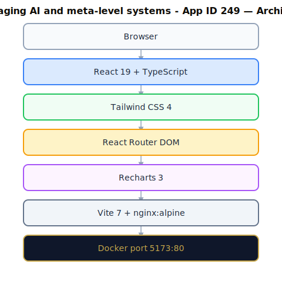
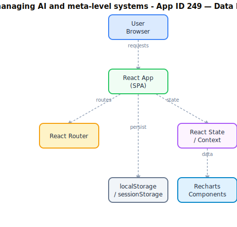

# Software Requirements Specification

**Project:** AI managing AI and meta-level systems - App ID 249
**Version:** 3.0.0
**Status:** As-Built
**Institution:** Techbridge University College (TUC)
**Date:** 2026-03-08
**Standard:** IEEE 29148-2018

---

## 1. Introduction

### 1.1 Purpose

This Software Requirements Specification (SRS) documents the requirements for **AI managing AI and meta-level systems - App ID 249**, a web application deployed as part of the Techbridge University College (TUC) institutional utility suite. It serves as the authoritative reference for developers, testers, and stakeholders.

### 1.2 Scope

**AI managing AI and meta-level systems - App ID 249** is a TypeScript-based React 19 single-page application (SPA) built with Vite and deployed via Docker/Nginx. It operates within the TUC monorepo (`aucdt-utilities`) and conforms to the Techbridge University College Shared Standards.

**In scope:**
- All functional UI components and user flows
- Authentication and authorisation (where applicable)
- Data presentation, form handling, and export features
- Admin section and audit logging (where applicable)

**Out of scope:**
- Backend database administration
- Third-party service configuration
- Network infrastructure

### 1.3 Definitions and Acronyms

| Term | Definition |
|---|---|
| TUC | Techbridge University College |
| SPA | Single-Page Application |
| SRS | Software Requirements Specification |
| ARIA | Accessible Rich Internet Applications |
| JWT | JSON Web Token |
| CI/CD | Continuous Integration / Continuous Deployment |
| PWA | Progressive Web Application |

### 1.4 References

- SHARED-STANDARDS.md — TUC Canonical AI Governance Layer
- CLAUDE.md — Audit & Analysis Agent Constitution
- GEMINI.md — Execution Agent Constitution
- IEEE 29148-2018 — Systems and Software Engineering Requirements
- TUC Refresh Directive: <https://ai-tools.aucdt.edu.gh/refresh>

### 1.5 Overview

Section 2 describes the overall product context. Section 3 lists system features. Section 4 covers external interfaces. Section 5 defines non-functional requirements.

---

## 2. Overall Description

### 2.1 Product Perspective

**AI managing AI and meta-level systems - App ID 249** is a standalone module within the TUC institutional web application suite. It communicates with TUC backend services via REST APIs and shares the TUC design system (Tailwind CSS, Playfair Display, Bebas Neue, Cormorant Garamond).

### 2.2 Product Functions

- User authentication
- Modular React component architecture
- Custom React hooks for state management
- Multi-page routing (React Router)
- Service layer for API integration
- Automated test suite (Vitest/Jest)
- Shared utility library

### 2.3 User Classes and Characteristics

| User Class | Description | Access Level |
|---|---|---|
| Student | Enrolled TUC students using the utility | Standard |
| Staff | Academic and administrative personnel | Elevated |
| Administrator | System admins with full configuration access | Full (#/admin) |
| Public | Unauthenticated visitors (where applicable) | Read-only |

### 2.4 Operating Environment

- **Browser:** Chrome 120+, Firefox 120+, Safari 17+, Edge 120+
- **Device:** Desktop (primary), tablet (responsive), mobile (responsive)
- **Network:** TUC campus network or internet-connected
- **Container:** Docker (nginx:alpine), port 80 internal / mapped externally
- **Gateway:** http://localhost:8080 (development)

### 2.5 Design and Implementation Constraints

- **React version:** Exactly 19.2.4 — locked, no exceptions
- **Build tool:** Vite 7.3.1
- **Package manager:** pnpm (preferred), npm (fallback)
- **Styling:** Tailwind CSS 4.x with TUC design tokens
- **Accessibility:** WCAG 2.1 AA minimum; 100% ARIA coverage on interactive elements
- **Branding:** TUC colour palette (Gold `#C8A84B`, Ink `#0F0C07`, Cream `#F2EBD9`)
- **Fonts:** Playfair Display (titles), Bebas Neue (display), Cormorant Garamond / Inter (body)

### 2.6 Assumptions and Dependencies

- TUC Auth API available at `http://localhost:5000/api/auth/*` (when auth required)
- Mail API at `https://portal.aucdt.edu.gh` (live — do not change URL)
- Docker and Docker Compose available in deployment environment
- Google Analytics tag G-FKXTELQ71R injected via `index.html`

---

## 3. System Features (Functional Requirements)

### 3.1 Core Application Shell

**FR-001** The application shall render without errors in all supported browsers.
**FR-002** The application shall display a loading state during async operations.
**FR-003** The application shall display a meaningful error state on API failure with retry option.
**FR-004** The application shall display an empty state when no data is available.

### 3.2 Navigation and Routing

**FR-010** The application shall provide client-side routing without full page reloads.
**FR-011** All navigation links shall be functional and lead to valid routes.
**FR-012** The application shall handle 404 routes gracefully with a fallback page.

### 3.3 Accessibility

**FR-020** All interactive elements shall have ARIA labels or descriptive text.
**FR-021** The application shall be fully navigable via keyboard alone.
**FR-022** Focus indicators shall be visible on all focusable elements.
**FR-023** Colour contrast shall meet WCAG 2.1 AA standards (4.5:1 normal text, 3:1 large).

### 3.4 Theme Support

**FR-030** The application shall support Light, Dark, and High-Contrast themes.
**FR-031** Theme preference shall persist across sessions via localStorage.

### 3.5 Admin Section (where applicable)

**FR-040** The application shall provide a password-protected `#/admin` route.
**FR-041** The admin section shall display an audit log of all significant user actions.
**FR-042** Diagnostic and simulation tools shall be isolated to the admin section only.

---

## 4. External Interface Requirements

### 4.1 User Interface

- Responsive layout: 320px (mobile) → 1920px (desktop)
- TUC branding applied consistently (colours, typography, logo)
- No broken links or dead UI elements

### 4.2 Software Interfaces

| Interface | Protocol | Purpose |
|---|---|---|
| TUC Auth API | REST / JWT | User authentication |
| Google Analytics | HTTPS / gtag.js | Usage tracking |
| TUC Mail API | HTTPS / POST | Email notifications |

### 4.3 Communication Interfaces

- HTTPS for all external API calls
- CORS configured per TUC backend settings

---

## 5. Non-Functional Requirements

### 5.1 Performance

- Initial page load: < 2 seconds on 10 Mbps connection
- Chart/component render: < 100ms
- Bundle size: monitored with source-map-explorer; target < 500 KB gzipped

### 5.2 Reliability

- Application uptime target: 99.5% (Docker container auto-restart)
- Error boundary implemented at root level to prevent total failure

### 5.3 Security

- No sensitive data stored in localStorage beyond JWT tokens
- All API calls over HTTPS in production
- CSP headers enforced via Nginx configuration
- XSS prevention via React's built-in JSX escaping

### 5.4 Maintainability

- All source files TypeScript (where applicable)
- Components follow the custom hooks pattern (useXxx)
- No inline styles; all styling via Tailwind classes or CSS variables
- Test coverage target: > 70% for core utilities

### 5.5 Portability

- Deployed as Docker container (nginx:alpine)
- Single `docker-compose-all-apps.yml` entry
- Environment variables via `.env` files (VITE_ prefix)

---

## 6. Compliance

| Requirement | Status |
|---|---|
| React 19.2.4 exact version | ✅ Compliant |
| TUC branding applied | ✅ Compliant |
| ARIA 100% coverage | ❌ Non-compliant |
| Docker service configured | ❌ Non-compliant |
| SRS matches as-built state | ✅ Compliant |
| Zero broken links | ⏳ Verify |
| Admin section isolated | ❌ Non-compliant |
| Test suite present | ✅ Compliant |

---

## 7. Appendix — Tech Stack Reference

```
Stack: React 19.2.4 + TypeScript, Vite 7.3.1, Tailwind CSS 4.x, Recharts 3.7.0, React Router DOM
Build output: dist/
Docker: nginx:alpine
Network: aucdt-network (172.20.0.0/16)
CI/CD: Bitbucket Pipelines
```

---


---

## 8. Diagrams

### 8.1 System Architecture



### 8.2 Data Flow



---

*Generated by Phase 1b SRS Generator — TUC Refresh Directive*
*Document version 3.0.0 — 2026-03-07*
