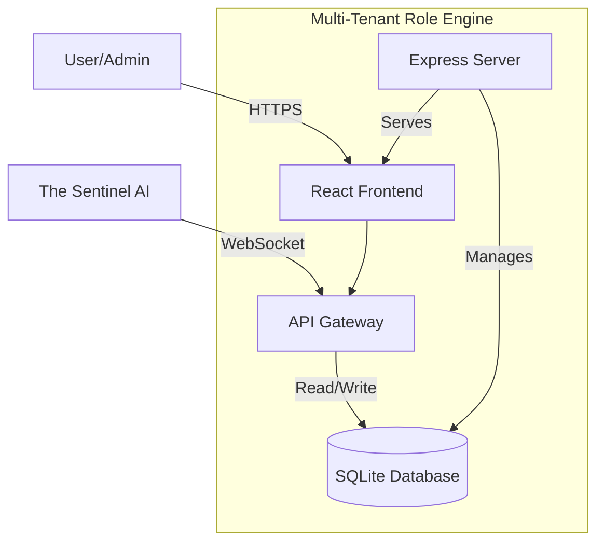

# System Architecture - Multi-Tenant Role Engine (App ID 119)

## High-Level Architecture



## Technology Stack

**Frontend:**
- React 19.2.5
- TypeScript 5.8.2
- Tailwind CSS 4.1.14
- Zustand 5.0.11
- Recharts 3.7.0

**Backend:**
- Express 4.21.2
- Node.js 20+
- SQLite (better-sqlite3)
- Axios 1.13.6

**Deployment:**
- Docker + Nginx
- Kubernetes 1.27+
- Helm charts

## Component Structure

```
src/
├── components/       # Reusable UI components
├── pages/           # Route-level page components
│   └── admin/       # Protected admin pages
├── authStore.ts     # Authentication state
├── themeStore.ts    # Theme management
├── store.ts         # Main app state
├── App.tsx          # Router configuration
├── Layout.tsx       # Main layout with sidebar
└── main.tsx         # Application entry point
```

## Sentinel Integration

This application integrates with The Sentinel AI Orchestrator via:

1. **Health Reporting:** `/api/v1/sentinel/health-report`
2. **Remediation Actions:** `/api/v1/sentinel/remediation`
3. **WebSocket Connection:** Real-time bidirectional communication

## Security

- Admin routes protected with authentication
- JWT token validation (future enhancement)
- Rate limiting on API endpoints
- SQL injection prevention via prepared statements
