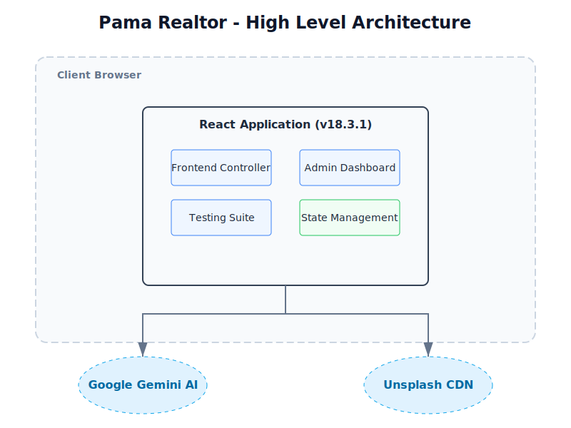
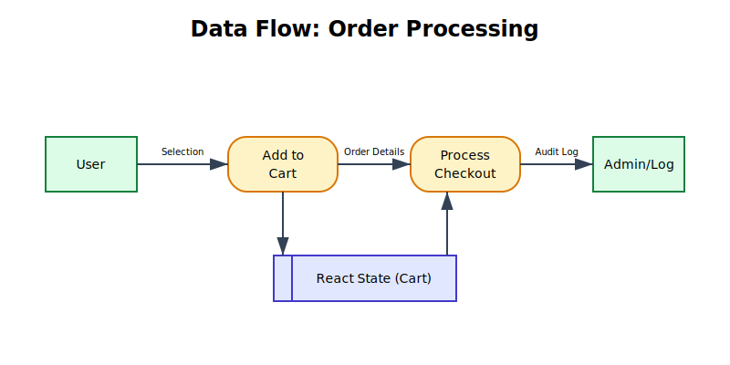
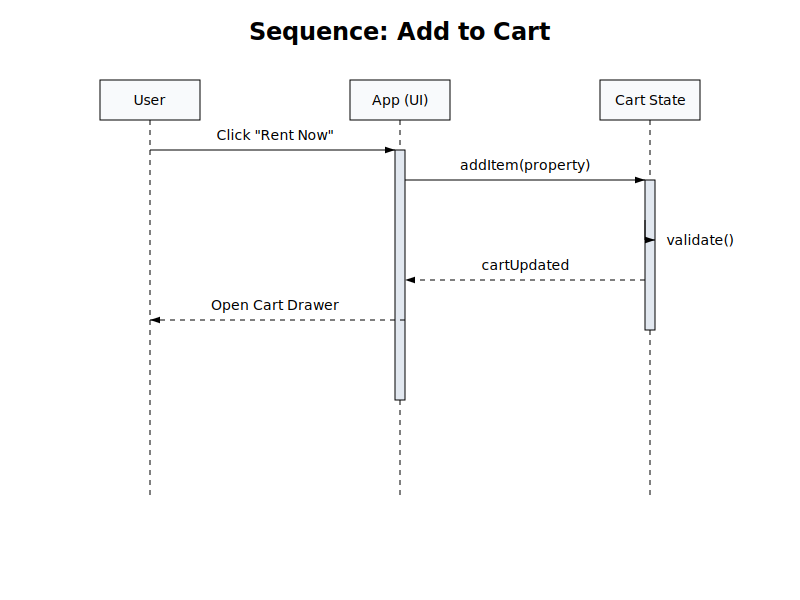

# Software Requirements Specification (SRS)
## Pama Realtor (Final Release)

**Version:** 2.0.0
**Date:** October 26, 2023
**Status:** ALL PHASES COMPLETE

---

## 1. Introduction
Pama Realtor is a high-performance, accessible, and AI-enhanced real estate platform. This document outlines the final system architecture, features, and technical specifications.

## 2. System Architecture
The system follows a client-side Single Page Application (SPA) architecture, minimizing latency and hosting costs.

### 2.1 High-Level Diagram

### 2.2 Technology Stack

## 3. Key Features
1.  **Property Management:** Browse, Search, and Filter.
2.  **Shopping Cart:** Add properties for Rent/Sale or Drive-to-View.
3.  **AI Assistant:** Powered by Google Gemini 2.5 Flash.
4.  **Admin Dashboard:** Secure area for managing listings and viewing audit logs.
5.  **Accessibility:** High Contrast Mode and ARIA support.
6.  **Self-Testing:** Built-in Playwright diagnostics.

## 4. User Interaction
### 4.1 Use Cases

### 4.2 Data Flow

### 4.3 Sequence (Add to Cart)

## 5. Deployment
The application is deployed as a static site using `esm.sh` for module resolution, requiring no build step.

---
**End of Document**
