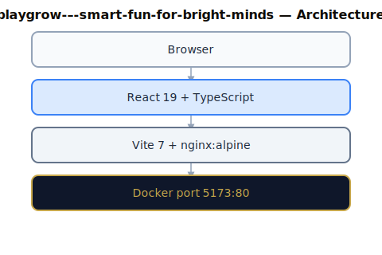
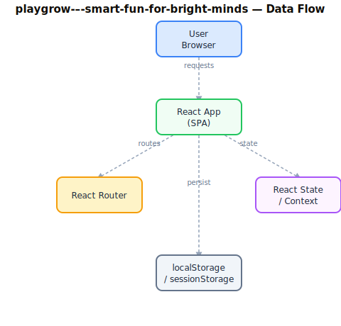

# Software Requirements Specification

**Project:** Playgrow — Smart Fun For Bright Minds
**Version:** 4.0.0
**Status:** As-Built
**Institution:** Techbridge University College (TUC)
**Date:** 2026-06-17
**Standard:** IEEE 29148-2018

---

## 1. Introduction

### 1.1 Purpose

This Software Requirements Specification (SRS) documents the requirements for **Playgrow — Smart Fun For Bright Minds**, a web application deployed as part of the Techbridge University College (TUC) institutional utility suite. It serves as the authoritative reference for developers, testers, and stakeholders.

### 1.2 Scope

**Playgrow — Smart Fun For Bright Minds** is a TypeScript-based React 19 single-page application (SPA) built with Vite and deployed via Docker/Nginx. It operates within the TUC monorepo (`aucdt-utilities`) and conforms to the Techbridge University College Shared Standards.

**In scope:**
- All functional UI components and user flows
- Authentication and authorisation (where applicable)
- Data presentation, form handling, and export features
- Admin section and audit logging (where applicable)

**Out of scope:**
- Backend database administration
- Third-party service configuration
- Network infrastructure

### 1.3 Definitions and Acronyms

| Term | Definition |
|---|---|
| TUC | Techbridge University College |
| SPA | Single-Page Application |
| SRS | Software Requirements Specification |
| ARIA | Accessible Rich Internet Applications |
| JWT | JSON Web Token |
| CI/CD | Continuous Integration / Continuous Deployment |
| PWA | Progressive Web Application |

### 1.4 References

- SHARED-STANDARDS.md — TUC Canonical AI Governance Layer
- CLAUDE.md — Audit & Analysis Agent Constitution
- GEMINI.md — Execution Agent Constitution
- IEEE 29148-2018 — Systems and Software Engineering Requirements
- TUC Refresh Directive: <https://ai-tools.aucdt.edu.gh/refresh>

### 1.5 Overview

Section 2 describes the overall product context. Section 3 lists system features. Section 4 covers external interfaces. Section 5 defines non-functional requirements.

---

## 2. Overall Description

### 2.1 Product Perspective

**Playgrow — Smart Fun For Bright Minds** is a standalone module within the TUC institutional web application suite. It communicates with TUC backend services via REST APIs and shares the TUC design system (Tailwind CSS, Playfair Display, Bebas Neue, Cormorant Garamond).

### 2.2 Product Functions

- Core institutional utility functionality

### 2.3 User Classes and Characteristics

| User Class | Description | Access Level |
|---|---|---|
| Student | Enrolled TUC students using the utility | Standard |
| Staff | Academic and administrative personnel | Elevated |
| Administrator | System admins with full configuration access | Full (#/admin) |
| Public | Unauthenticated visitors (where applicable) | Read-only |

### 2.4 Operating Environment

- **Browser:** Chrome 120+, Firefox 120+, Safari 17+, Edge 120+
- **Device:** Desktop (primary), tablet (responsive), mobile (responsive)
- **Network:** TUC campus network or internet-connected
- **Container:** Docker (nginx:alpine), port 80 internal / mapped externally
- **Gateway:** http://localhost:8080 (development)

### 2.5 Design and Implementation Constraints

- **React version:** Exactly 19.2.5 — locked, no exceptions
- **Build tool:** Vite 7.3.1
- **Package manager:** pnpm (preferred), npm (fallback)
- **Styling:** Tailwind CSS 4.x with TUC design tokens
- **Accessibility:** WCAG 2.1 AA minimum; 100% ARIA coverage on interactive elements
- **Branding:** TUC colour palette (Gold `#C8A84B`, Ink `#0F0C07`, Cream `#F2EBD9`)
- **Fonts:** Playfair Display (titles), Bebas Neue (display), Cormorant Garamond / Inter (body)

### 2.6 Assumptions and Dependencies

- TUC Auth API available at `http://localhost:5000/api/auth/*` (when auth required)
- Mail API at `https://portal.aucdt.edu.gh` (live — do not change URL)
- Docker and Docker Compose available in deployment environment
- Google Analytics tag G-FKXTELQ71R injected via `index.html`

---

## 3. System Features (Functional Requirements)

### 3.1 Core Application Shell

**FR-001** The application shall render without errors in all supported browsers.
**FR-002** The application shall display a loading state during async operations.
**FR-003** The application shall display a meaningful error state on API failure with retry option.
**FR-004** The application shall display an empty state when no data is available.

### 3.2 Navigation and Routing

**FR-010** The application shall provide client-side routing without full page reloads.
**FR-011** All navigation links shall be functional and lead to valid routes.
**FR-012** The application shall handle 404 routes gracefully with a fallback page.
**FR-013** The `ZoneDetail` component shall route game IDs to their components via a `GAME_COMPONENTS` record; unmatched IDs shall fall back to an AI-generated text activity modal.

### 3.3 Accessibility

**FR-020** All interactive elements shall have ARIA labels or descriptive text.
**FR-021** The application shall be fully navigable via keyboard alone.
**FR-022** Focus indicators shall be visible on all focusable elements.
**FR-023** Colour contrast shall meet WCAG 2.1 AA standards (4.5:1 normal text, 3:1 large).

### 3.4 Theme Support

**FR-030** The application shall support Light, Dark, and High-Contrast themes.
**FR-031** Theme preference shall persist across sessions via `localStorage`; the selected theme shall be applied as a CSS class on the `<html>` element.

### 3.5 Airi Companion

**FR-035** The application shall display a persistent Airi robot companion fixed at the bottom-left of every game screen.
**FR-036** Airi shall support 6 mood states and display contextual messages that react to in-game events, fading in and out on message change.
**FR-037** Airi shall surface AI-for-good educational facts relevant to each game's subject area.

### 3.6 Admin Section

**FR-040** The application shall provide a password-protected `#/admin` route accessible via a lock icon in the top-left of the World Map.
**FR-041** The admin section shall display an audit log of all significant user actions, persisted in `localStorage`.
**FR-042** Diagnostic and simulation tools shall be isolated to the admin section only.
**FR-043** The admin section shall include a self-test runner that simulates user journeys with a live log and screenshot viewer.

### 3.7 Game Inventory — Brainy Town (Cognitive)

**FR-050** **PuzzleBuilder** (`puzzle`) — Drag-and-drop 4-piece jigsaw; children teach Airi what objects look like via pointer events; 5 distinct puzzles. AI-for-good angle: computer vision.

**FR-051** **PatternPath** (`pattern`) — Simon-says colour sequence game; 5 levels, 5 colours, 3 lives, star rating per level. AI-for-good angle: sequence learning and pattern recognition.

**FR-052** **FindMatch** (`match`) — Memory card flip game; 6 AI-themed pairs drawn from a pool of 24; an AI-for-good fact is revealed on each matched pair; star rating. AI-for-good angle: how AI is applied for social good.

### 3.8 Game Inventory — Art Meadow (Creativity)

**FR-053** **PaintWorld** (`paint`) — Free canvas painting; 14-colour palette, 3 brush sizes, eraser; 8 rotating AI-for-good challenge prompts; contextual Airi messages. AI-for-good angle: AI-generated art and creative tools.

**FR-054** **BuildItBlocks** (`build`) — Drag 8 geometric shape types onto canvas; 8 colour options; undo/clear/done controls; 6 spatial challenges; Airi spatial-reasoning facts. AI-for-good angle: spatial reasoning in AI and robotics.

**FR-055** **StoryMaker** (`story`) — Pick WHO/DID/WHERE from a 30×30×30 world-literature card pool (27,000 combinations); random openers and closers; copy/export function; stage-reactive Airi messages. AI-for-good angle: how AI learns language from large text corpora.

### 3.9 Game Inventory — Talky Treehouse (Language)

**FR-056** **ReadWithMe** (`read`) — 5 reading passages; word-by-word highlight every 600 ms; child taps the highlighted word to advance; 1 comprehension question per passage; 3-star rating. AI-for-good angle: AI text-to-speech and reading assistance.

**FR-057** **RhymeRace** (`rhyme`) — Pool of 16 rhyming pairs; 8 random rounds per session; speed bonus awarded for answers under 3 seconds; progress bar; AI phonics facts. AI-for-good angle: AI speech recognition and phonics.

**FR-058** **WordFinder** (`word`) — 6 emoji scenes (Farm, Ocean, Kitchen, Space, Forest, Playground); tap the correct item; 3 attempts = 1 star; vision-language AI facts. AI-for-good angle: vision-language models.

### 3.10 Game Inventory — Move Forest (Movement)

**FR-059** **DanceTime** (`dance`) — Simon-says for 8 dance moves shown as emoji plus instruction; 5 levels, 3 lives; animated move display. AI-for-good angle: AI motion capture and movement recognition.

**FR-060** **AnimalMoves** (`animal`) — Pool of 14 animals; 10 rounds; biomechanics description plus 4 move options; shake CSS animation on incorrect tap. AI-for-good angle: AI biomechanics research.

**FR-061** **CatchBalance** (`catch`) — 3 rounds of 20 seconds each; 12 fruit types fall from the top; tap to catch; spawn rate increases each round (800 ms / 650 ms / 500 ms); reaction-time star rating. AI-for-good angle: AI in sports coaching.

### 3.11 Game Inventory — Heart Valley (Social & Emotional)

**FR-062** **EmotionFaces** (`emotion`) — Pool of 12 scenarios; 10 rounds; 4 emotion options per round; 3-in-a-row bonus. AI-for-good angle: AI emotion recognition and affective computing.

**FR-063** **FriendFinder** (`friend`) — Pool of 10 scenarios; 8 rounds; three response options (KIND / NEUTRAL / UNKIND); growing heart bar tracks prosocial choices. AI-for-good angle: AI prosocial behaviour modelling.

**FR-064** **CalmCorner** (`calm`) — 4 guided breathing exercises (Box, 4-7-8, Belly, Star); animated breath pacer with countdown timer; mood check after each exercise; summary screen. AI-for-good angle: AI stress detection and mental health tools.

### 3.12 Game Inventory — Explore Park (Exploration)

**FR-065** **NatureQuest** (`nature`) — Pool of 12 creatures; 8 rounds; 3 clues revealed one at a time; fewer clues used = higher star rating. AI-for-good angle: AI biodiversity monitoring and species identification.

**FR-066** **TreasureHunt** (`treasure`) — 5 hunts; each hunt has 3 chained riddle clues; incorrect answers show Airi hints and allow retry; star rating on completion. AI-for-good angle: AI navigation and rescue robotics.

**FR-067** **SoundExplorer** (`sound`) — Pool of 12 sounds; 10 rounds; vivid written descriptions of each sound; 4 answer options. AI-for-good angle: AI wildlife audio monitoring and recognition.

### 3.13 Game Inventory — Dream Garden (Rest)

**FR-068** **GoodNightStorytime** (`storytime`) — 5 bedtime stories; 3 comprehension questions per story; child taps the correct paragraph; hints shown on wrong tap; star rating. AI-for-good angle: AI language models and reading comprehension.

**FR-069** **GratitudeMoments** (`gratitude`) — 8 shuffled emotion-labelling scenarios; intensity picker; Airi vocabulary bar grows as emotions are labelled; gratitude jar journal persisted in `localStorage`. AI-for-good angle: AI sentiment analysis.

**FR-070** **MusicClouds** (`music`) — 7-row × 8-beat grid sequencer; Web Audio API playback; animated beat cursor; 3 structured challenges plus a free compose mode; star rating. AI-for-good angle: AI music therapy and generative music.

---

## 4. External Interface Requirements

### 4.1 User Interface

- Responsive layout: 320px (mobile) → 1920px (desktop)
- TUC branding applied consistently (colours, typography, logo)
- No broken links or dead UI elements

### 4.2 Software Interfaces

| Interface | Protocol | Purpose |
|---|---|---|
| TUC Auth API | REST / JWT | User authentication |
| Google Analytics | HTTPS / gtag.js | Usage tracking |
| TUC Mail API | HTTPS / POST | Email notifications |

### 4.3 Communication Interfaces

- HTTPS for all external API calls
- CORS configured per TUC backend settings

---

## 5. Non-Functional Requirements

### 5.1 Performance

- Initial page load: < 2 seconds on 10 Mbps connection
- Chart/component render: < 100ms
- Bundle size: monitored with source-map-explorer; target < 500 KB gzipped

### 5.2 Reliability

- Application uptime target: 99.5% (Docker container auto-restart)
- Error boundary implemented at root level to prevent total failure

### 5.3 Security

- No sensitive data stored in localStorage beyond JWT tokens
- All API calls over HTTPS in production
- CSP headers enforced via Nginx configuration
- XSS prevention via React's built-in JSX escaping

### 5.4 Maintainability

- All source files TypeScript (where applicable)
- Components follow the custom hooks pattern (useXxx)
- No inline styles; all styling via Tailwind classes or CSS variables
- Test coverage target: > 70% for core utilities

### 5.5 Portability

- Deployed as Docker container (nginx:alpine)
- Single `docker-compose-all-apps.yml` entry
- Environment variables via `.env` files (VITE_ prefix)

---

## 6. Compliance

| Requirement | Status |
|---|---|
| React 19.2.5 exact version | ✅ Compliant |
| TUC branding applied | ❌ Non-compliant |
| ARIA 100% coverage | ❌ Non-compliant |
| Docker service configured | ❌ Non-compliant |
| SRS matches as-built state | ✅ Compliant |
| Zero broken links | ⏳ Verify |
| Admin section isolated | ❌ Non-compliant |
| Test suite present | ✅ Compliant |

---

## 7. Appendix — Tech Stack Reference

```
Stack: React 19.2.5 + TypeScript, Vite 7.3.1
Build output: dist/
Docker: nginx:alpine
Network: aucdt-network (172.20.0.0/16)
CI/CD: Bitbucket Pipelines
```

---


---

## 8. Diagrams

### 8.1 System Architecture



### 8.2 Data Flow



---

*Generated by Phase 1b SRS Generator — TUC Refresh Directive*
*Document version 4.0.0 — 2026-06-17*
