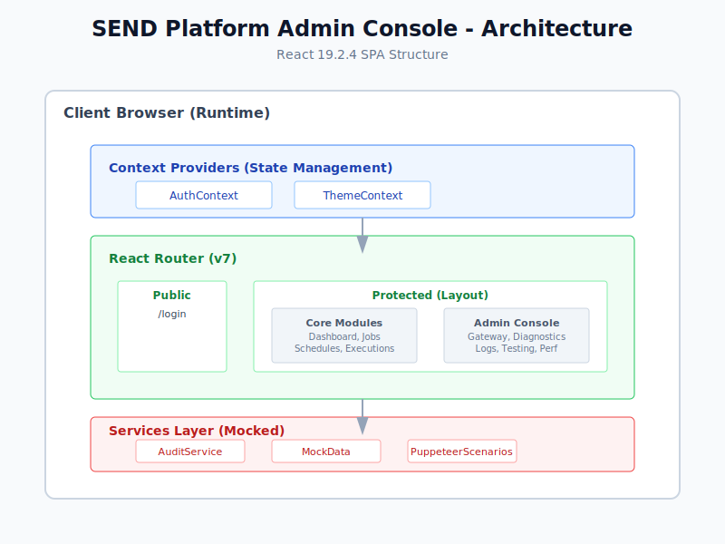
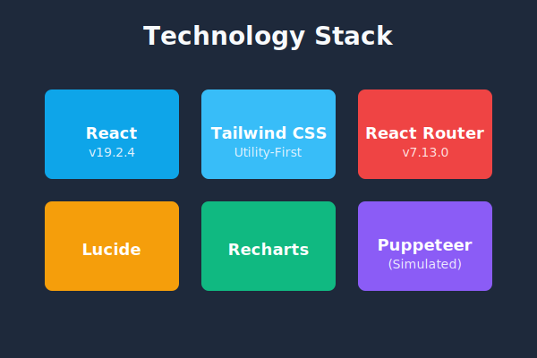

# Software Requirements Specification (SRS)
**Project:** SEND Platform Admin Console  
**Version:** 2.0.0 (Final)  
**Date:** 2026-03-02  

## 1. Introduction
### 1.1 Purpose
The purpose of this document is to define the requirements for the Admin Console of the SEND (Schedule | Execute | Notify | Deliver) Report Automation Platform. This console provides a visual interface for managing report jobs, schedules, delivery configurations, and monitoring system health.

### 1.2 Scope
The application is a Single Page Application (SPA) serving as the "Middle Tier" management layer. It interacts with backend microservices (Scheduler, Report Engine, Notification Service) via REST APIs. 
**Note:** In this implementation version, backend services are **mocked** to demonstrate UI functionality, data flow, and admin workflows without requiring a deployed server infrastructure.

## 2. Overall Description
### 2.1 Product Functions
*   **Dashboard**: High-level metrics on job execution, failures, and system throughput.
*   **Job Management**: Create, Read, Update, Delete (CRUD) definitions for report jobs (JSON-based).
*   **Scheduling**: Manage Cron-based execution schedules and timezone configurations.
*   **Execution History**: Audit log of past report runs with status and output links.
*   **Admin Console**:
    *   **Security**: Password-protected access for administrative functions (`/admin/*`).
    *   **API Gateway**: Route management, rate limiting, and authentication policy configuration.
    *   **Diagnostics**: Component health checks and connectivity verification.
    *   **DB Monitor**: Database connection stats and slow query logs.
    *   **Performance**: Real-time CPU/Memory visualization.
    *   **System Logs**: Centralized log viewer with audit trails.
    *   **Testing**: 
        *   **Integration**: Client-side verification of data structures and schema validity.
        *   **E2E Simulation**: Interactive runner for Playwright test scenarios, displaying execution logs and result snapshots.

### 2.2 System Architecture
The following diagrams illustrate the system's structure and data flow.

#### 2.2.1 Application Architecture

#### 2.2.2 Data Flow

#### 2.2.3 Technology Stack

### 2.3 User Characteristics
*   **System Administrators**: Technical users responsible for infrastructure and configuration.
*   **Data Analysts**: Users defining report queries and templates.
*   **QA Engineers**: Users verifying system integrity via the Testing module.

## 3. Specific Requirements

### 3.1 External Interface Requirements
*   **Framework**: **React 19.2.4** (Mandatory).
*   **Styling**: Tailwind CSS with Dark Mode support.
*   **Icons**: Lucide React.
*   **Routing**: React Router DOM v7.

### 3.2 Functional Requirements

#### 3.2.1 Job Management
*   **REQ-JM-01**: System shall display a paginated list of all report jobs.
*   **REQ-JM-02**: System shall allow viewing details of a specific job via UUID or ID.
*   **REQ-JM-03**: System shall provide a JSON editor for modifying job definitions.
*   **REQ-JM-04**: System shall allow creation of new jobs.
*   **REQ-JM-05**: System shall provide "Save" and "Trigger" actions that provide immediate user feedback (Simulated persistence).

#### 3.2.2 Scheduling
*   **REQ-SCH-01**: System shall display active cron schedules.
*   **REQ-SCH-02**: System shall calculate and display the "Next Run" timestamp based on cron expression.

#### 3.2.3 API Gateway Management
*   **REQ-GW-01**: System shall list all registered API routes.
*   **REQ-GW-02**: System shall display real-time throughput metrics.
*   **REQ-GW-03**: System shall allow toggling Global Rate Limiting.
*   **REQ-GW-04**: System shall support configuring Auth Types (OAuth2, JWT, API Key) per route.

#### 3.2.4 System Monitoring & Security
*   **REQ-MON-01**: System shall visualize CPU and Memory usage over a 24-hour period.
*   **REQ-MON-02**: System shall perform connectivity checks to external dependencies (SharePoint, SMTP, DB).
*   **REQ-SEC-01**: All admin routes (`/admin/*`) shall be protected by authentication.
*   **REQ-SEC-02**: Critical actions (login, logout, config changes) shall be recorded in the audit log.
*   **REQ-SEC-03**: Admin diagnostics must be isolated from public routes.

#### 3.2.5 Testing Framework
*   **REQ-TST-01**: System shall provide a dashboard to trigger Unit/Integration tests.
*   **REQ-TST-02**: System shall display the source code of defined E2E Playwright scenarios.
*   **REQ-TST-03**: System shall simulate the execution of E2E tests, displaying step-by-step console logs and result screenshots.

### 3.3 Non-Functional Requirements
*   **Accessibility**: Application shall support WCAG 2.1 AA standards (ARIA labels, keyboard navigation).
*   **Theming**: Application shall support Light, Dark, and High-Contrast themes.

## 4. Constraints
*   Application must run client-side without a Node.js backend server for UI logic.
*   Data persistence is handled via external API calls (currently mocked).
