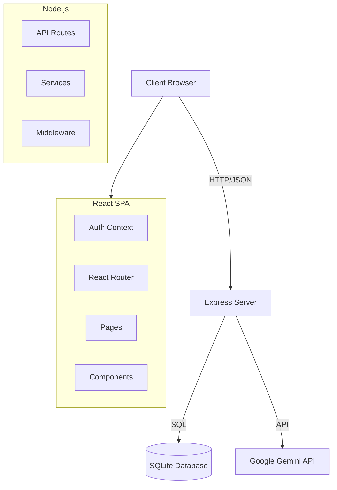
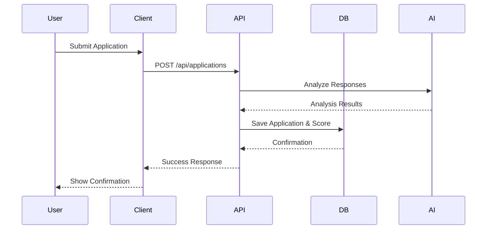

# System Architecture

## Overview
TalentVerify is a modern web application built with React, Express, and SQLite. It uses a hybrid architecture with a client-side SPA and a lightweight backend API.

## Component Diagram

## Data Flow

## Security Model

- **Authentication**: Role-based (Admin, Recruiter, Candidate).
- **Authorization**: Protected Routes wrapper in React + API middleware.
- **Audit**: All critical actions logged to `audit_logs` table.
