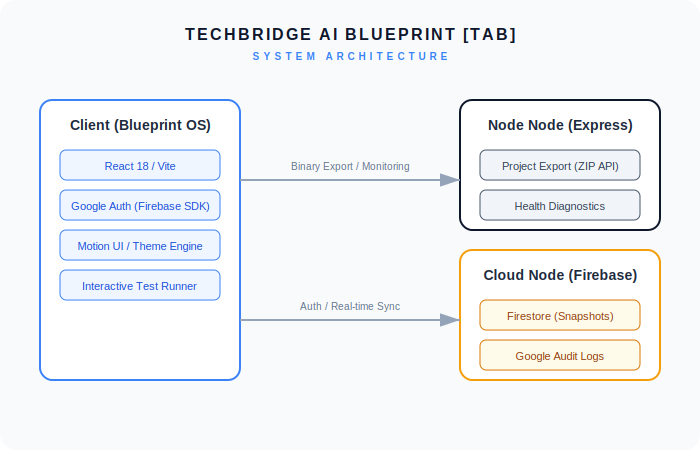
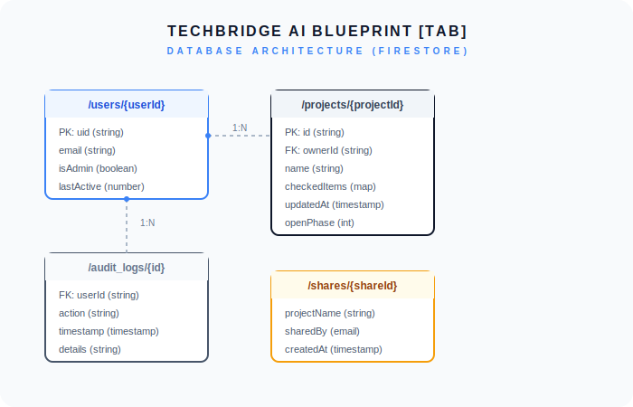

# Software Requirements Specification (SRS)
## TUC-ICT-SRS-2026-001

**Project Name:** Techbridge AI Blueprint [TAB]  
**Institution:** Techbridge University College (TUC)  
**Owner:** Daniel Twum, Head of ICT  
**Status:** Implementation Finalised (Phase 6 Sign-off)  

---

### 1. Introduction
#### 1.1 Purpose
This document specifies the software requirements for **Techbridge AI Blueprint [TAB]**, an advanced Application Lifecycle Manager designed for the rapid scaffolding, security hardening, and mission-critical deployment of web applications and mobile platforms within the TUC ICT infrastructure.

#### 1.2 Scope
The system provides a unified 'Blueprint OS' experience, integrating foundation scaffolding, Cloud-synced mission snapshots, Google-powered identity verification, automated Playwright verification, interactive diagram sharing, and native mobile containerisation.

### 2. General Description
#### 2.1 System Architecture
The application utilises a modern full-stack architecture:
- **Frontend**: React 18, TypeScript, Tailwind CSS, Motion.
- **Backend Node**: Express Node.js instance for file operations (Export/Health).
- **Cloud Infrastructure**: Firebase Authentication (Google) and Firestore (Project Snapshots & Audit Logs).
- **Mobile Container**: Capacitor 8.3.3 providing native bridge for iOS and Android.



#### 2.2 Database Architecture
The data model is designed for relational integrity and secure multi-user partitioning:
- **Users**: Identity profiles indexed by Firebase UID.
- **Projects**: Cloud-persistent project states with version control.
- **Audit Logs**: Append-only security trails for administrative accountability.
- **Shares**: Publicly accessible, read-only snapshots for diagram dissemination.



### 3. Functional Requirements
* **FR-01: Foundation Scaffolding**: Ability to reset project baselines and maintain IEEE documentation standards.
* **FR-02: Mission Snapshots (Cloud Sync)**: Secure, authenticated storage of project progress in Firestore, allowing multi-device resumption.
* **FR-03: Google Identity Integration & Mandatory Gate**: Mandatory authentication via Google for all system access. Unauthenticated users are strictly blocked at the application entry point.
* **FR-04: Project Export (ZIP)**: Server-side bundling of source code, configurations, and documentation into a downloadable archive.
* **FR-05: Integrated Playwright Suite**: Browser-based interactive test runner with real-time feedback and failure screenshot capture.
* **FR-06: Diagram Sharing**: Generation of secure, public URLs for sharing system and database architecture snapshots.
* **FR-07: System Versioning**: Real-time display of the current build metadata (Git branch and commit hash) in the system footer for traceability.
* **FR-08: Accessibility Themes**: Light, Dark, and High-Contrast UI paradigms with server-side and local persistence.
* **FR-09: Mobile Platform Integration**: Capacitor 8.3.3 implementation for cross-platform iOS and Android native deployment.

### 4. Non-Functional Requirements
* **NFR-01: Zero-Trust Security**: Firestore Security Rules enforcing strict ownership checks and immutable audit logs.
* **NFR-02: PII Protection**: Strict isolation of user emails and profile data, restricted to owners and administrators.
* **NFR-03: Responsive Integrity**: Fluid design supporting ICT Tablet and Desktop interfaces (7xl max-width).
* **NFR-04: Deployment Portability**: Docker-ready configuration with Nginx reverse proxy compatibility.

---

### 5. SRS ↔ Implementation Gap Analysis

| Requirement ID | Requirement Description | Status | Implementation Note |
|:---:|:---|:---:|:---|
| **FR-01** | Foundation Scaffolding | ✅ | Automated baseline scripts and dynamic IEEE SRS generation. |
| **FR-02** | Mission Snapshots | ✅ | Firestore `projects` collection with `updatedAt` server timestamps. |
| **FR-03** | Google Identity Gate | ✅ | Mandatory Google Sign-in gate implemented at the root level. |
| **FR-04** | Project Export | ✅ | `/api/export` endpoint using `adm-zip` for source bundling. |
| **FR-05** | Playwright Suite | ✅ | Interactive 'Playwright Self-Test' tab with capture logic. |
| **FR-06** | Diagram Sharing | ✅ | `shares` collection link generator with public read access. |
| **FR-07** | System Versioning | ✅ | Git branch and commit injection via Vite build process. |
| **FR-08** | Accessibility Themes | ✅ | `tuc-blueprint-theme` custom property engine. |
| **FR-09** | Mobile Integration | ✅ | Capacitor 8.3.3 CLI integration with native build scripts. |
| **NFR-01** | Zero-Trust Security | ✅ | Hardened `firestore.rules` preventing identity spoofing. |
| **NFR-02** | PII Protection | ✅ | Split-collection philosophy and owner-only read rules. |

---

### 6. Documentation Directory Structure (/docs)
```text
/docs
├── ADMIN_GUIDE.md        # Administrative SOPs and Audit Log interpretation
├── APP_STORE_GUIDE.md    # iOS and Android Store submission SOP
├── APP_ICONS_GUIDE.md    # Branding asset generation workflow
├── DEPLOYMENT_GUIDE.md   # Nginx, Docker, and Plesk deployment steps
├── MOBILE_BUILD_GUIDE.md # Capacitor sync and native build workflow
├── TESTING_GUIDE.md      # Playwright suite execution and manual QA
├── TUC-ICT-SRS-2026-001.md # [CURRENT] IEEE Specification document
├── database_erd.svg      # [UPDATED] Database Architecture Diagram
└── system_architecture.svg # [UPDATED] System Architecture Diagram
```

---

### 7. Sign-off
**Confirmed by Agentic Architect**: Phase 6 Complete  
**Date**: 12 May 2026  
**Institution**: Techbridge University College ICT Dept.
