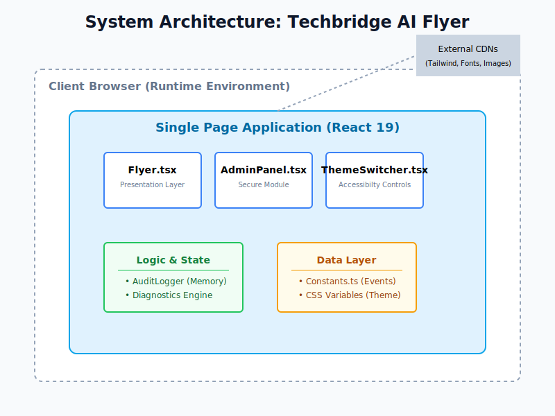
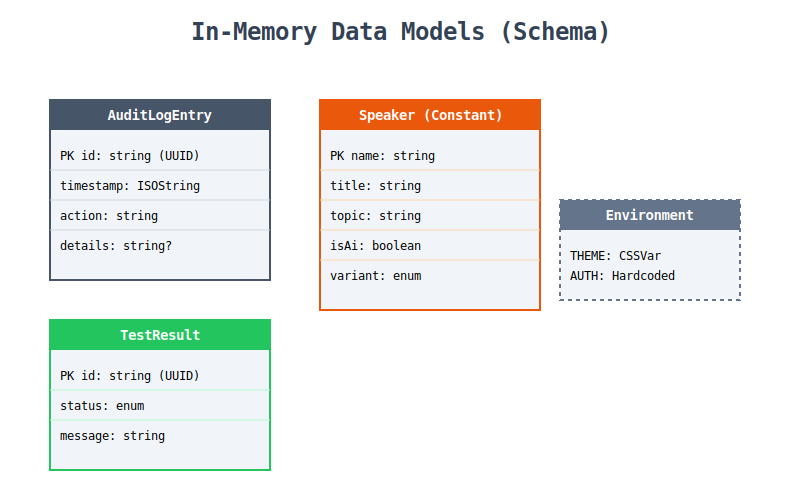
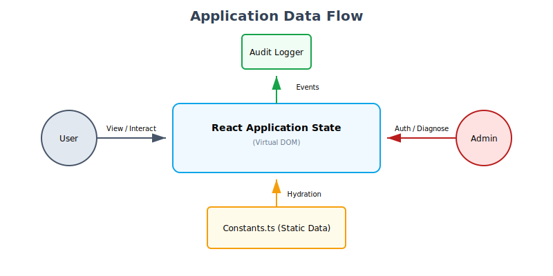

# Software Requirements Specification (SRS)
## Project: Techbridge AI Workshop Flyer
**Version:** 2.0 (Final Release)
**Status:** Production Ready

---

## 1. Introduction

### 1.1 Purpose
The purpose of this application is to serve as a high-fidelity, digital promotional flyer for the "AI Rendering in Fashion Design" workshop hosted by Techbridge University College. It acts as both a promotional tool and a technical demonstration of modern web capabilities including secure administration, accessibility compliance, and self-testing.

### 1.2 Scope
The application is a single-page React web application. It displays event logistics, speaker profiles, and institutional branding. It includes a secure Administrator Panel for system diagnostics, audit logging, and specific accessibility toggles.

---

## 2. Functional Requirements

### 2.1 Content Display
- **FR-01:** The system shall display the Institution Name, Department, and Location.
- **FR-02:** The system shall display the Event Title ("AI Rendering in Fashion Design Workshop") with distinct styling.
- **FR-03:** The system shall display a list of Event Details including Date, Time, and Venue.
- **FR-04:** The system shall display a list of Speakers.
    - **FR-04.1:** Each speaker card must show Name, Title, and Topic.
    - **FR-04.2:** If a speaker is flagged as `isAi: true`, an avatar placeholder/icon shall be displayed.
    - **FR-04.3:** If a speaker is human, their provided `imageUrl` shall be displayed.
- **FR-05:** The system shall display a "Workshop Focus" section describing the core value proposition.
- **FR-06:** The system shall display a "Target Audience" section.

### 2.2 UI/UX Effects
- **FR-07:** The background shall feature a "circuit" pattern and animated glowing orbs to fit the AI theme.
- **FR-08:** The UI shall utilize glassmorphism (backdrop blur, semi-transparent backgrounds) for content containers.
- **FR-09:** Speaker cards shall have hover effects (translate Y-axis).

### 2.3 Administration & Security (New in v2.0)
- **FR-10:** The system shall provide a secure Admin Panel accessible via Keyboard Shortcut (`Ctrl+Shift+A`) or footer link.
- **FR-11:** The system shall authenticate administrators via a password mechanism (Default: `admin`).
- **FR-12:** The system shall maintain an in-memory Audit Log of all critical actions (Login, Theme Change, Test Execution).
- **FR-13:** The system shall provide a "Diagnostics" tab to run client-side self-tests on DOM integrity and accessibility.

---

## 3. Non-Functional Requirements

### 3.1 Aesthetics
- **NFR-01:** The design style must be "Sci-Fi/Futuristic" utilizing dark mode colors (#0a0a0a, #0d1b2a) and neon accents.
- **NFR-02:** Typography must utilize 'Playfair Display' for headings and 'Poppins' for body text.

### 3.2 Responsiveness
- **NFR-03:** The layout must adapt to mobile devices (stacked layout) and desktop screens (grid/flex layouts) seamlessly.

### 3.3 Technology
- **NFR-05:** The application shall be built using React 19+.
- **NFR-06:** Styling shall be implemented using Tailwind CSS.
- **NFR-07:** Data shall be decoupled from the view layer.

### 3.4 Accessibility (New in v2.0)
- **NFR-08:** The system shall support a High Contrast Mode for visually impaired users.
- **NFR-09:** All interactive elements must have visible focus rings and ARIA labels.
- **NFR-10:** The system shall be navigable via keyboard (Tab/Enter).

---

## 4. System Architecture

### 4.1 High-Level Architecture
The application follows a Client-Side Single Page Architecture (SPA) pattern.

### 4.2 Data Schema
Data is managed via in-memory constants and state interfaces.

### 4.3 Data Flow
Information flows primarily from static constants to the view layer, while user actions flow into the centralized Audit Logger.

---

## 5. Technology Stack Visual

