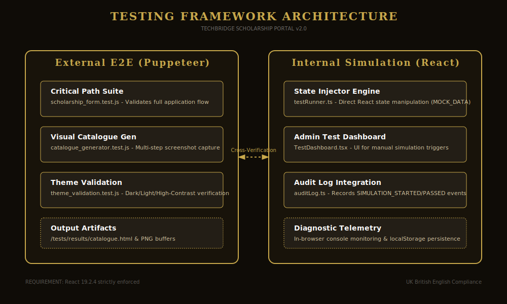

# Testing Framework Guide
**Project:** Techbridge Scholarship Portal (v2.0)
**Core Requirement:** Validation against React 19.2.4

## 1. Overview
The Techbridge Scholarship Portal utilizes a robust, dual-layered testing architecture to ensure 100% reliability of the legal bond execution process. This guide provides technical specifications for both internal state simulations and external end-to-end (E2E) automation.

## 2. Internal Simulation Engine (React Layer)
The internal simulation engine allows for rapid, headless verification of the application's state logic without leaving the browser environment.

- **Location:** `#/admin` -> Diagnostics Tab
- **Core Engine:** `src/services/testRunner.ts`
- **Data Source:** `MOCK_TEST_DATA` (Pre-defined valid scholarship datasets).
- **Execution Flow:**
  1. User triggers "Run Critical Path Simulation" via `AdminPanel`.
  2. The `testRunner` injects data directly into the global `formData` state.
  3. The engine simulates button clicks and tab transitions.
  4. It triggers `html2canvas` to verify image rasterization compatibility.
- **Developer Note:** When adding new form fields, ensure they are added to `MOCK_TEST_DATA` in `testRunner.ts` to maintain simulation parity.

## 3. External E2E Suite (Playwright Layer)
External testing is handled via Playwright to verify DOM integrity, input masking, and network-level interactions.

### 3.1 Critical Path Test
- **Script:** `tests/playwright/scholarship_form.test.js`
- **Goal:** Validates that a scholar can complete and submit a bond from start to finish.
- **Run Command:** `npm run test:e2e`

### 3.2 Visual Catalogue Generation
- **Script:** `tests/playwright/catalogue_generator.test.js`
- **Goal:** Captures high-resolution screenshots of every step to create a visual audit trail.
- **Output:** `tests/results/catalogue.html`

### 3.3 Theme & Accessibility Validation
- **Script:** `tests/playwright/theme_validation.test.js`
- **Goal:** Toggles between Dark, Light, and High-Contrast modes, capturing screenshots to verify WCAG AA contrast compliance.
- **Output:** `tests/results/themes/catalogue.html`

## 4. Test Developer Technical Specs

### 4.1 Common Selectors
Test developers should use the following authoritative selectors for stability:
- **Navigation:** `button::-p-text("Continue")`, `button::-p-text("Previous")`
- **Tabs:** `button:has-text("2. Bond / Undertaking")`
- **Inputs:** `input[placeholder="e.g. John Doe"]`, `input[placeholder="GHA-000000000-0"]`
- **Submission:** `button::-p-text("Finalise Agreement")`

### 4.2 Handling Masks
The application uses `react-imask`. Playwright's `page.type()` interacts correctly with these, but ensure typing includes valid patterns (e.g., `GHA-` prefix for IDs) to prevent validation blocks.

### 4.3 UK British English Requirement
All test logs, failure messages, and catalogue captions must strictly use UK British English (e.g., *programme*, *catalogue*, *finalise*).

## 5. Verification Checklist
Before submitting a pull request, a test developer must:
1. [ ] Run `pnpm build` to ensure zero compilation errors.
2. [ ] Execute `pnpm run test:e2e` and verify all 4 steps pass.
3. [ ] Generate a fresh `catalogue.html` and visually inspect for layout regressions.
4. [ ] Verify that audit logs in `#/admin` reflect the testing activity accurately.
