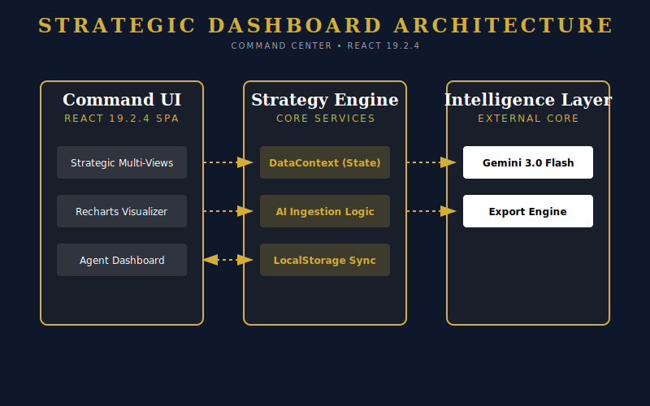
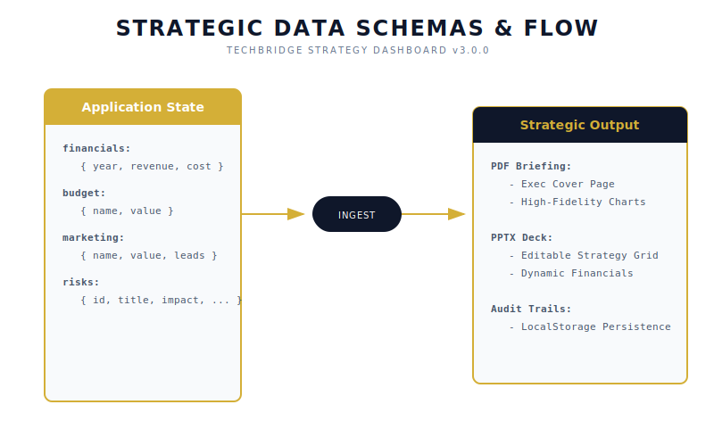

# Software Requirements Specification
## TechBridge Strategic Dashboard v1.1

### 1. Introduction

#### 1.1 Purpose
The purpose of this document is to define the software requirements for the TechBridge Strategic Dashboard. This application serves as an executive decision-support tool designed to visualize, track, and manage the strategic rebrand, financial recovery, and student recruitment operations of TechBridge University College for the 2026 academic cycle.

#### 1.2 Scope
The TechBridge Strategic Dashboard is a single-page web application (SPA) that aggregates critical business intelligence across six domains:
1.  **Executive Overview**: High-level KPIs, enrollment funnels, and product readiness.
2.  **Strategic Planning**: Budget allocation and implementation timelines.
3.  **Financial Modeling**: 5-year revenue/cost projections and ROI analysis.
4.  **Marketing & Risk**: Campaign performance and operational risk matrices.
5.  **Administration**: Secure audit logging and access control.
6.  **System Diagnostics**: Real-time self-testing and health checks.

#### 1.3 Definitions, Acronyms, and Abbreviations
-   **MVP**: Minimum Viable Product.
-   **KPI**: Key Performance Indicator.
-   **GHS**: Ghanaian Cedi.
-   **SRS**: Software Requirements Specification.
-   **WCAG**: Web Content Accessibility Guidelines.

### 2. Overall Description

#### 2.1 Product Perspective
The dashboard functions as a standalone client-side application utilizing a modular component architecture (React 19). It relies on static data models for the current phase, with an architecture designed for zero-config deployment.

#### 2.2 System Architecture
The system follows a client-side component architecture.
*(See `docs/diagrams/architecture.svg` for visual representation)*

### 3. Specific Requirements

#### 3.1 Functional Requirements

**3.1.1 Executive Briefing Module**
-   **REQ-1.1**: System shall display current enrollment vs. capacity.
-   **REQ-1.2**: System shall visualize the student application funnel to highlight drop-off points.
-   **REQ-1.3**: System shall confirm "Market Validation" status, highlighting the 4 prototyped AI apps.

**3.1.2 Strategic Implementation Module**
-   **REQ-2.1**: System shall display a pie chart of the 1.7M GHS implementation budget.
-   **REQ-2.2**: System shall list status of key strategic pillars (e.g., "AI Ecosystem" as "MVP Ready").

**3.1.3 Financial Projections Module**
-   **REQ-3.1**: System shall render a 5-year Composed Chart comparing Revenue, Operating Costs, and Student count.
-   **REQ-3.2**: System shall calculate and display the Break-even point (Year 2 - 2027).

**3.1.4 Marketing & Operations Module**
-   **REQ-4.1**: System shall display marketing budget distribution, emphasizing the pivot to TikTok (320k GHS).
-   **REQ-4.2**: System shall list immediate tactical actions (e.g., "HS Activations").

**3.1.5 Risk Management Module**
-   **REQ-5.1**: System shall present a Risk Matrix with Severity levels (High/Medium).
-   **REQ-5.2**: System shall detail specific Mitigation and Contingency plans.

**3.1.6 Administration & Security (New in v1.1)**
-   **REQ-6.1**: System shall require authentication (password: `admin`) to access the Admin View.
-   **REQ-6.2**: System shall log all security events (Login Success/Fail, Logout) to an ephemeral Audit Log.
-   **REQ-6.3**: Audit logs shall record Timestamp, Actor, Action, and Details.

**3.1.7 System Diagnostics (New in v1.1)**
-   **REQ-7.1**: System shall provide a self-diagnosis runner to validate financial logic (Unit Tests).
-   **REQ-7.2**: System shall display the status of automated E2E test suites (Playwright).
-   **REQ-7.3**: Access to system diagnostics and health checks shall be restricted to authenticated administrators.

#### 3.2 Interface & Accessibility Requirements
-   **UI-1**: Application shall use a sidebar navigation layout.
-   **UI-2**: Dashboard shall employ a "Card" based layout for metric segmentation.
-   **WCAG-1**: System shall provide a **High Contrast Mode** for visually impaired users.
-   **WCAG-2**: System shall provide a **Dark Mode** for low-light environments.
-   **WCAG-3**: All interactive elements shall be accessible via keyboard navigation.

### 4. Data Model
The system uses TypeScript interfaces to enforce data structure integrity.
*(See `docs/diagrams/database.svg` for schema visualization)*

### 5. Performance Requirements
-   **PERF-1**: Dashboard initial load time shall not exceed 1.5 seconds on broadband connections.
-   **PERF-2**: Chart interactions (tooltips) shall render at 60fps.
