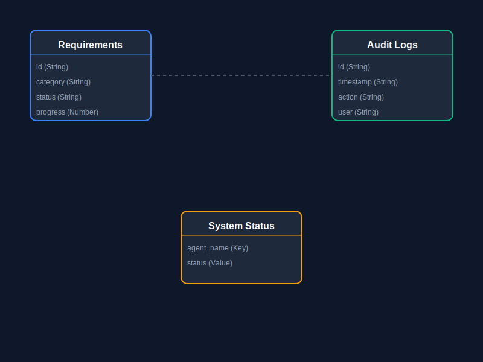

# Software Requirements Specification (IEEE Std 830-1998)
## Sentinel Agent System v1.0

### Document Control
- **Version**: 1.0
- **Date**: 2026-02-08
- **Status**: IEEE-Compliant Release
- **Author**: Techbridge University College

---

## 1. Introduction

### 1.1 Purpose
This Software Requirements Specification (SRS) document provides a complete description of all functions and specifications of the Sentinel Agent System. The document is intended for developers, project managers, testers, and stakeholders involved in the development and deployment of the system.

### 1.2 Scope
The Sentinel Agent System is a full-stack web application designed to monitor, manage, and coordinate multiple AI agents for PDF processing, requirements tracking, and system health monitoring. The system consists of:

**Product Name**: TechBridge Strategy Dashboard  
**Components**:
1. **Frontend Dashboard**: React-based SPA for agent monitoring and control
2. **Backend API**: Node.js/Express server for data management
3. **Agent Coordination Layer**: Multi-agent task distribution system
4. **PDF Management**: Document upload, processing, and tracking
5. **Real-time Monitoring**: Live agent status and health metrics

**Key Benefits**:
- Centralized agent management and monitoring
- Real-time system health tracking
- Automated PDF processing workflow
- Requirements matrix tracking
- Scalable multi-agent architecture

### 1.3 Definitions, Acronyms, and Abbreviations
- **SPA**: Single Page Application
- **API**: Application Programming Interface
- **PWA**: Progressive Web App
- **PM2**: Process Manager 2 (Node.js process manager)
- **CORS**: Cross-Origin Resource Sharing
- **IEEE**: Institute of Electrical and Electronics Engineers
- **SRS**: Software Requirements Specification
- **REST**: Representational State Transfer
- **JSON**: JavaScript Object Notation

### 1.4 References
- IEEE Std 830-1998: IEEE Recommended Practice for Software Requirements Specifications
- React 19 Documentation: https://react.dev
- Express.js Documentation: https://expressjs.com
- Vite Documentation: https://vitejs.dev

### 1.5 Overview
The remainder of this SRS document describes:
- Section 2: Overall product description, context, and constraints
- Section 3: Detailed functional and non-functional requirements
- Section 4: Data model and system interfaces
- Section 5: Performance, security, and quality requirements

---

## 2. Overall Description

### 2.1 Product Perspective
The Sentinel Agent System operates as a standalone full-stack application with the following architecture:

**System Context**:
- Independent system (not part of a larger system)
- Client-server architecture
- RESTful API for frontend-backend communication
- Can integrate with external AI services

**System Interfaces**:
- Web browser interface (Chrome, Firefox, Safari, Edge)
- HTTP/HTTPS API endpoints
- File system for PDF storage
- Optional integration with AI model APIs

### 2.2 System Architecture

**Technology Stack**:
- **Frontend**: React 19.2.4, TypeScript 4.9.5, Vite 7.3.1
- **Backend**: Node.js, Express 5.2.1, TypeScript
- **Package Manager**: pnpm 10.22.0
- **Process Management**: Concurrently, PM2 (production)
- **PWA**: vite-plugin-pwa 1.2.0
- **Development Tools**: nodemon, ts-node

**Architecture Pattern**: Client-Server with REST API

```
┌─────────────────────────────────────┐
│        Frontend (React SPA)         │
│  - Agent Dashboard                  │
│  - Requirements Matrix              │
│  - PDF Management UI                │
│  - Notification System              │
└──────────────┬──────────────────────┘
               │ HTTP/REST
┌──────────────▼──────────────────────┐
│      Backend API (Express)          │
│  - RESTful Endpoints                │
│  - CORS Middleware                  │
│  - Data Management                  │
│  - Agent Coordination               │
└──────────────┬──────────────────────┘
               │
┌──────────────▼──────────────────────┐
│        Data Layer                   │
│  - In-memory data store             │
│  - PDF file storage                 │
│  - Agent status tracking            │
└─────────────────────────────────────┘
```

### 2.3 Product Functions
The Sentinel Agent System provides the following major functions:

1. **Agent Management**
   - Monitor5 AI agents (Claude 4.6, Gemini 3 Pro, Manus, Seed App, DeepSeek-V3)
   - View real-time agent status
   - Execute agent actions
   - Track agent health metrics

2. **Requirements Tracking**
   - Display requirements matrix
   - Track requirement progress
   - Assign requirements to agents
   - View requirement details

3. **PDF Management**
   - Upload PDF documents
   - Assign PDFs to agents for processing
   - Track processing queue
   - View PDF metadata

4. **System Monitoring**
   - Real-time dashboard visualization
   - Token count tracking
   - Auto-refresh on token threshold
   - System logs and audit trail

5. **Notification System**
   - Success/error/warning/info notifications
   - Auto-dismiss with animations
   - System event tracking

### 2.4 User Characteristics
**Primary Users**: System administrators, AI supervisors, technical operators

**Expected Skills**:
- Basic understanding of AI agent systems
- Ability to upload and manage files
- Understanding of requirement tracking

**Access Level**: All users have full access (authentication to be added in future versions)

### 2.5 Constraints
1. **Technical Constraints**:
   - Requires Node.js 18+ runtime
   - Requires modern web browser with JavaScript enabled
   - Frontend must run on port 3000
   - Backend typically runs on port 3001

2. **Regulatory Constraints**:
   - Must comply with data privacy regulations
   - Must follow IEEE software engineering standards

3. **Development Constraints**:
   - TypeScript strict mode enabled
   - Must use pnpm package manager
   - Must support PWA installation

### 2.6 Assumptions and Dependencies
**Assumptions**:
- Users have stable internet connection
- Web browsers support ES2020+ JavaScript
- Server has sufficient resources for concurrent agent operations

**Dependencies**:
- React 19.2.4 and React DOM
- Express 5.2.1 framework
- TypeScript compiler
- Vite build tool
- Node.js runtime environment

---

## 3. Specific Requirements

### 3.1 Functional Requirements

#### 3.1.4 Dashboard Navigation (REQ-NAV)
**REQ-NAV-1**: System shall provide a persistent sidebar for tab switching.  
**REQ-NAV-2**: System shall show active tab state with visual indicators.

#### 3.1.5 Administrative Tools (REQ-ADM)
**REQ-ADM-1**: System shall restrict administrative tabs to authenticated users only.  
**REQ-ADM-2**: System shall display real-time terminal logs for backend health monitoring.  
**REQ-ADM-3**: System shall provide Export functionality for strategic reports.

#### 3.1.6 Persistence (REQ-PERS)
**REQ-PERS-1**: System shall maintain session-based local state for UI preferences.


#### 3.1.4 System Dashboard (REQ-DASH)
**REQ-DASH-1**: System shall display real-time metrics  
**Priority**: High  
**Inputs**: System data  
**Processing**: Calculate metrics  
**Outputs**: Apps Monitored (255), Context Drift (12), Scripts Executed (47), Audits Completed (89)

**REQ-DASH-2**: System shall visualize data with charts  
**Priority**: Low  
**Inputs**: Time-series data  
**Processing**: Generate chart visualization  
**Outputs**: Chart placeholder with animated bars

#### 3.1.5 Token Management (REQ-TOK)
**REQ-TOK-1**: System shall track token count  
**Priority**: High  
**Inputs**: Auto-increment every 2 seconds (10-60 tokens)  
**Processing**: Increment counter, check threshold  
**Outputs**: Token counter display (X/2000)

**REQ-TOK-2**: System shall trigger auto-refresh at 2000 tokens  
**Priority**: High  
**Inputs**: Token count reaching 2000  
**Processing**: Reset counter, set Seed App to "auditing", trigger notification  
**Outputs**: Warning notification, status update, counter reset

**REQ-TOK-3**: System shall display progress bar  
**Priority**: Medium  
**Inputs**: Current token count  
**Processing**: Calculate percentage (count/2000 * 100)  
**Outputs**: Visual progress bar

#### 3.1.6 Notification System (REQ-NOT)
**REQ-NOT-1**: System shall display notifications with types (success, error, info, warning)  
**Priority**: High  
**Inputs**: Message, type  
**Processing**: Add to notification queue  
**Outputs**: Toast notification with appropriate styling

**REQ-NOT-2**: System shall auto-dismiss notifications after 5 seconds  
**Priority**: Medium  
**Inputs**: Notification creation time  
**Processing**: Set timeout  
**Outputs**: Remove notification from display

**REQ-NOT-3**: System shall support manual dismissal  
**Priority**: Low  
**Inputs**: User click on notification  
**Processing**: Remove from queue  
**Outputs**: Notification removed

#### 3.1.7 System Logs (REQ-LOG)
**REQ-LOG-1**: System shall display recent system activities  
**Priority**: Low  
**Inputs**: System events  
**Processing**: Format log messages  
**Outputs**: Log output display with emojis and timestamps

### 3.2 Backend API Requirements

#### 3.2.1 RESTful Endpoints (REQ-API)
**REQ-API-1**: GET /api/requirements - Retrieve all requirements  
**REQ-API-2**: GET /api/pdfs - Retrieve all PDFs  
**REQ-API-3**: POST /api/upload - Upload new PDF  
**REQ-API-4**: CORS enabled for frontend communication  

### 3.3 Interface Requirements

#### 3.3.1 User Interfaces (REQ-UI)
**REQ-UI-1**: Header with system title, token counter, progress bar  
**REQ-UI-2**: Agent selector with filter buttons  
**REQ-UI-3**: Two-column dashboard layout (requirements + PDFs)  
**REQ-UI-4**: Responsive design for desktop browsers  
**REQ-UI-5**: Dark theme with glassmorphism effects  

#### 3.3.2 Hardware Interfaces
**REQ-HW-1**: No specific hardware requirements beyond standard computer  

#### 3.3.3 Software Interfaces
**REQ-SW-1**: Compatible with Chrome, Firefox, Safari, Edge (latest versions)  
**REQ-SW-2**: Requires Node.js 18+ on server  
**REQ-SW-3**: Frontend communicates via HTTP REST to backend  

### 3.4 Performance Requirements
**PERF-1**: Initial page load shall complete within 2 seconds  
**PERF-2**: API response time shall not exceed 500ms  
**PERF-3**: UI shall update agent status within 100ms of state change  
**PERF-4**: System shall support concurrent operations for at least 5 agents  
**PERF-5**: PWA assets shall be precached for offline functionality  

### 3.5 Security Requirements
**SEC-1**: Backend shall implement CORS to restrict origins  
**SEC-2**: File uploads shall validate PDF MIME type  
**SEC-3**: API endpoints shall validate input data  
**SEC-4**: System shall log all critical operations  
*(Note: Authentication to be added in future version)*

### 3.6 Quality Attributes

#### 3.6.1 Reliability
**REL-1**: System uptime shall exceed 99%  
**REL-2**: Backend shall recover from crashes within 5 seconds (with PM2)  
**REL-3**: Frontend shall handle API failures gracefully  

#### 3.6.2 Maintainability
**MAINT-1**: Code shall use TypeScript strict mode  
**MAINT-2**: Components shall follow single responsibility principle  
**MAINT-3**: Code shall include JSDoc comments for complex functions  

#### 3.6.3 Portability
**PORT-1**: Application shall run on Windows, macOS, Linux  
**PORT-2**: PWA shall be installable on desktop and mobile  
**PORT-3**: System shall support deployment to Ubuntu server  

---

#### 3.1.8 Security & Admin (REQ-SEC)
**REQ-SEC-1**: System shall implement dashboard-level password protection.  
**REQ-SEC-2**: System shall maintain a persistent audit log of user actions.  
**REQ-SEC-3**: System shall require separate admin authentication for logs and health checks.

#### 3.1.9 Testing & QA (REQ-TEST)
**REQ-TEST-1**: System shall integrate a self-testing diagnostic tab.  
**REQ-TEST-2**: System shall execute Playwright-based E2E suits on demand.  
**REQ-TEST-3**: System shall capture and display test screenshots in real-time.

---

## 4. Data Model

### 4.1 Data Entities



#### Requirement Entity
```typescript
interface Requirement {
  id: string;           // Unique identifier
  category: string;     // Category classification
  description: string;  // Requirement description
  agent: string;        // Assigned agent name
  status: string;       // Current status
  progress: number;     // Completion percentage (0-100)
}
```

#### PDF File Entity
```typescript
interface PdfFile {
  id: number;          // Unique identifier
  name: string;        // File name
  size: string;        // File size (formatted)
  agent: string;       // Assigned agent name
}
```

#### System Status Entity
```typescript
interface SystemStatus {
  [agentName: string]: string;  // Agent name -> status mapping
}
// Valid statuses: 'active' | 'idle' | 'processing' | 'monitoring' | 'auditing'
```

#### Notification Entity
```typescript
interface Notification {
  id: number;          // Unique identifier (timestamp)
  message: string;     // Notification message
  type: 'success' | 'error' | 'info' | 'warning';  // Notification type
}
```

---

## 5. Non-Functional Requirements

### 5.1 Progressive Web App (PWA)
**PWA-1**: Application shall be installable via browser  
**PWA-2**: Service worker shall cache critical assets  
**PWA-3**: Manifest shall define app name, icons, theme colors  
**PWA-4**: Offline functionality for previously loaded views  

### 5.2 SEO & Analytics
**SEO-1**: HTML shall include comprehensive meta tags  
**SEO-2**: Open Graph tags for social media sharing  
**SEO-3**: Twitter Card support  
**SEO-4**: Google Analytics integration (G-FKXTELQ71R)  

### 5.3 Deployment Requirements
**DEPLOY-1**: Application shall support Ubuntu 20.04+ deployment  
**DEPLOY-2**: Frontend shall build to static `dist/` folder  
**DEPLOY-3**: Backend shall support PM2 process management  
**DEPLOY-4**: System shall support nginx reverse proxy  
**DEPLOY-5**: SSL/HTTPS via certbot support  

---

## 6. Appendices

### 6.1 Agent Descriptions
1. **Claude 4.6**: PDF ingestion and vector space processing
2. **Gemini 3 Pro**: Dashboard visualization generation
3. **Manus**: Maintenance script execution
4. **Seed App**: Auto-refresh coordination at token threshold
5. **DeepSeek-V3**: IEEE-compliant documentation generation

### 6.2 Technology Versions
- React: 19.2.4
- Express: 5.2.1
- TypeScript: 4.9.5
- Vite: 7.3.1
- pnpm: 10.22.0
- Node.js: 18+ (recommended)

### 6.3 File Structure
```
sentinel-agent/
├── src/                    # Frontend source
│   ├── App.tsx            # Main application component
│   ├── components/        # React components
│   ├── index.tsx          # Entry point
│   └── App.css            # Styles
├── server/                # Backend source
│   ├── index.ts           # Express server
│   └── routes.ts          # API routes
├── public/                # Static assets
├── docs/                  # Documentation
│   └── CREATION_GUIDE.md  # Setup instructions
├── package.json           # Dependencies
├── vite.config.ts         # Build configuration
└── index.html             # HTML template
```

---

**End of SRS Document**

*Compliant with IEEE Std 830-1998*
