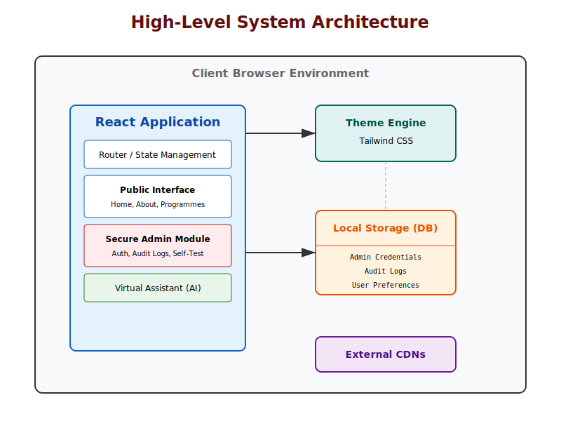
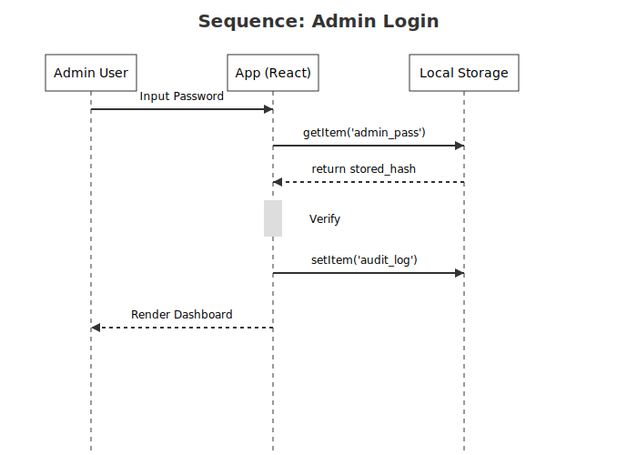
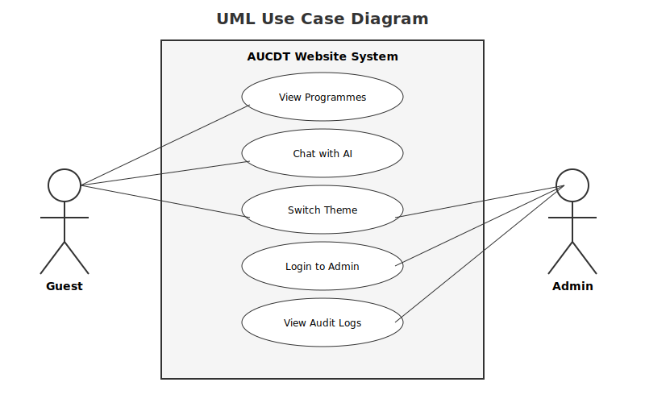
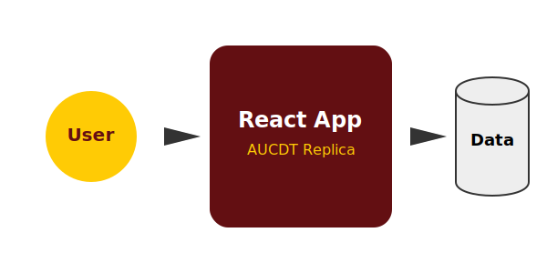
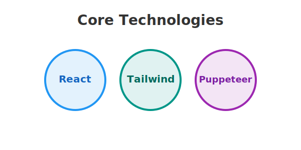

# Software Requirements Specification (SRS)
## Project: AsanSka University College of Design and Technology (AUCDT) Website Replica
**Version:** 2.0 (Final)
**Date:** October 2023

---

## 1. Introduction

### 1.1 Purpose
The purpose of this document is to define the software requirements for the AsanSka University College of Design and Technology (AUCDT) website replica. This project serves as a modernized, React-based frontend implementation of the university's portal, featuring enhanced security, accessibility, and testing infrastructure.

### 1.2 Scope
The software is a Single Page Application (SPA) built with React and Tailwind CSS. Key features include:
*   **Public Portal:** Information regarding admissions, programs, and scholarships.
*   **Theming:** User-selectable Light, Dark, and High Contrast modes.
*   **Admin Module:** Secure dashboard for log monitoring and system self-tests.
*   **AI Assistant:** Virtual agent for FAQ automation.
*   **Testing:** Integrated visual test runner and automated Playwright suite.

---

## 2. Overall Architecture

### 2.1 System Architecture
The system operates entirely client-side, utilizing LocalStorage for data persistence. It is composed of modular React components managed by a central App controller.

### 2.2 Technology Stack
*   **Frontend:** React 18, Tailwind CSS, Lucide React Icons.
*   **State Management:** React Hooks (useState, useEffect).
*   **Testing:** Playwright (Headless Chrome), In-browser Visual Runner.
*   **Persistence:** Browser LocalStorage API.

---

## 3. Detailed Requirements

### 3.1 User Interfaces
*   **REQ-UI-1:** The system shall support a comprehensive theme engine with `light`, `dark`, and `high-contrast` modes.
*   **REQ-UI-2:** The High Contrast mode shall strictly adhere to WCAG AAA contrast ratios (Yellow on Black).
*   **REQ-UI-3:** The layout must be fully responsive across mobile, tablet, and desktop viewports.

### 3.2 Admin & Security
*   **REQ-SEC-1:** Access to the Admin Dashboard requires password authentication (Default: `admin123`).
*   **REQ-SEC-2:** All sensitive actions (login, password change) must be logged to an immutable audit trail.
*   **REQ-SEC-3:** The system shall store encrypted/hashed credentials in LocalStorage (simulated for this replica).

**Admin Login Sequence:**

### 3.3 Data Flow
Data flows primarily between the User Interface and the LocalStorage API. No external database is required for this replica.

**Admin Process Data Flow:**

### 3.4 Use Cases
*   **Guest:** Browse content, interact with Chatbot, Switch Themes.
*   **Admin:** Authenticate, View Logs, Run Diagnostics, Update Security Settings.

### 3.5 Virtual Assistant
*   **REQ-AI-1:** The bot shall handle queries regarding "Admissions", "Fees", and "Location".
*   **REQ-AI-2:** The bot shall simulate typing delays to enhance realism.

### 3.6 Testing Framework
*   **REQ-TEST-1:** The system shall include an integrated "Self-Test" mode that visually validates DOM integrity and Accessibility in real-time.
*   **REQ-TEST-2:** An external Playwright script shall provide headless execution of critical user journeys for CI/CD integration.

---

## 4. Board-Level Visuals

**Simplified Architecture:**

**Core Tech Stack:**

---

## 5. Appendices
*   **Deployment:** See `docs/DeploymentGuide.md`
*   **Administration:** See `docs/AdministratorGuide.md`
*   **Testing:** See `docs/TestingGuide.md`
