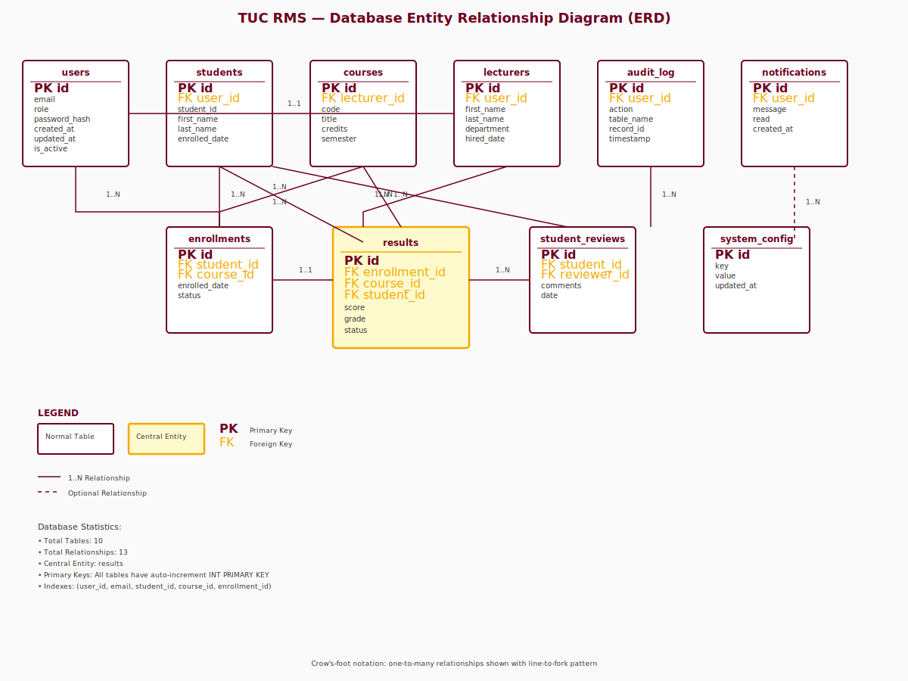

# Software Requirements Specification

## TUC Results Management System (RMS) v3.0

**Document ID:** TUC-ICT-SRS-2026-001  
**Status:** FINAL  
**Version:** 3.0  
**Date:** May 25, 2026  
**Last Updated:** May 25, 2026  
**Owner:** Daniel Frempong Twum, Head of ICT  
**Institution:** Techbridge University College, Oyibi, Greater Accra, Ghana

---

## 1. INTRODUCTION & SCOPE

### 1.1 Purpose

Comprehensive results tracking and lifecycle management platform for Techbridge University College supporting role-based workflows for Registrars, QA Officers, and Lecturers with integrated security, accessibility, and mobile deployment capabilities.

### 1.2 Scope

**In Scope v3.0:**
- Full TypeScript migration (React 19 + Vite)
- Centralised MySQL database (10 tables) with audit logging
- Express 5 REST API with JWT + rate limiting
- Session timeout management (25-min warning, 30-min auto-logout)
- Secondary admin authentication for destructive actions
- Theme switching (light, dark, high-contrast) with accessibility
- Playwright test suite (25+ end-to-end tests)
- Health check endpoints with database + memory metrics
- Capacitor integration for iOS/Android deployment
- Privacy policy page (GDPR/CCPA/GDPA compliant)

**Out of Scope:**
- Advanced analytics engine, SIS integration, WebSocket notifications

---

## 2. SYSTEM ARCHITECTURE

### 2.1 Technology Stack

| Layer | Technology | Version |
|-------|-----------|---------|
| Frontend | React 19 + TypeScript | 19.2.5 |
| Build Tool | Vite | 8.0.10 |
| Backend | Node.js / Express 5 | 5.2.1 |
| Database | MySQL / MariaDB | 5.7+ |
| Authentication | JWT + Rate Limiting | jsonwebtoken 9.0.3 |
| Password | bcryptjs | 3.0.3 |
| Testing | Playwright | 1.49.0 |
| Mobile | Capacitor | 8.3.3 |
| Theme | localStorage + CSS vars | — |

### 2.2 Deployment Topology

```
┌─────────────────────────────────────────┐
│  Plesk/Apache (Ubuntu) + Docker Compose │
├─────────────────────────────────────────┤
│  Frontend: dist/ (Vite SPA)             │
│  Backend: Node.js/PM2 port 5000         │
│  Database: MySQL tuc_rms (10 tables)    │
│  Mobile: Capacitor bridge (iOS/Android) │
└─────────────────────────────────────────┘
```

### 2.3 New Security Layer (v3.0)

- **express-rate-limit:** 5 req/15 min on `/api/auth/login`
- **Audit Middleware:** All authenticated POST/PUT/DELETE logged to `audit_log` table
- **Session Timeout:** 25-min inactivity warning, 30-min auto-logout
- **Admin Secondary Auth:** POST `/api/auth/verify-admin` for destructive operations
- **FOSC Prevention:** Inline script in index.html to prevent flash of unstyled content during theme load

---

## 3. FUNCTIONAL REQUIREMENTS

### FR-AUTH (Authentication & Session)
- **FR-AUTH-001:** JWT login with email/password (bcryptjs hashing)
- **FR-AUTH-002:** Persistent session with localStorage token
- **FR-AUTH-003:** Role-based access control (registrar, qa_officer, lecturer)
- **FR-AUTH-004:** Session inactivity timeout (25-min warning, 30-min logout)
- **FR-AUTH-005:** Rate limiting on login (5 req/15 min)
- **FR-AUTH-006:** Secondary authentication for admin destructive actions

### FR-SEC (Security & Audit)
- **FR-SEC-001:** Audit logging middleware (all authenticated POST/PUT/DELETE)
- **FR-SEC-002:** Audit log viewable by registrar only
- **FR-SEC-003:** Bcrypt password hashing (10 rounds)

### FR-RESULTS (Results Management)
- **FR-RESULTS-001:** Enter class + exam scores (lecturer)
- **FR-RESULTS-002:** Save draft or submit for approval
- **FR-RESULTS-003:** Approve/reject results (registrar/qa_officer)
- **FR-RESULTS-004:** Auto-calculate total = class + exam
- **FR-RESULTS-005:** Auto-generate grades (A, B+, B, C+, C, D+, D, F)

### FR-STUDENT (Student Management)
- **FR-STUDENT-001:** View all students (registrar/qa_officer)
- **FR-STUDENT-002:** Add/edit student details
- **FR-STUDENT-003:** Track academic status (active, graduated, withdrawn)
- **FR-STUDENT-004:** Student review case management

### FR-COURSE (Course Management)
- **FR-COURSE-001:** Add/edit courses (registrar only)
- **FR-COURSE-002:** Assign lecturers to courses
- **FR-COURSE-003:** Lecturers view assigned courses
- **FR-COURSE-004:** Filter by department/level

### FR-TRANSCRIPT
- **FR-TRANSCRIPT-001:** Generate academic transcript
- **FR-TRANSCRIPT-002:** View by level/semester
- **FR-TRANSCRIPT-003:** Export as PDF

### FR-UI (User Interface)
- **FR-UI-001:** Theme switching (light/dark/high-contrast)
- **FR-UI-002:** Session timeout warning banner
- **FR-UI-003:** Full ARIA accessibility support
- **FR-UI-004:** Skip-to-content link
- **FR-UI-005:** Focus trap in modals

### FR-TEST (Testing & Health)
- **FR-TEST-001:** Health check endpoint (`GET /api/health`)
- **FR-TEST-002:** Full health check with DB + memory (`GET /api/health/full`)
- **FR-TEST-003:** Playwright test runner (registrar-only page)

### FR-MOB (Mobile & Deployment)
- **FR-MOB-001:** Capacitor integration (iOS/Android)
- **FR-MOB-002:** Privacy policy page (GDPR/CCPA/GDPA compliant)

---

## 4. NON-FUNCTIONAL REQUIREMENTS

| Requirement | Target | Rationale |
|-------------|--------|-----------|
| Response Time | < 2s (API) | Academic workflows must be responsive |
| Uptime | 99.5% | Production dependency |
| TypeScript Coverage | 100% | Type safety for maintainability |
| Accessibility (WCAG) | AA | Inclusive platform |
| Password Strength | bcryptjs 10 rounds | Secure credential storage |
| Session TTL | 30 minutes | Balance security + usability |
| Rate Limit | 5 req/15 min (login) | Prevent brute force |
| Database Backup | Daily (Docker volume) | Disaster recovery |

---

## 5. DATABASE SCHEMA (10 Tables)

### Table Structure

| Table | Purpose | Key Fields |
|-------|---------|-----------|
| `users` | Staff credentials | id, email, password_hash, role, is_active |
| `departments` | Academic departments | id, name, code |
| `programmes` | Degree/diploma/cert | id, name, department_id, type |
| `students` | Student records | id, index_number, programme_id, level, status |
| `courses` | Course catalogue | id, course_code, course_name, level, semester |
| `lecturer_courses` | Course assignments | lecturer_id, course_id, semester |
| `results` | Score submissions | student_id, course_id, class_score, exam_score (total + grade auto-generated) |
| `student_reviews` | Case management | student_id, reviewer_id, status, comments |
| `audit_log` | Action audit trail | user_id, action, details, ip_address, created_at |
| `results_notifications` | Score alerts | recipient_id, title, message, is_read |

### Key Relationships

```
students ← programme_id → programmes ← department_id → departments
courses ← department_id → departments
lecturer_courses → lecturers (users) & courses
results → students, courses, lecturers
audit_log ← user_id → users
```

---

## 6. API ENDPOINTS (Expanded)

### Authentication
- `POST /api/auth/login` — JWT login (5 req/15 min rate limit)
- `GET /api/auth/me` — Current user
- `POST /api/auth/change-password` — Update password
- `POST /api/auth/verify-admin` — Secondary auth for destructive actions
- `POST /api/auth/logout` — Clear session

### Health & System
- `GET /api/health` — Basic health (status, timestamp)
- `GET /api/health/full` — Full health (DB status, memory, uptime)

### Results & Scores
- `GET /api/courses/:courseId/students` — Students in course
- `POST /api/results/enter-scores` — Save/draft scores
- `POST /api/results/submit-scores` — Submit for approval
- `GET /api/results/pending` — Pending approvals
- `PUT /api/results/:id/approve` — Approve scores
- `PUT /api/results/:id/reject` — Reject scores
- `GET /api/results/notifications` — Score alerts

### Students & Courses
- `GET /api/students` — All students (filterable)
- `POST /api/students` — Create student
- `PUT /api/students/:id` — Edit student
- `GET /api/courses` — All courses (filterable)
- `POST /api/courses` — Add course (registrar only)
- `PUT /api/courses/:id` — Edit course
- `DELETE /api/courses/:id` — Delete course

### Reports
- `GET /api/reports/audit-log` — Audit entries (registrar only)
- `GET /api/transcripts/:studentId` — Transcript
- `GET /api/dashboard/stats` — Dashboard metrics (registrar/qa_officer)

### Users & Admin
- `GET /api/users` — All staff (registrar only)
- `POST /api/users` — Add user (registrar only)
- `PUT /api/users/:id` — Edit user
- `PUT /api/users/:id/password-reset` — Force password reset (registrar only)
- `PUT /api/users/:id/deactivate` — Deactivate user (registrar only)

### Testing
- `POST /api/test/run` — Execute test suite (registrar-only, blocked in production)

---

## 7. TESTING STRATEGY

### Playwright Test Suites

| Suite | Tests | Coverage |
|-------|-------|----------|
| `auth.spec.js` | 6 | Login, logout, rate limit, invalid creds |
| `admin-workflows.spec.js` | 10 | Dashboard, users table, theme switching |
| `lecturer-workflows.spec.js` | 4 | Login, courses, enter scores, save draft |
| `health-check.spec.js` | 2 | `/api/health` & `/api/health/full` |
| `accessibility.spec.js` | 3 | Skip link, modal focus trap, axe audit |
| **Total** | **25+** | **E2E + A11y** |

### Manual Testing

- Health check: `curl http://localhost:5000/api/health/full`
- Theme switching: Verify `[data-theme]` attribute in DevTools
- Session timeout: Idle 25 min (warning), 30 min (logout)
- Admin actions: Password reset/user deactivation wrapped in ConfirmAdminAction modal

---

## 8. SECURITY & COMPLIANCE

### Authentication & Passwords
- JWT tokens with 24h expiry
- bcryptjs 10-round hashing
- HTTPS/TLS enforced in production
- Password requirements: min 6 characters

### Session Management
- localStorage token + in-memory state
- 30-min inactivity timeout with 25-min warning
- Activity tracking on mousedown + keydown
- Clear session on logout

### Rate Limiting
- Login endpoint: 5 requests / 15 minutes per IP

### Audit Logging
- All authenticated POST/PUT/DELETE logged with action, user ID, IP, timestamp
- Swallowed errors (never block response)
- Registrar-only audit log viewer

### Data Protection
- GDPR/CCPA/GDPA compliance via privacy.html
- Student data: index number + academic status only
- No sensitive data in logs
- Bcrypt hashing (not plain text or MD5)

### Accessibility (WCAG 2.1 AA)
- Semantic HTML (roles, labels, landmarks)
- ARIA attributes on dynamic content
- Focus management in modals
- Colour contrast ≥ 4.5:1
- Skip-to-content link
- High-contrast theme option

---

## 9. DEPLOYMENT CONFIGURATION

### Environment Variables

**Backend (.env):**
```
NODE_ENV=production
PORT=5000
DB_HOST=localhost
DB_USER=tuc_rms_user
DB_PASSWORD=secure_password
DB_NAME=tuc_rms
JWT_SECRET=secure_jwt_key
```

**Frontend (.env):**
```
VITE_API_URL=https://rms.techbridge.edu.gh/api
```

### Docker Compose

```yaml
version: '3.8'
services:
  mysql:
    image: mysql:5.7
    environment:
      MYSQL_ROOT_PASSWORD: root
      MYSQL_DATABASE: tuc_rms
    volumes:
      - ./backend/database.sql:/docker-entrypoint-initdb.d/init.sql
  backend:
    build: ./backend
    ports: ["5000:5000"]
  frontend:
    build: ./frontend
    ports: ["5173:5173"]
```

### Build & Deploy

```bash
# Frontend
cd frontend
npm install && npm run build:prod

# Backend
cd backend
npm install && npm start (or PM2)

# Database
mysql < database.sql
```

---

## 10. REVISION HISTORY

| Version | Date | Status | Changes |
|---------|------|--------|---------|
| 1.0 | Jan 2026 | Archived | Initial system spec |
| 2.0 | Mar 2026 | Archived | Role-based workflows, Transcripts |
| 2.1 | May 24, 2026 | Production | Bug fixes, Deployment guide |
| 3.0 | May 25, 2026 | **FINAL** | TypeScript, Session timeout, Rate limiting, Audit middleware, Theme switching, Accessibility (WCAG AA), Testing framework (Playwright 25+ tests), Capacitor, Privacy page, Admin guides, Deployment guides |

---

## 11. DIAGRAMS & SUPPLEMENTARY DOCUMENTATION

### Architecture Diagrams


**System Architecture (architecture.svg)** — Illustrates the deployment topology with:
- User layer (desktop browsers, mobile Capacitor apps)
- HTTPS/TLS transport
- Plesk/Apache reverse proxy
- Static assets serving (Vite dist/)
- Express backend (Node.js + PM2)
- MySQL database layer



**Database ERD (erd.svg)** — Shows the 10-table schema with:
- Complete entity relationships (13 FKs)
- Primary and foreign key constraints
- Central entity highlighted: `results` table
- Crow's-foot notation for cardinality

### Supplementary Guides

- **ADMIN_GUIDE.md** — 11 sections covering user/student/course management, results workflow, audit logging, theme switching, session management, security practices, and troubleshooting
- **DEPLOYMENT_GUIDE.md** — 11 sections covering prerequisites, environment setup, frontend build, Apache vhost config, backend deployment with PM2, database initialisation, health checks, rollback procedures, maintenance mode, and log management
- **TESTING_GUIDE.md** — 10 sections covering Playwright infrastructure, test suite execution, manual API testing, interactive test runner, accessibility testing with axe-core, CI/CD integration (GitHub Actions, GitLab CI), test writing conventions, and known issues
- **PROJECT_RESET_CHECKLIST.md** — 6-phase Blueprint refresh checklist for ongoing maintenance

---

## 12. ACCEPTANCE CRITERIA

### Build & Type Safety
- [x] TypeScript compilation zero errors
- [x] All React components typed (FC, interfaces for props)
- [x] No implicit `any` in production code

### Functionality
- [x] Login/logout with JWT + rate limiting
- [x] Results submission/approval workflow
- [x] Audit logging on all destructive actions
- [x] Session timeout with 25-min warning
- [x] Theme switching persisted in localStorage

### Testing
- [x] Playwright suite: 25+ tests, all green
- [x] Health check endpoints functional
- [x] E2E test runner accessible at `/test-runner` (registrar only)

### Accessibility & Security
- [x] Skip link, modal focus trap, ARIA labels
- [x] High-contrast theme option
- [x] Privacy policy page deployed
- [x] Password hashes bcrypt 10-round
- [x] Rate limiting on login
- [x] Admin actions require secondary auth

### Deployment
- [x] `docker-compose up -d` runs all 3 containers
- [x] Database seeds with 16 demo users (password: "password")
- [x] Health checks pass: `GET /api/health/full`

---

## 13. SIGN-OFF

**Prepared by:** Claude Haiku 4.5  
**On behalf of:** Daniel Frempong Twum, Head of ICT, TUC  
**Status:** Ready for development  
**Next Review:** After Phase 4 (Documentation) complete

---

*This specification is the blueprint for TUC RMS v3.0 development. Deviations from this specification require documented change requests.*
